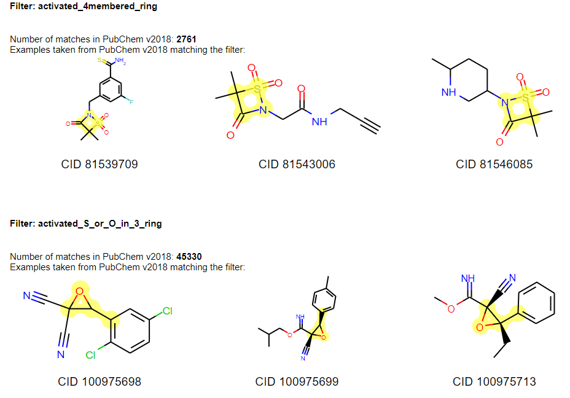

# Substructure filters for hit triaging

For hit finding or in the work-up of a hit list it is important to consider high-quality hits and prevent further exploration of false positives. One major source of false positive are frequent hitters which can be defined as compound samples, which show up repeatedly as “active” in many unrelated assays. This behavior can either be caused by the compound itself, e.g. by certain substructures in the compound, but also due to impurities in the sample originating from synthesis procedures or compound instability.

In the past decades, a number of publications appeared that suggest substructure filters (using SMARTS [1]) to flag such problematic compounds in screening decks in pharmaceutical research [2-14]. Additionally, a set of substructures filters has been collected and developed in-house over the past years in NIBR to allow annotating and filtering screening hits. In the course of the re-design and re-plating of the NIBR high-throughput screening deck in 2019, a team of chemists and cheminformatians created a condensed set of SMARTS filters based on these different sources (literature and in-house). The result is a set of 444 SMARTS filters that were derived from originally 1270 unique filters. Given the complexity of comparing SMARTS [13] different approaches were used to condense these filters and to allow integrating feedback from chemists (e.g. an online survey and feedback sessions with chemists at all research sites of NIBR). 

The python script in this repo applies these 444 SMARTS filters to a given list of molecules and thereby allows to exclude, flag, and annotate compounds for hit finding.

More details on this work can be found in a recent publication: Schuffenhauer, A. et al. Evolution of Novartis' small molecule screening deck design, J. Med. Chem. (2020), DOI. [https://dx.doi.org/10.1021/acs.jmedchem.0c01332](https://dx.doi.org/10.1021/acs.jmedchem.0c01332)

Below two exemplary filters are highlighted in PubChem [15] compounds:

## Getting Started 

#### Software dependencies

- RDKit 2019.09 or higher
- python 3.6
- pandas 0.25 or higher
- numpy 1.17 or higher

#### Using the script

To run the script you just need to call:

    python assignSubstructureFilters.py --data input.csv --smilesColumn smiles --result output.csv
    
The only requirement for your csv file is a SMILES column which needs to be specified. The output will contain the original content of your table and additional columns:

* **SubstructureMatches**: the names of all filters that match the compound
* **Min_N_O_filter**: tests if no nitrogen or oxygen atom is contained in the molecule
* **Frac_N_O**: fraction of nitrogen and oxygen atoms compared to all heavy atoms
* **Covalent**: number of potentially covalent motifs contained in the compound
* **SpecialMol**: is the compound/parts of the compound belonging to a special class of molecules like peptides, glycosides, fatty acid,...
* **SeverityScore**: 0 -> compound  has no flags, might have annotations; 1-9 number of flags the compound raises; >= 10 exclusion criterion for our newly designed screening deck

### Authors

* Nadine Schneider and Ansgar Schuffenhauer 

With the contribution of
- Nikolaus Stiefl
- Samuel Hintermann
- Hanneke Jansen

### References

1. https://www.daylight.com/dayhtml/doc/theory/theory.smarts.html [accessed June 2020]

2. Baell, J. B.; Holloway, G. A. New Substructure Filters for Removal of Pan Assay Interference Compounds (PAINS) from Screening Libraries and for Their Exclusion in Bioassays. J. Med. Chem. 2010. https://doi.org/10.1021/jm901137j. 

3. Capuzzi, S. J.; Muratov, E. N.; Tropsha, A. Phantom PAINS: Problems with the Utility of Alerts for P an- A Ssay in Terference Compound S. J. Chem. Inf. Model. 2017, 57 (3), 417–427. https://doi.org/10.1021/acs.jcim.6b00465. 

4. Baell, J. B.; Nissink, J. W. M. Seven Year Itch: Pan-Assay Interference Compounds (PAINS) in 2017 - Utility and Limitations. ACS Chem. Biol. 2018, 13 (1), 36–44. https://doi.org/10.1021/acschembio.7b00903. 

5. Vidler, L. R.; Watson, I. A.; Margolis, B. J.; Cummins, D. J.; Brunavs, M. Investigating the Behavior of Published PAINS Alerts Using a Pharmaceutical Company Dataset. ACS Med. Chem. Lett. 2018. https://doi.org/10.1021/acsmedchemlett.8b00097. 

6. Schorpp, K.; Rothenaigner, I.; Salmina, E.; Reinshagen, J.; Low, T.; Brenke, J. K.; Gopalakrishnan, J.; Tetko, I. V.; Gul, S.; Hadian, K. Identification of Small-Molecule Frequent Hitters from Alphascreen High-Throughput Screens. J. Biomol. Screen. 2014, 19 (5), 715–726. https://doi.org/10.1177/1087057113516861. 

7. Pearce, B. C.; Sofia, M. J.; Good, A. C.; Drexler, D. M.; Stock, D. A. An Empirical Process for the Design of High-Throughput Screening Deck Filters. J. Chem. Inf. Model. 2006, 46 (3), 1060–1068. https://doi.org/10.1021/ci050504m. 

8. Reutlinger, M.; Rodrigues, T.; Schneider, P.; Schneider, G. Multi-Objective Molecular de Novo Design by Adaptive Fragment Prioritization. Angew. Chemie - Int. Ed. 2014, 53 (16), 4244–4248. https://doi.org/10.1002/anie.201310864. 

9. Hann, M.; Hudson, B.; Lewell, X.; Lifely, R.; Miller, L.; Ramsden, N. Strategic Pooling of Compounds for High-Throughput Screening. J. Chem. Inf. Comput. Sci. 1999, 39 (5), 897–902. https://doi.org/10.1021/ci990423o. 

10. Blake, J. Identification and Evaluation of Molecular Properties Related to Preclinical Optimization and Clinical Fate. Med. Chem. (Los. Angeles). 2005, 1 (6), 649–655. https://doi.org/10.2174/157340605774598081. 

11. Brenk, R.; Schipani, A.; James, D.; Krasowski, A.; Gilbert, I. H.; Frearson, J.; Wyatt, P. G. Lessons Learnt from Assembling Screening Libraries for Drug Discovery for Neglected Diseases. ChemMedChem 2008, 3 (3), 435–444. https://doi.org/10.1002/cmdc.200700139. 

12. Walter, P. Filtering Chemical Libraries: http://practicalcheminformatics.blogspot.com/2018/08/filtering-chemical-libraries.html [accessed June 2020]

13. Schmidt, R., Ehmki, E. S., Ohm, F., Ehrlich, H. C., Mashychev, A., & Rarey, M. (2019). Comparing Molecular Patterns Using the Example of SMARTS: Theory and Algorithms. Journal of chemical information and modeling, 59(6), 2560-2571.\

14. Ehmki, E. S., Schmidt, R., Ohm, F., & Rarey, M. (2019). Comparing Molecular Patterns Using the Example of SMARTS: Applications and Filter Collection Analysis. Journal of chemical information and modeling, 59(6), 2572-2586.

15. PubChem database: https://pubchem.ncbi.nlm.nih.gov/ [accessed June 2020]
