.. _basicManual:

=====================
基础教程
=====================
[`Getting Started with RDKit in Python <https://www.rdkit.org/docs/GettingStartedInPython.html#getting-started-with-the-rdkit-in-python>`__]

基础教程主要对RDKit有一个初步的了解，明白RDKit能做什么，一些常用的功能。
RDKit功能的算法细节，参见高级教程或者参考文献。


.. note:: 

   1. 推荐使用Jupyter Notebook 工具，学习RDKit.
   2. 从2019.03版本及其后续版本不再支持python 2, 支持python2的最后一版是 2018.09。 
   3. rdkit 的版本号 从 1版开始，启用年月的版本号。半年发布一次版本。

现在python 3已经很成熟了，python 2 有的包 python 3 也有了，让我们一起拥抱python 3吧。

本教程中使用到的素材有：

1. 2D分子： `input.mol <../_static/data/rd2020-02-08_151747.952883.mol>`__
2. 2D分子sdf: `5ht2ligs.sdf <../static/data/2d2020-02-08_164246.274263.sdf>`__
3. 3D分子: `1t3r_lig.mol <../static/data/1t3r_lig2020-02-10_105748.328840.mol>`__


读写分子操作
=======================
读分子操作
---------------------------
RDKit 支持从Smiles、mol、sdf 文件中读入分子获得分子对象。
|Smiles、mol 是通常用于保存单个分子；而sdf格式当初是作为分子库形式设计的。
因此读入sdf得到的是分子迭代器,读入Smiles 和mol 文件是分子对象。

示例1： 读入smiles

.. code-block:: py

  smi='CC(C)OC(=O)C(C)NP(=O)(OCC1C(C(C(O1)N2C=CC(=O)NC2=O)(C)F)O)OC3=CC=CC=C3'
  from rdkit import Chem
  from rdkit.Chem import AllChem
  mol = Chem.MolFromSmiles(smi)
  print(type(mol))


显示mol的类型： rdkit.Chem.rdchem.Mol

示例2： 读入mol 文件


.. code-block:: py

  from rdkit import Chem
  mol = Chem.MolFromMolFile('rd.mol')
  print(type(mol))

显示mol的类型： rdkit.Chem.rdchem.Mol

示例3： 读入sdf文件


.. code-block:: py

  from rdkit import Chem
  mols_suppl = Chem.SDMolSupplier('2d.sdf')
  print(type(mols_suppl))

|显示变量mols_suppl的类型：<class 'rdkit.Chem.rdmolfiles.SDMolSupplier'>。
|mols_suppl 可以看成是mol的列表，支持索引操作和迭代操作。


.. code-block:: py

  mol_1= mols_suppl[0]
  print(type(mol_1))
  for mol in mols_suppl:
     print(type(mol))


写分子操作
----------------------------
RDKit 可以把分子对象保存成Smiles、molBlock、mol文件。

示例：

.. code-block:: py

  smi='CC(C)OC(=O)C(C)NP(=O)(OCC1C(C(C(O1)N2C=CC(=O)NC2=O)(C)F)O)OC3=CC=CC=C3'
  mol = Chem.MolFromSmiles(smi)
  smi = Chem.MolToSmiles(mol)
  print(smi)
  molblock = Chem.MolToMolBlock(mol)
  print(molblock)
  print(molblock,file=open('foo.mol','w+'))
  
**print(*objects, sep=' ', end='\n', file=sys.stdout, flush=False)**
python的print函数file参数支持定义输出位置。


操作分子
===========================
获取分子中的原子GetAtoms()
----------------------------
mol对象中有获取所有原子的方法GetAtoms()；
- mol.GetAtoms()

示例：

.. code-block:: py

  from rdkit import Chem
  smi='CC(C)OC(=O)C(C)NP(=O)(OCC1C(C(C(O1)N2C=CC(=O)NC2=O)(C)F)O)OC3=CC=CC=C3'
  mol = Chem.MolFromSmiles(smi)
  atoms = mol.GetAtoms()
  print(type(atoms))
  print(type(atoms[0]))

1. atoms的类型为：<class 'rdkit.Chem.rdchem._ROAtomSeq'> 可以看成是atom的列表。
2. atom的类型：<class 'rdkit.Chem.rdchem.Atom'>

获取分子中的键GetBonds()
-----------------------------
mol对象中有获取所有键的方法GetBonds()；
- mol.GetBonds()

示例：

.. code-block:: py

  from rdkit import Chem
  smi='CC(C)OC(=O)C(C)NP(=O)(OCC1C(C(C(O1)N2C=CC(=O)NC2=O)(C)F)O)OC3=CC=CC=C3'
  mol = Chem.MolFromSmiles(smi)
  bonds = mol.GetBonds()
  print(type(bonds))
  print(type(bonds[0]))

1. bonds的类型为<class 'rdkit.Chem.rdchem._ROBondSeq'>，可以看成是bond的列表。
2. bond的类型为：<class 'rdkit.Chem.rdchem.Bond'>。


根据原子编号获取键GetAtomWithIdx()
-----------------------------------------
获取编号为0的原子

.. code-block:: py

  from rdkit import Chem
  smi='CC(C)OC(=O)C(C)NP(=O)(OCC1C(C(C(O1)N2C=CC(=O)NC2=O)(C)F)O)OC3=CC=CC=C3'
  mol = Chem.MolFromSmiles(smi)
  atom0 = mol.GetAtomWithIdx(0)
  print(type(atom0))


获取原子的坐标信息
------------------------------------
如果导入的分子是有带有坐标信息的，可通过** mol.GetConformer().GetAtomPosition(n)** 获取坐标信息


.. code-block:: py

  mol.GetConformer().GetAtomPosition(1)[0]
  mol.GetConformer().GetAtomPosition(1).x
  mol.GetConformer().GetAtomPosition(1).y
  mol.GetConformer().GetAtomPosition(1).z
  x,y,z =mol.GetConformer().GetAtomPosition(1)
  xyz = list(mol.GetConformer().GetAtomPosition(3))


获取原子信息
-------------------------------
得到原子对象atom, 内置了大量的方法：

1. 'GetAtomMapNum': map id 原子smarts形式冒号后面的数字，如[N:4], map id 就是4。 
#. 'GetAtomicNum'： 获取原子对应的元素编号，如碳原子的AtomicNum就是6
#. 'GetBonds': 该原子参与形成的键的列表。
#. 'GetFormalCharge': 该原子的电荷
#. 'GetChiralTag':原子的手性信息
#. 'GetDegree'： 原子的度，这里的度指的是这个原子参与形成键的数目
#.  'GetIsAromatic': 判断原子是否是芳香性原子
#.  'GetIdx'： 获取原子的编号
#.  'GetNeighbors'： 获取相连的原子列表
#. 'GetSmarts'： 获取原子的Smarts形式
#. 'GetSymbol'：获取原子的元素符号
#. IsInRing()： 判断原子是否在环上
#. IsInRingSize(n): 判断原字是否在n-元环上

更多方法参见`rdkit.Chem.rdchem.Atom <https://www.rdkit.org/docs/source/rdkit.Chem.rdchem.html>`_。


根据键的编号获取键GetBondWithIdx( )
-----------------------------------------------
获取编号为1的键

.. code-block:: py

  from rdkit import Chem
  smi='CC(C)OC(=O)C(C)NP(=O)(OCC1C(C(C(O1)N2C=CC(=O)NC2=O)(C)F)O)OC3=CC=CC=C3'
  mol = Chem.MolFromSmiles(smi)
  bond1 = mol.GetBondWithIdx(1)
  print(type(bond1))


获取键的信息
--------------------------------
得到键对象bond, 内置了大量的方法：

1. GetBondType()：获取键的类型
2. 'GetBeginAtom()': 组成键的第一个原子
3. GetBeginAtomIdx()： 键的第一个组成原子编号
4. GetEndAtomIdx()：键的第二个组成原子编号
5. 'GetEndAtom()': 组成键的第二个原子
6. 'IsInRing()': 判断是否在环上
7. 'IsInRingSize(n)'：判断是否在n-元环上


更多方法参见`rdkit.Chem.rdchem.Bond <https://www.rdkit.org/docs/source/rdkit.Chem.rdchem.html#rdkit.Chem.rdchem.Bond>`_。


.. note::
	rdkit采用的是最小成环原则: 比如两个环并在一起，从数学上看可以看成是2个小环，一个大环。在rdkit中计算环的时候只考虑小环。

如下图所示，我们构建了一个4元环并3元环的分子；


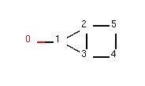

	图 分子（'OC1C2C1CC2）

我们可以看到该分子是由3元环并4元环组成的，其中原子2和原子3位于3元环和4元环的公共边上。


.. code-block:: py

  from rdkit import Chem
  m = Chem.MolFromSmiles('OC1C2C1CC2')
  atom2  = m.GetAtomWithIdx(2)
  print("atom2 in ring:",atom2.IsInRing())
  print("atom2 in 3-ring:",atom2.IsInRingSize(3))
  print("atom2 in 4-ring:",atom2.IsInRingSize(4))
  print("atom2 in 5-ring:",atom2.IsInRingSize(5))
  
输出：

.. code-block:: console

  atom2 in ring: True
  atom2 in 3-ring: True
  atom2 in 4-ring: True
  atom2 in 5-ring: False


获取分子中所有的环 GetSymmSSSR(m)
---------------------------------------
获取分子中所有的环，以及每个环对应的原子组成。
如下图所示，我们构建了一个4元环并3元环的分子；


	图 分子（'OC1C2C1CC2）


.. code-block:: py

  from rdkit import Chem
  m = Chem.MolFromSmiles('OC1C2C1CC2')
  ssr = Chem.GetSymmSSSR(m)
  num_ring = len(ssr)
  print("num of ring",num_ring)
  for ring in ssr:
      print("ring consisted of atoms id:",list(ring))
  
输出：

.. code-block:: console

  num of ring 2
  ring consisted of atoms id: [1, 2, 3]
  ring consisted of atoms id: [4, 5, 2, 3]

通过计算，我们发现示例分子一共有2个环，第一个环由3个原子（原子1、2、3）组成，
第二个环由4个原子组成（原子4,5,2,3）。


获取分子中环的个数 Chem.GetSSSR(m)
------------------------------------

.. code-block:: py

  from rdkit import Chem
  m = Chem.MolFromSmiles('OC1C2C1CC2')
  num_ring  = Chem.GetSSSR(m)
  print("num rings:",num_ring)

输出：

.. code-block:: console

  num rings: 2


获取分子中环的信息 m.GetRingInfo()
------------------------------------------

rdkit.Chem.rdchem.RingInfo

.. code-block:: py

  from rdkit import Chem
  m = Chem.MolFromSmiles('OC1C2C1CC2')
  ri = m.GetRingInfo()
  print(type(ri))
  
ri的类型为 rdkit.Chem.rdchem.RingInfo。
RingInfo 对象中内置了多种方法：

1. NumAtomRings(n)： 原子n是否在环上； 
#. IsAtomInRingOfSize(1,3): 原子1是否在3元环上。

更多方法参见 `rdkit.Chem.rdchem.RingInfo <https://www.rdkit.org/docs/source/rdkit.Chem.rdchem.html#rdkit.Chem.rdchem.RingInfo>`_


修改分子
=====================


增删H原子
------------------------

1.增加氢原子：Chem.AddHs()；
2. 删除氢原子：Chem.RemoveHs(m2)

RDKit 中的分子默认采用隐式H原子形式。
RDKit 中提供了Chem.AddHs()方法，添加H原子。

.. code-block:: py

  from rdkit import Chem
  m = Chem.MolFromSmiles('OC1C2C1CC2')
  m2 = Chem.AddHs(m)
  print("m Smiles:",Chem.MolToSmiles(m))
  print("m2 Smiles:",Chem.MolToSmiles(m2))
  print("num ATOMs in m:",m2.GetNumAtoms())
  print("num ATOMs in m2:",m.GetNumAtoms())

输出：

.. code-block:: console

  m Smiles: OC1C2CCC12
  m2 Smiles: [H]OC1([H])C2([H])C([H])([H])C([H])([H])C12[H]
  num ATOMs in m: 14
  num ATOMs in m2: 6

**3D构象优化的时候，需要采用显式H原子**


芳香共轭键和库里单双键Chem.Kekulize(m)
-----------------------------------------------
RDKit 默认把芳香体系的键的类型识别为芳香键。

以苯为例：

.. code-block:: py

  m = Chem.MolFromSmiles('c1ccccc1')
  for bond in m.GetBonds():
      print(bond.GetBondType())

输出：

.. code-block:: console

  AROMATIC
  AROMATIC
  AROMATIC
  AROMATIC
  AROMATIC
  AROMATIC


将芳香键的类型修改为单双键的类型Chem.Kekulize(m)


.. code-block:: py

  m = Chem.MolFromSmiles('c1ccccc1')
  Chem.Kekulize(m)
  for bond in m.GetBonds():
      print(bond.GetBondType())

  print("bond 1 is aromatic",m.GetBondWithIdx(1).GetIsAromatic())
  print("atom 1 is aromatic",m.GetAtomWithIdx(1).GetIsAromatic())
    
输出：

.. code-block:: console

  DOUBLE
  SINGLE
  DOUBLE
  SINGLE
  DOUBLE
  SINGLE
  bond 1 is aromatic True
  atom 1 is aromatic True
  
尽管键的类型更改为单双键的形式，但是原子和键的本质依旧是芳香性的。

强制修改键的类型形式和本质：  Chem.Kekulize(m1, clearAromaticFlags=True) 不建议使用。

将键的类型恢复到芳香键的形式： Chem.SanitizeMol(m)


处理2D分子：描述
================================================
Smiles 可以看成分子的1D形式，分子的平面结构可以看成分子的2D形式。


产生2D坐标AllChem.Compute2DCoords(m)
---------------------------------------------
- AllChem.Compute2DCoords(m)产生固定的独一无二的取向。


.. note::
	该算法能够减少分子中原子在平面内的碰撞，使得绘制的分子更加清晰。
  对于复杂分子如青蒿素依旧不能解决平面碰撞问题。


  
可用于作为绘制分子的模板。

如果有多个分子共享一个骨架，我们希望绘图的时候能够保证在这些分子中的骨架方向是一致的。
首先把骨架提取成绘图模板，然后在绘图上添加基团。


举例子:

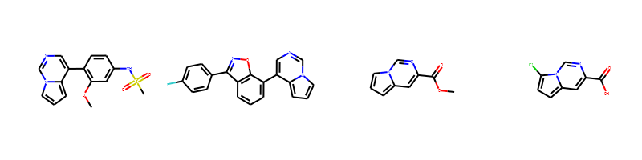

	图 含吡咯并嘧啶子结构的化合物

我们可以看到这4个结构都含有吡咯并嘧啶（c1nccc2n1ccc2）的子结构，
但是在图片上他们的子结构取向不一致，不便于比较他们的结构。
我们可以采用模板绘制法，固定公共子结构的取向。

代码：

.. code-block:: py

  from rdkit.Chem import Draw
  from rdkit import Chem
  smis=[
      'COC1=C(C=CC(=C1)NS(=O)(=O)C)C2=CN=CN3C2=CC=C3',
  #     'CCN(CC1=C(C=CC(=C1)C(F)(F)F)C2=CC(=C3N2C=NC=C3)CC(=O)O)C(=O)C4CC4',
      'C1=CC2=C(C(=C1)C3=CN=CN4C3=CC=C4)ON=C2C5=CC=C(C=C5)F',
      'COC(=O)C1=CC2=CC=CN2C=N1',
      'C1=C2C=C(N=CN2C(=C1)Cl)C(=O)O',
  ]
  template = Chem.MolFromSmiles('c1nccc2n1ccc2')
  AllChem.Compute2DCoords(template)
  mols=[]
  for smi in smis:
      mol = Chem.MolFromSmiles(smi)
      AllChem.GenerateDepictionMatching2DStructure(mol,template)
      mols.append(mol)
  img=Draw.MolsToGridImage(mols,molsPerRow=4,subImgSize=(200,200),legends=['' for x in mols])
  img

输出：

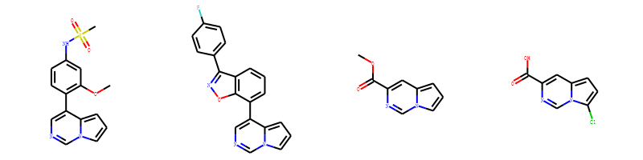

这样我们就可以很清楚的看出这4个分子取代基团和位置的差异。


基于3D构象产生2D取向 AllChem.GenerateDepictionMatching3DStructure()
-----------------------------------------------------------------------
rdkit 支持2D取向和3D取向对应。
这里以PDB CODE: 1T3R为例。我们获得其中的ligand并保存为mol文件。
经过测试发现产生的2D结构会有碰撞，该方法尚不成熟。


处理3D分子
=========================================================================
RDKit中内置了2种不同的方法产生分子构象。
方法一： 距离几何法[1]
```
1. 基于链接表和规则计算分子中原子的距离矩阵；
2. 使用三角平滑算法对距离矩阵进行优化；
3. 产生一个随机距离矩阵；
4. 为每个原子产生一个坐标；
5. 使用粗糙的立场对坐标进行优化
```
通过该方法产生的3D构象通常很丑陋。需要进一步通过力场进行美化。RDKit美化分子构象使用的是UFF力场【2】
方法二：基于CSD的扭转角偏好方法【18？】
通过该方法产生的构象不需要进一步通过力场进行优化。
从2018.09版本开始，RDKit产生3D构象的默认方法是方法二ETKDG。

产生3D构象 AllChem.EmbedMolecule(m)
---------------------------------------------

.. note::
	产生3D构象前，需要为分子添加H原子。
	
- m2=Chem.AddHs(mol)   加氢原子
- AllChem.EmbedMolecule(mol)  2D->3D化
- m3 = Chem.RemoveHs(m2)  删除氢原子


产生多个3D构象
---------------------------------------------------------------

- AllChem.EmbedMultipleConfs(m2, numConfs=10) :为m2分子产生10个构象，保存在m2分子中。
- 访问指定构象： m2.GetConformer(1)
- 获取构象：m2.GetConformers()

产生多个构象比较耗时，支持多线程加速。

cids = AllChem.EmbedMultipleConfs(m2,numConfs=10, numThreads=4)


产生10个构象；
.. code-block:: py

  cids = AllChem.EmbedMultipleConfs(m2, numConfs=10)
  m2.GetConformers()
  m2.GetConformer(1)


计算构象的RMSD
-------------------------------------------------------
- 计算其他构象和第一个构象的RMSD值

.. code-block:: py

  rmslist = []
  AllChem.AlignMolConformers(m2, RMSlist=rmslist)

- 计算指定两个构象的RMSD值

.. code-block:: py

  rms = AllChem.GetConformerRMS(m2, 1, 9, prealigned=True)


MMFF力场对构象进行优化AllChem.MMFFOptimizeMoleculeConfs
--------------------------------------------------------------

.. code-block:: py

  res = AllChem.MMFFOptimizeMoleculeConfs(m2)

构象优化比较耗时，支持多线程加速。

多线程： res = AllChem.MMFFOptimizeMoleculeConfs(m2, numThreads=0)


保存分子对象
=====================================
RdDkit 内置了2种保存分子对象的方法。

1. 分子对象可以使用python的pickling机制进行保存。pkl = pickle.dumps(m)
RDKit的pickle文件非常紧凑，从pickle文件中加载分子比Mol文件和SMILES字符串快很多。
对于经常使用的分子保存为pickle 是一个好主意。
#. 分子对象也可以保存为普通的二进制文件。binStr = m.ToBinary()

二进制文件的大小和分子大小有关系，而pickle文件和分子大小关系不明显。推荐大家用pickle保存文件。
pickle文件比sdf文件更小，加载速度更快。


绘制分子【可视化分子】
==============================
这里主要介绍绘制分子的常规方法，更多自定义绘制，参见进阶教程。
rdkit 内置了Draw模块，用于绘图，把一些经常用到的方法直接放在Draw下面。


分子对象转化为图片
--------------------------------
- Draw.MolToFile(mol,'filename.png')


显示分子中原子的编号
-----------------------------------------------

示例代码

.. code-block:: py

  from rdkit import Chem
  from rdkit.Chem import  Draw
  from rdkit.Chem.Draw import IPythonConsole #Needed to show molecules
  from rdkit.Chem.Draw.MolDrawing import MolDrawing, DrawingOptions #Only needed if modifying defaults
  opts =  DrawingOptions()
  opts.includeAtomNumbers=True
  m = Chem.MolFromSmiles('OC1C2C1CC2')
  opts.includeAtomNumbers=True
  opts.bondLineWidth=2.8
  Draw.MolToImage(m,options=opts)
  

输出：

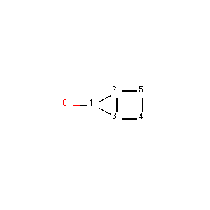

  
  

多个分子按照grid显示
-----------------------------------------------

示例代码

.. code-block:: py

  from rdkit.Chem import Draw
  from rdkit import Chem
  smis=[
      'COC1=C(C=CC(=C1)NS(=O)(=O)C)C2=CN=CN3C2=CC=C3',
      'C1=CC2=C(C(=C1)C3=CN=CN4C3=CC=C4)ON=C2C5=CC=C(C=C5)F',
      'COC(=O)C1=CC2=CC=CN2C=N1',
      'C1=C2C=C(N=CN2C(=C1)Cl)C(=O)O',
  ]
  mols=[]
  for smi in smis:
      mol = Chem.MolFromSmiles(smi)
      mols.append(mol)
  img=Draw.MolsToGridImage(mols,molsPerRow=4,subImgSize=(200,200),legends=['' for x in mols])
  img
  
输出：


多个分子基于公共骨架按照grid显示
-------------------------------------------------
上述分子的公共结构，取向不一致，不便于分析。引入template作图法，可调整取向。

示例代码：

.. code-block:: py

  from rdkit.Chem import Draw
  from rdkit import Chem
  smis=[
      'COC1=C(C=CC(=C1)NS(=O)(=O)C)C2=CN=CN3C2=CC=C3',
  #     'CCN(CC1=C(C=CC(=C1)C(F)(F)F)C2=CC(=C3N2C=NC=C3)CC(=O)O)C(=O)C4CC4',
      'C1=CC2=C(C(=C1)C3=CN=CN4C3=CC=C4)ON=C2C5=CC=C(C=C5)F',
      'COC(=O)C1=CC2=CC=CN2C=N1',
      'C1=C2C=C(N=CN2C(=C1)Cl)C(=O)O',
  ]
  template = Chem.MolFromSmiles('c1nccc2n1ccc2')
  AllChem.Compute2DCoords(template)
  mols=[]
  for smi in smis:
      mol = Chem.MolFromSmiles(smi)
      AllChem.GenerateDepictionMatching2DStructure(mol,template)
      mols.append(mol)
  
  
  img=Draw.MolsToGridImage(mols,molsPerRow=4,subImgSize=(200,200),legends=['' for x in mols])
  img


输出：


子结构搜索
=====================================
子结构搜索可以通过SMARTS匹配符完成。


判断是否有子结构m.HasSubstructMatch(patt)
------------------------------------------------
首先创建分子对象，然后定义匹配模式，最后判断是否有子结构。

匹配模式：支持Chem.MolFromSmarts()  和 Chem.MolFromSmiles() 两种形式。
Smarts的表现形式更加丰富。

示例代码：

.. code-block:: py

  m = Chem.MolFromSmiles('c1ccccc1OC')
  patt = Chem.MolFromSmarts('OC')
  flag =m.HasSubstructMatch(patt)
  if flag:
      print("molecu m contains group -OCH3")
  else:
      print("molecu m don't contain group -OCH3")
    
我们可以知道甲氧基苯含有甲氧基基团。    


获取第一个子结构对应的原子编号m.GetSubstructMatch()
-------------------------------------------------------
我们以甲氧基苯为例：

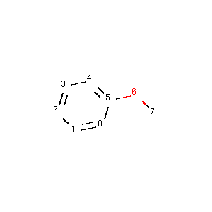

查找-OCH3 对应的原子编号。

代码：

.. code-block:: py

  m = Chem.MolFromSmiles('c1ccccc1OC')
  patt = Chem.MolFromSmarts('OC')
  flag =m.HasSubstructMatch(patt)
  if flag:
      atomids = m.GetSubstructMatch(patt)
      print("matched atom id:",atomids)
  else:
      print("molecu m don't contain group -OCH3")

输出： matched atom id: (6, 7)。

从输出我们知道6号原子对应的是甲氧基原子的O原子，7号原子对应的是甲氧基原子的C原子。


.. note::
	原子的先后顺序和SMARTS 一一对应。
	
	
	
获取对应所有子结构（m.GetSubstructMatches）对相应的原子编号
-----------------------------------------------------------
示例分子：

查找里面的甲氧基对应的原子编号。


.. code-block:: py
  
  m = Chem.MolFromSmiles('c1ccc(OC)cc1OC')
  patt = Chem.MolFromSmarts('OC')
  flag =m.HasSubstructMatch(patt)
  if flag:
      atomids = m.GetSubstructMatches(patt)
      print("matched atom id:",atomids)
  else:
      print("molecu m don't contain group -OCH3")
  
输出： matched atom id: ((4, 5), (8, 9))


子结构搜索考虑手性
----------------------------------------
help(rdkit.Chem.rdchem.Mol.HasSubstructMatch)
默认是不考虑手性的，  useChirality=False。

.. note::
  不考虑手性的时候，有手性的分子可以匹配无手性的模式和错误手性的模式。
	考虑手性的时候：
	有手性信息的分子可以匹配无手性的模式；
	无手性信息的分子不能匹配有手性的模式。
	

不考虑手性示例代码：

.. code-block:: py
  
  m = Chem.MolFromSmiles('CC[C@H](F)Cl')
  print(m.HasSubstructMatch(Chem.MolFromSmiles('C[C@H](F)Cl')))
  print(m.HasSubstructMatch(Chem.MolFromSmiles('C[C@@H](F)Cl')))
  print(m.HasSubstructMatch(Chem.MolFromSmiles('CC(F)Cl')))


输出：

.. code-block:: console

  True
  True
  True


考虑手性，示例代码：


.. code-block:: py

  m = Chem.MolFromSmiles('CC[C@H](F)Cl')
  a=m.HasSubstructMatch(Chem.MolFromSmiles('C[C@H](F)Cl'),useChirality=True)
  b=m.HasSubstructMatch(Chem.MolFromSmiles('C[C@@H](F)Cl'),useChirality=True)
  c=m.HasSubstructMatch(Chem.MolFromSmiles('CC(F)Cl'),useChirality=True)
  print(a)
  print(b)
  print(c)
	
开启手性匹配的时候，有手性信息的分子可以匹配无手性的模式和对应手性的模式；

输出：

.. code-block:: console

  True
  False
  True

考虑手性，示例代码：

.. code-block:: py

  m2 = Chem.MolFromSmiles('CCC(F)Cl')
  print(m2.HasSubstructMatch(Chem.MolFromSmiles('C[C@H](F)Cl'),useChirality=True))

输出是False,说明没有手性的分子不能匹配到手性模式。

可视化匹配的片段
--------------------------------

SMARTS 
================================================
SMARTS 在子结构匹配、化学反应等方面发挥着重要作用。
常用的SMARTS知识:

1. C c 大写小写C是不一样的，大写代表脂肪碳；小写代表芳香碳。
#. 冒号后面的数字为Atom Map ID
#. 羟基O的表示 []


化学转换
===================================
RDKit中包含了大量修改分子的函数。
这些函数仅仅是对分子做简单的变换。
对于复杂变换参见`化学反应`_ 小节。`化学反应`_


删除子结构 AllChem.DeleteSubstructs(m,patt)
----------------------------------------------------
创建分子对象和子结构对象，然后执行 AllChem.DeleteSubstructs(m,patt)方法，
就能得到一个删除子结构的新的分子对象。

如删除甲氧基苯上面的甲氧基基团。

示例代码：

.. code-block:: py

  from rdkit import Chem
  from rdkit.Chem import AllChem
  from rdkit.Chem import Draw
  m = Chem.MolFromSmiles('c1ccccc1OC')
  patt = Chem.MolFromSmarts('OC')
  m2=AllChem.DeleteSubstructs(m,patt)
  mols=[m,m2]
  Draw.MolsToGridImage(mols,molsPerRow=4,subImgSize=(200,200),legends=['' for x in mols])

输出：

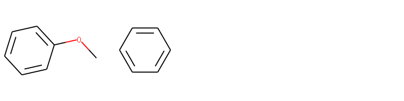

我们可以删除甲氧基后得到一个新的分子苯。


取代基替换 AllChem.ReplaceSubstructs(m,patt,repl)
------------------------------------------------------
我们利用定义一些取代基[-Cl,-Br,-OH,-NO2等]，然后来替换甲氧基苯上的甲氧基。
从而能够能够产生一系列的衍生物。


代码如下：

.. code-block:: py

  from rdkit import Chem
  from rdkit.Chem import AllChem
  from rdkit.Chem import Draw
  m = Chem.MolFromSmiles('COc1c(Br)cccc1OC')
  patt = Chem.MolFromSmarts('OC')
  repsmis= ['F','Cl','Br','O']
  mols=[]
  mols.append(m)
  for r in repsmis:
      rep = Chem.MolFromSmarts(r)
      res = AllChem.ReplaceSubstructs(m,patt,rep)
      mols.extend(res)
  smis = [ Chem.MolToSmiles(mol)      for mol in mols]
  mols = [Chem.MolFromSmiles(smi)  for smi in smis]
  Draw.MolsToGridImage(mols,molsPerRow=3,subImgSize=(200,200),legends=['' for x in mols])
  
输出：

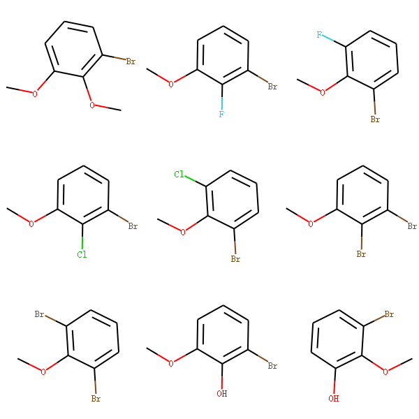

替换操作返回的是分子对象操作列表，
如果分子只有一个地方匹配到，则返回一个分子的列表。
如果分子中有2个地方匹配到，则返回2个分子的列表。
为了标准化smiles,可以将得到的分子mol-》smiles->mol,然后对其可视化。


SAR分析——core可视化Chem.ReplaceSidechains(m1,core)
---------------------------------------------------------
Chem.ReplaceSidechains(m1,core) : 我们需要定义分子对象，骨架分子；
然后执行ReplaceSidechains函数，删除侧链就能得到骨架可视化。

整个过程中不需要定义侧链。

侧链+骨架=分子 


我们创建了分子，如下图所示。

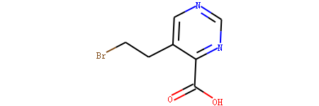

定义嘧啶为核心结构。通过RDKit可以对其骨架可视化。

示例代码：

.. code-block:: py

  m1 = Chem.MolFromSmiles('BrCCc1cncnc1C(=O)O')
  core = Chem.MolFromSmiles('c1cncnc1')
  tmp = Chem.ReplaceSidechains(m1,core)
  tmp 

输出：

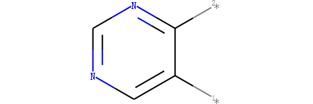

我们可以看到嘧啶骨架上有两个地方连接侧链。

SAR分析——sidechain可视化Chem.ReplaceCore(m1,core)
---------------------------------------------------------
Chem.ReplaceCore(m1,core) : 我们需要定义分子对象，骨架分子；
然后执行Chem.ReplaceCore(m1,core)函数，删除骨架就能得到侧链。

整个过程中不需要定义侧链。

侧链+骨架=分子 

Chem.ReplaceCore(m1,core)

我们创建了分子，如下图所示。


定义嘧啶为核心结构。通过RDKit可以对其侧链可视化。

示例代码：

.. code-block:: py

  m1 = Chem.MolFromSmiles('BrCCc1cncnc1C(=O)O')
  core = Chem.MolFromSmiles('c1cncnc1')
  tmp = Chem.ReplaceCore(m1,core)
  tmp

输出：

.. image:: _static/sidechain2020-02-11_102659.796376.png
	:width: 300
	:align: center


.. note::
	侧链的编号默认是从1开始，取决于算法找到侧链的先后顺序。
	也可以根据侧链链接连接到骨架上的原子进行编号 tmp=Chem.ReplaceCore(m1,core,labelByIndex=True)。


拆分片段 Chem.GetMolFrags(tmp,asMols=True)
----------------------------------------------------------
删除得到的侧链tmp 包含多个片段，我们可通过GetMolFrags获得里面的片段。
rs = Chem.GetMolFrags(tmp,asMols=True)

对多个分子进行SAR分析(待完成)
---------------------------------------------------------
以下述结构为例，发现其公共子结构是溴苯。


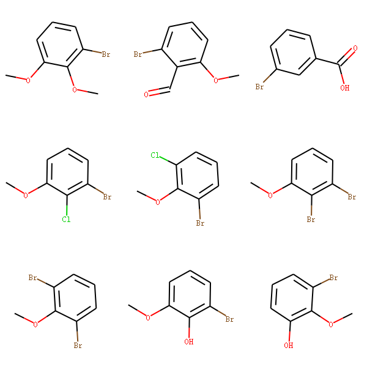


计算公共子结构的方法，参见``_小节。

首先获取溴苯的骨架可视化。

示例代码：

.. code-block:: py

  from rdkit import Chem
  from rdkit.Chem import AllChem
  from rdkit.Chem import Draw
  m = Chem.MolFromSmiles('COc1c(Br)cccc1OC')
  core = Chem.MolFromSmiles('c1c(Br)cccc1')
  core_v = Chem.ReplaceSidechains(m,core)
  core_v

输出：


然后对其侧链进行可视化：

多个分子的难点是取代基的编号如何统一？


获取分子骨架Murcko Decomposition
--------------------------------------------
把分子中环结构提取出来，然后保留连接环结构的最少的键，如果该结构上的原子直接相连双键，
则保留双键，得到的结构称为Murcko骨架。

这里我以泽布替尼、瑞德西韦和氯胺酮为例。

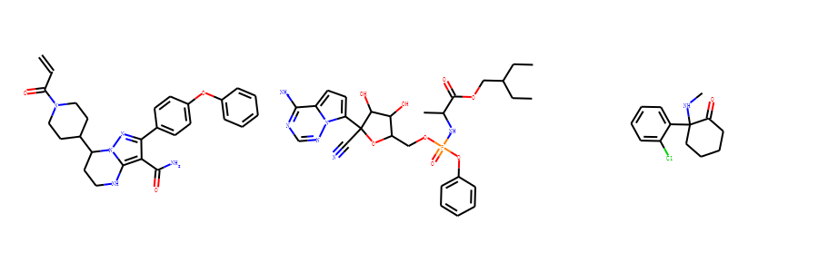


我们借助Murcko算法可以自动提取里面的骨架。

示例代码：

.. code-block:: py

  from rdkit import Chem
  from rdkit.Chem.Scaffolds import MurckoScaffold
  m1 = Chem.MolFromSmiles('C=CC(=O)N1CCC(CC1)C2CCNC3=C(C(=NN23)C4=CC=C(C=C4)OC5=CC=CC=C5)C(=O)N')
  m2 = Chem.MolFromSmiles('CCC(CC)COC(=O)C(C)NP(=O)(OCC1C(C(C(O1)(C#N)C2=CC=C3N2N=CN=C3N)O)O)OC4=CC=CC=C4')
  m3= Chem.MolFromSmiles('CNC1(CCCCC1=O)C1=CC=CC=C1Cl')
  core_m1 = MurckoScaffold.GetScaffoldForMol(m1)
  core_m2 = MurckoScaffold.GetScaffoldForMol(m2)
  core_m3 = MurckoScaffold.GetScaffoldForMol(m3)
  core_mols=[core_m1,core_m2,core_m3]
  Draw.MolsToGridImage(core_mols,molsPerRow=3,subImgSize=(300,300),legends=['' for x in core_mols])

输出为

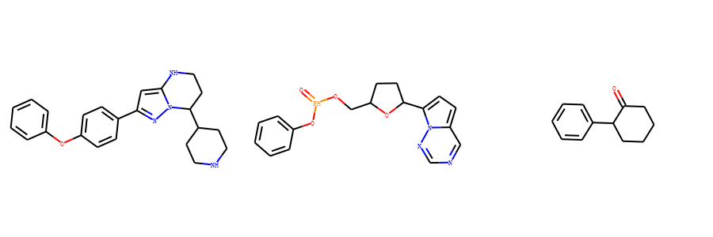


最大公共子结构FindMCS
---------------------------------------
RDKit内置了计算最大公共子结构的函数FindMCS，
接受
必须参数：带计算的分子列表。
可选参数：

1. bondCompare 回调函数
2. atomCompare 回调函数
3. timeout 

返回的是 rdkit.Chem.rdFMCS.MCSResult 对象。

更多细节参见 `rdkit.Chem.rdFMCS <https://www.rdkit.org/docs/source/rdkit.Chem.rdFMCS.html>`_


以如下3个分子为例，计算他们的最大公共子结构。


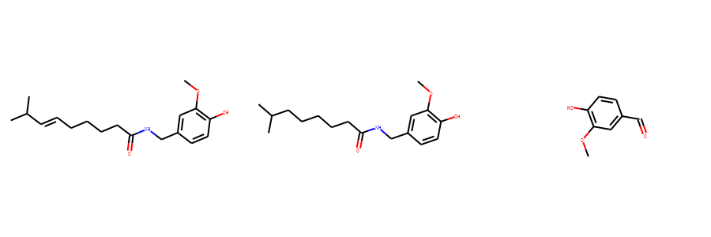

示例代码：

.. code-block:: py

  from rdkit.Chem import rdFMCS
  from rdkit import Chem
  mol1 = Chem.MolFromSmiles("O=C(NCc1cc(OC)c(O)cc1)CCCC/C=C/C(C)C")
  mol2 = Chem.MolFromSmiles("CC(C)CCCCCC(=O)NCC1=CC(=C(C=C1)O)OC")
  mol3 = Chem.MolFromSmiles("c1(C=O)cc(OC)c(O)cc1")
  mols = [mol1,mol2,mol3]
  res=rdFMCS.FindMCS(mols)
  common=Chem.MolFromSmarts(res.smartsString)
  common

输出：

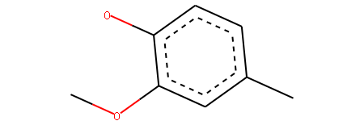

默认atomCompare 和 bondCompare 采用
(AtomCompare)atomCompare=rdkit.Chem.rdFMCS.AtomCompare.CompareElements 要求他们元素相同和
(BondCompare)bondCompare=rdkit.Chem.rdFMCS.BondCompare.CompareOrder 有相同的键的类型。

atomCompare也有其他的内置函数如：

1. rdkit.Chem.rdFMCS.AtomCompare.CompareElements
#. CompareAny = rdkit.Chem.rdFMCS.AtomCompare.CompareAny
#. CompareAnyHeavyAtom = rdkit.Chem.rdFMCS.AtomCompare.CompareAnyHeavyAtom
#. CompareElements = rdkit.Chem.rdFMCS.AtomCompare.CompareElements
#. CompareIsotopes = rdkit.Chem.rdFMCS.AtomCompare.CompareIsotopes

bondCompare也有其他的内置函数如：

1. CompareAny = rdkit.Chem.rdFMCS.BondCompare.CompareAny
#. CompareOrder = rdkit.Chem.rdFMCS.BondCompare.CompareOrder
#. CompareOrderExact = rdkit.Chem.rdFMCS.BondCompare.CompareOrderExac

MCS算法搜索公共子结构的通常花费几秒钟的时间，如果遇到复杂结构，通常需要几分钟甚至更长时间。
默认timeout=3600秒。如果超过默认时间，则这个res.canceled属性会被设置成True。

示例代码：

.. code-block:: py

  mols = [Chem.MolFromSmiles("Nc1ccccc1"*10), Chem.MolFromSmiles("Nc1ccccccccc1"*10)]
  rs=rdFMCS.FindMCS(mols, timeout=1)
  print(rs.canceled)
  print(rs.smartsString)

输出：

.. code-block:: console

  True
  [#7]-[#6](:[#6]:[#6]):[#6](:[#6]:[#6])-[#7]-[#6](:[#6]:[#6]):[#6](:[#6]:[#6])-[#7]-[#6](:[#6]:[#6]):[#6](:[#6]:[#6])-[#7]-[#6](:[#6]:[#6]):[#6](:[#6]:[#6])-[#7]-[#6](:[#6]:[#6]):[#6](:[#6]:[#6])-[#7]-[#6](:[#6]:[#6]):[#6](:[#6]:[#6])-[#7]-[#6](:[#6]:[#6]):[#6](:[#6]:[#6])-[#7]-[#6](:[#6]:[#6]):[#6](:[#6]:[#6])-[#7]-[#6](:[#6]:[#6]):[#6](:[#6]:[#6])-[#7]-[#6](:[#6]:[#6]:[#6]):[#6]:[#6]

到达timeout 会返回目前找到的最大子结构。


指纹和相似性
===========================================

RDKit 内置了多种分子指纹计算方法，如：

1. 拓扑指纹 Chem.RDKFingerprint(mol) 
#. MACCS 指纹
#. Atom Pairs 
#. topological torsions
#. 摩根指纹（圆圈指纹）
#. 摩根指纹拓展


More details about the algorithm used for the RDKit fingerprint can be found in the “RDKit Book”.
RDKit中分子指纹的细节在RDkit Book中。


拓扑指纹 Chem.RDKFingerprint(x) 
------------------------------------

示例代码：

.. code-block:: py

  ms = [Chem.MolFromSmiles('CCOC'), Chem.MolFromSmiles('CCO'), Chem.MolFromSmiles('COC')]
  fps = [Chem.RDKFingerprint(x) for x in ms]

MACCS 指纹MACCSkeys.GenMACCSKeys(mol)
------------------------------------
示例代码：

.. code-block:: py

 from rdkit.Chem import MACCSkeys
 fps = [MACCSkeys.GenMACCSKeys(x) for x in ms]


Atom Pairs 
------------------------------------------

示例代码：

.. code-block:: py

  from rdkit.Chem.AtomPairs import Pairs
  ms = [Chem.MolFromSmiles('C1CCC1OCC'),Chem.MolFromSmiles('CC(C)OCC'),Chem.MolFromSmiles('CCOCC')]
  pairFps = [Pairs.GetAtomPairFingerprint(x) for x in ms]


topological torsions
-----------------------------------

示例代码：

.. code-block:: py

  from rdkit.Chem.AtomPairs import Torsions
  ms = [Chem.MolFromSmiles('C1CCC1OCC'),Chem.MolFromSmiles('CC(C)OCC'),Chem.MolFromSmiles('CCOCC')]
  tts = [Torsions.GetTopologicalTorsionFingerprintAsIntVect(x) for x in ms]
  


摩根指纹（圆圈指纹）AllChem.GetMorganFingerprint(mol,2)
-----------------------------------------------------------
摩根指纹又称为圆圈指纹。
产生摩根指纹的时候，需要指定指纹的半径。


示例结构：

.. code-block:: py

  from rdkit.Chem import AllChem
  m1 = Chem.MolFromSmiles('Cc1ccccc1')
  fp1 = AllChem.GetMorganFingerprint(m1,2)


基于指纹计算相似性
--------------------------------------
相似性计算方法有：

1. Tanimoto, 默认的方法
#. Dice, 
#. Cosine, 
#. Sokal, 
#. Russel, 
#. Kulczynski, 
#. McConnaughey, and 
#. Tversky.

比较下面3个分子的相似性。 

1. 分子1： CC(=O)CC(C1=CC=C(C=C1)[N+]([O-])=O)C1=C(O)C2=CC=CC=C2OC1=O
#. 分子2： CC(=O)CC(C1=CC=CC=C1)C1=C(O)C2=C(OC1=O)C=CC=C2
#. 分子3： CCC(C1=CC=CC=C1)C1=C(O)C2=C(OC1=O)C=CC=C2


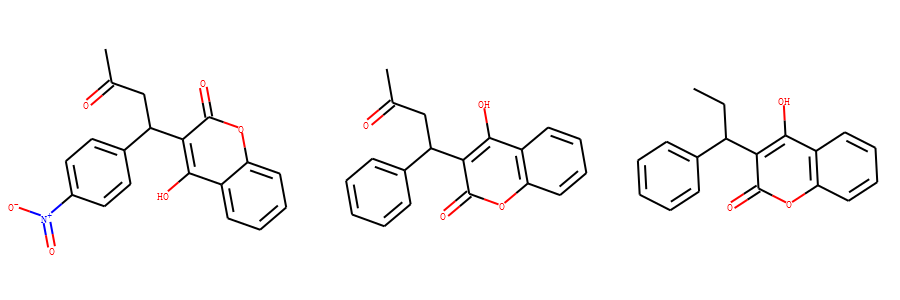

方案一：基于拓扑指纹 和 Tanimoto相似性方法（默认） 指纹计算3个分子的相似性

示例代码：

.. code-block:: py
  
  from rdkit import DataStructs
  import rdkit
  from rdkit import Chem 
  from rdkit.Chem import Draw
  smis=[
      'CC(=O)CC(C1=CC=C(C=C1)[N+]([O-])=O)C1=C(O)C2=CC=CC=C2OC1=O',
  'CC(=O)CC(C1=CC=CC=C1)C1=C(O)C2=C(OC1=O)C=CC=C2',
  'CCC(C1=CC=CC=C1)C1=C(O)C2=C(OC1=O)C=CC=C2'
  ]
  mols =[]
  for smi in smis:
      m = Chem.MolFromSmiles(smi)
      mols.append(m)
      
  fps = [Chem.RDKFingerprint(x) for x in mols]
  sm01=DataStructs.FingerprintSimilarity(fps[0],fps[1])
  
  sm02=DataStructs.FingerprintSimilarity(fps[0],fps[2])
  
  sm12=DataStructs.FingerprintSimilarity(fps[1],fps[2])
  print("similarity between mol 1 and mol2: %.2f"%sm01)
  print("similarity between mol 1 and mol3: %.2f"%sm02)
  print("similarity between mol 2 and mol3: %.2f"%sm12)

输出：

.. code-block:: console

  similarity between mol 1 and mol2: 0.93
  similarity between mol 1 and mol3: 0.87
  similarity between mol 2 and mol3: 0.93

相似性表明发现分子1 和分子3 差异最大。 

方案二： 基于MACCS 指纹和Dice 相似性方法计算相似性

示例代码：


.. code-block:: py

  from rdkit import DataStructs
  from rdkit.Chem import MACCSkeys
  import rdkit
  from rdkit import Chem 
  from rdkit.Chem import Draw
  smis=[
      'CC(=O)CC(C1=CC=C(C=C1)[N+]([O-])=O)C1=C(O)C2=CC=CC=C2OC1=O',
  'CC(=O)CC(C1=CC=CC=C1)C1=C(O)C2=C(OC1=O)C=CC=C2',
  'CCC(C1=CC=CC=C1)C1=C(O)C2=C(OC1=O)C=CC=C2'
  ]
  mols =[]
  for smi in smis:
      m = Chem.MolFromSmiles(smi)
      mols.append(m)
      
  
  fps = [MACCSkeys.GenMACCSKeys(x) for x in mols]
  sm01=DataStructs.FingerprintSimilarity(fps[0],fps[1],metric=DataStructs.DiceSimilarity)
  
  sm02=DataStructs.FingerprintSimilarity(fps[0],fps[2],metric=DataStructs.DiceSimilarity)
  
  sm12=DataStructs.FingerprintSimilarity(fps[1],fps[2],metric=DataStructs.DiceSimilarity)
  print("similarity between mol 1 and mol2: %.2f"%sm01)
  print("similarity between mol 1 and mol3: %.2f"%sm02)
  print("similarity between mol 2 and mol3: %.2f"%sm12)
  
输出：

.. code-block:: console

  similarity between mol 1 and mol2: 0.78
  similarity between mol 1 and mol3: 0.70
  similarity between mol 2 and mol3: 0.92

从相似性，我们可以看出分子2和分子3比较相似。 

摩根指纹的形式
----------------------------

摩根指纹和atom pairs 以及topological tosions 一样，有两种表现形式：

1. counts (默认)
2. bit vectors 

示例代码：

.. code-block:: py

  from rdkit.Chem import AllChem
  m1 = Chem.MolFromSmiles('Cc1ccccc1')
  fp1_count = AllChem.GetMorganFingerprint(m1,2)
  fp1_bit = AllChem.GetMorganFingerprintAsBitVect(m1,2,nBits=1024)
  print(type(fp1_count))
  print(type(fp1_bit))

输出：

.. code-block:: console
  
  <class 'rdkit.DataStructs.cDataStructs.UIntSparseIntVect'>
  <class 'rdkit.DataStructs.cDataStructs.ExplicitBitVect'>
  
摩根指纹->ECFP4 和 摩根指纹->FCFP4的比较
----------------------------------------------
摩根指纹通过定义不同的invariants 可以输出ECFP、FCFP指纹。

ECFP、FCFP 不同点主要在于如何计算atom invariants.

-. ECFP 的atom invariants 是 连接信息
-. FCFP 的atom invariants 是 fature-based invariants

RDKit中Morgan算法支持的feature 有

+----------+---------------------------------------------------------------------------+
| Feature  | SMARTS                                                                                                                                                                 |
+----------+----------------------------------------------------------------------+
| Donor    | ``[$([N;!H0;v3,v4&+1]),$([O,S;H1;+0]),n&H1&+0]``                                                                                                                       |
+----------+-----------------------------------------------------------------------------------+
| Acceptor | ``[$([O,S;H1;v2;!$(*-*=[O,N,P,S])]),$([O,S;H0;v2]),$([O,S;-]),$([N;v3;!$(N-*=[O,N,P,S])]),n&H0&+0,$([o,s;+0;!$([o,s]:n);!$([o,s]:c:n)])]``                             |
+----------+--------------------------------------------------------+
| Aromatic | ``[a]``                                                                                                                                                                |
+----------+-------------------------------------------------------------------------------+
| Halogen  | ``[F,Cl,Br,I]``                                                                                                                                                        |
+----------+-----------------------------------------------------------------------------------------------------------+
| Basic    | ``[#7;+,$([N;H2&+0][$([C,a]);!$([C,a](=O))]),$([N;H1&+0]([$([C,a]);!$([C,a](=O))])[$([C,a]);!$([C,a](=O))]),$([N;H0&+0]([C;!$(C(=O))])([C;!$(C(=O))])[C;!$(C(=O))])]`` |
+----------+--------------------------------------------------------------------+
| Acidic   | ``[$([C,S](=[O,S,P])-[O;H1,-1])]``                                                                                                                                     |
+----------+----------------------------------------------------------+

ECFP4 和 FCFP4 中的4代表是摩根指纹的直径为4，半径为2。
这样默认半径为2的摩根指纹就是ECFP4指纹。
半径为2切考虑feature-based invariants 得到的指纹为FCFP4指纹。

RDKIT 计算ECFP4 和FCFP4的示例代码：

.. code-block:: py

  m1 = Chem.MolFromSmiles('c1ccccn1')
  ecfp4_mg = AllChem.GetMorganFingerprint(m1,2)
  fcfp4_mg = AllChem.GetMorganFingerprint(m1,2,useFeatures=True)
  

.. note::
	同样的两个分子分别基于ECFP4 和 FCFP4计算相似性其差别可能很大。
	
比较吡啶和呋喃的相似性

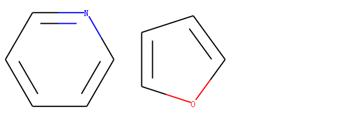

	图 吡啶和呋喃的分子结构


示例代码：

.. code-block:: py

  m1 = Chem.MolFromSmiles('c1ccccn1')
  m2 = Chem.MolFromSmiles('c1ccco1')
  ecfp4_m1 = AllChem.GetMorganFingerprint(m1,2)
  ecfp4_m2 = AllChem.GetMorganFingerprint(m2,2)
  fcfp4_m1 = AllChem.GetMorganFingerprint(m1,2,useFeatures=True)
  fcfp4_m2 = AllChem.GetMorganFingerprint(m2,2,useFeatures=True)
  simi_ecfp4=  DataStructs.DiceSimilarity(fp1,fp2)
  
  simi_fcfp4 =DataStructs.DiceSimilarity(ffp1,ffp2)
  print("the similarity of the two molecules calculated by ECFP4: %.2f"%simi_ecfp4)
  print("the similarity of the two molecules calculated by FCFP4: %.2f"%simi_fcfp4)

输出：

.. code-block:: console

  the similarity of the two molecules calculated by ECFP4: 0.36
  the similarity of the two molecules calculated by FCFP4: 0.91


用户也可以自己定义atom invariants 
---------------------------------------------
以下面3个分子为例，讲述自定义atom invariants 计算分子指纹。

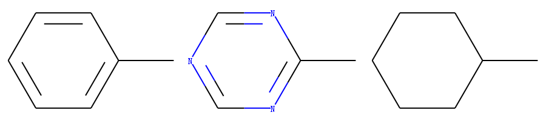

从上述结构来看，如果原子的atom invariants 是一样的，则分子1和分子2的指纹相同。
默认计算分子指纹的时候会考虑键的类型 bond order。因此 分子3 和分子1、2不同。
如果计算分子指纹的时候不考虑键的类型，则分子1、2、3的指纹相同。

示例代码：

.. code-block:: py
  
  m1 = Chem.MolFromSmiles('Cc1ccccc1')
  m2 = Chem.MolFromSmiles('Cc1ncncn1')
  m3 = Chem.MolFromSmiles('CC1CCCCC1')
  fp1 = AllChem.GetMorganFingerprint(m1,2,invariants=[1]*m1.GetNumAtoms())
  fp2 = AllChem.GetMorganFingerprint(m2,2,invariants=[1]*m2.GetNumAtoms())
  fp3 =AllChem.GetMorganFingerprint(m3,2,invariants=[1]*m3.GetNumAtoms())
  if(fp1==fp2):
      print("If set atom invariants are the same, the fp of moleclue 1 and 2 are the same too")
  if(fp1!=fp3):
      print("The fp of moleclue 1 and 3 are different because the bond order will be consided in the calculation of fp ")
  
  fp1 = AllChem.GetMorganFingerprint(m1,2,invariants=[1]*m1.GetNumAtoms(),useBondTypes=False)
  fp3 = AllChem.GetMorganFingerprint(m3,2,invariants=[1]*m3.GetNumAtoms(),useBondTypes=False)
  if(fp1==fp3):
      print("when atom invariants are the same and bond type not considered in the calculation of fp, the fp mol 1 and 3 are the same")

输出：


.. code-block:: console

  If set atom invariants are the same, the fp of moleclue 1 and 2 are the same too
  The fp of moleclue 1 and 3 are different because the bond order will be consided in the calculation of fp 
  when atom invariants are the same and bond type not considered in the calculation of fp, the fp mol 1 and 3 are the same


解释摩根指纹中bit的含义
-----------------------------
ECFP4 以count 形式表示的时候是没有位数限制的。
ECFP4 以bit的形式表示的时候可以设置bit的位数，如果不设置默认是2048bit。
尽管是2048bit 但是是非常冗余的稀疏矩阵，里面大部分是0.
代码：

.. code-block:: py

  help(AllChem.GetMorganFingerprintAsBitVect)

输出：

.. code-block:: console

  Help on built-in function GetMorganFingerprintAsBitVect in module rdkit.Chem.rdMolDescriptors:
  
  GetMorganFingerprintAsBitVect(...)
      GetMorganFingerprintAsBitVect( (Mol)mol, (int)radius [, (int)nBits=2048 [, (AtomPairsParameters)invariants=[] [, (AtomPairsParameters)fromAtoms=[] [, (bool)useChirality=False [, (bool)useBondTypes=True [, (bool)useFeatures=False [, (AtomPairsParameters)bitInfo=None]]]]]]]) -> ExplicitBitVect :
          Returns a Morgan fingerprint for a molecule as a bit vector
      
          C++ signature :
              class ExplicitBitVect * __ptr64 GetMorganFingerprintAsBitVect(class RDKit::ROMol,int [,unsigned int=2048 [,class boost::python::api::object=[] [,class boost::python::api::object=[] [,bool=False [,bool=True [,bool=False [,class boost::python::api::object=None]]]]]]])
  
  
首先通过count形式计算ECFP4指纹中有效的信息

.. code-block:: py

  m = Chem.MolFromSmiles('c1cccnc1C')
  info={}
  fp = AllChem.GetMorganFingerprint(m,2,bitInfo=info)
  print("num of non-zero bit ",len(fp.GetNonzeroElements()))
  print("num of keys of info",len(info.keys()))
  
输出：

.. code-block:: console

  num of non-zero bit  16
  num of keys of info 16

提示我们甲基吡啶分子（c1cccnc1C）在ECFP4指纹中最多有16个有效信息。  

设置不同的nBits 计算有效信息的个数。

.. code-block:: py

  nbitss=[64,128,256,2048]
  for nbit in nbitss:
      mol = Chem.MolFromSmiles('c1cccnc1C')
      bi = {}
      fp = AllChem.GetMorganFingerprintAsBitVect(mol, radius=2, nBits=nbit,bitInfo=bi)
      print("num non zero bit in nBit=%d: %d"%(nbit,len(bi.keys())))

输出：

.. code-block:: console

  num non zero bit in nBit=64: 13
  num non zero bit in nBit=128: 15
  num non zero bit in nBit=256: 16
  num non zero bit in nBit=2048: 16

对于分子甲基吡啶，当nBit设置256的时候就不会丢失信息的个数。

检查nBits=256和2048获取的指纹信息是否相同：

示例代码：

.. code-block:: py

  nbitss=[256,2048]
  bis=[]
  for nbit in nbitss:
      mol = Chem.MolFromSmiles('c1cccnc1C')
      bi = {}
      fp = AllChem.GetMorganFingerprintAsBitVect(mol, radius=2, nBits=nbit,bitInfo=bi)
      bis.append(bi)
  a=bis[0].values() 
  b=bis[1].values() 
  a=list(a)
  b=list(b)
  ab=a+b
  if len(set(ab))==len(a):
      print("fp info calculated by nBits=256 and 2048 are the same")


输出：

.. code-block:: console

  fp info calculated by nBits=256 and 2048 are the same


.. note::
	不同位数算出来的相同信息对应在不同的bit上，且先后顺序顺序不一定一直。

查看这16个bit信息。

示例代码：

.. code-block:: py

  mol = Chem.MolFromSmiles('c1cccnc1C')
  bi = {}
  fp = AllChem.GetMorganFingerprintAsBitVect(mol, radius=2, nBits=256,bitInfo=bi)
  
  for v in bi.values():
      print(v)

输出：

.. code-block:: console

  ((5, 2),)
  ((6, 0),)
  ((1, 1), (2, 1))
  ((3, 1),)
  ((0, 0), (1, 0), (2, 0), (3, 0))
  ((5, 0),)
  ((4, 2),)
  ((4, 0),)
  ((2, 2),)
  ((4, 1),)
  ((1, 2),)
  ((0, 2),)
  ((6, 1),)
  ((3, 2),)
  ((5, 1),)

这里我对第一个信息((5,2),) 和第三个信息((1, 1), (2, 1))进行解释。
里面的最小单元对应的是(atom index, radius)。
第一个信息是5号原子半径2的指纹。
第二个信息是1号原子和2原子原子半径为1的指纹。

获取指纹对应的结构
-----------------------------------

获取这3个指纹对应的结构信息

示例代码：

.. code-block:: py

  m = Chem.MolFromSmiles('c1cccnc1C')
  env = Chem.FindAtomEnvironmentOfRadiusN(m,2,5)
  amap={}
  submol25=Chem.PathToSubmol(m,env,atomMap=amap)
  env = Chem.FindAtomEnvironmentOfRadiusN(m,1,1)
  amap={}
  submol11=Chem.PathToSubmol(m,env,atomMap=amap)
  env = Chem.FindAtomEnvironmentOfRadiusN(m,1,2)
  amap={}
  submol12=Chem.PathToSubmol(m,env,atomMap=amap)
  mols=[submol25,submol11,submol12]
  Draw.MolsToGridImage(mols,molsPerRow=3,subImgSize=(300,200),legends=['' for x in mols])

输出：

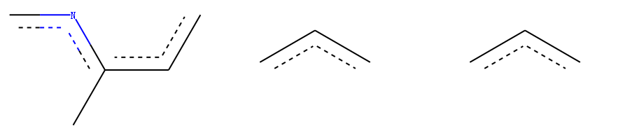


可视化指纹中的bit
-----------------------------
RDKit中的拓扑指纹 Chem.RDKFingerprint 和摩根指纹 Morgan，可以通过如下函数进行可视化。

- rdkit.Chem.Draw.DrawMorganBit() 对摩根指纹中的bit 进行可视化。 
- rdkit.Chem.Draw.DrawRDKitBit() 对拓扑指纹中的bit 进行可视化。

可视化摩根指纹中的bit
-----------------------------
首先查看分子（）摩根指纹里面的有效bit,

.. code-block:: py

  from rdkit.Chem import Draw
  from rdkit import Chem
  mol = Chem.MolFromSmiles('c1cccnc1C')
  bi = {}
  fp = AllChem.GetMorganFingerprintAsBitVect(mol,nBits=256, radius=2, bitInfo=bi)
  pprint(bi)

输出：

.. code-block:: console

  {19: ((5, 2),),
   33: ((6, 0),),
   64: ((1, 1), (2, 1)),
   74: ((3, 1),),
   81: ((0, 0), (1, 0), (2, 0), (3, 0)),
   100: ((5, 0),),
   121: ((4, 2),),
   122: ((4, 0),),
   131: ((2, 2),),
   172: ((4, 1),),
   175: ((1, 2),),
   179: ((0, 2),),
   186: ((6, 1),),
   192: ((3, 2),),
   195: ((5, 1),),
   214: ((0, 1),)}

我们可以看到有效bit 有19、33、64、74、...、214等。
我们对19、64、81的bit 进行可视化。

.. code-block:: py

  bits =[19,64,81]
  imgs=[]
  for bit in bits:
      mfp2_svg = Draw.DrawMorganBit(mol, bit, bi)
      imgs.append(mfp2_svg)
  def displayimgsinrow(imgs,col=4):
      plt.figure(figsize=(20,10))
      columns = col
      for i, image in enumerate(imgs):
          ax=plt.subplot(len(imgs) / columns + 1, columns, i + 1)
          ax.set_axis_off()
          plt.imshow(image)
  displayimgsinrow(imgs)

输出：

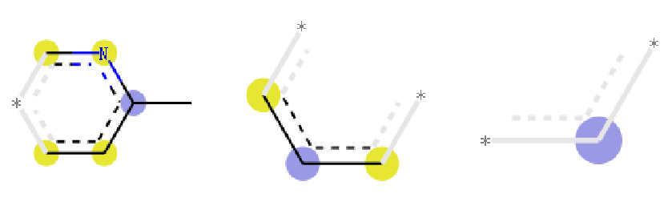

从上图中，我们可以看到对摩根指纹可视化的时候，除了可以看到片段结构，
还可以到上原子上标注了不同的颜色：

1. 蓝色: 蓝色标注说明该原子是中心原子
#. 黄色：说明该原子是芳香原子
#. 灰色： 说明该原子时脂肪烃原子


可视化拓扑指纹中的bit
-----------------------------
拓扑指纹也成为RDKit指纹，其调用函数Chem.RDKFingerprint(mol)

查看拓扑指纹中的有效bit。

示例代码：

.. code-block:: py

  from rdkit.Chem import Draw
  from rdkit import Chem
  mol = Chem.MolFromSmiles('c1cccnc1C')
  rdkbi = {}
  rdkfp = Chem.RDKFingerprint(mol, maxPath=2, bitInfo=rdkbi)
  rdkbi

输出：

.. code-block:: console

  5: [[3, 4]],
  161: [[3, 4]],
  294: [[0, 1], [0, 6], [1, 2]],
  330: [[0, 1], [0, 6], [1, 2]],
  633: [[2, 3], [4, 6]],
  684: [[2, 3], [4, 6]],
  744: [[5, 6]],
  808: [[4, 5]],
  842: [[0], [1], [2], [6]],
  930: [[5]],
  1026: [[0], [1], [2], [6]],
  1027: [[3], [4]],
  1060: [[3], [4], [5]],
  1649: [[4, 5]],
  1909: [[5, 6]]}

对前3个bit 进行可视化, 示例代码：


.. code-block:: py
  
  bits =[5,161,294]
  imgs=[]
  for bit in bits:
      mfp2_svg = Draw.DrawRDKitBit(mol, bit, rdkbi)
      imgs.append(mfp2_svg)
  def displayimgsinrow(imgs,col=4):
      plt.figure(figsize=(20,10))
      columns = col
      for i, image in enumerate(imgs):
          ax=plt.subplot(len(imgs) / columns + 1, columns, i + 1)
          ax.set_axis_off()
          plt.imshow(image)
  displayimgsinrow(imgs)

输出：


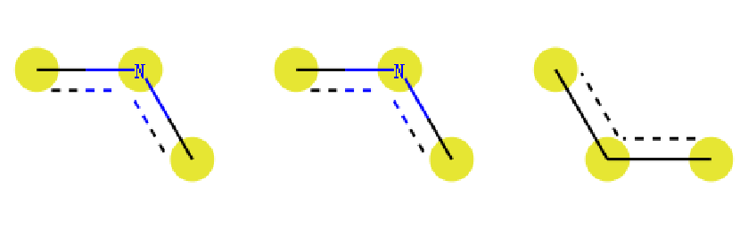

基于分子指纹挑选差异较大的分子
----------------------------------------
药物虚拟筛选中关键步骤挑选分子，比如筛选获得前1000个分子，
由于成本、时间等因素你想挑选100个分子进行活性测试，
如果你直接挑选前100个分子进行测试，命中率可能会降低。
一般流程是对1000个分子进行聚类，然后每一类里面挑选一个分子（或者中心分子），
这样可以提高分子骨架的多样性，从而提供虚拟筛选的成功率。

Schrodiger 中有这样的流程。通过RDKit 也能实现。

示例代码：

.. code-block:: py

  from rdkit import Chem
  from rdkit.Chem.rdMolDescriptors import GetMorganFingerprint
  from rdkit import DataStructs
  from rdkit.SimDivFilters.rdSimDivPickers import MaxMinPicker
  ms = [x for x in Chem.SDMolSupplier('data/actives_5ht3.sdf')]
  while ms.count(None): ms.remove(None)
  fps = [GetMorganFingerprint(x,3) for x in ms]
  def distij(i,j,fps=fps):
      return 1-DataStructs.DiceSimilarity(fps[i],fps[j])
  picker = MaxMinPicker()
  pickIndices = picker.LazyPick(distij,nfps,10,seed=23)
  picks = [ms[x] for x in pickIndices]


相似性地图
--------------------------------------
相似性地图可用于可视化原子对两个分子的相似性的贡献，
该方法位于 `rdkit.Chem.Draw.SimilarityMaps <https://www.rdkit.org/docs/source/rdkit.Chem.Draw.SimilarityMaps.html#module-rdkit.Chem.Draw.SimilarityMaps>`_
模块中。

该方法支持三种类型的指纹：

1. atom pairs  类型表现形式 normal(default)、hashed 和 bit vector(bv)
#. topological torsions  类型表现形式normal(default)、hashed 和 bit vector(bv)
#. Morgan fingerprints   类型表现形式 bit vector(bv,default) 和 count vector(count)

示例代码：

.. code-block:: py

  from rdkit.Chem import Draw
  from rdkit.Chem.Draw import SimilarityMaps
  fp = SimilarityMaps.GetAPFingerprint(mol, fpType='normal')
  fp = SimilarityMaps.GetTTFingerprint(mol, fpType='normal')
  fp = SimilarityMaps.GetMorganFingerprint(mol, fpType='bv')
  
计算目标相似性地图，最少需要3个参数：

1. 参考分子
#. 目标分子
#. 指纹函数
#. 相似性函数（默认是 Dice similarity）

示例代码：

.. code-block:: py

  from rdkit import Chem
  from rdkit.Chem.Draw import SimilarityMaps
  targetmol = Chem.MolFromSmiles('COc1cccc2cc(C(=O)NCCCCN3CCN(c4cccc5nccnc54)CC3)oc21')
  refmol = Chem.MolFromSmiles('CCCN(CCCCN1CCN(c2ccccc2OC)CC1)Cc1ccc2ccccc2c1')
  target_mol_simi_fig, maxweight = SimilarityMaps.GetSimilarityMapForFingerprint(refmol, targetmol, SimilarityMaps.GetMorganFingerprint)

输出：

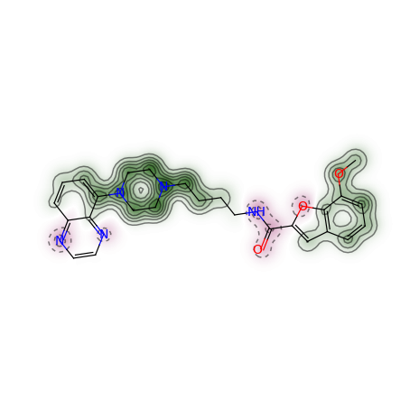
	
原子颜色越绿，对相似性的贡献越大。

计算相似性地图的时候，定义指纹计算方法中的参数 和相似性计算方法

示例代码：

.. code-block:: py

  from rdkit import DataStructs
  from rdkit import Chem
  from rdkit.Chem.Draw import SimilarityMaps
  targetmol = Chem.MolFromSmiles('COc1cccc2cc(C(=O)NCCCCN3CCN(c4cccc5nccnc54)CC3)oc21')
  refmol = Chem.MolFromSmiles('CCCN(CCCCN1CCN(c2ccccc2OC)CC1)Cc1ccc2ccccc2c1')
  fig, maxweight = SimilarityMaps.GetSimilarityMapForFingerprint(refmol, mol, lambda m,idx: SimilarityMaps.GetMorganFingerprint(m, atomId=idx, radius=1, fpType='count'), metric=DataStructs.TanimotoSimilarity)
  
输出：

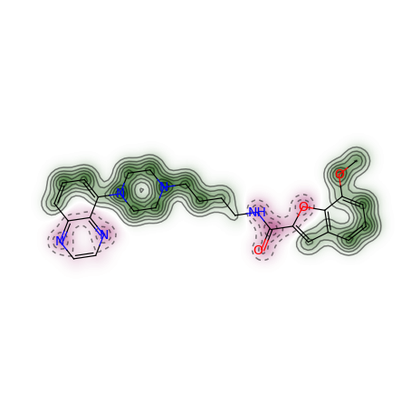

计算相似性的流程，首先计算原子的贡献，然后基于贡献值进行绘图。
因此也可以采用下述方式进行计算绘图。

示例代码：

.. code-block:: py

  from rdkit import DataStructs
  from rdkit import Chem
  from rdkit.Chem.Draw import SimilarityMaps
  targetmol = Chem.MolFromSmiles('COc1cccc2cc(C(=O)NCCCCN3CCN(c4cccc5nccnc54)CC3)oc21')
  refmol = Chem.MolFromSmiles('CCCN(CCCCN1CCN(c2ccccc2OC)CC1)Cc1ccc2ccccc2c1')
  weights = SimilarityMaps.GetAtomicWeightsForFingerprint(refmol, mol, SimilarityMaps.GetMorganFingerprint)
  fig = SimilarityMaps.GetSimilarityMapFromWeights(mol, weights)
  


分子性质（描述符）
====================================

性质描述符计算
--------------------------
分子性质也被称为描述符。 RDKit中内置了大量的分子描述符的计算方法，
这些方法主要位于`rdkit.Chem.Descriptors <https://www.rdkit.org/docs/source/rdkit.Chem.Descriptors.html#module-rdkit.Chem.Descriptors>`_
也有些常用的性质在AllChem模块下面。

RDKit 可以计算多种分子性质，如：


+-----------------------------------------------------+------------------------------------------------------------+----------+
|Descriptor/Descriptor                                |Notes                                                       | Language |
|Family                                               |                                                            |          |
+-----------------------------------------------------+------------------------------------------------------------+----------+
|Gasteiger/Marsili                                    |*Tetrahedron*                                               | C++      |
|Partial Charges                                      |**36**:3219\-28                                             |          |
|                                                     |(1980)                                                      |          |
+-----------------------------------------------------+------------------------------------------------------------+----------+
|BalabanJ                                             |*Chem. Phys. Lett.*                                         | Python   |
|                                                     |**89**:399\-404                                             |          |
|                                                     |(1982)                                                      |          |
+-----------------------------------------------------+------------------------------------------------------------+----------+
|BertzCT                                              |*J. Am. Chem. Soc.*                                         | Python   |
|                                                     |**103**:3599\-601                                           |          |
|                                                     |(1981)                                                      |          |
+-----------------------------------------------------+------------------------------------------------------------+----------+
|Ipc                                                  |*J. Chem. Phys.*                                            | Python   |
|                                                     |**67**:4517\-33                                             |          |
|                                                     |(1977)                                                      |          |
+-----------------------------------------------------+------------------------------------------------------------+----------+
|HallKierAlpha                                        |*Rev. Comput. Chem.*                                        | C++      |
|                                                     |**2**:367\-422                                              |          |
|                                                     |(1991)                                                      |          |
+-----------------------------------------------------+------------------------------------------------------------+----------+
|Kappa1 \- Kappa3                                     |*Rev. Comput. Chem.*                                        | C++      |
|                                                     |**2**:367\-422                                              |          |
|                                                     |(1991)                                                      |          |
+-----------------------------------------------------+------------------------------------------------------------+----------+
|Chi0, Chi1                                           |*Rev. Comput. Chem.*                                        | Python   |
|                                                     |**2**:367\-422                                              |          |
|                                                     |(1991)                                                      |          |
+-----------------------------------------------------+------------------------------------------------------------+----------+
|Chi0n \- Chi4n                                       |*Rev. Comput. Chem.*                                        | C++      |
|                                                     |**2**:367\-422                                              |          |
|                                                     |(1991)                                                      |          |
+-----------------------------------------------------+------------------------------------------------------------+----------+
|Chi0v \- Chi4v                                       |*Rev. Comput. Chem.*                                        | C++      |
|                                                     |**2**:367\-422                                              |          |
|                                                     |(1991)                                                      |          |
+-----------------------------------------------------+------------------------------------------------------------+----------+
|MolLogP                                              |Wildman and Crippen                                         | C++      |
|                                                     |*JCICS*                                                     |          |
|                                                     |**39**:868\-73                                              |          |
|                                                     |(1999)                                                      |          |
+-----------------------------------------------------+------------------------------------------------------------+----------+
|MolMR                                                |Wildman and Crippen                                         | C++      |
|                                                     |*JCICS*                                                     |          |
|                                                     |**39**:868\-73                                              |          |
|                                                     |(1999)                                                      |          |
+-----------------------------------------------------+------------------------------------------------------------+----------+
|MolWt                                                |                                                            | C++      |
+-----------------------------------------------------+------------------------------------------------------------+----------+
|ExactMolWt                                           |                                                            | C++      |
+-----------------------------------------------------+------------------------------------------------------------+----------+
|HeavyAtomCount                                       |                                                            | C++      |
+-----------------------------------------------------+------------------------------------------------------------+----------+
|HeavyAtomMolWt                                       |                                                            | C++      |
+-----------------------------------------------------+------------------------------------------------------------+----------+
|NHOHCount                                            |                                                            | C++      |
+-----------------------------------------------------+------------------------------------------------------------+----------+
|NOCount                                              |                                                            | C++      |
+-----------------------------------------------------+------------------------------------------------------------+----------+
|NumHAcceptors                                        |                                                            | C++      |
+-----------------------------------------------------+------------------------------------------------------------+----------+
|NumHDonors                                           |                                                            | C++      |
+-----------------------------------------------------+------------------------------------------------------------+----------+
|NumHeteroatoms                                       |                                                            | C++      |
+-----------------------------------------------------+------------------------------------------------------------+----------+
|NumRotatableBonds                                    |                                                            | C++      |
+-----------------------------------------------------+------------------------------------------------------------+----------+
|NumValenceElectrons                                  |                                                            | C++      |
+-----------------------------------------------------+------------------------------------------------------------+----------+
|NumAmideBonds                                        |                                                            | C++      |
+-----------------------------------------------------+------------------------------------------------------------+----------+
|Num{Aromatic,Saturated,Aliphatic}Rings               |                                                            | C++      |
+-----------------------------------------------------+------------------------------------------------------------+----------+
|Num{Aromatic,Saturated,Aliphatic}{Hetero,Carbo}cycles|                                                            | C++      |
+-----------------------------------------------------+------------------------------------------------------------+----------+
|RingCount                                            |                                                            | C++      |
+-----------------------------------------------------+------------------------------------------------------------+----------+
|FractionCSP3                                         |                                                            | C++      |
+-----------------------------------------------------+------------------------------------------------------------+----------+
|NumSpiroAtoms                                        |  Number of spiro atoms                                     | C++      |
|                                                     | (atoms shared between rings that share                     |          |
|                                                     | exactly one atom)                                          |          |
+-----------------------------------------------------+------------------------------------------------------------+----------+
|NumBridgeheadAtoms                                   | Number of bridgehead atoms                                 | C++      |
|                                                     | (atoms shared between rings that share                     |          |
|                                                     | at least two bonds)                                        |          |
+-----------------------------------------------------+------------------------------------------------------------+----------+
|TPSA                                                 |*J. Med. Chem.*                                             | C++      |
|                                                     |**43**:3714\-7,                                             |          |
|                                                     |(2000)                                                      |          |
|                                                     |See the section in the RDKit book describing differences    |          |
|                                                     |to the original publication.                                |          |
+-----------------------------------------------------+------------------------------------------------------------+----------+
|LabuteASA                                            |*J. Mol. Graph. Mod.*                                       | C++      |
|                                                     |**18**:464\-77 (2000)                                       |          |
+-----------------------------------------------------+------------------------------------------------------------+----------+
|PEOE_VSA1 \- PEOE_VSA14                              |MOE\-type descriptors using partial charges                 | C++      |
|                                                     |and surface area contributions                              |          |
|                                                     |http://www.chemcomp.com/journal/vsadesc.htm                 |          |
+-----------------------------------------------------+------------------------------------------------------------+----------+
|SMR_VSA1 \- SMR_VSA10                                |MOE\-type descriptors using MR                              | C++      |
|                                                     |contributions and surface area                              |          |
|                                                     |contributions                                               |          |
|                                                     |http://www.chemcomp.com/journal/vsadesc.htm                 |          |
+-----------------------------------------------------+------------------------------------------------------------+----------+
|SlogP_VSA1 \- SlogP_VSA12                            |MOE\-type descriptors using LogP                            | C++      |
|                                                     |contributions and surface area                              |          |
|                                                     |contributions                                               |          |
|                                                     |http://www.chemcomp.com/journal/vsadesc.htm                 |          |
+-----------------------------------------------------+------------------------------------------------------------+----------+
|EState_VSA1 \- EState_VSA11                          |MOE\-type descriptors using EState indices                  | Python   |
|                                                     |and surface area contributions (developed                   |          |
|                                                     |at RD, not described in the CCG paper)                      |          |
+-----------------------------------------------------+------------------------------------------------------------+----------+
|VSA_EState1 \- VSA_EState10                          |MOE\-type descriptors using EState indices                  | Python   |
|                                                     |and surface area contributions (developed                   |          |
|                                                     |at RD, not described in the CCG paper)                      |          |
+-----------------------------------------------------+------------------------------------------------------------+----------+
|MQNs                                                 |Nguyen et al. *ChemMedChem* **4**:1803\-5                   | C++      |
|                                                     |(2009)                                                      |          |
+-----------------------------------------------------+------------------------------------------------------------+----------+
|Topliss fragments                                    |implemented using a set of SMARTS                           | Python   |
|                                                     |definitions in                                              |          |
|                                                     |$(RDBASE)/Data/FragmentDescriptors.csv                      |          |
+-----------------------------------------------------+------------------------------------------------------------+----------+
|Autocorr2D                                           |New in 2017.09 release. Todeschini and Consoni "Descriptors | C++      |
|                                                     |from Molecular Geometry" Handbook of Chemoinformatics       |          |
|                                                     |https://doi.org/10.1002/9783527618279.ch37                  |          |
+-----------------------------------------------------+------------------------------------------------------------+----------+

计算分子的The topological polar surface area (TPSA) descriptor 、logP、电荷等性质，示例代码：


.. code-block:: py

  from rdkit.Chem import Descriptors
  m = Chem.MolFromSmiles('c1ccccc1C(=O)O')
  tpsa_m=Descriptors.TPSA(m)
  logp_m=Descriptors.MolLogP(m)
  AllChem.ComputeGasteigerCharges(m)
  charge_atm0=float(m.GetAtomWithIdx(0).GetProp('_GasteigerCharge'))
  
  print("the TPSA of m is",tpsa_m)
  print("the logP of m is",logp_m)
  print("the gasteigerCharge of the first atom",charge_atm0)
  
输出：

.. code-block:: console
  
  the TPSA of m is 37.3
  the logP of m is 1.3848
  the gasteigerCharge of the first atom -0.04769375004654255


原子对性质的贡献可视化
-----------------------------
相似性地图也可用用于性质的可视化，只要性质可以分解到原子上就可以进行可视化。

Gasteiger partial 电荷的可视化距离，自定义颜色主题jet。

示例代码：

.. code-block:: py

  from rdkit.Chem.Draw import SimilarityMaps
  mol = Chem.MolFromSmiles('COc1cccc2cc(C(=O)NCCCCN3CCN(c4cccc5nccnc54)CC3)oc21')
  AllChem.ComputeGasteigerCharges(mol)
  contribs = [float(mol.GetAtomWithIdx(i).GetProp('_GasteigerCharge')) for i in range(mol.GetNumAtoms())]
  fig = SimilarityMaps.GetSimilarityMapFromWeights(mol, contribs, colorMap='jet', contourLines=10)

输出：

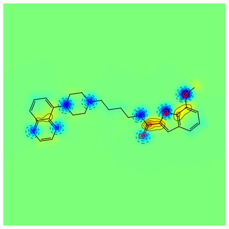


RDKit中内置Crippen方法对原子logP的计算。

示例代码

.. code-block:: py

  from rdkit.Chem import rdMolDescriptors
  mol = Chem.MolFromSmiles('COc1cccc2cc(C(=O)NCCCCN3CCN(c4cccc5nccnc54)CC3)oc21')
  contribs = rdMolDescriptors._CalcCrippenContribs(mol)
  fig = SimilarityMaps.GetSimilarityMapFromWeights(mol,[x for x,y in contribs], colorMap='jet', contourLines=10)

输出:

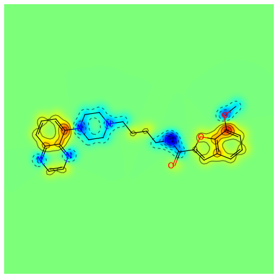


化学反应
==================================
RDKit 提供化学反应引擎，其中化学反应模板是基于smarts 构建的。
反应物+反应引擎就可以生成产物。

化学反应示例
-----------------
示例反应：

反应模板，如下图所示：

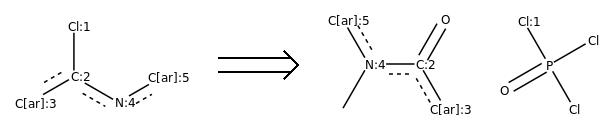

	反应模板([Cl;H0;D1;+0:1]-[c;H0;D3;+0:2](:[c:3]):[n;H0;D2;+0:4]:[c:5])>>(C-[n;H0;D3;+0:4](:[c:5]):[c;H0;D3;+0:2](=O):[c:3]).(Cl-P(-Cl)(=O)-[Cl;H0;D1;+0:1])

从反应模板中，我们看到主要的变化是Cl变成羰基氧，N上多了一个甲基。


.. note::
	这是一个逆反应模板。

反应物，如下图所示：

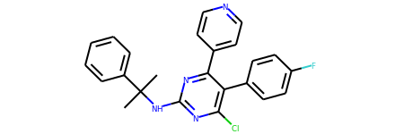

	'CC(C)(Nc1nc(Cl)c(-c2ccc(F)cc2)c(-c2ccncc2)n1)c1ccccc1'


- 创建具体反应规则的引擎对象 rxn = AllChem.ReactionFromSmarts(tem)
- 输入反应物，借助引擎产生反应  rxn.RunReactants([productmol])

反应示例：

.. code-block:: py

  from rdkit.Chem import AllChem
  
  def getrxns(rxn,productsmi):
      productmol = Chem.MolFromSmiles(productsmi)
      reactions = rxn.RunReactants([productmol])
      rxns = []
      for reaction in reactions:
          smis=[]
          for compound in reaction:
              smi = Chem.MolToSmiles(compound)
              smis.append(smi)
  
          rxnstr='.'.join(smis)+'>>'+productsmi
          newr=canon_reaction(rxnstr)
          rxns.append(newr)
      return rxns
  
  
  tem='([Cl;H0;D1;+0:1]-[c;H0;D3;+0:2](:[c:3]):[n;H0;D2;+0:4]:[c:5])>>(C-[n;H0;D3;+0:4](:[c:5]):[c;H0;D3;+0:2](=O):[c:3]).(Cl-P(-Cl)(=O)-[Cl;H0;D1;+0:1])'
  rxn = AllChem.ReactionFromSmarts(tem)
  productsmi='CC(C)(Nc1nc(Cl)c(-c2ccc(F)cc2)c(-c2ccncc2)n1)c1ccccc1'
  reactions =getrxns(rxn,products_smi[0])
  for reaction in reactions:
      img=ReactionStringToImage(reaction)
      display(img)

输出：

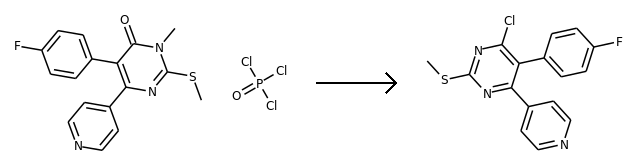


化学反应模板
------------------------------------------------
化学反应模板主要可通过两种方法获取：1. 自动抽取；2. 化学家编码。

1. 自动提取
软件：RDKit中没有提供自动提取反应模板的方法。 ASKCOS 开源了自动提取模板的方法。
原理就是化学环境发生变化的原子定义为反应中心，然后基于反应中心拓展一定的半径或者基团。

对反应模板进行高亮显示：

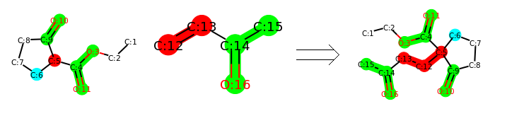


2. 化学家编码
化学家通过对反应进行归纳，整理出的反应规则，典型代表Chemtic 软件。

化学反应注意事项
-------------------------
利用化学反应引擎产生的产物，不一定符合化学规则，因此需要进行对产物进行检查。

示例：


.. code-block:: py
  
  from rdkit.Chem import AllChem
  tem='([Cl;H0;D1;+0:1]-[c;H0;D3;+0:2](:[c:3]):[n;H0;D2;+0:4]:[c:5])>>(C-[n;H0;D3;+0:4](:[c:5]):[c;H0;D3;+0:2](=O):[c:3]).(Cl-P(-Cl)(=O)-[Cl;H0;D1;+0:1])'
  rxn = AllChem.ReactionFromSmarts(tem)
  def getrxns_reactants(rxn,productsmi):
      productmol = Chem.MolFromSmiles(productsmi)
      reactions = rxn.RunReactants([productmol])
      rxns = []
      for reaction in reactions:
          smis=[]
          for compound in reaction:
  #             display(compound)
              smi = Chem.MolToSmiles(compound)
              smis.append(smi)
  
          newr='.'.join(smis)
          rxns.append(newr)
      return rxns
  
  prosmi="COC(=O)c1cccc(-c2nc(Cl)cc3c(OC)nc(C(C)C)n23)c1"
  # prosmi='CC(C)(Nc1nc(Cl)c(-c2ccc(F)cc2)c(-c2ccncc2)n1)c1ccccc1'
  rs=getrxns_reactants(rxn,prosmi)
  
  
  smi=rs[0]
  m = Chem.MolFromSmiles(smi,sanitize=False)
  if m is None:
      print('invalid SMILES')
  else:
      try:
          Chem.SanitizeMol(m)
          print("smiles is ok")
      except:
          print('invalid chemistry')

输出： invalid SMILES  

化学反应高级功能
===============================================

保护原子
--------------------------
我们以酰胺反应为例，一个分子中f含有-COOH;另一个分子中含有2个-NH。
我们定义酰胺反应模板，然后让其反应。

反应物如下图所示：

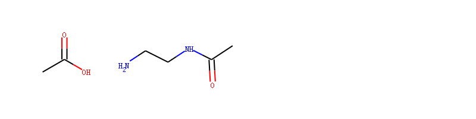

反应模板如下图所示：

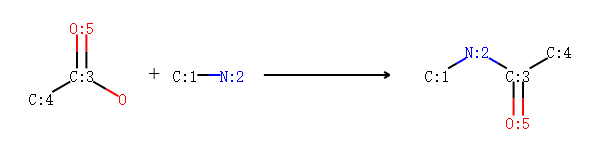


示例代码：

.. code-block:: py


  rxn = AllChem.ReactionFromSmarts('')
  acid = Chem.MolFromSmiles('CC(=O)O')
  base = Chem.MolFromSmiles('CC(=O)NCCN')
  ps = rxn.RunReactants((acid,base))
  print("the number of reactions",len(ps))
  for reaction in ps:
      reactants_smi = Chem.MolToSmiles(reaction)
      print("this  reaction is",reactants_smi)


输出：

如果不定义保护原子的话，则2个N都有可能参与反应。


通过指定保护原子，不允许这些原子作为反应中心发生反应。
设置属性 '_protected'为1就可以保护该原子。

示例代码：

.. code-block:: py
  rxn_tems=[
  '([C:1]-[NH;D2;+0:2]-[C;H0;D3;+0:3](-[C;D1;H3:4])=[O;D1;H0:5])>>(O-[C;H0;D3;+0:3](-[C;D1;H3:4])=[O;D1;H0:5]).([C:1]-[NH2;D1;+0:2])
  ([C:1]-[N;H0;D3;+0:2](-[C:3])-[C;H0;D3;+0:4](-[C;D1;H3:5])=[O;D1;H0:6])>>(O-[C;H0;D3;+0:4](-[C;D1;H3:5])=[O;D1;H0:6]).([C:1]-[NH;D2;+0:2]-[C:3])
  ]
  amidep = Chem.MolFromSmarts('[N;$(NC=[O,S])]')
  for match in base.GetSubstructMatches(amidep):
      base.GetAtomWithIdx(match[0]).SetProp('_protected','1')
  ps = rxn.RunReactants((acid,base))
  print("the number of reactions",len(ps))
  for reaction in ps:
      reactants_smi = Chem.MolToSmiles(reaction)
      print("this  reaction is",reactants_smi)


输出：


把分子切成片段—— Recap 方法 
-------------------------------
Recap 方法通过对实验室中常用的化学反应来模拟化学转化将分子分子分解成一些合理的片段。
Recap 方法返回的是数据类似于node tree的结构的数据。


.. note::
	分子片段的Smiles前面通常会加一个*
	如 '*c1ccccc1'


把分子切成片段——BRICS 方法 
---------------------------------
RDKit 还提供了另一种把分子切成片段的方法——BRICS方法。
BRICS方法主要是根据可合成的的键对分子进行切断，因此其返回的数据结构是来自于该分子的不同分子片段，
虚拟原子（*）是告诉我们是如何切断的。

示例分子


我们对该分子进行BRICS分解，


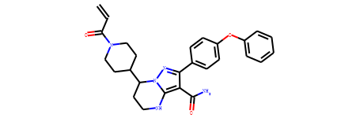

	分子泽布替尼（C=CC(=O)N1CCC(CC1)C2CCNC3=C(C(=NN23)C4=CC=C(C=C4)OC5=CC=CC=C5)C(=O)N）


代码如下：


.. code-block:: py

  from rdkit.Chem import BRICS
  smi='C=CC(=O)N1CCC(CC1)C2CCNC3=C(C(=NN23)C4=CC=C(C=C4)OC5=CC=CC=C5)C(=O)N'
  m=Chem.MolFromSmiles(smi)
  frags =(BRICS.BRICSDecompose(m))
  mols=[]
  for fsmi in frags:
      mols.append(Chem.MolFromSmiles(fsmi))
  Draw.MolsToGridImage(mols,molsPerRow=3,subImgSize=(200,200),legends=['' for x in mols])


输出：

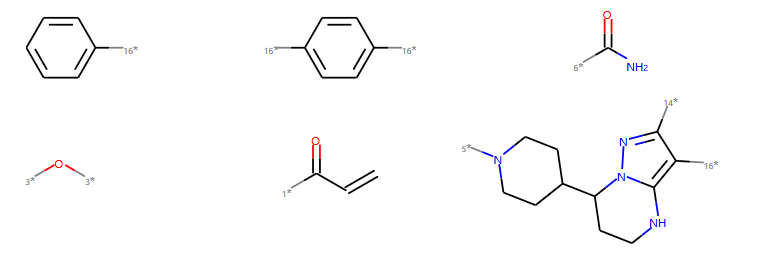


组合分子片段——BRICS方法
-------------------------------
以上述片段进行BRICS组合产生分子，

示例代码：

.. code-block:: py

  newms = BRICS.BRICSBuild(mols)
  newms=list(newms)
  len(newms)

大概可以产生76个分子（含少量化学结构不合理的结构）

对其中前6个新组合的分子进行可视化，如图

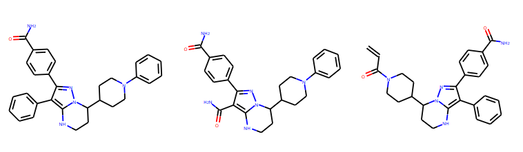


自定义片段产生的方法 
---------------------------------
除了上面提到的自动片段分解方法，RDKit提供了更灵活的函数可根据用户定义的键进行切断产生片段。

比如对所有环上的原子和非环上的原子组成的键进行进行切断。

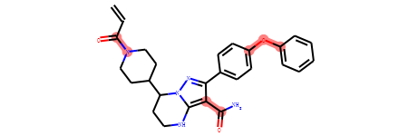

我们对要断开的键进行了标红处理（子结构搜索后绘制的分子图片会自动把匹配的子结构标红），如上图所示。

示例代码：

.. code-block:: py

  smi='C=CC(=O)N1CCC(CC1)C2CCNC3=C(C(=NN23)C4=CC=C(C=C4)OC5=CC=CC=C5)C(=O)N'
  m=Chem.MolFromSmiles(smi)
  submols = m.GetSubstructMatches(Chem.MolFromSmarts('[!R][R]'))
  bonds_id = [m.GetBondBetweenAtoms(x,y).GetIdx() for x,y in submols]
  frags = Chem.FragmentOnBonds(m,bonds_id)
  type(frags)
  smis= Chem.MolToSmiles(frags)
  smis=smis.split('.')
  mols=[]
  for smi in smis:
      mols.append(Chem.MolFromSmiles(smi))
  Draw.MolsToGridImage(mols,molsPerRow=3,subImgSize=(400,400),legends=['' for x in mols],useSVG=True)
  
输出：

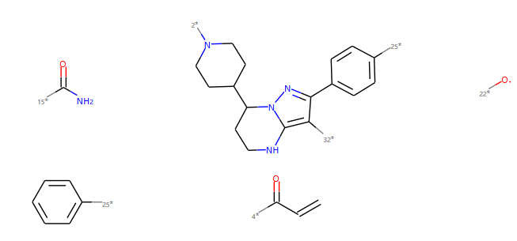

化学性质和药效团
===================================


化学性质 
---------------------
为了要得到分子的化学性质，你只要建立一个化学性质对象。

示例代码：

.. code-block:: py
    
  from rdkit import Chem
  from rdkit.Chem import ChemicalFeatures
  from rdkit import RDConfig
  import os
  fdefName = os.path.join(RDConfig.RDDataDir,'BaseFeatures.fdef')
  factory = ChemicalFeatures.BuildFeatureFactory(fdefName)
  
  smi='C=CC(=O)N1CCC(CC1)C2CCNC3=C(C(=NN23)C4=CC=C(C=C4)OC5=CC=CC=C5)C(=O)N'
  m=Chem.MolFromSmiles(smi)
  feats = factory.GetFeaturesForMol(m)
  len(feats)
  for f in feats:
      print(f.GetFamily(),f.GetType(),f.GetAtomIds())

输出：


.. code-block:: console
  
  Donor SingleAtomDonor (4,)
  Donor SingleAtomDonor (13,)
  Donor SingleAtomDonor (34,)
  Acceptor SingleAtomAcceptor (3,)
  Acceptor SingleAtomAcceptor (17,)
  Acceptor SingleAtomAcceptor (25,)
  Acceptor SingleAtomAcceptor (33,)
  Aromatic Arom5 (14, 15, 16, 17, 18)
  Aromatic Arom6 (19, 20, 21, 22, 23, 24)
  Aromatic Arom6 (26, 27, 28, 29, 30, 31)
  Hydrophobe ThreeWayAttach (7,)
  Hydrophobe ThreeWayAttach (15,)
  Hydrophobe ThreeWayAttach (19,)
  Hydrophobe ChainTwoWayAttach (1,)
  LumpedHydrophobe RH6_6 (19, 20, 21, 22, 23, 24)
  LumpedHydrophobe RH6_6 (26, 27, 28, 29, 30, 31)
  

2D 药效团指纹
------------------------------
对上面计算的性质进行组合可以用作分子的2D药效团。
药效团可以进一步转化为分子药效团指纹。

示例代码

.. code-block:: py
  
  from rdkit import Chem
  from rdkit.Chem import ChemicalFeatures
  # fdefName = 'MinimalFeatures.fdef'
  # featFactory = ChemicalFeatures.BuildFeatureFactory(fdefName)
  fdefName = os.path.join(RDConfig.RDDataDir,'BaseFeatures.fdef')
  featFactory = ChemicalFeatures.BuildFeatureFactory(fdefName)
  from rdkit.Chem.Pharm2D.SigFactory import SigFactory
  sigFactory = SigFactory(featFactory,minPointCount=2,maxPointCount=3)
  sigFactory.SetBins([(0,2),(2,5),(5,8)])
  sigFactory.Init()
  sigFactory.GetSigSize()
  
  
  from rdkit.Chem.Pharm2D import Generate
  mol = Chem.MolFromSmiles('OCC(=O)CCCN')
  fp = Generate.Gen2DFingerprint(mol,sigFactory)
  print("figerprint size",fp.GetNumBits())
  print("figerprint string top 10 bit",fp.ToBitString()[0:11])

输出：

.. code-block:: console

  figerprint size 2988
  figerprint string top 10 bit 01000001101

查看有效bit及其含义
----------------------
药效团指纹和ECFP4指纹一样也是稀疏向量，大部分位置都是0。
有效bit指的是位置不是0的bit。

示例代码：

.. code-block:: py

  print("bit==1 have these position",list(fp.GetOnBits()))
  print("1 postion bit",sigFactory.GetBitDescription(1))
  print("7 postion bit",sigFactory.GetBitDescription(7))
  print("0 postion bit",sigFactory.GetBitDescription(0))
  print("2223 postion bit",sigFactory.GetBitDescription(2223))


输出：

.. code-block:: console

  bit==1 have these position [1, 7, 8, 10, 20, 47, 49, 59, 63, 73, 171, 191, 267, 488, 503, 511, 579, 622, 698, 1687, 1798, 1874, 2223]
  1 postion bit Acceptor Acceptor |0 1|1 0|
  7 postion bit Acceptor Donor |0 1|1 0|
  0 postion bit Acceptor Acceptor |0 0|0 0|
  2223 postion bit Hydrophobe Hydrophobe PosIonizable |0 0 1|0 0 1|1 1 0|
  


分子片段
========================
RDKit中包含了大量把分子分解成片段的方法和处理片段的工具。

RDKit中内置了一些重要的化学官能团，

示例代码：

.. code-block:: py
  
  fName=os.path.join(RDConfig.RDDataDir,'FunctionalGroups.txt')
  from rdkit.Chem import FragmentCatalog
  fparams = FragmentCatalog.FragCatParams(1,6,fName)
  fparams.GetNumFuncGroups()
  mols=[]
  for i in range(fparams.GetNumFuncGroups()):
      mols.append(fparams.GetFuncGroup(i))
  Draw.MolsToGridImage(mols,molsPerRow=8)
  

输出：

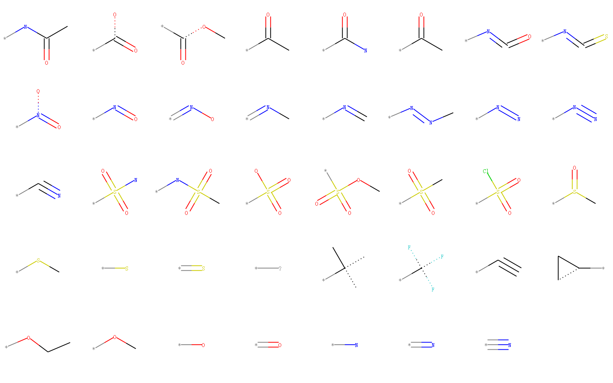

然后基于这份官能团列表，我们就可以分析分子中有多少个官能团。

代码如下：

.. code-block:: py

  fcat=FragmentCatalog.FragCatalog(fparams)
  fcgen=FragmentCatalog.FragCatGenerator()
  m = Chem.MolFromSmiles('OCC=CC(=O)O')
  fcgen.AddFragsFromMol(m,fcat)
  num_entries=fcat.GetNumEntries()
  print("matched the function group ids is",list(fcat.GetEntryFuncGroupIds(num_entries-1)))
  fg1=fparams.GetFuncGroup(1)
  fg34=fparams.GetFuncGroup(34)
  print("name of group 1 ",fg1.GetProp('_Name'))
  print("name of group 34 ",fg34.GetProp('_Name'))
  
  mols=[fg1,fg34]
  Draw.MolsToGridImage(mols,molsPerRow=2)

输出：

.. code-block:: console

  matched the function group ids is [34, 1]
  name of group 1  -C(=O)O
  name of group 34  -O

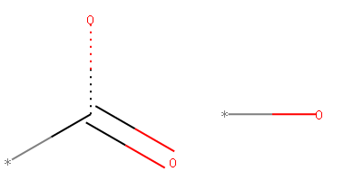

  

R基团分解
---------------------
RDKit中自动提取R基团的算法 rdRGroupDecomposition。使用起来非常方便。

示例代码：

.. code-block:: py

  from rdkit import Chem
  from rdkit.Chem import rdRGroupDecomposition as rdRGD
  smis=['OC(C1=CC(O)=CC=C1)=O',
        'OC(C2=CC(F)=CC=C2)=O',
        'OC(C3=C(Br)C=CC=C3)=O'
       ]
  
  mols=[]
  for smi in smis:
      mols.append(Chem.MolFromSmiles(smi))
  
  print("number of mols",len(mols))
  
  core = Chem.MolFromSmarts('[*:1]c1cc([*:2])ccc1')
  res,unmatched = rdRGD.RGroupDecompose([core],mols,asSmiles=True)
  res


输出：

.. code-block:: console

  [{'Core': 'c1cc([*:1])c([*:3])c([*:2])c1',
    'R1': 'O=C(O)[*:1]',
    'R2': 'O[*:2]',
    'R3': '[H][*:3]'},
   {'Core': 'c1cc([*:1])c([*:3])c([*:2])c1',
    'R1': 'O=C(O)[*:1]',
    'R2': 'F[*:2]',
    'R3': '[H][*:3]'},
   {'Core': 'c1cc([*:1])c([*:3])c([*:2])c1',
    'R1': 'O=C(O)[*:1]',
    'R2': '[H][*:2]',
    'R3': 'Br[*:3]'}]
  
对结果进行可视化。


RDKit中非化学相关功能
=============================

Bit vectors
--------------------------
Bit vectors are containers for efficiently storing a set number of binary values, e.g. for fingerprints.
The RDKit includes two types of fingerprints differing in how they store the values internally;
the two types are easily interconverted but are best used for different purpose:

1.SparseBitVects store only the list of bits set in the vector; they are well suited for storing very large, very sparsely occupied vectors like pharmacophore fingerprints. Some operations, such as retrieving the list of on bits, are quite fast. Others, such as negating the vector, are very, very slow.
#.ExplicitBitVects keep track of both on and off bits. They are generally faster than SparseBitVects, but require more memory to store.

Discrete value vectors 
---------------------------


Points 
----------------------

获取帮助
========================
help函数获取函数方法的文档。

help 接受类的方法，对象的方法。

help(function_name)


推荐使用jupyter notebook 
-------------------------------
支持命令补全和结构可视化，对于探索和学习python 代码非常方便。

强烈推荐使用jupyter notebook 学习python和RDKit等内容。

高级主题
=========================

编辑分子
-------------------------
编辑实时(in-place)发生。如果希望得到合理的化学结构，一定要记得sanitize检查和修正。

如把苯环上的第一个C原子修改成N原子。

示例代码

.. code-block:: py

  m = Chem.MolFromSmiles('c1ccccc1')
  print("修改前的分子：")
  display(m)
  
  m.GetAtomWithIdx(0).SetAtomicNum(7)
  Chem.SanitizeMol(m)
  print("修改后的分子：")
  display(m)

输出：

.. code-block:: console


  修改前的分子：
  


  修改后的分子：
 

 
 更加复杂的变化可以通过
 `rdkit.Chem.rdchem.RWMol <https://www.rdkit.org/docs/source/rdkit.Chem.rdchem.html#rdkit.Chem.rdchem.RWMol>`_  类完成。


其他提示
===================

Chem 和AllChem的区别
--------------------------------
Chem: 负责基础常用的化学功能（如：读写分子，子结构搜索，分子美化等）。
AllChem: 负责高级但不常用的化学功能。
区分它们的目的是为了加速载入的速度。
如果你觉得区分它们比较麻烦，你可以使用import as 语法对它们进行合并。


.. code-block:: py

  from rdkit.Chem import AllChem as Chem


SSSR问题
----------------
As others have ranted about with more energy and eloquence than I intend to, 
the definition of a molecule’s smallest set of smallest rings is not unique. In some high symmetry molecules, 
a “true” SSSR will give results that are unappealing. For example, the SSSR for cubane only contains 5 rings, even though there are “obviously” 6. This problem can be fixed by implementing a small (instead of smallest) set of smallest rings algorithm that returns symmetric results. This is the approach that we took with the RDKit.

Because it is sometimes useful to be able to count how many SSSR rings are present in the molecule,
there is a rdkit.Chem.rdmolops.GetSSSR() function, but this only returns the SSSR count, 
not the potentially non-unique set of rings.

License
===================
This document is copyright (C) 2007-2016 by Greg Landrum

This work is licensed under the Creative Commons Attribution-ShareAlike 4.0 License.
To view a copy of this license, visit http://creativecommons.org/licenses/by-sa/4.0/ or 
send a letter to Creative Commons, 543 Howard Street, 5th Floor, San Francisco, California, 94105, USA.

The intent of this license is similar to that of the RDKit itself. 
In simple words: “Do whatever you want with it, but please give us some credit.”

我们对该文档进行了翻译和修改，发布在 http://rdkit.chenzhaoqiang.com/ 。


