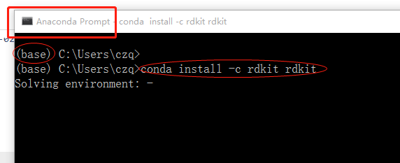
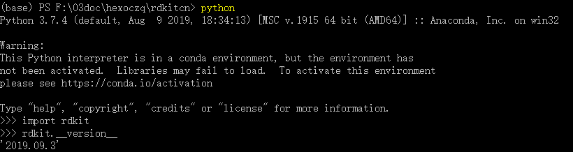

.. _install:

=====================
安装指南
=====================
[`Installation <https://www.rdkit.org/docs/Install.html#installation>`__]

anaconda安装方式适合不同的操作系统（强烈推荐）。

anaconda python
------------------------------------------------------------------------------------------------------------

anaconda介绍
------------------------------------------------------------------------------------------------------------
anaconda python 是非常好用的python解释器，自带多种好用功能，如：建立python虚拟环境、conda软件包管理工具等。
conda 命令包能够非常方便的安装各种预编译好的软件包，常用的软件通常都为提供相应的conda软件包。
conda 命令也可以帮忙创建独立的python环境。

安装anaconda python 
------------------------------------------------------------------------------------------------------------
去`anaconda 官网 <https://www.anaconda.com/distribution/#download-section>`__ 根据操作系统，下载相应的anaconda python 软件包安装即可。
推荐anaconda 3,自带python3 解释器。

windonws 先安装rdkit
------------------------------------
我的电脑是win10,64位。以我的电脑为例，首先下载 anaconda python 3.

.. figure:: _static/anaconda_install2020-02-07_132106.999478.png
	:width: 500
	:align: center
	:figclass: align-center

	下载anacond pyhon

.. note::
	打开 anaconda promt.

这里我就直接在base环境下安装rdkit,

.. code-block:: console
   
   conda install -c rdkit rdkit

在anaconda promt 中测试是否安装成功。在cmd中输入

.. code-block:: console

   python
   >import rdkit
   >rdkit.__version__
   
如果能看到rdkit的版本则说明安装成功, 如下图所示。

linux下安装rdkit
--------------------------
step1 去`anaconda 官网 <https://www.anaconda.com/distribution/#download-section>`__ 下载linux版本的Anaconda3*.sh文件；

step2 在终端中运行

.. code-block:: console

   sh Anaconda*.sh

step3 用conda命令安装rdkit

.. code-block:: console

   conda install -c rdkit rdkit
   

