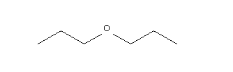
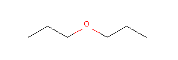
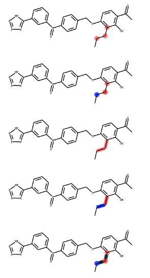

.. _mediaManual:

=====================
进阶教程
=====================
主要讲述RDKit主要讲述RDKit中不常见但很重要的功能以及一些方法的参数细节。

绘图
=====================

绘制不带颜色的分子图片
-----------------------------
opts.elemDict这个参数可以控制不同元素的颜色，

.. code-block:: py

  def defaultDrawOptions():
      '''This function returns an RDKit drawing options object with 
      default drawing options.'''
  
      opts = Draw.DrawingOptions()
      # opts.elemDict = defaultdict(lambda: (0,0,0)) # all atoms are black
      opts.noCarbonSymbols = True
      opts.selectColor = (1, 0, 0)
      opts.wedgeBonds = True
      
      opts.elemDict = defaultdict(lambda: (0, 0, 0))
      opts.dotsPerAngstrom = 20
      opts.bondLineWidth = 1.5
      atomLabelFontFace = 'arial'
  
      return opts
  options=defaultDrawOptions()
  opts.elemDict = defaultdict(lambda: (0, 0, 0))

设置成（0,0,0）代表每个元素的颜色都为黑色。

RDkit 中默认元素的颜色：

.. code-block:: py

  import rdkit.Chem.Draw as Draw
  opts2 = Draw.DrawingOptions()
  print(opts2.elemDict)

输出：

.. code-block:: console

  {1: (0.55, 0.55, 0.55),  # H
   7: (0, 0, 1),           # N
   8: (1, 0, 0),           # O
   9: (0.2, 0.8, 0.8),     # F
   15: (1, 0.5, 0),        # P
   16: (0.8, 0.8, 0),      # S
   17: (0, 0.8, 0),        # Cl
   35: (0.5, 0.3, 0.1),    # Br
   53: (0.63, 0.12, 0.94), # I
   0: (0.5, 0.5, 0.5)}     #  ?

示例代码

.. code-block:: py

  import rdkit.Chem.Draw as Draw
  mol= Chem.MolFromSmiles('CCCOCCC')
  opts1 = Draw.DrawingOptions()
  opts1.elemDict = defaultdict(lambda: (0, 0, 0))
  img1 = Draw.MolToImage(mol,  options=opts1)
  opts2 = Draw.DrawingOptions()
  img2_color = Draw.MolToImage(mol,  options=opts2)
  display(img1)
  display(img2_color)

输出：

高亮原子和键的颜色 d2d.DrawMolecule
----------------------------------------
我看到子结构匹配的图片时候，感觉非常漂亮，于是看了一下源码知道其是如何绘制高亮图片的。
主要是借助了**d2d.DrawMolecule**函数，里面参数有高亮的atom id列表，bond id列表，
以及自定义atom背景颜色和bond背景颜色的字典。我对其简单封装成了clourMol函数。

示例代码如下：

.. code-block:: py

  from rdkit import Chem
  from rdkit.Chem.Draw import rdMolDraw2D
  from io import BytesIO
  import numpy as np
  from PIL import Image, ImageOps
  def _drawerToImage(d2d):
      try:
          import Image
      except ImportError:
          from PIL import Image
      sio = BytesIO(d2d.GetDrawingText())
      return Image.open(sio)
  
  def clourMol(mol,highlightAtoms_p=None,highlightAtomColors_p=None,highlightBonds_p=None,highlightBondColors_p=None,sz=[400,400]):
      '''
      
      '''
      d2d = rdMolDraw2D.MolDraw2DCairo(sz[0], sz[1])
      op = d2d.drawOptions()
      op.dotsPerAngstrom = 20
      op.useBWAtomPalette()
      mc = rdMolDraw2D.PrepareMolForDrawing(mol)
      d2d.DrawMolecule(mc, legend='', highlightAtoms=highlightAtoms_p,highlightAtomColors=highlightAtomColors_p, highlightBonds= highlightBonds_p,highlightBondColors=highlightBondColors_p)
      d2d.FinishDrawing()
      product_img=_drawerToImage(d2d)
      return product_img
  def StripAlphaFromImage(img):
      '''This function takes an RGBA PIL image and returns an RGB image'''
  
      if len(img.split()) == 3:
          return img
      return Image.merge('RGB', img.split()[:3])
  
  
  def TrimImgByWhite(img, padding=10):
      '''This function takes a PIL image, img, and crops it to the minimum rectangle 
      based on its whiteness/transparency. 5 pixel padding used automatically.'''
  
      # Convert to array
      as_array = np.array(img)  # N x N x (r,g,b,a)
  
      # Set previously-transparent pixels to white
      if as_array.shape[2] == 4:
          as_array[as_array[:, :, 3] == 0] = [255, 255, 255, 0]
  
      as_array = as_array[:, :, :3]
  
      # Content defined as non-white and non-transparent pixel
      has_content = np.sum(as_array, axis=2, dtype=np.uint32) != 255 * 3
      xs, ys = np.nonzero(has_content)
  
      # Crop down
      margin = 5
      x_range = max([min(xs) - margin, 0]), min([max(xs) + margin, as_array.shape[0]])
      y_range = max([min(ys) - margin, 0]), min([max(ys) + margin, as_array.shape[1]])
      as_array_cropped = as_array[
          x_range[0]:x_range[1], y_range[0]:y_range[1], 0:3]
  
      img = Image.fromarray(as_array_cropped, mode='RGB')
  
      return ImageOps.expand(img, border=padding, fill=(255, 255, 255))
  
  
  smi = 'CCCc1c(OCc2ccc(S(=O)c3cccc(-c4nnn[nH]4)c3)cc2)ccc(C(C)=O)c1O'
  mol =  Chem.MolFromSmiles(smi)
  #hight atoms
  img1 = clourMol(mol,highlightAtoms_p=[1,2,3])
  img1 =StripAlphaFromImage(img1)
  img1 = TrimImgByWhite(img1)
  display(img1)
  # custom atom color
  img2=clourMol(mol,highlightAtoms_p=[1,2,3],highlightAtomColors_p={1:(0.2,0.3,1),2:(1,0.3,0.3)})
  img2 =StripAlphaFromImage(img2)
  img2 = TrimImgByWhite(img2)
  display(img2)
  # hight bond
  img3 = clourMol(mol,highlightBonds_p=[1,2])
  img3 =StripAlphaFromImage(img3)
  img3 = TrimImgByWhite(img3)
  display(img3)
  # custom bond color
  img4 = clourMol(mol,highlightBonds_p=[1,2],highlightBondColors_p={1:(0.1,0.2,1),2:(1,0.3,0.3)})
  img4 = TrimImgByWhite(img4)
  display(img4)
  
  #all
  img5 = clourMol(mol,highlightAtoms_p=[1,2,3],highlightAtomColors_p={1:(0.2,0.3,1),2:(1,0.3,0.3)},highlightBonds_p=[1,2],highlightBondColors_p={1:(0.1,0.2,0.3),2:(0.1,0.3,0.3)})
  img5 = TrimImgByWhite(img5)
  display(img5)

输出：

The RDKit Aromaticity Model
--------------------------------

The Simple Aromaticity Model
-------------------------------

The MDL Aromaticity Model
------------------------------------

SMILES Support and Extensions
=======================================

SMARTS Support and Extensions
========================================

Ring Finding and SSSR
=============================

Reaction SMARTS
==============================
        Some features
        Chirality
        Rules and caveats

The Feature Definition File Format
=======================================

Representation of Pharmacophore Fingerprints
=====================================================

Atom-Atom Matching in Substructure Queries
===================================================

Molecular Sanitization
==========================================

Implementation Details
=======================================

Atom Properties and SDF files
===================================

Support for Enhanced Stereochemistry
=======================================

Additional Information About the Fingerprints
===================================================

license
=========================

