.. _rdkitbook:

=====================
详细教程 RDkit Book
=====================

本文档主要翻译于  `The RDKit Book <https://www.rdkit.org/docs/RDKit_Book.html>`_ 。

芳香性
=====================
芳香性是一个既简单又复杂的问题。
不管是实验化学家还是理论化学家都无法给出芳香性的准确且唯一的定义。

RDKit 除了通过模式匹配已知的芳香体系进行识别，还定义一些识别芳香体系的规则。
这些规则非常直观：

1. 芳香性仅仅和环上的原子和键有关。
2. 芳香性键必须是由2个芳香性原子组成的。
3. 由2个芳香性原子组成键不一定就是芳香键。

我们绘制示例分子，如下

.. code-block:: py
  
  from rdkit.Chem import  Draw
  from rdkit.Chem.Draw import IPythonConsole #Needed to show molecules
  from rdkit.Chem.Draw.MolDrawing import MolDrawing, DrawingOptions #Only needed if modifying defaults
  
  opts =  DrawingOptions()
  opts.atomLabelFontSize=400
  
  opts.includeAtomNumbers=True
  opts.dblBondLengthFrac=0.8
  opts.includeAtomNumbers=True
  opts.dotsPerAngstrom=1000
  Draw.MolToImage(m,options=opts,size=(500, 500))

结构如图

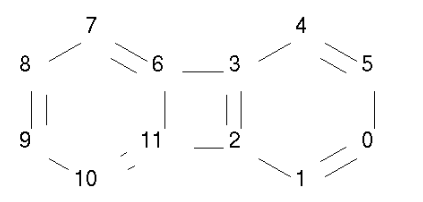

基于RDKit芳香模型判断其上的原子和键的芳香性

.. code-block:: py

  arom_atom3=m.GetAtomWithIdx(3).GetIsAromatic()
  arom_atom6=m.GetAtomWithIdx(6).GetIsAromatic()
  bond_36=m.GetBondBetweenAtoms(3,6).GetIsAromatic()
  
  print("atom 3 aromatic is",arom_atom3)
  print("atom 6 aromatic is",arom_atom6)
  print("bond 36 aromatic is",bond_36)

输出：

.. code-block:: console

  atom 3 aromatic is True
  atom 6 aromatic is True
  bond 36 aromatic is False

RDKit 芳香模型
--------------------------------
芳香性是针对环体系（含融和环体系）原子和键而言的，如果该环上的pi电子满足4N+2规则，则组成该环的原子和键具有芳香性。

PI电子的计算根据原子的类型和环境具体，如下表所示。

+----------+------------------------+-------------------------------------------------------------+
| 匹配模式 | pi electrons 数目      | 解释                                                        |
+----------+------------------------+-------------------------------------------------------------+
| c(a)a    | 1                      |芳香碳原子，链接两个芳香原子，则该碳原子贡献一个PI电子       |
+----------+------------------------+-------------------------------------------------------------+
| n(a)a    | 1                      |芳香氮原子，链接两个芳香原子，则该氮原子贡献一个PI电子       |
+----------+------------------------+-------------------------------------------------------------+
| An(a)a   | 2                      |芳香氮原子，链接2个芳香原子和1个任意原子的时候，贡献2个PI电子|
+----------+------------------------+-------------------------------------------------------------+
| o(a)a    | 2                      |芳香氧原子，链接2个芳香原子，贡献2个PI电子                   |
+----------+------------------------+-------------------------------------------------------------+
| s(a)a    | 2                      |同上                                                         |
+----------+------------------------+-------------------------------------------------------------+
| se(a)a   | 2                      |同上                                                         |
+----------+------------------------+-------------------------------------------------------------+
| te(a)a   | 2                      |同上                                                         |
+----------+------------------------+-------------------------------------------------------------+
| O=c(a)a  | 0                      |芳香碳原子链接2个芳香原子，同时参与形成羰基，贡献0个PI电子   |
+----------+------------------------+-------------------------------------------------------------+
| N=c(a)a  | 0                      |同上                                                         |
+----------+------------------------+-------------------------------------------------------------+
| \*(a)a   | 0, 1, or 2             |                                                             |
+----------+------------------------+-------------------------------------------------------------+

.. note::

	a: 芳香原子
	A： 任何原子，包含H
	\*: 虚拟原子
	
知道上面的规则后，我们对下面5个分子进行判断环的芳香性。

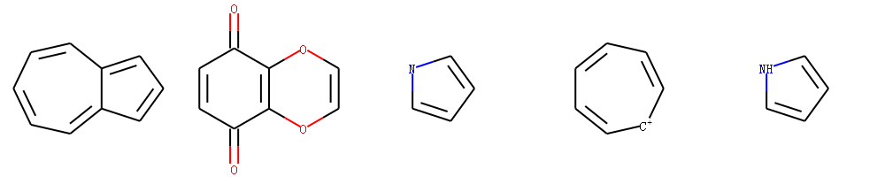

示例代码：

.. code-block:: py

  for id ,mol in enumerate(mols):
      rinfo= mol.GetRingInfo()
      num =rinfo.NumRings()
      print("The %s mol has %s ring"%(id,num))
      rings_bond = rinfo.BondRings()
      bondsobj    =mol.GetBonds()
  #     print(bonds)
      arominfo=''
      for bonds in rings_bond:
          flag=True
  
          for bondid in bonds: 
              if not  bondsobj[bondid].GetIsAromatic():
                  flag=False
                  break
          arominfo+=str(flag)+" "
      print("arom of rings",arominfo)
          
输出：

.. code-block:: console

  The 0 mol has 2 ring
  arom of rings False False 
  The 1 mol has 2 ring
  arom of rings False False 
  The 2 mol has 1 ring
  arom of rings False 
  The 3 mol has 1 ring
  arom of rings False 
  The 4 mol has 1 ring
  arom of rings True 

.. note::
	注意第一个分子虽然两个环不是芳香性的，但是整体是芳香性的。

对第一个分子进行芳香键进行匹配着色。

简单的芳香模型体系
-------------------------------
仅仅考虑5元环或者6元环的芳香性。其电子贡献匹配模式和上面的列表一致。

MDL芳香模型体系
------------------------------------
MDL 芳香模型体系的定义没有公开的文档对其进行说明，
唯一的介绍就是`oechem 文档 <https://docs.eyesopen.com/toolkits/python/oechemtk/aromaticity.html>`_（https://docs.eyesopen.com/toolkits/python/oechemtk/aromaticity.html）。

MDL芳香模型体系，有如下特点：

1. 融合环也可能具有芳香性 ，如甘菊环分子，大的融合环有芳香性，两个小环没有芳香性。
#. 五元环没有芳香性 
#. 只有C和N 原子具有芳香性 
#. 只接受原子提供一个PI电子的原子为芳香原子 
#. 原子在环外连接双键，则该原子没有芳香性 atoms with exocyclic double bonds are not aromatic

.. note::
	放了方便计算，对于融合环的芳香性判断，其原子最多只允许有24个原子。

SMILES 支持和扩展 
=======================================
RDKit 包含了Daylight SMILES的所有标准形式以及有用的拓展形式。

下面是部分有用的拓展。

芳香性
--------------------
Te 元素（和氧同族的元素）也可能具有芳香性，当其连接2个芳香原子时候，它贡献2个PI电子。

示例分子（碲吩-2甲酸分子）

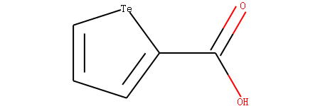

Te 原子的编号是4，我们查看其芳香性。

.. code-block:: py
  
  m = Chem.MolFromSmiles('OC(=O)c1[te]ccc1')
  arom_atom4=m.GetAtomWithIdx(4).GetIsAromatic()
  print("atom4 is aromatic",arom_atom4)

输出：

.. code-block:: console

  atom4 is aromatic True

配位键
---------------------------
RDKit通过-> 和 <-来支持配位键表示，箭头的方向非常重要，代表了谁提供了电子。

配位键不会影响起始原子的价态，只会影响指向原子的价态。

以下面3个分子为例

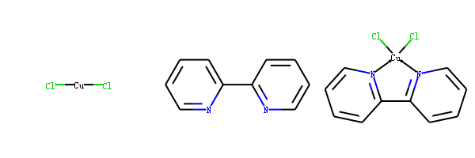

示例代码：

.. code-block:: py
  
  cu_mol= Chem.MolFromSmiles('[Cu](Cl)Cl')
  cu_atom=cu_mol.GetAtoms()[0]
  print("cu atom Valence in the first molecule",cu_atom.GetExplicitValence())
  bipy = Chem.MolFromSmiles('C1(C2=NC=CC=C2)=CC=CC=N1')
  natom=bipy.GetAtoms()[2]
  print("N atom Valence in the second molecule",natom.GetExplicitValence())
  bipycu = Chem.MolFromSmiles('c1cccn->2c1-c1n->3cccc1.[Cu]23(Cl)Cl')
  natom=bipycu.GetAtoms()[4]
  print("N atom Valence in the third molecule",natom.GetExplicitValence())
  cuatom=bipycu.GetAtoms()[12]
  print("cu atom Valence in the third molecule",cuatom.GetExplicitValence())

输出

.. code-block:: console
  
  cu atom Valence in the first molecule 2
  N atom Valence in the second molecule 3
  N atom Valence in the third molecule 3
  cu atom Valence in the third molecule 4

我们看到在配位后Cu的价态由二价变为四价，N的价态不变 还是三价。

闭环
---------------------------------------
RDKit 除了支持[atom]n的方式表示闭环外，还支持%(N)的表示方法。
N的方位是0-99999；N 可以不从0开始，可以是任意数字。

环氧丙烷的表示方式，示例代码：

.. code-block:: py
  
  mol1 = Chem.MolFromSmiles('C%(1000)OC%(1000)')
  mol2 = Chem.MolFromSmiles('C2OC2')
  mol3 = Chem.MolFromSmiles('C1OC1')
  

通过 atomic number 指定原子
----------------------------------
RDKit 除了直接指定原子symbol 也支持通过atomic number来指定原子[atomic number]。
atomic number 默认是在SMARTS中使用的，Smiles 也支持这种形式。

示例代码：

.. code-block:: py

  mol1 = Chem.MolFromSmiles('C1OC1')
  mol2 = Chem.MolFromSmiles('[#6]1[#8][#6]1')
  

ChemAxon SMILES 拓展 CXSMILES extensions
----------------------------------------------
RDKit 支持部分ChemAxon 拓展的SMILES 语法功能。

比如

1. atomic coordinates
#. atomic values
#. atomic labels
#. atomic properties
#. coordinate bonds (these are translated into double bonds)
#. radicals
#. enhanced stereo (these are converted into StereoGroups)

下面这几个性质可通过方法` rdkit.Chem.rdmolfiles.MolToCXSmiles()  <https://www.rdkit.org/docs/source/rdkit.Chem.rdmolfiles.html#rdkit.Chem.rdmolfiles.MolToCXSmiles>`_ 导出ChemAxon 格式的SMILES.  

1. atomic coordinates
#. atomic values
#. atomic labels
#. atomic properties
#. radicals
#. enhanced stereo

示例代码：

.. code-block:: py

m = Chem.MolFromSmiles('OC')
m.GetAtomWithIdx(0).SetProp('p1','2')
m.GetAtomWithIdx(1).SetProp('p1','5')
m.GetAtomWithIdx(1).SetProp('p2','A1')
m.GetAtomWithIdx(0).SetProp('atomLabel','O1')
m.GetAtomWithIdx(1).SetProp('atomLabel','C2')
Chem.MolToCXSmiles(m)

输出：

.. code-block:: console

  'CO |$C2;O1$,atomProp:0.p1.5:0.p2.A1:1.p1.2|'
  
ChemAxon SMILES 功能越多，可读性越差。

SMARTS 支持和拓展 
========================================
RDKit 支持Daylight 定义的SMARTS 的绝大部分标准特性以及一些有用的拓展。

下面是RDKit 不支持的特性。

1. 非四面体手性  轴手性
#. @? 操作符号 
#. 显式原子质量（同位素定义查询支持）
#. 片段组的查询  (C).(C)

Here’s the (hopefully complete) list of SMARTS features that are not supported:

    Non-tetrahedral chiral classes
    the @? operator
    explicit atomic masses (though isotope queries are supported)
    component level grouping requiring matches in different components, i.e. (C).(C)

下面的特性 RDKit 是支持的。

杂化方式查询
---------------------------------

杂化方式在SMARTS 中通过^符号进行定义。
如：

1. ^0  匹配S 杂化的原子
#. ^1  匹配SP 杂化的原子
#. ^2  匹配SP2 杂化的原子
#. ^3  匹配SP3 杂化的原子
#. ^4  匹配SP3D 杂化的原子
#. ^5  匹配SP3D2 杂化的原子

以aspirin分子为例，示例代码：

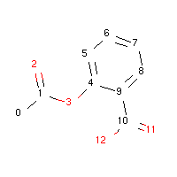

.. code-block:: py

  asp = Chem.MolFromSmiles('CC(=O)OC1=CC=CC=C1C(=O)O')
  sp2atoms = asp.GetSubstructMatches(Chem.MolFromSmarts('[^2]'))
  sp3atoms = asp.GetSubstructMatches(Chem.MolFromSmarts('[^3]'))
  print("sp2 atoms",sp2atoms)
  print("sp3 atoms",sp3atoms)
  
  
输出：

.. code-block:: console

  sp2 atoms ((1,), (2,), (3,), (4,), (5,), (6,), (7,), (8,), (9,), (10,), (11,), (12,))
  sp3 atoms ((0,),)

对于分子阿司匹林，只有0号原子是SP3杂化，其他原子都是SP2杂化。

.. note::
	苯酚中的氧都是sp2，所以羟基氢才具有更强酸性。
	COO中的两个氧都是sp2杂化
	羧基中也有类似苯环的共轭体系，并且羧酸中羟基氢酸性更强，共轭更明显，更应该是sp2。
	醇羟基中的氧是sp3杂化。 
	
配位键
---------------------
RDKit 的SMARTS 通过-> 和 <- 符号表示配位键，箭头的方向代表电子转移的方向。

<- and -> match the corresponding dative bonds, direction does matter.

示例代码

.. code-block:: py
  Chem.MolFromSmiles('C1=CC=CC=N1->[Fe]').GetSubstructMatches(Chem.MolFromSmarts('[#7]->*'))   #((5, 6),)
  Chem.MolFromSmiles('C1=CC=CC=N1->[Fe]').GetSubstructMatches(Chem.MolFromSmarts('*<-[#7]'))  #((6, 5),)

邻居杂原子查询
--------------------------
根据碳原子相连杂原子的个数进行查询

1. zn 代表匹配相连n个杂原子（非C H原子）的碳原子，比如 z2 代表相连2个杂原子的任意碳原子。
2. Zn 代表匹配相连n个脂肪族杂原子（非C H原子）的碳原子，比如 Z2 代表相连2个脂肪杂原子的碳原子。 

.. note::
	在有机化学中，一般将有机物分为三类：
	1.开链化合物，分子中的碳原子连接成链状，又称为“脂肪族化合物”；
	2.碳环化合物，分子中的碳原子连接成环状，包括脂环族和芳香族化合物；
	3.杂环化合物，即分子中含有其他原子（如O、N、S、P等）的环状化合物。

示例分子：

示例代码：

.. code-block:: py

  mol=Chem.MolFromSmiles('O=C(O)c1nc(O)ccn1')
  z2atoms = mol.GetSubstructMatches(Chem.MolFromSmarts('[z2]'))
  Z2atoms = mol.GetSubstructMatches(Chem.MolFromSmarts('[Z2]'))
  Z1atoms = mol.GetSubstructMatches(Chem.MolFromSmarts('[Z1]'))
  print("z2atoms",z2atoms)
  print("Z2atoms",Z2atoms)
  print("Z1atoms",Z1atoms)

输出：

.. code-block:: console
  
  z2atoms ((1,), (3,), (5,))
  Z2atoms ((1,),)
  Z1atoms ((5,),)

该示例分子中和2个杂原子相连的碳原子编号是1，3，5；
和2个脂肪杂原子相连的碳原子编号是1；
和1个脂肪族原子相连的碳原子编号是5.

范围查询
----------------
RDKit SMARTS 语法支持指定范围查询，支持的类型有：D, h, r, R, v, x, X, z, Z, +, -

D代表度；

举例说明

1. D{2-4} 匹配原子的度为2-4的原子，链接2-4个原子的原子matches atoms that have between 2 and 4 (inclusive) explicit connections.
2. D{-3}  匹配原子的度小于等于3的原子
#. D{2-}  匹配原子的度大于等于2的原子

示例分子：

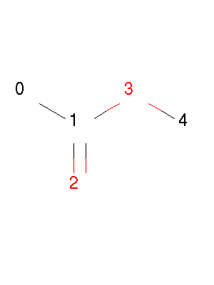

示例代码：

.. code-block:: py

  mol = Chem.MolFromSmiles('CC(=O)OC')
  z1234 = mol.GetSubstructMatches(Chem.MolFromSmarts('[z{1-}]'))
  D23 = mol.GetSubstructMatches(Chem.MolFromSmarts('[D{2-3}]'))
  D012 = mol.GetSubstructMatches(Chem.MolFromSmarts('[D{-2}]')) 
  print("z1234",z1234)
  print("D23",D23)
  print("D012",D012)

输出：

.. code-block:: console

  z1234 ((1,), (4,))
  D23 ((1,), (3,))
  D012 ((0,), (2,), (3,), (4,))
  
SMARTS 语法参考
----------------------

**Atoms**

=========  =========================================  ===============  ======  =========
Primitive                  Property                   "Default value"  Range?    Notes
=========  =========================================  ===============  ======  =========
a          "aromatic atom"
A          "aliphatic atom"
D          "explicit degree"                          1                Y
h          "number of implicit hs"                    >0               Y
H          "total number of Hs"                       1
r          "in SSSR ring of size"                     >0               Y
R          "number of SSSR rings"                     >0               Y
v          "total valence"                            1                Y
x          "number of ring bonds"                     >0               Y
X          "total degree"                             1                Y
z          "number of heteroatom neighbors"           >0               Y       extension
Z          "number of aliphatic heteroatom neighbors" >0               Y       extension
\*         "any atom"
\+         "positive charge"                          1                Y 
++         "+2 charge"
\-         "negative charge"                          1                Y
\--        "-2 charge"
^0         "S hybridized"                             n/a              N       extension
^1         "SP hybridized"                            n/a              N       extension
^2         "SP2 hybridized"                           n/a              N       extension
^3         "SP3 hybridized"                           n/a              N       extension
^4         "SP3D hybridized"                          n/a              N       extension
^5         "SP3D2 hybridized"                         n/a              N       extension
=========  =========================================  ===============  ======  =========

**Bonds**

=========  ====================  ===================
Primitive        Property               Notes
=========  ====================  ===================
""         "single or aromatic"  "unspecified bonds"
\-         single
=          double
#          triple
:          aromatic
~          "any bond"
@          "ring bond"
/          "directional"
\\         "directional"
->         "dative right"        extension
<-         "dative left"         extension
=========  ====================  ===================

Ring Finding and SSSR
=============================
As others have ranted about with more energy and eloquence than I intend to,
一个分子的最小环SSSR（smallest set of smallest rings ）的定义不是唯一的。

在一些高对称的分子中，真实的SSSR的结果是令人疑惑的。
如 立方烷 （）的SSSR 显示是5个(*这里不太理解*)，但是很明显应该是6个。可通过small set of smallest rings 算法解决

示例代码

.. code-block:: py

  from rdkit.Chem import rdDepictor
  rdDepictor.SetPreferCoordGen(True)
  mol=Chem.MolFromSmiles('C12C3C4C1C5C2C3C45')
  num = Chem.GetSSSR(m)
  print("num ssr",num)

输出：

.. code-block:: console

  num ssr 6

-  GetSSSR 函数 返回计算一个分子中SSSR 的数目
-  rdkit.Chem.rdmolops.FastFindRings() 判断原子或者键是否在环上。

化学反应处理Chemical Reaction Handling
=======================================

反应SMARTS Reaction SMARTS
-----------------------------------
RDKit 中的反应SMARTS 基于SMARTS 表达，但是又不同于SMIRKS和reaction SMILES，称为  reaction SMARTS。

 reaction SMARTS 语法如下：

.. productionlist::
  reaction:  reactants ">>" products
  reactants: molecules
  products:  molecules
  molecules: molecule
           : molecules "." molecule
  molecule:  a valid SMARTS string without "." characters
          :  "(" a valid SMARTS string without "." characters ")"

一些特性
------------------------
特性1： 当带有map id 虚原子在模板产物中的时候，产生的产物中的虚原子会被反应物对应的原子替代。

示例代码

.. code-block:: py

  from rdkit.Chem import AllChem
  rxn = AllChem.ReactionFromSmarts('[C:1]=[O,N:2]>>[C:1][*:2]')
  products_r1=[Chem.MolToSmiles(x,1) for x in rxn.RunReactants((Chem.MolFromSmiles('CC=O'),))[0]]
  
  products_r2 =[Chem.MolToSmiles(x,1) for x in rxn.RunReactants((Chem.MolFromSmiles('CC=N'),))[0]]
  print("product r1",products_r1)
  print("product r2",products_r2)
 
输出：

.. code-block:: console

  product r1 ['CCO']
  product r2 ['CCN']

这是一个双键CO CN双键变成单键的反应模板。

特性2： 不带map id 的虚原子在模板产物中的时候，产生的产物依旧带有虚原子。

示例代码：

.. code-block:: py

  rxn = AllChem.ReactionFromSmarts('[C:1]=[O,N:2]>>*[C:1][*:2]')
  [Chem.MolToSmiles(x,1) for x in rxn.RunReactants((Chem.MolFromSmiles('CC=O'),))[0]]

输出：

.. code-block:: console

  ['*C(C)O']

特性3： 产物中键的类型~ 和反应物中键的类型~是对应的，当实际反应物为单键，则产生的产物也是单键。

示例代码：

.. code-block:: py

  rxn = AllChem.ReactionFromSmarts('[C:1]~[O,N:2]>>*[C:1]~[*:2]')
  exp1 = [Chem.MolToSmiles(x,1) for x in rxn.RunReactants((Chem.MolFromSmiles('C=O'),))[0]]
  exp2 = [Chem.MolToSmiles(x,1) for x in rxn.RunReactants((Chem.MolFromSmiles('CO'),))[0]]
  exp3 =[Chem.MolToSmiles(x,1) for x in rxn.RunReactants((Chem.MolFromSmiles('C#N'),))[0]]
  print("exp 1",exp1)
  print("exp 2",exp2)
  print("exp 3",exp3)

输出：

.. code-block:: console

  exp 1 ['*C=O']
  exp 2 ['*CO']
  exp 3 ['*C#N']
  
- 特性3： 分子内反应，通过括号把两个片段括起来说明这两个片段来自于同一个分子。

.. code-block:: py

  rxn = AllChem.ReactionFromSmarts("([C:1]=[C;H2].[C:2]=[C;H2])>>[*:1]=[*:2]")
  m1 = Chem.MolFromSmiles('C=CCOCC=C')
  ps = rxn.RunReactants((m1,))
  product=ps[0][0]
  mols=[m1,product]
  Draw.MolsToGridImage(mols,molsPerRow=2,subImgSize=(250,250),legends=['reactant','product'])
  
输出：

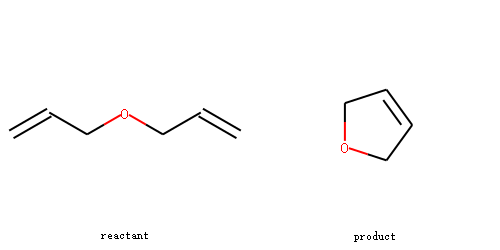

手性
-----------------------

.. note::
	RDKit 通过‘@’，‘@@’符号来表示分子的立体构型，但是和手性R S没有对应关系。
	@标志的原子可能是R构型的原子，也有可能是S构型的原子，也有可能没有手性。
	@代表逆时针芳香；@@代表顺时针芳香。
	https://blog.csdn.net/wangzihao1995/article/details/87862214
  https://www.zealseeker.com/archives/stereochemistry-in-cheminformatics/

示例图片：

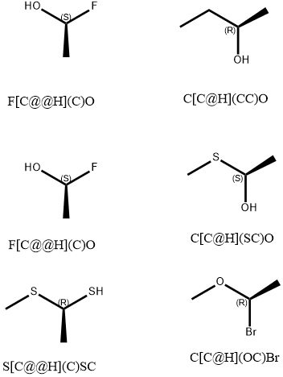

.. code-block:: py

  from rdkit import Chem
  mol = Chem.MolFromSmiles('CC[C@@H](C)SC')
  mol
  
输出：

该分子就没有手性。从Smiles中怎么判断分子到底有没有手性，是R手性还是S手性。

首先找到@标志的中心原子，假设中心原子命名为0号原子，
然后找到和中心原子相连的4个原子，并根据出现smiles中出现的顺序对这4个原子排序，分别命名为1,2,3,4号原子。

1->0 代表了视角的方向，然后根据@（顺时针）或者@@（逆时针）方向防止2，3,4号原子的位置。
最后根据教科书的定义，判断中心原子是R还是S构型。

这一节描述了RDKit 如何处理反应中的手性信息。
为了阐述该问题，我们以仲醇的酯化为例进行讲解分析。

反应物A 如下图所示：

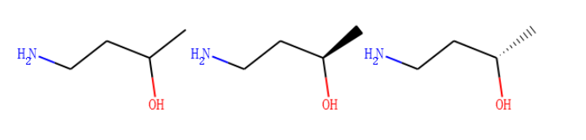

反应物B是乙酸，如下图所示

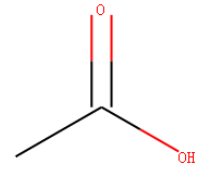

规则一： 如果反应模板中不存在立体信息，则保留反应物对应的立体信息。

反应模板如下图所示

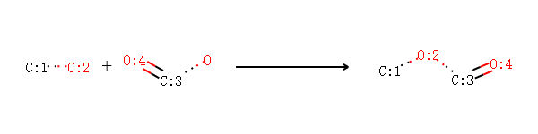

	[CH1:1][OH:2].[OH][C:3]=[O:4]>>[C:1][O:2][C:3]=[O:4]

示例代码：

.. code-block:: py
  
  alcohol1 = Chem.MolFromSmiles('CC(CCN)O')
  alcohol2 = Chem.MolFromSmiles('C[C@H](CCN)O')
  alcohol3 = Chem.MolFromSmiles('C[C@@H](CCN)O')
  
  acid = Chem.MolFromSmiles('CC(=O)O')
  
  rxn = AllChem.ReactionFromSmarts('[CH1:1][OH:2].[OH][C:3]=[O:4]>>[C:1][O:2][C:3]=[O:4]')
  ps=rxn.RunReactants((alcohol1,acid))
  product1=ps[0][0]
  
  ps=rxn.RunReactants((alcohol2,acid))
  product2=ps[0][0]
  
  
  ps=rxn.RunReactants((alcohol3,acid))
  product3=ps[0][0]
  products=[product1,product2,product3]
  # products=[product2,product3]
  for i in products:
      display(i)
      print(Chem.MolToSmiles(i,True))

输出：

.. code-block:: console

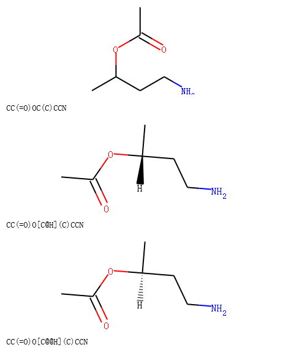

规则二： 如果反应模板中产物和反应物对应的原子立体信息相同，则应用该模板得到的产物保留反应物中的立体信息。

反应模板：

.. code-block:: console

  rxn = AllChem.ReactionFromSmarts('[C@H1:1][OH:2].[OH][C:3]=[O:4]>>[C@:1][O:2][C:3]=[O:4]')

我们可以看到反应模板中羟基相连C原子的手性在反应物和产物中都为@。

示例反应代码：

.. code-block:: py
  
  rxn = AllChem.ReactionFromSmarts('[C@@H1:1][OH:2].[OH][C:3]=[O:4]>>[C@@:1][O:2][C:3]=[O:4]')
  ps=rxn.RunReactants((alcohol1,acid))
  product1=ps[0][0]
  ps=rxn.RunReactants((alcohol2,acid))
  product2=ps[0][0]
  ps=rxn.RunReactants((alcohol3,acid))
  product3=ps[0][0]
  products=[product1,product2,product3]
  for i in products:
      display(i)
      print(Chem.MolToSmiles(i,True))
      
输出：

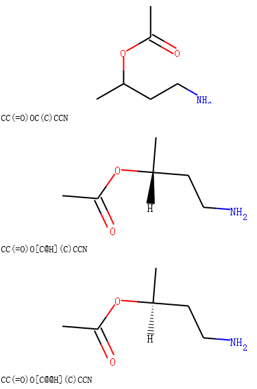

我们可以看到产物中的手性标签和反应物中的手性标签是保持一致的。

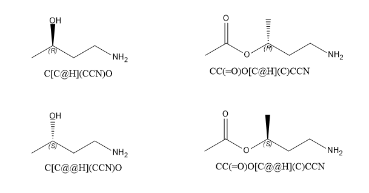

	反应物和产物结构比较

规则3 同一个原子在反应物和产物中有不同的立体信息，则产生的产物立体信息也发生反转。

示例代码：

.. code-block:: py

  rxn = AllChem.ReactionFromSmarts('[C@H1:1][OH:2].[OH][C:3]=[O:4]>>[C@@:1][O:2][C:3]=[O:4]')
  ps=rxn.RunReactants((alcohol1,acid))
  product1=ps[0][0]
  ps=rxn.RunReactants((alcohol2,acid))
  product2=ps[0][0]
  ps=rxn.RunReactants((alcohol3,acid))
  product3=ps[0][0]
  products=[product1,product2,product3]
  for i in products:
      display(i)
      print(Chem.MolToSmiles(i,True))

输出：

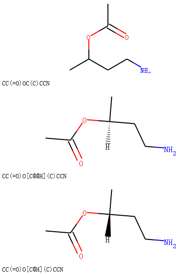

比较反应物和产物，我们发现手性信息发生了反转。

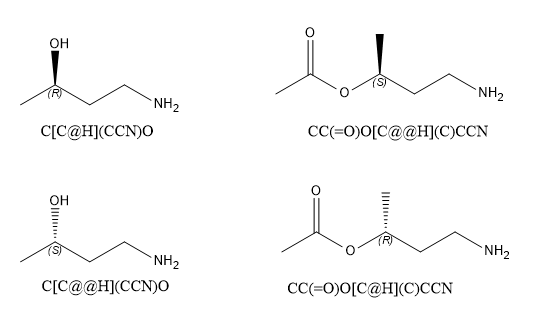

	规则3对应的反应物和产物

规则4： 模板反应物和产物中同一个map id原子，反应物中有手性，产物中没有手性，则根据该模板得到的产物没有立体信息。

示例代码：

.. code-block:: py
  
  rxn = AllChem.ReactionFromSmarts('[C@H1:1][OH:2].[OH][C:3]=[O:4]>>[C:1][O:2][C:3]=[O:4]')
  ps=rxn.RunReactants((alcohol1,acid))
  product1=ps[0][0]
  ps=rxn.RunReactants((alcohol2,acid))
  product2=ps[0][0]
  ps=rxn.RunReactants((alcohol3,acid))
  product3=ps[0][0]
  products=[product1,product2,product3]
  for i in products:
      display(i)
      print(Chem.MolToSmiles(i,True))

输出：

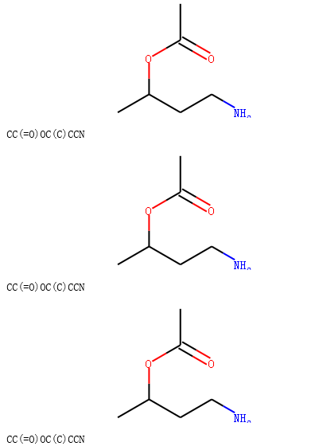

规则5： 模板中同一个原子反应物没有手性，产物有立体信息，则根据该模板得到的产物有立体信息。

示例代码：

.. code-block:: py
  
  rxn = AllChem.ReactionFromSmarts('[CH1:1][OH:2].[OH][C:3]=[O:4]>>[C@:1][O:2][C:3]=[O:4]')
  ps=rxn.RunReactants((alcohol1,acid))
  product1=ps[0][0]
  ps=rxn.RunReactants((alcohol2,acid))
  product2=ps[0][0]
  ps=rxn.RunReactants((alcohol3,acid))
  product3=ps[0][0]
  products=[product1,product2,product3]
  for i in products:
      display(i)
      print(Chem.MolToSmiles(i,True))

输出：

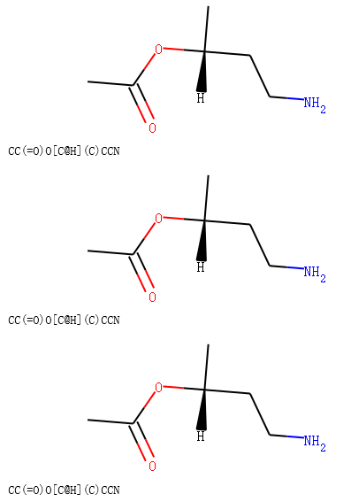

.. note::
	一个分子没有手性可以匹配手性反应物模板；
	RDKit反应引擎尝试保留尽可能多的立体信息。
	
规则6： 当反应中心原子为手性原子的，反应模板没有手性，但仅仅和反应中心原子新形成一根键的时候，
产物默认是继承反应物的立体信息的。如果形成2根键，则产物中是没有立体信息的。

示例代码：

.. code-block:: py
  
  rxn = AllChem.ReactionFromSmarts('[C:1][C:2]-O>>[C:1][C:2]-S')
  alcohol2 = Chem.MolFromSmiles('C[C@@H](O)CCN')
  ps=rxn.RunReactants((alcohol2,))
  product1=ps[0][0]
  # Chem.MolToSmiles(product1,True)
  display(product1)
  print(Chem.MolToSmiles(product1,True))
  
  rxn = AllChem.ReactionFromSmarts('[C:1][C:2](-O)-F>>[C:1][C:2](-S)-Cl')
  alcohol = Chem.MolFromSmiles('C[C@@H](O)F')
  ps=rxn.RunReactants((alcohol,))
  product2=ps[0][0]
  # Chem.MolToSmiles(product1,True)
  display(product2)
  print(Chem.MolToSmiles(product2,True))

输出：

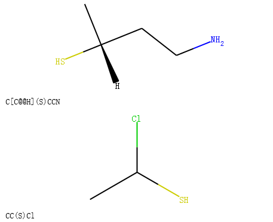

其他反应规则和警告
--------------------

1. 反应模板中的原子需要包含Atom map ID信息，方便查询。
2. 不要忘记考虑反应模板中指定键的类型，单键还是芳香键。RDKit 会自动推荐键的类型。也可以主动指定键的类型。
    也有可能不生效，可能存在一定的bug。建议主动指定键的类型，尤其是产物中的键的类型，这样产生的smile才不会有问题。
    
    
    
示例一： 主动指定CN单键变成CC双键

.. code-block:: py

  rxn = AllChem.ReactionFromSmarts('[#6:1][#7,#8:2]>>[#6:1]=[#6:2]')
  reactant = Chem.MolFromSmiles('c1ncccc1')
  product = rxn.RunReactants((reactant,))[0][0]
  mols=[]
  mols.append(reactant)
  mols.append(product)
  
  
  reactant = Chem.MolFromSmiles('C1NCCCC1')
  product = rxn.RunReactants((reactant,))[0][0]
  mols.append(reactant)
  mols.append(product)
  
  Draw.MolsToGridImage(mols,molsPerRow=4,subImgSize=(200,200),legends=['' for x in mols])

  
输出：

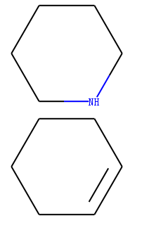

如果想继承反应物中键的类型可以使用any ~ 指定键的类型。
示例代码：

.. code-block:: py

  rxn = AllChem.ReactionFromSmarts('[#6:1][#7,#8:2]>>[#6:1]~[#6:2]')
  reactant = Chem.MolFromSmiles('c1ncccc1')
  product = rxn.RunReactants((reactant,))[0][0]
  mols=[]
  mols.append(reactant)
  mols.append(product)
  
  
  reactant = Chem.MolFromSmiles('C1NCCCC1')
  product = rxn.RunReactants((reactant,))[0][0]
  mols.append(reactant)
  mols.append(product)
  
  Draw.MolsToGridImage(mols,molsPerRow=4,subImgSize=(200,200),legends=['' for x in mols])

输出：

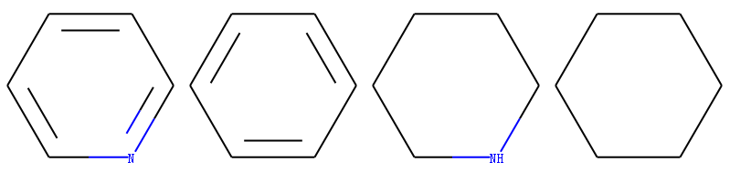

分子性质定义文件FDef
==================================
在基础教程中，我们发现在计算化学性质的时候会预先加载fdef文件。

.. code-block:: py

  fdefName = os.path.join(RDConfig.RDDataDir,'BaseFeatures.fdef')

fdef文件示例

.. code-block:: console
  
  AtomType NDonor [N&!H0&v3,N&!H0&+1&v4,n&H1&+0]
  AtomType ChalcDonor [O,S;H1;+0]
  DefineFeature SingleAtomDonor [{NDonor},{ChalcDonor},!$([D1]-[C;D3]=[O,S,N])]
    Family Donor
    Weights 1
  EndFeature
  
  AtomType NAcceptor [$([N&v3;H1,H2]-[!$(*=[O,N,P,S])])]
  Atomtype NAcceptor [$([N;v3;H0])]
  AtomType NAcceptor [$([n;+0])]

完整fdef示例文件下载： 

1. `BaseFeatures.fdef <http://rdkit.chenzhaoqiang.com/_images/BaseFeatures2020-03-28_220645.300846.fdef>`_ 
2. `MinimalFeatures.fdef  <http://rdkit.chenzhaoqiang.com/_images/MinimalFeatures2020-03-28_220654.463755.fdef>` 

当时我们没有解释这个文件，这里我们对该文件进行阐释。

FDef里面定义分子一系列的化学性质。基于SMARTS可以查询对应的性质。
FDEF文件也可以包含原子类型对应的性质，增加fdef文件的的可读性。

化学性质
-----------
化学性质的定义有性质的类型（Feature Type ） 和 性质大族（Feature Family）共同定义。

性质大族是更大层次的性质分类，如氢键供体、芳香性；
性质类型提供性质大族的细节，如氢键供体的原子类型，芳香组成原子等。
药效团匹配是根据性质大族来完成的。

每一个性质由两块组成：

1. 需要描述的原子的匹配模式的SMARTS 
#. 性质的描述

FDef文件的语法——AtomType
---------------------------
AtomType的定义由三部分组成，AtomType, Name of Atom Type 和SMARTS；
第二个字段 Name of atom type 增加fdef文件的可读性。 大家除了可以通过难读的SMARTS进行性质搜索，
也可以通过Name of atom type进行性质搜索。这3个字段中间是空格。

示例1： 定义非极性碳原子。

.. code-block:: console

  AtomType Carbon_NonPolar [C&!$(C=[O,N,P,S])&!$(C#N)]

相当于给SMARTS起了一些别人，方便使用。你可以在fdef文件的任意地方来定义AtomType。

在fdef 文件中，使用大括号{}来包裹已经定义了的atom type name 可以对其进行应用。

示例2： 定义Hpobe性质的原子，该原子除了包含非极性碳原子还包含卤素和硫原子等。

.. code-block:: console

  AtomType Carbon_NonPolar [C&!$(C=[O,N,P,S])&!$(C#N)]
  AtomType Hphobe [{Carbon_NonPolar},c,s,S&H0&v2,F,Cl,Br,I]

同一个原子性质名字在多个地方定义，想等于对其进行了合并。
因此下面3中定义方式是等价的。

定义1： 

.. code-block:: console

  AtomType d1 [N&!H0]
  AtomType d1 [O&!H0]

定义2：

.. code-block:: console

  AtomType d1 [N&!H0,O&!H0]

定义3：

.. code-block:: console

  AtomType d1 [N,O;!H0]

.. note::
	SMARTs语法逻辑and符号&，或逗号以及分号。逗号的优先级高于分号。

!还可以放置在atom type name前面进行组合。

下面2个定义是等价的。

定义1：

.. code-block:: console

  AtomType d1 [N,O,S]
  AtomType !d1 [H0]

定义2：

.. code-block:: py

  AtomType d1 [!H0;N,O,S]

.. note::
	注意观察，定义2中！的语法放在了最前面。

FDef文件的语法——Feature definitions
-------------------------------------
性质定义比atom type定义复杂一点，由4行组成。

示例

.. code-block:: console

  DefineFeature HDonor1 [N,O;!H0]
  Family HBondDonor
  Weights 1.0
  EndFeature

第一行是性质的定义包含 DefineFeature 和 featureName  以及SMARTS。
接下来是描述性质属于更高一层次的性质家族名和权重。（权重和Family的先后顺序不重要）。

Family  CustomFamilyName

weights 的个数和SMARTS中定义原子的个数一致，逗号分隔的列表。第一行只匹配一个O或者N原子，所以weights是1个。

有点类似于程序中的函数。
 
SMARTS 中也可以引用之前ATOM TYPE NAME。 

示例代码

.. code-block:: console

  AtomType Carbon_NonPolar [#6;+0;!{Carbon_Polar}]

  DefineFeature ThreeWayAttach [D3,D4;{Carbon_NonPolar}]
    Family Hydrophobe
    Weights 1.0
  EndFeature
  

不同原子有不同权重的示例代码

.. code-block:: console

  DefineFeature ZnBinder2 [#6]-C(=O)-C-[S;D1]
    Family ZnBinder
    Weights 0,0,1,0,1
  EndFeature

我们可以看到ZnBinder2性质一共定义5个原子，这5个原子的权重分别对应0,0,1,0,1。
只有第3个原子O和第5个原子S可以结合Zn。

其他语法
---------------------
1. 注释 #开头的行是注释信息
2. 反斜杠\ 可以换行。

示例

.. code-block:: console

  # RDKit base fdef file.
  AtomType tButylAtom [$([C;!R](-[CH3])(-[CH3])(-[CH3])),\
  $([CH3](-[C;!R](-[CH3])(-[CH3])))]
  
其他问题
--------------------------------
1. 如果1个feature type name 在一个文件中定义多次，代表什么意思

示例：

.. code-block:: console

  DefineFeature HDonor1 [O&!H0]
  Family HBondDonor
  Weights 1.0
  EndFeature
  
  DefineFeature HDonor1 [N&!H0]
  Family HBondDonor
  Weights 1.0
  EndFeature

等价于

.. code-block:: console

  DefineFeature HDonor1 [O,N;!H0]
  Family HBondDonor
  Weights 1.0
  EndFeature

但是，与更简单的SMARTS组合定义相比，使用重复的featureName来表示此特征定义的效率较低，并且更加令人困惑。
因此，推荐第二种方式。

有空的时候，写一个beauty_fdef.py 脚本进行转换。

药效团指纹的解读
=====================================================
在RDKit中药效团指纹中的bit不是hash的：每一个bit都对应了特定性质和距离的组合。
每一个bit都能转回相应的性质和距离进行解读。

药效团指纹解读示意图（还需要研究研究，没有完全理解）

.. figure:: _static/pharmcore2020-03-28_234053.179356.jpg
	:align: center
	:figclass: align-center

	Figure 1: Bit numbering in pharmacophore fingerprints

子结构搜索中的原子原子匹配细节
===================================================
基于SMARTS规则进行子结构搜索的时候，分子中的原子和查询中定义的原子必须较好的吻合。
When doing substructure matches for queries derived from SMARTS the rules for which atoms
in the molecule should match which atoms in the query are well defined.

[#smarts]_ 
The same is not necessarily the case when the query molecule is derived from a mol block or SMILES.

The general rule used in the RDKit is that if you don’t specify a property in the query, 
then it’s not used as part of the matching criteria and that Hs are ignored.
This leads to the following behavior:

分子结构检查 Molecular Sanitization
==========================================
默认情况下，RDKit读入分子的时候会进行分子结构检查处理（Molecular Sanitization）。
结构处理的过程中会自动计算一些有用信息，如杂化、环信息等，保证分子的结构在化学上是合理的：价键合理。

Sanitization的检查过程，包含11步。

1. clearComputedProps: 清除已有的分子、原子、键的计算性质，如  This step is always performed.
2. cleanUp:  对非标准价键进行标准化处理，
         如： 5根键的N转换成两性离子的形式。Example: N(=O)=O 自动变成  [N+](=O)O-]
               Example: C-N=N#N 变成 C-N=[N+]=[N-]
               Example: C=P(=O)O -> C=[P+]([O-])O
               Example: O=Cl(=O)O -> [O-][Cl+2][O-]O
               
注意： 非标准价键形式作为输入不会产生异常。
3. updatePropertyCache: 计算所有原子的显式和隐式价态。如果价态超过该原子的最高价态，则会产生异常报错。
4. symmetrizeSSSR: 执行SSSSR 算法计算环的信息。
5. Kekulize: 把芳香环转换成kekule形式。如果环不能转换成单双键的kekulized形式或者方向键在环外，
则会产生异常。
6. assignRadicals: 检测原子上的自由基电子的情况。
7. setAromaticity: 识别分子中的芳香环和体系，为原子和键添加方向标志。
8. setConjugation: 识别分子中的共轭键。
9. setHybridization: 计算每个原子的杂化方式
10. cleanupChirality: 删除非sp3杂化的原子的手性flag
11. adjustHs: 在必要的地方添加显式的Hs以保持化学合理性。芳香环中的杂原子通常需要使用显式氢。
典型的例子是吡咯中的氮原子。

上面的每一步都可以通过**MolOps::sanitizeMol** 或者 **Chem.SanitizeMol**控制开关。

其他计算细节
=======================================

魔法属性
------------------------------
RDkit代码库中经常用到下面这些属性。了解这些属性对基于RDKit的开发非常有帮助。

ROMol (Mol in Python)对象中的魔法属性
--------------------------------------
下面是ROMol对象中的一些魔法属性

+------------------------+---------------------------------------------------+
| 属性名称              | Use                                               |
+========================+===================================================+
| MolFileComments        |   Read from/written to the comment line of CTABs. |
+------------------------+---------------------------------------------------+
| MolFileInfo            |   Read from/written to the info line of CTABs.    |
+------------------------+---------------------------------------------------+
| _MolFileChiralFlag     |   Read from/written to the chiral flag of CTABs.  |
+------------------------+---------------------------------------------------+
| _Name                  |   Read from/written to the name line of CTABs.    |
+------------------------+---------------------------------------------------+
| _smilesAtomOutputOrder |   The order in which atoms were written to SMILES |
+------------------------+---------------------------------------------------+

Atom对象中的魔法属性
-----------------------

下表是Atom对象中的魔法属性。

+------------------------+-------------------------------------------------------------------------------------------------+
| Property Name          | Use                                                                                             |
+========================+=================================================================================================+
| _CIPCode               | the CIP code (R or S) of the atom                                                               |
+------------------------+-------------------------------------------------------------------------------------------------+
| _CIPRank               | the integer CIP rank of the atom                                                                |
+------------------------+-------------------------------------------------------------------------------------------------+
| _ChiralityPossible     | set if an atom is a possible chiral center                                                      |
+------------------------+-------------------------------------------------------------------------------------------------+
| _MolFileRLabel         | integer R group label for an atom, read from/written to CTABs.                                  |
+------------------------+-------------------------------------------------------------------------------------------------+
| _ReactionDegreeChanged | set on an atom in a product template of a reaction if its degree changes in the reaction        |
+------------------------+-------------------------------------------------------------------------------------------------+
| _protected             | atoms with this property set will not be considered as matching reactant queries in reactions   |
+------------------------+-------------------------------------------------------------------------------------------------+
| dummyLabel             | (on dummy atoms) read from/written to CTABs as the atom symbol                                  |
+------------------------+-------------------------------------------------------------------------------------------------+
| molAtomMapNumber       | the atom map number for an atom, read from/written to SMILES and CTABs                          |
+------------------------+-------------------------------------------------------------------------------------------------+
| molfileAlias           | the mol file alias for an atom (follows A tags), read from/written to CTABs                     |
+------------------------+-------------------------------------------------------------------------------------------------+
| molFileValue           | the mol file value for an atom (follows V tags), read from/written to CTABs                     |
+------------------------+-------------------------------------------------------------------------------------------------+
| molFileInversionFlag   | used to flag whether stereochemistry at an atom changes in a reaction,                          |
|                        | read from/written to CTABs, determined automatically from SMILES                                |
+------------------------+-------------------------------------------------------------------------------------------------+
| molRxnComponent        | which component of a reaction an atom belongs to, read from/written to CTABs                    |
+------------------------+-------------------------------------------------------------------------------------------------+
| molRxnRole             | which role an atom plays in a reaction (1=Reactant, 2=Product, 3=Agent),                        |
|                        | read from/written to CTABs                                                                      |
+------------------------+-------------------------------------------------------------------------------------------------+
| smilesSymbol           | determines the symbol that will be written to a SMILES for the atom                             |
+------------------------+-------------------------------------------------------------------------------------------------+

RDKit中的线程安全问题
--------------------------------
在编写RDKit时，尝试通过避免使用全局变量等来确保代码在多线程环境中工作。

但是，使代码线程安全不是一件容易的事，因此在多线程环境下可能依然存在一些问题。

RDKit代码库中部分代码进行了线程安全测试。

注意： 只有一小部分的方法或者函数中提供了numThreads参数。
对于python调用RDKit 不能通过这个参数进行多线程控制。
因为Boost.Python 要确保在任何时候都只能是一个线程调用C++代码。
要在Python中进行并发执行，请为此使用multiprocessing 模块或其他标准python方法之一

对下面的这些方法进行了线程安全测试。

1. 从 SMILES/SMARTS/Mol blocks 中读分子 
2. 分子写入SMILES/SMARTS/Mol blocks格式   
3. 产生2D 的坐标 
4. 使用 distance geometry 算法生成3D构象 
5. 使用 UFF 或者 MMFF立场优化分子
6. 产生分子指纹
#. $RDBASE/Code/GraphMol/Descriptors中的分子描述符计算
#. 子结构搜索（注意：如果查询分子包含递归查询，则在多个线程上同时使用它可能是不安全的，请参见下一小节）
#. The Subgraph code
#. 化学变换
#. 化学反应
#. 3D叠合分子 Open3DAlign 
#. 绘图  MolDraw2D drawing code

已知的线程安全问题
-----------------------
1. InChi的生成和解析。
这似乎是IUPAC InChI编码的局限性。为了允许代码在多线程环境中使用，
互斥锁（mutex）用于确保一次只有一个线程在使用IUPAC代码。
启用RDK_TEST_MULTITHREADED选项的情况下编译的RDKit 才可以使用mutex.

2. 从分子库MolSuppliers (e.g. SDMolSupplier, SmilesMolSupplier?)读取分子的时候，内部状态会发生改变。
因此使用多线程读取MolSuppliers 是不安全的。

3. 使用包含递归查询的查询分子进行子结构搜索。 递归查询在运行搜索时会修改其内部状态，
因此在多个线程上同时使用子结构递归查询并不安全。 
如果代码是使用RDK_BUILD_THREADSAFE_SSS参数（我们提供的二进制文件的默认值）构建的，
则可以使用互斥锁来确保一次只有一个线程在使用结构的递归查询。

TPSA描述符的计算细节
--------------------------
RDKit 可以计算拓扑极性表面积描述符topological polar surface area (TPSA)，
具体描述可参考文章（https://pubs.acs.org/doi/abs/10.1021/jm000942e) 。

RDKit中TPSA的计算默认只考虑N和O原子。而文章中Tale1中的TPSA除了考虑N和O原子，还考虑了S和P原子。
为什么会出现这样的情况？

最早TPSA概念是在Daylight网页(http://www.daylight.com/download/contrib/tpsa.html)上描述的，
没有包含极性S和P的贡献。文章Table3中的TPSA也没有包含S和P的贡献。
如分子 foscarnet  （OC(=O)P(=O)(O)O)） 其中O的贡献3x20.23 + 2*17.07 = 94.8；P的TPSA贡献是9.8 。
因此考虑SP的TPSA是104.6, 仅仅考虑N和O的TPSA是94.8 。

由于一些用户的需求，因此从2018.09版本开始引入了includeSandP参数进行控制计算TPSA的时候是否考虑P和S的贡献。

示例代码

.. code-block:: py

  from rdkit.Chem import Descriptors
  tpsa1_NO = Descriptors.TPSA(Chem.MolFromSmiles('OC(=O)P(=O)(O)O')) # foscarnet
  tpsa1_NOSP = Descriptors.TPSA(Chem.MolFromSmiles('OC(=O)P(=O)(O)O'), includeSandP=True)
  tpsa2_NO = Descriptors.TPSA(Chem.MolFromSmiles('Cc1ccccc1N1C(=O)c2cc(S(N)(=O)=O)c(Cl)cc2NC1C')) # metolazone
  tpsa2_NOSP = Descriptors.TPSA(Chem.MolFromSmiles('Cc1ccccc1N1C(=O)c2cc(S(N)(=O)=O)c(Cl)cc2NC1C'), includeSandP=True)
  print(tpsa1_NO,tpsa1_NOSP,  tpsa2_NO,  tpsa2_NOSP)

输出：

.. code-block:: console
  
  94.83 104.64000000000001 92.5 100.88
  

 SDF files文件中的原子属性
===================================

.. note::
	下面的功能和特性要求RDKit的版本大于2019.03版本

默认 rdkit.Chem.rdmolfiles.SDMolSupplier 和 rdkit.Chem.rdmolfiles.ForwardSDMolSupplier 类
(RDKit::SDMolSupplier and RDKit::ForwardMolSupplier in C++) 
能够识别分子属性（原子属性列表）。
属性的名字是以 atom.prop, atom.iprop, atom.dprop, 或者 atom.bprop开头，
Properties with names that start with atom.prop, atom.iprop, atom.dprop, atom.bprop
对应的属性值分别是string,int,double,和 bool类型。

下面是一个SDF文件的例子展示了所有的特性。

.. code-block:: console

  property_example
      RDKit  2D
  
    3  3  0  0  0  0  0  0  0  0999 V2000
      0.8660    0.0000    0.0000 C   0  0  0  0  0  0  0  0  0  0  0  0
    -0.4330    0.7500    0.0000 N   0  0  0  0  0  0  0  0  0  0  0  0
    -0.4330   -0.7500    0.0000 C   0  0  0  0  0  0  0  0  0  0  0  0
    1  2  1  0
    2  3  1  0
    3  1  1  0
  M  END
  >  <atom.dprop.PartialCharge>  (1)
  0.008 -0.314 0.008
  
  >  <atom.iprop.NumHeavyNeighbors>  (1)
  2 2 2
  
  >  <atom.prop.AtomLabel>  (1)
  C1 N2 C3
  
  >  <atom.bprop.IsCarbon>  (1)
  1 0 1
  
  >  <atom.prop.PartiallyMissing>  (1)
  one n/a three
  
  >  <atom.iprop.PartiallyMissingInt>  (1)
  [?] 2 2 ?
  
  $$$$

每个原子属性列表应包含与原子数相等的的属性值，属性值之间用空格分隔。
默认情况下，缺失值用字符串n / a表示。
如分子属性atom.prop.PartiallyMissing由3个原子属性构成，
第一个原子属性是"one",第二个原子属性缺失"n/a"表示，第三个原子属性是"three"。

可以通过在属性列表中使用方括号中的值来更改缺失值标记。

如分子属性atom.iprop.PartiallyMissingInt的缺失值修改为?号。
因此第一个原子PartiallyMissingInt的属性为2，第二个原子PartiallyMissingInt属性为2，
第三个原子PartiallyMissingInt属性是缺失值。

这个特性默认是开启的，可通过rdkit.Chem.rdmolfiles.SetProcessPropertyLists进行关闭和开启。

如果你有原子属性想写入到SDF文件中，可根据属性值的类型选择下面相应的方法进行写入。

1. rdkit.Chem.rdmolfiles.CreateAtomStringPropertyList(), 
2. rdkit.Chem.rdmolfiles.CreateAtomIntPropertyList(), 
3. rdkit.Chem.rdmolfiles.CreateAtomDoublePropertyList(), 
4. rdkit.Chem.rdmolfiles.CreateAtomBoolPropertyList() :

示例代码：

.. code-block:: console

  >>> m = Chem.MolFromSmiles('CO')
  >>> m.GetAtomWithIdx(0).SetDoubleProp('foo',3.14)
  >>> Chem.CreateAtomDoublePropertyList(m,'foo')
  >>> m.GetProp('atom.dprop.foo')
  '3.1400000000000001 n/a'
  >>> from io import StringIO
  >>> sio = StringIO()
  >>> w = Chem.SDWriter(sio)
  >>> w.write(m)
  >>> w=None
  >>> print(sio.getvalue())   
  
       RDKit          2D
  
    2  1  0  0  0  0  0  0  0  0999 V2000
      0.0000    0.0000    0.0000 C   0  0  0  0  0  0  0  0  0  0  0  0
      1.2990    0.7500    0.0000 O   0  0  0  0  0  0  0  0  0  0  0  0
    1  2  1  0
  M  END
  >  <atom.dprop.foo>  (1)
  3.1400000000000001 n/a
  
  $$$$

增强立体化学的支持 
=======================================

总览
--------
增强立体化学可以用于表示多种对应异构体的集合。

1. AND 符号表示的分子是混合物；
2. OR 符号表示的是未知构型的单一物质；
3. ABS 符号表示的已知构型的单一物质。

在V3k版本的mol 文件中有如下规定：
具有指定立体化学的原子组，用带有ABS，AND或OR标记，表示原子的立体化学信息。

以下是各种组合含义的一些说明：
----------------------------------

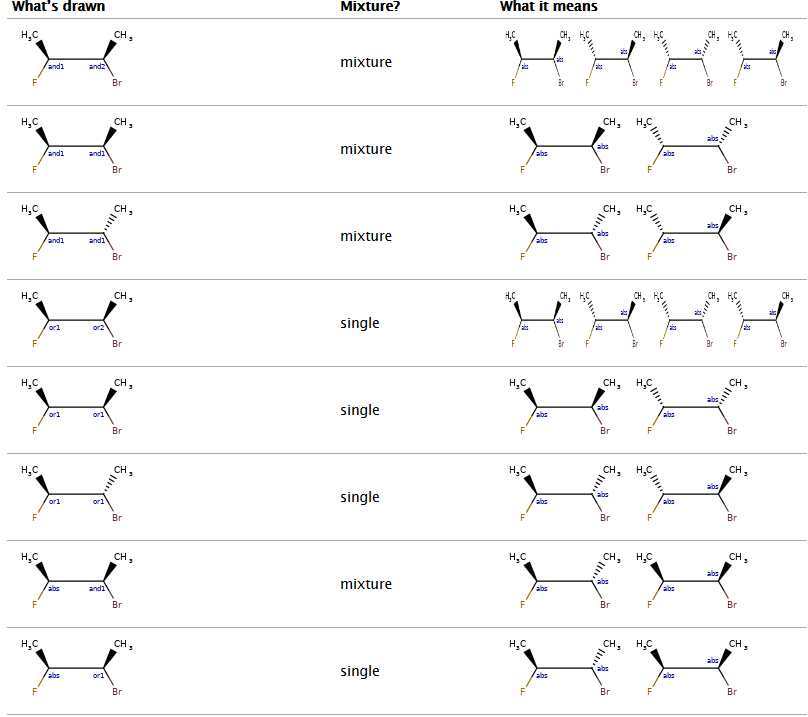

通过上面的这张表，我们可以看出： 
只要其中有原子用and表示，则是混合物；有原子用OR表示该原子的手性不确定，是单一物质；
abs 表示原子的手性是确定的。

如果两个原子都用and1表示，说明这两个原子的手性是相对的，取对于初始构型。
如果一个原子用and1表示，另一个原子用 and2 表示，则两个原子的手性是独立没有关联的。

增强立体化学的表示
---------------------
分子对象中有一个 **rdkit.Chem.rdchem.StereoGroup**用于存储立增强体化学信息。

每个StereoGroup都会跟踪其类型以及组成它的原子集。

使用案例
-------------------------------
在RDKit中引入增强立体化学的信息最初是为了读入V3k格式的mol文件的时候不丢失信息,
在 V3k mol -> RDKit -> V3k mol转换过程中不丢失信息。

.. note::
	V3k mol文件支持增强立体化学表示；
	ChemAxon Smiles格式也支持增强立体化学表示。
	

在RDKit中可以使用函数rdkit.Chem.EnumerateStereoisomers.EumerateStereoisomers（）来枚举所有StereoGroup的元素。

- m.GetStereoGroups() 获取分子中所有的 SteroGroups()的信息；
- rdkit.Chem.EnumerateStereoisomers 列举所有的对应异构体

示例代码

.. code-block:: py

  from rdkit.Chem.EnumerateStereoisomers import EnumerateStereoisomers
  from rdkit import Chem
  m = Chem.MolFromSmiles('C[C@H](F)C[C@H](O)Cl |&1:1|')
  print(" num of steroGroups",len(m.GetStereoGroups()) )
  from rdkit.Chem.EnumerateStereoisomers import EnumerateStereoisomers
  print([Chem.MolToCXSmiles(x) for x in EnumerateStereoisomers(m)])
  
输出：

.. code-block:: console

   num of steroGroups 1
  ['C[C@@H](F)C[C@H](O)Cl |&1:1|', 'C[C@H](F)C[C@H](O)Cl |&1:1|']
  

反应也可以保存StereoGroup信息。只要反应不创建或者销毁原子的手性。

示例代码：

.. code-block:: py
  
  from rdkit.Chem import AllChem
  rxn = AllChem.ReactionFromSmarts('[C:1]F >> [C:1]Br')
  ps=rxn.RunReactants([m])
  print(Chem.MolToCXSmiles(ps[0][0]))
  # remove map information  react_atom_idx old_mapno info 
  def clearAllAtomProps(mol):
      """So that atom mapping isn't shown"""
      for atom in mol.GetAtoms():
          for key in atom.GetPropsAsDict():
              atom.ClearProp(key)
  
  clearAllAtomProps(ps[0][0])
  print(Chem.MolToCXSmiles(ps[0][0]))

输出：

.. code-block:: console

  C[C@H](Br)C[C@H](O)Cl |atomProp:0.react_atom_idx.0:1.old_mapno.1:1.react_atom_idx.1:2.molInversionFlag.4:3.react_atom_idx.3:4.react_atom_idx.4:5.react_atom_idx.5:6.react_atom_idx.6,&1:1|
  C[C@H](Br)C[C@H](O)Cl |&1:1|
  

.. note::
	 atom.GetPropsAsDict()查看原子有哪些性质。
	 ChemAxon Smiles 默认是包含原子性质。
	

子结构搜索中的增强立体化学
--------------------------------------------------------- 
子结构搜索可以处理增强立体化学的关系。
下表列出了增强立体化学在子结构搜索中的案例，row 代表是  col 代表的是。

Substructure search using molecules with enhanced stereochemistry follows these rules (where substructure < superstructure):

    achiral < everything, because an achiral query means ignore chirality in the match

    chiral < AND, because AND includes both the chiral molecule and another one

    chiral < OR, because OR includes either the chiral molecule or another one

    OR < AND, because AND includes both molecules that OR could actually mean.

    one group of two atoms < two groups of one atom, because the latter is 4 different

diastereomers, and the former only two of the four.

关于指纹的其他信息
===================================================

这里主要介绍RDKit中指纹的信息，在文献中没有提到的一些信息。

RDKit 指纹
-------------------------
这是RDKit中特有的指纹，主要灵感来自于Daylight指纹的公开描述，但是和其不完全相同。

指纹识别算法可以识别特定大小范围内分子中的所有子图，
对每个子图进行哈希处理以生成原始位ID，对该原始位ID进行修改以适合分配的指纹大小，然后设置相应的位的数值。

有选项可以控制指纹的形式： 1. count-based forms ；2. “non-folded” forms (using a sparse representation)。

对子图进行hashing处理的策略如下:

1. 两个原子的类型。atomic number 和 芳香性。
2. 两个原子的度。
3. 键的类型，单键 双键 三键 芳香键。

针对指纹的可选参数
-------------------
1. minPath和maxPath控制所考虑的子图/路径的大小（以键为单位）
2. nBitsPerHash 
3. useHs: 是否在子图/路径中考虑Hs（假设分子图中存在Hs）
4. tgtDensity: if this is greater than zero, the fingerprint will be repeatedly folded in half until the density of set bits is greater than or equal to this value or the fingerprint only contains minSize bits. Note that this means that the resulting fingerprint will not necessarily be the size you requested.
5. branchedPaths: if this is true (the default value), the algorithm will use subgraphs (i.e features can be branched. If false, only linear paths will be considered.
6. useBondOrder: 对子图进行hash 处理的时候是否考虑键的类型。

匹配模式的指纹
--------------------------------
模式指纹目的是用于子结构的筛选，这是RDKit软件独有的功能。

原子对和拓扑扭转指纹
--------------------------
这两种指纹基于文章进行实现。基于原子序数，PI电子，和原子的度数构建的指纹。
通过参数控制，可以考虑原子的手性。这种指纹也支持两种形式：1. count vectors ;2. bit vectors。

摩根和特征摩根指纹
-------------------------
这种指纹是基于论文实现的。该算法尽可能遵循论文中的描述，但“ Feature Morgan”指纹使用的化学特征定义除外-
RDKit实现使用特征类型有 供体性质，受体性质， 芳香性质，卤素，碱性和酸性的性质，
另外用户可以根据自己的需要，定义新的性质。

层次指纹
-----------------------
层次指纹也是RDKit 原创的指纹 和模式指纹类似。
由于模式指纹要简单得多，并且已被证明可以有效地用作子结构指纹，因此分层指纹并没有受到太多关注。

参考文献
====================
.. http://www.daylight.com/dayhtml/doc/theory/theory.smirks.html
.. http://www.daylight.com/dayhtml/doc/theory/theory.smiles.html
.. http://www.daylight.com/dayhtml/doc/theory/theory.smarts.html
.. https://docs.chemaxon.com/display/docs/ChemAxon+Extended+SMILES+and+SMARTS+-+CXSMILES+and+CXSMARTS
.. Thanks to James Davidson for this example.
.. Thanks to JP Ebejer and Paul Finn for this example.
.. http://www.daylight.com/dayhtml/doc/theory/theory.finger.html
.. http://pubs.acs.org/doi/abs/10.1021/ci00046a002
.. http://pubs.acs.org/doi/abs/10.1021/ci00054a008
.. http://pubs.acs.org/doi/abs/10.1021/ci100050t
.. https://doi.org/10.1002/(SICI)1097-0290(199824)61:1%3C47::AID-BIT9%3E3.0.CO;2-Z

license
=========================

This document is copyright (C) 2007-2019 by Greg Landrum

This work is licensed under the Creative Commons Attribution-ShareAlike 4.0 License.
To view a copy of this license, visit http://creativecommons.org/licenses/by-sa/4.0/ or send a letter to Creative Commons, 543 Howard Street, 5th Floor, San Francisco, California, 94105, USA.

The intent of this license is similar to that of the RDKit itself.
In simple words: “Do whatever you want with it, but please give us some credit.”

