.. _rdkitcookbook:

=========================
实践教程 RDkit CookBook
=========================

本文档主要翻译于  `The RDKit Cookbook <https://www.rdkit.org/docs/Cookbook.html>`_ 。

简介
==============================

RDKit CookBook 介绍
----------------------------
这份文档主要讲解如何借助RDKit python接口实现特定化学信息计算功能。
这里的内容来自于RDKit社区，经过最新的RDKit版本测试，测试通过后编译成文档。
该文档采用rst格式编写完成，由sphinx软件管理，支持doctests，
因此可以更轻松地验证和维护RDKit Cookbook代码示例。

主要内容
--------------------------

RDKit CookBook中的示例主要来自于各种在线资源，例如博客，共享要点（shared gists）和RDKit邮件列表等。
通常，示例代码笔记应该遵循最少代码原则，以保持格式一致性并合并到doctest，方便管理和测试。

非常支持大家分享RDKit示例和代码。
我们已经做出了有意识的努力，以适当地相信原始来源和作者。
本文档的首要任务之一是编译RDKit邮件列表上的有用但不太容易创造的简短示例。

我们希望将该文档扩展到100多个示例，这需要一些时间，希望社区的成员一起努力。
随着文档的增长，根据社区需求对RDKit Cookbook中包含的示例进行优先级排序可能是有意义的。

反馈和贡献
-------------------
如果您有关于如何改进RDKit CookBook的建议和/或想要包含的示例，请直接在源文档（.rst文件）中提供。
或者，您也可以将Cookbook的修订和添加请求发送到邮件列表：<rdkit-discuss@lists.sourceforge.net>
（您需要先订阅）。

.. note::

  RDKit book中的示例都有一个索引编号，形式 RDKitCB_##. 目前2020.05已经收录了24个示例。
  根据索引ID能够快速找到相应的示例和图片文件。下一个示例的编号是RDKit_25,
  但相应的示例可以放置在该文档的任意位置，重要的示例放在前面原则进行排版。

 在jupyter环境中绘制分子  
=======================================

示例：分子图片显示原子索引编号
-----------------------------------

|作者: Takayuki Serizawa
|来源: `<https://iwatobipen.wordpress.com/2017/02/25/draw-molecule-with-atom-index-in-rdkit/>`_
|描述: 绘制带有atom index的分子 

示例代码：

.. code-block:: py

  from rdkit import Chem
  from rdkit.Chem.Draw import IPythonConsole
  from rdkit.Chem import Draw
  IPythonConsole.ipython_useSVG=True  #< set this to False if you want PNGs instead of SVGs
  def mol_with_atom_index(mol):
      for atom in mol.GetAtoms():
          atom.SetAtomMapNum(atom.GetIdx())
      return mol
  # Test in a kinase inhibitor
  mol = Chem.MolFromSmiles("C1CC2=C3C(=CC=C2)C(=CN3C1)[C@H]4[C@@H](C(=O)NC4=O)C5=CNC6=CC=CC=C65")
  # Default
  display(mol)
  # With atom index
  mol_with_atom_index(mol)

输出：

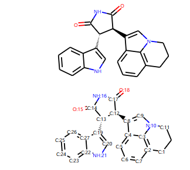

通过**IPythonConsole.ipython_useSVG**开关可以设置图片的格式是SVG 还是PNG格式。

通过IPythonConsole可以直接在jupyter中显示分子结构。

示例： 在分子上显示计算值
-----------------------------------

|作者: Greg Landrum
|来源: `https://sourceforge.net/p/rdkit/mailman/message/36457619/`_
|索引: RDKitCB_23
|描述: 绘制分子并在上面显示计算值（如 gasteiger电荷）

我们可以看到这个示例的索引编号是23，但是在该文档中放置在第二个示例中。

示例代码：

.. code-block:: py

  from rdkit import Chem
  from rdkit.Chem import AllChem
  
  m = Chem.MolFromSmiles('c1ncncc1C(=O)[O-]')
  AllChem.ComputeGasteigerCharges(m)
  display(m)
  
  m2 = Chem.Mol(m)
  for at in m2.GetAtoms():
      lbl = '%s:%.2f'%(at.GetSymbol(),at.GetDoubleProp("_GasteigerCharge"))
      at.SetProp('atomLabel',lbl)
  display(m2)

输出：

.. image:: _static/gas_charge2020-05-27_072013.994020.png
	:align: center

通过对**atom.SetProp**对atomLabel进行设置,从而可以在原子上显示属性。

示例：黑白图片
-----------------------------------

| **作者:** Greg Landrum
| **来源:** `<https://gist.github.com/greglandrum/d85d5693e57c306e30057ec4d4d11342>`_
| **索引:** RDKitCB_1
| **描述:** 以黑白色调绘制分子

示例代码：

.. code-block:: py
  
  from rdkit import Chem
  from rdkit.Chem.Draw import IPythonConsole
  from rdkit.Chem import Draw
  
  # default color 默认彩色图片
  IPythonConsole.drawOptions.useDefaultAtomPalette()
  ms = [Chem.MolFromSmiles(x) for x in ('Cc1onc(-c2ccccc2)c1C(=O)N[C@@H]1C(=O)N2[C@@H](C(=O)O)C(C)(C)S[C@H]12','CC1(C)SC2C(NC(=O)Cc3ccccc3)C(=O)N2C1C(=O)O.[Na]')]
  print("default color")
  display(Draw.MolsToGridImage(ms))
  
  ## 使用黑白色调
  print("black and white color")
  IPythonConsole.drawOptions.useBWAtomPalette()
  Draw.MolsToGridImage(ms)

输出：

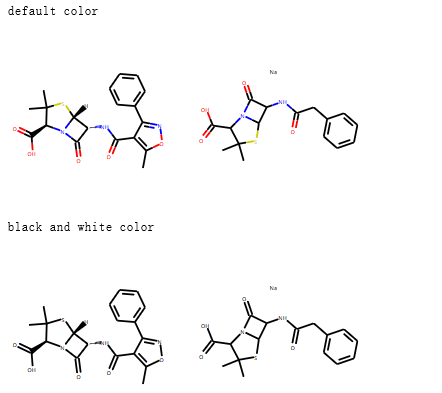

通过 **IPythonConsole.drawOptions** 对jupyter绘制分子图片的环境进行设置。

示例：高亮分子中的子结构
----------------------------------

| **作者:** Greg Landrum
| **来源:** `<https://gist.github.com/greglandrum/5d45b56afe75603b955103cdd0d8e038>`_
| **索引:** RDKitCB_2
| **总结:** 高亮分子中的子结构

高亮分子中的子结构，有多种方法，这里介绍两种方法。

方法一： 通过子结构匹配进行高亮

.. code-block:: py

  from rdkit import Chem
  from rdkit.Chem.Draw import IPythonConsole
  m = Chem.MolFromSmiles('c1cc(C(=O)O)c(OC(=O)C)cc1')
  substructure = Chem.MolFromSmarts('C(=O)O')
  m.GetSubstructMatches(substructure)
  print(m.__sssAtoms)
  m

输出：

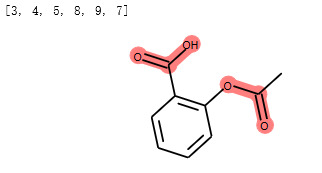

高亮了分子中COO基团。

方法二： 直接指定高亮的原子编号

.. code-block:: py

  # you can also manually set the atoms that should be highlighted:
  m.__sssAtoms = [0,1,2,6,11,12]
  m

输出：

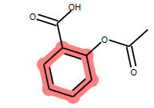

这两种方法本质是一样的，都是通过设置 **mol.__sssAtoms** 属性实现原子高亮的。

示例：不显示隐式氢原子
----------------------------------

| **作者:** Greg Landrum
| **来源:** `<https://sourceforge.net/p/rdkit/mailman/message/36746387/>`_ and `<https://gist.github.com/greglandrum/9283aeadfb66d0fe8a2900e63fb10f3e>`_
| **索引:** RDKitCB_17
| **描述:** Draw a molecule without implicit hydrogens

.. code-block:: py

  from rdkit import Chem
  from rdkit.Chem.Draw import IPythonConsole
  m = Chem.MolFromSmiles('[Pt](Cl)(Cl)(N)N')
  display(m)
  for atom in m.GetAtoms():
      atom.SetProp("atomLabel", atom.GetSymbol())
  m

输出：

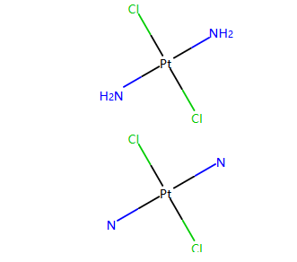

这里也是通过setProp对atomLabel属性设置实现的，和设置索引是相通的。

环、芳香性 和 凯库表示
======================================

示例： 统计环的信息
--------------------------

| **作者:** Greg Landrum
| **来源:** `<https://gist.github.com/greglandrum/de1751a42b3cae54011041dd67ae7415>`_ 
| **索引:** RDKitCB_3
| **描述:** 统计分子中环的信息

示例分子

.. code-block:: py

  mol = Chem.MolFromSmiles('CN1C(=O)CN=C(C2=C1C=CC(=C2)Cl)C3=CC=CC=C3')
  # Draw molecule with atom index (see RDKitCB_0)
  def mol_with_atom_index(mol):
      for atom in mol.GetAtoms():
          atom.SetAtomMapNum(atom.GetIdx())
      return mol
  mol_with_atom_index(mol)

输出：

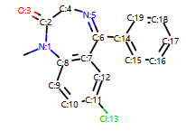

示例代码：

.. code-block:: py

  from rdkit import Chem
  from rdkit.Chem.Draw import IPythonConsole
  
  def GetRingSystems(mol, includeSpiro=False):
      ri = mol.GetRingInfo()
      systems = []
      for ring in ri.AtomRings():
          ringAts = set(ring)
          nSystems = []
          for system in systems:
              nInCommon = len(ringAts.intersection(system))
              if nInCommon and (includeSpiro or nInCommon>1):
                  ringAts = ringAts.union(system)
              else:
                  nSystems.append(system)
          nSystems.append(ringAts)
          systems = nSystems
      return systems
  mol = Chem.MolFromSmiles('CN1C(=O)CN=C(C2=C1C=CC(=C2)Cl)C3=CC=CC=C3')
  print(GetRingSystems(mol))
  
输出：

.. code-block:: console

  [{1, 2, 4, 5, 6, 7, 8, 9, 10, 11, 12}, {14, 15, 16, 17, 18, 19}]

该功能是识别分子中的环体系，如果是并环，则融为一个环；
如果是螺环，根据includeSpiro开关控制是否融为一个环。
默认分子的环信息是最小环信息。

识别芳香环
-----------------------------------------

| **作者:** Benjamin Datko/ Greg Landrum
| **来源:** `<https://sourceforge.net/p/rdkit/mailman/message/36860045/ >`_ 
| **索引:** RDKitCB_8
| **描述:** 判断环是否是芳香环

.. note::

   计算原理：如果环上的每一个原子都具有芳香性，则环为芳香环。
   
示例代码：

.. code-block:: py
  
  from rdkit import Chem
  m = Chem.MolFromSmiles('c1cccc2c1CCCC2')
  display(mol_with_atom_index(m))
  
  ri = m.GetRingInfo()
  # To detect aromatic rings, I would loop over the bonds in each ring and
  # flag the ring as aromatic if all bonds are aromatic:
  def isRingAromatic(mol, bondRing):
          for id in bondRing:
              if not mol.GetBondWithIdx(id).GetIsAromatic():
                  return False
          return True
  print("ring aromatic:",isRingAromatic(m, ri.BondRings()[0]),"atom ids:",ri.AtomRings()[0])
  print("ring aromatic:",isRingAromatic(m, ri.BondRings()[1]),"atom ids:",ri.AtomRings()[1])

输出：

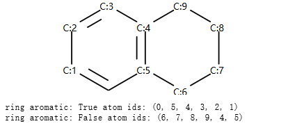

示例：识别芳香原子
----------------------------------

| **作者:** Paolo Tosco
| **来源:** `<https://sourceforge.net/p/rdkit/mailman/message/36862879/>`_
| **索引:** RDKitCB_9
| **描述:** 通过SMARTS来识别芳香碳原子和烯烃碳原子 

示例分子

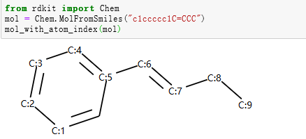

示例代码

.. code-block:: py

  from rdkit import Chem
  mol = Chem.MolFromSmiles("c1ccccc1C=CCC")
  aromatic_carbon = Chem.MolFromSmarts("c")
  print("aromatic atoms ids:",mol.GetSubstructMatches(aromatic_carbon))
  # The RDKit includes a SMARTS extension that allows hybridization queries,
  # here we query for SP2 aliphatic carbons:
  olefinic_carbon = Chem.MolFromSmarts("[C^2]")
  print("olefinic atoms ids ", mol.GetSubstructMatches(olefinic_carbon))
  
输出：

.. code-block:: console

  aromatic atoms ids: ((0,), (1,), (2,), (3,), (4,), (5,))
  olefinic atoms ids  ((6,), (7,))

化学立体特性
========================

识别手性中心
-------------------------------------

| **作者:** Jan Holst Jensen
| **来源:** `<https://sourceforge.net/p/rdkit/mailman/message/36762171/>`_
| **索引:** RDKitCB_16
| **描述:** 基于原子坐标或者isomeric SMILES识别手性中心原子

示例代码：

.. code-block:: py
  
  from rdkit import Chem
  # Create a mol object from L-alanine molfile with coordinates
  mol1 = Chem.MolFromMolBlock("""
       RDKit          2D
  
    6  5  0  0  0  0  0  0  0  0999 V2000
      0.0000    0.0000    0.0000 C   0  0  0  0  0  0  0  0  0  0  0  0
      1.2990    0.7500    0.0000 C   0  0  0  0  0  0  0  0  0  0  0  0
      1.2990    2.2500    0.0000 N   0  0  0  0  0  0  0  0  0  0  0  0
      2.5981   -0.0000    0.0000 C   0  0  0  0  0  0  0  0  0  0  0  0
      2.5981   -1.5000    0.0000 O   0  0  0  0  0  0  0  0  0  0  0  0
      3.8971    0.7500    0.0000 O   0  0  0  0  0  0  0  0  0  0  0  0
    2  1  1  6
    2  3  1  0
    2  4  1  0
    4  5  2  0
    4  6  1  0
  M  END""")
  display(mol_with_atom_index(mol1))
  Chem.AssignAtomChiralTagsFromStructure(mol1)
  print(Chem.FindMolChiralCenters(mol1))
  mol2 = Chem.MolFromSmiles("C[C@H](N)C(=O)O")
  Chem.AssignAtomChiralTagsFromStructure(mol2)
  print(Chem.FindMolChiralCenters(mol2))

输出：

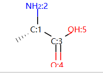

.. code-block:: console

  [(1, 'S')]
  [(1, 'S')]
  

.. note::
  
  根据原子坐标通过函数 **Chem.AssignAtomChiralTagsFromStructure(mol1)** 计算手性中心；
  
  然后就可以根据函数 **Chem.FindMolChiralCenters** 计算手性中心原子。

分子操作
==========================

断键的方式创建分子片段
------------------------------
 
| **作者:** Paulo Tosco
| **来源:** `<https://sourceforge.net/p/rdkit/mailman/message/36895168/>`_ and `<https://gist.github.com/ptosco/3fb93b7c09dac15b6d355eb0ad29f532>`_
| **索引:** RDKitCB_7
| **描述:** 基于键的编号创建分子片段 

.. note::
	RDKit2020.03 版本开始支持显示bond index.

示例分子：

绘制分子并显示bond index

.. code-block:: py

  from rdkit import Chem
  from rdkit.Chem import Draw
  from rdkit.Chem.Draw import rdMolDraw2D
  from rdkit.Chem import rdDepictor
  rdDepictor.SetPreferCoordGen(True)
  from rdkit.Chem.Draw import IPythonConsole
  from IPython.display import SVG
  import rdkit
  d2d = rdMolDraw2D.MolDraw2DSVG(350,300)
  d2d.drawOptions().addBondIndices=True
  mol = Chem.MolFromSmiles("O-C-C-C-C-N")
  mol1 = Chem.Mol(mol)
  
  d2d.DrawMolecule(mol1)
  d2d.FinishDrawing()
  SVG(d2d.GetDrawingText())

输出：

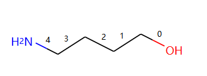

连续断键代码，接口处补虚原子。：

.. code-block:: py
  
  from rdkit import Chem
  from rdkit.Chem.Draw import IPythonConsole, MolsToGridImage
  # I have put explicit bonds in the SMILES definition to facilitate comprehension:
  mol = Chem.MolFromSmiles("O-C-C-C-C-N")
  mol1 = Chem.Mol(mol)
  # Chem.FragmentOnBonds() will fragment all specified bond indices at once, and return a single molecule
  # with all specified cuts applied. By default, addDummies=True, so empty valences are filled with dummy atoms:
  mol1_f = Chem.FragmentOnBonds(mol1, (0, 2, 4))
  display(mol1_f)
  Chem.MolToSmiles(mol1_f)
  
输出：

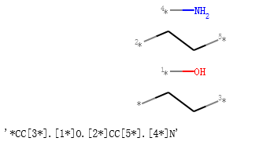

一次断一根键，将分子分成2个片段，接口处补虚原子。

示例代码：

.. code-block:: py

  # Chem.FragmentOnSomeBonds() will fragment according to all permutations of numToBreak bonds at a time
  # (numToBreak defaults to 1), and return tuple of molecules with numToBreak cuts applied. By default,
  # addDummies=True, so empty valences are filled with dummy atoms:
  mol2 = Chem.MolFromSmiles("O-C-C-C-C-N")
  mol2_f_tuple = Chem.FragmentOnSomeBonds(mol2, (0, 2, 4))
  mol2_f_tuple
  for molf in mol2_f_tuple:
      print(Chem.MolToSmiles(molf))
      display(molf)

输出：

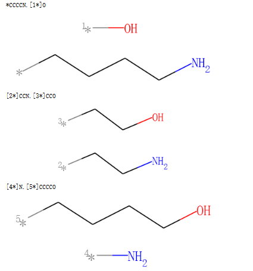

对分子切割键操作，接口处自动添加氢原子

.. code-block:: py

  # Finally, you can manually cut bonds using Chem.RWMol.RemoveBonds:
  rwmol = Chem.RWMol(mol)
  for b_idx in sorted([0, 2, 4], reverse=True): # reverse because when a bond or atom is deleted,
  # the bond or atom indices are remapped. If you remove bonds with a higher index first, bonds with lower indices will not be remapped.
      b = rwmol.GetBondWithIdx(b_idx)
      rwmol.RemoveBond(b.GetBeginAtomIdx(), b.GetEndAtomIdx())
  print(Chem.MolToSmiles(rwmol))
  rwmol

输出：

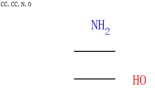

子结构搜索
===========================

SMARTS官能团搜索
----------------------------

| **作者:** Paulo Tosco
| **来源:** `<https://sourceforge.net/p/rdkit/mailman/message/36810326/>`_
| **索引:** RDKitCB_10
| **描述:** 借助SMATS实现官能团匹配 

搜索伯醇基团的示例代码

.. code-block:: py

  from rdkit import Chem
  from rdkit.Chem.Draw import IPythonConsole
  sucrose = "C([C@@H]1[C@H]([C@@H]([C@H]([C@H](O1)O[C@]2([C@H]([C@@H]([C@H](O2)CO)O)O)CO)O)O)O)O"
  sucrose_mol = Chem.MolFromSmiles(sucrose)
  primary_alcohol = Chem.MolFromSmarts("[CH2][OH1]")
  print(sucrose_mol.GetSubstructMatches(primary_alcohol))
  sucrose_mol
  
输出：

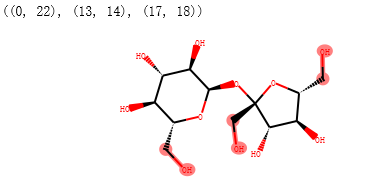

搜索仲醇基团的示例代码

.. code-block:: py

  secondary_alcohol = Chem.MolFromSmarts("[CH1][OH1]")
  print(sucrose_mol.GetSubstructMatches(secondary_alcohol))
  sucrose_mol

输出：

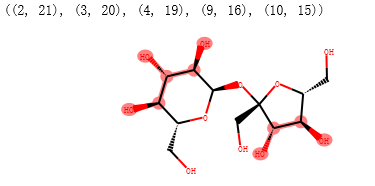

SMARTS大环搜索
-------------------------------------

| **作者:** Ivan Tubert-Brohman / David Cosgrove (Vincent Scalfani added example)
| **来源:** `<https://sourceforge.net/p/rdkit/mailman/message/36781480/>`_
| **索引:** RDKitCB_13
| **描述:** 借助SMARTS实现大环匹配 

示例代码

.. code-block:: py

  from rdkit import Chem
  from rdkit.Chem.Draw import IPythonConsole
  from rdkit.Chem import Draw
  erythromycin = Chem.MolFromSmiles("CC[C@@H]1[C@@]([C@@H]([C@H](C(=O)[C@@H](C[C@@]([C@@H]([C@H]([C@@H]([C@H](C(=O)O1)C)O[C@H]2C[C@@]([C@H]([C@@H](O2)C)O)(C)OC)C)O[C@H]3[C@@H]([C@H](C[C@H](O3)C)N(C)C)O)(C)O)C)C)O)(C)O")
  # Define SMARTS pattern with ring size > 12
  # This is an RDKit SMARTS extension
  macro = Chem.MolFromSmarts("[r{12-}]")
  print(erythromycin.GetSubstructMatches(macro))
  erythromycin
  

输出：

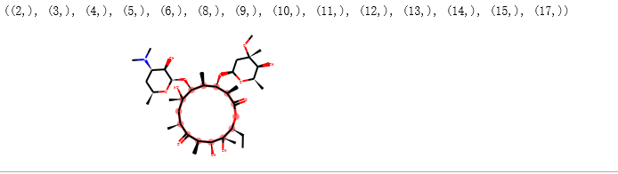

.. note::
	RDKit 对 SMARTS 进行了拓展 "[r{12-}]")，小写的r代表环上的原子，12-代表超过12个原子的环。
	SMARTS和正则表达式类似。

返回子结构的SMILES
---------------------------------

| **作者:** Andrew Dalke
| **来源:** `<https://sourceforge.net/p/rdkit/mailman/message/36735316/>`_
| **索引#:** RDKitCB_18
| **描述:**  获取匹配子结构的smiles (把smarts 转换成smiles) 

示例代码：

.. code-block:: py

  from rdkit import Chem
  pat = Chem.MolFromSmarts("[NX1]#[CX2]") #matches nitrile
  mol = Chem.MolFromSmiles("CCCC#N") # Butyronitrile
  atom_indices = mol.GetSubstructMatch(pat)
  print(atom_indices)
  print("fragment smiles",Chem.MolFragmentToSmiles(mol, atom_indices)) # returns the nitrile
  mol_with_atom_index(mol)
  
输出：

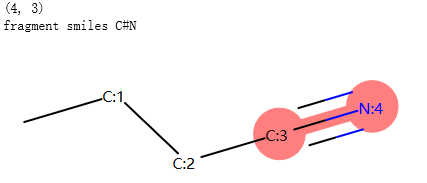

判断匹配的原子是否在一个片段中
----------------------------------------

| **作者:** Greg Landrum
| **来源:** `<https://sourceforge.net/p/rdkit/mailman/message/36942946/>`_
| **索引#:** RDKitCB_20
| **描述:**  模式是否在一个片段中

示例代码：

.. code-block:: py
  
  from rdkit import Chem
  p = Chem.MolFromSmarts('O.N')
  print("match pattern:")
  display(p)
  # define a function where matches are contained in a single fragment
  def fragsearch(m,p):
      matches = [set(x) for x in m.GetSubstructMatches(p)]
      frags = [set(y) for y in Chem.GetMolFrags(m)] # had to add this line for code to work
      for frag in frags:
          for match in matches:
              if match.issubset(frag):
                  return match
      return False
  m1 = Chem.MolFromSmiles('OCCCN.CCC')
  print("mol 1:")
  display(mol_with_atom_index(m1))
  m2 = Chem.MolFromSmiles('OCCC.CCCN')
  print("mol 2:")
  display(mol_with_atom_index(m2))
  print("mol1 has substructure",m1.HasSubstructMatch(p))
  print("mol2 has substructure",m2.HasSubstructMatch(p))
  print("pattern in the single frag for mol1",fragsearch(m1,p))
  print("pattern in the single frag for mol2",fragsearch(m2,p))
  
  
输出：

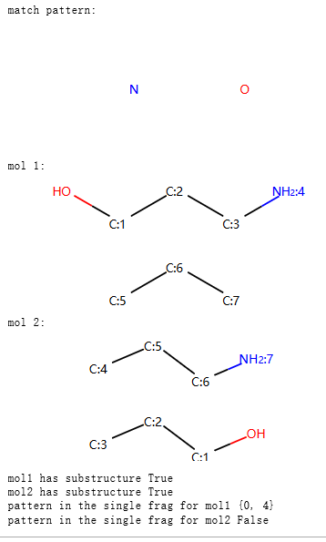

描述符计算
====================================

分子hash字符串
------------------------------------

| **作者:**  Vincent Scalfani / Takayuki Serizawa
| **来源:** `<https://gist.github.com/vfscalfani/f77d90f9f27e0f820b966882cdadccd0 >`_  和 `<https://iwatobipen.wordpress.com/2019/10/27/a-new-function-of-rdkit201909-rdkit-chemoinformatics/>`_
| **索引#:** RDKitCB_21
| **描述:**  集成到RDKit中的NextMove 公司的hash 函数计算分子的hash 字符串
| **参考:**  Examples from O’Boyle and Sayle

查看 RDKit中的hash 函数

.. code-block:: py

  from rdkit import Chem
  from rdkit.Chem import rdMolHash
  import rdkit
  from pprint import pprint
  #  View all of the MolHash hashing functions types with the names method.
  molhashf = rdMolHash.HashFunction.names
  pprint(molhashf)

输出：

.. code-block:: console

  {'AnonymousGraph': rdkit.Chem.rdMolHash.HashFunction.AnonymousGraph,
   'ArthorSubstructureOrder': rdkit.Chem.rdMolHash.HashFunction.ArthorSubstructureOrder,
   'AtomBondCounts': rdkit.Chem.rdMolHash.HashFunction.AtomBondCounts,
   'CanonicalSmiles': rdkit.Chem.rdMolHash.HashFunction.CanonicalSmiles,
   'DegreeVector': rdkit.Chem.rdMolHash.HashFunction.DegreeVector,
   'ElementGraph': rdkit.Chem.rdMolHash.HashFunction.ElementGraph,
   'ExtendedMurcko': rdkit.Chem.rdMolHash.HashFunction.ExtendedMurcko,
   'HetAtomProtomer': rdkit.Chem.rdMolHash.HashFunction.HetAtomProtomer,
   'HetAtomTautomer': rdkit.Chem.rdMolHash.HashFunction.HetAtomTautomer,
   'Mesomer': rdkit.Chem.rdMolHash.HashFunction.Mesomer,
   'MolFormula': rdkit.Chem.rdMolHash.HashFunction.MolFormula,
   'MurckoScaffold': rdkit.Chem.rdMolHash.HashFunction.MurckoScaffold,
   'NetCharge': rdkit.Chem.rdMolHash.HashFunction.NetCharge,
   'RedoxPair': rdkit.Chem.rdMolHash.HashFunction.RedoxPair,
   'Regioisomer': rdkit.Chem.rdMolHash.HashFunction.Regioisomer,
   'SmallWorldIndexBR': rdkit.Chem.rdMolHash.HashFunction.SmallWorldIndexBR,
   'SmallWorldIndexBRL': rdkit.Chem.rdMolHash.HashFunction.SmallWorldIndexBRL}

获取分子的AnonymousGraph的hash的smiles形式, 忽略原子仅仅考虑连接方式。

示例代码：

.. code-block:: py
  
  s = Chem.MolFromSmiles('CC(C(C1=CC(=C(C=C1)O)O)O)N(C)C(=O)OCC2=CC=CC=C2')
  display(s)
  anony_s = rdMolHash.MolHash(s,rdkit.Chem.rdMolHash.HashFunction.AnonymousGraph )
  display(Chem.MolFromSmiles(anony_s))
  print("AnonymousGraph",anony_s)
  
输出：

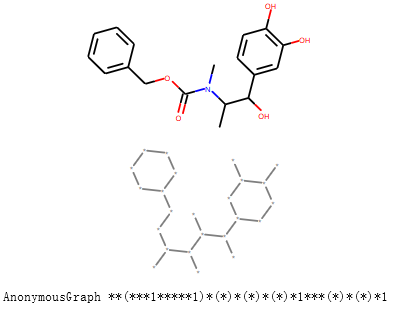

|**ElementGraph** ：忽略bond order

.. code-block:: py

  # Generate MolHashes for molecule 's' with all defined hash functions.
  for i, j in molhashf.items():
      print(i, rdMolHash.MolHash(s, j))

输出：

.. code-block:: console
  
  AnonymousGraph **(***1*****1)*(*)*(*)*(*)*1***(*)*(*)*1
  ElementGraph CC(C(O)C1CCC(O)C(O)C1)N(C)C(O)OCC1CCCCC1
  CanonicalSmiles CC(C(O)c1ccc(O)c(O)c1)N(C)C(=O)OCc1ccccc1
  MurckoScaffold c1ccc(CCNCOCc2ccccc2)cc1
  ExtendedMurcko *c1ccc(C(*)C(*)N(*)C(=*)OCc2ccccc2)cc1*
  MolFormula C18H21NO5
  AtomBondCounts 24,25
  DegreeVector 0,8,10,6
  Mesomer CC(C(O)[C]1[CH][CH][C](O)[C](O)[CH]1)N(C)[C]([O])OC[C]1[CH][CH][CH][CH][CH]1_0
  HetAtomTautomer CC(C([O])[C]1[CH][CH][C]([O])[C]([O])[CH]1)N(C)[C]([O])OC[C]1[CH][CH][CH][CH][CH]1_3_0
  HetAtomProtomer CC(C([O])[C]1[CH][CH][C]([O])[C]([O])[CH]1)N(C)[C]([O])OC[C]1[CH][CH][CH][CH][CH]1_3
  RedoxPair CC(C(O)[C]1[CH][CH][C](O)[C](O)[CH]1)N(C)[C]([O])OC[C]1[CH][CH][CH][CH][CH]1
  Regioisomer *C.*CCC.*O.*O.*O.*OC(=O)N(*)*.C.c1ccccc1.c1ccccc1
  NetCharge 0
  SmallWorldIndexBR B25R2
  SmallWorldIndexBRL B25R2L10
  ArthorSubstructureOrder 00180019010012000600009b000000
  
  
  

连续可旋转键
------------------------------------

| **作者:** Paulo Tosco
| **来源:** `<https://sourceforge.net/p/rdkit/mailman/message/36405144/>`_
| **索引#:** RDKitCB_22
| **描述:**  定位最多的连续可旋转键

示例分子：

.. code-block:: py
  
  from rdkit import Chem
  from rdkit.Chem import Draw
  from rdkit.Chem.Draw import rdMolDraw2D
  from rdkit.Chem import rdDepictor
  rdDepictor.SetPreferCoordGen(True)
  from rdkit.Chem.Draw import IPythonConsole
  from IPython.display import SVG
  import rdkit
  d2d = rdMolDraw2D.MolDraw2DSVG(350,300)
  d2d.drawOptions().addBondIndices=True
  
  
  mol = Chem.MolFromSmiles('CCC(CC(C)CC1CCC1)C(CC(=O)O)N')
  
  d2d.DrawMolecule(mol)
  d2d.FinishDrawing()
  SVG(d2d.GetDrawingText())
  
输出：

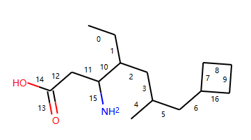

示例代码：

.. code-block:: py
  
  from rdkit import Chem
  from rdkit.Chem.Lipinski import RotatableBondSmarts
  
  def find_bond_groups(mol):
      """Find groups of contiguous rotatable bonds and return them sorted by decreasing size"""
      rot_atom_pairs = mol.GetSubstructMatches(RotatableBondSmarts)
      rot_bond_set = set([mol.GetBondBetweenAtoms(*ap).GetIdx() for ap in rot_atom_pairs])
      rot_bond_groups = []
      while (rot_bond_set):
          i = rot_bond_set.pop()
          connected_bond_set = set([i])
          stack = [i]
          while (stack):
              i = stack.pop()
              b = mol.GetBondWithIdx(i)
              bonds = []
              for a in (b.GetBeginAtom(), b.GetEndAtom()):
                  bonds.extend([b.GetIdx() for b in a.GetBonds() if (
                      (b.GetIdx() in rot_bond_set) and (not (b.GetIdx() in connected_bond_set)))])
              connected_bond_set.update(bonds)
              stack.extend(bonds)
          rot_bond_set.difference_update(connected_bond_set)
          rot_bond_groups.append(tuple(connected_bond_set))
      return tuple(sorted(rot_bond_groups, reverse = True, key = lambda x: len(x)))
  
  
  mol = Chem.MolFromSmiles('CCC(CC(C)CC1CCC1)C(CC(=O)O)N')
  # Find groups of contiguous rotatable bonds in mol
  bond_groups = find_bond_groups(mol)
  print("bond_groups ",bond_groups )
  # As bond groups are sorted by decreasing size, the size of the first group (if any)
  # is the largest number of contiguous rotatable bonds in mol
  largest_n_cont_rot_bonds = len(bond_groups[0]) if bond_groups else 0
  mol

输出：

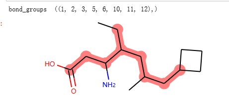

写入分子
===============================

smiles的两种形式鲍林式和凯库勒式 
------------------------------------

| **作者:** Paulo Tosco
| **来源:** `<https://sourceforge.net/p/rdkit/mailman/message/36893087/>`_
| **索引:** RDKitCB_4
| **描述:** smiles的两种形式鲍林式和凯库勒式 

示例代码：

.. code-block:: py

  from rdkit import Chem
  smi = "CN1C(NC2=NC=CC=C2)=CC=C1"
  mol = Chem.MolFromSmiles(smi)
  print("default aromatic form",Chem.MolToSmiles(mol))
  print("error kekule form",Chem.MolToSmiles(mol, kekuleSmiles=True))
  Chem.Kekulize(mol)
  print("right kekule form",Chem.MolToSmiles(mol, kekuleSmiles=True))

输出：

.. code-block:: console

  default aromatic form Cn1cccc1Nc1ccccn1
  error kekule form CN1:C:C:C:C:1NC1:C:C:C:C:N:1
  right kekule form CN1C=CC=C1NC1=NC=CC=C1
  
.. note::
  输出kekule形式，需要先进行计算**Chem.Kekulize(mol)**

删除smiles中的同位素信息
------------------------------------

| **作者:** Andrew Dalke
| **来源:** `<https://sourceforge.net/p/rdkit/mailman/message/36877847/>`_
| **索引:** RDKitCB_5
| **描述:** 删除smiles中的同位素信息

示例代码

.. code-block:: py
  
  from rdkit import Chem
  def MolWithoutIsotopesToSmiles(mol):
      atom_data = [(atom, atom.GetIsotope()) for atom in mol.GetAtoms()]
      for atom, isotope in atom_data:
      # restore original isotope values
         if isotope:
              atom.SetIsotope(0)
      smiles = Chem.MolToSmiles(mol)
      for atom, isotope in atom_data:
          if isotope:
              atom.SetIsotope(isotope)
      return smiles
  
  mol = Chem.MolFromSmiles("[19F][13C@H]([16OH])[35Cl]")
  print(MolWithoutIsotopesToSmiles(mol))

输出：

.. code-block:: console

  O[C@@H](F)Cl

化学反应
==============================

逆反应
-------------------------

| **作者:** Greg Landrum
| **来源:** `<https://gist.github.com/greglandrum/5ca4eebbe78f4d6d9b8cb03f401ad9cd>`_ and `<https://sourceforge.net/p/rdkit/mailman/message/36867857/>`_
| **索引#:** RDKitCB_6
| **描述:** 逆反应，把产物分解成反应物 
| **参考:** Example reaction from Hartenfeller [#Hartenfeller2011]_ 

正向反应模板，示例代码：

.. code-block:: py

  # Pictet-Spengler rxn
  rxn = AllChem.ReactionFromSmarts('[cH1:1]1:[c:2](-[CH2:7]-[CH2:8]-[NH2:9]):[c:3]:[c:4]:[c:5]:[c:6]:1.[#6:11]-[CH1;R0:10]=[OD1]>>[c:1]12:[c:2](-[CH2:7]-[CH2:8]-[NH1:9]-[C:10]-2(-[#6:11])):[c:3]:[c:4]:[c:5]:[c:6]:1')
  rxn

输出：

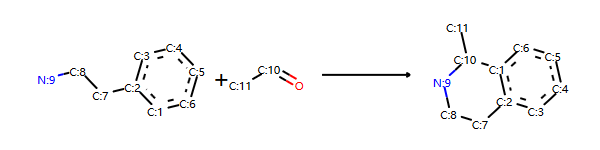

反应物+正向模板生成产物

.. code-block:: py

  reacts = [Chem.MolFromSmiles(x) for x in ('NCCc1ccccc1','C1CC1C(=O)')]
  ps = rxn.RunReactants(reacts)
  ps0 = ps[0]
  for p in ps0:
      Chem.SanitizeMol(p)
  mols=[]
  mols.extend(reacts)
  mols.extend(ps0)
  Draw.MolsToGridImage(mols)

输出：

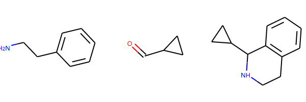

构建逆向反应模板,方法1

.. code-block:: py

  rxn2 = AllChem.ChemicalReaction()
  for i in range(rxn.GetNumReactantTemplates()):
      rxn2.AddProductTemplate(rxn.GetReactantTemplate(i))
  for i in range(rxn.GetNumProductTemplates()):
      rxn2.AddReactantTemplate(rxn.GetProductTemplate(i))
  rxn2.Initialize()
  rxn2

构建逆向反应模板,方法2

.. code-block:: py

  rxn1str='[cH1:1]1:[c:2](-[CH2:7]-[CH2:8]-[NH2:9]):[c:3]:[c:4]:[c:5]:[c:6]:1.[#6:11]-[CH1;R0:10]=[OD1]>>[c:1]12:[c:2](-[CH2:7]-[CH2:8]-[NH1:9]-[C:10]-2(-[#6:11])):[c:3]:[c:4]:[c:5]:[c:6]:1'
  r,p=rxn1str.split(">>")
  rxn3str="%s>>%s"%(p,r)
  rxn3= AllChem.ReactionFromSmarts(rxn3str)
  rxn3

输出：

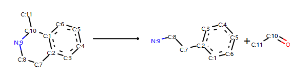

分解产物

.. code-block:: py

  reacts = ps0
  rps = rxn2.RunReactants(reacts)
  rps0 = rps[0]
  for rp in rps0:
      Chem.SanitizeMol(rp)
  Draw.MolsToGridImage(rps0)
  
输出：

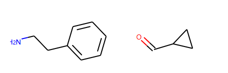

.. note::
	这种方法不是完美的，并且不会对每个反应都起作用。 
	在原始反应物中包含大量查询信息的反应很可能会出现问题。

错误信息
=======================

价态错误
-------------------------

| **作者:** Greg Landrum
| **来源:** `<https://sourceforge.net/p/rdkit/mailman/message/32599798/>`_
| **索引#:** RDKitCB_15
| **描述:** 创建一个分子对象跳过价态检查，执行部分结构检查。

.. note::
  请谨慎操作，并确保您的分子是有意义的！
  
RDKit 2019.03 之前的版本不支持6价的P元素。

示例代码：

.. code-block:: py
  
  from rdkit import Chem
  # default RDKit behavior is to reject hypervalent P, so you need to set sanitize=False
  m = Chem.MolFromSmiles('F[P-](F)(F)(F)(F)F.CN(C)C(F)=[N+](C)C',sanitize=False)
  # next, you probably want to at least do a partial sanitization so that the molecule is actually useful:
  m.UpdatePropertyCache(strict=False)
  Chem.SanitizeMol(m,Chem.SanitizeFlags.SANITIZE_FINDRADICALS|Chem.SanitizeFlags.SANITIZE_KEKULIZE|Chem.SanitizeFlags.SANITIZE_SETAROMATICITY|Chem.SanitizeFlags.SANITIZE_SETCONJUGATION|Chem.SanitizeFlags.SANITIZE_SETHYBRIDIZATION|Chem.SanitizeFlags.SANITIZE_SYMMRINGS,catchErrors=True)
  m

输出：

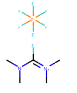

捕获结构的问题 Chem.DetectChemistryProblems
-----------------------------------------------

| **作者:** Greg Landrum
| **来源:** `<https://sourceforge.net/p/rdkit/mailman/message/36779572/>`_
| **索引:** RDKitCB_14
| **描述:** Identify and capture error messages when creating mol objects.

示例代码1：

.. code-block:: py

  from rdkit import Chem
  m = Chem.MolFromSmiles('CN(C)(C)C', sanitize=False)
  problems = Chem.DetectChemistryProblems(m)
  print(len(problems))
  m
  print(problems[0].GetType())
  print(problems[0].GetAtomIdx())
  print(problems[0].Message())
  

输出：

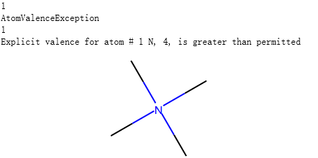

示例代码2：

.. code-block:: py

  m2 = Chem.MolFromSmiles('c1cncc1',sanitize=False)
  problems = Chem.DetectChemistryProblems(m2)
  print(len(problems))
  print(problems[0].GetType())
  print(problems[0].GetAtomIndices())
  print(problems[0].Message())
  m2

输出：

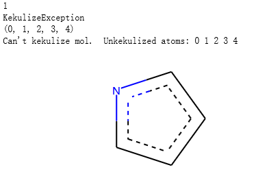

其他主题
==========================

显式价态和H的数目
---------------------------------------------

| **作者:** Michael Palmer/ Greg Landrum
| **来源:** `<https://sourceforge.net/p/rdkit/mailman/message/29679834/>`_
| **索引:** RDKitCB_11
| **描述:** 计算显式价，显性和隐性氢的数量，和一个原子上氢的总数

大部分情况下, 显示的指的是分子图片中可以直接看到的原子，隐式指的是分子图片中没有看到的原子，如氢原子。

示例代码：

.. code-block:: py

  from rdkit import Chem
  pyrrole = Chem.MolFromSmiles('C1=CNC=C1')
  for atom in pyrrole.GetAtoms():
      print(atom.GetSymbol(), atom.GetTotalValence(),atom.GetExplicitValence(), atom.GetTotalNumHs())
  pyrrole

输出：

.. code-block:: console

  C 4 3 1
  C 4 3 1
  N 3 3 1
  C 4 3 1
  C 4 3 1

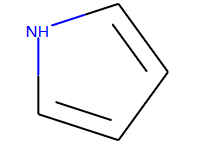

Wiener Index
----------------------------

| **作者:** Greg Landrum
| **来源:** `<https://sourceforge.net/p/rdkit/mailman/message/36802142/>`_
| **索引:** RDKitCB_12
| **描述:**  计算分子的wiener index描述符 ,分子的拓扑指标

winer 指数的定义： 图Graph中所有可到达的两个点之间的最短距离之和。

以正丁烷为例进行举例说明：

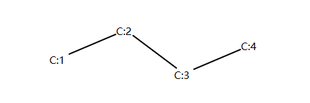

示例代码：

.. code-block:: py
  
  from rdkit import Chem
  def wiener_index(m):
      res = 0
      amat = Chem.GetDistanceMatrix(m)
      num_atoms = m.GetNumAtoms()
      for i in range(num_atoms):
          for j in range(i+1,num_atoms):
              res += amat[i][j]
      return res
  
  butane = Chem.MolFromSmiles('CCCC')
  amat = Chem.GetDistanceMatrix(butane)
  print(amat)
  print(wiener_index(butane))
  

输出：

.. code-block:: console

  [[0. 1. 2. 3.]
   [1. 0. 1. 2.]
   [2. 1. 0. 1.]
   [3. 2. 1. 0.]]
  10.0

以C1原子为例，我们可以计算 C1 和 C2、C3、C4的距离分别是1和2和3；

以C2原子作为参照，我们可以计算C2和C3、C4的距离分别是1和2；

以C3原子作为参照，我们可以计算C3和C4的距离是1。

winer 指数 = 1+2+3+1+2+1 = 10 。

带有配位键的金属有机物
-------------------------------------

| **作者:** Greg Landrum
| **来源:** `<https://sourceforge.net/p/rdkit/mailman/message/36727044/>`_ and `<https://gist.github.com/greglandrum/6cd7aadcdedb1ebcafa9537e8a47e3a4>`_
| **索引#:** RDKitCB_19
| **描述:** 检查金属有机物中和金属原子形成的单键并替换为配位键

示例代码：

.. code-block:: py
  
  from rdkit import Chem
  from rdkit.Chem.Draw import IPythonConsole
  def is_transition_metal(at):
      n = at.GetAtomicNum()
      return (n>=22 and n<=29) or (n>=40 and n<=47) or (n>=72 and n<=79)
  def set_dative_bonds(mol, fromAtoms=(7,8)):
      """ convert some bonds to dative
  
      Replaces some single bonds between metals and atoms with atomic numbers in fomAtoms
      with dative bonds. The replacement is only done if the atom has "too many" bonds.
  
      Returns the modified molecule.
  
      """
      pt = Chem.GetPeriodicTable()
      rwmol = Chem.RWMol(mol)
      rwmol.UpdatePropertyCache(strict=False)
      metals = [at for at in rwmol.GetAtoms() if is_transition_metal(at)]
      for metal in metals:
          for nbr in metal.GetNeighbors():
              if nbr.GetAtomicNum() in fromAtoms and \
                 nbr.GetExplicitValence()>pt.GetDefaultValence(nbr.GetAtomicNum()) and \
                 rwmol.GetBondBetweenAtoms(nbr.GetIdx(),metal.GetIdx()).GetBondType() == Chem.BondType.SINGLE:
                  rwmol.RemoveBond(nbr.GetIdx(),metal.GetIdx())
                  rwmol.AddBond(nbr.GetIdx(),metal.GetIdx(),Chem.BondType.DATIVE)
      return rwmol
  
  
  m = Chem.MolFromSmiles('CN(C)(C)[Pt]', sanitize=False)
  m2 = set_dative_bonds(m)
  display(m)
  display(m2)
  # we can check the bond between nitrogen and platinum
  print(m.GetBondBetweenAtoms(1,4).GetBondType())
  # we can check the bond between nitrogen and platinum
  print(m2.GetBondBetweenAtoms(1,4).GetBondType())
  print(Chem.MolToSmiles(m))
  print(Chem.MolToSmiles(m2))

输出：

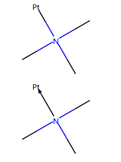

.. code-block:: console
  
  SINGLE
  DATIVE
  CN(C)(C)[Pt]
  CN(C)(C)->[Pt]
  
  

SMILES的枚举
-----------------

| **作者:** Guillaume Godin/Greg Landrum
| **来源:** `<https://sourceforge.net/p/rdkit/mailman/message/36591616/>`_
| **索引#:** RDKitCB_24
| **描述:** 枚举同一个分子的smiles的不同形式  

.. note::
	要求版本>=2019.03
	
示例代码：

.. code-block:: py

  from rdkit import Chem
  from pprint import pprint
  # create a mol object
  mol = Chem.MolFromSmiles('CC(N)C1CC1')
  # Generate 100 random SMILES
  smis = []
  for i in range(100):
      smis.append(Chem.MolToSmiles(mol,doRandom=True,canonical=False))
  # remove duplicates
  smis_set = list(set(smis))
  pprint(smis_set) # output order will be random; doctest skipped
  
  
输出：

.. code-block:: console
  
  ['C1(CC1)C(N)C',
   'NC(C)C1CC1',
   'CC(N)C1CC1',
   'C(C)(C1CC1)N',
   'C1C(C1)C(C)N',
   'NC(C1CC1)C',
   'C(N)(C)C1CC1',
   'C1CC1C(N)C',
   'C1C(C(N)C)C1',
   'C1(C(C)N)CC1',
   'C1(C(N)C)CC1',
   'CC(C1CC1)N',
   'C1CC1C(C)N',
   'C1(CC1)C(C)N',
   'C(C1CC1)(C)N',
   'C(N)(C1CC1)C',
   'C(C1CC1)(N)C',
   'C(C)(N)C1CC1',
   'C1C(C(C)N)C1']

license
===============================

This document is copyright (C) 2007-2020 by Greg Landrum and Vincent Scalfani.

This work is licensed under the Creative Commons Attribution-ShareAlike 4.0 License.
To view a copy of this license, visit http://creativecommons.org/licenses/by-sa/4.0/ 
or send a letter to Creative Commons, 543 Howard Street, 5th Floor, San Francisco, California, 94105, USA.

The intent of this license is similar to that of the RDKit itself. 
In simple words: “Do whatever you want with it, but please give us some credit.”

