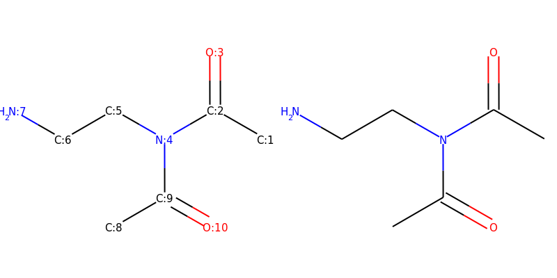

======
常用小技巧888
======

1. 如何在Jupyter NoteBook 中直接显示分子对象为结构图片

.. code-block:: py

  from rdkit.Chem.Draw import IPythonConsole #Needed to show molecules
  mol
  

.. code-block:: py

  from IPython.display import display
  for mol in mols:
      display(mol)

2. RDKit如何给复杂分子绘制漂亮的2D结构？

 建议更新RDKit版本，同时指定开启新的2D坐标产生的算法。
 默认采用的是schrodinger中的2D 算法。
 
.. code-block:: py

  from rdkit.Chem import rdDepictor
  rdDepictor.SetPreferCoordGen(True)
  Chem.MolFromSmiles('CC1CCC2C(C(=O)OC3C24C1CCC(O3)(OO4)C)C')

参考： https://github.com/rdkit/rdkit/issues/2960

3. 如何按照表格方式绘制多个分子？

绘制多个分子的时候推荐 Draw.MolsToGridImage  方法, 图片清晰，布局美观。

.. code-block:: py
  
  from rdkit import Chem
  smi='[CH3:1][C:2]([N:4]([C:9](=[O:10])[CH3:8])[CH2:5][CH2:6][NH2:7])=[O:3]'
  mol=Chem.MolFromSmiles(smi)
  # display(mol)
  for a in mol.GetAtoms():
      a.ClearProp('molAtomMapNumber')
  newsmi = Chem.MolToSmiles(mol)
  mol2=Chem.MolFromSmiles(newsmi)
  mol1=Chem.MolFromSmiles(smi)
  mols = [mol1,mol2]
  Draw.MolsToGridImage(mols,molsPerRow=2,subImgSize=(400,400),legends=['' for x in mols])

输出：

4. 如何删除分子中atomMapId 信息？

示例代码

.. code-block:: py

  smi='[CH3:1][C:2]([N:4]([C:9](=[O:10])[CH3:8])[CH2:5][CH2:6][NH2:7])=[O:3]'
  mol=Chem.MolFromSmiles(smi)
  [a.ClearProp('molAtomMapNumber')    for a  in mol.GetAtoms()]
  Chem.MolToSmiles(mol)

输出：

.. code-block:: console

  'CC(=O)N(CCN)C(C)=O'
  
5. 如何关闭RDKIT warnings警告？

.. code-block:: py

  from rdkit import RDLogger 
  RDLogger.DisableLog('rdApp.*') 

  
  

