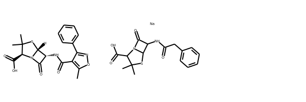
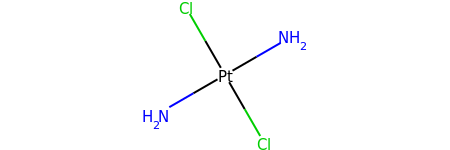
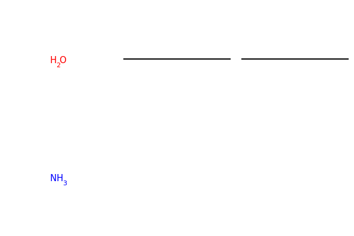
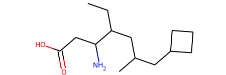

RDKit Cookbook
%%%%%%%%%%%%%%

.. sectionauthor:: Vincent F. Scalfani <vfscalfani@ua.edu>

Introduction
**************

What is this?
===============

This document provides example recipes of how to carry out particular tasks using the RDKit 
functionality from Python. The contents have been contributed by the RDKit community, 
tested with the latest RDKit release, and then compiled into this document. 
The RDKit Cookbook is written in reStructuredText, which supports Sphinx doctests, 
allowing for easier validation and maintenance of the RDKit Cookbook code examples, where appropriate. 

What gets included?
=====================

The examples included come from various online sources such as blogs, shared gists, and 
the RDKit mailing lists. Generally, only minimal editing is added to the example code/notes for 
formatting consistency and to incorporate the doctests. We have made a conscious effort 
to appropriately credit the original source and authors. One of the first priorities of this
document is to compile useful **short** examples shared on the RDKit mailing lists, as 
these can be difficult to discover. It will take some time, but we hope to expand this 
document into 100s of examples. As the document grows, it may make sense to prioritize 
examples included in the RDKit Cookbook based on community demand.

Feedback and Contributing
==========================

If you have suggestions for how to improve the Cookbook and/or examples you would like 
included, please contribute directly in the source document (the .rst file).
Alternatively, you can also send Cookbook revisions and addition requests to the mailing list:
<rdkit-discuss@lists.sourceforge.net> (you will need to subscribe first).

.. note::

   The Index ID# (e.g., **RDKitCB_##**) is simply a way to track Cookbook entries and image file names. 
   New Cookbook additions are sequentially index numbered, regardless of where they are placed 
   within the document. As such, for reference, the next Cookbook entry is **RDKitCB_34**.

Drawing Molecules (Jupyter)
*******************************

Include an Atom Index
======================

| **Author:** Takayuki Serizawa
| **Source:** `<https://iwatobipen.wordpress.com/2017/02/25/draw-molecule-with-atom-index-in-rdkit/>`_
| **Index ID#:** RDKitCB_0
| **Summary:** Draw a molecule with atom index numbers.

.. testcode::

   from rdkit import Chem
   from rdkit.Chem.Draw import IPythonConsole
   from rdkit.Chem import Draw
   IPythonConsole.ipython_useSVG=True  #< set this to False if you want PNGs instead of SVGs

.. testcode::
  
   def mol_with_atom_index(mol):
       for atom in mol.GetAtoms():
           atom.SetAtomMapNum(atom.GetIdx())
       return mol

.. testcode::

   # Test in a kinase inhibitor
   mol = Chem.MolFromSmiles("C1CC2=C3C(=CC=C2)C(=CN3C1)[C@H]4[C@@H](C(=O)NC4=O)C5=CNC6=CC=CC=C65")
   # Default
   mol
   
.. image:: images/RDKitCB_0_im0.png

.. testcode::
  
   # With atom index
   mol_with_atom_index(mol)
   
.. image:: images/RDKitCB_0_im1.png

Include a Calculation
======================

| **Author:** Greg Landrum
| **Source:** `<https://sourceforge.net/p/rdkit/mailman/message/36457619/>`_
| **Index ID#:** RDKitCB_23
| **Summary:** Draw a molecule with a calculation value displayed (e.g., Gasteiger Charge)

.. testcode::

   from rdkit import Chem
   from rdkit.Chem import AllChem

.. testcode::

   m = Chem.MolFromSmiles('c1ncncc1C(=O)[O-]')
   AllChem.ComputeGasteigerCharges(m)
   m

.. testcode::

   m2 = Chem.Mol(m)
   for at in m2.GetAtoms():
       lbl = '%s:%.2f'%(at.GetSymbol(),at.GetDoubleProp("_GasteigerCharge"))
       at.SetProp('atomLabel',lbl)
   m2

Include Stereo Annotations
===========================

| **Author:** Valery Polyakov and Greg Landrum
| **Source:** `<https://github.com/rdkit/rdkit/issues/3103>`_ and `<https://gist.github.com/greglandrum/33d8bd8149ec35999b2c70af9e4a0811>`_
| **Index ID#:** RDKitCB_32
| **Summary:** Draw a molecule with stereochemistry annotations displayed.

.. testcode::

   from rdkit import Chem
   from rdkit.Chem import rdDepictor
   from rdkit.Chem.Draw import rdMolDraw2D
   from IPython.display import SVG

.. testcode::

   def mol_with_stereo(mol,molSize=(300,300), kekulize=True, fontSize = 0.8, LineWidth = 1):
       # check for defective molecule 
       if mol is None:
           return None

       mol = rdMolDraw2D.PrepareMolForDrawing(mol, kekulize)
       drawer = rdMolDraw2D.MolDraw2DSVG(molSize[0], molSize[1])
       drawer.SetFontSize(fontSize)
       drawer.drawOptions().addStereoAnnotation = True
       # drawer.drawOptions().addAtomIndices = True

       try:
           drawer.SetLineWidth(LineWidth)
       except:
           pass

       drawer.DrawMolecule(mol)
       drawer.FinishDrawing()
       svg = drawer.GetDrawingText()
       return svg

.. testcode::

   m = Chem.MolFromSmiles('C[C@H](F)C\C=C/O')
   SVG(mol_with_stereo(m))

Black and White Molecules
==========================

| **Author:** Greg Landrum
| **Source:** `<https://gist.github.com/greglandrum/d85d5693e57c306e30057ec4d4d11342>`_
| **Index ID#:** RDKitCB_1
| **Summary:** Draw a molecule in black and white.

.. testcode::

   from rdkit import Chem
   from rdkit.Chem.Draw import IPythonConsole
   from rdkit.Chem import Draw

.. testcode::

   ms = [Chem.MolFromSmiles(x) for x in ('Cc1onc(-c2ccccc2)c1C(=O)N[C@@H]1C(=O)N2[C@@H](C(=O)O)C(C)(C)S[C@H]12','CC1(C)SC2C(NC(=O)Cc3ccccc3)C(=O)N2C1C(=O)O.[Na]')]
   Draw.MolsToGridImage(ms)
   
.. image:: images/RDKitCB_1_im0.png

.. testcode::

   IPythonConsole.drawOptions.useBWAtomPalette()
   Draw.MolsToGridImage(ms)

Highlight a Substructure in a Molecule
=======================================

| **Author:** Greg Landrum
| **Source:** `<https://gist.github.com/greglandrum/5d45b56afe75603b955103cdd0d8e038>`_
| **Index ID#:** RDKitCB_2
| **Summary:** Draw a molecule with a substructure highlight in Jupyter.

.. testcode::

   from rdkit import Chem
   from rdkit.Chem.Draw import IPythonConsole

.. testcode::

   m = Chem.MolFromSmiles('c1cc(C(=O)O)c(OC(=O)C)cc1')
   substructure = Chem.MolFromSmarts('C(=O)O')
   print(m.GetSubstructMatches(substructure))

.. testoutput::
   
   ((3, 4, 5), (8, 9, 7))
   
.. testcode::
   
   m

.. testcode::

   # you can also manually set the atoms that should be highlighted:
   m.__sssAtoms = [0,1,2,6,11,12]
   m

Without Implicit Hydrogens
===========================

| **Author:** Greg Landrum
| **Source:** `<https://sourceforge.net/p/rdkit/mailman/message/36746387/>`_ and `<https://gist.github.com/greglandrum/9283aeadfb66d0fe8a2900e63fb10f3e>`_
| **Index ID#:** RDKitCB_17
| **Summary:** Draw a molecule without implicit hydrogens

.. testcode::

   from rdkit import Chem
   from rdkit.Chem.Draw import IPythonConsole
   m = Chem.MolFromSmiles('[Pt](Cl)(Cl)(N)N')
   m

.. testcode::

   for atom in m.GetAtoms():
       atom.SetProp("atomLabel", atom.GetSymbol())
   m

Bonds and Bonding
*******************

Hybridization Type and Count
==============================

| **Author:** Jean-Marc Nuzillard and Andrew Dalke
| **Source:** `<https://sourceforge.net/p/rdkit/mailman/message/37021222/>`_ and `<https://sourceforge.net/p/rdkit/mailman/message/37025886/>`_
| **Index ID#:** RDKitCB_26
| **Summary:** Get hybridization type and count

.. testcode::

   from rdkit import Chem
   m = Chem.MolFromSmiles("CN1C=NC2=C1C(=O)N(C(=O)N2C)C")
   for x in m.GetAtoms():
       print(x.GetIdx(), x.GetHybridization())

.. testoutput::
  
   0 SP3
   1 SP2
   2 SP2
   3 SP2
   4 SP2
   5 SP2
   6 SP2
   7 SP2
   8 SP2
   9 SP2
   10 SP2
   11 SP2
   12 SP3
   13 SP3

.. testcode::
   
   # if you want to count hybridization type (e.g., SP3):
   from rdkit import Chem
   m = Chem.MolFromSmiles("CN1C=NC2=C1C(=O)N(C(=O)N2C)C")
   print(sum((x.GetHybridization() == Chem.HybridizationType.SP3) for x in m.GetAtoms()))

.. testoutput::

   3

Rings, Aromaticity, and Kekulization
*************************************

Count Ring Systems
=====================

| **Author:** Greg Landrum
| **Source:** `<https://gist.github.com/greglandrum/de1751a42b3cae54011041dd67ae7415>`_
| **Index ID#:** RDKitCB_3
| **Summary:** Count ring systems in a molecule

.. testcode::

   from rdkit import Chem
   from rdkit.Chem.Draw import IPythonConsole

.. testcode::

   def GetRingSystems(mol, includeSpiro=False):
       ri = mol.GetRingInfo()
       systems = []
       for ring in ri.AtomRings():
           ringAts = set(ring)
           nSystems = []
           for system in systems:
               nInCommon = len(ringAts.intersection(system)) 
               if nInCommon and (includeSpiro or nInCommon>1):
                   ringAts = ringAts.union(system)
               else:
                   nSystems.append(system)
           nSystems.append(ringAts)
           systems = nSystems
       return systems
   mol = Chem.MolFromSmiles('CN1C(=O)CN=C(C2=C1C=CC(=C2)Cl)C3=CC=CC=C3')
   print(GetRingSystems(mol))

.. testoutput::

   [{1, 2, 4, 5, 6, 7, 8, 9, 10, 11, 12}, {14, 15, 16, 17, 18, 19}]

.. testcode::

   # Draw molecule with atom index (see RDKitCB_0)
   def mol_with_atom_index(mol):
       for atom in mol.GetAtoms():
           atom.SetAtomMapNum(atom.GetIdx())
       return mol
   mol_with_atom_index(mol)

.. image:: images/RDKitCB_3_im0.png

Identify Aromatic Rings
========================

| **Author:** Benjamin Datko and Greg Landrum
| **Source:** `<https://sourceforge.net/p/rdkit/mailman/message/36860045/>`_ and `<https://sourceforge.net/p/rdkit/mailman/message/23801106/>`_
| **Index ID#:** RDKitCB_8
| **Summary:** Identify which rings are aromatic in a molecule

.. testcode::

   from rdkit import Chem
   m = Chem.MolFromSmiles('c1cccc2c1CCCC2')
   m

.. testcode::

   ri = m.GetRingInfo()
   # You can interrogate the RingInfo object to tell you the atoms that make up each ring:
   print(ri.AtomRings())

.. testoutput::

   ((0, 5, 4, 3, 2, 1), (6, 7, 8, 9, 4, 5))

.. testcode::

   # or the bonds that make up each ring:
   print(ri.BondRings())

.. testoutput::

   ((9, 4, 3, 2, 1, 0), (6, 7, 8, 10, 4, 5))

.. testcode::

   # To detect aromatic rings, I would loop over the bonds in each ring and
   # flag the ring as aromatic if all bonds are aromatic:
   def isRingAromatic(mol, bondRing):
           for id in bondRing:
               if not mol.GetBondWithIdx(id).GetIsAromatic():
                   return False
           return True

.. testcode::

   print(isRingAromatic(m, ri.BondRings()[0]))

.. testoutput::

   True

.. testcode::

   print(isRingAromatic(m, ri.BondRings()[1]))

.. testoutput::

   False

Identify Aromatic Atoms
==========================

| **Author:** Paolo Tosco
| **Source:** `<https://sourceforge.net/p/rdkit/mailman/message/36862879/>`_
| **Index ID#:** RDKitCB_9
| **Summary:** Differentiate aromatic carbon from olefinic carbon with SMARTS

.. testcode::

   from rdkit import Chem
   mol = Chem.MolFromSmiles("c1ccccc1C=CCC")
   aromatic_carbon = Chem.MolFromSmarts("c")
   print(mol.GetSubstructMatches(aromatic_carbon))

.. testoutput::

   ((0,), (1,), (2,), (3,), (4,), (5,))

.. testcode::

   # The RDKit includes a SMARTS extension that allows hybridization queries,
   # here we query for SP2 aliphatic carbons:
   olefinic_carbon = Chem.MolFromSmarts("[C^2]")
   print(mol.GetSubstructMatches(olefinic_carbon))

.. testoutput::

   ((6,), (7,))

Stereochemistry
****************

Identifying Chiral Centers
===========================

| **Author:** Jan Holst Jensen
| **Source:** `<https://sourceforge.net/p/rdkit/mailman/message/36762171/>`_
| **Index ID#:** RDKitCB_16
| **Summary:** Identify chiral centers from molfile with coordinates and isomeric SMILES.

.. testcode::

   from rdkit import Chem
   # Create a mol object from L-alanine molfile with coordinates
   mol1 = Chem.MolFromMolBlock("""
        RDKit          2D

     6  5  0  0  0  0  0  0  0  0999 V2000
       0.0000    0.0000    0.0000 C   0  0  0  0  0  0  0  0  0  0  0  0
       1.2990    0.7500    0.0000 C   0  0  0  0  0  0  0  0  0  0  0  0
       1.2990    2.2500    0.0000 N   0  0  0  0  0  0  0  0  0  0  0  0
       2.5981   -0.0000    0.0000 C   0  0  0  0  0  0  0  0  0  0  0  0
       2.5981   -1.5000    0.0000 O   0  0  0  0  0  0  0  0  0  0  0  0
       3.8971    0.7500    0.0000 O   0  0  0  0  0  0  0  0  0  0  0  0
     2  1  1  6
     2  3  1  0
     2  4  1  0
     4  5  2  0
     4  6  1  0
   M  END""")

.. testcode::
   
   Chem.AssignAtomChiralTagsFromStructure(mol1)
   print(Chem.FindMolChiralCenters(mol1))

.. testoutput::

   [(1, 'S')]

.. testcode::
   
   # This also shows up in the SMILES
   print(Chem.MolToSmiles(mol1))

.. testoutput::

   C[C@H](N)C(=O)O

.. testcode::

   mol2 = Chem.MolFromSmiles("C[C@H](N)C(=O)O")
   Chem.AssignAtomChiralTagsFromStructure(mol2)
   print(Chem.FindMolChiralCenters(mol2))

.. testoutput::

   [(1, 'S')]

.. testcode::

   # When you output as non-isomeric SMILES and read it back in, the chiral information is lost because the 
   # molecule no longer has a conformation:
   print(Chem.MolToSmiles(mol1, isomericSmiles = False))

.. testoutput::

   CC(N)C(=O)O

.. testcode::

   mol3 = Chem.MolFromSmiles("CC(N)C(=O)O")
   Chem.AssignAtomChiralTagsFromStructure(mol3)
   print(Chem.FindMolChiralCenters(mol3))

.. testoutput::

   []

Identifying E/Z Stereo
===========================

| **Author:** Vincent Scalfani
| **Source:** Direct Contribution to Cookbook
| **Index ID#:** RDKitCB_30
| **Summary:** Identify double bond E/Z stereochemistry.

.. testcode::

   from rdkit import Chem
   m = Chem.MolFromSmiles('C\C(F)=C\C=C(/F)\C(=C\F)\C=C')
   m # see RDKitCB_0 for atom index display

.. testcode::

   for b in m.GetBonds():
       print(b.GetBeginAtomIdx(),b.GetEndAtomIdx(),
             b.GetBondType(),b.GetStereo())

.. testoutput::

   0 1 SINGLE STEREONONE
   1 2 SINGLE STEREONONE
   1 3 DOUBLE STEREOZ
   3 4 SINGLE STEREONONE
   4 5 DOUBLE STEREOZ
   5 6 SINGLE STEREONONE
   5 7 SINGLE STEREONONE
   7 8 DOUBLE STEREOE
   8 9 SINGLE STEREONONE
   7 10 SINGLE STEREONONE
   10 11 DOUBLE STEREONONE

Manipulating Molecules
************************

Create Fragments
=================

| **Author:** Paulo Tosco
| **Source:** `<https://sourceforge.net/p/rdkit/mailman/message/36895168/>`_ and `<https://gist.github.com/ptosco/3fb93b7c09dac15b6d355eb0ad29f532>`_
| **Index ID#:** RDKitCB_7
| **Summary:** Create fragments of molecules on bonds

.. testcode::

   from rdkit import Chem
   from rdkit.Chem.Draw import IPythonConsole, MolsToGridImage
   # I have put explicit bonds in the SMILES definition to facilitate comprehension:
   mol = Chem.MolFromSmiles("O-C-C-C-C-N")
   mol1 = Chem.Mol(mol)
   mol1

.. testcode::

   # Chem.FragmentOnBonds() will fragment all specified bond indices at once, and return a single molecule
   # with all specified cuts applied. By default, addDummies=True, so empty valences are filled with dummy atoms:
   mol1_f = Chem.FragmentOnBonds(mol1, (0, 2, 4))
   mol1_f

.. testcode::

   # This molecule can be split into individual fragments using Chem.GetMolFrags():
   MolsToGridImage(Chem.GetMolFrags(mol1_f, asMols=True))

.. testcode::

   # Chem.FragmentOnSomeBonds() will fragment according to all permutations of numToBreak bonds at a time 
   # (numToBreak defaults to 1), and return tuple of molecules with numToBreak cuts applied. By default, 
   # addDummies=True, so empty valences are filled with dummy atoms:
   mol2_f_tuple = Chem.FragmentOnSomeBonds(mol2, (0, 2, 4))

.. testcode::

   mol2_f_tuple[0]

.. testcode::

   mol2_f_tuple[1]

.. testcode::

   mol2_f_tuple[2]

.. testcode::

   # Finally, you can manually cut bonds using Chem.RWMol.RemoveBonds:
   rwmol = Chem.RWMol(mol)
   for b_idx in sorted([0, 2, 4], reverse=True): # reverse because when a bond or atom is deleted, 
   # the bond or atom indices are remapped. If you remove bonds with a higher index first, bonds with lower indices will not be remapped.
       b = rwmol.GetBondWithIdx(b_idx)
       rwmol.RemoveBond(b.GetBeginAtomIdx(), b.GetEndAtomIdx())
   # And then call Chem.GetMolFrags() to get sanitized fragments where empty valences were filled with implicit hydrogens:
   MolsToGridImage(Chem.GetMolFrags(rwmol, asMols=True))

Largest Fragment
=================

| **Author:** Andrew Dalke and Susan Leung
| **Source:** `<https://sourceforge.net/p/rdkit/mailman/message/36355644/>`_ and `<https://github.com/susanhleung/rdkit/blob/dev/GSOC2018_MolVS_Integration/rdkit/Chem/MolStandardize/tutorial/MolStandardize.ipynb>`_
| **Index ID#:** RDKitCB_31
| **Summary:** Select largest fragment from a molecule

.. testcode::

   from rdkit import Chem
   from rdkit.Chem import rdmolops
   mol = Chem.MolFromSmiles('CCOC(=O)C(C)(C)OC1=CC=C(C=C1)Cl.CO.C1=CC(=CC=C1C(=O)N[C@@H](CCC(=O)O)C(=O)O)NCC2=CN=C3C(=N2)C(=O)NC(=N3)N')

.. testcode::

   mol_frags = rdmolops.GetMolFrags(mol, asMols = True)
   largest_mol = max(mol_frags, default=mol, key=lambda m: m.GetNumAtoms())
   print(Chem.MolToSmiles(largest_mol))

.. testoutput::

   Nc1nc2ncc(CNc3ccc(C(=O)N[C@@H](CCC(=O)O)C(=O)O)cc3)nc2c(=O)[nH]1

The same result can also be achieved with MolStandardize:

.. testcode::

   from rdkit import Chem
   from rdkit.Chem.MolStandardize import rdMolStandardize
   mol = Chem.MolFromSmiles('CCOC(=O)C(C)(C)OC1=CC=C(C=C1)Cl.CO.C1=CC(=CC=C1C(=O)N[C@@H](CCC(=O)O)C(=O)O)NCC2=CN=C3C(=N2)C(=O)NC(=N3)N')

.. testcode::

   # setup standardization module
   largest_Fragment = rdMolStandardize.LargestFragmentChooser()
   largest_mol = largest_Fragment.choose(mol)
   print(Chem.MolToSmiles(largest_mol))

.. testoutput::

   Nc1nc2ncc(CNc3ccc(C(=O)N[C@@H](CCC(=O)O)C(=O)O)cc3)nc2c(=O)[nH]1

Sidechain-Core Enumeration 
===========================

| **Author:** Chris Earnshaw, Stephen Roughley, Greg Landrum (Vincent Scalfani added loop example)
| **Source:** `<https://sourceforge.net/p/rdkit/mailman/message/35730514/>`_ and `<https://www.rdkit.org/docs/source/rdkit.Chem.rdChemReactions.html>`_
| **Index ID#:** RDKitCB_29
| **Summary:** Replace sidechains on a core and enumerate the combinations.

.. testcode::

   from rdkit import Chem
   from rdkit.Chem import Draw
   from rdkit.Chem import AllChem

.. testcode::
   
   # core is '*c1c(C)cccc1(O)'
   # chain is 'CN*'

   rxn = AllChem.ReactionFromSmarts('[c:1][#0].[#0][*:2]>>[c:1]-[*:2]')
   reacts = (Chem.MolFromSmiles('*c1c(C)cccc1(O)'),Chem.MolFromSmiles('CN*'))
   products = rxn.RunReactants(reacts) # tuple
   print(len(products))

.. testoutput::
   
   1

.. testcode::

   print(len(products[0]))

.. testoutput::

   1

.. testcode::

   print(Chem.MolToSmiles(products[0][0])) # [0][0] to index out the rdchem mol object

.. testoutput::
   
   CNc1c(C)cccc1O

.. testcode::

   # The above reaction-based approach is flexible, however if you can generate your 
   # sidechains in such a way that the atom you want to attach to the core 
   # is the first one (atom zero), there's a somewhat easier way to do this 
   # kind of simple replacement:

   core = Chem.MolFromSmiles('*c1c(C)cccc1(O)')
   chain = Chem.MolFromSmiles('NC')
   products = Chem.ReplaceSubstructs(core,Chem.MolFromSmarts('[#0]'),chain) # tuple
   print(Chem.MolToSmiles(products[0]))

.. testoutput::

   CNc1c(C)cccc1O

.. testcode::

   # Here is an example in a loop for an imidazolium core with alkyl chains

   core = Chem.MolFromSmiles('*[n+]1cc[nH]c1')
   chains = ['C','CC','CCC','CCCC','CCCCC','CCCCCC']
   chainMols = [Chem.MolFromSmiles(chain) for chain in chains]

   product_smi = []
   for chainMol in chainMols:
       product_mol = Chem.ReplaceSubstructs(core,Chem.MolFromSmarts('[#0]'),chainMol)
       product_smi.append(Chem.MolToSmiles(product_mol[0]))
   print(product_smi)

.. testoutput::

   ['C[n+]1cc[nH]c1', 'CC[n+]1cc[nH]c1', 'CCC[n+]1cc[nH]c1', 'CCCC[n+]1cc[nH]c1', 'CCCCC[n+]1cc[nH]c1', 'CCCCCC[n+]1cc[nH]c1']

.. testcode::

   # View the enumerated molecules:
   Draw.MolsToGridImage([Chem.MolFromSmiles(smi) for smi in product_smi])

Neutralizing Molecules
========================

| **Author:** Noel O'Boyle (Vincent Scalfani adapted code for RDKit)
| **Source:** `<https://baoilleach.blogspot.com/2019/12/no-charge-simple-approach-to.html>`_
| **Index ID#:** RDKitCB_33
| **Summary:** Neutralize charged molecules by atom.

This :code:`neutralize_atoms()` algorithm is adapted from Noel O'Boyle's nocharge code. It is a
neutralization by atom approach and neutralizes atoms with a +1 or -1 charge by removing or
adding hydrogen where possible. The SMARTS pattern checks for a hydrogen in +1 charged atoms and 
checks for no neighbors with a negative charge (for +1 atoms) and no neighbors with a positive charge 
(for -1 atoms), this is to avoid altering molecules with charge separation (e.g., nitro groups).

The :code:`neutralize_atoms()` function differs from the :code:`rdMolStandardize.Uncharger` behavior. 
See the MolVS documentation for Uncharger:

`<https://molvs.readthedocs.io/en/latest/api.html#molvs-charge>`_

"This class uncharges molecules by adding and/or removing hydrogens. 
In cases where there is a positive charge that is not neutralizable, 
any corresponding negative charge is also preserved."

As an example, :code:`rdMolStandardize.Uncharger` will not change charges on :code:`C[N+](C)(C)CCC([O-])=O`, 
as there is a positive charge that is not neutralizable. In contrast, the :code:`neutralize_atoms()` function
will attempt to neutralize any atoms it can (in this case to :code:`C[N+](C)(C)CCC(=O)O`). 
That is, :code:`neutralize_atoms()` ignores the overall charge on the molecule, and attempts to neutralize charges 
even if the neutralization introduces an overall formal charge on the molecule. See below for a comparison.

.. testcode::

   from rdkit import Chem
   from rdkit.Chem import AllChem
   from rdkit.Chem import Draw

.. testcode::

   # list of SMILES
   smiList = ['CC(CNC[O-])[N+]([O-])=O',
          'C[N+](C)(C)CCC([O-])=O',
          '[O-]C1=CC=[N+]([O-])C=C1',
          '[O-]CCCN=[N+]=[N-]',
          'C[NH+](C)CC[S-]',
          'CP([O-])(=O)OC[NH3+]']

   # Create RDKit molecular objects
   mols = [Chem.MolFromSmiles(m) for m in smiList]

   # display
   Draw.MolsToGridImage(mols,molsPerRow=3,subImgSize=(200,200))

.. testcode::

   def neutralize_atoms(mol):
       pattern = Chem.MolFromSmarts("[+1!h0!$([*]~[-1,-2,-3,-4]),-1!$([*]~[+1,+2,+3,+4])]")
       at_matches = mol.GetSubstructMatches(pattern)
       at_matches_list = [y[0] for y in at_matches]      
       if len(at_matches_list) > 0:
           for at_idx in at_matches_list:
               atom = mol.GetAtomWithIdx(at_idx)
               chg = atom.GetFormalCharge()
               hcount = atom.GetTotalNumHs()
               atom.SetFormalCharge(0)
               atom.SetNumExplicitHs(hcount - chg)
               atom.UpdatePropertyCache()
       return mol

.. testcode::

   # Neutralize molecules by atom
   for mol in mols:
       neutralize_atoms(mol)
       print(Chem.MolToSmiles(mol))
   
.. testoutput::

   CC(CNCO)[N+](=O)[O-]
   C[N+](C)(C)CCC(=O)O
   [O-][n+]1ccc(O)cc1
   [N-]=[N+]=NCCCO
   CN(C)CCS
   CP(=O)(O)OCN

.. testcode::

   Draw.MolsToGridImage(mols,molsPerRow=3, subImgSize=(200,200))

Compare to :code:`rdMolStandardize.Uncharger` results:

.. testcode::

   from rdkit.Chem.MolStandardize import rdMolStandardize
   un = rdMolStandardize.Uncharger()
   mols2 = [Chem.MolFromSmiles(m) for m in smiList]

   for mol2 in mols2:
       un.uncharge(mol2)
       print(Chem.MolToSmiles(mol2))

.. testoutput::

   CC(CNC[O-])[N+](=O)[O-]
   C[N+](C)(C)CCC(=O)[O-]
   [O-]c1cc[n+]([O-])cc1
   [N-]=[N+]=NCCC[O-]
   C[NH+](C)CC[S-]
   CP(=O)([O-])OC[NH3+]

.. testcode::

   Draw.MolsToGridImage(mols2,molsPerRow=3,subImgSize=(200,200))

.. image:: images/RDKitCB_33_im2.png

Substructure Matching
***********************

Functional Group with SMARTS queries
=====================================

| **Author:** Paulo Tosco
| **Source:** `<https://sourceforge.net/p/rdkit/mailman/message/36810326/>`_
| **Index ID#:** RDKitCB_10
| **Summary:** Match a functional group (e.g., alcohol) with a SMARTS query 

.. testcode::

   from rdkit import Chem
   from rdkit.Chem.Draw import IPythonConsole
   sucrose = "C([C@@H]1[C@H]([C@@H]([C@H]([C@H](O1)O[C@]2([C@H]([C@@H]([C@H](O2)CO)O)O)CO)O)O)O)O"
   sucrose_mol = Chem.MolFromSmiles(sucrose)
   primary_alcohol = Chem.MolFromSmarts("[CH2][OH1]")
   print(sucrose_mol.GetSubstructMatches(primary_alcohol))

.. testoutput::

   ((0, 22), (13, 14), (17, 18))

.. testcode::

   secondary_alcohol = Chem.MolFromSmarts("[CH1][OH1]")
   print(sucrose_mol.GetSubstructMatches(secondary_alcohol))

.. testoutput::

   ((2, 21), (3, 20), (4, 19), (9, 16), (10, 15))

Macrocycles with SMARTS queries
=====================================

| **Author:** Ivan Tubert-Brohman and David Cosgrove (Vincent Scalfani added example)
| **Source:** `<https://sourceforge.net/p/rdkit/mailman/message/36781480/>`_
| **Index ID#:** RDKitCB_13
| **Summary:** Match a macrocycle ring with a SMARTS query 

.. testcode::

   from rdkit import Chem
   from rdkit.Chem.Draw import IPythonConsole
   from rdkit.Chem import Draw
   erythromycin = Chem.MolFromSmiles("CC[C@@H]1[C@@]([C@@H]([C@H](C(=O)[C@@H](C[C@@]([C@@H]([C@H]([C@@H]([C@H](C(=O)O1)C)O[C@H]2C[C@@]([C@H]([C@@H](O2)C)O)(C)OC)C)O[C@H]3[C@@H]([C@H](C[C@H](O3)C)N(C)C)O)(C)O)C)C)O)(C)O")
   erythromycin

.. image:: images/RDKitCB_13_im0.png

.. testcode::

   # Define SMARTS pattern with ring size > 12
   # This is an RDKit SMARTS extension
   macro = Chem.MolFromSmarts("[r{12-}]")
   print(erythromycin.GetSubstructMatches(macro))

.. testoutput::

   ((2,), (3,), (4,), (5,), (6,), (8,), (9,), (10,), (11,), (12,), (13,), (14,), (15,), (17,))

.. testcode::

   erythromycin

Returning Substructure Matches as SMILES
=========================================

| **Author:** Andrew Dalke
| **Source:** `<https://sourceforge.net/p/rdkit/mailman/message/36735316/>`_
| **Index ID#:** RDKitCB_18
| **Summary:** Obtain SMILES of the matched substructure.

.. testcode::

   from rdkit import Chem
   pat = Chem.MolFromSmarts("[NX1]#[CX2]") #matches nitrile
   mol = Chem.MolFromSmiles("CCCC#N") # Butyronitrile
   atom_indices = mol.GetSubstructMatch(pat)
   print(atom_indices)

.. testoutput::

   (4, 3)

.. testcode::

   print(Chem.MolFragmentToSmiles(mol, atom_indices)) # returns the nitrile

.. testoutput::

   C#N

.. testcode::

   # Note however that if only the atom indices are given then Chem.MolFragmentToSmiles() will include all bonds 
   # which connect those atoms, even if the original SMARTS does not match those bonds. For example:
   pat = Chem.MolFromSmarts("*~*~*~*") # match 4 linear atoms
   mol = Chem.MolFromSmiles("C1CCC1") # ring of size 4
   atom_indices = mol.GetSubstructMatch(pat)
   print(atom_indices)

.. testoutput::

   (0, 1, 2, 3)

.. testcode::

   print(Chem.MolFragmentToSmiles(mol, atom_indices))  # returns the ring

.. testoutput::

   C1CCC1

.. testcode::

   # If this is important, then you need to pass the correct bond indices to MolFragmentToSmiles(). 
   # This can be done by using the bonds in the query graph to get the bond indices in the molecule graph. 
   def get_match_bond_indices(query, mol, match_atom_indices):
       bond_indices = []
       for query_bond in query.GetBonds():
           atom_index1 = match_atom_indices[query_bond.GetBeginAtomIdx()]
           atom_index2 = match_atom_indices[query_bond.GetEndAtomIdx()]
           bond_indices.append(mol.GetBondBetweenAtoms(
                atom_index1, atom_index2).GetIdx())
       return bond_indices

.. testcode::

   bond_indices = get_match_bond_indices(pat, mol, atom_indices)
   print(bond_indices)

.. testoutput::

   [0, 1, 2]

.. testcode::

   print(Chem.MolFragmentToSmiles(mol, atom_indices, bond_indices))

.. testoutput::

   CCCC

Within the Same Fragment
=========================

| **Author:** Greg Landrum
| **Source:** `<https://sourceforge.net/p/rdkit/mailman/message/36942946/>`_
| **Index ID#:** RDKitCB_20
| **Summary:** Match a pattern only within the same fragment.

.. testcode::

   from rdkit import Chem

.. testcode::

   p = Chem.MolFromSmarts('O.N')

.. testcode::
   
   # define a function where matches are contained in a single fragment
   def fragsearch(m,p):
       matches = [set(x) for x in m.GetSubstructMatches(p)]
       frags = [set(y) for y in Chem.GetMolFrags(m)] # had to add this line for code to work
       for frag in frags:
           for match in matches:
               if match.issubset(frag):
                   return match
       return False

.. testcode::

   m1 = Chem.MolFromSmiles('OCCCN.CCC')
   m1

.. testcode::

   m2 = Chem.MolFromSmiles('OCCC.CCCN')
   m2

.. testcode::

   print(m1.HasSubstructMatch(p))

.. testoutput::

   True

.. testcode::

   print(m2.HasSubstructMatch(p))

.. testoutput::

   True

.. testcode::

   print(fragsearch(m1,p))

.. testoutput::

   {0, 4}

.. testcode::

   print(fragsearch(m2,p))

.. testoutput::

   False

Descriptor Calculations
************************

Molecule Hash Strings
======================

| **Author:** Vincent Scalfani and Takayuki Serizawa
| **Source:** `<https://gist.github.com/vfscalfani/f77d90f9f27e0f820b966882cdadccd0>`_ and `<https://iwatobipen.wordpress.com/2019/10/27/a-new-function-of-rdkit201909-rdkit-chemoinformatics/>`_
| **Index ID#:** RDKitCB_21
| **Summary:** Calculate hash strings for molecules with the NextMove MolHash functionality within RDKit.
| **Reference Note:** Examples from O'Boyle and Sayle [#OBoyle]_

.. testcode::

   from rdkit import Chem
   from rdkit.Chem import rdMolHash
   import rdkit

.. testcode::

   s = Chem.MolFromSmiles('CC(C(C1=CC(=C(C=C1)O)O)O)N(C)C(=O)OCC2=CC=CC=C2')
   s

.. testcode::

   #  View all of the MolHash hashing functions types with the names method.
   molhashf = rdMolHash.HashFunction.names
   print(molhashf)

.. testoutput::
   :options: -ELLIPSIS, +NORMALIZE_WHITESPACE

   {'AnonymousGraph': rdkit.Chem.rdMolHash.HashFunction.AnonymousGraph,
    'ElementGraph': rdkit.Chem.rdMolHash.HashFunction.ElementGraph,
    'CanonicalSmiles': rdkit.Chem.rdMolHash.HashFunction.CanonicalSmiles,
    'MurckoScaffold': rdkit.Chem.rdMolHash.HashFunction.MurckoScaffold,
    'ExtendedMurcko': rdkit.Chem.rdMolHash.HashFunction.ExtendedMurcko,
    'MolFormula': rdkit.Chem.rdMolHash.HashFunction.MolFormula,
    'AtomBondCounts': rdkit.Chem.rdMolHash.HashFunction.AtomBondCounts,
    'DegreeVector': rdkit.Chem.rdMolHash.HashFunction.DegreeVector,
    'Mesomer': rdkit.Chem.rdMolHash.HashFunction.Mesomer,
    'HetAtomTautomer': rdkit.Chem.rdMolHash.HashFunction.HetAtomTautomer,
    'HetAtomProtomer': rdkit.Chem.rdMolHash.HashFunction.HetAtomProtomer,
    'RedoxPair': rdkit.Chem.rdMolHash.HashFunction.RedoxPair,
    'Regioisomer': rdkit.Chem.rdMolHash.HashFunction.Regioisomer,
    'NetCharge': rdkit.Chem.rdMolHash.HashFunction.NetCharge,
    'SmallWorldIndexBR': rdkit.Chem.rdMolHash.HashFunction.SmallWorldIndexBR,
    'SmallWorldIndexBRL': rdkit.Chem.rdMolHash.HashFunction.SmallWorldIndexBRL,
    'ArthorSubstructureOrder': rdkit.Chem.rdMolHash.HashFunction.ArthorSubstructureOrder}

.. testcode::

   # Generate MolHashes for molecule 's' with all defined hash functions.
   for i, j in molhashf.items(): 
       print(i, rdMolHash.MolHash(s, j))

.. testoutput::
   :options: -ELLIPSIS, +NORMALIZE_WHITESPACE

   AnonymousGraph **(***1*****1)*(*)*(*)*(*)*1***(*)*(*)*1
   ElementGraph CC(C(O)C1CCC(O)C(O)C1)N(C)C(O)OCC1CCCCC1
   CanonicalSmiles CC(C(O)c1ccc(O)c(O)c1)N(C)C(=O)OCc1ccccc1
   MurckoScaffold c1ccc(CCNCOCc2ccccc2)cc1
   ExtendedMurcko *c1ccc(C(*)C(*)N(*)C(=*)OCc2ccccc2)cc1*
   MolFormula C18H21NO5
   AtomBondCounts 24,25
   DegreeVector 0,8,10,6
   Mesomer CC(C(O)[C]1[CH][CH][C](O)[C](O)[CH]1)N(C)[C]([O])OC[C]1[CH][CH][CH][CH][CH]1_0
   HetAtomTautomer CC(C([O])[C]1[CH][CH][C]([O])[C]([O])[CH]1)N(C)[C]([O])OC[C]1[CH][CH][CH][CH][CH]1_3_0
   HetAtomProtomer CC(C([O])[C]1[CH][CH][C]([O])[C]([O])[CH]1)N(C)[C]([O])OC[C]1[CH][CH][CH][CH][CH]1_3
   RedoxPair CC(C(O)[C]1[CH][CH][C](O)[C](O)[CH]1)N(C)[C]([O])OC[C]1[CH][CH][CH][CH][CH]1
   Regioisomer *C.*CCC.*O.*O.*O.*OC(=O)N(*)*.C.c1ccccc1.c1ccccc1
   NetCharge 0
   SmallWorldIndexBR B25R2
   SmallWorldIndexBRL B25R2L10
   ArthorSubstructureOrder 00180019010012000600009b000000

.. testcode::
  
   # Murcko Scaffold Hashes (from slide 16 in [ref2])
   # Create a list of SMILES
   mList = ['CCC1CC(CCC1=O)C(=O)C1=CC=CC(C)=C1','CCC1CC(CCC1=O)C(=O)C1=CC=CC=C1',\
            'CC(=C)C(C1=CC=CC=C1)S(=O)CC(N)=O','CC1=CC(=CC=C1)C(C1CCC(N)CC1)C(F)(F)F',\
            'CNC1CCC(C2=CC(Cl)=C(Cl)C=C2)C2=CC=CC=C12','CCCOC(C1CCCCC1)C1=CC=C(Cl)C=C1']

.. testcode::

   # Loop through the SMILES mList and create RDKit molecular objects
   mMols = [Chem.MolFromSmiles(m) for m in mList]
   # Calculate Murcko Scaffold Hashes
   murckoHashList = [rdMolHash.MolHash(mMol, rdkit.Chem.rdMolHash.HashFunction.MurckoScaffold) for mMol in mMols]
   print(murckoHashList)

.. testoutput::
   :options: -ELLIPSIS, +NORMALIZE_WHITESPACE

   ['c1ccc(CC2CCCCC2)cc1',
    'c1ccc(CC2CCCCC2)cc1',
    'c1ccccc1',
    'c1ccc(CC2CCCCC2)cc1',
    'c1ccc(C2CCCc3ccccc32)cc1',
    'c1ccc(CC2CCCCC2)cc1']

.. testcode::

   # Get the most frequent Murcko Scaffold Hash
   def mostFreq(list):
       return max(set(list), key=list.count)
   mostFreq_murckoHash = mostFreq(murckoHashList)
   print(mostFreq_murckoHash)

.. testoutput::

   c1ccc(CC2CCCCC2)cc1

.. testcode::

   mostFreq_murckoHash_mol = Chem.MolFromSmiles('c1ccc(CC2CCCCC2)cc1')
   mostFreq_murckoHash_mol

.. testcode::

   # Display molecules with MurkoHash as legends and highlight the mostFreq_murckoHash
   highlight_mostFreq_murckoHash = [mMol.GetSubstructMatch(mostFreq_murckoHash_mol) for mMol in mMols]
   Draw.MolsToGridImage(mMols,legends=[murckoHash for murckoHash in murckoHashList],
                        highlightAtomLists = highlight_mostFreq_murckoHash,
                        subImgSize=(250,250), useSVG=False)

.. testcode::

   # Regioisomer Hashes (from slide 17 in [ref2])
   # Find Regioisomer matches for this molecule
   r0 = Chem.MolFromSmiles('CC1=CC2=C(C=C1)C(=CN2CCN1CCOCC1)C(=O)C1=CC=CC2=C1C=CC=C2')
   r0

.. testcode::

   # Calculate the regioisomer hash for r0
   r0_regioHash = rdMolHash.MolHash(r0,rdkit.Chem.rdMolHash.HashFunction.Regioisomer)
   print(r0_regioHash)

.. testoutput::

   *C.*C(*)=O.*CC*.C1COCCN1.c1ccc2[nH]ccc2c1.c1ccc2ccccc2c1

.. testcode::

   r0_regioHash_mol = Chem.MolFromSmiles('*C.*C(*)=O.*CC*.C1COCCN1.c1ccc2[nH]ccc2c1.c1ccc2ccccc2c1')
   r0_regioHash_mol

.. testcode::

   # Create a list of SMILES
   rList = ['CC1=CC2=C(C=C1)C(=CN2CCN1CCOCC1)C(=O)C1=CC=CC2=C1C=CC=C2',\
           'CCCCCN1C=C(C2=CC=CC=C21)C(=O)C3=CC=CC4=CC=CC=C43',\
           'CC1COCCN1CCN1C=C(C(=O)C2=CC=CC3=C2C=CC=C3)C2=C1C=CC=C2',\
            'CC1=CC=C(C(=O)C2=CN(CCN3CCOCC3)C3=C2C=CC=C3)C2=C1C=CC=C2',\
           'CC1=C(CCN2CCOCC2)C2=C(C=CC=C2)N1C(=O)C1=CC=CC2=CC=CC=C12',\
           'CN1CCN(C(C1)CN2C=C(C3=CC=CC=C32)C(=O)C4=CC=CC5=CC=CC=C54)C']
   # Loop through the SMILES rList and create RDKit molecular objects
   rMols = [Chem.MolFromSmiles(r) for r in rList]

.. testcode::

   # Calculate Regioisomer Hashes
   regioHashList = [rdMolHash.MolHash(rMol, rdkit.Chem.rdMolHash.HashFunction.Regioisomer) for rMol in rMols]
   print(regioHashList)

.. testoutput::
   :options: -ELLIPSIS, +NORMALIZE_WHITESPACE

   ['*C.*C(*)=O.*CC*.C1COCCN1.c1ccc2[nH]ccc2c1.c1ccc2ccccc2c1',
    '*C(*)=O.*CCCCC.c1ccc2[nH]ccc2c1.c1ccc2ccccc2c1',
    '*C.*C(*)=O.*CC*.C1COCCN1.c1ccc2[nH]ccc2c1.c1ccc2ccccc2c1',
    '*C.*C(*)=O.*CC*.C1COCCN1.c1ccc2[nH]ccc2c1.c1ccc2ccccc2c1',
    '*C.*C(*)=O.*CC*.C1COCCN1.c1ccc2[nH]ccc2c1.c1ccc2ccccc2c1',
    '*C.*C.*C(*)=O.*C*.C1CNCCN1.c1ccc2[nH]ccc2c1.c1ccc2ccccc2c1']

.. testcode::

   rmatches =[]
   for regioHash in regioHashList:
       if regioHash == r0_regioHash:
           print('Regioisomer: True')
           rmatches.append('Regioisomer: True')
       else:
           print('Regioisomer: False')
           rmatches.append('Regioisomer: False')

.. testoutput::

   Regioisomer: True
   Regioisomer: False
   Regioisomer: True
   Regioisomer: True
   Regioisomer: True
   Regioisomer: False

.. testcode::

   # Create some labels
   index = ['r0: ','r1: ','r2: ','r3: ','r4: ','r5: ']
   labelList = [rmatches + index for rmatches,index in zip(index,rmatches)]
   # Display molecules with labels
   Draw.MolsToGridImage(rMols,legends=[label for label in labelList],
                       subImgSize=(250,250), useSVG=False)
   # note, that r0 is the initial molecule we were interested in.

Contiguous Rotable Bonds
=========================

| **Author:** Paulo Tosco
| **Source:** `<https://sourceforge.net/p/rdkit/mailman/message/36405144/>`_
| **Index ID#:** RDKitCB_22
| **Summary:** Calculate the largest number of contiguous rotable bonds.

.. testcode::

   from rdkit import Chem
   from rdkit.Chem.Lipinski import RotatableBondSmarts

.. testcode::

   mol = Chem.MolFromSmiles('CCC(CC(C)CC1CCC1)C(CC(=O)O)N')
   mol

.. testcode::

   def find_bond_groups(mol):
       """Find groups of contiguous rotatable bonds and return them sorted by decreasing size"""
       rot_atom_pairs = mol.GetSubstructMatches(RotatableBondSmarts)
       rot_bond_set = set([mol.GetBondBetweenAtoms(*ap).GetIdx() for ap in rot_atom_pairs])
       rot_bond_groups = []
       while (rot_bond_set):
           i = rot_bond_set.pop()
           connected_bond_set = set([i])
           stack = [i]
           while (stack):
               i = stack.pop()
               b = mol.GetBondWithIdx(i)
               bonds = []
               for a in (b.GetBeginAtom(), b.GetEndAtom()):
                   bonds.extend([b.GetIdx() for b in a.GetBonds() if (
                       (b.GetIdx() in rot_bond_set) and (not (b.GetIdx() in connected_bond_set)))])
               connected_bond_set.update(bonds)
               stack.extend(bonds)
           rot_bond_set.difference_update(connected_bond_set)
           rot_bond_groups.append(tuple(connected_bond_set))
       return tuple(sorted(rot_bond_groups, reverse = True, key = lambda x: len(x)))

.. testcode::

   # Find groups of contiguous rotatable bonds in mol
   bond_groups = find_bond_groups(mol)
   # As bond groups are sorted by decreasing size, the size of the first group (if any) 
   # is the largest number of contiguous rotatable bonds in mol
   largest_n_cont_rot_bonds = len(bond_groups[0]) if bond_groups else 0

.. testcode::

   print(largest_n_cont_rot_bonds)

.. testoutput::

   8

.. testcode::

   print(bond_groups)

.. testoutput::

   ((1, 2, 3, 5, 6, 10, 11, 12),)

.. testcode::

   mol

Writing Molecules
*******************

Kekule SMILES
==============

| **Author:** Paulo Tosco
| **Source:** `<https://sourceforge.net/p/rdkit/mailman/message/36893087/>`_
| **Index ID#:** RDKitCB_4
| **Summary:** Kekulize a molecule and write Kekule SMILES

.. testcode::

   from rdkit import Chem
   smi = "CN1C(NC2=NC=CC=C2)=CC=C1"
   mol = Chem.MolFromSmiles(smi)
   print(Chem.MolToSmiles(mol))

.. testoutput::
 
   Cn1cccc1Nc1ccccn1

.. testcode::

   Chem.Kekulize(mol)
   print(Chem.MolToSmiles(mol, kekuleSmiles=True))

.. testoutput::

   CN1C=CC=C1NC1=NC=CC=C1

Isomeric SMILES without isotopes
=================================

| **Author:** Andrew Dalke
| **Source:** `<https://sourceforge.net/p/rdkit/mailman/message/36877847/>`_
| **Index ID#:** RDKitCB_5
| **Summary:** Write Isomeric SMILES without isotope information (i.e., only stereochemistry)

.. testcode::

   from rdkit import Chem
   def MolWithoutIsotopesToSmiles(mol):
      atom_data = [(atom, atom.GetIsotope()) for atom in mol.GetAtoms()]
      for atom, isotope in atom_data:
      # restore original isotope values
          if isotope:
              atom.SetIsotope(0)
      smiles = Chem.MolToSmiles(mol)
      for atom, isotope in atom_data:
          if isotope:
             atom.SetIsotope(isotope)
      return smiles
   
   mol = Chem.MolFromSmiles("[19F][13C@H]([16OH])[35Cl]")
   print(MolWithoutIsotopesToSmiles(mol))

.. testoutput::

   O[C@@H](F)Cl

*N.B.* There are two limitations noted with this Isomeric SMILES without isotopes method 
including with isotopic hydrogens, and a requirement to recalculate stereochemistry. 
See the source discussion linked above for further explanation and examples.

Reactions
***********

Reversing Reactions
=====================

| **Author:** Greg Landrum
| **Source:** `<https://gist.github.com/greglandrum/5ca4eebbe78f4d6d9b8cb03f401ad9cd>`_ and `<https://sourceforge.net/p/rdkit/mailman/message/36867857/>`_
| **Index ID#:** RDKitCB_6
| **Summary:** Decompose a reaction product into its reactants
| **Reference Note:** Example reaction from Hartenfeller [#Hartenfeller2011]_ 

.. testcode::

   from rdkit import Chem
   from rdkit.Chem import AllChem
   from rdkit.Chem import Draw

.. testcode::

   # Pictet-Spengler rxn
   rxn = AllChem.ReactionFromSmarts('[cH1:1]1:[c:2](-[CH2:7]-[CH2:8]-[NH2:9]):[c:3]:[c:4]:[c:5]:[c:6]:1.[#6:11]-[CH1;R0:10]=[OD1]>>[c:1]12:[c:2](-[CH2:7]-[CH2:8]-[NH1:9]-[C:10]-2(-[#6:11])):[c:3]:[c:4]:[c:5]:[c:6]:1')
   rxn

.. testcode::

   rxn2 = AllChem.ChemicalReaction() 
   for i in range(rxn.GetNumReactantTemplates()):
       rxn2.AddProductTemplate(rxn.GetReactantTemplate(i))
   for i in range(rxn.GetNumProductTemplates()): 
       rxn2.AddReactantTemplate(rxn.GetProductTemplate(i))
   rxn2.Initialize()

.. testcode::

   reacts = [Chem.MolFromSmiles(x) for x in ('NCCc1ccccc1','C1CC1C(=O)')]
   ps = rxn.RunReactants(reacts)
   ps0 = ps[0]
   for p in ps0:
       Chem.SanitizeMol(p)
   Draw.MolsToGridImage(ps0)

.. testcode::

   reacts = ps0
   rps = rxn2.RunReactants(reacts)
   rps0 = rps[0]
   for rp in rps0:
       Chem.SanitizeMol(rp)
   Draw.MolsToGridImage(rps0)

*N.B.* This approach isn't perfect and won't work for every reaction. Reactions that include extensive query information in the original reactants are very likely to be problematic.

Reaction Fingerprints and Similarity
======================================

| **Author:** Greg Landrum
| **Source:** `<https://sourceforge.net/p/rdkit/mailman/message/37034626/>`_
| **Index ID#:** RDKitCB_27
| **Summary:** Construct a reaction fingerprint and compute similarity
| **Reference Note:** Reaction fingerprinting algorithm [#schneider2015]_ 

.. testcode::
   
   from rdkit import Chem
   from rdkit.Chem import rdChemReactions
   from rdkit.Chem import DataStructs

.. testcode::
   
   # construct the chemical reactions
   rxn1 = rdChemReactions.ReactionFromSmarts('CCCO>>CCC=O')
   rxn2 = rdChemReactions.ReactionFromSmarts('CC(O)C>>CC(=O)C')
   rxn3 = rdChemReactions.ReactionFromSmarts('NCCO>>NCC=O')

   # construct difference fingerprint (subtracts reactant fingerprint from product)
   fp1 = rdChemReactions.CreateDifferenceFingerprintForReaction(rxn1)
   fp2 = rdChemReactions.CreateDifferenceFingerprintForReaction(rxn2)
   fp3 = rdChemReactions.CreateDifferenceFingerprintForReaction(rxn3)

   print(DataStructs.TanimotoSimilarity(fp1,fp2))

.. testoutput::
   
   0.0

.. testcode::

   # The similarity between fp1 and fp2 is zero because as far as the reaction 
   # fingerprint is concerned, the parts which change within the reactions have 
   # nothing in common with each other.
   # In contrast, fp1 and fp3 have some common parts
   print(DataStructs.TanimotoSimilarity(fp1,fp3))

.. testoutput::

   0.42857142857142855

Error Messages
****************

Explicit Valence Error - Partial Sanitization
==============================================

| **Author:** Greg Landrum
| **Source:** `<https://sourceforge.net/p/rdkit/mailman/message/32599798/>`_
| **Index ID#:** RDKitCB_15
| **Summary:** Create a mol object with skipping valence check, followed by a partial sanitization. N.B. Use caution, and make sure your molecules actually make sense before doing this!

.. testcode::

   from rdkit import Chem
   # default RDKit behavior is to reject hypervalent P, so you need to set sanitize=False
   m = Chem.MolFromSmiles('F[P-](F)(F)(F)(F)F.CN(C)C(F)=[N+](C)C',sanitize=False)

.. testcode::

   # next, you probably want to at least do a partial sanitization so that the molecule is actually useful:
   m.UpdatePropertyCache(strict=False)
   Chem.SanitizeMol(m,Chem.SanitizeFlags.SANITIZE_FINDRADICALS|Chem.SanitizeFlags.SANITIZE_KEKULIZE|Chem.SanitizeFlags.SANITIZE_SETAROMATICITY|Chem.SanitizeFlags.SANITIZE_SETCONJUGATION|Chem.SanitizeFlags.SANITIZE_SETHYBRIDIZATION|Chem.SanitizeFlags.SANITIZE_SYMMRINGS,catchErrors=True)

Detect Chemistry Problems
==========================================================

| **Author:** Greg Landrum
| **Source:** `<https://sourceforge.net/p/rdkit/mailman/message/36779572/>`_
| **Index ID#:** RDKitCB_14
| **Summary:** Identify and capture error messages when creating mol objects.

.. testcode::

   from rdkit import Chem
   m = Chem.MolFromSmiles('CN(C)(C)C', sanitize=False)
   problems = Chem.DetectChemistryProblems(m)
   print(len(problems))

.. testoutput::

   1

.. testcode::

   print(problems[0].GetType())
   print(problems[0].GetAtomIdx())
   print(problems[0].Message())

.. testoutput::

   AtomValenceException
   1
   Explicit valence for atom # 1 N, 4, is greater than permitted

.. testcode:: 

   m2 = Chem.MolFromSmiles('c1cncc1',sanitize=False)
   problems = Chem.DetectChemistryProblems(m2)
   print(len(problems))

.. testoutput::

   1

.. testcode::

   print(problems[0].GetType())
   print(problems[0].GetAtomIndices())
   print(problems[0].Message())
   
.. testoutput::
   :options: -ELLIPSIS, +NORMALIZE_WHITESPACE

   KekulizeException
   (0, 1, 2, 3, 4)
   Can't kekulize mol.  Unkekulized atoms: 0 1 2 3 4

Miscellaneous Topics
**********************

Explicit Valence and Number of Hydrogens
==============================================

| **Author:** Michael Palmer and Greg Landrum
| **Source:** `<https://sourceforge.net/p/rdkit/mailman/message/29679834/>`_
| **Index ID#:** RDKitCB_11
| **Summary:** Calculate the explicit valence, number of explicit and implicit hydrogens, and total number of hydrogens on an atom. See the link for an important explanation about terminology and implementation of these methods in RDKit. Highlights are presented below.

Most of the time (exception is explained below), explicit refers to atoms that are in the graph and 
implicit refers to atoms that are not in the graph (i.e., Hydrogens). So given that the ring is aromatic (e.g.,in pyrrole), 
the explicit valence of each of the atoms (ignoring the Hs that are not present in the graph) in pyrrole is 3. If you want the Hydrogen count,
use GetTotalNumHs(); the total number of Hs for each atom is one:

.. testcode::

    from rdkit import Chem
    pyrrole = Chem.MolFromSmiles('C1=CNC=C1')
    for atom in pyrrole.GetAtoms():
       print(atom.GetSymbol(), atom.GetExplicitValence(), atom.GetTotalNumHs())

.. testoutput::

   C 3 1
   C 3 1
   N 3 1
   C 3 1
   C 3 1

In RDKit, there is overlapping nomenclature around the use of the words
"explicit" and "implicit" when it comes to Hydrogens. When you specify the Hydrogens for an atom inside of square brackets 
in the SMILES, it becomes an "explicit" hydrogen as far as atom.GetNumExplicitHs() is concerned. Here is an example:

.. testcode::

   pyrrole = Chem.MolFromSmiles('C1=CNC=C1')
   mol1 = Chem.MolFromSmiles('C1=CNCC1')
   mol2 = Chem.MolFromSmiles('C1=C[NH]CC1')

.. testcode::

   for atom in pyrrole.GetAtoms():
       print(atom.GetSymbol(), atom.GetExplicitValence(), atom.GetNumImplicitHs(), atom.GetNumExplicitHs(), atom.GetTotalNumHs())

.. testoutput::

   C 3 1 0 1
   C 3 1 0 1
   N 3 0 1 1
   C 3 1 0 1
   C 3 1 0 1

.. testcode::
   
    for atom in mol1.GetAtoms():
       print(atom.GetSymbol(), atom.GetExplicitValence(), atom.GetNumImplicitHs(), atom.GetNumExplicitHs(), atom.GetTotalNumHs())

.. testoutput::

   C 3 1 0 1
   C 3 1 0 1
   N 2 1 0 1
   C 2 2 0 2
   C 2 2 0 2

.. testcode::
    
    for atom in mol2.GetAtoms():
       print(atom.GetSymbol(), atom.GetExplicitValence(), atom.GetNumImplicitHs(), atom.GetNumExplicitHs(), atom.GetTotalNumHs())

.. testoutput::

   C 3 1 0 1
   C 3 1 0 1
   N 3 0 1 1
   C 2 2 0 2
   C 2 2 0 2

Wiener Index
=============

| **Author:** Greg Landrum
| **Source:** `<https://sourceforge.net/p/rdkit/mailman/message/36802142/>`_
| **Index ID#:** RDKitCB_12
| **Summary:** Calculate the Wiener index (a topological index of a molecule)

.. testcode::

   from rdkit import Chem
   def wiener_index(m):
       res = 0
       amat = Chem.GetDistanceMatrix(m)
       num_atoms = m.GetNumAtoms()
       for i in range(num_atoms):
           for j in range(i+1,num_atoms):
               res += amat[i][j]
       return res

.. testcode::

   butane = Chem.MolFromSmiles('CCCC')
   print(wiener_index(butane))

.. testoutput::

   10.0

.. testcode::

   isobutane = Chem.MolFromSmiles('CC(C)C')
   print(wiener_index(isobutane))

.. testoutput::

   9.0

Organometallics with Dative Bonds
==================================

| **Author:** Greg Landrum
| **Source:** `<https://sourceforge.net/p/rdkit/mailman/message/36727044/>`_ and `<https://gist.github.com/greglandrum/6cd7aadcdedb1ebcafa9537e8a47e3a4>`_
| **Index ID#:** RDKitCB_19
| **Summary:** Process organometallic SMILES by detecting single bonds between metals and replacing with dative bonds.

.. testcode::

   from rdkit import Chem
   from rdkit.Chem.Draw import IPythonConsole

.. testcode::

    def is_transition_metal(at):
        n = at.GetAtomicNum()
        return (n>=22 and n<=29) or (n>=40 and n<=47) or (n>=72 and n<=79)
    def set_dative_bonds(mol, fromAtoms=(7,8)):
        """ convert some bonds to dative 
    
        Replaces some single bonds between metals and atoms with atomic numbers in fomAtoms
        with dative bonds. The replacement is only done if the atom has "too many" bonds.
    
        Returns the modified molecule.   
    
        """
        pt = Chem.GetPeriodicTable()
        rwmol = Chem.RWMol(mol)
        rwmol.UpdatePropertyCache(strict=False)
        metals = [at for at in rwmol.GetAtoms() if is_transition_metal(at)]
        for metal in metals:
            for nbr in metal.GetNeighbors():
                if nbr.GetAtomicNum() in fromAtoms and \
                   nbr.GetExplicitValence()>pt.GetDefaultValence(nbr.GetAtomicNum()) and \
                   rwmol.GetBondBetweenAtoms(nbr.GetIdx(),metal.GetIdx()).GetBondType() == Chem.BondType.SINGLE:
                    rwmol.RemoveBond(nbr.GetIdx(),metal.GetIdx())
                    rwmol.AddBond(nbr.GetIdx(),metal.GetIdx(),Chem.BondType.DATIVE)
        return rwmol

.. testcode::

   m = Chem.MolFromSmiles('CN(C)(C)[Pt]', sanitize=False)
   m2 = set_dative_bonds(m)
   m2

.. testcode::

   # we can check the bond between nitrogen and platinum
   print(m2.GetBondBetweenAtoms(1,4).GetBondType())

.. testoutput::

   DATIVE

.. testcode::

   # It also shows up in the output SMILES
   # This is an RDKit extension to SMILES
   print(Chem.MolToSmiles(m2))

.. testoutput::

   CN(C)(C)->[Pt]

Enumerate SMILES
==================

| **Author:** Guillaume Godin and Greg Landrum
| **Source:** `<https://sourceforge.net/p/rdkit/mailman/message/36591616/>`_
| **Index ID#:** RDKitCB_24
| **Summary:** Enumerate variations of SMILES strings for the same molecule.

.. testcode::

   from rdkit import Chem

.. testcode::

   # create a mol object
   mol = Chem.MolFromSmiles('CC(N)C1CC1')

.. testcode::

   # Generate 100 random SMILES
   smis = []
   for i in range(100):
       smis.append(Chem.MolToSmiles(mol,doRandom=True,canonical=False))

.. testcode::

   # remove duplicates
   smis_set = list(set(smis))
   print(smis_set) # output order will be random; doctest skipped

.. testoutput::
   :options: +SKIP
   
   ['NC(C)C1CC1',
    'C1(C(N)C)CC1',
    'C(N)(C)C1CC1',
    'CC(C1CC1)N',
    'C1C(C(N)C)C1',
    'C1C(C1)C(N)C',
    'C(C1CC1)(C)N',
    'C1(CC1)C(C)N',
    'C1C(C(C)N)C1',
    'C1CC1C(C)N',
    'C(C1CC1)(N)C',
    'C1(C(C)N)CC1',
    'C1C(C1)C(C)N',
    'C(C)(C1CC1)N',
    'C1CC1C(N)C',
    'C1(CC1)C(N)C',
    'C(N)(C1CC1)C',
    'NC(C1CC1)C',
    'CC(N)C1CC1',
    'C(C)(N)C1CC1']

Reorder Atoms
==================================

| **Author:** Jeffrey Van Santen and Paolo Tosco
| **Source:** `<https://sourceforge.net/p/rdkit/mailman/message/37085522/>`_ and `<https://gist.github.com/ptosco/36574d7f025a932bc1b8db221903a8d2>`_
| **Index ID#:** RDKitCB_28
| **Summary:** Create a canonical order of atoms independent of input.

.. testcode::

   from rdkit import Chem
   from rdkit.Chem.Draw import MolsToGridImage

.. testcode::

   m = Chem.MolFromSmiles("c1([C@H](C)CC)cccc2ccccc12")
   m1 = Chem.MolFromSmiles("c12ccccc1c(ccc2)[C@H](C)CC")
   print(Chem.MolToSmiles(m) == Chem.MolToSmiles(m1))

.. testoutput::

   True

.. testcode::

   # check if current canonical atom ordering matches
   m_neworder = tuple(zip(*sorted([(j, i) for i, j in enumerate(Chem.CanonicalRankAtoms(m))])))[1]
   m1_neworder = tuple(zip(*sorted([(j, i) for i, j in enumerate(Chem.CanonicalRankAtoms(m1))])))[1]
   print(m_neworder == m1_neworder)

.. testoutput::

   False

.. testcode::

   # add atom numbers in images
   def addAtomIndices(mol):
       for i, a in enumerate(mol.GetAtoms()):
           a.SetAtomMapNum(i)

.. testcode::

   addAtomIndices(m)
   addAtomIndices(m1)
   MolsToGridImage((m, m1))

.. testcode::

   # renumber atoms with same canonical ordering
   m_renum = Chem.RenumberAtoms(m, m_neworder)
   m1_renum = Chem.RenumberAtoms(m1, m1_neworder)
   addAtomIndices(m_renum)
   addAtomIndices(m1_renum)
   MolsToGridImage((m_renum, m1_renum))

Conformer Generation with ETKDG
=================================
| **Author:** Shuzhe Wang
| **Source:** Direct contribution to Cookbook
| **Index ID#:** RDKitCB_25
| **Summary:**  Showcase various tricks for conformer generation with ETKDG

.. testcode::

   from rdkit import Chem
   from rdkit.Chem import AllChem 

To yield more chemically meaningful conformers, Riniker and Landrum implemented the experimental torsion knowledge distance geometry (ETKDG) method [#riniker]_ which uses torsion angle preferences from the Cambridge Structural Database (CSD) to correct the conformers after distance geometry has been used to generate them. The configs of various conformer generation options are stored in a EmbedParameter object. To explicitly call the ETKDG EmbedParameter object:

.. testcode::

   params = AllChem.ETKDG()

At the moment this is the default conformer generation routine in RDKit. A newer set of torsion angle potentials were published in 2016 [#guba]_, to use these instead:

.. testcode::

   params = AllChem.ETKDGv2()

In 2020, we devised some improvements to the ETKDG method for sampling small rings and macrocycles [#wang]_.

.. testcode::

   # this includes addtional small ring torsion potentials
   params = AllChem.srETKDGv3()

   # this includes additional macrocycle ring torsion potentials and macrocycle-specific handles
   params = AllChem.ETKDGv3()

   # to use the two in conjunction, do:
   params = AllChem.ETKDGv3()
   params.useSmallRingTorsions = True
   
   # a macrocycle attached to a small ring
   mol = Chem.MolFromSmiles("C(OC(CCCCCCC(OCCSC(CCCCCC1)=O)=O)OCCSC1=O)N1CCOCC1")
   mol = Chem.AddHs(mol)
   AllChem.EmbedMultipleConfs(mol, numConfs = 3 , params = params)
   
One additional tool we used in the paper is changing the bounds matrix of a molecule during distance geometry. The following code modifies the default molecular bounds matrix, with the idea of confining the conformational space of the molecule:

.. testcode::

   from rdkit.Chem import rdDistGeom
   import rdkit.DistanceGeometry as DG
   
   mol = Chem.MolFromSmiles("C1CCC1C")
   bm = rdDistGeom.GetMoleculeBoundsMatrix(mol)
   bm[0,3] = 1.21
   bm[3,0] = 1.20
   bm[2,3] = 1.21
   bm[3,2] = 1.20
   bm[4,3] = 1.21
   bm[3,4] = 1.20
   DG.DoTriangleSmoothing(bm)

   params.SetBoundsMat(bm)

Another tool we introduced is setting custom pairwise Coulombic interactions (CPCIs), which mimics additional electrostatic interactions between atom pairs to refine the embedded conformers. The setter takes in a dictionary of integer tuples as keys and reals as values.
The following one-liner sets a repulsive (+ve) interaction of strength 0.9 e^2 between the atom indexed 0 and indexed 3, with the idea of keeping these two atoms further apart.

.. testcode::

   params.SetCPCI({ (0,3) : 0.9 } )

To use the EmbedParameter for conformer generation:

.. testcode::

   params.useRandomCoords = True
   # Note this is only an illustrative example, hydrogens are not added before conformer generation to keep the indices apparant 
   AllChem.EmbedMultipleConfs(mol, numConfs = 3 , params = params)

Both of these setters can be used to help sampling all kinds of molecules as the users see fit. Nevertheless, to facilitate using them in conformer generation of macrocycles, we devised the python package github.com/rinikerlab/cpeptools to provide chemcially intuitive bound matrices and CPCIs for macrocycles. Example usage cases are shown in the README.

.. rubric:: References

.. [#Hartenfeller2011] Hartenfeller, M.; Eberle, M.; Meier,P.; Nieto-Oberhuber, C.; Altmann, K.-H.; Schneider, G.; Jacoby, E.; and Renner, S. A Collection of Robust Organic Synthesis Reactions for In Silico Molecule Design. *J. Chem Inf. Model.* **2011**, 51(12), 3093-3098. `<https://pubs.acs.org/doi/10.1021/ci200379p>`_

.. [#OBoyle] O'Boyle, N. and Sayle, R. Making a hash of it: the advantage of selectively leaving out structural information. 259th ACS National Meeting Presentation, 2019, San Diego, CA. `<https://www.nextmovesoftware.com/talks/OBoyle_MolHash_ACS_201908.pdf>`_

.. [#riniker] Riniker, S.; Landrum, G. A. Better Informed Distance Geometry: Using What We Know To Improve Conformation Generation. *J. Chem. Inf. Model.* **2015**, 55(12), 2562-74. `<https://doi.org/10.1021/acs.jcim.5b00654>`_

.. [#guba] Guba, M.; Meyder, A.; Rarrey, M.; Hert, J. Torsion Library Reloaded: A New Version of Expert-Derived SMARTS Rules for Assessing Conformations of Small Molecules. *J. Chem. Inf. Model.* **2016**, 56(1), 1-5. `<https://pubs.acs.org/doi/10.1021/acs.jcim.5b00522>`_

.. [#wang] Wang, S.; Witek, J.; Landrum, G. A.; Riniker, S. Improving Conformer Generation for Small Rings and Macrocycles Based on Distance Geometry and Experimental Torsional-Angle Preferences. *J. Chem. Inf. Model.* **2020**, 60(4), 2044-2058. `<https://pubs.acs.org/doi/10.1021/acs.jcim.0c00025>`_

.. [#schneider2015] Schneider, N.; Lowe, D.M.; Sayle, R.A.; Landrum, G. A. Development of a Novel Fingerprint for Chemical Reactions and Its Application to Large-Scale Reaction Classification and Similarity. *J. Chem. Inf. Model.* **2015**, 55(1), 39-53. `<https://pubs.acs.org/doi/abs/10.1021/ci5006614>`_

.. testcleanup::

   # This must be at the end
   # Does cleanup for any modules to come afterwards
   IPythonConsole.UninstallIPythonRenderer()

License
********

.. image:: images/picture_5.png

This document is copyright (C) 2007-2020 by Greg Landrum and Vincent Scalfani.

This work is licensed under the Creative Commons Attribution-ShareAlike 4.0 License.
To view a copy of this license, visit http://creativecommons.org/licenses/by-sa/4.0/ 
or send a letter to Creative Commons, 543 Howard Street, 5th Floor, San Francisco, California, 94105, USA.

The intent of this license is similar to that of the RDKit itself. 
In simple words: Do whatever you want with it, but please give us some credit.
