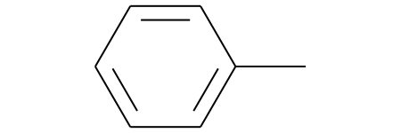
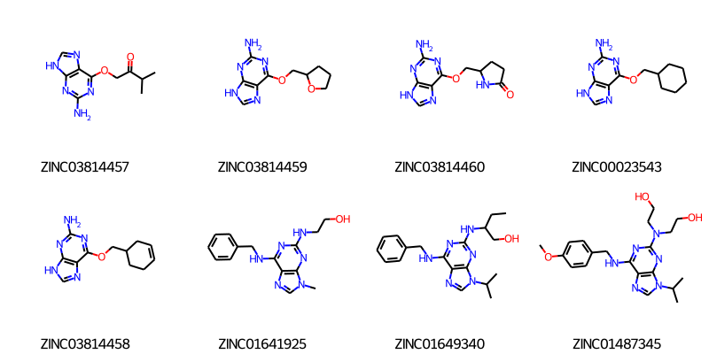
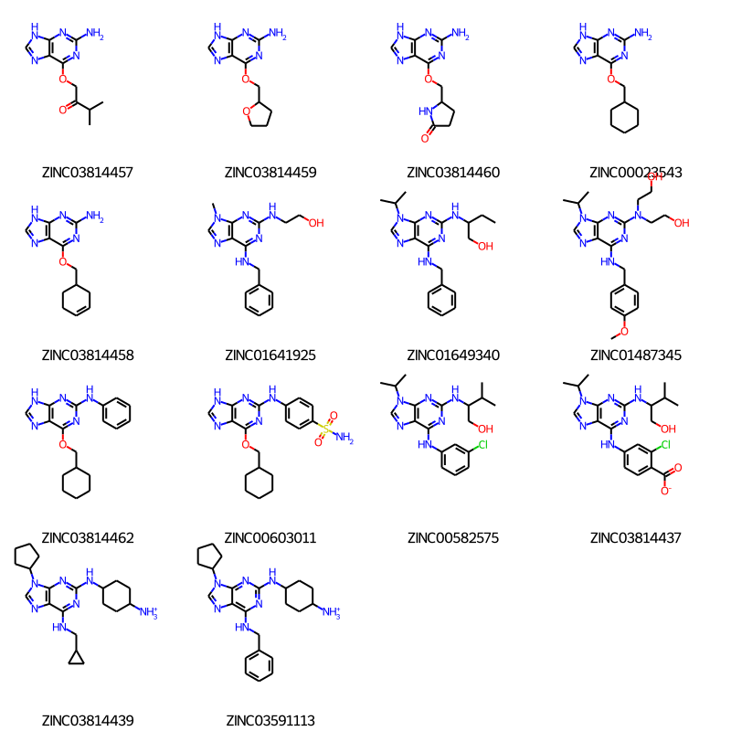
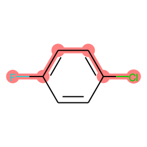
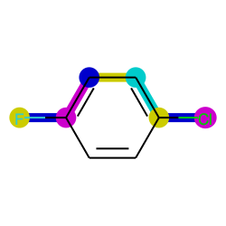
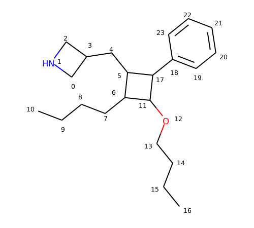
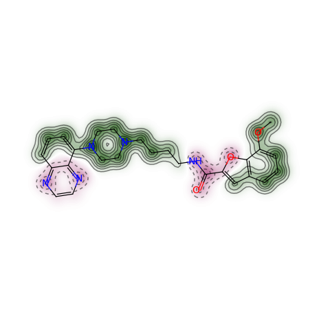
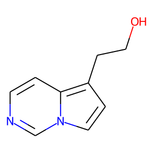
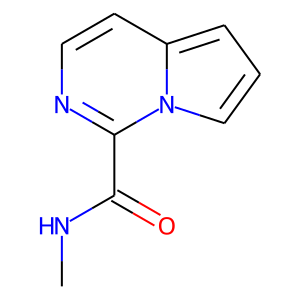

Getting Started with the RDKit in Python
%%%%%%%%%%%%%%%%%%%%%%%%%%%%%%%%%%%%%%%%

Important note
**************

Beginning with the 2019.03 release, the RDKit is no longer supporting Python 2.
If you need to continue using Python 2, please stick with a release from the 2018.09
release cycle.

What is this?
*************

This document is intended to provide an overview of how one can use
the RDKit functionality from Python.  It's not comprehensive and it's
not a manual.

If you find mistakes, or have suggestions for improvements, please
either fix them yourselves in the source document (the .rst file) or
send them to the mailing list: rdkit-devel@lists.sourceforge.net
In particular, if you find yourself spending time working out how to
do something that doesn't appear to be documented please contribute by writing
it up for this document. Contributing to the documentation is a great service
both to the RDKit community and to your future self.

Reading, Drawing, and Writing Molecules
***************************************

Reading single molecules
========================

.. testsetup::
  
  # clean up in case these tests are running in a python process that has already
  # imported the IPythonConsole code
  from rdkit.Chem.Draw import IPythonConsole
  IPythonConsole.UninstallIPythonRenderer()
  from rdkit.Chem import rdDepictor
  rdDepictor.SetPreferCoordGen(False)
  

The majority of the basic molecular functionality is found in module :py:mod:`rdkit.Chem`:

.. doctest::

  >>> from rdkit import Chem

Individual molecules can be constructed using a variety of approaches:

.. doctest::

  >>> m = Chem.MolFromSmiles('Cc1ccccc1')
  >>> m = Chem.MolFromMolFile('data/input.mol')
  >>> stringWithMolData=open('data/input.mol','r').read()
  >>> m = Chem.MolFromMolBlock(stringWithMolData)

All of these functions return a :py:class:`rdkit.Chem.rdchem.Mol` object on success:

.. doctest::

  >>> m
  <rdkit.Chem.rdchem.Mol object at 0x...>

or None on failure:

.. doctest::

  >>> m_invalid = Chem.MolFromMolFile('data/invalid.mol')
  >>> m_invalid is None
  True

An :py:class:`rdkit.Chem.rdchem.Mol` object can be displayed graphically using :py:func:`rdkit.Chem.Draw.MolToImage`:

.. doctest::

  >>> from rdkit.Chem import Draw
  >>> img = Draw.MolToImage(m)

An attempt is made to provide sensible error messages:

.. doctest::

  >>> m1 = Chem.MolFromSmiles('CO(C)C')

displays a message like: ``[12:18:01] Explicit valence for atom # 1 O greater than permitted`` and

.. doctest::

  >>> m2 = Chem.MolFromSmiles('c1cc1')

displays something like: ``[12:20:41] Can't kekulize mol``. In each case the value ``None`` is returned:

.. doctest::

  >>> m1 is None
  True
  >>> m2 is None
  True

Reading sets of molecules
=========================

Groups of molecules are read using a Supplier (for example, an :py:class:`rdkit.Chem.rdmolfiles.SDMolSupplier` or a :py:class:`rdkit.Chem.rdmolfiles.SmilesMolSupplier`):

.. doctest::

  >>> suppl = Chem.SDMolSupplier('data/5ht3ligs.sdf')
  >>> for mol in suppl:
  ...   print(mol.GetNumAtoms())
  ...
  20
  24
  24
  26

You can easily produce lists of molecules from a Supplier:

.. doctest::

  >>> mols = [x for x in suppl]
  >>> len(mols)
  4

or just treat the Supplier itself as a random-access object:

.. doctest::

  >>> suppl[0].GetNumAtoms()
  20

Two good practices when working with Suppliers are to use a context manager and
to test each molecule to see if it was correctly read before working with it:

.. doctest::

  >>> with Chem.SDMolSupplier('data/5ht3ligs.sdf') as suppl:
  ...   for mol in suppl:
  ...     if mol is None: continue
  ...     print(mol.GetNumAtoms())
  ...
  20
  24
  24
  26

An alternate type of Supplier, the :py:class:`rdkit.Chem.rdmolfiles.ForwardSDMolSupplier` 
can be used to read from file-like objects:

.. doctest::

  >>> inf = open('data/5ht3ligs.sdf','rb')
  >>> with Chem.ForwardSDMolSupplier(inf) as fsuppl:
  ...   for mol in fsuppl:
  ...     if mol is None: continue
  ...     print(mol.GetNumAtoms())
  ...
  20
  24
  24
  26

This means that they can be used to read from compressed files:

.. doctest::

  >>> import gzip
  >>> inf = gzip.open('data/actives_5ht3.sdf.gz')
  >>> with Chem.ForwardSDMolSupplier(inf) as gzsuppl:
  ...    ms = [x for x in gzsuppl if x is not None]
  >>> len(ms)
  180

Note that ForwardSDMolSuppliers cannot be used as random-access objects:

.. doctest::

  >>> inf = open('data/5ht3ligs.sdf','rb')
  >>> with Chem.ForwardSDMolSupplier(inf) as fsuppl:
  ...   fsuppl[0]
  Traceback (most recent call last):
    ...
  TypeError: 'ForwardSDMolSupplier' object does not support indexing

For reading Smiles or SDF files with large number of records concurrently, MultithreadedMolSuppliers can be used like this:

.. doctest::

  >>> i = 0
  >>> with Chem.MultithreadedSDMolSupplier('data/5ht3ligs.sdf') as sdSupl:
  ...   for mol in sdSupl:
  ...     if mol is not None: 
  ...       i += 1
  ...
  >>> print(i)
  4
  
By default a single reader thread is used to extract records from the file and a
single writer thread is used to process them. Note that due to multithreading
the output may not be in the expected order. Furthermore, the
MultithreadedSmilesMolSupplier and the MultithreadedSDMolSupplier cannot be used
as random-access objects. 

Writing molecules
=================

Single molecules can be converted to text using several functions present in the :py:mod:`rdkit.Chem` module.

For example, for SMILES:

.. doctest::

  >>> m = Chem.MolFromMolFile('data/chiral.mol')
  >>> Chem.MolToSmiles(m)
  'C[C@H](O)c1ccccc1'
  >>> Chem.MolToSmiles(m,isomericSmiles=False)
  'CC(O)c1ccccc1'

Note that the SMILES provided is canonical, so the output should be the same no matter how a particular molecule is input:

.. doctest::

  >>> Chem.MolToSmiles(Chem.MolFromSmiles('C1=CC=CN=C1'))
  'c1ccncc1'
  >>> Chem.MolToSmiles(Chem.MolFromSmiles('c1cccnc1'))
  'c1ccncc1'
  >>> Chem.MolToSmiles(Chem.MolFromSmiles('n1ccccc1'))
  'c1ccncc1'

If you'd like to have the Kekule form of the SMILES, first Kekulize the molecule, then use the “kekuleSmiles” option:

.. doctest::

  >>> Chem.Kekulize(m)
  >>> Chem.MolToSmiles(m,kekuleSmiles=True)
  'C[C@H](O)C1=CC=CC=C1'

Note: as of this writing (Aug 2008), the smiles provided when one requests kekuleSmiles are not canonical.
The limitation is not in the SMILES generation, but in the kekulization itself.

MDL Mol blocks are also available:

.. doctest::

  >>> m2 = Chem.MolFromSmiles('C1CCC1')
  >>> print(Chem.MolToMolBlock(m2))    # doctest: +NORMALIZE_WHITESPACE
  <BLANKLINE>
       RDKit          2D
  <BLANKLINE>
    4  4  0  0  0  0  0  0  0  0999 V2000
      1.0607    0.0000    0.0000 C   0  0  0  0  0  0  0  0  0  0  0  0
     -0.0000   -1.0607    0.0000 C   0  0  0  0  0  0  0  0  0  0  0  0
     -1.0607    0.0000    0.0000 C   0  0  0  0  0  0  0  0  0  0  0  0
      0.0000    1.0607    0.0000 C   0  0  0  0  0  0  0  0  0  0  0  0
    1  2  1  0
    2  3  1  0
    3  4  1  0
    4  1  1  0
  M  END
  <BLANKLINE>

To include names in the mol blocks, set the molecule's “_Name” property:

.. doctest::

  >>> m2.SetProp("_Name","cyclobutane")
  >>> print(Chem.MolToMolBlock(m2))     # doctest: +NORMALIZE_WHITESPACE
  cyclobutane
       RDKit          2D
  <BLANKLINE>
    4  4  0  0  0  0  0  0  0  0999 V2000
      1.0607    0.0000    0.0000 C   0  0  0  0  0  0  0  0  0  0  0  0
     -0.0000   -1.0607    0.0000 C   0  0  0  0  0  0  0  0  0  0  0  0
     -1.0607    0.0000    0.0000 C   0  0  0  0  0  0  0  0  0  0  0  0
      0.0000    1.0607    0.0000 C   0  0  0  0  0  0  0  0  0  0  0  0
    1  2  1  0
    2  3  1  0
    3  4  1  0
    4  1  1  0
  M  END
  <BLANKLINE>

In order for atom or bond stereochemistry to be recognised correctly by most
software, it's essential that the mol block have atomic coordinates.
It's also convenient for many reasons, such as drawing the molecules.
Generating a mol block for a molecule that does not have coordinates will, by
default, automatically cause coordinates to be generated. These are not,
however, stored with the molecule.
Coordinates can be generated and stored with the molecule using functionality
in the :py:mod:`rdkit.Chem.AllChem` module (see the `Chem vs AllChem`_ section for
more information).

You can either include 2D coordinates (i.e. a depiction):

.. doctest::

  >>> from rdkit.Chem import AllChem
  >>> AllChem.Compute2DCoords(m2)
  0
  >>> print(Chem.MolToMolBlock(m2))     # doctest: +NORMALIZE_WHITESPACE
  cyclobutane
       RDKit          2D
  <BLANKLINE>
    4  4  0  0  0  0  0  0  0  0999 V2000
      1.0607   -0.0000    0.0000 C   0  0  0  0  0  0  0  0  0  0  0  0
     -0.0000   -1.0607    0.0000 C   0  0  0  0  0  0  0  0  0  0  0  0
     -1.0607    0.0000    0.0000 C   0  0  0  0  0  0  0  0  0  0  0  0
      0.0000    1.0607    0.0000 C   0  0  0  0  0  0  0  0  0  0  0  0
    1  2  1  0
    2  3  1  0
    3  4  1  0
    4  1  1  0
  M  END
  <BLANKLINE>

Or you can add 3D coordinates by embedding the molecule (this uses the ETKDG
method, which is described in more detail below). Note that we add Hs to the 
molecule before generating the conformer. This is essential to get good structures:

.. doctest::

  >>> m3 = Chem.AddHs(m2)
  >>> params = AllChem.ETKDGv3()
  >>> params.randomSeed = 0xf00d # optional random seed for reproducibility
  >>> AllChem.EmbedMolecule(m3, params)   
  0
  >>> print(Chem.MolToMolBlock(m3))    # doctest: +NORMALIZE_WHITESPACE
  cyclobutane
       RDKit          3D
  <BLANKLINE>
   12 12  0  0  0  0  0  0  0  0999 V2000
      1.0256    0.2491   -0.0964 C   0  0  0  0  0  0  0  0  0  0  0  0
     -0.2041    0.9236    0.4320 C   0  0  0  0  0  0  0  0  0  0  0  0
     -1.0435   -0.2466   -0.0266 C   0  0  0  0  0  0  0  0  0  0  0  0
      0.2104   -0.9922   -0.3417 C   0  0  0  0  0  0  0  0  0  0  0  0
      1.4182    0.7667   -0.9782 H   0  0  0  0  0  0  0  0  0  0  0  0
      1.8181    0.1486    0.6820 H   0  0  0  0  0  0  0  0  0  0  0  0
     -0.1697    1.0826    1.5236 H   0  0  0  0  0  0  0  0  0  0  0  0
     -0.5336    1.8391   -0.1051 H   0  0  0  0  0  0  0  0  0  0  0  0
     -1.6809   -0.0600   -0.8987 H   0  0  0  0  0  0  0  0  0  0  0  0
     -1.6501   -0.6194    0.8220 H   0  0  0  0  0  0  0  0  0  0  0  0
      0.4659   -1.7768    0.3858 H   0  0  0  0  0  0  0  0  0  0  0  0
      0.3439   -1.3147   -1.3988 H   0  0  0  0  0  0  0  0  0  0  0  0
    1  2  1  0
    2  3  1  0
    3  4  1  0
    4  1  1  0
    1  5  1  0
    1  6  1  0
    2  7  1  0
    2  8  1  0
    3  9  1  0
    3 10  1  0
    4 11  1  0
    4 12  1  0
  M  END
<BLANKLINE>

If we don't want the Hs in our later analysis, they are easy to remove:

.. doctest::

  >>> m3 = Chem.RemoveHs(m3)
  >>> print(Chem.MolToMolBlock(m3))    # doctest: +NORMALIZE_WHITESPACE
  cyclobutane
       RDKit          3D
  <BLANKLINE>
    4  4  0  0  0  0  0  0  0  0999 V2000
      1.0256    0.2491   -0.0964 C   0  0  0  0  0  0  0  0  0  0  0  0
     -0.2041    0.9236    0.4320 C   0  0  0  0  0  0  0  0  0  0  0  0
     -1.0435   -0.2466   -0.0266 C   0  0  0  0  0  0  0  0  0  0  0  0
      0.2104   -0.9922   -0.3417 C   0  0  0  0  0  0  0  0  0  0  0  0
    1  2  1  0
    2  3  1  0
    3  4  1  0
    4  1  1  0
  M  END
  <BLANKLINE>

If you'd like to write the molecule to a file, use Python file objects:

.. doctest::

  >>> print(Chem.MolToMolBlock(m2),file=open('data/foo.mol','w+'))
  >>>

Writing sets of molecules
=========================

Multiple molecules can be written to a file using an :py:class:`rdkit.Chem.rdmolfiles.SDWriter` object:

.. doctest::

  >>> with Chem.SDWriter('data/foo.sdf') as w:
  ...   for m in mols: 
  ...     w.write(m)
  >>>

An SDWriter can also be initialized using a file-like object:

.. doctest::

  >>> from io import StringIO
  >>> sio = StringIO()
  >>> with Chem.SDWriter(sio) as w:
  ...   for m in mols: 
  ...     w.write(m)
  >>> print(sio.getvalue())
  mol-295
       RDKit          3D
  <BLANKLINE>
   20 22  0  0  1  0  0  0  0  0999 V2000
      2.3200    0.0800   -0.1000 C   0  0  0  0  0  0  0  0  0  0  0  0
      1.8400   -1.2200    0.1200 C   0  0  0  0  0  0  0  0  0  0  0  0
  ...
    1  3  1  0
    1  4  1  0
    2  5  1  0
  M  END
  $$$$
  <BLANKLINE>

Other available Writers include the :py:class:`rdkit.Chem.rdmolfiles.SmilesWriter` and the :py:class:`rdkit.Chem.rdmolfiles.TDTWriter`.

Working with Molecules
**********************

Looping over Atoms and Bonds
============================

Once you have a molecule, it's easy to loop over its atoms and bonds:

.. doctest::

  >>> m = Chem.MolFromSmiles('C1OC1')
  >>> for atom in m.GetAtoms():
  ...   print(atom.GetAtomicNum())
  ...
  6
  8
  6
  >>> print(m.GetBonds()[0].GetBondType())
  SINGLE

You can also request individual bonds or atoms:

.. doctest::

  >>> m.GetAtomWithIdx(0).GetSymbol()
  'C'
  >>> m.GetAtomWithIdx(0).GetExplicitValence()
  2
  >>> m.GetBondWithIdx(0).GetBeginAtomIdx()
  0
  >>> m.GetBondWithIdx(0).GetEndAtomIdx()
  1
  >>> m.GetBondBetweenAtoms(0,1).GetBondType()
  rdkit.Chem.rdchem.BondType.SINGLE

Atoms keep track of their neighbors:

.. doctest::

  >>> atom = m.GetAtomWithIdx(0)
  >>> [x.GetAtomicNum() for x in atom.GetNeighbors()]
  [8, 6]
  >>> len(atom.GetNeighbors()[-1].GetBonds())
  2

Ring Information
================

Atoms and bonds both carry information about the molecule's rings:

.. doctest::

  >>> m = Chem.MolFromSmiles('OC1C2C1CC2')
  >>> m.GetAtomWithIdx(0).IsInRing()
  False
  >>> m.GetAtomWithIdx(1).IsInRing()
  True
  >>> m.GetAtomWithIdx(2).IsInRingSize(3)
  True
  >>> m.GetAtomWithIdx(2).IsInRingSize(4)
  True
  >>> m.GetAtomWithIdx(2).IsInRingSize(5)
  False
  >>> m.GetBondWithIdx(1).IsInRingSize(3)
  True
  >>> m.GetBondWithIdx(1).IsInRing()
  True

But note that the information is only about the smallest rings:

.. doctest::

  >>> m.GetAtomWithIdx(1).IsInRingSize(5)
  False

More detail about the smallest set of smallest rings (SSSR) is available:

.. doctest::

  >>> ssr = Chem.GetSymmSSSR(m)
  >>> len(ssr)
  2
  >>> list(ssr[0])
  [1, 2, 3]
  >>> list(ssr[1])
  [4, 5, 2, 3]

As the name indicates, this is a symmetrized SSSR; if you are interested in the number of “true” SSSR, use the GetSSSR function (note that in this case there's no difference).

.. doctest::

  >>> len(Chem.GetSSSR(m))
  2

The distinction between symmetrized and non-symmetrized SSSR is discussed in more detail below in the section `The SSSR Problem`_.

For more efficient queries about a molecule's ring systems (avoiding repeated calls to Mol.GetAtomWithIdx), use the :py:class:`rdkit.Chem.rdchem.RingInfo` class:

.. doctest::

  >>> m = Chem.MolFromSmiles('OC1C2C1CC2')
  >>> ri = m.GetRingInfo()
  >>> ri.NumAtomRings(0)
  0
  >>> ri.NumAtomRings(1)
  1
  >>> ri.NumAtomRings(2)
  2
  >>> ri.IsAtomInRingOfSize(1,3)
  True
  >>> ri.IsBondInRingOfSize(1,3)
  True

Modifying molecules
===================

Normally molecules are stored in the RDKit with the hydrogen atoms implicit (e.g. not explicitly present in the molecular graph.
When it is useful to have the hydrogens explicitly present, for example when generating or optimizing the 3D geometry, the :py:func:rdkit.Chem.rdmolops.AddHs function can be used:

.. doctest::

  >>> m=Chem.MolFromSmiles('CCO')
  >>> m.GetNumAtoms()
  3
  >>> m2 = Chem.AddHs(m)
  >>> m2.GetNumAtoms()
  9

The Hs can be removed again using the :py:func:`rdkit.Chem.rdmolops.RemoveHs` function:

.. doctest::

  >>> m3 = Chem.RemoveHs(m2)
  >>> m3.GetNumAtoms()
  3

RDKit molecules are usually stored with the bonds in aromatic rings having aromatic bond types.
This can be changed with the :py:func:`rdkit.Chem.rdmolops.Kekulize` function:

.. doctest::

  >>> m = Chem.MolFromSmiles('c1ccccc1')
  >>> m.GetBondWithIdx(0).GetBondType()
  rdkit.Chem.rdchem.BondType.AROMATIC
  >>> Chem.Kekulize(m)
  >>> m.GetBondWithIdx(0).GetBondType()
  rdkit.Chem.rdchem.BondType.DOUBLE
  >>> m.GetBondWithIdx(1).GetBondType()
  rdkit.Chem.rdchem.BondType.SINGLE

By default, the bonds are still marked as being aromatic:

.. doctest::

  >>> m.GetBondWithIdx(1).GetIsAromatic()
  True

because the flags in the original molecule are not cleared (clearAromaticFlags defaults to False).
You can explicitly force or decline a clearing of the flags:

.. doctest::

  >>> m = Chem.MolFromSmiles('c1ccccc1')
  >>> m.GetBondWithIdx(0).GetIsAromatic()
  True
  >>> m1 = Chem.MolFromSmiles('c1ccccc1')
  >>> Chem.Kekulize(m1, clearAromaticFlags=True)
  >>> m1.GetBondWithIdx(0).GetIsAromatic()
  False

Bonds can be restored to the aromatic bond type using the :py:func:`rdkit.Chem.rdmolops.SanitizeMol` function:

.. doctest::

  >>> Chem.SanitizeMol(m)
  rdkit.Chem.rdmolops.SanitizeFlags.SANITIZE_NONE
  >>> m.GetBondWithIdx(0).GetBondType()
  rdkit.Chem.rdchem.BondType.AROMATIC

The value returned by `SanitizeMol()` indicates that no problems were encountered.

Working with 2D molecules: Generating Depictions
================================================

The RDKit has a library for generating depictions (sets of 2D) coordinates for molecules.
This library, which is part of the AllChem module, is accessed using the :py:func:`rdkit.Chem.rdDepictor.Compute2DCoords` function:

.. doctest::

  >>> m = Chem.MolFromSmiles('c1nccc2n1ccc2')
  >>> AllChem.Compute2DCoords(m)
  0

The 2D conformer is constructed in a canonical orientation and is
built to minimize intramolecular clashes, i.e. to maximize the clarity
of the drawing.

If you have a set of molecules that share a common template and you'd
like to align them to that template, you can do so as follows:

.. doctest::

  >>> template = Chem.MolFromSmiles('c1nccc2n1ccc2')
  >>> AllChem.Compute2DCoords(template)
  0
  >>> ms = [Chem.MolFromSmiles(smi) for smi in ('OCCc1ccn2cnccc12','C1CC1Oc1cc2ccncn2c1','CNC(=O)c1nccc2cccn12')]
  >>> for m in ms:
  ...     _ = AllChem.GenerateDepictionMatching2DStructure(m,template)

Running this process for the molecules above gives:

+---------------+---------------+---------------+
| |picture_1|   | |picture_0|   | |picture_3|   |
+---------------+---------------+---------------+

Another option for Compute2DCoords allows you to generate 2D depictions for molecules that closely mimic 3D conformers.
This is available using the function :py:func:`rdkit.Chem.AllChem.GenerateDepictionMatching3DStructure`.

Here is an illustration of the results using the ligand from PDB structure 1XP0:

+---------------+---------------+
| |picture_2|   | |picture_4|   |
+---------------+---------------+

More fine-grained control can be obtained using the core function
:py:func:`rdkit.Chem.rdDepictor.Compute2DCoordsMimicDistmat`, but that is
beyond the scope of this document.  See the implementation of
GenerateDepictionMatching3DStructure in AllChem.py for an example of
how it is used.

Working with 3D Molecules
=========================

The RDKit can generate conformers for molecules using two different
methods.  The original method used distance geometry. [#blaney]_
The algorithm followed is:

1. The molecule's distance bounds matrix is calculated based on the connection table and a set of rules.

2. The bounds matrix is smoothed using a triangle-bounds smoothing algorithm.

3. A random distance matrix that satisfies the bounds matrix is generated.

4. This distance matrix is embedded in 3D dimensions (producing coordinates for each atom).

5. The resulting coordinates are cleaned up somewhat using a crude force field and the bounds matrix.

Note that the conformers that result from this procedure tend to be fairly ugly.
They should be cleaned up using a force field. This can be done within the RDKit
using its implementation of the Universal Force Field (UFF). [#rappe]_

More recently, there is an implementation of the ETKDG method of Riniker and
Landrum [#riniker2]_ which uses torsion angle preferences from the Cambridge
Structural Database (CSD) to correct the conformers after distance geometry has
been used to generate them.  With this method, there should be no need to use a
minimisation step to clean up the structures.

More detailed information about the conformer generator and the parameters
controlling it can be found in the "RDKit Book".

Since the 2018.09 release of the RDKit, ETKDG is the default conformer
generation method. Since the 2024.03 release ETKDGv3 is the default.

The full process of embedding a molecule is easier than all the above verbiage makes it sound:

.. doctest::

  >>> m2=Chem.AddHs(m)
  >>> AllChem.EmbedMolecule(m2)
  0

The RDKit also has an implementation of the MMFF94 force field available.
[#mmff1]_, [#mmff2]_, [#mmff3]_, [#mmff4]_, [#mmffs]_ Please note that the MMFF
atom typing code uses its own aromaticity model, so the aromaticity flags of the
molecule will be modified after calling MMFF-related methods.

Here's an example of using MMFF94 to minimize an RDKit-generated conformer:
.. doctest::

  >>> m = Chem.MolFromSmiles('C1CCC1OC')
  >>> m2=Chem.AddHs(m)
  >>> AllChem.EmbedMolecule(m2)
  0
  >>> AllChem.MMFFOptimizeMolecule(m2)
  0

Note the calls to `Chem.AddHs()` in the examples above. By default
RDKit molecules do not have H atoms explicitly present in the graph,
but they are important for getting realistic geometries, so they
generally should be added.  They can always be removed afterwards
if necessary with a call to `Chem.RemoveHs()`.

With the RDKit, multiple conformers can also be generated using the
different embedding methods. In both cases this is simply a matter of
running the distance geometry calculation multiple times from
different random start points. The option `numConfs` allows the user to
set the number of conformers that should be generated.  Otherwise the
procedures are as before. The conformers so generated can be aligned
to each other and the RMS values calculated.

.. doctest::

  >>> m = Chem.MolFromSmiles('C1CCC1OC')
  >>> m2=Chem.AddHs(m)
  >>> # run ETKDG 10 times
  >>> cids = AllChem.EmbedMultipleConfs(m2, numConfs=10)
  >>> print(len(cids))
  10
  >>> rmslist = []
  >>> AllChem.AlignMolConformers(m2, RMSlist=rmslist)
  >>> print(len(rmslist))
  9

rmslist contains the RMS values between the first conformer and all others.
The RMS between two specific conformers (e.g. 1 and 9) can also be calculated.
The flag prealigned lets the user specify if the conformers are already aligned
(by default, the function aligns them).

.. doctest::

  >>> rms = AllChem.GetConformerRMS(m2, 1, 9, prealigned=True)

If you are interested in running MMFF94 on a molecule's conformers (note that
this is often not necessary when using ETKDG), there's a convenience
function available:

.. doctest::

  >>> res = AllChem.MMFFOptimizeMoleculeConfs(m2)

The result is a list a containing 2-tuples: `(not_converged, energy)` for
each conformer. If `not_converged` is 0, the minimization for that conformer
converged.

By default `AllChem.EmbedMultipleConfs` and `AllChem.MMFFOptimizeMoleculeConfs()`
run single threaded, but you can cause them to use
multiple threads simultaneously for these embarassingly parallel tasks
via the `numThreads` argument:

.. doctest::

  >>> params = AllChem.ETKDGv3()
  >>> params.numThreads = 0
  >>> cids = AllChem.EmbedMultipleConfs(m2, 10, params)
  >>> res = AllChem.MMFFOptimizeMoleculeConfs(m2, numThreads=0)

Setting `numThreads` to zero causes the software to use the maximum number
of threads allowed on your computer.

*Disclaimer/Warning*: Conformer generation is a difficult and subtle task. The
plain distance-geometry 2D->3D conversion provided with the RDKit is not
intended to be a replacement for a “real” conformer analysis tool; it merely
provides quick 3D structures for cases when they are required. We believe,
however, that the newer ETKDG method [#riniker2]_ is suitable for most purposes.

Preserving Molecules
====================

Molecules can be converted to and from text using Python's pickling machinery:

.. doctest::

  >>> m = Chem.MolFromSmiles('c1ccncc1')
  >>> import pickle
  >>> pkl = pickle.dumps(m)
  >>> m2=pickle.loads(pkl)
  >>> Chem.MolToSmiles(m2)
  'c1ccncc1'

The RDKit pickle format is fairly compact and it is much, much faster to build a
molecule from a pickle than from a Mol file or SMILES string, so storing
molecules you will be working with repeatedly as pickles can be a good idea.

The raw binary data that is encapsulated in a pickle can also be directly
obtained from a molecule:

.. doctest::

  >>> binStr = m.ToBinary()

This can be used to reconstruct molecules using the Chem.Mol constructor:

.. doctest::

  >>> m2 = Chem.Mol(binStr)
  >>> Chem.MolToSmiles(m2)
  'c1ccncc1'
  >>> len(binStr)
  130

Note that this is smaller than the pickle:

.. doctest::

  >>> len(binStr) < len(pkl)
  True

The small overhead associated with python's pickling machinery normally doesn't
end up making much of a difference for collections of larger molecules (the
extra data associated with the pickle is independent of the size of the
molecule, while the binary string increases in length as the molecule gets
larger).

*Tip*: The performance difference associated with storing molecules in a pickled
form on disk instead of constantly reparsing an SD file or SMILES table is
difficult to overstate. In a test I just ran on my laptop, loading a set of 699
drug-like molecules from an SD file took 10.8 seconds; loading the same
molecules from a pickle file took 0.7 seconds. The pickle file is also smaller –
1/3 the size of the SD file – but this difference is not always so dramatic
(it's a particularly fat SD file).

Drawing Molecules
=================

The RDKit has some built-in functionality for creating images from
molecules found in the :py:mod:`rdkit.Chem.Draw` package:

.. doctest::

  >>> with Chem.SDMolSupplier('data/cdk2.sdf') as suppl:
  ...   ms = [x for x in suppl if x is not None]
  >>> for m in ms: tmp=AllChem.Compute2DCoords(m)
  >>> from rdkit.Chem import Draw
  >>> Draw.MolToFile(ms[0],'images/cdk2_mol1.o.png')    # doctest: +SKIP
  >>> Draw.MolToFile(ms[1],'images/cdk2_mol2.o.png')    # doctest: +SKIP

Producing these images:

+----------------------------------+----------------------------------+
| .. image:: images/cdk2_mol1.png  | .. image:: images/cdk2_mol2.png  |
+----------------------------------+----------------------------------+

It's also possible to produce an image grid out of a set of molecules:

.. doctest::

  >>> img=Draw.MolsToGridImage(ms[:8],molsPerRow=4,subImgSize=(200,200),legends=[x.GetProp("_Name") for x in ms[:8]])    # doctest: +SKIP

This returns a PIL image, which can then be saved to a file:

.. doctest::

  >>> img.save('images/cdk2_molgrid.o.png')    # doctest: +SKIP

The result looks like this:

These would of course look better if the common core were
aligned. This is easy enough to do:

.. doctest::

  >>> p = Chem.MolFromSmiles('[nH]1cnc2cncnc21')
  >>> subms = [x for x in ms if x.HasSubstructMatch(p)]
  >>> len(subms)
  14
  >>> AllChem.Compute2DCoords(p)
  0
  >>> for m in subms: 
  ...   _ = AllChem.GenerateDepictionMatching2DStructure(m,p)
  >>> img=Draw.MolsToGridImage(subms,molsPerRow=4,subImgSize=(200,200),legends=[x.GetProp("_Name") for x in subms])    # doctest: +SKIP
  >>> img.save('images/cdk2_molgrid.aligned.o.png')    # doctest: +SKIP

The result looks like this:

Atoms in a molecule can be highlighted by drawing a coloured solid or
open circle around them, and bonds likewise can have a coloured
outline applied.  An obvious use is to show atoms and bonds that have
matched a substructure query

.. doctest::
   
   >>> from rdkit.Chem.Draw import rdMolDraw2D
   >>> smi = 'c1cc(F)ccc1Cl'
   >>> mol = Chem.MolFromSmiles(smi)
   >>> patt = Chem.MolFromSmarts('ClccccF')
   >>> hit_ats = list(mol.GetSubstructMatch(patt))
   >>> hit_bonds = []
   >>> for bond in patt.GetBonds():
   ...    aid1 = hit_ats[bond.GetBeginAtomIdx()]
   ...    aid2 = hit_ats[bond.GetEndAtomIdx()]
   ...    hit_bonds.append(mol.GetBondBetweenAtoms(aid1,aid2).GetIdx())
   >>> d = rdMolDraw2D.MolDraw2DSVG(500, 500) # or MolDraw2DCairo to get PNGs
   >>> rdMolDraw2D.PrepareAndDrawMolecule(d, mol, highlightAtoms=hit_ats,
   ...                                    highlightBonds=hit_bonds)

will produce:

It is possible to specify the colours for individual atoms and bonds:

.. doctest::
   
   >>> colours = [(0.8,0.0,0.8),(0.8,0.8,0),(0,0.8,0.8),(0,0,0.8)]
   >>> atom_cols = {}
   >>> for i, at in enumerate(hit_ats):
   ...     atom_cols[at] = colours[i%4]
   >>> bond_cols = {}
   >>> for i, bd in enumerate(hit_bonds):
   ...     bond_cols[bd] = colours[3 - i%4]
   >>> 
   >>> d = rdMolDraw2D.MolDraw2DCairo(500, 500)
   >>> rdMolDraw2D.PrepareAndDrawMolecule(d, mol, highlightAtoms=hit_ats,
   ...                                    highlightAtomColors=atom_cols,
   ...                                    highlightBonds=hit_bonds,
   ...                                    highlightBondColors=bond_cols)

to give:

Atoms and bonds can also be highlighted with multiple colours if they
fall into multiple sets, for example if they are matched by more
than 1 substructure pattern.  This is too complicated to show in this
simple introduction, but there is an example in
data/test_multi_colours.py, which produces the somewhat garish

As of version 2020.03, it is possible to add arbitrary small strings to annotate
atoms and bonds in the drawing.  The strings are added as properties
``atomNote`` and ``bondNote`` and they will be placed automatically close to the
atom or bond in question in a manner intended to minimise their clash with the
rest of the drawing.  For convenience, here are 3 flags in ``MolDraw2DOptions``
that will add stereo information (R/S to atoms, E/Z to bonds) and atom and bond
sequence numbers.

.. doctest::
   
   >>> mol = Chem.MolFromSmiles(r'Cl[C@H](F)NC\C=C\C')
   >>> d = rdMolDraw2D.MolDraw2DCairo(250, 200) # or MolDraw2DSVG to get SVGs
   >>> mol.GetAtomWithIdx(2).SetProp('atomNote', 'foo')
   >>> mol.GetBondWithIdx(0).SetProp('bondNote', 'bar')
   >>> d.drawOptions().addStereoAnnotation = True
   >>> d.drawOptions().addAtomIndices = True
   >>> d.DrawMolecule(mol)
   >>> d.FinishDrawing()
   >>> d.WriteDrawingText('atom_annotation_1.png')   # doctest: +SKIP

will produce

If atoms have an ``atomLabel`` property set, this will be used when drawing them:

.. doctest::
   
   >>> smi = 'c1nc(*)ccc1* |$;;;R1;;;;R2$|'
   >>> mol = Chem.MolFromSmiles(smi)
   >>> mol.GetAtomWithIdx(3).GetProp("atomLabel")
   'R1'
   >>> mol.GetAtomWithIdx(7).GetProp("atomLabel")
   'R2'
   >>> d = rdMolDraw2D.MolDraw2DCairo(250, 250)
   >>> rdMolDraw2D.PrepareAndDrawMolecule(d,mol)
   >>> d.WriteDrawingText("./images/atom_labels_1.png")   # doctest: +SKIP

gives:

Since the ``atomLabel`` property is also used for other things (for example in CXSMILES as demonstrated),
if you want to provide your own atom labels, it's better to use the ``_displayLabel`` property:

   >>> smi = 'c1nc(*)ccc1* |$;;;R1;;;;R2$|'
   >>> mol = Chem.MolFromSmiles(smi)
   >>> mol.GetAtomWithIdx(3).SetProp("_displayLabel","R1")
   >>> mol.GetAtomWithIdx(7).SetProp("_displayLabel","R2")
   >>> d = rdMolDraw2D.MolDraw2DCairo(250, 250)
   >>> rdMolDraw2D.PrepareAndDrawMolecule(d,mol)
   >>> d.WriteDrawingText("./images/atom_labels_2.png")   # doctest: +SKIP

this gives:

Note that you can use ```` and ```` in these labels to provide super- and subscripts.

Finally, if you have atom labels which should be displayed differently when the bond comes 
into them from the right (the West), you can also set the ``_displayLabelW`` property:

.. doctest::

   >>> smi = 'c1nc(*)ccc1* |$;;;R1;;;;R2$|'
   >>> mol = Chem.MolFromSmiles(smi)
   >>> mol.GetAtomWithIdx(3).SetProp("_displayLabel","CO2H")
   >>> mol.GetAtomWithIdx(3).SetProp("_displayLabelW","HO2C")
   >>> mol.GetAtomWithIdx(7).SetProp("_displayLabel","CO2-")
   >>> mol.GetAtomWithIdx(7).SetProp("_displayLabelW","-OOC")
   >>> d = rdMolDraw2D.MolDraw2DCairo(250, 250)
   >>> rdMolDraw2D.PrepareAndDrawMolecule(d,mol)
   >>> d.WriteDrawingText("./images/atom_labels_3.png")   # doctest: +SKIP

this gives:

Metadata in Molecule Images
===========================

*New in 2020.09 release*

The PNG files generated by the `MolDraw2DCairo` class by default include
metadata about the molecule(s) or chemical reaction included in the drawing.
This metadata can be used later to reconstruct the molecule(s) or reaction.

.. doctest::
  :skipif: not hasattr(Chem,'MolFromPNGString')

  >>> template = Chem.MolFromSmiles('c1nccc2n1ccc2')
  >>> AllChem.Compute2DCoords(template)
  0
  >>> ms = [Chem.MolFromSmiles(smi) for smi in ('OCCc1ccn2cnccc12','C1CC1Oc1cc2ccncn2c1','CNC(=O)c1nccc2cccn12')]
  >>> _ = [AllChem.GenerateDepictionMatching2DStructure(m,template) for m in ms]
  >>> d = rdMolDraw2D.MolDraw2DCairo(250, 200) 
  >>> d.DrawMolecule(ms[0])
  >>> d.FinishDrawing()
  >>> png = d.GetDrawingText()
  >>> mol = Chem.MolFromPNGString(png)
  >>> Chem.MolToSmiles(mol)      
  'OCCc1c2ccncn2cc1'

The molecular metadata is stored using standard metadata tags in the PNG and is,
of course, not visible when you look at the PNG:

If the PNG contains multiple molecules we can retrieve them all at once using
`Chem.MolsFromPNGString()`:

.. doctest::
  :skipif: not hasattr(Chem,'MolsFromPNGString')

  >>> from rdkit.Chem import Draw
  >>> png = Draw.MolsToGridImage(ms,returnPNG=True)
  >>> mols = Chem.MolsFromPNGString(png)
  >>> for mol in mols:
  ...     print(Chem.MolToSmiles(mol))
  ...  
  OCCc1c2ccncn2cc1
  c1cc2cc(OC3CC3)cn2cn1
  CNC(=O)c1nccc2cccn12

Substructure Searching
**********************

Substructure matching can be done using query molecules built from SMARTS:

.. doctest::

  >>> m = Chem.MolFromSmiles('c1ccccc1O')
  >>> patt = Chem.MolFromSmarts('ccO')
  >>> m.HasSubstructMatch(patt)
  True
  >>> m.GetSubstructMatch(patt)
  (0, 5, 6)

Those are the atom indices in ``m``, ordered as ``patt``'s atoms. To get all of the matches:

.. doctest::

  >>> m.GetSubstructMatches(patt)
  ((0, 5, 6), (4, 5, 6))

This can be used to easily filter lists of molecules:

.. doctest::

  >>> patt = Chem.MolFromSmarts('c[NH1]')
  >>> matches = []
  >>> with Chem.SDMolSupplier('data/actives_5ht3.sdf') as suppl:
  ...   for mol in suppl:
  ...     if mol.HasSubstructMatch(patt):
  ...       matches.append(mol)
  >>> len(matches)
  22

We can write the same thing more compactly using Python's list comprehension syntax:

.. doctest::

  >>> with Chem.SDMolSupplier('data/actives_5ht3.sdf') as suppl:
  ...   matches = [x for x in suppl if x.HasSubstructMatch(patt)]
  >>> len(matches)
  22

Substructure matching can also be done using molecules built from SMILES instead of SMARTS:

.. doctest::

  >>> m = Chem.MolFromSmiles('C1=CC=CC=C1OC')
  >>> m.HasSubstructMatch(Chem.MolFromSmarts('CO'))
  True
  >>> m.HasSubstructMatch(Chem.MolFromSmiles('CO'))
  True

But don't forget that the semantics of the two languages are not exactly equivalent:

.. doctest::

  >>> m.HasSubstructMatch(Chem.MolFromSmiles('COC'))
  True
  >>> m.HasSubstructMatch(Chem.MolFromSmarts('COC'))
  False
  >>> m.HasSubstructMatch(Chem.MolFromSmarts('COc')) #<- need an aromatic C
  True

Stereochemistry in substructure matches
=======================================

By default information about stereochemistry is not used in
substructure searches:

.. doctest::

  >>> m = Chem.MolFromSmiles('CC[C@H](F)Cl')
  >>> m.HasSubstructMatch(Chem.MolFromSmiles('C[C@H](F)Cl'))
  True
  >>> m.HasSubstructMatch(Chem.MolFromSmiles('C[C@@H](F)Cl'))
  True
  >>> m.HasSubstructMatch(Chem.MolFromSmiles('CC(F)Cl'))
  True

But this can be changed via the `useChirality` argument:

.. doctest::

  >>> m.HasSubstructMatch(Chem.MolFromSmiles('C[C@H](F)Cl'),useChirality=True)
  True
  >>> m.HasSubstructMatch(Chem.MolFromSmiles('C[C@@H](F)Cl'),useChirality=True)
  False
  >>> m.HasSubstructMatch(Chem.MolFromSmiles('CC(F)Cl'),useChirality=True)
  True

Notice that when `useChirality` is set a non-chiral query **does** match a chiral
molecule. The same is not true for a chiral query and a non-chiral molecule:

.. doctest::

  >>> m.HasSubstructMatch(Chem.MolFromSmiles('CC(F)Cl'))
  True
  >>> m2 = Chem.MolFromSmiles('CCC(F)Cl')
  >>> m2.HasSubstructMatch(Chem.MolFromSmiles('C[C@H](F)Cl'),useChirality=True)
  False

Atom Map Indices in SMARTS
==========================

It is possible to attach indices to the atoms in the SMARTS
pattern. This is most often done in reaction SMARTS (see `Chemical
Reactions`_), but is more general than that.  For example, in the
SMARTS patterns for torsion angle analysis published by Guba `et al.`
(``DOI: acs.jcim.5b00522``) indices are used to define the four atoms of
the torsion of interest. This allows additional atoms to be used to
define the environment of the four torsion atoms, as in
``[cH0:1][c:2]([cH0])!@[CX3!r:3]=[NX2!r:4]`` for an aromatic C=N
torsion.  We might wonder in passing why they didn't use
recursive SMARTS for this, which would have made life easier, but it
is what it is. The atom lists from ``GetSubstructureMatches`` are
guaranteed to be in order of the SMARTS, but in this case we'll get five
atoms so we need a way of picking out, in the correct order, the four of
interest.  When the SMARTS is parsed, the relevant atoms are assigned an
atom map number property that we can easily extract:

.. doctest::

  >>> qmol = Chem.MolFromSmarts( '[cH0:1][c:2]([cH0])!@[CX3!r:3]=[NX2!r:4]' )
  >>> ind_map = {}
  >>> for atom in qmol.GetAtoms() :
  ...     map_num = atom.GetAtomMapNum()
  ...     if map_num:
  ...         ind_map[map_num-1] = atom.GetIdx()
  >>> ind_map
  {0: 0, 1: 1, 2: 3, 3: 4}
  >>> map_list = [ind_map[x] for x in sorted(ind_map)]
  >>> map_list
  [0, 1, 3, 4]

Then, when using the query on a molecule you can get the indices of the four
matching atoms like this:

.. doctest::

  >>> mol = Chem.MolFromSmiles('Cc1cccc(C)c1C(C)=NC')
  >>> for match in mol.GetSubstructMatches( qmol ) :
  ...     mas = [match[x] for x in map_list]
  ...     print(mas)
  [1, 7, 8, 10]

Advanced substructure matching
==============================

Starting with the 2020.03 release, the RDKit allows you to provide an optional 
function that is used to check whether or not a possible substructure match should
be accepted. This function is called with the molecule to be matched and the indices
of the matching atoms.

Here's an example of how you can use the functionality to do "Markush-like" matching,
requiring that all atoms in a sidechain are either carbon (type "all_carbon") or aren't 
aromatic (type "alkyl"). We start by defining the class that we'll use to test the 
sidechains:

.. testcode::

  from rdkit import Chem

  class SidechainChecker(object):
    matchers = {
      'alkyl': lambda at: not at.GetIsAromatic(),
      'all_carbon': lambda at: at.GetAtomicNum() == 6
    }

    def __init__(self, query, pName="queryType"):
      # identify the atoms that have the properties we care about
      self._atsToExamine = [(x.GetIdx(), x.GetProp(pName)) for x in query.GetAtoms()
                            if x.HasProp(pName)]
      self._pName = pName

    def __call__(self, mol, vect):
      seen = [0] * mol.GetNumAtoms()
      for idx in vect:
        seen[idx] = 1
      # loop over the atoms we care about:
      for idx, qtyp in self._atsToExamine:
        midx = vect[idx]
        stack = [midx]
        atom = mol.GetAtomWithIdx(midx)
        # now do a breadth-first search from that atom, checking
        # all of its neighbors that aren't in the substructure 
        # query:
        stack = [atom]
        while stack:
          atom = stack.pop(0)
          if not self.matchers[qtyp](atom):
            return False
          seen[atom.GetIdx()] = 1
          for nbr in atom.GetNeighbors():
            if not seen[nbr.GetIdx()]:
              stack.append(nbr)
      return True

Here's the molecule we'll use:

And the default behavior:

.. doctest::

  >>> m = Chem.MolFromSmiles('C2NCC2CC1C(CCCC)C(OCCCC)C1c2ccccc2')
  >>> p = Chem.MolFromSmarts('C1CCC1*')
  >>> p.GetAtomWithIdx(4).SetProp("queryType", "all_carbon")
  >>> m.GetSubstructMatches(p)
  ((5, 6, 11, 17, 18), (5, 17, 11, 6, 7), (6, 5, 17, 11, 12), (6, 11, 17, 5, 4))

Now let's add the final check to filter the results:

.. doctest::

  >>> params = Chem.SubstructMatchParameters()
  >>> checker = SidechainChecker(p)
  >>> params.setExtraFinalCheck(checker)
  >>> m.GetSubstructMatches(p,params)
  ((5, 6, 11, 17, 18), (5, 17, 11, 6, 7))

Repeat that using the 'alkyl' query:

.. doctest::

  >>> p.GetAtomWithIdx(4).SetProp("queryType", "alkyl")
  >>> checker = SidechainChecker(p)
  >>> params.setExtraFinalCheck(checker)
  >>> m.GetSubstructMatches(p,params)
  ((5, 17, 11, 6, 7), (6, 5, 17, 11, 12), (6, 11, 17, 5, 4))

Chemical Transformations
************************

The RDKit contains a number of functions for modifying molecules. Note
that these transformation functions are intended to provide an easy
way to make simple modifications to molecules.
For more complex transformations, use the `Chemical Reactions`_ functionality.

Substructure-based transformations
==================================

There's a variety of functionality for using the RDKit's
substructure-matching machinery for doing quick molecular transformations.
These transformations include deleting substructures:

.. doctest::

  >>> m = Chem.MolFromSmiles('CC(=O)O')
  >>> patt = Chem.MolFromSmarts('C(=O)[OH]')
  >>> rm = AllChem.DeleteSubstructs(m,patt)
  >>> Chem.MolToSmiles(rm)
  'C'

replacing substructures:

.. doctest::

  >>> repl = Chem.MolFromSmiles('OC')
  >>> patt = Chem.MolFromSmarts('[$(NC(=O))]')
  >>> m = Chem.MolFromSmiles('CC(=O)N')
  >>> rms = AllChem.ReplaceSubstructs(m,patt,repl)
  >>> rms
  (<rdkit.Chem.rdchem.Mol object at 0x...>,)
  >>> Chem.MolToSmiles(rms[0])
  'COC(C)=O'

as well as simple SAR-table transformations like removing side chains:

.. doctest::

  >>> m1 = Chem.MolFromSmiles('BrCCc1cncnc1C(=O)O')
  >>> core = Chem.MolFromSmiles('c1cncnc1')
  >>> tmp = Chem.ReplaceSidechains(m1,core)
  >>> Chem.MolToSmiles(tmp)
  '[1*]c1cncnc1[2*]'

and removing cores:

.. doctest::

  >>> tmp = Chem.ReplaceCore(m1,core)
  >>> Chem.MolToSmiles(tmp)
  '[1*]CCBr.[2*]C(=O)O'

By default the sidechains are labeled based on the order they are found.
They can also be labeled according by the number of that core-atom they're attached to:

.. doctest::

  >>> m1 = Chem.MolFromSmiles('c1c(CCO)ncnc1C(=O)O')
  >>> tmp=Chem.ReplaceCore(m1,core,labelByIndex=True)
  >>> Chem.MolToSmiles(tmp)
  '[1*]CCO.[5*]C(=O)O'

:py:func:`rdkit.Chem.rdmolops.ReplaceCore` returns the sidechains in a single molecule.
This can be split into separate molecules using :py:func:`rdkit.Chem.rdmolops.GetMolFrags` :

.. doctest::

  >>> rs = Chem.GetMolFrags(tmp,asMols=True)
  >>> len(rs)
  2
  >>> Chem.MolToSmiles(rs[0])
  '[1*]CCO'
  >>> Chem.MolToSmiles(rs[1])
  '[5*]C(=O)O'

Murcko Decomposition
====================

The RDKit provides standard Murcko-type decomposition [#bemis1]_ of molecules
into scaffolds:

.. doctest::

  >>> from rdkit.Chem.Scaffolds import MurckoScaffold
  >>> with Chem.SDMolSupplier('data/cdk2.sdf') as cdk2mols:
  ...   m1 = cdk2mols[0]
  >>> core = MurckoScaffold.GetScaffoldForMol(m1)
  >>> Chem.MolToSmiles(core)
  'c1ncc2nc[nH]c2n1'

or into a generic framework:

.. doctest::

  >>> fw = MurckoScaffold.MakeScaffoldGeneric(core)
  >>> Chem.MolToSmiles(fw)
  'C1CCC2CCCC2C1'

Maximum Common Substructure
***************************

There are 2 methods for finding maximum common substructures.  The first, FindMCS,
finds a single fragment maximum common substructure (MCS) of two or more molecules:
The second, RascalMCES, finds the maximum common edge substructure (MCES) between two
molecules and can return a multi-fragment MCES.  The difference is demonstrated with the
following pair of molecules:

+-------------------------------------+
| .. image:: images/mcs_example_1.png |
+-------------------------------------+
| .. image:: images/mcs_example_2.png |
+-------------------------------------+

FMCS gives this maximum common substructure:

+-------------------------------------+
| .. image:: images/mcs_example_3.png |
+-------------------------------------+
| .. image:: images/mcs_example_4.png |
+-------------------------------------+

Whereas RascalMCES gives:

+-------------------------------------+
| .. image:: images/mcs_example_5.png |
+-------------------------------------+
| .. image:: images/mcs_example_6.png |
+-------------------------------------+

FindMCS
=======

FindMCS operates on 2 or more molecules:

.. doctest::

  >>> from rdkit.Chem import rdFMCS
  >>> mol1 = Chem.MolFromSmiles("O=C(NCc1cc(OC)c(O)cc1)CCCC/C=C/C(C)C")
  >>> mol2 = Chem.MolFromSmiles("CC(C)CCCCCC(=O)NCC1=CC(=C(C=C1)O)OC")
  >>> mol3 = Chem.MolFromSmiles("c1(C=O)cc(OC)c(O)cc1")
  >>> mols = [mol1,mol2,mol3]
  >>> res=rdFMCS.FindMCS(mols)
  >>> res
  <rdkit.Chem.rdFMCS.MCSResult object at 0x...>
  >>> res.numAtoms
  10
  >>> res.numBonds
  10
  >>> res.smartsString
  '[#6]1(-[#6]):[#6]:[#6](-[#8]-[#6]):[#6](:[#6]:[#6]:1)-[#8]'
  >>> res.canceled
  False

It returns an MCSResult instance with information about the number of
atoms and bonds in the MCS, the SMARTS string which matches the
identified MCS, and a flag saying if the algorithm timed out. If no
MCS is found then the number of atoms and bonds is set to 0 and the
SMARTS to ``''``.

By default, two atoms match if they are the same element and two bonds
match if they have the same bond type. Specify ``atomCompare`` and
``bondCompare`` to use different comparison functions, as in:

.. doctest::

  >>> mols = (Chem.MolFromSmiles('NCC'),Chem.MolFromSmiles('OC=C'))
  >>> rdFMCS.FindMCS(mols).smartsString
  '[#6]'
  >>> rdFMCS.FindMCS(mols, atomCompare=rdFMCS.AtomCompare.CompareAny).smartsString
  '[#7,#8]-[#6]'
  >>> rdFMCS.FindMCS(mols, bondCompare=rdFMCS.BondCompare.CompareAny).smartsString
  '[#6]-,=[#6]'

The options for the atomCompare argument are: CompareAny says that any
atom matches any other atom, CompareElements compares by element type,
and CompareIsotopes matches based on the isotope label. Isotope labels
can be used to implement user-defined atom types. A bondCompare of
CompareAny says that any bond matches any other bond, CompareOrderExact says
bonds are equivalent if and only if they have the same bond type, and
CompareOrder allows single and aromatic bonds to match each other, but
requires an exact order match otherwise:

.. doctest::

  >>> mols = (Chem.MolFromSmiles('c1ccccc1'),Chem.MolFromSmiles('C1CCCC=C1'))
  >>> rdFMCS.FindMCS(mols,bondCompare=rdFMCS.BondCompare.CompareAny).smartsString
  '[#6]1:,-[#6]:,-[#6]:,-[#6]:,-[#6]:,=[#6]:,-1'
  >>> rdFMCS.FindMCS(mols,bondCompare=rdFMCS.BondCompare.CompareOrderExact).smartsString
  '[#6]'
  >>> rdFMCS.FindMCS(mols,bondCompare=rdFMCS.BondCompare.CompareOrder).smartsString
  '[#6](:,-[#6]:,-[#6]:,-[#6]):,-[#6]:,-[#6]'

A substructure has both atoms and bonds. By default, the algorithm
attempts to maximize the number of bonds found. You can change this by
setting the ``maximizeBonds`` argument to False.
Maximizing the number of bonds tends to maximize the number of rings,
although two small rings may have fewer bonds than one large ring.

You might not want a 3-valent nitrogen to match one which is 5-valent.
The default ``matchValences`` value of False ignores valence
information.  When True, the atomCompare setting is modified to also
require that the two atoms have the same valency.

.. doctest::

  >>> mols = (Chem.MolFromSmiles('NC1OC1'),Chem.MolFromSmiles('C1OC1[N+](=O)[O-]'))
  >>> rdFMCS.FindMCS(mols).numAtoms
  4
  >>> rdFMCS.FindMCS(mols, matchValences=True).numBonds
  3

It can be strange to see a linear carbon chain match a carbon ring,
which is what the ``ringMatchesRingOnly`` default of False does. If
you set it to True then ring bonds will only match ring bonds.

.. doctest::

  >>> mols = [Chem.MolFromSmiles("C1CCC1CCC"), Chem.MolFromSmiles("C1CCCCCC1")]
  >>> rdFMCS.FindMCS(mols).smartsString
  '[#6](-[#6]-[#6])-[#6]-[#6]-[#6]-[#6]'
  >>> rdFMCS.FindMCS(mols, ringMatchesRingOnly=True).smartsString
  '[#6&R](-&@[#6&R]-&@[#6&R])-&@[#6&R]'

Notice that the SMARTS returned now include ring queries on the atoms and bonds.

You can further restrict things and require that partial rings (as in
this case) are not allowed. That is, if an atom is part of the MCS and
the atom is in a ring of the entire molecule then that atom is also in
a ring of the MCS. Setting ``completeRingsOnly`` to True toggles this
requirement.

.. doctest::

  >>> mols = [Chem.MolFromSmiles("CCC1CC2C1CN2"), Chem.MolFromSmiles("C1CC2C1CC2")]
  >>> rdFMCS.FindMCS(mols).smartsString
  '[#6]1-[#6]-[#6](-[#6]-1-[#6])-[#6]'
  >>> rdFMCS.FindMCS(mols, ringMatchesRingOnly=True).smartsString
  '[#6]1-&@[#6]-&@[#6](-&@[#6]-&@1)-&@[#6&R]'
  >>> rdFMCS.FindMCS(mols, completeRingsOnly=True).smartsString
  '[#6]1-&@[#6]-&@[#6]-&@[#6]-&@1'

Of course the two options can be combined with each other:

.. doctest::

  >>> ms = [Chem.MolFromSmiles(x) for x in ('CC1CCC1','CCC1CC1',)]                                                                                                      
  >>> rdFMCS.FindMCS(ms,ringMatchesRingOnly=True).smartsString                                                                                                          
  '[#6&!R]-&!@[#6&R](-&@[#6&R])-&@[#6&R]'
  >>> rdFMCS.FindMCS(ms,completeRingsOnly=True).smartsString                                                                                                            
  '[#6]-&!@[#6]'
  >>> rdFMCS.FindMCS(ms,ringMatchesRingOnly=True,completeRingsOnly=True).smartsString                                                                                   
  '[#6&!R]-&!@[#6&R]'

The MCS algorithm will exhaustively search for a maximum common substructure.
Typically this takes a fraction of a second, but for some comparisons this
can take minutes or longer. Use the ``timeout`` parameter to stop the search
after the given number of seconds (wall-clock seconds, not CPU seconds) and
return the best match found in that time. If timeout is reached then the
``canceled`` property of the MCSResult will be True instead of False.

.. doctest::

  >>> mols = [Chem.MolFromSmiles("Nc1ccccc1"*10), Chem.MolFromSmiles("Nc1ccccccccc1"*10)]
  >>> rdFMCS.FindMCS(mols, timeout=1).canceled
  True

(The MCS after 50 seconds contained 511 atoms.)

RascalMCES
==========

RascalMCES can only work on 2 molecules at a time:

.. doctest::

  >>> from rdkit.Chem import rdRascalMCES
  >>> mol1 = Chem.MolFromSmiles("CN(C)c1ccc(CC(=O)NCCCCCCCCCCNC23CC4CC(C2)CC(C3)C4)cc1 CHEMBL153934")
  >>> mol2 = Chem.MolFromSmiles("CN(C)c1ccc(CC(=O)NCCCCCCCNC23CC4CC(C2)CC(C3)C4)cc1 CHEMBL152361")
  >>> res = rdRascalMCES.FindMCES(mol1, mol2)
  >>> res[0].smartsString
  'CN(-C)-c1:c:c:c(-CC(=O)-NCCCCCCC):c:c:1.NC12CC3CC(-C1)-CC(-C2)-C3'
  >>> len(res[0].bondMatches())
  33

It returns a list of RascalResult objects.  Each RascalResult contains the 2 molecules that
the result pertains to, the SMARTS string of the MCES, the lists of atoms and bonds in the
two molecules that match, the Johnson similarity between the 2 molecules, the number of
fragments in the MCES, the number of atoms in the largest fragment and whether the run
timed out or not.  There is also the method largestFragmentOnly(), which cuts the MCES
down to the largest single fragment.  This is a non-reversible change, so if you want both
results, take a copy first.

By default, the MCES algorithm returns the first result it finds of maximum size.  Because of
symmetry, there may be other equivalent solutions with the same number of atoms and bonds,
but with different equivalent bonds matched to each other.  If you want to see all MCESs of
maximum size, you can use the option allBestMCESs = True.  This will increase the run time,
partly because more branches in the search tree must be examined, but mostly because sorting
the multiple results is quite time-consuming.  The results are returned in a consistent order
sorted by number of bond matches, then number of fragments (fewer first), then largest
fragment size and so on.  Some of these aren't trivial to compute.  The adamantane example
above is particularly extreme because not only is there extensive symmetry about the
adamantane end and 2-fold symmetry at the phenyl end but also several points of breaking the
matching alkyl chain all of which give rise to valid MCESs of the same size.  In this case,
sorting into a consistent order takes significantly longer than determining the MCESs in the
first place.

The MCES differs from a conventional MCS in that it is the maximum common substructure based
on bonds rather than atoms.  Often the result is the same, but not always.

The Johnson similarity is akin to a Tanimoto similarity, but expressed in terms of the
atoms and bonds in the MCES.  It is the square of the sum of the number of atoms and bonds
in the MCES divided by the product of the sums of the numbers of atoms and bonds in the
2 input molecules.  It has values between 0.0 (no MCES between the molecules) and 1.0 (the
molecules are identical).  A key source of efficiency in the RASCAL algorithm is a fast and
correct prediction of a maximum value for the Johnson similarity between 2 molecules and
hence the maximum size of the MCES.  The first step in the algorithm is then a screening,
whereby the full MCES determination is not performed if the predicted similarity is less
than some desired threshold.  The final similarity between the 2 molecules may be less
than the threshold, but it will never be higher than the predicted upper bound.  RASCAL
stems from RApid Similarity CALulation.

The default settings for RascalMCES are good for general use, but they may be altered
by passing an optional RascalOptions object:

.. doctest::

  >>> mol1 = Chem.MolFromSmiles('Oc1cccc2C(=O)C=CC(=O)c12')
  >>> mol2 = Chem.MolFromSmiles('O1C(=O)C=Cc2cc(OC)c(O)cc12')
  >>> results = rdRascalMCES.FindMCES(mol1, mol2)
  >>> len(results)
  0
  >>> opts = rdRascalMCES.RascalOptions()
  >>> opts.similarityThreshold = 0.5
  >>> results = rdRascalMCES.FindMCES(mol1, mol2, opts)
  >>> len(results)
  1
  >>> f'{results[0].similarity:.2f}'
  '0.37'
  >>> results[0].smartsString
  'Oc1:c:c:c:c:c:1.[#6]=O'
  >>> opts.minFragSize = 3
  >>> results = rdRascalMCES.FindMCES(mol1, mol2, opts)
  >>> len(results)
  1
  >>> f'{results[0].similarity:.2f}'
  '0.25'
  >>> results[0].smartsString
  'Oc1:c:c:c:c:c:1'

In this case, the upper bound on the similarity score is below the default threshold
of 0.7, so no results are returned.  Setting the threshold to 0.5 produces the second
result although, as can be seen, the final similarity is substantially below the
threshold.  This example also shows a disadvantage of the MCES method, which is that
it can produce small fragments in the MCES which are rarely helpful.  The option
minFragSize can be used to over-ride the default value of -1, which means no minimum
size.

Like FindMCS, there is a ringMatchesRingOnly option, and also there's
completeAromaticRings, which is True by default, and means that MCESs won't be returned
with partial aromatic rings matching:

.. doctest::

  >>> mol1 = Chem.MolFromSmiles('C1CCCC1c1ccncc1')
  >>> mol2 = Chem.MolFromSmiles('C1CCCC1c1ccccc1')
  >>> results = rdRascalMCES.FindMCES(mol1, mol2, opts)
  >>> f'{results[0].similarity:.2f}'
  '0.27'
  >>> results[0].smartsString
  'C1CCCC1-c'
  >>> opts.completeAromaticRings = False
  >>> results = rdRascalMCES.FindMCES(mol1, mol2, opts)
  >>> f'{results[0].similarity:.2f}'
  '0.76'
  >>> results[0].smartsString
  'C1CCCC1-c(:c:c):c:c'

This result may look a bit odd, with a single aromatic carbon in the first SMARTS
string.  This is a consequence of the fact that the MCES works on matching bonds.
A better, atom-centric, representation might be C1CCC[$(C-c)]1.  When the
completeAromaticRings option is set to False, a larger MCES is found, with just
the pyridine nitrogen atom not matching the corresponding phenyl carbon atom.

Clustering with Rascal
======================

There are 2 clustering methods available using the Johnson metric.  The first,
RascalCluster, is a fuzzy method described in 'A Line Graph Algorithm for
Clustering Chemical Structures Based on Common Substructural Cores', JW Raymond,
PW Willett
(https://match.pmf.kg.ac.rs/electronic_versions/Match48/match48_197-207.pdf also
available at https://eprints.whiterose.ac.uk/77598/).
The second, RascalButinaCluster, uses the Butina sphere-exclusion algorithm
(Butina JCICS 39 747-750 (1999)).  Because of the time-consuming nature of the MCES
determination, these clustering methods can be slow to run, so are best used
on small sets (no more than a few hundred molecules) of small molecules.

Fingerprinting and Molecular Similarity
***************************************

The RDKit has a variety of built-in functionality for generating molecular
fingerprints and using them to calculate molecular similarity.

The most straightforward and consistent way to get fingerprints is to create a
FingeprintGenerator object for your fingerprint type of interest and then use
that to calculate fingerprints. Fingerprint generators provide a consistent
interface to all the supported fingerprinting methods and allow easy generation
of fingerprints as:

- bit vectors : ``fpgen.GetFingerprint``
- sparse (unfolded) bit vectors : ``fpgen.GetSparseFingerprint``
- count vectors : ``fpgen.GetCountFingerprint``
- sparse (unfolded) count vectors : ``fpgen.GetSparseCountFingerprint``

Note that there are older, legacy methods of generating fingerprints with the
RDKit which are still supported, but these will not be covered here.

RDKit (Topological) Fingerprints
================================

.. doctest::

  >>> from rdkit import DataStructs
  >>> ms = [Chem.MolFromSmiles('CCOC'), Chem.MolFromSmiles('CCO'),
  ... Chem.MolFromSmiles('COC')]
  >>> fpgen = AllChem.GetRDKitFPGenerator()
  >>> fps = [fpgen.GetFingerprint(x) for x in ms]
  >>> DataStructs.TanimotoSimilarity(fps[0],fps[1])
  0.6...
  >>> DataStructs.TanimotoSimilarity(fps[0],fps[2])
  0.4...
  >>> DataStructs.TanimotoSimilarity(fps[1],fps[2])
  0.25

The examples above used Tanimoto similarity, but one can use different similarity metrics:

.. doctest::

  >>> DataStructs.DiceSimilarity(fps[0],fps[1])
  0.75

Available similarity metrics include Tanimoto, Dice, Cosine, Sokal, Russel, Kulczynski, McConnaughey, and Tversky.

More details about the algorithm used for the RDKit fingerprint can be found in the "RDKit Book".

The default set of parameters used by the fingerprinter is:

- minimum path size: 1 bond
- maximum path size: 7 bonds
- fingerprint size: 2048 bits
- number of bits set per hash: 2

You can control these when calling
:py:func:`AllChem.GetRDKitFPGenerator`:

.. doctest::

  >>> fpgen = AllChem.GetRDKitFPGenerator(maxPath=2,fpSize=1024)
  >>> fps = [fpgen.GetFingerprint(x) for x in ms]
  >>> DataStructs.TanimotoSimilarity(fps[0],fps[2])
  0.5

Atom Pairs and Topological Torsions
===================================

Atom-pair descriptors [#carhart]_ are available in several different forms.
The standard form is as fingerprint including counts for each bit instead of just zeros and ones:

.. doctest::

  >>> ms = [Chem.MolFromSmiles('C1CCC1OCC'),Chem.MolFromSmiles('CC(C)OCC'),Chem.MolFromSmiles('CCOCC')]
  >>> fpgen = AllChem.GetAtomPairGenerator()
  >>> pairFps = [fpgen.GetSparseCountFingerprint(x) for x in ms]

Because the space of bits that can be included in atom-pair fingerprints is
huge, they are stored in a sparse manner. We can get the list of bits and their
counts for each fingerprint as a dictionary:

.. doctest::

  >>> pairFps[-1].GetNonzeroElements()
  {541732: 1, 558113: 2, 558115: 2, 558146: 1, 1606690: 2, 1606721: 2}

Unlike most other fingerprint types, descriptions of the bits are directly available:

.. doctest::

  >>> from rdkit.Chem.AtomPairs import Pairs
  >>> Pairs.ExplainPairScore(558115)
  (('C', 1, 0), 3, ('C', 2, 0))

The above means: C with 1 neighbor and 0 pi electrons which is 3 bonds
from a C with 2 neighbors and 0 pi electrons

The usual metric for similarity between atom-pair fingerprints is Dice similarity:

.. doctest::

  >>> from rdkit import DataStructs
  >>> DataStructs.DiceSimilarity(pairFps[0],pairFps[1])
  0.333...
  >>> DataStructs.DiceSimilarity(pairFps[0],pairFps[2])
  0.258...
  >>> DataStructs.DiceSimilarity(pairFps[1],pairFps[2])
  0.56

It's also possible to get atom-pair descriptors encoded as a standard bit vector
fingerprint. 

.. doctest::

  >>> pairFps = [fpgen.GetFingerprint(x) for x in ms]
  >>> DataStructs.DiceSimilarity(pairFps[0],pairFps[1])
  0.352...
  >>> DataStructs.DiceSimilarity(pairFps[0],pairFps[2])
  0.266...
  >>> DataStructs.DiceSimilarity(pairFps[1],pairFps[2])
  0.583...

By default the atom pair bit vector fingerprints use a scheme which simulates counts in the bit
vectors (described in detail in the "RDKit Book"), but this can be disabled:

.. doctest::

  >>> fpgen = AllChem.GetAtomPairGenerator(countSimulation=False)
  >>> pairFps = [fpgen.GetFingerprint(x) for x in ms]
  >>> DataStructs.DiceSimilarity(pairFps[0],pairFps[1])
  0.5
  >>> DataStructs.DiceSimilarity(pairFps[0],pairFps[2])
  0.4
  >>> DataStructs.DiceSimilarity(pairFps[1],pairFps[2])
  0.625

Topological torsion descriptors [#nilakantan]_ are calculated in
essentially the same way:

.. doctest::

  >>> fpgen = AllChem.GetTopologicalTorsionGenerator()
  >>> tts = [fpgen.GetSparseCountFingerprint(x) for x in ms]
  >>> DataStructs.DiceSimilarity(tts[0],tts[1])
  0.166...

Topological torsion fingerprints, like atom-pair fingerprints, use a count
simulation scheme by default when generating bit vector fingerprints

Morgan Fingerprints (Circular Fingerprints)
===========================================

This family of fingerprints, better known as circular fingerprints
[#rogers]_, is built by applying the Morgan algorithm to a set of
user-supplied atom invariants.  When generating Morgan fingerprints,
the radius of the fingerprint can also be provided (the default is 3):

.. doctest::

  >>> from rdkit.Chem import AllChem
  >>> fpgen = AllChem.GetMorganGenerator(radius=2)
  >>> m1 = Chem.MolFromSmiles('Cc1ccccc1')
  >>> fp1 = fpgen.GetSparseCountFingerprint(m1)
  >>> fp1
  <rdkit.DataStructs.cDataStructs.ULongSparseIntVect object at 0x...>
  >>> m2 = Chem.MolFromSmiles('Cc1ncccc1')
  >>> fp2 = fpgen.GetSparseCountFingerprint(m2)
  >>> DataStructs.DiceSimilarity(fp1,fp2)
  0.55...

Morgan fingerprints, like atom pairs and topological torsions, are often used as
counts, but it's also possible to calculate them as bit vectors, the default fingerprint size is 2048 bits:

.. doctest::

  >>> fp1 = fpgen.GetFingerprint(m1)
  >>> fp1
  <rdkit.DataStructs.cDataStructs.ExplicitBitVect object at 0x...>
  >>> len(fp1)
  2048
  >>> fp2 = fpgen.GetFingerprint(m2)
  >>> DataStructs.DiceSimilarity(fp1,fp2)
  0.51...

The default atom invariants use connectivity information similar to those used
for the well known ECFP family of fingerprints. Feature-based invariants,
similar to those used for the FCFP fingerprints, can also be used by creating
the fingerprint generator with an appropriate atom invariant generator. The
feature definitions used are defined in the section `Feature Definitions Used in
the Morgan Fingerprints`_.  At times this can lead to quite different similarity
scores:

.. doctest::

  >>> m1 = Chem.MolFromSmiles('c1ccccn1')
  >>> m2 = Chem.MolFromSmiles('c1ccco1')
  >>> fpgen = AllChem.GetMorganGenerator(radius=2)
  >>> fp1 = fpgen.GetSparseCountFingerprint(m1)
  >>> fp2 = fpgen.GetSparseCountFingerprint(m2)
  >>> invgen = AllChem.GetMorganFeatureAtomInvGen()
  >>> ffpgen = AllChem.GetMorganGenerator(radius=2, atomInvariantsGenerator=invgen)
  >>> ffp1 = ffpgen.GetSparseCountFingerprint(m1)
  >>> ffp2 = ffpgen.GetSparseCountFingerprint(m2)
  >>> DataStructs.DiceSimilarity(fp1,fp2)
  0.36...
  >>> DataStructs.DiceSimilarity(ffp1,ffp2)
  0.90...

When comparing the ECFP/FCFP fingerprints and the Morgan fingerprints
generated by the RDKit, remember that the 4 in ECFP4 corresponds to
the diameter of the atom environments considered, while the Morgan
fingerprints take a radius parameter.  So the examples above, with
radius=2, are roughly equivalent to ECFP4 and FCFP4.

The user can also provide their own atom invariants using the optional
``customAtomInvariants`` argument to the ``GetFingerprint()`` call. Here's a
simple example that uses a constant for the invariant; the resulting
fingerprints compare the topology of molecules:

.. doctest::

  >>> m1 = Chem.MolFromSmiles('Cc1ccccc1')
  >>> m2 = Chem.MolFromSmiles('Cc1ncncn1')
  >>> fpgen = AllChem.GetMorganGenerator(radius=2)
  >>> fp1 = fpgen.GetFingerprint(m1,customAtomInvariants=[1]*m1.GetNumAtoms())
  >>> fp2 = fpgen.GetFingerprint(m2,customAtomInvariants=[1]*m2.GetNumAtoms())
  >>> fp1==fp2
  True

Note that bond order is by default still considered:

.. doctest::

  >>> m3 = Chem.MolFromSmiles('CC1CCCCC1')
  >>> fp3 = fpgen.GetFingerprint(m3,customAtomInvariants=[1]*m3.GetNumAtoms())
  >>> fp1==fp3
  False

But this can also be turned off:

.. doctest::

  >>> fpgen = AllChem.GetMorganGenerator(radius=2,useBondTypes=False)
  >>> fp1 = fpgen.GetFingerprint(m1,customAtomInvariants=[1]*m1.GetNumAtoms())
  >>> fp3 = fpgen.GetFingerprint(m3,customAtomInvariants=[1]*m3.GetNumAtoms())
  >>> fp1==fp3
  True

MACCS Keys
==========

There is a SMARTS-based implementation of the 166 public MACCS keys. This is not
currently supported by the RDKit's fingerprint generators, so you have to use a different interface.

.. doctest::

  >>> from rdkit.Chem import MACCSkeys
  >>> ms = [Chem.MolFromSmiles('CCOC'), Chem.MolFromSmiles('CCO'),
  ... Chem.MolFromSmiles('COC')]
  >>> fps = [MACCSkeys.GenMACCSKeys(x) for x in ms]
  >>> DataStructs.TanimotoSimilarity(fps[0],fps[1])
  0.5
  >>> DataStructs.TanimotoSimilarity(fps[0],fps[2])
  0.538...
  >>> DataStructs.TanimotoSimilarity(fps[1],fps[2])
  0.214...

The MACCS keys were critically evaluated and compared to other MACCS
implementations in Q3 2008. In cases where the public keys are fully defined,
things looked pretty good.

Explaining bits from fingerprints
=================================

The fingerprint generators can collect information about the atoms/bonds
involved in setting bits when a fingerprint is generated. This information is
quite useful for understanding which parts of a molecule were involved in each
bit.

Each fingerprinting method provides different information, but this is all
accessed using the additionalOutput argument to the fingerprinting functions.

Morgan Fingerprints
-------------------

Information is available about the atoms that contribute to particular bits in
the Morgan fingerprint via the bit info map.  This is a dictionary with one
entry per bit set in the fingerprint, the keys are the bit ids, the values are
lists of (atom index, radius) tuples.

.. doctest::

  >>> m = Chem.MolFromSmiles('c1cccnc1C')
  >>> fpgen = AllChem.GetMorganGenerator(radius=2)
  >>> ao = AllChem.AdditionalOutput()
  >>> ao.CollectBitInfoMap()
  >>> fp = fpgen.GetSparseCountFingerprint(m,additionalOutput=ao)
  >>> len(fp.GetNonzeroElements())
  16
  >>> info = ao.GetBitInfoMap()
  >>> len(info)
  16
  >>> info[98513984]
  ((1, 1), (2, 1))
  >>> info[4048591891]
  ((5, 2),)

Interpreting the above: bit 98513984 is set twice: once by atom 1 and
once by atom 2, each at radius 1. Bit 4048591891 is set once by atom 5
at radius 2.

Focusing on bit 4048591891, we can extract the submolecule consisting
of all atoms within a radius of 2 of atom 5:

.. doctest::

  >>> env = Chem.FindAtomEnvironmentOfRadiusN(m,2,5)
  >>> amap={}
  >>> submol=Chem.PathToSubmol(m,env,atomMap=amap)
  >>> submol.GetNumAtoms()
  6
  >>> amap
  {0: 0, 1: 1, 3: 2, 4: 3, 5: 4, 6: 5}

And then “explain” the bit by generating SMILES for that submolecule:

.. doctest::

  >>> Chem.MolToSmiles(submol)
  'ccc(C)nc'

This is more useful when the SMILES is rooted at the central atom:

.. doctest::

  >>> Chem.MolToSmiles(submol,rootedAtAtom=amap[5],canonical=False)
  'c(cc)(nc)C'

An alternate (and faster, particularly for large numbers of molecules)
approach to do the same thing, using the function :py:func:`rdkit.Chem.MolFragmentToSmiles` :

.. doctest::

  >>> atoms=set()
  >>> for bidx in env:
  ...     atoms.add(m.GetBondWithIdx(bidx).GetBeginAtomIdx())
  ...     atoms.add(m.GetBondWithIdx(bidx).GetEndAtomIdx())
  ...
  >>> Chem.MolFragmentToSmiles(m,atomsToUse=list(atoms),bondsToUse=env,rootedAtAtom=5)
  'c(C)(cc)nc'

RDKit Fingerprints
------------------

Information is available about the bond paths that contribute to particular bits in
the RDKit fingerprint via the bit info map.  This is a dictionary with one
entry per bit set in the fingerprint, the keys are the bit ids, the values are
tuples of tuples containing bond indices.

.. doctest::

  >>> m = Chem.MolFromSmiles('CCO')
  >>> fpgen = AllChem.GetRDKitFPGenerator()
  >>> ao = AllChem.AdditionalOutput()
  >>> ao.CollectBitPaths()
  >>> fp = fpgen.GetSparseCountFingerprint(m,additionalOutput=ao)
  >>> len(fp.GetNonzeroElements())
  6
  >>> paths = ao.GetBitPaths()
  >>> len(paths)
  6
  >>> paths[54413874]
  ((1,),)
  >>> paths[1135572127]
  ((0, 1),)
  >>> paths[1524090560] 
  ((0, 1),)

Those last two examples, which each correspond to the path containing bonds 0
and 1, demonstrate that by default each path sets two bits in the RDKit
fingerprint. We can, of course, create a fingerprint generator which does not do this:

.. doctest::

  >>> fpgen = AllChem.GetRDKitFPGenerator(numBitsPerFeature=1)
  >>> ao = AllChem.AdditionalOutput()
  >>> ao.CollectBitPaths()
  >>> fp = fpgen.GetSparseCountFingerprint(m,additionalOutput=ao)
  >>> len(fp.GetNonzeroElements())
  3
  >>> ao.GetBitPaths()
  {1524090560: ((0, 1),), 4274652475: ((1,),), 4275705116: ((0,),)}

Here we can also use the bond path information to create submolecules:

.. doctest::

  >>> envs = ao.GetBitPaths()[4274652475]
  >>> envs
  ((1,),)
  >>> env = envs[0]
  >>> atoms=set()
  >>> for bidx in env:
  ...     atoms.add(m.GetBondWithIdx(bidx).GetBeginAtomIdx())
  ...     atoms.add(m.GetBondWithIdx(bidx).GetEndAtomIdx())
  ...
  >>> Chem.MolFragmentToSmiles(m,atomsToUse=list(atoms),bondsToUse=env)
  'CO'

Generating images of fingerprint bits
=====================================

For the Morgan and RDKit fingerprint types, it's possible to generate images of
the atom environment that defines the bit using the functions
:py:func:`rdkit.Chem.Draw.DrawMorganBit()` and :py:func:`rdkit.Chem.Draw.DrawRDKitBit()`

.. doctest::

  >>> from rdkit.Chem import Draw
  >>> mol = Chem.MolFromSmiles('c1ccccc1CC1CC1')
  >>> fpgen = AllChem.GetMorganGenerator(radius=2)
  >>> ao = AllChem.AdditionalOutput()
  >>> ao.CollectBitInfoMap()
  >>> fp = fpgen.GetFingerprint(mol,additionalOutput=ao)
  >>> bi = ao.GetBitInfoMap()
  >>> bi[872]
  ((6, 2),)
  >>> mfp2_svg = Draw.DrawMorganBit(mol, 872, bi, useSVG=True)
  >>> fpgen = AllChem.GetRDKitFPGenerator()
  >>> ao = AllChem.AdditionalOutput()
  >>> ao.CollectBitPaths()
  >>> fp = fpgen.GetFingerprint(mol,additionalOutput=ao)
  >>> rdkbi = ao.GetBitPaths()
  >>> rdkbi[1553]
  ((0, 1, 9, 5, 4), (2, 3, 4, 9, 5))
  >>> rdk_svg = Draw.DrawRDKitBit(mol, 1553, rdkbi, useSVG=True)

Producing these images:

+-----------------------------------+-----------------------------------+
| .. image:: images/mfp2_bit872.svg | .. image:: images/rdk_bit1553.svg |
+-----------------------------------+-----------------------------------+
|         Morgan bit                |            RDKit bit              |
+-----------------------------------+-----------------------------------+

The default highlight colors for the Morgan bits indicate:

  - blue: the central atom in the environment
  - yellow: aromatic atoms
  - gray: aliphatic ring atoms

The default highlight colors for the RDKit bits indicate:

  - yellow: aromatic atoms

Note that in cases where the same bit is set by multiple atoms in the molecule
(as for bit 1553 for the RDKit fingerprint in the example above), the drawing
functions will display the first example. You can change this by specifying which
example to show:

.. doctest::

  >>> rdk_svg = Draw.DrawRDKitBit(mol, 1553, rdkbi, whichExample=1, useSVG=True)

Producing this image:

+-------------------------------------+
| .. image:: images/rdk_bit1553_2.svg |
+-------------------------------------+
|            RDKit bit                |
+-------------------------------------+

Picking Diverse Molecules Using Fingerprints
============================================

A common task is to pick a small subset of diverse molecules from a larger set.
The RDKit provides a number of approaches for doing this in the
:py:mod:`rdkit.SimDivFilters` module.  The most efficient of these uses the
MaxMin algorithm. [#ashton]_ Here's an example:

Start by reading in a set of molecules and generating Morgan fingerprints:

.. doctest::

  >>> from rdkit import Chem
  >>> from rdkit.Chem import rdFingerprintGenerator
  >>> fpgen = rdFingerprintGenerator.GetMorganGenerator(radius=3)
  >>> from rdkit import DataStructs
  >>> from rdkit.SimDivFilters.rdSimDivPickers import MaxMinPicker
  >>> with Chem.SDMolSupplier('data/actives_5ht3.sdf') as suppl:
  ...   ms = [x for x in suppl if x is not None]
  >>> fps = [fpgen.GetFingerprint(x) for x in ms]
  >>> nfps = len(fps)

Now create a picker and grab a set of 10 diverse molecules:

.. doctest::

  >>> picker = MaxMinPicker()
  >>> pickIndices = picker.LazyBitVectorPick(fps,nfps,10,seed=23)
  >>> list(pickIndices)
  [93, 137, 135, 109, 18, 150, 142, 12, 6, 160]

Note that the picker just returns indices of the fingerprints; we can
get the molecules themselves as follows:

.. doctest::

  >>> picks = [ms[x] for x in pickIndices]

If we aren't working with bit vector fingerprints, we can also do a diversity
pick by providing our own distance matrix to the algorithm. This is less
efficient than the above approach, but still works quite quickly:

.. doctest::
  
  >>> fps = [fpgen.GetSparseCountFingerprint(x) for x in ms]
  >>> def distij(i,j,fps=fps):
  ...   return 1-DataStructs.DiceSimilarity(fps[i],fps[j])
  >>> picker = MaxMinPicker()
  >>> pickIndices = picker.LazyPick(distij,nfps,10,seed=23)
  >>> list(pickIndices)
  [93, 109, 154, 6, 95, 135, 151, 61, 137, 139]

Generating Similarity Maps Using Fingerprints
=============================================

Similarity maps are a way to visualize the atomic contributions to
the similarity between a molecule and a reference molecule. The
methodology is described in Ref. [#riniker]_ .
They are in the :py:mod:`rdkit.Chem.Draw.SimilarityMaps` module :

Start by creating two molecules:

.. doctest::

  >>> from rdkit import Chem
  >>> mol = Chem.MolFromSmiles('COc1cccc2cc(C(=O)NCCCCN3CCN(c4cccc5nccnc54)CC3)oc21')
  >>> refmol = Chem.MolFromSmiles('CCCN(CCCCN1CCN(c2ccccc2OC)CC1)Cc1ccc2ccccc2c1')

The SimilarityMaps module supports three kind of fingerprints:
atom pairs, topological torsions and Morgan fingerprints.

  >>> from rdkit.Chem import Draw
  >>> from rdkit.Chem.Draw import SimilarityMaps
  >>> fp = SimilarityMaps.GetAPFingerprint(mol, fpType='normal')
  >>> fp = SimilarityMaps.GetTTFingerprint(mol, fpType='normal')
  >>> fp = SimilarityMaps.GetMorganFingerprint(mol, fpType='bv')

The types of atom pairs and torsions are normal (default), hashed and bit vector (bv).
The types of the Morgan fingerprint are bit vector (bv, default) and count vector (count).

The function generating a similarity map for two fingerprints requires the
specification of the fingerprint function and optionally the similarity metric.
The default for the latter is the Dice similarity. Using all the default arguments
of the Morgan fingerprint function, the similarity map can be generated like this:

  >>> d2d = Draw.MolDraw2DCairo(400, 400)
  >>> _, maxweight = SimilarityMaps.GetSimilarityMapForFingerprint(refmol, mol, SimilarityMaps.GetMorganFingerprint, d2d)

Producing this image:

.. image:: images/similarity_map_fp1.png

For a different type of Morgan (e.g. count) and radius = 1 instead of 2, as well as a different
similarity metric (e.g. Tanimoto), the call becomes:

  >>> from rdkit import DataStructs
  >>> _, maxweight = SimilarityMaps.GetSimilarityMapForFingerprint(refmol, mol, lambda m,idx: SimilarityMaps.GetMorganFingerprint(m, atomId=idx, radius=1, fpType='count'), d2d, metric=DataStructs.TanimotoSimilarity)

Producing this image:

The convenience function GetSimilarityMapForFingerprint involves the normalisation
of the atomic weights such that the maximum absolute weight is 1. Therefore, the
function outputs the maximum weight that was found when creating the map.

  >>> print(maxweight)
  0.05747...

If one does not want the normalisation step, the map can be created like:

  >>> weights = SimilarityMaps.GetAtomicWeightsForFingerprint(refmol, mol, SimilarityMaps.GetMorganFingerprint)
  >>> print(["%.2f " % w for w in weights])
  ['0.05 ', ...
  >>> _ = SimilarityMaps.GetSimilarityMapFromWeights(mol, weights, d2d)

Producing this image:

.. image:: images/similarity_map_fp3.png

Descriptor Calculation
**********************

A variety of descriptors are available within the RDKit.
The complete list is provided in `List of Available Descriptors`_.

Most of the descriptors are straightforward to use from Python via the
centralized :py:mod:`rdkit.Chem.Descriptors` module :

.. doctest::

  >>> from rdkit.Chem import Descriptors
  >>> m = Chem.MolFromSmiles('c1ccccc1C(=O)O')
  >>> Descriptors.TPSA(m)
  37.3
  >>> Descriptors.MolLogP(m)
  1.3848

Calculating All Descriptors
===========================

The :py:mod:`rdkit.Chem.Descriptors` module provides a convenience function, ``CalcMolDescriptors()``, to calculate all available descriptors for a molecule. ``CalcMolDescriptors()`` returns a dictionary with descriptor names as the keys and descriptor values as the values:

.. doctest::

  >>> vals = Descriptors.CalcMolDescriptors(m)
  >>> vals['TPSA']
  37.3
  >>> vals['NumHDonors']
  1

``CalcMolDescriptors()`` makes it easy to generate descriptors for a set of molecules and get the values into a pandas DataFrame:

  >>> descrs = [Descriptors.CalcMolDescriptors(mol) for mol in mols]
  >>> df = pandas.DataFrame(descrs)
  >>> df.head()
  >>> df.head(3)
    MaxEStateIndex  MinEStateIndex  MaxAbsEStateIndex  ...  fr_thiophene  fr_unbrch_alkane  fr_urea
  0        8.361111       -0.115741           8.361111  ...             0                 0        0
  1        8.361111       -0.115741           8.361111  ...             0                 0        0
  2        8.334769        0.329861           8.334769  ...             0                 0        0

  [3 rows x 208 columns]

Calculating Partial Charges
===========================

Partial charges are handled a bit differently:

.. doctest::

  >>> m = Chem.MolFromSmiles('c1ccccc1C(=O)O')
  >>> AllChem.ComputeGasteigerCharges(m)
  >>> m.GetAtomWithIdx(0).GetDoubleProp('_GasteigerCharge')
  -0.047...

Visualization of Descriptors
============================

Similarity maps can be used to visualize descriptors that can be divided into
atomic contributions.

The Gasteiger partial charges can be visualized as (using a different color scheme):

.. doctest::

  >>> from rdkit.Chem import Draw
  >>> from rdkit.Chem.Draw import SimilarityMaps
  >>> mol = Chem.MolFromSmiles('COc1cccc2cc(C(=O)NCCCCN3CCN(c4cccc5nccnc54)CC3)oc21')
  >>> AllChem.ComputeGasteigerCharges(mol)
  >>> contribs = [mol.GetAtomWithIdx(i).GetDoubleProp('_GasteigerCharge') for i in range(mol.GetNumAtoms())]
  >>> d2d = Draw.MolDraw2DCairo(400, 400)
  >>> _ = SimilarityMaps.GetSimilarityMapFromWeights(mol, contribs, d2d, colorMap='jet', contourLines=10)

Producing this image:

Or for the Crippen contributions to logP:

.. doctest::

  >>> from rdkit.Chem import rdMolDescriptors
  >>> contribs = rdMolDescriptors._CalcCrippenContribs(mol)
  >>> _ = SimilarityMaps.GetSimilarityMapFromWeights(mol,[x for x,y in contribs], d2d, colorMap='jet', contourLines=10)

Producing this image:

.. image:: images/similarity_map_crippen.png

Chemical Reactions
******************

The RDKit also supports applying chemical reactions to sets of
molecules.  One way of constructing chemical reactions is to use a
SMARTS-based language similar to Daylight's Reaction SMILES
[#rxnsmarts]_:

.. doctest::

  >>> rxn = AllChem.ReactionFromSmarts('[C:1](=[O:2])-[OD1].[N!H0:3]>>[C:1](=[O:2])[N:3]')
  >>> rxn
  <rdkit.Chem.rdChemReactions.ChemicalReaction object at 0x...>
  >>> rxn.GetNumProductTemplates()
  1
  >>> ps = rxn.RunReactants((Chem.MolFromSmiles('CC(=O)O'),Chem.MolFromSmiles('NC')))
  >>> len(ps) # one entry for each possible set of products
  1
  >>> len(ps[0]) # each entry contains one molecule for each product
  1
  >>> Chem.MolToSmiles(ps[0][0])
  'CNC(C)=O'
  >>> ps = rxn.RunReactants((Chem.MolFromSmiles('C(COC(=O)O)C(=O)O'),Chem.MolFromSmiles('NC')))
  >>> len(ps)
  2
  >>> Chem.MolToSmiles(ps[0][0])
  'CNC(=O)OCCC(=O)O'
  >>> Chem.MolToSmiles(ps[1][0])
  'CNC(=O)CCOC(=O)O'

Reactions can also be built from MDL rxn files:

.. doctest::

  >>> rxn = AllChem.ReactionFromRxnFile('data/AmideBond.rxn')
  >>> rxn.GetNumReactantTemplates()
  2
  >>> rxn.GetNumProductTemplates()
  1
  >>> ps = rxn.RunReactants((Chem.MolFromSmiles('CC(=O)O'), Chem.MolFromSmiles('NC')))
  >>> len(ps)
  1
  >>> Chem.MolToSmiles(ps[0][0])
  'CNC(C)=O'

It is, of course, possible to do reactions more complex than amide
bond formation:

.. doctest::

  >>> rxn = AllChem.ReactionFromSmarts('[C:1]=[C:2].[C:3]=[*:4][*:5]=[C:6]>>[C:1]1[C:2][C:3][*:4]=[*:5][C:6]1')
  >>> ps = rxn.RunReactants((Chem.MolFromSmiles('OC=C'), Chem.MolFromSmiles('C=CC(N)=C')))
  >>> Chem.MolToSmiles(ps[0][0])
  'NC1=CCCC(O)C1'

Note in this case that there are multiple mappings of the reactants
onto the templates, so we have multiple product sets:

.. doctest::

  >>> len(ps)
  4

You can use canonical smiles and a python dictionary to get the unique products:

.. doctest::

  >>> uniqps = {}
  >>> for p in ps:
  ...   smi = Chem.MolToSmiles(p[0])
  ...   uniqps[smi] = p[0]
  ...
  >>> sorted(uniqps.keys())
  ['NC1=CCC(O)CC1', 'NC1=CCCC(O)C1']

Note that the molecules that are produced by the chemical reaction
processing code are not sanitized, as this artificial reaction
demonstrates:

.. doctest::

  >>> rxn = AllChem.ReactionFromSmarts('[C:1]=[C:2][C:3]=[C:4].[C:5]=[C:6]>>[C:1]1=[C:2][C:3]=[C:4][C:5]=[C:6]1')
  >>> ps = rxn.RunReactants((Chem.MolFromSmiles('C=CC=C'), Chem.MolFromSmiles('C=C')))
  >>> Chem.MolToSmiles(ps[0][0])
  'C1=CC=CC=C1'
  >>> p0 = ps[0][0]
  >>> Chem.SanitizeMol(p0)
  rdkit.Chem.rdmolops.SanitizeFlags.SANITIZE_NONE
  >>> Chem.MolToSmiles(p0)
  'c1ccccc1'

Drawing Chemical Reactions
==========================

The RDKit's MolDraw2D-based rendering can also handle chemical reactions.

.. doctest::

  >>> from rdkit.Chem import Draw
  >>> rxn = AllChem.ReactionFromSmarts('[cH:5]1[cH:6][c:7]2[cH:8][n:9][cH:10][cH:11][c:12]2[c:3]([cH:4]1)[C:2](=[O:1])O.[N-:13]=[N+:14]=[N-:15]>C(Cl)Cl.C(=O)(C(=O)Cl)Cl>[cH:5]1[cH:6][c:7]2[cH:8][n:9][cH:10][cH:11][c:12]2[c:3]([cH:4]1)[C:2](=[O:1])[N:13]=[N+:14]=[N-:15]',useSmiles=True)
  >>> d2d = Draw.MolDraw2DCairo(800,300)
  >>> d2d.DrawReaction(rxn)
  >>> png = d2d.GetDrawingText()
  >>> open('./images/reaction1.o.png','wb+').write(png)     # doctest: +SKIP

the result looks like this:

There's another drawing mode which leaves out the atom map information but which
highlights which of the reactants atoms in the products come from:

.. doctest::

  >>> d2d = Draw.MolDraw2DCairo(800,300)
  >>> d2d.DrawReaction(rxn,highlightByReactant=True)
  >>> png = d2d.GetDrawingText()
  >>> open('./images/reaction1_highlight.o.png','wb+').write(png)    # doctest: +SKIP

As of the 2020.09 release, PNG images of reactions include metadata allowing the
reaction to be reconstructed:

.. doctest::
  :skipif: not hasattr(AllChem,'ReactionFromPNGString')

  >>> newRxn = AllChem.ReactionFromPNGString(png)
  >>> AllChem.ReactionToSmarts(newRxn)
  '[#6H:5]1:[#6H:6]:[#6:7]2:[#6H:8]:[#7:9]:[#6H:10]:[#6H:11]:[#6:12]:2:[#6:3](:[#6H:4]:1)-[#6:2](=[#8:1])-[#8].[#7-:13]=[#7+:14]=[#7-:15]>[#6](-[#17])-[#17].[#6](=[#8])(-[#6](=[#8])-[#17])-[#17]>[#6H:5]1:[#6H:6]:[#6:7]2:[#6H:8]:[#7:9]:[#6H:10]:[#6H:11]:[#6:12]:2:[#6:3](:[#6H:4]:1)-[#6:2](=[#8:1])-[#7:13]=[#7+:14]=[#7-:15]'

Advanced Reaction Functionality
===============================

Protecting Atoms
----------------

Sometimes, particularly when working with rxn files, it is difficult
to express a reaction exactly enough to not end up with extraneous
products. The RDKit provides a method of "protecting" atoms to
disallow them from taking part in reactions.

This can be demonstrated re-using the amide-bond formation reaction used
above. The query for amines isn't specific enough, so it matches any
nitrogen that has at least one H attached. So if we apply the reaction
to a molecule that already has an amide bond, the amide N is also
treated as a reaction site:

.. doctest::

  >>> rxn = AllChem.ReactionFromRxnFile('data/AmideBond.rxn')
  >>> acid = Chem.MolFromSmiles('CC(=O)O')
  >>> base = Chem.MolFromSmiles('CC(=O)NCCN')
  >>> ps = rxn.RunReactants((acid,base))
  >>> len(ps)
  2
  >>> Chem.MolToSmiles(ps[0][0])
  'CC(=O)N(CCN)C(C)=O'
  >>> Chem.MolToSmiles(ps[1][0])
  'CC(=O)NCCNC(C)=O'

The first product corresponds to the reaction at the amide N.

We can prevent this from happening by protecting all amide Ns. Here we
do it with a substructure query that matches amides and thioamides and
then set the "_protected" property on matching atoms:

.. doctest::

  >>> amidep = Chem.MolFromSmarts('[N;$(NC=[O,S])]')
  >>> for match in base.GetSubstructMatches(amidep):
  ...     base.GetAtomWithIdx(match[0]).SetProp('_protected','1')

Now the reaction only generates a single product:

.. doctest::

  >>> ps = rxn.RunReactants((acid,base))
  >>> len(ps)
  1
  >>> Chem.MolToSmiles(ps[0][0])
  'CC(=O)NCCNC(C)=O'

Recap Implementation
====================

Associated with the chemical reaction functionality is an
implementation of the Recap algorithm. [#lewell]_ Recap uses a set of
chemical transformations mimicking common reactions carried out in the
lab in order to decompose a molecule into a series of reasonable
fragments.

The RDKit :py:mod:`rdkit.Chem.Recap` implementation keeps track of the hierarchy of
transformations that were applied:

.. doctest::

  >>> from rdkit import Chem
  >>> from rdkit.Chem import Recap
  >>> m = Chem.MolFromSmiles('c1ccccc1OCCOC(=O)CC')
  >>> hierarch = Recap.RecapDecompose(m)
  >>> type(hierarch)
  <class 'rdkit.Chem.Recap.RecapHierarchyNode'>

The hierarchy is rooted at the original molecule:

.. doctest::

  >>> hierarch.smiles
  'CCC(=O)OCCOc1ccccc1'

and each node tracks its children using a dictionary keyed by SMILES:

.. doctest::

  >>> ks=hierarch.children.keys()
  >>> sorted(ks)
  ['*C(=O)CC', '*CCOC(=O)CC', '*CCOc1ccccc1', '*OCCOc1ccccc1', '*c1ccccc1']

The nodes at the bottom of the hierarchy (the leaf nodes) are easily
accessible, also as a dictionary keyed by SMILES:

.. doctest::

  >>> ks=hierarch.GetLeaves().keys()
  >>> ks=sorted(ks)
  >>> ks
  ['*C(=O)CC', '*CCO*', '*CCOc1ccccc1', '*c1ccccc1']

Notice that dummy atoms are used to mark points where the molecule was fragmented.

The nodes themselves have associated molecules:

.. doctest::

  >>> leaf = hierarch.GetLeaves()[ks[0]]
  >>> Chem.MolToSmiles(leaf.mol)
  '*C(=O)CC'

BRICS Implementation
====================

The RDKit also provides an implementation of the BRICS
algorithm. [#degen]_ BRICS provides another
method for fragmenting molecules along synthetically accessible bonds:

.. doctest::

  >>> from rdkit.Chem import BRICS
  >>> with Chem.SDMolSupplier('data/cdk2.sdf') as cdk2mols:
  ...   m1 = cdk2mols[0]
  ...   m2 = cdk2mols[20]
  >>> sorted(BRICS.BRICSDecompose(m1))
  ['[14*]c1nc(N)nc2[nH]cnc12', '[3*]O[3*]', '[4*]CC(=O)C(C)C']
  >>> sorted(BRICS.BRICSDecompose(m2))
  ['[1*]C(=O)NN(C)C', '[14*]c1[nH]nc2c1C(=O)c1c([16*])cccc1-2', '[16*]c1ccc([16*])cc1', '[3*]OC', '[5*]N[5*]']

Notice that RDKit BRICS implementation returns the unique fragments
generated from a molecule and that the dummy atoms are tagged to
indicate which type of reaction applies.

It's quite easy to generate the list of all fragments for a
group of molecules:

.. doctest::

  >>> allfrags=set()
  >>> with Chem.SDMolSupplier('data/cdk2.sdf') as cdk2mols:
  ...   for m in cdk2mols:
  ...      if m is None:
  ...        continue
  ...      pieces = BRICS.BRICSDecompose(m)
  ...      allfrags.update(pieces)
  >>> len(allfrags)
  90
  >>> sorted(allfrags)[:5]
  ['NS(=O)(=O)c1ccc(N/N=C2\\C(=O)Nc3ccc(Br)cc32)cc1', '[1*]C(=O)C(C)C', '[1*]C(=O)NN(C)C', '[1*]C(=O)NN1CC[NH+](C)CC1', '[1*]C(C)=O']

The BRICS module also provides an option to apply the BRICS rules to a
set of fragments to create new molecules:

.. doctest::

  >>> import random
  >>> random.seed(127)
  >>> fragms = [Chem.MolFromSmiles(x) for x in sorted(allfrags)]
  >>> random.seed(0xf00d)
  >>> ms = BRICS.BRICSBuild(fragms)

The result is a generator object:

.. doctest::

  >>> ms
  <generator object BRICSBuild at 0x...>

That returns molecules on request:

.. doctest::

  >>> prods = [next(ms) for x in range(10)]
  >>> prods[0]
  <rdkit.Chem.rdchem.Mol object at 0x...>

The molecules have not been sanitized, so it's a good idea to at least update the valences before continuing:

.. doctest::

  >>> for prod in prods:
  ...     prod.UpdatePropertyCache(strict=False)
  ...  
  >>> Chem.MolToSmiles(prods[0],True)
  '[H]/N=C(\\N)NC(=O)C(C)C'
  >>> Chem.MolToSmiles(prods[1],True)
  'CC(C)C(=O)N/C=C1\\C(=O)Nc2ccc3ncsc3c21'
  >>> Chem.MolToSmiles(prods[2],True)
  'CC(C)C(=O)N/C=C1\\C(=O)Nc2ccccc21'
  >>> Chem.MolToSmiles(prods[3],True)
  'CNC(=O)C(C)C'

By default those results come back in a random order (technically the example
above will always return the same results since we seeded Python's random number
generator just before calling BRICSBuild()). If you want the results to be
returned in a consistent order use the scrambleReagents argument:

  >>> ms = BRICS.BRICSBuild(fragms, scrambleReagents=False)
  >>> prods = [next(ms) for x in range(10)]
  >>> for prod in prods:
  ...     prod.UpdatePropertyCache(strict=False)
  ...
  >>> Chem.MolToSmiles(prods[0],True)
  'COC(=O)C(C)C'
  >>> Chem.MolToSmiles(prods[1],True)
  'CNC(=O)C(C)C'
  >>> Chem.MolToSmiles(prods[2],True)
  'CC(C)C(=O)NC(=N)N'

Other fragmentation approaches
==============================

In addition to the methods described above, the RDKit provide a very
flexible generic function for fragmenting molecules along
user-specified bonds.

Here's a quick demonstration of using that to break all bonds between
atoms in rings and atoms not in rings. We start by finding all the
atom pairs:

.. doctest::

  >>> m = Chem.MolFromSmiles('CC1CC(O)C1CCC1CC1')
  >>> bis = m.GetSubstructMatches(Chem.MolFromSmarts('[!R][R]'))
  >>> bis
  ((0, 1), (4, 3), (6, 5), (7, 8))

then we get the corresponding bond indices:

.. doctest::

  >>> bs = [m.GetBondBetweenAtoms(x,y).GetIdx() for x,y in bis]
  >>> bs
  [0, 3, 5, 7]

then we use those bond indices as input to the fragmentation function:

.. doctest::

  >>> nm = Chem.FragmentOnBonds(m,bs)

the output is a molecule that has dummy atoms marking the places where
bonds were broken:

.. doctest::

  >>> Chem.MolToSmiles(nm,True)
  '*C1CC([4*])C1[6*].[1*]C.[3*]O.[5*]CC[8*].[7*]C1CC1'

By default the attachment points are labelled (using isotopes) with
the index of the atom that was removed. We can also provide our own set of
atom labels in the form of pairs of unsigned integers. The first value
in each pair is used as the label for the dummy that replaces the
bond's begin atom, the second value in each pair is for the dummy that
replaces the bond's end atom. Here's an example, repeating the
analysis above and marking the positions where the non-ring atoms were
with the label 10 and marking the positions where the ring atoms were
with label 1:

.. doctest::

  >>> bis = m.GetSubstructMatches(Chem.MolFromSmarts('[!R][R]'))
  >>> bs = []
  >>> labels=[]
  >>> for bi in bis:
  ...    b = m.GetBondBetweenAtoms(bi[0],bi[1])
  ...    if b.GetBeginAtomIdx()==bi[0]:
  ...        labels.append((10,1))
  ...    else:
  ...        labels.append((1,10))
  ...    bs.append(b.GetIdx())
  >>> nm = Chem.FragmentOnBonds(m,bs,dummyLabels=labels)
  >>> Chem.MolToSmiles(nm,True)
  '[1*]C.[1*]CC[1*].[1*]O.[10*]C1CC([10*])C1[10*].[10*]C1CC1'

Chemical Features and Pharmacophores
************************************

Chemical Features
=================

Chemical features in the RDKit are defined using a SMARTS-based feature
definition language (described in detail in the RDKit book). To identify
chemical features in molecules, you first must build a feature factory:

.. doctest::

  >>> from rdkit import Chem
  >>> from rdkit.Chem import ChemicalFeatures
  >>> from rdkit import RDConfig
  >>> import os
  >>> fdefName = os.path.join(RDConfig.RDDataDir,'BaseFeatures.fdef')
  >>> factory = ChemicalFeatures.BuildFeatureFactory(fdefName)

and then use the factory to search for features:

.. doctest::

  >>> m = Chem.MolFromSmiles('OCc1ccccc1CN')
  >>> feats = factory.GetFeaturesForMol(m)
  >>> len(feats)
  8

The individual features carry information about their family (e.g. donor,
acceptor, etc.), type (a more detailed description), and the atom(s) that is/are
associated with the feature:

.. doctest::

  >>> feats[0].GetFamily()
  'Donor'
  >>> feats[0].GetType()
  'SingleAtomDonor'
  >>> feats[0].GetAtomIds()
  (0,)
  >>> feats[4].GetFamily()
  'Aromatic'
  >>> feats[4].GetAtomIds()
  (2, 3, 4, 5, 6, 7)

If the molecule has coordinates, then the features will also have reasonable locations:

.. doctest::

  >>> from rdkit.Chem import AllChem
  >>> AllChem.Compute2DCoords(m)
  0
  >>> feats[0].GetPos()
  <rdkit.Geometry.rdGeometry.Point3D object at 0x...>
  >>> list(feats[0].GetPos())
  [2.07..., -2.335..., 0.0]

2D Pharmacophore Fingerprints
=============================

Combining a set of chemical features with the 2D (topological)
distances between them gives a 2D pharmacophore.  When the distances
are binned, unique integer ids can be assigned to each of these
pharmacophores and they can be stored in a fingerprint.  Details of
the encoding are in the :doc:`RDKit_Book`.

Generating pharmacophore fingerprints requires chemical features
generated via the usual RDKit feature-typing mechanism:

.. doctest::

  >>> from rdkit import Chem
  >>> from rdkit.Chem import ChemicalFeatures
  >>> fdefName = 'data/MinimalFeatures.fdef'
  >>> featFactory = ChemicalFeatures.BuildFeatureFactory(fdefName)

The fingerprints themselves are calculated using a signature
(fingerprint) factory, which keeps track of all the parameters
required to generate the pharmacophore:

.. doctest::

  >>> from rdkit.Chem.Pharm2D.SigFactory import SigFactory
  >>> sigFactory = SigFactory(featFactory,minPointCount=2,maxPointCount=3)
  >>> sigFactory.SetBins([(0,2),(2,5),(5,8)])
  >>> sigFactory.Init()
  >>> sigFactory.GetSigSize()
  885

The signature factory is now ready to be used to generate
fingerprints, a task which is done using the
:py:mod:`rdkit.Chem.Pharm2D.Generate` module:

.. doctest::

  >>> from rdkit.Chem.Pharm2D import Generate
  >>> mol = Chem.MolFromSmiles('OCC(=O)CCCN')
  >>> fp = Generate.Gen2DFingerprint(mol,sigFactory)
  >>> fp
  <rdkit.DataStructs.cDataStructs.SparseBitVect object at 0x...>
  >>> len(fp)
  885
  >>> fp.GetNumOnBits()
  57

Details about the bits themselves, including the features that are
involved and the binned distance matrix between the features, can be
obtained from the signature factory:

.. doctest::

  >>> list(fp.GetOnBits())[:5]
  [1, 2, 6, 7, 8]
  >>> sigFactory.GetBitDescription(1)
  'Acceptor Acceptor |0 1|1 0|'
  >>> sigFactory.GetBitDescription(2)
  'Acceptor Acceptor |0 2|2 0|'
  >>> sigFactory.GetBitDescription(8)
  'Acceptor Donor |0 2|2 0|'
  >>> list(fp.GetOnBits())[-5:]
  [704, 706, 707, 708, 714]
  >>> sigFactory.GetBitDescription(707)
  'Donor Donor PosIonizable |0 1 2|1 0 1|2 1 0|'
  >>> sigFactory.GetBitDescription(714)
  'Donor Donor PosIonizable |0 2 2|2 0 0|2 0 0|'

For the sake of convenience (to save you from having to edit the fdef
file every time) it is possible to disable particular feature types
within the SigFactory:

.. doctest::

  >>> sigFactory.skipFeats=['PosIonizable']
  >>> sigFactory.Init()
  >>> sigFactory.GetSigSize()
  510
  >>> fp2 = Generate.Gen2DFingerprint(mol,sigFactory)
  >>> fp2.GetNumOnBits()
  36

Another possible set of feature definitions for 2D pharmacophore
fingerprints in the RDKit are those published by Gobbi and
Poppinger. [#gobbi]_ The module
:py:mod:`rdkit.Chem.Pharm2D.Gobbi_Pharm2D` has a pre-configured signature
factory for these fingerprint types.  Here's an example of using it:

.. doctest::

  >>> from rdkit import Chem
  >>> from rdkit.Chem.Pharm2D import Gobbi_Pharm2D,Generate
  >>> m = Chem.MolFromSmiles('OCC=CC(=O)O')
  >>> fp = Generate.Gen2DFingerprint(m,Gobbi_Pharm2D.factory)
  >>> fp
  <rdkit.DataStructs.cDataStructs.SparseBitVect object at 0x...>
  >>> fp.GetNumOnBits()
  8
  >>> list(fp.GetOnBits())
  [23, 30, 150, 154, 157, 185, 28878, 30184]
  >>> Gobbi_Pharm2D.factory.GetBitDescription(157)
  'HA HD |0 3|3 0|'
  >>> Gobbi_Pharm2D.factory.GetBitDescription(30184)
  'HA HD HD |0 3 0|3 0 3|0 3 0|'

Molecular Fragments
*******************

The RDKit contains a collection of tools for fragmenting molecules and
working with those fragments.  Fragments are defined to be made up of
a set of connected atoms that may have associated functional groups.
This is more easily demonstrated than explained:

.. doctest::

  >>> fName=os.path.join(RDConfig.RDDataDir,'FunctionalGroups.txt')
  >>> from rdkit.Chem import FragmentCatalog
  >>> fparams = FragmentCatalog.FragCatParams(1,6,fName)
  >>> fparams.GetNumFuncGroups()
  39
  >>> fcat=FragmentCatalog.FragCatalog(fparams)
  >>> fcgen=FragmentCatalog.FragCatGenerator()
  >>> m = Chem.MolFromSmiles('OCC=CC(=O)O')
  >>> fcgen.AddFragsFromMol(m,fcat)
  3
  >>> fcat.GetEntryDescription(0)
  'C<-O>C'
  >>> fcat.GetEntryDescription(1)
  'C=C<-C(=O)O>'
  >>> fcat.GetEntryDescription(2)
  'C<-C(=O)O>=CC<-O>'

The fragments are stored as entries in a
:py:class:`rdkit.Chem.rdfragcatalog.FragCatalog`.  Notice that the
entry descriptions include pieces in angular brackets (e.g. between
'<' and '>').  These describe the functional groups attached to the
fragment.  For example, in the above example, the catalog entry 0
corresponds to an ethyl fragment with an alcohol attached to one of
the carbons and entry 1 is an ethylene with a carboxylic acid on one
carbon.  Detailed information about the functional groups can be
obtained by asking the fragment for the ids of the functional groups
it contains and then looking those ids up in the
:py:class:`rdkit.Chem.rdfragcatalog.FragCatParams`
object:

.. doctest::

  >>> list(fcat.GetEntryFuncGroupIds(2))
  [34, 1]
  >>> fparams.GetFuncGroup(1)
  <rdkit.Chem.rdchem.Mol object at 0x...>
  >>> Chem.MolToSmarts(fparams.GetFuncGroup(1))
  '*-C(=O)[O&D1]'
  >>> Chem.MolToSmarts(fparams.GetFuncGroup(34))
  '*-[O&D1]'
  >>> fparams.GetFuncGroup(1).GetProp('_Name')
  '-C(=O)O'
  >>> fparams.GetFuncGroup(34).GetProp('_Name')
  '-O'

The catalog is hierarchical: smaller fragments are combined to form
larger ones.  From a small fragment, one can find the larger fragments
to which it contributes using the
:py:meth:`rdkit.Chem.rdfragcatalog.FragCatalog.GetEntryDownIds`
method:

.. doctest::

  >>> fcat=FragmentCatalog.FragCatalog(fparams)
  >>> m = Chem.MolFromSmiles('OCC(NC1CC1)CCC')
  >>> fcgen.AddFragsFromMol(m,fcat)
  15
  >>> fcat.GetEntryDescription(0)
  'C<-O>C'
  >>> fcat.GetEntryDescription(1)
  'CN<-cPropyl>'
  >>> list(fcat.GetEntryDownIds(0))
  [3, 4]
  >>> fcat.GetEntryDescription(3)
  'C<-O>CC'
  >>> fcat.GetEntryDescription(4)
  'C<-O>CN<-cPropyl>'

The fragments from multiple molecules can be added to a catalog:

.. doctest::

  >>> with Chem.SmilesMolSupplier('data/bzr.smi') as suppl:
  ...    ms = [x for x in suppl]
  >>> fcat=FragmentCatalog.FragCatalog(fparams)
  >>> for m in ms: nAdded=fcgen.AddFragsFromMol(m,fcat)
  >>> fcat.GetNumEntries()
  1169
  >>> fcat.GetEntryDescription(0)
  'Cc'
  >>> fcat.GetEntryDescription(100)
  'cc-nc(C)n'

The fragments in a catalog are unique, so adding a molecule a second
time doesn't add any new entries:

.. doctest::

  >>> fcgen.AddFragsFromMol(ms[0],fcat)
  0
  >>> fcat.GetNumEntries()
  1169

Once a :py:class:`rdkit.Chem.rdfragcatalog.FragCatalog` has been
generated, it can be used to fingerprint molecules:

.. doctest::

  >>> fpgen = FragmentCatalog.FragFPGenerator()
  >>> fp = fpgen.GetFPForMol(ms[8],fcat)
  >>> fp
  <rdkit.DataStructs.cDataStructs.ExplicitBitVect object at 0x...>
  >>> fp.GetNumOnBits()
  189

The rest of the machinery associated with fingerprints can now be
applied to these fragment fingerprints.  For example, it's easy to
find the fragments that two molecules have in common by taking the
intersection of their fingerprints:

.. doctest::

  >>> fp2 = fpgen.GetFPForMol(ms[7],fcat)
  >>> andfp = fp&fp2
  >>> obl = list(andfp.GetOnBits())
  >>> fcat.GetEntryDescription(obl[-1])
  'ccc(cc)NC<=O>'
  >>> fcat.GetEntryDescription(obl[-5])
  'c<-X>ccc(N)cc'

or we can find the fragments that distinguish one molecule from
another:

.. doctest::

  >>> combinedFp=fp&(fp^fp2) # can be more efficient than fp&(!fp2)
  >>> obl = list(combinedFp.GetOnBits())
  >>> fcat.GetEntryDescription(obl[-1])
  'cccc(N)cc'

Or we can use the bit ranking functionality from the
:py:class:`rdkit.ML.InfoTheory.rdInfoTheory.InfoBitRanker` class to identify fragments
that distinguish actives from inactives:

.. doctest::

  >>> with Chem.SDMolSupplier('data/bzr.sdf') as suppl:
  ...    sdms = [x for x in suppl]
  >>> fps = [fpgen.GetFPForMol(x,fcat) for x in sdms]
  >>> from rdkit.ML.InfoTheory import InfoBitRanker
  >>> ranker = InfoBitRanker(len(fps[0]),2)
  >>> acts = [x.GetDoubleProp('ACTIVITY') for x in sdms]
  >>> for i,fp in enumerate(fps):
  ...   act = int(acts[i]>7)
  ...   ranker.AccumulateVotes(fp,act)
  ...
  >>> top5 = ranker.GetTopN(5)
  >>> for id,gain,n0,n1 in top5:
  ...   print(int(id),'%.3f'%gain,int(n0),int(n1))
  ...
  702 0.081 20 17
  328 0.073 23 25
  341 0.073 30 43
  173 0.073 30 43
  1034 0.069 5 53

The columns above are: bitId, infoGain, nInactive, nActive. Note that
this approach isn't particularly effective for this artificial
example.

R-Group Decomposition
*********************

Let's look at how it works. We'll read in a group of molecules (these were taken
ChEMBL), define a core with labelled R groups, and then use the simplest call to
do R-group decomposition:
:py:func:`rdkit.Chem.rdRGroupDecomposition.RGroupDecompose`

.. doctest::

  >>> from rdkit import Chem
  >>> from rdkit.Chem import rdRGroupDecomposition as rdRGD
  >>> with Chem.SmilesMolSupplier('data/s1p_chembldoc89753.txt',delimiter=",",
  ...                              smilesColumn=9,nameColumn=10) as suppl:
  ...   ms = [x for x in suppl if x is not None]
  >>> len(ms)
  40
  >>> core = Chem.MolFromSmarts('[*:1]c1nc([*:2])on1')
  >>> res,unmatched = rdRGD.RGroupDecompose([core],ms,asSmiles=True)
  >>> unmatched
  []
  >>> len(res)
  40
  >>> res[:2]            # doctest: +NORMALIZE_WHITESPACE
  [{'Core': 'n1oc([*:2])nc1[*:1]', 'R1': 'O=C(O)CCCC1NCCOc2c1cccc2[*:1]', 'R2': 'CC(C)Oc1ccc([*:2])cc1Cl'}, 
   {'Core': 'n1oc([*:2])nc1[*:1]', 'R1': 'O=C(O)CCC1NCCOc2c1cccc2[*:1]', 'R2': 'CC(C)Oc1ccc([*:2])cc1Cl'}]

The `unmatched` return value has the indices of the molecules that did not match
a core; in this case there are none. The other result is a list with one dict
for each molecule; each dict contains the core that matched the molecule (in
this case there was only one) and the molecule's R groups.

As an aside, if you are a Pandas user, it's very easy to get the R-group
decomposition results into a DataFrame:

.. doctest::

  >>> import pandas as pd
  >>> res,unmatched = rdRGD.RGroupDecompose([core],ms,asSmiles=True,asRows=False)
  >>> df= pd.DataFrame(res)
  >>> df.head()
                    Core                              R1                       R2
  0  n1oc([*:2])nc1[*:1]   O=C(O)CCCC1NCCOc2c1cccc2[*:1]  CC(C)Oc1ccc([*:2])cc1Cl
  1  n1oc([*:2])nc1[*:1]    O=C(O)CCC1NCCOc2c1cccc2[*:1]  CC(C)Oc1ccc([*:2])cc1Cl
  2  n1oc([*:2])nc1[*:1]  O=C(O)CCC1COc2ccc([*:1])cc2CN1  CC(C)Oc1ccc([*:2])cc1Cl
  3  n1oc([*:2])nc1[*:1]   O=C(O)CCCC1NCCOc2c1cccc2[*:1]  CC(C)Oc1ncc([*:2])cc1Cl
  4  n1oc([*:2])nc1[*:1]   O=C(O)CCCC1NCCOc2c1cccc2[*:1]  CC(C)Oc1ncc([*:2])cc1Cl

It's not necessary to label the attachment points on the core, if you leave them
out the code will automatically assign labels:

.. doctest::

  >>> core2 = Chem.MolFromSmarts('c1ncon1')
  >>> res,unmatched = rdRGD.RGroupDecompose([core2],ms,asSmiles=True)
  >>> res[:2]            # doctest: +NORMALIZE_WHITESPACE
  [{'Core': 'n1oc([*:1])nc1[*:2]', 'R1': 'CC(C)Oc1ccc([*:1])cc1Cl', 'R2': 'O=C(O)CCCC1NCCOc2c1cccc2[*:2]'}, 
   {'Core': 'n1oc([*:1])nc1[*:2]', 'R1': 'CC(C)Oc1ccc([*:1])cc1Cl', 'R2': 'O=C(O)CCC1NCCOc2c1cccc2[*:2]'}]

R-group decomposition is actually pretty complex, so there's a lot more there.
Hopefully this is enough to get you started. 

Non-Chemical Functionality
**************************

Bit vectors
===========

Bit vectors are containers for efficiently storing a set number of binary values, e.g. for fingerprints.
The RDKit includes two types of fingerprints differing in how they store the values internally; the two types are easily interconverted but are best used for different purpose:

- SparseBitVects store only the list of bits set in the vector; they are well suited for storing very large, very sparsely occupied vectors like pharmacophore fingerprints.
  Some operations, such as retrieving the list of on bits, are quite fast.
  Others, such as negating the vector, are very, very slow.

- ExplicitBitVects keep track of both on and off bits.
  They are generally faster than SparseBitVects, but require more memory to store.

Discrete value vectors
======================

3D grids
========

Points
======

Getting Help
************

There is a reasonable amount of documentation available within from the RDKit's docstrings.
These are accessible using Python's help command:

.. doctest::

  >>> m = Chem.MolFromSmiles('Cc1ccccc1')
  >>> m.GetNumAtoms()
  7
  >>> help(m.GetNumAtoms) 
  Help on method GetNumAtoms:
  <BLANKLINE>
  GetNumAtoms(...) method of rdkit.Chem.rdchem.Mol instance
      GetNumAtoms( (Mol)self [, (int)onlyHeavy=-1 [, (bool)onlyExplicit=True]]) -> int :
          Returns the number of atoms in the molecule.
  <BLANKLINE>
            ARGUMENTS:
              - onlyExplicit: (optional) include only explicit atoms (atoms in the molecular graph)
                              defaults to 1.
            NOTE: the onlyHeavy argument is deprecated
  <BLANKLINE>
  <BLANKLINE>
          C++ signature :
              int GetNumAtoms(...)
  <BLANKLINE>
  >>> m.GetNumAtoms(onlyExplicit=False)
  15

When working in an environment that does command completion or tooltips, one can see the available methods quite easily.
Here's a sample screenshot from within the Jupyter notebook:

.. image:: images/picture_6.png

Advanced Topics/Warnings
************************

Editing Molecules
=================

Some of the functionality provided allows molecules to be edited “in place”:

.. doctest::

  >>> m = Chem.MolFromSmiles('c1ccccc1')
  >>> m.GetAtomWithIdx(0).SetAtomicNum(7)
  >>> Chem.SanitizeMol(m)
  rdkit.Chem.rdmolops.SanitizeFlags.SANITIZE_NONE
  >>> Chem.MolToSmiles(m)
  'c1ccncc1'

Do not forget the sanitization step, without it one can end up with results that look ok (so long as you don't think):

.. doctest::

  >>> m = Chem.MolFromSmiles('c1ccccc1')
  >>> m.GetAtomWithIdx(0).SetAtomicNum(8)
  >>> Chem.MolToSmiles(m)
  'c1ccocc1'

but that are, of course, complete nonsense, as sanitization will indicate:

.. doctest::

  >>> Chem.SanitizeMol(m)
  Traceback (most recent call last):
    File "/usr/lib/python3.6/doctest.py", line 1253, in __run
      compileflags, 1) in test.globs
    File "<doctest default[0]>", line 1, in <module>
      Chem.SanitizeMol(m)
  rdkit.Chem.rdchem.KekulizeException: Can't kekulize mol.  Unkekulized atoms: 1 2 3 4 5
  <BLANKLINE>

More complex transformations can be carried out using the
:py:class:`rdkit.Chem.rdchem.RWMol` class:

.. doctest::

  >>> m = Chem.MolFromSmiles('CC(=O)C=CC=C')
  >>> mw = Chem.RWMol(m)
  >>> mw.ReplaceAtom(4,Chem.Atom(7))
  >>> mw.AddAtom(Chem.Atom(6))
  7
  >>> mw.AddAtom(Chem.Atom(6))
  8
  >>> mw.AddBond(6,7,Chem.BondType.SINGLE)
  7
  >>> mw.AddBond(7,8,Chem.BondType.DOUBLE)
  8
  >>> mw.AddBond(8,3,Chem.BondType.SINGLE)
  9
  >>> mw.RemoveAtom(0)
  >>> mw.GetNumAtoms()
  8

The RWMol can be used just like an ROMol:

.. doctest::

  >>> Chem.MolToSmiles(mw)
  'O=CC1=NC=CC=C1'
  >>> Chem.SanitizeMol(mw)
  rdkit.Chem.rdmolops.SanitizeFlags.SANITIZE_NONE
  >>> Chem.MolToSmiles(mw)
  'O=Cc1ccccn1'

The RDKit also has functionality enabling batch edits of molecules which provides a
more efficient way to remove multiple atoms or bonds at once.

.. doctest::

  >>> m = Chem.MolFromSmiles('CC(=O)C=CC=C')
  >>> mw = Chem.RWMol(m)
  >>> mw.BeginBatchEdit()
  >>> mw.RemoveAtom(3)
  >>> mw.RemoveBond(1,2)  #<- these are the begin and end atoms of the bond

None of the changes actually happen until we "commit" them:

.. doctest::

  >>> Chem.MolToSmiles(mw)
  'C=CC=CC(C)=O'
  >>> mw.CommitBatchEdit()
  >>> Chem.MolToSmiles(mw)
  'C=CC.CC.O'

You can make this more concise using a context manager, which takes care of the commit for you:

.. doctest::

  >>> with Chem.RWMol(m) as mw:
  ...     mw.RemoveAtom(3)
  ...     mw.RemoveBond(1,2)
  ... 
  >>> Chem.MolToSmiles(mw)
  'C=CC.CC.O'

It is even easier to generate nonsense using the RWMol than it
is with standard molecules.  If you need chemically reasonable
results, be certain to sanitize the results.

Miscellaneous Tips and Hints
****************************

Chem vs AllChem
===============

The majority of “basic” chemical functionality (e.g. reading/writing
molecules, substructure searching, molecular cleanup, etc.) is in the
:py:mod:`rdkit.Chem` module.  More advanced, or less frequently used,
functionality is in :py:mod:`rdkit.Chem.AllChem`.  The distinction has
been made to speed startup and lower import times; there's no sense in
loading the 2D->3D library and force field implementation if one is
only interested in reading and writing a couple of molecules.  If you
find the Chem/AllChem thing annoying or confusing, you can use
python's “import ... as ...” syntax to remove the irritation:

.. doctest::

  >>> from rdkit.Chem import AllChem as Chem
  >>> m = Chem.MolFromSmiles('CCC')

The SSSR Problem
================

As others have ranted about with more energy and eloquence than I
intend to, the definition of a molecule's smallest set of smallest
rings is not unique.  In some high symmetry molecules, a “true” SSSR
will give results that are unappealing.  For example, the SSSR for
cubane only contains 5 rings, even though there are
“obviously” 6. This problem can be fixed by implementing a *small*
(instead of *smallest*) set of smallest rings algorithm that returns
symmetric results.  This is the approach that we took with the RDKit.

Because it is sometimes useful to be able to count how many SSSR rings
are present in the molecule, there is a
:py:func:`rdkit.Chem.rdmolops.GetSSSR` function, but this only returns the
SSSR count, not the potentially non-unique set of rings.

List of Available Descriptors
*****************************

+-----------------------------------------------------+------------------------------------------------------------+----------+
|Descriptor/Descriptor                                |Notes                                                       | Language |
|Family                                               |                                                            |          |
+-----------------------------------------------------+------------------------------------------------------------+----------+
|Gasteiger/Marsili                                    |*Tetrahedron*                                               | C++      |
|Partial Charges                                      |**36**:3219\-28                                             |          |
|                                                     |(1980)                                                      |          |
+-----------------------------------------------------+------------------------------------------------------------+----------+
|BalabanJ                                             |*Chem. Phys. Lett.*                                         | Python   |
|                                                     |**89**:399\-404                                             |          |
|                                                     |(1982)                                                      |          |
+-----------------------------------------------------+------------------------------------------------------------+----------+
|BertzCT                                              |*J. Am. Chem. Soc.*                                         | Python   |
|                                                     |**103**:3599\-601                                           |          |
|                                                     |(1981)                                                      |          |
+-----------------------------------------------------+------------------------------------------------------------+----------+
|Ipc                                                  |*J. Chem. Phys.*                                            | Python   |
|                                                     |**67**:4517\-33                                             |          |
|                                                     |(1977)                                                      |          |
+-----------------------------------------------------+------------------------------------------------------------+----------+
|HallKierAlpha                                        |*Rev. Comput. Chem.*                                        | C++      |
|                                                     |**2**:367\-422                                              |          |
|                                                     |(1991)                                                      |          |
+-----------------------------------------------------+------------------------------------------------------------+----------+
|Kappa1 \- Kappa3                                     |*Rev. Comput. Chem.*                                        | C++      |
|                                                     |**2**:367\-422                                              |          |
|                                                     |(1991)                                                      |          |
+-----------------------------------------------------+------------------------------------------------------------+----------+
|Phi                                                  |New in 2021.03 release                                      | C++      |
|                                                     |*Quant. Struct.-Act. Rel.*                                  |          |
|                                                     |**8**:221\-224                                              |          |
|                                                     |(1989)                                                      |          |
+-----------------------------------------------------+------------------------------------------------------------+----------+
|Chi0, Chi1                                           |*Rev. Comput. Chem.*                                        | Python   |
|                                                     |**2**:367\-422                                              |          |
|                                                     |(1991)                                                      |          |
+-----------------------------------------------------+------------------------------------------------------------+----------+
|Chi0n \- Chi4n                                       |*Rev. Comput. Chem.*                                        | C++      |
|                                                     |**2**:367\-422                                              |          |
|                                                     |(1991)                                                      |          |
+-----------------------------------------------------+------------------------------------------------------------+----------+
|Chi0v \- Chi4v                                       |*Rev. Comput. Chem.*                                        | C++      |
|                                                     |**2**:367\-422                                              |          |
|                                                     |(1991)                                                      |          |
+-----------------------------------------------------+------------------------------------------------------------+----------+
|MolLogP                                              |Wildman and Crippen                                         | C++      |
|                                                     |*JCICS*                                                     |          |
|                                                     |**39**:868\-73                                              |          |
|                                                     |(1999)                                                      |          |
+-----------------------------------------------------+------------------------------------------------------------+----------+
|MolMR                                                |Wildman and Crippen                                         | C++      |
|                                                     |*JCICS*                                                     |          |
|                                                     |**39**:868\-73                                              |          |
|                                                     |(1999)                                                      |          |
+-----------------------------------------------------+------------------------------------------------------------+----------+
|MolWt                                                |                                                            | C++      |
+-----------------------------------------------------+------------------------------------------------------------+----------+
|ExactMolWt                                           |                                                            | C++      |
+-----------------------------------------------------+------------------------------------------------------------+----------+
|HeavyAtomCount                                       |                                                            | C++      |
+-----------------------------------------------------+------------------------------------------------------------+----------+
|HeavyAtomMolWt                                       |                                                            | C++      |
+-----------------------------------------------------+------------------------------------------------------------+----------+
|NHOHCount                                            |                                                            | C++      |
+-----------------------------------------------------+------------------------------------------------------------+----------+
|NOCount                                              |                                                            | C++      |
+-----------------------------------------------------+------------------------------------------------------------+----------+
|NumHAcceptors                                        |                                                            | C++      |
+-----------------------------------------------------+------------------------------------------------------------+----------+
|NumHDonors                                           |                                                            | C++      |
+-----------------------------------------------------+------------------------------------------------------------+----------+
|NumHeteroatoms                                       |                                                            | C++      |
+-----------------------------------------------------+------------------------------------------------------------+----------+
|NumRotatableBonds                                    |                                                            | C++      |
+-----------------------------------------------------+------------------------------------------------------------+----------+
|NumValenceElectrons                                  |                                                            | C++      |
+-----------------------------------------------------+------------------------------------------------------------+----------+
|NumAmideBonds                                        |                                                            | C++      |
+-----------------------------------------------------+------------------------------------------------------------+----------+
|Num{Aromatic,Saturated,Aliphatic}Rings               |                                                            | C++      |
+-----------------------------------------------------+------------------------------------------------------------+----------+
|Num{Aromatic,Saturated,Aliphatic}{Hetero,Carbo}cycles|                                                            | C++      |
+-----------------------------------------------------+------------------------------------------------------------+----------+
|RingCount                                            |                                                            | C++      |
+-----------------------------------------------------+------------------------------------------------------------+----------+
|FractionCSP3                                         |                                                            | C++      |
+-----------------------------------------------------+------------------------------------------------------------+----------+
|NumSpiroAtoms                                        |Number of spiro atoms                                       | C++      |
|                                                     |(atoms shared between rings that share                      |          |
|                                                     |exactly one atom)                                           |          |
+-----------------------------------------------------+------------------------------------------------------------+----------+
|NumBridgeheadAtoms                                   |Number of bridgehead atoms                                  | C++      |
|                                                     |(atoms shared between rings that share                      |          |
|                                                     |at least two bonds)                                         |          |
+-----------------------------------------------------+------------------------------------------------------------+----------+
|TPSA                                                 |*J. Med. Chem.*                                             | C++      |
|                                                     |**43**:3714\-7,                                             |          |
|                                                     |(2000)                                                      |          |
|                                                     |See the section in the RDKit book describing differences    |          |
|                                                     |to the original publication.                                |          |
+-----------------------------------------------------+------------------------------------------------------------+----------+
|LabuteASA                                            |*J. Mol. Graph. Mod.*                                       | C++      |
|                                                     |**18**:464\-77 (2000)                                       |          |
+-----------------------------------------------------+------------------------------------------------------------+----------+
|PEOE_VSA1 \- PEOE_VSA14                              |MOE\-type descriptors using partial charges                 | C++      |
|                                                     |and surface area contributions                              |          |
|                                                     |http://www.chemcomp.com/journal/vsadesc.htm                 |          |
+-----------------------------------------------------+------------------------------------------------------------+----------+
|SMR_VSA1 \- SMR_VSA10                                |MOE\-type descriptors using MR                              | C++      |
|                                                     |contributions and surface area                              |          |
|                                                     |contributions                                               |          |
|                                                     |http://www.chemcomp.com/journal/vsadesc.htm                 |          |
+-----------------------------------------------------+------------------------------------------------------------+----------+
|SlogP_VSA1 \- SlogP_VSA12                            |MOE\-type descriptors using LogP                            | C++      |
|                                                     |contributions and surface area                              |          |
|                                                     |contributions                                               |          |
|                                                     |http://www.chemcomp.com/journal/vsadesc.htm                 |          |
+-----------------------------------------------------+------------------------------------------------------------+----------+
|EState_VSA1 \- EState_VSA11                          |MOE\-type descriptors using EState indices                  | Python   |
|                                                     |and surface area contributions (developed                   |          |
|                                                     |at RD, not described in the CCG paper)                      |          |
+-----------------------------------------------------+------------------------------------------------------------+----------+
|VSA_EState1 \- VSA_EState10                          |MOE\-type descriptors using EState indices                  | Python   |
|                                                     |and surface area contributions (developed                   |          |
|                                                     |at RD, not described in the CCG paper)                      |          |
+-----------------------------------------------------+------------------------------------------------------------+----------+
|MQNs                                                 |Nguyen et al. *ChemMedChem* **4**:1803\-5                   | C++      |
|                                                     |(2009)                                                      |          |
+-----------------------------------------------------+------------------------------------------------------------+----------+
|Topliss fragments                                    |implemented using a set of SMARTS                           | Python   |
|                                                     |definitions in                                              |          |
|                                                     |$(RDBASE)/Data/FragmentDescriptors.csv                      |          |
+-----------------------------------------------------+------------------------------------------------------------+----------+
|Autocorr2D                                           |New in 2017.09 release. Todeschini and Consoni "Descriptors | C++      |
|                                                     |from Molecular Geometry" Handbook of Chemoinformatics       |          |
|                                                     |https://doi.org/10.1002/9783527618279.ch37                  |          |
+-----------------------------------------------------+------------------------------------------------------------+----------+
|BCUT2D                                               |New in 2020.09 release. Pearlman and Smith in "3D-QSAR and  | C++      |
|                                                     |Drug design: Recent Advances" (1997)                        |          |
+-----------------------------------------------------+------------------------------------------------------------+----------+

List of Available 3D Descriptors
********************************

These all require the molecule to have a 3D conformer.

+-----------------------------------------------------+-------------------------------------------------------------+----------+
|Descriptor/Descriptor                                |Notes                                                        | Language |
|Family                                               |                                                             |          |
+-----------------------------------------------------+-------------------------------------------------------------+----------+
|Plane of best fit (PBF)                              |Nicholas C. Firth, Nathan Brown, and Julian                  | C++      |
|                                                     |Blagg, *JCIM* **52**:2516\-25                                |          |
+-----------------------------------------------------+-------------------------------------------------------------+----------+
|PMI1, PMI2, PMI3                                     |Principal moments of inertia                                 | C++      |
+-----------------------------------------------------+-------------------------------------------------------------+----------+
|NPR1, NPR2                                           |Normalized principal moments ratios Sauer                    | C++      |
|                                                     |and Schwarz *JCIM* **43**:987\-1003 (2003)                   |          |
+-----------------------------------------------------+-------------------------------------------------------------+----------+
|Radius of gyration                                   |G. A. Arteca "Molecular Shape Descriptors"                   | C++      |
|                                                     |Reviews in Computational Chemistry vol 9                     |          |
|                                                     |https://doi.org/10.1002/9780470125861.ch5                    |          |
+-----------------------------------------------------+-------------------------------------------------------------+----------+
|Inertial shape factor                                |Todeschini and Consoni "Descriptors from Molecular Geometry" | C++      |
|                                                     |Handbook of Chemoinformatics                                 |          |
|                                                     |https://doi.org/10.1002/9783527618279.ch37                   |          |
+-----------------------------------------------------+-------------------------------------------------------------+----------+
|Eccentricity                                         |G. A. Arteca "Molecular Shape Descriptors"                   | C++      |
|                                                     |Reviews in Computational Chemistry vol 9                     |          |
|                                                     |https://doi.org/10.1002/9780470125861.ch5                    |          |
+-----------------------------------------------------+-------------------------------------------------------------+----------+
|Asphericity                                          |A. Baumgaertner, "Shapes of flexible vesicles"               | C++      |
|                                                     |J. Chem. Phys. 98:7496                                       |          |
|                                                     |(1993)                                                       |          |
|                                                     |https://doi.org/10.1063/1.464689                             |          |
+-----------------------------------------------------+-------------------------------------------------------------+----------+
|Spherocity Index                                     |Todeschini and Consoni "Descriptors from Molecular Geometry" | C++      |
|                                                     |Handbook of Chemoinformatics                                 |          |
|                                                     |https://doi.org/10.1002/9783527618279.ch37                   |          |
+-----------------------------------------------------+-------------------------------------------------------------+----------+
|Autocorr3D                                           |New in 2017.09 release. Todeschini and Consoni "Descriptors  | C++      |
|                                                     |from Molecular Geometry" Handbook of Chemoinformatics        |          |
|                                                     |https://doi.org/10.1002/9783527618279.ch37                   |          |
+-----------------------------------------------------+-------------------------------------------------------------+----------+
|RDF                                                  |New in 2017.09 release. Todeschini and Consoni "Descriptors  | C++      |
|                                                     |from Molecular Geometry" Handbook of Chemoinformatics        |          |
|                                                     |https://doi.org/10.1002/9783527618279.ch37                   |          |
+-----------------------------------------------------+-------------------------------------------------------------+----------+
|MORSE                                                |New in 2017.09 release. Todeschini and Consoni "Descriptors  | C++      |
|                                                     |from Molecular Geometry" Handbook of Chemoinformatics        |          |
|                                                     |https://doi.org/10.1002/9783527618279.ch37                   |          |
+-----------------------------------------------------+-------------------------------------------------------------+----------+
|WHIM                                                 |New in 2017.09 release. Todeschini and Consoni "Descriptors  | C++      |
|                                                     |from Molecular Geometry" Handbook of Chemoinformatics        |          |
|                                                     |https://doi.org/10.1002/9783527618279.ch37                   |          |
|                                                     |                                                             |          |
|                                                     |**Note** insufficient information is available to exactly    |          |
|                                                     |reproduce values from DRAGON for these descriptors. We       |          |
|                                                     |believe that this is close.                                  |          |
+-----------------------------------------------------+-------------------------------------------------------------+----------+
|GETAWAY                                              |New in 2017.09 release. Todeschini and Consoni "Descriptors  | C++      |
|                                                     |from Molecular Geometry" Handbook of Chemoinformatics        |          |
|                                                     |https://doi.org/10.1002/9783527618279.ch37                   |          |
|                                                     |                                                             |          |
|                                                     |**Note** insufficient information is available to exactly    |          |
|                                                     |reproduce values from DRAGON for these descriptors. We       |          |
|                                                     |believe that this is close.                                  |          |
+-----------------------------------------------------+-------------------------------------------------------------+----------+
|DCLV                                                 |New in 2024.03 release.  Eisenhaber et al.                   | C++      |
|                                                     |J. of Comp. Chem, Vol. 16, pp. 273-284, 1995.                |          |
|                                                     |https://doi.org/10.1002/jcc.540160303                        |          |
+-----------------------------------------------------+-------------------------------------------------------------+----------+

List of Available Fingerprints
******************************

+----------------------+-----------------------------------------------------------------------------------------------------------+----------+
| Fingerprint Type     | Notes                                                                                                     | Language |
+----------------------+-----------------------------------------------------------------------------------------------------------+----------+
| RDKit                | a Daylight\-like fingerprint based on hashing molecular subgraphs                                         | C++      |
+----------------------+-----------------------------------------------------------------------------------------------------------+----------+
| Atom Pairs           | *JCICS* **25**:64\-73 (1985)                                                                              | C++      |
+----------------------+-----------------------------------------------------------------------------------------------------------+----------+
| Topological Torsions | *JCICS* **27**:82\-5 (1987)                                                                               | C++      |
+----------------------+-----------------------------------------------------------------------------------------------------------+----------+
| MACCS keys           | Using the 166 public keys implemented as SMARTS                                                           | C++      |
+----------------------+-----------------------------------------------------------------------------------------------------------+----------+
| Morgan/Circular      | Fingerprints based on the Morgan algorithm, similar to the ECFP/FCFP fingerprints                         | C++      |
|                      | *JCIM* **50**:742\-54 (2010).                                                                             |          |
+----------------------+-----------------------------------------------------------------------------------------------------------+----------+
| 2D Pharmacophore     | Uses topological distances between pharmacophoric points.                                                 | C++      |
+----------------------+-----------------------------------------------------------------------------------------------------------+----------+
| Pattern              | a topological fingerprint optimized for substructure screening                                            | C++      |
+----------------------+-----------------------------------------------------------------------------------------------------------+----------+
| Extended Reduced     | Derived from the ErG fingerprint published by Stiefl et al. in                                            | C++      |
| Graphs               | *JCIM* **46**:208\–20 (2006).                                                                             |          |
|                      | NOTE: these functions return an array of floats, not the usual fingerprint types                          |          |
+----------------------+-----------------------------------------------------------------------------------------------------------+----------+
| MHFP and SECFP       | Derived from the ErG fingerprint published by Probst et al. in                                            | C++      |
|                      | *J Cheminformatics* **10** (2018).                                                                        |          |
|                      | NOTE: these functions return different types of values                                                    |          |
+----------------------+-----------------------------------------------------------------------------------------------------------+----------+

Feature Definitions Used in the Morgan Fingerprints
***************************************************

These are adapted from the definitions in Gobbi, A. & Poppinger, D. “Genetic optimization of combinatorial libraries.” *Biotechnology and Bioengineering* **61**, 47-54 (1998).

+----------+------------------------------------------------------------------------------------------------------------------------------------------------------------------------+
| Feature  | SMARTS                                                                                                                                                                 |
+----------+------------------------------------------------------------------------------------------------------------------------------------------------------------------------+
| Donor    | ``[$([N;!H0;v3,v4&+1]),$([O,S;H1;+0]),n&H1&+0]``                                                                                                                       |
+----------+------------------------------------------------------------------------------------------------------------------------------------------------------------------------+
| Acceptor | ``[$([O,S;H1;v2;!$(*-*=[O,N,P,S])]),$([O,S;H0;v2]),$([O,S;-]),$([N;v3;!$(N-*=[O,N,P,S])]),n&H0&+0,$([o,s;+0;!$([o,s]:n);!$([o,s]:c:n)])]``                             |
+----------+------------------------------------------------------------------------------------------------------------------------------------------------------------------------+
| Aromatic | ``[a]``                                                                                                                                                                |
+----------+------------------------------------------------------------------------------------------------------------------------------------------------------------------------+
| Halogen  | ``[F,Cl,Br,I]``                                                                                                                                                        |
+----------+------------------------------------------------------------------------------------------------------------------------------------------------------------------------+
| Basic    | ``[#7;+,$([N;H2&+0][$([C,a]);!$([C,a](=O))]),$([N;H1&+0]([$([C,a]);!$([C,a](=O))])[$([C,a]);!$([C,a](=O))]),$([N;H0&+0]([C;!$(C(=O))])([C;!$(C(=O))])[C;!$(C(=O))])]`` |
+----------+------------------------------------------------------------------------------------------------------------------------------------------------------------------------+
| Acidic   | ``[$([C,S](=[O,S,P])-[O;H1,-1])]``                                                                                                                                     |
+----------+------------------------------------------------------------------------------------------------------------------------------------------------------------------------+

Filtering Molecular Datasets
*****************************
Several sets of rules exist for estimating the likelihood of a molecule exhibiting drug-like behaviour. It's worth noting that these are rules of thumb, and that many examples of approved small molecule drugs exist that disobey these rules. 

Lipinski Rule of 5
==================
Lipinski's "Rule of 5" [#lipinski]_ was introduced to estimate the oral bioavailability of molecules. Poor absorption is likely if the molecule violates more than one of the following conditions: 

* Molecular Weight <= 500 Da
* No. Hydrogen Bond Donors <= 5
* No. Hydrogen Bond Acceptors <= 10
* LogP <= 5

.. doctest::

  >>> from rdkit import Chem
  >>> from rdkit.Chem import Descriptors
  >>> mol = Chem.MolFromSmiles('CC(=O)Nc1ccc(O)cc1')  # e.g. Paracetamol
  
  # Ro5 descriptors
  >>> MW = Descriptors.MolWt(mol)
  >>> HBA = Descriptors.NOCount(mol)
  >>> HBD = Descriptors.NHOHCount(mol)
  >>> LogP = Descriptors.MolLogP(mol)
  >>> conditions = [MW <= 500, HBA <= 10, HBD <= 5, LogP <= 5]
  >>> pass_ro5 = conditions.count(True) >= 3
  >>> print(pass_ro5)
  True
  
Filtering Unwanted Substructures
================================
Pan Assay Interference Compounds (or PAINS) [#pains]_ are molecules that display non-specific binding, leading to unwanted side effects and false-positives in virtual screening. Common PAINS motifs include toxoflavin, isothiazolones, hydroxyphenyl hydrazones, curcumin, phenolsulfonamides, rhodanines, enones, quinones, and catechols. 

The Brenk filter [#brenk]_ removes molecules containing substructures with undesirable pharmacokinetics or toxicity. These include sulfates and phosphates that contribute to unfavourable pharmacokinetics, nitro groups which are mutagenic and 2-halopyridines and thiols which are both reactive.

The NIH filter [#jadhav]_, [#doveston]_ defined a list of functional groups with undesirable properties. These are split into those with reactive functionalities (including Michael acceptors, aldehydes, epoxides, alkyl halides, metals, 2-halo pyridines, phosphorus nitrogen bonds, α-chloroketones and β-lactams) and medicinal chemistry exclusions (including oximes, crown ethers, hydrazines, flavanoids, polyphenols, primary halide sulfates and multiple nitro groups).

.. doctest::

  >>> from rdkit import Chem
  >>> from rdkit.Chem.FilterCatalog import FilterCatalog, FilterCatalogParams
  
  >>> mol = Chem.MolFromSmiles('CC1=C(C=C(C=C1)N2C(=O)C(=C(N2)C)N=NC3=CC=CC(=C3O)C4=CC(=CC=C4)C(=O)O)C')  # e.g. Eltrombopag
  
  # PAINS flag
  >>> params_pains = FilterCatalogParams()
  >>> params_pains.AddCatalog(FilterCatalogParams.FilterCatalogs.PAINS_A)
  True
  >>> catalog_pains = FilterCatalog(params_pains)
  >>> flag = catalog_pains.HasMatch(mol)  # Checks if there is a matching PAINS
  >>> print("PAINs: ", flag)
  PAINs:  True

  # Brenk Flag
  >>> params_unwanted = FilterCatalogParams()
  >>> params_unwanted.AddCatalog(FilterCatalogParams.FilterCatalogs.BRENK)
  True
  >>> catalog_unwanted = FilterCatalog(params_unwanted)
  >>> flag = catalog_unwanted.HasMatch(mol)  # Checks if there is a matching unwanted substructure
  >>> print("Brenk: ", flag)
  Brenk:  True

  # NIH Flag
  >>> params_nih = FilterCatalogParams()
  >>> params_nih.AddCatalog(FilterCatalogParams.FilterCatalogs.NIH)
  True
  >>> catalog_nih = FilterCatalog(params_nih)
  >>> flag = catalog_nih.HasMatch(mol)  # Checks if there is a matching NIH
  >>> print("NIH: ", flag)
  NIH:  True

All of the available filters can also be considered at once. Additional information such as the class and description of the unwanted substructures can be obtained using the FilterCatalogEntry object:

.. doctest::
  
  >>> from rdkit import Chem
  >>> from rdkit.Chem.FilterCatalog import FilterCatalog, FilterCatalogParams
  
  >>> mol = Chem.MolFromSmiles('CC1=C(C=C(C=C1)N2C(=O)C(=C(N2)C)N=NC3=CC=CC(=C3O)C4=CC(=CC=C4)C(=O)O)C')  # e.g. Eltrombopag

  # ALL Filters
  >>> params_all = FilterCatalogParams()
  >>> params_all.AddCatalog(FilterCatalogParams.FilterCatalogs.ALL)
  True
  >>> catalog_all = FilterCatalog(params_all)

  >>> print([entry.GetProp('FilterSet') for entry in catalog_all.GetMatches(mol)])
  ['PAINS_A', 'Brenk', 'NIH', 'ChEMBL23_Dundee', 'ChEMBL23_BMS', 'ChEMBL23_MLSMR', 'ChEMBL23_Inpharmatica', 'ChEMBL23_LINT']
  >>> print([entry.GetDescription() for entry in catalog_all.GetMatches(mol)])
  ['azo_A(324)', 'diazo_group', 'azo_aryl', 'diazo group', 'azo_aryl', 'Azo', 'Filter5_azo', 'acyclic N-,=N and not N bound to carbonyl or sulfone']
  
  
.. rubric:: Footnotes

.. [#blaney] Blaney, J. M.; Dixon, J. S. "Distance Geometry in Molecular Modeling".  *Reviews in Computational Chemistry*; VCH: New York, 1994.
.. [#rappe] Rappé, A. K.; Casewit, C. J.; Colwell, K. S.; Goddard III, W. A.; Skiff, W. M. "UFF, a full periodic table force field for molecular mechanics and molecular dynamics simulations". *J. Am. Chem. Soc.* **114**:10024-35 (1992) .
.. [#carhart] Carhart, R.E.; Smith, D.H.; Venkataraghavan R. “Atom Pairs as Molecular Features in Structure-Activity Studies: Definition and Applications” *J. Chem. Inf. Comp. Sci.* **25**:64-73 (1985).
.. [#nilakantan] Nilakantan, R.; Bauman N.; Dixon J.S.; Venkataraghavan R. “Topological Torsion: A New Molecular Descriptor for SAR Applications. Comparison with Other Desciptors.” *J. Chem.Inf. Comp. Sci.* **27**:82-5 (1987).
.. [#rogers] Rogers, D.; Hahn, M. “Extended-Connectivity Fingerprints.” *J. Chem. Inf. and Model.* **50**:742-54 (2010).
.. [#ashton] Ashton, M. et al. “Identification of Diverse Database Subsets using Property-Based and Fragment-Based Molecular Descriptions.” *Quantitative Structure-Activity Relationships* **21**:598-604 (2002).
.. [#bemis1] Bemis, G. W.; Murcko, M. A. "The Properties of Known Drugs. 1. Molecular Frameworks." *J. Med. Chem.*  **39**:2887-93 (1996).
.. [#lewell] Lewell, X.Q.; Judd, D.B.; Watson, S.P.; Hann, M.M. “RECAP-Retrosynthetic Combinatorial Analysis Procedure: A Powerful New Technique for Identifying Privileged Molecular Fragments with Useful Applications in Combinatorial Chemistry” *J. Chem. Inf. Comp. Sci.* **38**:511-22 (1998).
.. [#degen] Degen, J.; Wegscheid-Gerlach, C.; Zaliani, A; Rarey, M. "On the Art of Compiling and Using ‘Drug-Like’ Chemical Fragment Spaces." *ChemMedChem* **3**:1503–7 (2008).
.. [#gobbi] Gobbi, A. & Poppinger, D. "Genetic optimization of combinatorial libraries." *Biotechnology and Bioengineering* **61**:47-54 (1998).
.. [#rxnsmarts] A more detailed description of reaction smarts, as defined by the rdkit, is in the :doc:`RDKit_Book`.
.. [#mmff1] Halgren, T. A. "Merck molecular force field. I. Basis, form, scope, parameterization, and performance of MMFF94." *J. Comp. Chem.* **17**:490–19 (1996).
.. [#mmff2] Halgren, T. A. "Merck molecular force field. II. MMFF94 van der Waals and electrostatic parameters for intermolecular interactions." *J. Comp. Chem.* **17**:520–52 (1996).
.. [#mmff3] Halgren, T. A. "Merck molecular force field. III. Molecular geometries and vibrational frequencies for MMFF94." *J. Comp. Chem.* **17**:553–86 (1996).
.. [#mmff4] Halgren, T. A. & Nachbar, R. B. "Merck molecular force field. IV. conformational energies and geometries for MMFF94." *J. Comp. Chem.* **17**:587-615 (1996).
.. [#mmffs] Halgren, T. A. "MMFF VI. MMFF94s option for energy minimization studies." *J. Comp. Chem.* **20**:720–9 (1999).
.. [#riniker] Riniker, S.; Landrum, G. A. "Similarity Maps - A Visualization Strategy for Molecular Fingerprints and Machine-Learning Methods" *J. Cheminf.* **5**:43 (2013).
.. [#riniker2] Riniker, S.; Landrum, G. A. "Better Informed Distance Geometry: Using What We Know To Improve Conformation Generation" *J. Chem. Inf. Comp. Sci.* **55**:2562-74 (2015)
.. [#lipinski] Lipinski, C. A.; Lombardo, F.; Dominy, B. W.; Feeney, P. J. "Experimental and Computational Approaches to Estimate Solubility and Permeability in Drug Discovery and Development Settings" *Adv. Drug Deliv. Rev.* **23**:3–25 (1997)
.. [#pains] Baell, J. B.; Holloway, G. A. "New Substructure Filters for Removal of Pan Assay Interference Compounds (PAINS) from Screening Libraries and for Their Exclusion in Bioassays" *J. Med. Chem.* **53**:2719–2740 (2010)
.. [#brenk] Brenk, R.; Schipani, A.; James, D.; Krasowski, A.; Gilbert, I. H.; Frearson, J.; Wyatt, P. G. "Lessons Learnt from Assembling Screening Libraries for Drug Discovery for Neglected Diseases." *ChemMedChem* **3**:435–444 (2008)
.. [#jadhav] Jadhav, A.; Ferreira, R. S.; Klumpp, C.; Mott, B. T.; Austin, C. P.; Inglese, J.; Thomas, C. J.; Maloney, D. J.; Shoichet, B. K.; Simeonov, A. "Quantitative Analyses of Aggregation, Autofluorescence, and Reactivity Artifacts in a Screen for Inhibitors of a Thiol Protease." *J. Med. Chem.* **53**:37–51 (2010)
.. [#doveston] Doveston, R. G.; Tosatti, P.; Dow, M.; Foley, D. J.; Li, H. Y.; Campbell, A. J.; House, D.; Churcher, I.; Marsden, S. P.; Nelson, A. "A Unified Lead-Oriented Synthesis of over Fifty Molecular Scaffolds." *Org. Biomol. Chem.* **13**:859–865. (2014)

License
*******

.. image:: images/picture_5.png

This document is copyright (C) 2007-2021 by Greg Landrum

This work is licensed under the Creative Commons Attribution-ShareAlike 4.0 License.
To view a copy of this license, visit http://creativecommons.org/licenses/by-sa/4.0/ or send a letter to Creative Commons, 543 Howard Street, 5th Floor, San Francisco, California, 94105, USA.

The intent of this license is similar to that of the RDKit itself.
In simple words: “Do whatever you want with it, but please give us some credit.”

.. |picture_0| image:: images/picture_0.png
  :scale: 75 %

.. |picture_2| image:: images/picture_2.png
  :scale: 50 %

.. |picture_4| image:: images/picture_4.png
  :scale: 75 %
