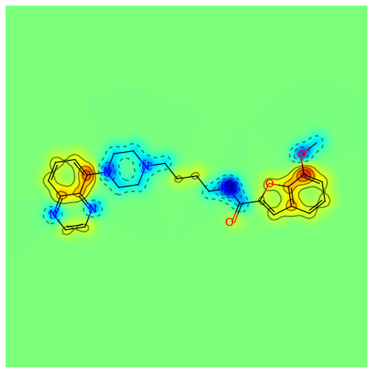
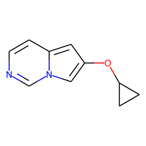

Getting Started with the RDKit in Python
%%%%%%%%%%%%%%%%%%%%%%%%%%%%%%%%%%%%%%%%

What is this?
*************

This document is intended to provide an overview of how one can use
the RDKit functionality from Python.  It's not comprehensive and it's
not a manual.

If you find mistakes, or have suggestions for improvements, please
either fix them yourselves in the source document (the .rst file) or
send them to the mailing list: rdkit-devel@lists.sourceforge.net

Reading and Writing Molecules
*****************************

Reading single molecules
========================

The majority of the basic molecular functionality is found in module :api:`rdkit.Chem`:

>>> from rdkit import Chem

Individual molecules can be constructed using a variety of approaches:

>>> m = Chem.MolFromSmiles('Cc1ccccc1')
>>> m = Chem.MolFromMolFile('data/input.mol')
>>> stringWithMolData=file('data/input.mol','r').read()
>>> m = Chem.MolFromMolBlock(stringWithMolData)

All of these functions return a :api:`rdkit.Chem.rdchem.Mol` object on success:

>>> m
<rdkit.Chem.rdchem.Mol object at 0x...>

or None on failure:

>>> m = Chem.MolFromMolFile('data/invalid.mol')
>>> m is None
True

An attempt is made to provide sensible error messages:

>>> m1 = Chem.MolFromSmiles('CO(C)C')

displays a message like: ``[12:18:01] Explicit valence for atom # 1 O greater than permitted`` and

>>> m2 = Chem.MolFromSmiles('c1cc1')

displays something like: ``[12:20:41] Can't kekulize mol``. In each case the value ``None`` is returned:

>>> m1 is None
True
>>> m2 is None
True

Reading sets of molecules
=========================

Groups of molecules are read using a Supplier (for example, an :api:`rdkit.Chem.rdmolfiles.SDMolSupplier` or a :api:`rdkit.Chem.rdmolfiles.SmilesMolSupplier`):

>>> suppl = Chem.SDMolSupplier('data/5ht3ligs.sdf')
>>> for mol in suppl:
...   print mol.GetNumAtoms()
...
20
24
24
26

You can easily produce lists of molecules from a Supplier:

>>> mols = [x for x in suppl]
>>> len(mols)
4

or just treat the Supplier itself as a random-access object:

>>> suppl[0].GetNumAtoms()
20

A good practice is to test each molecule to see if it was correctly read before working with it: 

>>> suppl = Chem.SDMolSupplier('data/5ht3ligs.sdf')
>>> for mol in suppl:
...   if mol is None: continue
...   print mol.GetNumAtoms()
...
20
24
24
26

An alternate type of Supplier, the :api:`rdkit.Chem.rdmolfiles.ForwardSDMolSupplier` can be used to read from file-like objects:

>>> inf = file('data/5ht3ligs.sdf')
>>> fsuppl = Chem.ForwardSDMolSupplier(inf)
>>> for mol in fsuppl:
...   if mol is None: continue
...   print mol.GetNumAtoms()
...
20
24
24
26

This means that they can be used to read from compressed files:

>>> import gzip
>>> inf = gzip.open('data/actives_5ht3.sdf.gz')
>>> gzsuppl = Chem.ForwardSDMolSupplier(inf)
>>> ms = [x for x in gzsuppl if x is not None]
>>> len(ms)
180

Note that ForwardSDMolSuppliers cannot be used as random-access objects:

>>> fsuppl[0]
Traceback (most recent call last):
  ...
TypeError: 'ForwardSDMolSupplier' object does not support indexing

Writing molecules
=================

Single molecules can be converted to text using several functions present in the :api:`rdkit.Chem` module.

For example, for SMILES:

>>> m = Chem.MolFromMolFile('data/chiral.mol')
>>> Chem.MolToSmiles(m)
'CC(O)c1ccccc1'
>>> Chem.MolToSmiles(m,isomericSmiles=True)
'C[C@H](O)c1ccccc1'

Note that the SMILES provided is canonical, so the output should be the same no matter how a particular molecule is input:

>>> Chem.MolToSmiles(Chem.MolFromSmiles('C1=CC=CN=C1'))
'c1ccncc1'
>>> Chem.MolToSmiles(Chem.MolFromSmiles('c1cccnc1'))
'c1ccncc1'
>>> Chem.MolToSmiles(Chem.MolFromSmiles('n1ccccc1'))
'c1ccncc1'

If you'd like to have the Kekule form of the SMILES, first Kekulize the molecule, then use the “kekuleSmiles” option:

>>> Chem.Kekulize(m)
>>> Chem.MolToSmiles(m,kekuleSmiles=True)
'CC(O)C1=CC=CC=C1'

Note: as of this writing (Aug 2008), the smiles provided when one requests kekuleSmiles are not canonical.
The limitation is not in the SMILES generation, but in the kekulization itself.

MDL Mol blocks are also available:

>>> m2 = Chem.MolFromSmiles('C1CCC1')
>>> print Chem.MolToMolBlock(m2)    # doctest: +NORMALIZE_WHITESPACE
<BLANKLINE>
     RDKit
<BLANKLINE>
  4  4  0  0  0  0  0  0  0  0999 V2000
    0.0000    0.0000    0.0000 C   0  0  0  0  0  0  0  0  0  0  0  0
    0.0000    0.0000    0.0000 C   0  0  0  0  0  0  0  0  0  0  0  0
    0.0000    0.0000    0.0000 C   0  0  0  0  0  0  0  0  0  0  0  0
    0.0000    0.0000    0.0000 C   0  0  0  0  0  0  0  0  0  0  0  0
  1  2  1  0
  2  3  1  0
  3  4  1  0
  4  1  1  0
M  END
<BLANKLINE>

To include names in the mol blocks, set the molecule's “_Name” property:

>>> m2.SetProp("_Name","cyclobutane")
>>> print Chem.MolToMolBlock(m2)     # doctest: +NORMALIZE_WHITESPACE
cyclobutane
     RDKit          
<BLANKLINE>
  4  4  0  0  0  0  0  0  0  0999 V2000
    0.0000    0.0000    0.0000 C   0  0  0  0  0  0  0  0  0  0  0  0
    0.0000    0.0000    0.0000 C   0  0  0  0  0  0  0  0  0  0  0  0
    0.0000    0.0000    0.0000 C   0  0  0  0  0  0  0  0  0  0  0  0
    0.0000    0.0000    0.0000 C   0  0  0  0  0  0  0  0  0  0  0  0
  1  2  1  0
  2  3  1  0
  3  4  1  0
  4  1  1  0
M  END
<BLANKLINE>

It's usually preferable to have a depiction in the Mol block, this can
be generated using functionality in the :api:`rdkit.Chem.AllChem`
module (see the `Chem vs AllChem`_ section for more information).  

You can either include 2D coordinates (i.e. a depiction):

>>> from rdkit.Chem import AllChem
>>> AllChem.Compute2DCoords(m2)
0
>>> print Chem.MolToMolBlock(m2)     # doctest: +NORMALIZE_WHITESPACE
cyclobutane 
     RDKit          2D 
<BLANKLINE>
  4  4  0  0  0  0  0  0  0  0999 V2000 
    1.0607   -0.0000    0.0000 C   0  0  0  0  0  0  0  0  0  0  0  0 
   -0.0000   -1.0607    0.0000 C   0  0  0  0  0  0  0  0  0  0  0  0 
   -1.0607    0.0000    0.0000 C   0  0  0  0  0  0  0  0  0  0  0  0 
    0.0000    1.0607    0.0000 C   0  0  0  0  0  0  0  0  0  0  0  0 
  1  2  1  0 
  2  3  1  0 
  3  4  1  0 
  4  1  1  0 
M  END
<BLANKLINE>

Or you can add 3D coordinates by embedding the molecule:

>>> AllChem.EmbedMolecule(m2)
0
>>> AllChem.UFFOptimizeMolecule(m2)
0
>>> print Chem.MolToMolBlock(m2)    # doctest: +NORMALIZE_WHITESPACE
cyclobutane
     RDKit          3D
<BLANKLINE>
  4  4  0  0  0  0  0  0  0  0999 V2000
   -0.7883    0.5560   -0.2718 C   0  0  0  0  0  0  0  0  0  0  0  0
   -0.4153   -0.9091   -0.1911 C   0  0  0  0  0  0  0  0  0  0  0  0
    0.7883   -0.5560    0.6568 C   0  0  0  0  0  0  0  0  0  0  0  0
    0.4153    0.9091    0.5762 C   0  0  0  0  0  0  0  0  0  0  0  0
  1  2  1  0
  2  3  1  0
  3  4  1  0
  4  1  1  0
M  END
<BLANKLINE>

The optimization step isn't necessary, but it substantially improves the quality of the conformation.

To get good conformations, it's almost always a good idea to add hydrogens to the molecule first:

>>> m3 = Chem.AddHs(m2)
>>> AllChem.EmbedMolecule(m3)
0
>>> AllChem.UFFOptimizeMolecule(m3)
0

These can then be removed:

>>> m3 = Chem.RemoveHs(m3)
>>> print Chem.MolToMolBlock(m3)    # doctest: +NORMALIZE_WHITESPACE
cyclobutane
     RDKit          3D
<BLANKLINE>
  4  4  0  0  0  0  0  0  0  0999 V2000
    0.2851    1.0372   -0.0171 C   0  0  0  0  0  0  0  0  0  0  0  0
    1.0352   -0.2833    0.0743 C   0  0  0  0  0  0  0  0  0  0  0  0
   -0.2851   -1.0372    0.0171 C   0  0  0  0  0  0  0  0  0  0  0  0
   -1.0352    0.2833   -0.0743 C   0  0  0  0  0  0  0  0  0  0  0  0
  1  2  1  0
  2  3  1  0
  3  4  1  0
  4  1  1  0
M  END
<BLANKLINE>

If you'd like to write the molecules to a file, use Python file objects:

>>> print >>file('data/foo.mol','w+'),Chem.MolToMolBlock(m2)
>>>

Writing sets of molecules
=========================

Multiple molecules can be written to a file using an :api:`rdkit.Chem.rdmolfiles.SDWriter` object:

>>> w = Chem.SDWriter('data/foo.sdf')
>>> for m in mols: w.write(m)
...
>>>

An SDWriter can also be initialized using a file-like object:

>>> from StringIO import StringIO
>>> sio = StringIO()
>>> w = Chem.SDWriter(sio)
>>> for m in mols: w.write(m)
...
>>> w.flush()
>>> print sio.getvalue()
mol-295
     RDKit          3D
<BLANKLINE>
 20 22  0  0  1  0  0  0  0  0999 V2000
    2.3200    0.0800   -0.1000 C   0  0  0  0  0  0  0  0  0  0  0  0
    1.8400   -1.2200    0.1200 C   0  0  0  0  0  0  0  0  0  0  0  0
...
  1  3  1  0
  1  4  1  0
  2  5  1  0
M  END
$$$$
<BLANKLINE>

Other available Writers include the :api:`rdkit.Chem.rdmolfiles.SmilesWriter` and the :api:`rdkit.Chem.rdmolfiles.TDTWriter`.

Working with Molecules
**********************

Looping over Atoms and Bonds
============================

Once you have a molecule, it's easy to loop over its atoms and bonds:

>>> m = Chem.MolFromSmiles('C1OC1')
>>> for atom in m.GetAtoms():
...   print atom.GetAtomicNum()
...
6
8
6
>>> print m.GetBonds()[0].GetBondType()
SINGLE

You can also request individual bonds or atoms:

>>> m.GetAtomWithIdx(0).GetSymbol()
'C'
>>> m.GetAtomWithIdx(0).GetExplicitValence()
2
>>> m.GetBondWithIdx(0).GetBeginAtomIdx()
0
>>> m.GetBondWithIdx(0).GetEndAtomIdx()
1
>>> m.GetBondBetweenAtoms(0,1).GetBondType()
rdkit.Chem.rdchem.BondType.SINGLE

Atoms keep track of their neighbors:

>>> atom = m.GetAtomWithIdx(0)
>>> [x.GetAtomicNum() for x in atom.GetNeighbors()]
[8, 6]
>>> len(x.GetBonds())
2

Ring Information
================

Atoms and bonds both carry information about the molecule's rings:

>>> m = Chem.MolFromSmiles('OC1C2C1CC2')
>>> m.GetAtomWithIdx(0).IsInRing()
False
>>> m.GetAtomWithIdx(1).IsInRing()
True
>>> m.GetAtomWithIdx(2).IsInRingSize(3)
True
>>> m.GetAtomWithIdx(2).IsInRingSize(4)
True
>>> m.GetAtomWithIdx(2).IsInRingSize(5)
False
>>> m.GetBondWithIdx(1).IsInRingSize(3)
True
>>> m.GetBondWithIdx(1).IsInRing()
True

But note that the information is only about the smallest rings:

>>> m.GetAtomWithIdx(1).IsInRingSize(5)
False

More detail about the smallest set of smallest rings (SSSR) is available:

>>> ssr = Chem.GetSymmSSSR(m)
>>> len(ssr)
2
>>> list(ssr[0])
[1, 2, 3]
>>> list(ssr[1])
[4, 5, 2, 3]

As the name indicates, this is a symmetrized SSSR; if you are interested in the number of “true” SSSR, use the GetSSSR function.

>>> Chem.GetSSSR(m)
2

The distinction between symmetrized and non-symmetrized SSSR is discussed in more detail below in the section `The SSSR Problem`_.

For more efficient queries about a molecule's ring systems (avoiding repeated calls to Mol.GetAtomWithIdx), use the :api:`rdkit.Chem.rdchem.RingInfo` class:

>>> m = Chem.MolFromSmiles('OC1C2C1CC2') 
>>> ri = m.GetRingInfo() 
>>> ri.NumAtomRings(0) 
0 
>>> ri.NumAtomRings(1) 
1 
>>> ri.NumAtomRings(2) 
2 
>>> ri.IsAtomInRingOfSize(1,3) 
True 
>>> ri.IsBondInRingOfSize(1,3) 
True 

Modifying molecules
===================

Normally molecules are stored in the RDKit with the hydrogen atoms implicit (e.g. not explicitly present in the molecular graph.
When it is useful to have the hydrogens explicitly present, for example when generating or optimizing the 3D geometry, the :api:`rdkit.Chem.rdmolops.AddHs` function can be used:

>>> m=Chem.MolFromSmiles('CCO')
>>> m.GetNumAtoms()
3
>>> m2 = Chem.AddHs(m)
>>> m2.GetNumAtoms()
9

The Hs can be removed again using the :api:`rdkit.Chem.rdmolops.RemoveHs` function:

>>> m3 = Chem.RemoveHs(m2)
>>> m3.GetNumAtoms()
3

RDKit molecules are usually stored with the bonds in aromatic rings having aromatic bond types.
This can be changed with the :api:`rdkit.Chem.rdmolops.Kekulize` function:

>>> m = Chem.MolFromSmiles('c1ccccc1')
>>> m.GetBondWithIdx(0).GetBondType()
rdkit.Chem.rdchem.BondType.AROMATIC
>>> Chem.Kekulize(m)
>>> m.GetBondWithIdx(0).GetBondType()
rdkit.Chem.rdchem.BondType.DOUBLE
>>> m.GetBondWithIdx(1).GetBondType()
rdkit.Chem.rdchem.BondType.SINGLE

The bonds are still marked as being aromatic:

>>> m.GetBondWithIdx(1).GetIsAromatic()
True

and can be restored to the aromatic bond type using the :api:`rdkit.Chem.rdmolops.SanitizeMol` function:

>>> Chem.SanitizeMol(m)
rdkit.Chem.rdmolops.SanitizeFlags.SANITIZE_NONE
>>> m.GetBondWithIdx(0).GetBondType()
rdkit.Chem.rdchem.BondType.AROMATIC

The value returned by `SanitizeMol()` indicates that no problems were encountered.

Working with 2D molecules: Generating Depictions
================================================

The RDKit has a library for generating depictions (sets of 2D) coordinates for molecules.
This library, which is part of the AllChem module, is accessed using the :api:`rdkit.Chem.rdDepictor.Compute2DCoords` function:

>>> m = Chem.MolFromSmiles('c1nccc2n1ccc2')
>>> AllChem.Compute2DCoords(m)
0

The 2D conformation is constructed in a canonical orientation and is
built to minimize intramolecular clashes, i.e. to maximize the clarity
of the drawing.

If you have a set of molecules that share a common template and you'd
like to align them to that template, you can do so as follows:

>>> template = Chem.MolFromSmiles('c1nccc2n1ccc2')
>>> AllChem.Compute2DCoords(template)
0
>>> AllChem.GenerateDepictionMatching2DStructure(m,template)

Running this process for a couple of other molecules gives the
following depictions:

+---------------+---------------+---------------+
| |picture_1|   | |picture_0|   | |picture_3|   |
+---------------+---------------+---------------+

Another option for Compute2DCoords allows you to generate 2D depictions for molecules that closely mimic 3D conformations.
This is available using the function :api:`rdkit.Chem.AllChem.GenerateDepictionMatching3DStructure`.

Here is an illustration of the results using the ligand from PDB structure 1XP0:

+---------------+---------------+
| |picture_2|   | |picture_4|   |
+---------------+---------------+

More fine-grained control can be obtained using the core function
:api:`rdkit.Chem.rdDepictor.Compute2DCoordsMimicDistmat`, but that is
beyond the scope of this document.  See the implementation of
GenerateDepictionMatching3DStructure in AllChem.py for an example of
how it is used.

Working with 3D Molecules
=========================

The RDKit can generate conformations for molecules using distance geometry. [#blaney]_
The algorithm followed is:

1. The molecule's distance bounds matrix is calculated based on the connection table and a set of rules.

2. The bounds matrix is smoothed using a triangle-bounds smoothing algorithm.

3. A random distance matrix that satisfies the bounds matrix is generated.

4. This distance matrix is embedded in 3D dimensions (producing coordinates for each atom).

5. The resulting coordinates are cleaned up somewhat using a crude force field and the bounds matrix.

Multiple conformations can be generated by repeating steps 4 and 5 several times, using a different random distance matrix each time.

Note that the conformations that result from this procedure tend to be fairly ugly.
They should be cleaned up using a force field.
This can be done within the RDKit using its implementation of the Universal Force Field (UFF). [#rappe]_

The full process of embedding and optimizing a molecule is easier than all the above verbiage makes it sound:

>>> m = Chem.MolFromSmiles('C1CCC1OC')
>>> m2=Chem.AddHs(m)
>>> AllChem.EmbedMolecule(m2)
0
>>> AllChem.UFFOptimizeMolecule(m2)
0

The RDKit also has an implementation of the MMFF94 force field available. [#mmff1]_, [#mmff2]_, [#mmff3]_, [#mmff4]_, [#mmffs]_
Please note that the MMFF atom typing code uses its own aromaticity model,
so the aromaticity flags of the molecule will be modified after calling
MMFF-related methods.

>>> m = Chem.MolFromSmiles('C1CCC1OC')
>>> m2=Chem.AddHs(m)
>>> AllChem.EmbedMolecule(m2)
0
>>> AllChem.MMFFOptimizeMolecule(m2)
0

Note the calls to `Chem.AddHs()` in the examples above. By default RDKit molecules do not have H atoms explicity present in the graph, but they are important for getting realistic geometries, so they generally should be added. 

With the RDKit, also multiple conformers can be generated. The option numConfs allows the user to set the number of conformers that should be generated.
These conformers can be aligned to each other and the RMS values calculated.

>>> m = Chem.MolFromSmiles('C1CCC1OC')
>>> m2=Chem.AddHs(m)
>>> cids = AllChem.EmbedMultipleConfs(m2, numConfs=10)
>>> print len(cids)
10
>>> for cid in cids:
...    _ = AllChem.MMFFOptimizeMolecule(m2, confId=cid)
>>> rmslist = []
>>> AllChem.AlignMolConformers(m2, RMSlist=rmslist)
>>> print len(rmslist)
9

rmslist contains the RMS values between the first conformer and all others.
The RMS between two specific conformers (e.g. 1 and 9) can also be calculated. The flag prealigned lets the user specify if the conformers are already aligned (by default, the function aligns them).

>>> rms = AllChem.GetConformerRMS(m2, 1, 9, prealigned=True)

More 3D functionality of the RDKit is described in the Cookbook.

*Disclaimer/Warning*: Conformation generation is a difficult and subtle task.
The 2D->3D conversion provided within the RDKit is not intended to be a replacement for a “real” conformational analysis tool; it merely provides quick 3D structures for cases when they are required.

Preserving Molecules
====================

Molecules can be converted to and from text using Python's pickling machinery:

>>> m = Chem.MolFromSmiles('c1ccncc1')
>>> import cPickle
>>> pkl = cPickle.dumps(m)
>>> type(pkl)
<type 'str'>
>>> m2=cPickle.loads(pkl)
>>> Chem.MolToSmiles(m2)
'c1ccncc1'

The RDKit pickle format is fairly compact and it is much, much faster to build a molecule from a pickle than from a Mol file or SMILES string, so storing molecules you will be working with repeatedly as pickles can be a good idea.

The raw binary data that is encapsulated in a pickle can also be directly obtained from a molecule:

>>> binStr = m.ToBinary()

This can be used to reconstruct molecules using the Chem.Mol constructor:

>>> m2 = Chem.Mol(binStr)
>>> Chem.MolToSmiles(m2)
'c1ccncc1'
>>> len(binStr)
123
>>> len(pkl)
475

Note that this huge difference in text length is because we didn't tell python to use its most efficient representation of the pickle:

>>> pkl = cPickle.dumps(m,2)
>>> len(pkl)
157

The small overhead associated with python's pickling machinery normally doesn't end up making much of a difference for collections of larger molecules (the extra data associated with the pickle is independent of the size of the molecule, while the binary string increases in length as the molecule gets larger).

*Tip*: The performance difference associated with storing molecules in a pickled form on disk instead of constantly reparsing an SD file or SMILES table is difficult to overstate.
In a test I just ran on my laptop, loading a set of 699 drug-like molecules from an SD file took 10.8 seconds; loading the same molecules from a pickle file took 0.7 seconds.
The pickle file is also smaller – 1/3 the size of the SD file – but this difference is not always so dramatic (it's a particularly fat SD file).

Drawing Molecules
=================

The RDKit has some built-in functionality for creating images from
molecules found in the :api:`rdkit.Chem.Draw` package:

>>> suppl = Chem.SDMolSupplier('data/cdk2.sdf')
>>> ms = [x for x in suppl if x is not None]
>>> for m in ms: tmp=AllChem.Compute2DCoords(m)
>>> from rdkit.Chem import Draw
>>> Draw.MolToFile(ms[0],'images/cdk2_mol1.png')
>>> Draw.MolToFile(ms[1],'images/cdk2_mol2.png')

Producing these images:

+----------------------------------+----------------------------------+
| .. image:: images/cdk2_mol1.png  | .. image:: images/cdk2_mol2.png  | 
+----------------------------------+----------------------------------+

It's also possible to produce an image grid out of a set of molecules:

>>> img=Draw.MolsToGridImage(ms[:8],molsPerRow=4,subImgSize=(200,200),legends=[x.GetProp("_Name") for x in ms[:8]])

This returns a PIL image, which can then be saved to a file:

>>> img.save('images/cdk2_molgrid.png')

The result looks like this:

.. image:: images/cdk2_molgrid.png

These would of course look better if the common core were
aligned. This is easy enough to do:

>>> p = Chem.MolFromSmiles('[nH]1cnc2cncnc21')
>>> subms = [x for x in ms if x.HasSubstructMatch(p)]
>>> len(subms)
14
>>> AllChem.Compute2DCoords(p)
0
>>> for m in subms: AllChem.GenerateDepictionMatching2DStructure(m,p)
>>> img=Draw.MolsToGridImage(subms,molsPerRow=4,subImgSize=(200,200),legends=[x.GetProp("_Name") for x in subms])
>>> img.save('images/cdk2_molgrid.aligned.png')

The result looks like this:

.. image:: images/cdk2_molgrid_aligned.png

Substructure Searching
**********************

Substructure matching can be done using query molecules built from SMARTS:

>>> m = Chem.MolFromSmiles('c1ccccc1O')
>>> patt = Chem.MolFromSmarts('ccO')
>>> m.HasSubstructMatch(patt)
True
>>> m.GetSubstructMatch(patt)
(0, 5, 6) 

Those are the atom indices in ``m``, ordered as ``patt``'s atoms. To get all of the matches:

>>> m.GetSubstructMatches(patt)
((0, 5, 6), (4, 5, 6)) 

This can be used to easily filter lists of molecules:

>>> suppl = Chem.SDMolSupplier('data/actives_5ht3.sdf')
>>> patt = Chem.MolFromSmarts('c[NH1]')
>>> matches = []
>>> for mol in suppl:
...   if mol.HasSubstructMatch(patt):
...     matches.append(mol)
...
>>> len(matches)
22

We can write the same thing more compactly using Python's list comprehension syntax:

>>> matches = [x for x in suppl if x.HasSubstructMatch(patt)]
>>> len(matches)
22

Substructure matching can also be done using molecules built from SMILES instead of SMARTS:

>>> m = Chem.MolFromSmiles('C1=CC=CC=C1OC')
>>> m.HasSubstructMatch(Chem.MolFromSmarts('CO'))
True
>>> m.HasSubstructMatch(Chem.MolFromSmiles('CO'))
True

But don't forget that the semantics of the two languages are not exactly equivalent:

>>> m.HasSubstructMatch(Chem.MolFromSmiles('COC'))
True
>>> m.HasSubstructMatch(Chem.MolFromSmarts('COC'))
False
>>> m.HasSubstructMatch(Chem.MolFromSmarts('COc')) #<- need an aromatic C
True

Stereochemistry in substructure matches
=======================================

By default information about stereochemistry is not used in
substructure searches:

>>> m = Chem.MolFromSmiles('CC[C@H](F)Cl')
>>> m.HasSubstructMatch(Chem.MolFromSmiles('C[C@H](F)Cl'))
True
>>> m.HasSubstructMatch(Chem.MolFromSmiles('C[C@@H](F)Cl'))
True
>>> m.HasSubstructMatch(Chem.MolFromSmiles('CC(F)Cl'))
True

But this can be changed via the `useChirality` argument:

>>> m.HasSubstructMatch(Chem.MolFromSmiles('C[C@H](F)Cl'),useChirality=True)
True
>>> m.HasSubstructMatch(Chem.MolFromSmiles('C[C@@H](F)Cl'),useChirality=True)
False
>>> m.HasSubstructMatch(Chem.MolFromSmiles('CC(F)Cl'),useChirality=True)
True

Notice that when `useChirality` is set a non-chiral query **does** match a chiral
molecule. The same is not true for a chiral query and a non-chiral molecule:

>>> m.HasSubstructMatch(Chem.MolFromSmiles('CC(F)Cl'))
True
>>> m2 = Chem.MolFromSmiles('CCC(F)Cl')
>>> m2.HasSubstructMatch(Chem.MolFromSmiles('C[C@H](F)Cl'),useChirality=True)
False

Chemical Transformations
************************

The RDKit contains a number of functions for modifying molecules. Note
that these transformation functions are intended to provide an easy
way to make simple modifications to molecules. 
For more complex transformations, use the `Chemical Reactions`_ functionality.

Substructure-based transformations
==================================

There's a variety of functionality for using the RDKit's
substructure-matching machinery for doing quick molecular transformations.
These transformations include deleting substructures:

>>> m = Chem.MolFromSmiles('CC(=O)O')
>>> patt = Chem.MolFromSmarts('C(=O)[OH]')
>>> rm = AllChem.DeleteSubstructs(m,patt)
>>> Chem.MolToSmiles(rm)
'C'

replacing substructures:

>>> repl = Chem.MolFromSmiles('OC')
>>> patt = Chem.MolFromSmarts('[$(NC(=O))]')
>>> m = Chem.MolFromSmiles('CC(=O)N')
>>> rms = AllChem.ReplaceSubstructs(m,patt,repl)
>>> rms
(<rdkit.Chem.rdchem.Mol object at 0x...>,)
>>> Chem.MolToSmiles(rms[0])
'COC(C)=O'

as well as simple SAR-table transformations like removing side chains:

>>> m1 = Chem.MolFromSmiles('BrCCc1cncnc1C(=O)O')
>>> core = Chem.MolFromSmiles('c1cncnc1')
>>> tmp = Chem.ReplaceSidechains(m1,core)
>>> Chem.MolToSmiles(tmp)
'[*]c1cncnc1[*]' 

and removing cores:

>>> tmp = Chem.ReplaceCore(m1,core)
>>> Chem.MolToSmiles(tmp)
'[*]C(=O)O.[*]CCBr' 

To get more detail about the sidechains (e.g. sidechain labels), use isomeric smiles:

>>> Chem.MolToSmiles(tmp,True)
'[1*]CCBr.[2*]C(=O)O' 

By default the sidechains are labeled based on the order they are found.
They can also be labeled according by the number of that core-atom they're attached to:

>>> m1 = Chem.MolFromSmiles('c1c(CCO)ncnc1C(=O)O')
>>> tmp=Chem.ReplaceCore(m1,core,labelByIndex=True)
>>> Chem.MolToSmiles(tmp,True)
'[1*]CCO.[5*]C(=O)O'

:api:`rdkit.Chem.rdmolops.ReplaceCore` returns the sidechains in a single molecule.
This can be split into separate molecules using :api:`rdkit.Chem.rdmolops.GetMolFrags` :

>>> rs = Chem.GetMolFrags(tmp,asMols=True)
>>> len(rs)
2
>>> Chem.MolToSmiles(rs[0],True)
'[1*]CCO'
>>> Chem.MolToSmiles(rs[1],True)
'[5*]C(=O)O'

Murcko Decomposition
====================

The RDKit provides standard Murcko-type decomposition [#bemis1]_ of molecules
into scaffolds:

>>> from rdkit.Chem.Scaffolds import MurckoScaffold
>>> cdk2mols = Chem.SDMolSupplier('data/cdk2.sdf')
>>> m1 = cdk2mols[0]
>>> core = MurckoScaffold.GetScaffoldForMol(m1)
>>> Chem.MolToSmiles(core)
'c1ncc2nc[nH]c2n1'

or into a generic framework:

>>> fw = MurckoScaffold.MakeScaffoldGeneric(core)
>>> Chem.MolToSmiles(fw)
'C1CCC2CCCC2C1'

Maximum Common Substructure
***************************************

The FindMCS function find a maximum common substructure (MCS) of two
or more molecules:

>>> from rdkit.Chem import rdFMCS
>>> mol1 = Chem.MolFromSmiles("O=C(NCc1cc(OC)c(O)cc1)CCCC/C=C/C(C)C")
>>> mol2 = Chem.MolFromSmiles("CC(C)CCCCCC(=O)NCC1=CC(=C(C=C1)O)OC")
>>> mol3 = Chem.MolFromSmiles("c1(C=O)cc(OC)c(O)cc1")
>>> mols = [mol1,mol2,mol3]
>>> res=rdFMCS.FindMCS(mols)
>>> res
<rdkit.Chem.rdFMCS.MCSResult object at 0x...>
>>> res.numAtoms
10
>>> res.numBonds
10
>>> res.smartsString
'[#6]1(-[#6]):[#6]:[#6](-[#8]-[#6]):[#6](:[#6]:[#6]:1)-[#8]'
>>> res.canceled
False

It returns an MCSResult instance with information about the number of
atoms and bonds in the MCS, the SMARTS string which matches the
identified MCS, and a flag saying if the algorithm timed out. If no
MCS is found then the number of atoms and bonds is set to 0 and the
SMARTS to ``''``.

By default, two atoms match if they are the same element and two bonds
match if they have the same bond type. Specify ``atomCompare`` and
``bondCompare`` to use different comparison functions, as in:
    
>>> mols = (Chem.MolFromSmiles('NCC'),Chem.MolFromSmiles('OC=C'))
>>> rdFMCS.FindMCS(mols).smartsString
''
>>> rdFMCS.FindMCS(mols, atomCompare=rdFMCS.AtomCompare.CompareAny).smartsString
'[#7,#8]-[#6]'
>>> rdFMCS.FindMCS(mols, bondCompare=rdFMCS.BondCompare.CompareAny).smartsString
'[#6]-,=[#6]'

The options for the atomCompare argument are: CompareAny says that any
atom matches any other atom, CompareElements compares by element type,
and CompareIsotopes matches based on the isotope label. Isotope labels
can be used to implement user-defined atom types. A bondCompare of
CompareAny says that any bond matches any other bond, CompareOrderExact says
bonds are equivalent if and only if they have the same bond type, and
CompareOrder allows single and aromatic bonds to match each other, but
requires an exact order match otherwise:

>>> mols = (Chem.MolFromSmiles('c1ccccc1'),Chem.MolFromSmiles('C1CCCC=C1'))
>>> rdFMCS.FindMCS(mols,bondCompare=rdFMCS.BondCompare.CompareAny).smartsString
'[#6]1:,-[#6]:,-[#6]:,-[#6]:,-[#6]:,=[#6]:,-1'
>>> rdFMCS.FindMCS(mols,bondCompare=rdFMCS.BondCompare.CompareOrderExact).smartsString
''
>>> rdFMCS.FindMCS(mols,bondCompare=rdFMCS.BondCompare.CompareOrder).smartsString
'[#6](:,-[#6]:,-[#6]:,-[#6]):,-[#6]:,-[#6]'

A substructure has both atoms and bonds. By default, the algorithm
attempts to maximize the number of bonds found. You can change this by
setting the ``maximizeBonds`` argument to False.
Maximizing the number of bonds tends to maximize the number of rings,
although two small rings may have fewer bonds than one large ring.

You might not want a 3-valent nitrogen to match one which is 5-valent.
The default ``matchValences`` value of False ignores valence
information.  When True, the atomCompare setting is modified to also
require that the two atoms have the same valency.

>>> mols = (Chem.MolFromSmiles('NC1OC1'),Chem.MolFromSmiles('C1OC1[N+](=O)[O-]'))
>>> rdFMCS.FindMCS(mols).numAtoms
4
>>> rdFMCS.FindMCS(mols, matchValences=True).numBonds
3

It can be strange to see a linear carbon chain match a carbon ring,
which is what the ``ringMatchesRingOnly`` default of False does. If
you set it to True then ring bonds will only match ring bonds.

>>> mols = [Chem.MolFromSmiles("C1CCC1CCC"), Chem.MolFromSmiles("C1CCCCCC1")]
>>> rdFMCS.FindMCS(mols).smartsString
'[#6](-[#6]-[#6])-[#6]-[#6]-[#6]-[#6]'
>>> rdFMCS.FindMCS(mols, ringMatchesRingOnly=True).smartsString
'[#6](-[#6]-[#6])-[#6]'

You can further restrict things and require that partial rings (as in
this case) are not allowed. That is, if an atom is part of the MCS and
the atom is in a ring of the entire molecule then that atom is also in
a ring of the MCS. Set ``completeRingsOnly`` to True to toggle this
requirement and also sets ringMatchesRingOnly to True.

>>> mols = [Chem.MolFromSmiles("CCC1CC2C1CN2"), Chem.MolFromSmiles("C1CC2C1CC2")]
>>> rdFMCS.FindMCS(mols).smartsString
'[#6]1-[#6]-[#6](-[#6]-1-[#6])-[#6]'
>>> rdFMCS.FindMCS(mols, ringMatchesRingOnly=True).smartsString
'[#6](-[#6]-[#6]-[#6]-[#6])-[#6]'
>>> rdFMCS.FindMCS(mols, completeRingsOnly=True).smartsString
'[#6]1-[#6]-[#6]-[#6]-1'

The MCS algorithm will exhaustively search for a maximum common substructure.
Typically this takes a fraction of a second, but for some comparisons this
can take minutes or longer. Use the ``timeout`` parameter to stop the search
after the given number of seconds (wall-clock seconds, not CPU seconds) and
return the best match found in that time. If timeout is reached then the
``canceled`` property of the MCSResult will be True instead of False.

>>> mols = [Chem.MolFromSmiles("Nc1ccccc1"*100), Chem.MolFromSmiles("Nc1ccccccccc1"*100)]
>>> rdFMCS.FindMCS(mols, timeout=1).canceled
True

(The MCS after 50 seconds contained 511 atoms.)

Fingerprinting and Molecular Similarity
***************************************

The RDKit has a variety of built-in functionality for generating molecular fingerprints and using them to calculate molecular similarity.

Topological Fingerprints
========================

>>> from rdkit import DataStructs
>>> from rdkit.Chem.Fingerprints import FingerprintMols
>>> ms = [Chem.MolFromSmiles('CCOC'), Chem.MolFromSmiles('CCO'),
... Chem.MolFromSmiles('COC')]
>>> fps = [FingerprintMols.FingerprintMol(x) for x in ms]
>>> DataStructs.FingerprintSimilarity(fps[0],fps[1])
0.6...
>>> DataStructs.FingerprintSimilarity(fps[0],fps[2])
0.4...
>>> DataStructs.FingerprintSimilarity(fps[1],fps[2])
0.25

The fingerprinting algorithm used is similar to that used in the
Daylight fingerprinter: it identifies and hashes topological paths
(e.g. along bonds) in the molecule and then uses them to set bits in a
fingerprint of user-specified lengths. After all paths have been identified, the fingerprint is typically folded down until a particular density of set bits is obtained.

The default set of parameters used by the fingerprinter is:
- minimum path size: 1 bond
- maximum path size: 7 bonds
- fingerprint size: 2048 bits
- number of bits set per hash: 2
- minimum fingerprint size: 64 bits
- target on-bit density 0.3

You can control these by calling
:api:`rdkit.Chem.rdmolops.RDKFingerprint` directly; this will return
an unfolded fingerprint that you can then fold to the desired density.
The function
:api:`rdkit.Chem.Fingerprints.FingerprintMols.FingerprintMol` (written
in python) shows how this is done.

The default similarity metric used by
:api:`rdkit.DataStructs.FingerprintSimilarity` is the Tanimoto
similarity.  One can use different similarity metrics:

>>> DataStructs.FingerprintSimilarity(fps[0],fps[1], metric=DataStructs.DiceSimilarity)
0.75

Available similarity metrics include Tanimoto, Dice, Cosine, Sokal, Russel, Kulczynski, McConnaughey, and Tversky.

MACCS Keys
==========

There is a SMARTS-based implementation of the 166 public MACCS keys.

>>> from rdkit.Chem import MACCSkeys
>>> fps = [MACCSkeys.GenMACCSKeys(x) for x in ms]
>>> DataStructs.FingerprintSimilarity(fps[0],fps[1])
0.5
>>> DataStructs.FingerprintSimilarity(fps[0],fps[2])
0.538...
>>> DataStructs.FingerprintSimilarity(fps[1],fps[2])
0.214...

The MACCS keys were critically evaluated and compared to other MACCS implementations in Q3 2008. In cases where the public keys are fully defined, things looked pretty good.

Atom Pairs and Topological Torsions
===================================

Atom-pair descriptors [#carhart]_ are available in several different forms.
The standard form is as fingerprint including counts for each bit instead of just zeros and ones:

>>> from rdkit.Chem.AtomPairs import Pairs
>>> ms = [Chem.MolFromSmiles('C1CCC1OCC'),Chem.MolFromSmiles('CC(C)OCC'),Chem.MolFromSmiles('CCOCC')]
>>> pairFps = [Pairs.GetAtomPairFingerprint(x) for x in ms]

Because the space of bits that can be included in atom-pair fingerprints is huge, they are stored in a sparse manner.
We can get the list of bits and their counts for each fingerprint as a dictionary:

>>> d = pairFps[-1].GetNonzeroElements()
>>> d[541732]
1
>>> d[1606690]
2

Descriptions of the bits are also available:

>>> Pairs.ExplainPairScore(558115)
(('C', 1, 0), 3, ('C', 2, 0)) 

The above means: C with 1 neighbor and 0 pi electrons which is 3 bonds
from a C with 2 neighbors and 0 pi electrons

The usual metric for similarity between atom-pair fingerprints is Dice similarity:

>>> from rdkit import DataStructs
>>> DataStructs.DiceSimilarity(pairFps[0],pairFps[1])
0.333...
>>> DataStructs.DiceSimilarity(pairFps[0],pairFps[2])
0.258...
>>> DataStructs.DiceSimilarity(pairFps[1],pairFps[2])
0.56

It's also possible to get atom-pair descriptors encoded as a standard
bit vector fingerprint (ignoring the count information):

>>> pairFps = [Pairs.GetAtomPairFingerprintAsBitVect(x) for x in ms]

Since these are standard bit vectors, the :api:`rdkit.DataStructs`
module can be used for similarity:

>>> from rdkit import DataStructs
>>> DataStructs.DiceSimilarity(pairFps[0],pairFps[1])
0.48
>>> DataStructs.DiceSimilarity(pairFps[0],pairFps[2])
0.380...
>>> DataStructs.DiceSimilarity(pairFps[1],pairFps[2])
0.625

Topological torsion descriptors [#nilakantan]_ are calculated in
essentially the same way:

>>> from rdkit.Chem.AtomPairs import Torsions
>>> tts = [Torsions.GetTopologicalTorsionFingerprintAsIntVect(x) for x in ms]
>>> DataStructs.DiceSimilarity(tts[0],tts[1])
0.166...

At the time of this writing, topological torsion fingerprints have too many bits to be encodeable using the BitVector machinery, so there is no GetTopologicalTorsionFingerprintAsBitVect function.

Morgan Fingerprints (Circular Fingerprints)
===========================================

This family of fingerprints, better known as circular fingerprints
[#rogers]_, is built by applying the Morgan algorithm to a set of
user-supplied atom invariants.  When generating Morgan fingerprints,
the radius of the fingerprint must also be provided :

>>> from rdkit.Chem import AllChem
>>> m1 = Chem.MolFromSmiles('Cc1ccccc1')
>>> fp1 = AllChem.GetMorganFingerprint(m1,2)
>>> fp1
<rdkit.DataStructs.cDataStructs.UIntSparseIntVect object at 0x...>
>>> m2 = Chem.MolFromSmiles('Cc1ncccc1')
>>> fp2 = AllChem.GetMorganFingerprint(m2,2)
>>> DataStructs.DiceSimilarity(fp1,fp2)
0.55...

Morgan fingerprints, like atom pairs and topological torsions, use
counts by default, but it's also possible to calculate them as bit
vectors:

>>> fp1 = AllChem.GetMorganFingerprintAsBitVect(m1,2,nBits=1024) 
>>> fp1 
<rdkit.DataStructs.cDataStructs.ExplicitBitVect object at 0x...> 
>>> fp2 = AllChem.GetMorganFingerprintAsBitVect(m2,2,nBits=1024) 
>>> DataStructs.DiceSimilarity(fp1,fp2) 
0.51... 

The default atom invariants use connectivity information similar to
those used for the well known ECFP family of fingerprints.
Feature-based invariants, similar to those used for the FCFP
fingerprints, can also be used. The feature definitions used are
defined in the section `Feature Definitions Used in the Morgan
Fingerprints`_.  At times this can lead to quite different similarity
scores:

>>> m1 = Chem.MolFromSmiles('c1ccccn1')
>>> m2 = Chem.MolFromSmiles('c1ccco1')
>>> fp1 = AllChem.GetMorganFingerprint(m1,2)
>>> fp2 = AllChem.GetMorganFingerprint(m2,2)
>>> ffp1 = AllChem.GetMorganFingerprint(m1,2,useFeatures=True)
>>> ffp2 = AllChem.GetMorganFingerprint(m2,2,useFeatures=True)
>>> DataStructs.DiceSimilarity(fp1,fp2)
0.36...
>>> DataStructs.DiceSimilarity(ffp1,ffp2)
0.90...

When comparing the ECFP/FCFP fingerprints and the Morgan fingerprints
generated by the RDKit, remember that the 4 in ECFP4 corresponds to
the diameter of the atom environments considered, while the Morgan
fingerprints take a radius parameter.  So the examples above, with
radius=2, are roughly equivalent to ECFP4 and FCFP4.

The user can also provide their own atom invariants using the optional
invariants argument to
:api:`rdkit.Chem.rdMolDescriptors.GetMorganFingerprint`.  Here's a
simple example that uses a constant for the invariant; the resulting
fingerprints compare the topology of molecules:

>>> m1 = Chem.MolFromSmiles('Cc1ccccc1')
>>> m2 = Chem.MolFromSmiles('Cc1ncncn1')
>>> fp1 = AllChem.GetMorganFingerprint(m1,2,invariants=[1]*m1.GetNumAtoms())
>>> fp2 = AllChem.GetMorganFingerprint(m2,2,invariants=[1]*m2.GetNumAtoms())
>>> fp1==fp2
True

Note that bond order is by default still considered:

>>> m3 = Chem.MolFromSmiles('CC1CCCCC1')
>>> fp3 = AllChem.GetMorganFingerprint(m3,2,invariants=[1]*m3.GetNumAtoms())
>>> fp1==fp3
False

But this can also be turned off:

>>> fp1 = AllChem.GetMorganFingerprint(m1,2,invariants=[1]*m1.GetNumAtoms(),
... useBondTypes=False)
>>> fp3 = AllChem.GetMorganFingerprint(m3,2,invariants=[1]*m3.GetNumAtoms(),
... useBondTypes=False) 
>>> fp1==fp3
True

Explaining bits from Morgan Fingerprints
----------------------------------------

Information is available about the atoms that contribute to particular
bits in the Morgan fingerprint via the bitInfo argument.  The
dictionary provided is populated with one entry per bit set in the
fingerprint, the keys are the bit ids, the values are lists of (atom
index, radius) tuples.

>>> m = Chem.MolFromSmiles('c1cccnc1C')
>>> info={}
>>> fp = AllChem.GetMorganFingerprint(m,2,bitInfo=info)
>>> len(fp.GetNonzeroElements())
16
>>> len(info)
16
>>> info[98513984]
((1, 1), (2, 1))
>>> info[4048591891]
((5, 2),)

Interpreting the above: bit 98513984 is set twice: once by atom 1 and
once by atom 2, each at radius 1. Bit 4048591891 is set once by atom 5
at radius 2.

Focusing on bit 4048591891, we can extract the submolecule consisting
of all atoms within a radius of 2 of atom 5:

>>> env = Chem.FindAtomEnvironmentOfRadiusN(m,2,5)
>>> amap={}
>>> submol=Chem.PathToSubmol(m,env,atomMap=amap)
>>> submol.GetNumAtoms()
6
>>> amap
{0: 3, 1: 5, 3: 4, 4: 0, 5: 1, 6: 2} 

And then “explain” the bit by generating SMILES for that submolecule:

>>> Chem.MolToSmiles(submol) 
'ccc(C)nc'

This is more useful when the SMILES is rooted at the central atom: 

>>> Chem.MolToSmiles(submol,rootedAtAtom=amap[5],canonical=False) 
'c(nc)(C)cc' 

An alternate (and faster, particularly for large numbers of molecules) 
approach to do the same thing, using the function :api:`rdkit.Chem.MolFragmentToSmiles` :

>>> atoms=set()
>>> for bidx in env:
...     atoms.add(m.GetBondWithIdx(bidx).GetBeginAtomIdx())
...     atoms.add(m.GetBondWithIdx(bidx).GetEndAtomIdx())
...     
>>> Chem.MolFragmentToSmiles(m,atomsToUse=list(atoms),bondsToUse=env,rootedAtAtom=5)
'c(C)(cc)nc'

Picking Diverse Molecules Using Fingerprints
============================================

A common task is to pick a small subset of diverse molecules from a
larger set.  The RDKit provides a number of approaches for doing this
in the :api:`rdkit.SimDivFilters` module.  The most efficient of these uses the
MaxMin algorithm. [#ashton]_ Here's an example:

Start by reading in a set of molecules and generating Morgan fingerprints:

>>> from rdkit import Chem
>>> from rdkit.Chem.rdMolDescriptors import GetMorganFingerprint
>>> from rdkit import DataStructs
>>> from rdkit.SimDivFilters.rdSimDivPickers import MaxMinPicker
>>> ms = [x for x in Chem.SDMolSupplier('data/actives_5ht3.sdf')]
>>> while ms.count(None): ms.remove(None)
>>> fps = [GetMorganFingerprint(x,3) for x in ms]
>>> nfps = len(fps)

The algorithm requires a function to calculate distances between
objects, we'll do that using DiceSimilarity:

>>> def distij(i,j,fps=fps):
...   return 1-DataStructs.DiceSimilarity(fps[i],fps[j])

Now create a picker and grab a set of 10 diverse molecules:

>>> picker = MaxMinPicker()
>>> pickIndices = picker.LazyPick(distij,nfps,10,seed=23)
>>> list(pickIndices)
[93, 109, 154, 6, 95, 135, 151, 61, 137, 139]

Note that the picker just returns indices of the fingerprints; we can
get the molecules themselves as follows:

>>> picks = [ms[x] for x in pickIndices]

Generating Similarity Maps Using Fingerprints
=============================================

Similarity maps are a way to visualize the atomic contributions to
the similarity between a molecule and a reference molecule. The
methodology is described in Ref. [#riniker]_ .
They are in the :api:`rdkit.Chem.Draw.SimilarityMaps` module :

Start by creating two molecules:

>>> from rdkit import Chem
>>> mol = Chem.MolFromSmiles('COc1cccc2cc(C(=O)NCCCCN3CCN(c4cccc5nccnc54)CC3)oc21')
>>> refmol = Chem.MolFromSmiles('CCCN(CCCCN1CCN(c2ccccc2OC)CC1)Cc1ccc2ccccc2c1')

The SimilarityMaps module supports three kind of fingerprints:
atom pairs, topological torsions and Morgan fingerprints.

>>> from rdkit.Chem import Draw
>>> from rdkit.Chem.Draw import SimilarityMaps
>>> fp = SimilarityMaps.GetAPFingerprint(mol, fpType='normal')
>>> fp = SimilarityMaps.GetTTFingerprint(mol, fpType='normal')
>>> fp = SimilarityMaps.GetMorganFingerprint(mol, fpType='bv')

The types of atom pairs and torsions are normal (default), hashed and bit vector (bv).
The types of the Morgan fingerprint are bit vector (bv, default) and count vector (count).

The function generating a similarity map for two fingerprints requires the
specification of the fingerprint function and optionally the similarity metric.
The default for the latter is the Dice similarity. Using all the default arguments
of the Morgan fingerprint function, the similarity map can be generated like this:

>>> fig, maxweight = SimilarityMaps.GetSimilarityMapForFingerprint(refmol, mol, SimilarityMaps.GetMorganFingerprint)

Producing this image:

.. image:: images/similarity_map_fp1.png

For a different type of Morgan (e.g. count) and radius = 1 instead of 2, as well as a different 
similarity metric (e.g. Tanimoto), the call becomes:

>>> from rdkit import DataStructs
>>> fig, maxweight = SimilarityMaps.GetSimilarityMapForFingerprint(refmol, mol, lambda m,idx: SimilarityMaps.GetMorganFingerprint(m, atomId=idx, radius=1, fpType='count'), metric=DataStructs.TanimotoSimilarity)

Producing this image:

.. image:: images/similarity_map_fp2.png

The convenience function GetSimilarityMapForFingerprint involves the normalisation
of the atomic weights such that the maximum absolute weight is 1. Therefore, the 
function outputs the maximum weight that was found when creating the map.

>>> print maxweight
0.0574712643678

If one does not want the normalisation step, the map can be created like:

>>> weights = SimilarityMaps.GetAtomicWeightsForFingerprint(refmol, mol, SimilarityMaps.GetMorganFingerprint)
>>> print ["%.2f " % w for w in weights]
['0.05 ', ...
>>> fig = SimilarityMaps.GetSimilarityMapFromWeights(mol, weights)

Producing this image:

Descriptor Calculation
**********************

A variety of descriptors are available within the RDKit.
The complete list is provided in `List of Available Descriptors`_.

Most of the descriptors are straightforward to use from Python via the
centralized :api:`rdkit.Chem.Descriptors` module :

>>> from rdkit.Chem import Descriptors
>>> m = Chem.MolFromSmiles('c1ccccc1C(=O)O')
>>> Descriptors.TPSA(m)
37.3
>>> Descriptors.MolLogP(m)
1.3848

Partial charges are handled a bit differently:

>>> m = Chem.MolFromSmiles('c1ccccc1C(=O)O')
>>> AllChem.ComputeGasteigerCharges(m)
>>> float(m.GetAtomWithIdx(0).GetProp('_GasteigerCharge'))
-0.047...

Visualization of Descriptors
============================

Similarity maps can be used to visualize descriptors that can be divided into 
atomic contributions. 

The Gasteiger partial charges can be visualized as (using a different color scheme):

>>> from rdkit.Chem.Draw import SimilarityMaps
>>> mol = Chem.MolFromSmiles('COc1cccc2cc(C(=O)NCCCCN3CCN(c4cccc5nccnc54)CC3)oc21')
>>> AllChem.ComputeGasteigerCharges(mol)
>>> contribs = [float(mol.GetAtomWithIdx(i).GetProp('_GasteigerCharge')) for i in range(mol.GetNumAtoms())]
>>> fig = SimilarityMaps.GetSimilarityMapFromWeights(mol, contribs, colorMap='jet', contourLines=10)

Producing this image:

.. image:: images/similarity_map_charges.png

Or for the Crippen contributions to logP:

>>> from rdkit.Chem import rdMolDescriptors
>>> contribs = rdMolDescriptors._CalcCrippenContribs(mol)
>>> fig = SimilarityMaps.GetSimilarityMapFromWeights(mol,[x for x,y in contribs], colorMap='jet', contourLines=10)

Producing this image:

Chemical Reactions
******************

The RDKit also supports applying chemical reactions to sets of
molecules.  One way of constructing chemical reactions is to use a
SMARTS-based language similar to Daylight's Reaction SMILES
[#rxnsmarts]_:

>>> rxn = AllChem.ReactionFromSmarts('[C:1](=[O:2])-[OD1].[N!H0:3]>>[C:1](=[O:2])[N:3]')
>>> rxn
<rdkit.Chem.rdChemReactions.ChemicalReaction object at 0x...>
>>> rxn.GetNumProductTemplates()
1
>>> ps = rxn.RunReactants((Chem.MolFromSmiles('CC(=O)O'),Chem.MolFromSmiles('NC')))
>>> len(ps) # one entry for each possible set of products
1
>>> len(ps[0]) # each entry contains one molecule for each product
1
>>> Chem.MolToSmiles(ps[0][0])
'CNC(C)=O'
>>> ps = rxn.RunReactants((Chem.MolFromSmiles('C(COC(=O)O)C(=O)O'),Chem.MolFromSmiles('NC')))
>>> len(ps)
2
>>> Chem.MolToSmiles(ps[0][0])
'CNC(=O)OCCC(=O)O'
>>> Chem.MolToSmiles(ps[1][0])
'CNC(=O)CCOC(=O)O'

Reactions can also be built from MDL rxn files:

>>> rxn = AllChem.ReactionFromRxnFile('data/AmideBond.rxn')
>>> rxn.GetNumReactantTemplates()
2
>>> rxn.GetNumProductTemplates()
1
>>> ps = rxn.RunReactants((Chem.MolFromSmiles('CC(=O)O'), Chem.MolFromSmiles('NC')))
>>> len(ps)
1
>>> Chem.MolToSmiles(ps[0][0])
'CNC(C)=O'

It is, of course, possible to do reactions more complex than amide
bond formation:

>>> rxn = AllChem.ReactionFromSmarts('[C:1]=[C:2].[C:3]=[*:4][*:5]=[C:6]>>[C:1]1[C:2][C:3][*:4]=[*:5][C:6]1')
>>> ps = rxn.RunReactants((Chem.MolFromSmiles('OC=C'), Chem.MolFromSmiles('C=CC(N)=C')))
>>> Chem.MolToSmiles(ps[0][0])
'NC1=CCCC(O)C1'

Note in this case that there are multiple mappings of the reactants
onto the templates, so we have multiple product sets:

>>> len(ps)
4

You can use canonical smiles and a python dictionary to get the unique products:

>>> uniqps = {}
>>> for p in ps:
...   smi = Chem.MolToSmiles(p[0])
...   uniqps[smi] = p[0]
...
>>> uniqps.keys()
['NC1=CCC(O)CC1', 'NC1=CCCC(O)C1']

Note that the molecules that are produced by the chemical reaction
processing code are not sanitized, as this artificial reaction
demonstrates:

>>> rxn = AllChem.ReactionFromSmarts('[C:1]=[C:2][C:3]=[C:4].[C:5]=[C:6]>>[C:1]1=[C:2][C:3]=[C:4][C:5]=[C:6]1')
>>> ps = rxn.RunReactants((Chem.MolFromSmiles('C=CC=C'), Chem.MolFromSmiles('C=C')))
>>> Chem.MolToSmiles(ps[0][0])
'C1=CC=CC=C1'
>>> p0 = ps[0][0]
>>> Chem.SanitizeMol(p0)
rdkit.Chem.rdmolops.SanitizeFlags.SANITIZE_NONE
>>> Chem.MolToSmiles(p0)
'c1ccccc1'

Advanced Reaction Functionality
===============================

Protecting Atoms
----------------

Sometimes, particularly when working with rxn files, it is difficult
to express a reaction exactly enough to not end up with extraneous
products. The RDKit provides a method of "protecting" atoms to
disallow them from taking part in reactions.

This can be demonstrated re-using the amide-bond formation reaction used
above. The query for amines isn't specific enough, so it matches any
nitrogen that has at least one H attached. So if we apply the reaction
to a molecule that already has an amide bond, the amide N is also
treated as a reaction site:

>>> rxn = AllChem.ReactionFromRxnFile('data/AmideBond.rxn')
>>> acid = Chem.MolFromSmiles('CC(=O)O')
>>> base = Chem.MolFromSmiles('CC(=O)NCCN')
>>> ps = rxn.RunReactants((acid,base))
>>> len(ps)
2
>>> Chem.MolToSmiles(ps[0][0])
'CC(=O)N(CCN)C(C)=O'
>>> Chem.MolToSmiles(ps[1][0])
'CC(=O)NCCNC(C)=O'

The first product corresponds to the reaction at the amide N.

We can prevent this from happening by protecting all amide Ns. Here we
do it with a substructure query that matches amides and thioamides and
then set the "_protected" property on matching atoms:

>>> amidep = Chem.MolFromSmarts('[N;$(NC=[O,S])]')
>>> for match in base.GetSubstructMatches(amidep):
...     base.GetAtomWithIdx(match[0]).SetProp('_protected','1')

Now the reaction only generates a single product:

>>> ps = rxn.RunReactants((acid,base))
>>> len(ps)
1
>>> Chem.MolToSmiles(ps[0][0])
'CC(=O)NCCNC(C)=O'

Recap Implementation
====================

Associated with the chemical reaction functionality is an
implementation of the Recap algorithm. [#lewell]_ Recap uses a set of
chemical transformations mimicking common reactions carried out in the
lab in order to decompose a molecule into a series of reasonable
fragments.

The RDKit :api:`rdkit.Chem.Recap` implementation keeps track of the hierarchy of
transformations that were applied:

>>> from rdkit import Chem
>>> from rdkit.Chem import Recap
>>> m = Chem.MolFromSmiles('c1ccccc1OCCOC(=O)CC')
>>> hierarch = Recap.RecapDecompose(m)
>>> type(hierarch)
<class 'rdkit.Chem.Recap.RecapHierarchyNode'>

The hierarchy is rooted at the original molecule:

>>> hierarch.smiles
'CCC(=O)OCCOc1ccccc1'

and each node tracks its children using a dictionary keyed by SMILES:

>>> ks=hierarch.children.keys()
>>> ks.sort()
>>> ks
['[*]C(=O)CC', '[*]CCOC(=O)CC', '[*]CCOc1ccccc1', '[*]OCCOc1ccccc1', '[*]c1ccccc1']

The nodes at the bottom of the hierarchy (the leaf nodes) are easily
accessible, also as a dictionary keyed by SMILES:

>>> ks=hierarch.GetLeaves().keys()
>>> ks.sort()
>>> ks
['[*]C(=O)CC', '[*]CCO[*]', '[*]CCOc1ccccc1', '[*]c1ccccc1']

Notice that dummy atoms are used to mark points where the molecule was fragmented.

The nodes themselves have associated molecules:

>>> leaf = hierarch.GetLeaves()[ks[0]]
>>> Chem.MolToSmiles(leaf.mol)
'[*]C(=O)CC'

BRICS Implementation
====================

The RDKit also provides an implementation of the BRICS
algorithm. [#degen]_ BRICS provides another
method for fragmenting molecules along synthetically accessible bonds:

>>> from rdkit.Chem import BRICS
>>> cdk2mols = Chem.SDMolSupplier('data/cdk2.sdf')
>>> m1 = cdk2mols[0]
>>> list(BRICS.BRICSDecompose(m1))
['[4*]CC(=O)C(C)C', '[14*]c1nc(N)nc2[nH]cnc12', '[3*]O[3*]']
>>> m2 = cdk2mols[20]
>>> list(BRICS.BRICSDecompose(m2))
['[3*]OC', '[1*]C(=O)NN(C)C', '[14*]c1[nH]nc2c1C(=O)c1c([16*])cccc1-2', '[5*]N[5*]', '[16*]c1ccc([16*])cc1']

Notice that RDKit BRICS implementation returns the unique fragments
generated from a molecule and that the dummy atoms are tagged to
indicate which type of reaction applies.

It's quite easy to generate the list of all fragments for a
group of molecules:

>>> allfrags=set()
>>> for m in cdk2mols:
...    pieces = BRICS.BRICSDecompose(m)
...    allfrags.update(pieces)
>>> len(allfrags)
90
>>> list(allfrags)[:5]
['[4*]CC[NH3+]', '[14*]c1cnc[nH]1', '[16*]c1ccc([16*])c(Cl)c1', '[15*]C1CCCC1', '[7*]C1C(=O)Nc2ccc(S([12*])(=O)=O)cc21']

The BRICS module also provides an option to apply the BRICS rules to a
set of fragments to create new molecules:

>>> import random
>>> random.seed(127)
>>> fragms = [Chem.MolFromSmiles(x) for x in allfrags]
>>> ms = BRICS.BRICSBuild(fragms)

The result is a generator object:

>>> ms
<generator object BRICSBuild at 0x...>

That returns molecules on request:

>>> prods = [ms.next() for x in range(10)]
>>> prods[0]
<rdkit.Chem.rdchem.Mol object at 0x...>

The molecules have not been sanitized, so it's a good idea to at least update the valences before continuing:

>>> for prod in prods:
...     prod.UpdatePropertyCache(strict=False)
...     
>>> Chem.MolToSmiles(prods[0],True)
'O=[N+]([O-])c1ccc(C2CCCO2)cc1'
>>> Chem.MolToSmiles(prods[1],True)
'c1ccc(C2CCCO2)cc1'
>>> Chem.MolToSmiles(prods[2],True)
'NS(=O)(=O)c1ccc(C2CCCO2)cc1'

Other fragmentation approaches
==============================

In addition to the methods described above, the RDKit provide a very
flexible generic function for fragmenting molecules along
user-specified bonds.

Here's a quick demonstration of using that to break all bonds between
atoms in rings and atoms not in rings. We start by finding all the
atom pairs:

>>> m = Chem.MolFromSmiles('CC1CC(O)C1CCC1CC1')
>>> bis = m.GetSubstructMatches(Chem.MolFromSmarts('[!R][R]'))
>>> bis
((0, 1), (4, 3), (6, 5), (7, 8))

then we get the corresponding bond indices:

>>> bs = [m.GetBondBetweenAtoms(x,y).GetIdx() for x,y in bis]
>>> bs
[0, 3, 5, 7]

then we use those bond indices as input to the fragmentation function:

>>> nm = Chem.FragmentOnBonds(m,bs)

the output is a molecule that has dummy atoms marking the places where
bonds were broken:

>>> Chem.MolToSmiles(nm,True)
'[*]C1CC([4*])C1[6*].[1*]C.[3*]O.[5*]CC[8*].[7*]C1CC1'

By default the attachment points are labelled (using isotopes) with
the index of the atom that was removed. We can also provide our own set of
atom labels in the form of pairs of unsigned integers. The first value
in each pair is used as the label for the dummy that replaces the
bond's begin atom, the second value in each pair is for the dummy that
replaces the bond's end atom. Here's an example, repeating the
analysis above and marking the positions where the non-ring atoms were
with the label 10 and marking the positions where the ring atoms were
with label 1:

>>> bis = m.GetSubstructMatches(Chem.MolFromSmarts('[!R][R]'))
>>> bs = []
>>> labels=[]
>>> for bi in bis:
...    b = m.GetBondBetweenAtoms(bi[0],bi[1])
...    if b.GetBeginAtomIdx()==bi[0]:
...        labels.append((10,1))
...    else:
...        labels.append((1,10))
...    bs.append(b.GetIdx())
>>> nm = Chem.FragmentOnBonds(m,bs,dummyLabels=labels)
>>> Chem.MolToSmiles(nm,True)
'[1*]C.[1*]CC[1*].[1*]O.[10*]C1CC([10*])C1[10*].[10*]C1CC1'

Chemical Features and Pharmacophores
************************************

Chemical Features
=================

Chemical features in the RDKit are defined using a SMARTS-based feature definition language (described in detail in the RDKit book).
To identify chemical features in molecules, you first must build a feature factory:

>>> from rdkit import Chem
>>> from rdkit.Chem import ChemicalFeatures
>>> from rdkit import RDConfig
>>> import os
>>> fdefName = os.path.join(RDConfig.RDDataDir,'BaseFeatures.fdef')
>>> factory = ChemicalFeatures.BuildFeatureFactory(fdefName)

and then use the factory to search for features:

>>> m = Chem.MolFromSmiles('OCc1ccccc1CN')
>>> feats = factory.GetFeaturesForMol(m)
>>> len(feats)
8

The individual features carry information about their family (e.g. donor, acceptor, etc.), type (a more detailed description), and the atom(s) that is/are associated with the feature:

>>> feats[0].GetFamily()
'Donor'
>>> feats[0].GetType()
'SingleAtomDonor'
>>> feats[0].GetAtomIds()
(0,)
>>> feats[4].GetFamily()
'Aromatic'
>>> feats[4].GetAtomIds()
(2, 3, 4, 5, 6, 7)

If the molecule has coordinates, then the features will also have reasonable locations:

>>> from rdkit.Chem import AllChem
>>> AllChem.Compute2DCoords(m)
0
>>> feats[0].GetPos()
<rdkit.Geometry.rdGeometry.Point3D object at 0x...>
>>> list(feats[0].GetPos())
[2.07..., -2.335..., 0.0]

2D Pharmacophore Fingerprints
=============================

Combining a set of chemical features with the 2D (topological)
distances between them gives a 2D pharmacophore.  When the distances
are binned, unique integer ids can be assigned to each of these
pharmacophores and they can be stored in a fingerprint.  Details of
the encoding are in the :doc:`RDKit_Book`.

Generating pharmacophore fingerprints requires chemical features
generated via the usual RDKit feature-typing mechanism:

>>> from rdkit import Chem
>>> from rdkit.Chem import ChemicalFeatures
>>> fdefName = 'data/MinimalFeatures.fdef'
>>> featFactory = ChemicalFeatures.BuildFeatureFactory(fdefName)

The fingerprints themselves are calculated using a signature
(fingerprint) factory, which keeps track of all the parameters
required to generate the pharmacophore:

>>> from rdkit.Chem.Pharm2D.SigFactory import SigFactory
>>> sigFactory = SigFactory(featFactory,minPointCount=2,maxPointCount=3)
>>> sigFactory.SetBins([(0,2),(2,5),(5,8)])
>>> sigFactory.Init()
>>> sigFactory.GetSigSize()
885

The signature factory is now ready to be used to generate
fingerprints, a task which is done using the
:api:`rdkit.Chem.Pharm2D.Generate` module:

>>> from rdkit.Chem.Pharm2D import Generate
>>> mol = Chem.MolFromSmiles('OCC(=O)CCCN')
>>> fp = Generate.Gen2DFingerprint(mol,sigFactory)
>>> fp
<rdkit.DataStructs.cDataStructs.SparseBitVect object at 0x...>
>>> len(fp)
885
>>> fp.GetNumOnBits()
57

Details about the bits themselves, including the features that are
involved and the binned distance matrix between the features, can be
obtained from the signature factory:

>>> list(fp.GetOnBits())[:5]
[1, 2, 6, 7, 8]
>>> sigFactory.GetBitDescription(1)
'Acceptor Acceptor |0 1|1 0|'
>>> sigFactory.GetBitDescription(2)
'Acceptor Acceptor |0 2|2 0|'
>>> sigFactory.GetBitDescription(8)
'Acceptor Donor |0 2|2 0|'
>>> list(fp.GetOnBits())[-5:]
[704, 706, 707, 708, 714]
>>> sigFactory.GetBitDescription(707)
'Donor Donor PosIonizable |0 1 2|1 0 1|2 1 0|'
>>> sigFactory.GetBitDescription(714)
'Donor Donor PosIonizable |0 2 2|2 0 0|2 0 0|'

For the sake of convenience (to save you from having to edit the fdef
file every time) it is possible to disable particular feature types
within the SigFactory:

>>> sigFactory.skipFeats=['PosIonizable']
>>> sigFactory.Init()
>>> sigFactory.GetSigSize()
510
>>> fp2 = Generate.Gen2DFingerprint(mol,sigFactory)
>>> fp2.GetNumOnBits()
36

Another possible set of feature definitions for 2D pharmacophore
fingerprints in the RDKit are those published by Gobbi and
Poppinger. [#gobbi]_ The module
:api:`rdkit.Chem.Pharm2D.Gobbi_Pharm2D` has a pre-configured signature
factory for these fingerprint types.  Here's an example of using it:

>>> from rdkit import Chem
>>> from rdkit.Chem.Pharm2D import Gobbi_Pharm2D,Generate
>>> m = Chem.MolFromSmiles('OCC=CC(=O)O')
>>> fp = Generate.Gen2DFingerprint(m,Gobbi_Pharm2D.factory)
>>> fp
<rdkit.DataStructs.cDataStructs.SparseBitVect object at 0x...>
>>> fp.GetNumOnBits()
8
>>> list(fp.GetOnBits()) 
[23, 30, 150, 154, 157, 185, 28878, 30184] 
>>> Gobbi_Pharm2D.factory.GetBitDescription(157) 
'HA HD |0 3|3 0|' 
>>> Gobbi_Pharm2D.factory.GetBitDescription(30184) 
'HA HD HD |0 3 0|3 0 3|0 3 0|' 

Molecular Fragments
*******************

The RDKit contains a collection of tools for fragmenting molecules and
working with those fragments.  Fragments are defined to be made up of
a set of connected atoms that may have associated functional groups.
This is more easily demonstrated than explained:

>>> fName=os.path.join(RDConfig.RDDataDir,'FunctionalGroups.txt')
>>> from rdkit.Chem import FragmentCatalog
>>> fparams = FragmentCatalog.FragCatParams(1,6,fName)
>>> fparams.GetNumFuncGroups()
39
>>> fcat=FragmentCatalog.FragCatalog(fparams)
>>> fcgen=FragmentCatalog.FragCatGenerator()
>>> m = Chem.MolFromSmiles('OCC=CC(=O)O')
>>> fcgen.AddFragsFromMol(m,fcat)
3
>>> fcat.GetEntryDescription(0)
'C<-O>C'
>>> fcat.GetEntryDescription(1)
'C=C<-C(=O)O>'
>>> fcat.GetEntryDescription(2)
'C<-C(=O)O>=CC<-O>'

The fragments are stored as entries in a
:api:`rdkit.Chem.rdfragcatalog.FragCatalog`.  Notice that the
entry descriptions include pieces in angular brackets (e.g. between
'<' and '>').  These describe the functional groups attached to the
fragment.  For example, in the above example, the catalog entry 0
corresponds to an ethyl fragment with an alcohol attached to one of
the carbons and entry 1 is an ethylene with a carboxylic acid on one
carbon.  Detailed information about the functional groups can be
obtained by asking the fragment for the ids of the functional groups
it contains and then looking those ids up in the
:api:`rdkit.Chem.rdfragcatalog.FragCatParams`
object:

>>> list(fcat.GetEntryFuncGroupIds(2))
[34, 1]
>>> fparams.GetFuncGroup(1)
<rdkit.Chem.rdchem.Mol object at 0x...>
>>> Chem.MolToSmarts(fparams.GetFuncGroup(1))
'*-C(=O)-,:[O&D1]'
>>> Chem.MolToSmarts(fparams.GetFuncGroup(34))
'*-[O&D1]'
>>> fparams.GetFuncGroup(1).GetProp('_Name')
'-C(=O)O'
>>> fparams.GetFuncGroup(34).GetProp('_Name')
'-O'

The catalog is hierarchical: smaller fragments are combined to form
larger ones.  From a small fragment, one can find the larger fragments
to which it contributes using the
:api:`rdkit.Chem.rdfragcatalog.FragCatalog.GetEntryDownIds`
method:

>>> fcat=FragmentCatalog.FragCatalog(fparams)
>>> m = Chem.MolFromSmiles('OCC(NC1CC1)CCC')
>>> fcgen.AddFragsFromMol(m,fcat)
15
>>> fcat.GetEntryDescription(0)
'C<-O>C'
>>> fcat.GetEntryDescription(1)
'CN<-cPropyl>'
>>> list(fcat.GetEntryDownIds(0))
[3, 4]
>>> fcat.GetEntryDescription(3)
'C<-O>CC'
>>> fcat.GetEntryDescription(4)
'C<-O>CN<-cPropyl>'

The fragments from multiple molecules can be added to a catalog:

>>> suppl = Chem.SmilesMolSupplier('data/bzr.smi')
>>> ms = [x for x in suppl]
>>> fcat=FragmentCatalog.FragCatalog(fparams)
>>> for m in ms: nAdded=fcgen.AddFragsFromMol(m,fcat)
>>> fcat.GetNumEntries()
1169
>>> fcat.GetEntryDescription(0)
'Cc'
>>> fcat.GetEntryDescription(100)
'cc-nc(C)n'

The fragments in a catalog are unique, so adding a molecule a second
time doesn't add any new entries:

>>> fcgen.AddFragsFromMol(ms[0],fcat)
0 
>>> fcat.GetNumEntries()
1169 

Once a :api:`rdkit.Chem.rdfragcatalog.FragCatalog` has been
generated, it can be used to fingerprint molecules:

>>> fpgen = FragmentCatalog.FragFPGenerator()
>>> fp = fpgen.GetFPForMol(ms[8],fcat)
>>> fp
<rdkit.DataStructs.cDataStructs.ExplicitBitVect object at 0x...>
>>> fp.GetNumOnBits()
189

The rest of the machinery associated with fingerprints can now be
applied to these fragment fingerprints.  For example, it's easy to
find the fragments that two molecules have in common by taking the
intersection of their fingerprints:

>>> fp2 = fpgen.GetFPForMol(ms[7],fcat)
>>> andfp = fp&fp2
>>> obl = list(andfp.GetOnBits())
>>> fcat.GetEntryDescription(obl[-1])
'ccc(cc)NC<=O>'
>>> fcat.GetEntryDescription(obl[-5])
'c<-X>ccc(N)cc'

or we can find the fragments that distinguish one molecule from
another:

>>> combinedFp=fp&(fp^fp2) # can be more efficent than fp&(!fp2)
>>> obl = list(combinedFp.GetOnBits())
>>> fcat.GetEntryDescription(obl[-1])
'cccc(N)cc'

Or we can use the bit ranking functionality from the
:api:`rdkit.ML.InfoTheory.rdInfoTheory.InfoBitRanker` class to identify fragments
that distinguish actives from inactives:

>>> suppl = Chem.SDMolSupplier('data/bzr.sdf')
>>> sdms = [x for x in suppl]
>>> fps = [fpgen.GetFPForMol(x,fcat) for x in sdms]
>>> from rdkit.ML.InfoTheory import InfoBitRanker
>>> ranker = InfoBitRanker(len(fps[0]),2)
>>> acts = [float(x.GetProp('ACTIVITY')) for x in sdms]
>>> for i,fp in enumerate(fps):
...   act = int(acts[i]>7)
...   ranker.AccumulateVotes(fp,act)
...
>>> top5 = ranker.GetTopN(5)
>>> for id,gain,n0,n1 in top5:
...   print int(id),'%.3f'%gain,int(n0),int(n1)
...
702 0.081 20 17 
328 0.073 23 25 
341 0.073 30 43 
173 0.073 30 43 
1034 0.069 5 53

The columns above are: bitId, infoGain, nInactive, nActive. Note that
this approach isn't particularly effective for this artificial
example.

Non-Chemical Functionality
**************************

Bit vectors
===========

Bit vectors are containers for efficiently storing a set number of binary values, e.g. for fingerprints.
The RDKit includes two types of fingerprints differing in how they store the values internally; the two types are easily interconverted but are best used for different purpose:

- SparseBitVects store only the list of bits set in the vector; they are well suited for storing very large, very sparsely occupied vectors like pharmacophore fingerprints.
  Some operations, such as retrieving the list of on bits, are quite fast.
  Others, such as negating the vector, are very, very slow.

- ExplicitBitVects keep track of both on and off bits.
  They are generally faster than SparseBitVects, but require more memory to store.

Discrete value vectors
======================

3D grids
========

Points
======

Getting Help
************

There is a reasonable amount of documentation available within from the RDKit's docstrings.
These are accessible using Python's help command:

>>> m = Chem.MolFromSmiles('Cc1ccccc1')
>>> m.GetNumAtoms()
7
>>> help(m.GetNumAtoms)
Help on method GetNumAtoms:
<BLANKLINE>
GetNumAtoms(...) method of rdkit.Chem.rdchem.Mol instance
    GetNumAtoms( (Mol)arg1 [, (int)onlyHeavy=-1 [, (bool)onlyExplicit=True]]) -> int :
        Returns the number of atoms in the molecule.
<BLANKLINE>
          ARGUMENTS:
            - onlyExplicit: (optional) include only explicit atoms (atoms in the molecular graph)
                            defaults to 1.
          NOTE: the onlyHeavy argument is deprecated
<BLANKLINE>
<BLANKLINE>
        C++ signature :
            int GetNumAtoms(RDKit::ROMol [,int=-1 [,bool=True]])
<BLANKLINE>
>>> m.GetNumAtoms(onlyExplicit=False)
15

When working in an environment that does command completion or tooltips, one can see the available methods quite easily.
Here's a sample screenshot from within Mark Hammond's PythonWin environment:

.. image:: images/picture_6.png

Advanced Topics/Warnings
************************

Editing Molecules
=================

Some of the functionality provided allows molecules to be edited “in place”:

>>> m = Chem.MolFromSmiles('c1ccccc1')
>>> m.GetAtomWithIdx(0).SetAtomicNum(7)
>>> Chem.SanitizeMol(m)
rdkit.Chem.rdmolops.SanitizeFlags.SANITIZE_NONE
>>> Chem.MolToSmiles(m)
'c1ccncc1'

Do not forget the sanitization step, without it one can end up with results that look ok (so long as you don't think):

>>> m = Chem.MolFromSmiles('c1ccccc1')
>>> m.GetAtomWithIdx(0).SetAtomicNum(8)
>>> Chem.MolToSmiles(m)
'c1ccocc1'

but that are, of course, complete nonsense, as sanitization will indicate:

>>> Chem.SanitizeMol(m)
Traceback (most recent call last):
  File "/usr/lib/python2.6/doctest.py", line 1253, in __run
    compileflags, 1) in test.globs
  File "<doctest default[0]>", line 1, in <module>
    Chem.SanitizeMol(m)
ValueError: Sanitization error: Can't kekulize mol 
<BLANKLINE>

More complex transformations can be carried out using the
:api:`rdkit.Chem.rdchem.RWMol` class:

>>> m = Chem.MolFromSmiles('CC(=O)C=CC=C')
>>> mw = Chem.RWMol(m)
>>> mw.ReplaceAtom(4,Chem.Atom(7))
>>> mw.AddAtom(Chem.Atom(6))
7
>>> mw.AddAtom(Chem.Atom(6))
8
>>> mw.AddBond(6,7,Chem.BondType.SINGLE)
7
>>> mw.AddBond(7,8,Chem.BondType.DOUBLE)
8
>>> mw.AddBond(8,3,Chem.BondType.SINGLE)
9
>>> mw.RemoveAtom(0)
>>> mw.GetNumAtoms()
8

The RWMol can be used just like an ROMol:

>>> Chem.MolToSmiles(mw)
'O=CC1C=CC=CN=1'
>>> Chem.SanitizeMol(mw)
rdkit.Chem.rdmolops.SanitizeFlags.SANITIZE_NONE
>>> Chem.MolToSmiles(mw)
'O=Cc1ccccn1'

It is even easier to generate nonsense using the RWMol than it
is with standard molecules.  If you need chemically reasonable
results, be certain to sanitize the results.

Miscellaneous Tips and Hints
****************************

Chem vs AllChem
===============

The majority of “basic” chemical functionality (e.g. reading/writing
molecules, substructure searching, molecular cleanup, etc.) is in the
:api:`rdkit.Chem` module.  More advanced, or less frequently used,
functionality is in :api:`rdkit.Chem.AllChem`.  The distinction has
been made to speed startup and lower import times; there's no sense in
loading the 2D->3D library and force field implementation if one is
only interested in reading and writing a couple of molecules.  If you
find the Chem/AllChem thing annoying or confusing, you can use
python's “import ... as ...” syntax to remove the irritation:

>>> from rdkit.Chem import AllChem as Chem
>>> m = Chem.MolFromSmiles('CCC')

The SSSR Problem
================

As others have ranted about with more energy and eloquence than I
intend to, the definition of a molecule's smallest set of smallest
rings is not unique.  In some high symmetry molecules, a “true” SSSR
will give results that are unappealing.  For example, the SSSR for
cubane only contains 5 rings, even though there are
“obviously” 6. This problem can be fixed by implementing a *small*
(instead of *smallest*) set of smallest rings algorithm that returns
symmetric results.  This is the approach that we took with the RDKit.

Because it is sometimes useful to be able to count how many SSSR rings
are present in the molecule, there is a
:api:`rdkit.Chem.rdmolops.GetSSSR` function, but this only returns the
SSSR count, not the potentially non-unique set of rings.

List of Available Descriptors
*****************************

+-----------------------------------------------------+-------------------------------------------+
|Descriptor/Descriptor                                |Notes                                      |
|Family                                               |                                           |
+-----------------------------------------------------+-------------------------------------------+
|Gasteiger/Marsili                                    |*Tetrahedron*                              |
|Partial Charges                                      |**36**:3219\-28                            |
|                                                     |(1980)                                     |
+-----------------------------------------------------+-------------------------------------------+
|BalabanJ                                             |*Chem. Phys. Lett.*                        |
|                                                     |**89**:399\-404                            |
|                                                     |(1982)                                     |
+-----------------------------------------------------+-------------------------------------------+
|BertzCT                                              |*J. Am. Chem. Soc.*                        |
|                                                     |**103**:3599\-601                          |
|                                                     |(1981)                                     |
+-----------------------------------------------------+-------------------------------------------+
|Ipc                                                  |*J. Chem. Phys.*                           |
|                                                     |**67**:4517\-33                            |
|                                                     |(1977)                                     |
+-----------------------------------------------------+-------------------------------------------+
|HallKierAlpha                                        |*Rev. Comput. Chem.*                       |
|                                                     |**2**:367\-422                             |
|                                                     |(1991)                                     |
+-----------------------------------------------------+-------------------------------------------+
|Kappa1 \- Kappa3                                     |*Rev. Comput. Chem.*                       |
|                                                     |**2**:367\-422                             |
|                                                     |(1991)                                     |
+-----------------------------------------------------+-------------------------------------------+
|Chi0, Chi1                                           |*Rev. Comput. Chem.*                       |
|                                                     |**2**:367\-422                             |
|                                                     |(1991)                                     |
+-----------------------------------------------------+-------------------------------------------+
|Chi0n \- Chi4n                                       |*Rev. Comput. Chem.*                       |
|                                                     |**2**:367\-422                             |
|                                                     |(1991)                                     |
+-----------------------------------------------------+-------------------------------------------+
|Chi0v \- Chi4v                                       |*Rev. Comput. Chem.*                       |
|                                                     |**2**:367\-422                             |
|                                                     |(1991)                                     |
+-----------------------------------------------------+-------------------------------------------+
|MolLogP                                              |Wildman and Crippen                        |
|                                                     |*JCICS*                                    |
|                                                     |**39**:868\-73                             |
|                                                     |(1999)                                     |
+-----------------------------------------------------+-------------------------------------------+
|MolMR                                                |Wildman and Crippen                        |
|                                                     |*JCICS*                                    |
|                                                     |**39**:868\-73                             |
|                                                     |(1999)                                     |
+-----------------------------------------------------+-------------------------------------------+
|MolWt                                                |                                           |
+-----------------------------------------------------+-------------------------------------------+
|ExactMolWt                                           |                                           |
+-----------------------------------------------------+-------------------------------------------+
|HeavyAtomCount                                       |                                           |
+-----------------------------------------------------+-------------------------------------------+
|HeavyAtomMolWt                                       |                                           |
+-----------------------------------------------------+-------------------------------------------+
|NHOHCount                                            |                                           |
+-----------------------------------------------------+-------------------------------------------+
|NOCount                                              |                                           |
+-----------------------------------------------------+-------------------------------------------+
|NumHAcceptors                                        |                                           |
+-----------------------------------------------------+-------------------------------------------+
|NumHDonors                                           |                                           |
+-----------------------------------------------------+-------------------------------------------+
|NumHeteroatoms                                       |                                           |
+-----------------------------------------------------+-------------------------------------------+
|NumRotatableBonds                                    |                                           |
+-----------------------------------------------------+-------------------------------------------+
|NumValenceElectrons                                  |                                           |
+-----------------------------------------------------+-------------------------------------------+
|NumAmideBonds                                        |                                           |
+-----------------------------------------------------+-------------------------------------------+
|Num{Aromatic,Saturated,Aliphatic}Rings               |                                           |
+-----------------------------------------------------+-------------------------------------------+
|Num{Aromatic,Saturated,Aliphatic}{Hetero,Carbo}cycles|                                           |
+-----------------------------------------------------+-------------------------------------------+
|RingCount                                            |                                           |
+-----------------------------------------------------+-------------------------------------------+
|FractionCSP3                                         |                                           |
+-----------------------------------------------------+-------------------------------------------+
|TPSA                                                 |*J. Med. Chem.*                            |
|                                                     |**43**:3714\-7,                            |
|                                                     |(2000)                                     |
+-----------------------------------------------------+-------------------------------------------+
|LabuteASA                                            |*J. Mol. Graph. Mod.*                      |
|                                                     |**18**:464\-77 (2000)                      |
+-----------------------------------------------------+-------------------------------------------+
|PEOE_VSA1 \- PEOE_VSA14                              |MOE\-type descriptors using partial charges|
|                                                     |and surface area contributions             |
|                                                     |http://www.chemcomp.com/journal/vsadesc.htm|
+-----------------------------------------------------+-------------------------------------------+
|SMR_VSA1 \- SMR_VSA10                                |MOE\-type descriptors using MR             |
|                                                     |contributions and surface area             |
|                                                     |contributions                              |
|                                                     |http://www.chemcomp.com/journal/vsadesc.htm|
+-----------------------------------------------------+-------------------------------------------+
|SlogP_VSA1 \- SlogP_VSA12                            |MOE\-type descriptors using LogP           |
|                                                     |contributions and surface area             |
|                                                     |contributions                              |
|                                                     |http://www.chemcomp.com/journal/vsadesc.htm|
+-----------------------------------------------------+-------------------------------------------+
|EState_VSA1 \- EState_VSA11                          |MOE\-type descriptors using EState indices |
|                                                     |and surface area contributions (developed  |
|                                                     |at RD, not described in the CCG paper)     |
+-----------------------------------------------------+-------------------------------------------+
|VSA_EState1 \- VSA_EState10                          |MOE\-type descriptors using EState indices |
|                                                     |and surface area contributions (developed  |
|                                                     |at RD, not described in the CCG paper)     |
+-----------------------------------------------------+-------------------------------------------+
|MQNs                                                 |Nguyen et al. *ChemMedChem* **4**:1803\-5  |
|                                                     |(2009)                                     |
+-----------------------------------------------------+-------------------------------------------+
|Topliss fragments                                    |implemented using a set of SMARTS          |
|                                                     |definitions in                             |
|                                                     |$(RDBASE)/Data/FragmentDescriptors.csv     |
+-----------------------------------------------------+-------------------------------------------+
                                                                                                                                                                                      

List of Available Fingerprints
******************************

+----------------------+-----------------------------------------------------------------------------------------------------------+
| Fingerprint Type     | Notes                                                                                                     |
+----------------------+-----------------------------------------------------------------------------------------------------------+
| RDKit                | a Daylight\-like fingerprint based on hashing molecular subgraphs                                         |
+----------------------+-----------------------------------------------------------------------------------------------------------+
| Atom Pairs           | *JCICS* **25**:64\-73 (1985)                                                                              |
+----------------------+-----------------------------------------------------------------------------------------------------------+
| Topological Torsions | *JCICS* **27**:82\-5 (1987)                                                                               |
+----------------------+-----------------------------------------------------------------------------------------------------------+
| MACCS keys           | Using the 166 public keys implemented as SMARTS                                                           |
+----------------------+-----------------------------------------------------------------------------------------------------------+
| Morgan/Circular      | Fingerprints based on the Morgan algorithm, similar to the ECFP/FCFP fingerprints                         |
|                      | *JCIM* **50**:742\-54 (2010).                                                                             |
+----------------------+-----------------------------------------------------------------------------------------------------------+
| 2D Pharmacophore     | Uses topological distances between pharmacophoric points.                                                 |
+----------------------+-----------------------------------------------------------------------------------------------------------+
| Pattern              | a topological fingerprint optimized for substructure screening                                            |
+----------------------+-----------------------------------------------------------------------------------------------------------+

Feature Definitions Used in the Morgan Fingerprints
***************************************************

These are adapted from the definitions in Gobbi, A. & Poppinger, D. “Genetic optimization of combinatorial libraries.” *Biotechnology and Bioengineering* **61**, 47-54 (1998).

+----------+------------------------------------------------------------------------------------------------------------------------------------------------------------------------+
| Feature  | SMARTS                                                                                                                                                                 |
+----------+------------------------------------------------------------------------------------------------------------------------------------------------------------------------+
| Donor    | ``[$([N;!H0;v3,v4&+1]),$([O,S;H1;+0]),n&H1&+0]``                                                                                                                       |
+----------+------------------------------------------------------------------------------------------------------------------------------------------------------------------------+
| Acceptor | ``[$([O,S;H1;v2;!$(*-*=[O,N,P,S])]),$([O,S;H0;v2]),$([O,S;-]),$([N;v3;!$(N-*=[O,N,P,S])]),n&H0&+0,$([o,s;+0;!$([o,s]:n);!$([o,s]:c:n)])]``                             |
+----------+------------------------------------------------------------------------------------------------------------------------------------------------------------------------+
| Aromatic | ``[a]``                                                                                                                                                                |
+----------+------------------------------------------------------------------------------------------------------------------------------------------------------------------------+
| Halogen  | ``[F,Cl,Br,I]``                                                                                                                                                        |
+----------+------------------------------------------------------------------------------------------------------------------------------------------------------------------------+
| Basic    | ``[#7;+,$([N;H2&+0][$([C,a]);!$([C,a](=O))]),$([N;H1&+0]([$([C,a]);!$([C,a](=O))])[$([C,a]);!$([C,a](=O))]),$([N;H0&+0]([C;!$(C(=O))])([C;!$(C(=O))])[C;!$(C(=O))])]`` |
+----------+------------------------------------------------------------------------------------------------------------------------------------------------------------------------+
| Acidic   | ``[$([C,S](=[O,S,P])-[O;H1,-1])]``                                                                                                                                     |
+----------+------------------------------------------------------------------------------------------------------------------------------------------------------------------------+

.. rubric:: Footnotes

.. [#blaney] Blaney, J. M.; Dixon, J. S. "Distance Geometry in Molecular Modeling".  *Reviews in Computational Chemistry*; VCH: New York, 1994.
.. [#rappe] Rappé, A. K.; Casewit, C. J.; Colwell, K. S.; Goddard III, W. A.; Skiff, W. M. "UFF, a full periodic table force field for molecular mechanics and molecular dynamics simulations". *J. Am. Chem. Soc.* **114**:10024-35 (1992) .
.. [#carhart] Carhart, R.E.; Smith, D.H.; Venkataraghavan R. “Atom Pairs as Molecular Features in Structure-Activity Studies: Definition and Applications” *J. Chem. Inf. Comp. Sci.* **25**:64-73 (1985).
.. [#nilakantan] Nilakantan, R.; Bauman N.; Dixon J.S.; Venkataraghavan R. “Topological Torsion: A New Molecular Descriptor for SAR Applications. Comparison with Other Desciptors.” *J. Chem.Inf. Comp. Sci.* **27**:82-5 (1987).
.. [#rogers] Rogers, D.; Hahn, M. “Extended-Connectivity Fingerprints.” *J. Chem. Inf. and Model.* **50**:742-54 (2010).
.. [#ashton] Ashton, M. et al. “Identification of Diverse Database Subsets using Property-Based and Fragment-Based Molecular Descriptions.” *Quantitative Structure-Activity Relationships* **21**:598-604 (2002).
.. [#bemis1] Bemis, G. W.; Murcko, M. A. "The Properties of Known Drugs. 1. Molecular Frameworks." *J. Med. Chem.*  **39**:2887-93 (1996).
.. [#lewell] Lewell, X.Q.; Judd, D.B.; Watson, S.P.; Hann, M.M. “RECAP-Retrosynthetic Combinatorial Analysis Procedure: A Powerful New Technique for Identifying Privileged Molecular Fragments with Useful Applications in Combinatorial Chemistry” *J. Chem. Inf. Comp. Sci.* **38**:511-22 (1998).
.. [#degen] Degen, J.; Wegscheid-Gerlach, C.; Zaliani, A; Rarey, M. "On the Art of Compiling and Using ‘Drug-Like’ Chemical Fragment Spaces." *ChemMedChem* **3**:1503–7 (2008).
.. [#gobbi] Gobbi, A. & Poppinger, D. "Genetic optimization of combinatorial libraries." *Biotechnology and Bioengineering* **61**:47-54 (1998).
.. [#rxnsmarts] A more detailed description of reaction smarts, as defined by the rdkit, is in the :doc:`RDKit_Book`.
.. [#mmff1] Halgren, T. A. "Merck molecular force field. I. Basis, form, scope, parameterization, and performance of MMFF94." *J. Comp. Chem.* **17**:490–19 (1996).
.. [#mmff2] Halgren, T. A. "Merck molecular force field. II. MMFF94 van der Waals and electrostatic parameters for intermolecular interactions." *J. Comp. Chem.* **17**:520–52 (1996).
.. [#mmff3] Halgren, T. A. "Merck molecular force field. III. Molecular geometries and vibrational frequencies for MMFF94." *J. Comp. Chem.* **17**:553–86 (1996).
.. [#mmff4] Halgren, T. A. & Nachbar, R. B. "Merck molecular force field. IV. conformational energies and geometries for MMFF94." *J. Comp. Chem.* **17**:587-615 (1996).
.. [#mmffs] Halgren, T. A. "MMFF VI. MMFF94s option for energy minimization studies." *J. Comp. Chem.* **20**:720–9 (1999).
.. [#riniker] Riniker, S.; Landrum, G. A. "Similarity Maps - A Visualization Strategy for Molecular Fingerprints and Machine-Learning Methods" *J. Cheminf.* **5**:43 (2013).

License
*******

.. image:: images/picture_5.png

This document is copyright (C) 2007-2013 by Greg Landrum

This work is licensed under the Creative Commons Attribution-ShareAlike 3.0 License.
To view a copy of this license, visit http://creativecommons.org/licenses/by-sa/3.0/ or send a letter to Creative Commons, 543 Howard Street, 5th Floor, San Francisco, California, 94105, USA.

The intent of this license is similar to that of the RDKit itself.
In simple words: “Do whatever you want with it, but please give us some credit.”

.. |picture_1| image:: images/picture_1.png
  :scale: 75 %

.. |picture_3| image:: images/picture_3.png 
  :scale: 75 %

.. |picture_2| image:: images/picture_2.png
  :scale: 50 %

.. |picture_4| image:: images/picture_4.png
  :scale: 75 %
