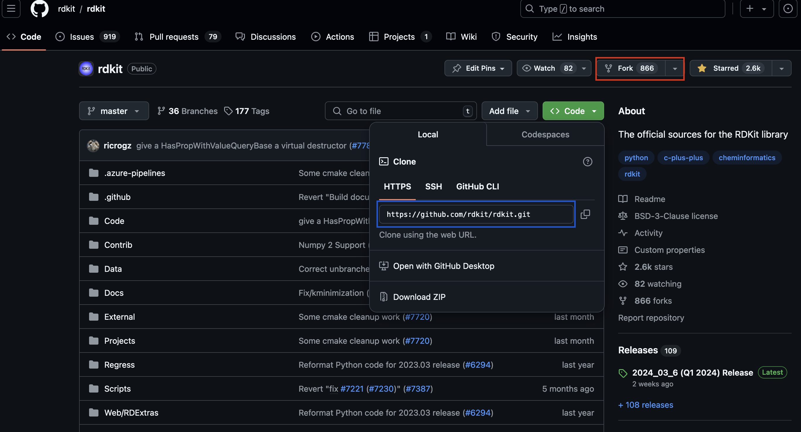
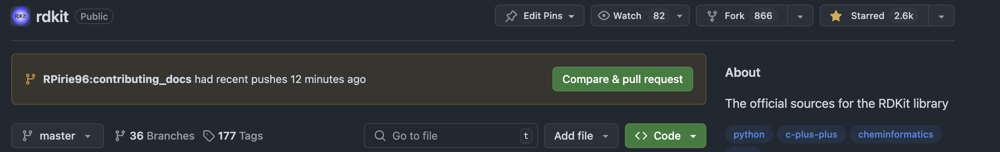
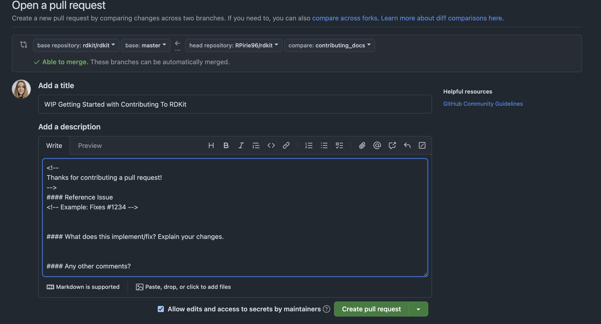

# Getting Started with Contributing to the RDKit

We are always happy to have new contributors help improve the RDKit. This document aims to provide an in-depth overview of **what** and **how** to make useful contributions to the RDKit community. 

This guide aims to serve a couple of purposes:
- To provide a starting point for newbies.
- As a (hopefully) useful resource for the Hackathon at the UGM
- To act as a reminder for more established contributors, especially those who submit irregularly
- Provide another weapon in the arsenal against Greg's "hit by a bus" problem, and hopefully make the maintainers lives easier by producing better first time submissions!

## What and How to Contribute

### If You Are Not a Developer

You don't need to be a developer to be able to make really helpful contributions to the RDKit. Some of these activities are also a good place to start for beginners who want to eventually make code contributions to get a feel for how the toolkit is structured.

Some things you can do that don't involve serious coding:

- Being an active part of the community and asking/answering questions on Github
- Submitting high-quality bug reports via [GitHub issues](https://github.com/rdkit/rdkit/issues). Some guidelines for best practices will be given in the section below. 
- Contributing documentation
    - Fixing pieces you find to be unclear or wrong
    - Adding references where available
    - Adding new sections or examples
    - In-code documentation: comments explaining what the code does or adding references
    - Adding to this guide! 
- Contributing tutorials
- Ideas for improvements (with the appropriate tags!) 
- Write blog posts (either your own or for the [RDKit blog](https://greglandrum.github.io/rdkit-blog/))
- Cleaning up GitHub issues that have been resolved or that should be under discussions
- Answering questions on the [GitHub discussions](https://github.com/rdkit/rdkit/discussions) board, the [mailing list](https://sourceforge.net/p/rdkit/mailman/) or [Stack Overflow](https://stackoverflow.com/questions/tagged/rdkit)

Many of these do not require a large time commitment and can be done if you have a spare 5 minutes - a little goes a long way! 

### A Note on GitHub Issues vs Discussions

RDKit makes use of both the Issues and Discussions functionality on GitHub.

#### Discussions

The [Discussions](https://github.com/rdkit/rdkit/discussions) board is used to ask questions about the RDKit and for help if you cannot find the functionality you need, or for debugging errors in your code. If you aren't sure if what you're seeing is the right behavior we would recommend posting this as a discussion first (unless you are 100% certain it is a genuine bug) instead of posting it as an issue. More often than not the unexpected behaviour is an issue from your side - "guilty until proven innocent"!

If you have a suggestion for a new RDKit feature or enhancement, starting a discussion before creating a pull request is a useful exercise. Community input on how a feature could work is often helpful and it could be that there's already a way to do what you want to do. This is especially important for larger contributions, where having a discussion with the maintainers before starting serious work is strongly advised.

Discussions should be tagged as follows: <br>
*Development*: Suggestions for improvement / (potential) bug fixes <br>
*FAQ* or *Q&A*: Questions about how things work, why a particular result is obtained or how to do things if you can't find it in the docs<br>
*General*: General discussion about the toolkit<br>
*Ideas*: Suggestions for new features<br>
*Polls*: Take a vote from the community<br>
*Show and Tell*: you've found something interesting you think others should know about!<br>

#### Issues

The [Issues](https://github.com/rdkit/rdkit/issues) board is used to report undesirable behaviour, either due to a bug in the code (tag as **bug**) or implementation choice, or to suggest new features (tag both as **enhancement**). Small, self-contained suggestions are tagged as **good for beginners** and suggestions for future UGMs are tagged **hackathon idea**, both of which are a good place to start if you are looking for ideas. 

*A Note on Bug Reports*

As mentioned above, if you encounter unexpected behaviour that you are reasonably convinced is a **bug**, it can be reported via the issues tab. If the "bug" you have observed happens only for a specific example, we would recommend first checking your inputs using the following code snippet. The `Chem.DetectChemistryProblem(mol)` function provides a good test for whether your observed behaviour is a true bug, or just input that RDKit doesn't like (`mol.Debug()` is also useful for this purpose):

  ```
  m = Chem.MolFromSmiles('c1nccc1O(C)C',sanitize=False)
  errs = Chem.DetectChemistryProblems(m)

  OUTPUTS: Explicit valence for atom # 5 O, 3, is greater than permitted
  OUTPUTS: Can't kekulize mol.  Unkekulized atoms: 0 1 2 3 4

  errs[0].GetType()
  OUTPUTS: 'AtomValenceException'

  errs[0].Message(),errs[0].GetAtomIdx()
  OUTPUTS: ('Explicit valence for atom # 5 O, 3, is greater than permitted', 5)

  errs[1].GetType()
  OUTPUTS: 'KekulizeException'

  errs[1].GetAtomIndices()
  OUTPUTS: (0, 1, 2, 3, 4)

  errs[1].Message()
  OUTPUTS: "Can't kekulize mol.  Unkekulized atoms: 0 1 2 3 4"
  ```

When reporting bugs, please use the template below (which appears when you open a new issue in GitHub) as it will help the maintainers understand the issue reported. If you do not provide the information requested we may not be able to help you and will probably close the issue. 

  ```
  -----------------------------------------
  TEMPLATE

  **Describe the bug**
  A clear and concise description of what the bug is.

  **To Reproduce**
  Steps to reproduce the behavior, feel free to paste a bit of Python in here.

  **Expected behavior**
  A clear and concise description of what you expected to happen.

  **Screenshots**
  If applicable, add screenshots to help explain your problem.

  **Configuration (please complete the following information):**
  - RDKit version: 
  - OS: [e.g. Ubuntu 20.04]
  - Python version (if relevant):
  - Are you using conda?
  - If you are using conda, which channel did you install the rdkit from?
  - If you are not using conda: how did you install the RDKit?

  **Additional context**
  Add any other context about the problem here.

  -----------------------------------------
  ```

It is also possible to report a report a [vulnerability](https://github.com/rdkit/rdkit/security/advisories/). This submission will only be viewable to repository maintainers and you will be credited if the advisory is published.

Please mark all issues/discussions with the relevant tag!

### If You Are a Developer

Submission of new features, improvements to existing ones and bug fixes are always welcome. For ideas on where to get started have a look at the [GitHub issues](https://github.com/rdkit/rdkit/issues). We try to remember to tag issues that are relatively small and self-contained as [good for beginners](https://github.com/rdkit/rdkit/labels/good%20for%20beginners); take a look at that list and see if there's anything that looks interesting. If you have questions, ask by adding a comment to the issue, and if you intend to resolve the issue add a comment to let the maintainers know. It’s also generally a good idea to check with Greg or one of the maintainers before adding significant new functionality.

Code contributions can be made as follows:
- Core C++ functionality + relevant wrappers
- Core Python functionality and scripts (note C++ is preferred for functionality, with the exception of Python-specific modules e.g. PandasTools)
- JavaScript
- Java
- KNIME nodes
- Postgres Cartridge

More details on what code contributions should look like (including documentation) are given in the following sections.

### How to Submit Code/Documentation Contributions

Contributions are made to the RDKit Codebase via GitHub pull requests. A summary of how to do this is given here. For a more in-depth overview see [this fantastic set of slides](https://github.com/rdkit/UGM_2016/blob/master/Presentations/Landrum_Schneider_GitHub_Git_and_RDKit.pdf) from Greg and Nadine. 

**Step 1:** Create a fork of the main [RDKit repo](https://github.com/rdkit/rdkit) to your own GitHub account.



**Step 2:** Clone your fork to make a local copy to work from.

  `git clone https://github.com/YOURUSERNAME/rdkit.git`

**Step 3:** Make your changes to your local copy. For development of features we recommend working on a [branch](https://docs.github.com/en/pull-requests/collaborating-with-pull-requests/proposing-changes-to-your-work-with-pull-requests/creating-and-deleting-branches-within-your-repository), and regularly **commiting** your changes in case you need to undo something you've changed.

  ```
  git commit -a -m "update what and how section"

  OUTPUT: [contributing_docs 08780075f] update what and how section
  1 file changed, 38 insertions(+), 27 deletions(-)
  ```

**Step 4:** Add tests for your new functionality and run all tests locally to check you've not broken anything else (see below for how to do this)!

**Step 5:** Push your bug fix or new feature to your remote repository
  `git push`

**Step 6:** Create a pull request to the [RDKit repo](https://github.com/rdkit/rdkit.git) filling in the requested information.




### Running the tests (C++ and Python)

Any code changes made should generally come with an associated unit test. Please run the tests locally before submitting a pull request to make sure your changes haven't broken existing behaviour! If a test breaks it may be a bug in your changes, or if the behavior change is the point of the commit the old test may need to be updated.

#### Running the full set of tests

The unit tests are run from the build directory (`$RDBASE/build`) using the
[ctest](https://cmake.org/cmake/help/latest/manual/ctest.1.html) command. 

```
  RDBASE=$RDBASE ctest
  ```

For MacOS users, the `DYLD_FALLBACK_LIBRARY_PATH` will also need to be specified
  ```
  RDBASE=$RDBASE DYLD_FALLBACK_LIBRARY_PATH="$RDBASE/lib:$PYROOT/lib" ctest
  ```

See the help message for a full list of options, but some frequently useful options include:

    -j <n>               Run in parallel with <n> workers
    -N                   Only list the tests that would be run
    -R <regex>           Only run tests matching a regular expression
    --output-on-failure  Print the stdout/stderr of failing tests

#### Changes to Python only

If working only in Python (having followed [Greg's set up instructions](https://greglandrum.github.io/rdkit-blog/posts/2020-03-30-setting-up-an-environment.html) for setting up an environment), the tests can be run as follows:

  ```
  cd $RDBASE/rdkit
  python -m pytest
  ```

Note: a recent switch to pytest means the instructions for running the tests in Greg's blog are out of date.

## Contributing to the RDKit Docs 

Writing documentation is a great place to begin with contributing to the RDKit. In addition to producing documentation for your own submissions, it is really useful to contribute documentation for functionality already within the toolkit. This can include:
- Fixing or expanding pieces of documentation that are unclear, wrong or missing suitable examples
- Adding in references for methods where available
- Adding new sections or examples:
  - From blog posts about RDKit:
      - [RDKit blog](https://greglandrum.github.io/rdkit-blog/posts/2020-03-30-setting-up-an-environment.html)
      - [Practical Chemoinformatics](https://practicalcheminformatics.blogspot.com/)
      - [Is life worth living?](https://iwatobipen.wordpress.com/)
      - [Mac in Chem](https://macinchem.org/?s=rdkit)
      - [Cheminformania](https://www.cheminformania.com/?s=rdkit)
  - From UGM talks (the relevant repositories are listed in the README.md on GitHub)
  - Translation to other languages (e.g. see the [Japanese](https://www.rdkit.org/docs_jp/The_RDKit_Book_jp.html) copy of the RDKit Book)
  - To this guide if instructions need updated!

### A Whistle Stop Tour of the RDKit Documentation

The RDKit documentation consists of several different sections. Here we'll give an overview of how each of these is generated, and what contributions should go where. An index of the RDKit documentation can be found [here](https://www.rdkit.org/docs/index.html). The major parts of the documentation (excluding the Overview and Installation instructions, which generally won't require community contributions) are as follows: 
- The [Python API](https://www.rdkit.org/docs/api-docs.html) and [C++ API](https://www.rdkit.org/docs/cppapi/index.html) docs are generated automatically from the codebase.
- The "Getting Started With" guides for [Python](https://www.rdkit.org/docs/GettingStartedInPython.html) and [C++](https://www.rdkit.org/docs/GettingStartedInC%2B%2B.html) provide an overview of how to use the core functionality of RDKit. 
- The [RDKit Cookbook](https://www.rdkit.org/docs/Cookbook.html) contains more in-depth example recipes in Python for how to use RDKit for common tasks, generally contributed by the community. More extensive examples can also be provided as a [Tutorial](https://github.com/rdkit/rdkit-tutorials).
- The [RDKit Book](https://www.rdkit.org/docs/RDKit_Book.html) gives more technical details about how various parts of the RDKit work.  
- Not strictly speaking documentation but we'll include it here for completeness, Greg writes a [Blog](https://greglandrum.github.io/rdkit-blog/) highlighting in more detail how to use new and existing bits of the RDKit.

### How to Write RDKit Documentation

The RDKit documentation is written mostly in [reStructuredText](https://docutils.sourceforge.io/rst.html). Full tutorials can be found online, but a brief overview will be given here to get you started. 

*Headings*

  ```
  This is a TITLE
  %%%%%%%%%%%%%%%%%%%%%%%%%%%%%%%%%%%%%%%%

  This is a HEADING 
  **************

  This is a SUBHEADING
  ========================
  ```

*Code Examples*

The RDKit docs support inclusion of Sphinx doctests to allow the result of a code example to appear in the text. 

  ```
  .. doctest::

    >>> mol = Chem.MolFromSmiles('CO(C)C')
    >>> print(print(mol.GetNumAtoms()))
    4
  ```

*Hyperlinks*

  ```
  `RDKit Website`_

  .. _RDKit Website: https://www.rdkit.org/
  ```

*Images*

  ```
  .. image:: pathtoimage/name.png
  ```

### How to Build and Test RDKit Documentation Locally

#### Build the Documentation

To preview your changes to the RDKit documentation, build the docs locally. First set up your development environment by following the instructions in [Building RDKit for Development](#building-rdkit-for-development). Then run `doxygen` before changing to the directory `Docs/Book`:
  ```
  # run doxygen
  cd $RDBASE/Code/ && doxygen doxygen/doxygen.config
  cd $RDBASE/Docs/Book
  ```

Then run one of the following commands based on whether you are working in C++ or only Python:

#### C++
  ```
  make html
  ```

#### Python
  ```
  make html BUILD_CPP_DOCS=OFF
  ```

In either case, the output should end with

  ```
  The HTML pages are in _build/html.
  
  Build finished. The HTML pages are in _build/html.
  ```

Now you can preview the docs by pointing your web browser to the local file `rdkit/Docs/Book/_build/html/index.html` where `rdkit` is directory containing the local clone.

#### Test the Documentation

To ensure that code blocks in the documentation return the stated results, you can run doctests locally:

  ```
  make doctest
  ```

## Contributing to the Code - Python 

### Building RDKit for Development

If you also have, or plan to, contribute C++ code to the RDKit, the same set-up can be used for Python contributions (see instructions below). However if you intend only to contribute pure Python, which may be easiest for beginners, [Greg recently created some easier to follow recipes](https://greglandrum.github.io/rdkit-blog/posts/2020-03-30-setting-up-an-environment.html) to simplify the start-up process. To build the environment you will need:
- Local installation of git and either [miniconda](https://docs.anaconda.com/miniconda/miniconda-install/) or [miniforge](https://github.com/conda-forge/miniforge)
- Clone your fork of the RDKit GitHub repository following the instructions given above
- Change to the directory containing the local clone and set the RDBASE environment variable:
    ```
    cd rdkit
    export RDBASE=`pwd`
    ```
- Create a conda environment containing the most recent RDKit version (you can give this whatever name you like and adjust Python version as needed):
    ```
    conda create -y -n py312_rdkit_beta python=3.12
    conda activate py312_rdkit_beta
    conda install -y -c conda-forge rdkit pytest
    ```
- Copy the RDKit binary components from that environment into our local clone of the RDKit repo (remembering to adjust the path if you have changed the Python version):
  - **Mac and Linux**
      ```
      cd $CONDA_PREFIX/lib/python3.12/site-packages/rdkit
      rsync -a -m --include '*/' --include='*.so' --include='inchi.py' --exclude='*' . $RDBASE/rdkit
      ```
  - **Windows**
      ```
      cd $CONDA_PREFIX/lib/python3.12/site-packages/rdkit
      find . -name '*.pyd' -exec cp --parents \{\} $RDBASE/rdkit \; 
      cp Chem/inchi.py $RDBASE/rdkit/Chem
      ```
- Set the PYTHONPATH and test everything is working my importing RDKit:
    ```
    export PYTHONPATH="$RDBASE"
    cd $RDBASE/rdkit
    python -c 'from rdkit import Chem;print(Chem.__file__)'
    ```
- You can also test this by running the Python tests:
    ```
    cd $RDBASE/rdkit
    python -m pytest
    ```
- You might also need to set the origin of your fork to keep in sync with any changes made to the main RDKit repository:
    ```
    git remote add upstream https://github.com/rdkit/rdkit.git
    ```

Any issues encountered with these instructions can be reported in [this thread](https://github.com/rdkit/rdkit/issues/3052).

### Where Should I Put My Code? 

The RDKit Python code lives in the `rdkit/rdkit` directory. Most contributions (and their corresponding unit tests) will be added to `Chem` and the relevant sub-directory, but check with the maintainers if you are unsure. Files containing any examples used in tests should be placed in a sub-directory called `test_data`.

### Coding Standards

There is currently no official style guide or linter setup that you should use for Python. However, there are a few rules to adhere to so that the code and API design stays relatively coherent (sidenote: it is currently not):
- Use `CamelCase` for `PackageNames`, `ModuleNames`, `ClassNames`, `MethodNames` and `FunctionNames`, but note the different style for `functionAttributeNames` and `methodAttributeNames`
- Use multi-line Python strings to document modules and methods, i.e.:
    ```python
    def xy():
      """ This is a documentation string.
      
      It is continued here...
      """
    ```

### Tests

Tests for Python functionality in RDKit are written using the [unittest framework](https://docs.python.org/3/library/unittest.html). Generally the tests for a module are contained within a single script, named UnitTestMODULE.py so they can be detected by *pytest*. Often when you add or update features the corresponding tests can be added to the existing script, while in the case of an entirely new module / feature set a new script will need to be added. Exactly what needs to be included will depend on what the new feature does, but generally will involve a check that the expected value is returned and that the correct error is raised for invalid inputs. 

For example, to test the `GetMolDescriptors()` function:
  ```python
  import unittest

  class TestCase(unittest.TestCase):
    
    def testcase1(self):
      mol = Chem.MolFromSmiles('CCCO')
      descs = Descriptors.CalcMolDescriptors(mol)
      self.assertTrue('MolLogP' in descs)
      self.assertEqual(descs['NumHDonors'], 1)
  ```

Note: for cases where rounding may cause errors, use `self.assertAlmostEqual()`

### Documentation

Documentation for the new functionality added will be generated automatically for the [Python API](https://www.rdkit.org/docs/api-docs.html) docs automatically from any docstrings included. We would recommend the following format:

  ```python
    def AnExampleDocString():
      """
        brief explanation of what the function does

        reference to paper / blog post / source if relevant
      
      ARGUMENTS:
          - variable name: explanation of what it is
          - variable name2: explanation of what it is
          - etc
      
      RETURNS:
          explanation of what is returned (including its type)
      
      usage:
      >>> can be used to put snippets in docstring
      """
  ```

Where relevant, example useage can also be added to the [Getting Started with Python Guide](https://www.rdkit.org/docs/GettingStartedInPython.html) as part of the pull request.

## Contributing to the Code - C++ 

### A note on Modern C++

In order to continue to allow the code to be built on older systems, the RDKit is currently using a subset of what's available in modern C++ compilers. The latest language standard supported by the RDKit is C++17; the expectation is that it should be possible to build the RDKit with g++ v8.0.

### Building RDKit for Development

Full installation instructions for the RDKit can be found [here](https://github.com/rdkit/rdkit/blob/master/Docs/Book/Install.md). Development in C++ requires a build from source from a clone of the current GitHub repo. 

Note: on MacOS for v14.0 onwards some of the changes caused problems with the standard CMake spell. This [discussion thread](https://github.com/rdkit/rdkit/discussions/6859) provides some useful solutions in this case.

### Where Should I Put My Code? 

The RDKit C++ code lives in `rdkit/Code`, with the majority of the functionality sitting in the `GraphMol` sub-directory. If the code being contributed interfaces with another project it should go in `rdkit/External` and in an appropriate sub-directory. Again if you are unsure where your submission should go check with the maintainers!

### Coding Standards

- Use of an auto-formatter (e.g. [clang-format](http://clang.llvm.org/docs/ClangFormat.html)) is strongly recommended. This can be integrated with editors, but note that at least version 3.8 of clang-format is required as the configuration files are not backwards compatible. There is a .clang-format config file at the root of the repository; code layout should be based on this configuration.
- The public classes / functions exposed in the API are typically declared in the header file, and the underlying definition is in the C++ file of the same name.
- Use multi-line comments in the header file to document code:
    ```c++
    /*!
    this is a documentation string
    */
    ```

We would also recommend checking your code for memory leaks with [Valgrind](https://valgrind.org/) before opening a pull request.

### Tests

The RDKit C++ Tests use the [Catch2 framework](https://github.com/catchorg/Catch2). The tests generally are placed in a file named "catch_tests.cpp" in the same directory as the corresponding code. Unless you are adding a significant new feature, it's generally best to add the new TEST\_CASE to an existing test set rather than creating an entirely new file.

For example, to test the atom count function:

```c++
#include "RDGeneral/test.h"
#include <catch2 /catch_all.hpp>
#include <GraphMol /SmilesParse/SmilesParse.h>

using namespace RDKit;

TEST_CASE("test basic Mol features", "[ROMol]") {
  SECTION("basics") {
    {
    // shortcut to create a molecule from SMILES
    auto m = "CCO"_smiles;
    // check that the molecule was created successfully
    REQUIRE(m);
    // test some functionality
    int nAtoms = m->getNumAtoms();
    CHECK(nAtoms == 3);
    }
  }
}
```

When adding new test file the CMakeLists.txt file of the respective folder will also need updated to call the test and link the required libraries (e.g. the above example needs the FileParsers library):

```
rdkit_catch_test(dummyTest catch_dummy.cpp LINK_LIBRARIES FileParsers)
```

### Documentation

Documentation for the [C++ API](https://www.rdkit.org/docs/cppapi/) is generated from the docstrings, which should be placed above the corresponding function. We'd recommend these take the following format:

```c++
/*!
    A brief description of what the function does

    Reference / Source (if there is one)

    \param name: what the parameter is
    \param name2: what the parameter is
    etc...
  */
```

### Wrapping the C++ Code for Python

RDKit uses [Boost](https://www.boost.org/) to expose functions from the C++ API to Python. In each sub-directory of `rdkit/Code` is a further sub-directory named `Wrap` containing the files needed to construct the Python bindings. This generally includes:
- C++ file defining the Python bindings. This will include the required libraries (usually `#include <RDBoost/Wrap.h>`)
- Python file(s) containing the corresponding unit tests
- CMakeLists.txt file containing build instructions (including the destination of the python code + linked libraries) and calls for the tests

Taking the [Double Cubic Lattice Volume](https://www.rdkit.org/docs/source/rdkit.Chem.rdMolDescriptors.html#rdkit.Chem.rdMolDescriptors.DoubleCubicLatticeVolume) class as an example, in the raw C++ the class is defined as follows:

```c++
class RDKIT_DESCRIPTORS_EXPORT DoubleCubicLatticeVolume {
 public:
  /*!

    \param mol: input molecule or protein
    \param isProtein: flag to calculate burried surface area of a protein ligand
    complex [default=false, free ligand]
    \param includeLigand: flag to trigger
    inclusion of bound ligand in surface area and volume calculations where
    molecule is a protein [default=true]
    \param probeRadius: radius of the
    sphere representing the probe solvent atom
    \param depth: controls the number
    of dots per atom
    \param dotDensity: controls density of dots per atom

  */
  DoubleCubicLatticeVolume(const ROMol &mol, bool isProtein = false,
                           bool includeLigand = true, double probeRadius = 1.2,
                           int depth = 4, int dotDensity = 0);
  //! Class for calculation of the Shrake and Rupley surface area and volume
  //! using the Double Cubic Lattice Method.
  //!
  //! Frank Eisenhaber, Philip Lijnzaad, Patrick Argos, Chris Sander and
  //! Michael Scharf, "The Double Cubic Lattice Method: Efficient Approaches
  //! to Numerical Integration of Surface Area and Volume and to Dot Surface
  //! Contouring of Molecular Assemblies", Journal of Computational Chemistry,
  //! Vol. 16, No. 3, pp. 273-284, 1995.

  // value returns
  double getSurfaceArea() {
    /*! \return Solvent Accessible Surface Area */
    return surfaceArea;
  }

  double getVolume() {
    /*! \return Volume bound by probe sphere */
    return totalVolume;
  }

  double getVDWVolume() { /*! \return van der Waals Volume */
    return vdwVolume;
  }

  double getCompactness() {
    /*! \return Compactness of the protein */
    return compactness;
  }

  double getPackingDensity() {
    /*! \return Packing Density of the protein */
    return packingDensity;
  }

 private:
  // outputs
  double surfaceArea;
  double totalVolume;
  double vdwVolume;
  double compactness;
  double packingDensity;
};
```

In this case as the submission is a descriptor, the Python bindings are added to the existing `rdMolDescriptors.cpp` file as follows:

```c++
docString =
      R"DOC(ARGUMENTS:
      "   - mol: molecule or protein under consideration
      "   - isProtein: flag to indicate if the input is a protein (default=False, free ligand).
      "   - includeLigand: flag to include or exclude a bound ligand when input is a protein (default=True)
      "   - probeRadius: radius of the solvent probe (default=1.2)
      "   - depth: control of number of dots per atom (default=4)
      "   - dotDensity: control of accuracy (default=0)
      ")DOC";
  python::class_<RDKit::Descriptors::DoubleCubicLatticeVolume>(
      "DoubleCubicLatticeVolume",
      "Class for the Double Cubic Lattice Volume method",
      python::init<const RDKit::ROMol &,
                   python::optional<bool, bool, double, int, int>>(
          (python::args("self", "mol"), python::args("isProtein") = false,
           python::args("includeLigand") = true,
           python::args("probeRadius") = 1.2, python::args("depth") = 4,
           python::args("dotDensity") = 0),
          docString.c_str()))
      .def("GetSurfaceArea",
           &RDKit::Descriptors::DoubleCubicLatticeVolume::getSurfaceArea,
           "Get the Surface Area of the Molecule or Protein")
      .def("GetVolume",
           &RDKit::Descriptors::DoubleCubicLatticeVolume::getVolume,
           "Get the Total Volume of the Molecule or Protein")
      .def("GetVDWVolume",
           &RDKit::Descriptors::DoubleCubicLatticeVolume::getVDWVolume,
           "Get the van der Waals Volume of the Molecule or Protein")
      .def("GetCompactness",
           &RDKit::Descriptors::DoubleCubicLatticeVolume::getCompactness,
           "Get the Compactness of the Protein")
      .def("GetPackingDensity",
           &RDKit::Descriptors::DoubleCubicLatticeVolume::getPackingDensity,
           "Get the PackingDensity of the Protein");
```

As for the pure Python contributions, the documentation is generated automatically from the docstrings. The tests are written using the `unittest framework` (see the above section for more detail).

## Contributing to the Code - Java

Volunteers needed to complete this section :)

## Contributing to the Code - JavaScript

Volunteers needed to complete this section :)

## Contributing to the Code - RDKit PostgreSQL cartridge

Volunteers needed to complete this section :)

## Contributing to the Code - KNIME

RDKit is mostly used in Python and C++, but another way how people use it is in the form of KNIME nodes. KNIME is a graphical programming software, that allows to build reproducible and self-documenting data pipelines without coding, making RDKit  functionality available for folks that are not familiar or comfortable with coding. Novartis has created and is maintaining the current [RDKit Nodes Extension](https://hub.knime.com/e/XtKPF0hygwZr92X9), that covers a lot of the basic functionality of the Python library. However, RDKit is continously developed and new functionality is being added, and not all new features are translated into RDKit nodes at this stage. In case your new favorite RDKit Python function is not available as KNIME node yet, one way you can contribute is by writing and publishing new KNIME nodes to make it available to the community that is not code-savvy. 

### Python-based RDKit nodes
The majority of the existing nodes in the [RDKit Nodes Extension](https://hub.knime.com/e/XtKPF0hygwZr92X9) are written in Java, but since the v4.6 release it is possible to write KNIME nodes in pure Python. The ['Create a New Python based KNIME Extension' guide](https://docs.knime.com/latest/pure_python_node_extensions_guide/) will help you to get kickstarted to develop your own RDKit nodes. More information about the handling of chemistry data types can be found [here](https://forum.knime.com/t/announcing-the-interoperability-between-rdkit-and-python-in-knime-4-7/). Once you happy and ready to share the nodes with a broader community, please contact KNIME at _community-contributions@knime.com_ to [publish your KNIME Extension on the Community Hub](https://docs.knime.com/latest/development_contribute_extension/). 

### Share workflows on the KNIME Community Hub
You don't have to develop KNIME nodes yourself to be able to contribute. You can also upload workflows (data pipelines) on the public [KNIME Community Hub](https://hub.knime.com/) that demonstrate use cases, how to achieve certain tasks or how to use certain nodes. Users can download these workflows, track how data changes or take them as inspiration for their own tasks. If you used KNIME in publications, please also consider publishing these workflows on the KNIME Community Hub. 

### Answer (and ask) questions in the KNIME Forum
You might also consider answering questions in the [RDKit Community Extension](https://forum.knime.com/tags/c/community-extensions/38/rdkit) or [cheminformatics section](https://forum.knime.com/c/special-interest-groups/cheminformatics/) of the KNIME Forum.
