The RDKit Book
%%%%%%%%%%%%%%


Misc Cheminformatics Topics
***************************


Aromaticity
===========

Aromaticity is one of those unpleasant topics that is simultaneously simple and impossibly complicated.
Since neither experimental nor theoretical chemists can agree with each other about a definition, it's necessary to pick something arbitrary and stick to it.
This is the approach taken in the RDKit.

Instead of using patterns to match known aromatic systems, the aromaticity perception code in the RDKit uses a set of rules.
The rules are relatively straightforward.

Aromaticity is a property of atoms and bonds in rings.
An aromatic bond must be between aromatic atoms, but a bond between aromatic atoms does not need to be aromatic.

For example the fusing bonds here are not considered to be aromatic by the RDKit:

.. testsetup::
  
  # clean up in case these tests are running in a python process that has already
  # imported the IPythonConsole code
  from rdkit.Chem.Draw import IPythonConsole
  IPythonConsole.UninstallIPythonRenderer()
  from rdkit.Chem import rdDepictor
  rdDepictor.SetPreferCoordGen(False)

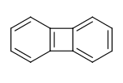

.. doctest::

  >>> from rdkit import Chem
  >>> m = Chem.MolFromSmiles('C1=CC2=C(C=C1)C1=CC=CC=C21')
  >>> m.GetAtomWithIdx(3).GetIsAromatic()
  True
  >>> m.GetAtomWithIdx(6).GetIsAromatic()
  True
  >>> m.GetBondBetweenAtoms(3,6).GetIsAromatic()
  False

The RDKit supports a number of different aromaticity models and allows the user to define their own by providing a function that assigns aromaticity.

The RDKit Aromaticity Model
---------------------------

A ring, or fused ring system, is considered to be aromatic if it obeys the 4N+2 rule.
Contributions to the electron count are determined by atom type and environment.
Some examples:

+----------+------------------------+
| Fragment | Number of pi electrons |
+----------+------------------------+
| c(a)a    | 1                      |
+----------+------------------------+
| n(a)a    | 1                      |
+----------+------------------------+
| An(a)a   | 2                      |
+----------+------------------------+
| o(a)a    | 2                      |
+----------+------------------------+
| s(a)a    | 2                      |
+----------+------------------------+
| se(a)a   | 2                      |
+----------+------------------------+
| te(a)a   | 2                      |
+----------+------------------------+
| O=c(a)a  | 0                      |
+----------+------------------------+
| N=c(a)a  | 0                      |
+----------+------------------------+
| \*(a)a   | 0, 1, or 2             |
+----------+------------------------+

**Notation** a: any aromatic atom; A: any atom, include H; \*: a dummy atom

Notice that exocyclic bonds to electronegative atoms “steal” the valence electron from the ring atom and that dummy atoms contribute whatever count is necessary to make the ring aromatic.

The use of fused rings for aromaticity can lead to situations where individual rings are not aromatic, but the fused system is.
An example of this is azulene:

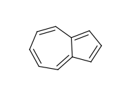

An extreme example, demonstrating both fused rings and the influence of exocyclic double bonds:

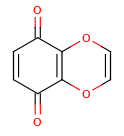

.. doctest::

  >>> m=Chem.MolFromSmiles('O=C1C=CC(=O)C2=C1OC=CO2')
  >>> m.GetAtomWithIdx(6).GetIsAromatic()
  True
  >>> m.GetAtomWithIdx(7).GetIsAromatic()
  True
  >>> m.GetBondBetweenAtoms(6,7).GetIsAromatic()
  False

A special case, heteroatoms with radicals are not considered candidates for aromaticity:

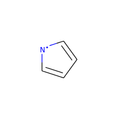

.. doctest::

  >>> m = Chem.MolFromSmiles('C1=C[N]C=C1')
  >>> m.GetAtomWithIdx(0).GetIsAromatic()
  False
  >>> m.GetAtomWithIdx(2).GetIsAromatic()
  False
  >>> m.GetAtomWithIdx(2).GetNumRadicalElectrons()
  1

Charged carbons with radicals are also not considered:

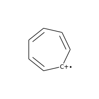

.. doctest::

  >>> m = Chem.MolFromSmiles('C1=CC=CC=C[C+]1')
  >>> m.GetAtomWithIdx(0).GetIsAromatic()
  False
  >>> m.GetAtomWithIdx(6).GetIsAromatic()
  False
  >>> m.GetAtomWithIdx(6).GetFormalCharge()
  1
  >>> m.GetAtomWithIdx(6).GetNumRadicalElectrons()
  1

Neutral carbons with radicals, however, are still considered:

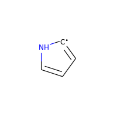

.. doctest::

  >>> m = Chem.MolFromSmiles('C1=[C]NC=C1')
  >>> m.GetAtomWithIdx(0).GetIsAromatic()
  True
  >>> m.GetAtomWithIdx(1).GetIsAromatic()
  True
  >>> m.GetAtomWithIdx(1).GetNumRadicalElectrons()
  1


The Simple Aromaticity Model
----------------------------

This one is quite simple: only five- and six-membered simple rings are considered candidates for aromaticity.
The same electron-contribution counts listed above are used.


The MDL Aromaticity Model
-------------------------

This isn't well documented (at least not publicly), so we tried to reproduce what's provided in the oechem documentation (https://docs.eyesopen.com/toolkits/python/oechemtk/aromaticity.html)

- fused rings (i.e. azulene) can be aromatic
- five-membered rings are not aromatic (though they can be part of fused aromatic systems)
- only C and N can be aromatic
- only one electron donors are accepted
- atoms with exocyclic double bonds are not aromatic


**Note:** For reasons of computational expediency, aromaticity perception is only done for fused-ring systems where all members are at most 24 atoms in size.

SMILES Support and Extensions
=============================

The RDKit covers all of the standard features of Daylight SMILES [#smiles]_ as well as some useful extensions.

Here's the (likely partial) list of extensions:


Aromaticity
-----------

``te`` (aromatic Te) is accepted. Here is an example with tellurophene-2-carboxylic acid:

.. doctest::

  >>> m = Chem.MolFromSmiles('OC(=O)c1[te]ccc1')
  >>> m.GetAtomWithIdx(4).GetIsAromatic()
  True

Dative bonds
------------

``<-`` and ``->`` create a dative bond between the atoms, direction does matter.

Here's an example of a bipy-copper complex:

.. doctest::

  >>> bipycu = Chem.MolFromSmiles('c1cccn->2c1-c1n->3cccc1.[Cu]23(Cl)Cl')
  >>> bipycu.GetBondBetweenAtoms(4,12).GetBondType()
  rdkit.Chem.rdchem.BondType.DATIVE
  >>> Chem.MolToSmiles(bipycu)
  'Cl[Cu]1(Cl)<-n2ccccc2-c2ccccn->12'

Dative bonds have the special characteristic that they don't affect the valence on the start atom, but do affect
the end atom. So in this case, the N atoms involved in the dative bond have the valence of 3 that we expect from bipy,
while the Cu has a valence of 4:

.. doctest::

  >>> bipycu.GetAtomWithIdx(4).GetTotalValence()
  3
  >>> bipycu.GetAtomWithIdx(12).GetTotalValence()
  4

Ring closures
-------------

``%(N)`` notation is supported for ring closures, where N is a single digit ``%(N)`` up to
five digits ``%(NNNNN)``. Here is an example:

.. doctest::

  >>> m = Chem.MolFromSmiles('C%(1000)OC%(1000)')
  >>> m.GetAtomWithIdx(0).IsInRing()
  True
  >>> m.GetAtomWithIdx(2).IsInRing()
  True

Specifying atoms by atomic number
---------------------------------

The ``[#6]`` construct from SMARTS is supported in SMILES.


Quadruple bonds
---------------

The token ``$`` can be used to represent quadruple bonds in SMILES and SMARTS.


CXSMILES/CXSMARTS extensions
----------------------------

The RDKit supports parsing and writing a subset of the extended SMILES/SMARTS functionality introduced by ChemAxon [#cxsmiles]_.

The features which are parsed include:

- atomic coordinates ``()``
- atomic values ``$_AV:``
- atomic labels/aliases ``$`` (recognized aliases are ``_AP``, ``star_e``,
  ``Q_e``, ``QH_p``, ``AH_P``, ``X_p``, ``XH_p``, ``M_p``, ``MH_p``, ``*``)
- atomic properties ``atomprop``
- coordinate bonds ``C`` (these are translated into double bonds)
- radicals ``^``
- enhanced stereo (these are converted into ``StereoGroups``)
- linknodes ``LN``
- variable/multi-center attachments ``m``
- ring bond count specifications ``rb``
- non-hydrogen substitution count specifications ``s``
- unsaturation specification ``u``
- wedged bonds (only when atomic coordinates are present): ``wU``, ``wD``
- wiggly bonds ``w``
- double bond stereo (only for ring bonds) ``c``, ``t``, ``ctu``
- SGroup Data ``SgD``
- polymer SGroups ``Sg``
- SGroup Hierarchy ``SgH``

The features which are written by :py:func:`rdkit.Chem.rdmolfiles.MolToCXSmiles` and
:py:func:`rdkit.Chem.rdmolfiles.MolToCXSmarts` 
(note the specialized writer functions) include:

- atomic coordinates
- atomic values
- atomic labels
- atomic properties
- radicals
- enhanced stereo
- linknodes
- wedged bonds (only when atomic coordinates are also written) 
- wiggly bonds
- double bond stereo (only for ring bonds)
- SGroup Data
- polymer SGroups
- SGroup Hierarchy

.. doctest::

  >>> m = Chem.MolFromSmiles('OC')
  >>> m.GetAtomWithIdx(0).SetProp('p1','2')
  >>> m.GetAtomWithIdx(1).SetProp('p1','5')
  >>> m.GetAtomWithIdx(1).SetProp('p2','A1')
  >>> m.GetAtomWithIdx(0).SetProp('atomLabel','O1')
  >>> m.GetAtomWithIdx(1).SetProp('atomLabel','C2')
  >>> Chem.MolToCXSmiles(m)
  'CO |$C2;O1$,atomProp:0.p1.5:0.p2.A1:1.p1.2|'

Reading molecule names
----------------------

If the SMILES/SMARTS and the optional CXSMILES extensions are followed by whitespace and another string, the SMILES/SMARTS parsers will interpret this as the molecule name:

.. doctest::

  >>> m = Chem.MolFromSmiles('CO carbon monoxide')
  >>> m.GetProp('_Name')
  'carbon monoxide'
  >>> m2 = Chem.MolFromSmiles('CO |$C2;O1$| carbon monoxide')
  >>> m2.GetAtomWithIdx(0).GetProp('atomLabel')
  'C2'
  >>> m2.GetProp('_Name')
  'carbon monoxide'

This can be disabled while still parsing the CXSMILES:

.. doctest::

  >>> ps = Chem.SmilesParserParams()
  >>> ps.parseName = False
  >>> m3 = Chem.MolFromSmiles('CO |$C2;O1$| carbon monoxide',ps)
  >>> m3.HasProp('_Name')
  0
  >>> m3.GetAtomWithIdx(0).GetProp('atomLabel')
  'C2'


Note that if you disable CXSMILES parsing but pass in a string which includes CXSMILES it will be interpreted as (part of) the name:

.. doctest::

  >>> ps = Chem.SmilesParserParams()
  >>> ps.allowCXSMILES = False
  >>> m4 = Chem.MolFromSmiles('CO |$C2;O1$| carbon monoxide',ps)
  >>> m4.GetProp('_Name')
  '|$C2;O1$| carbon monoxide'


Finally, if you disable parsing of both CXSMILES and names, then extra text in the SMILES/SMARTS string will result in errors:
.. doctest::

  >>> ps = Chem.SmilesParserParams()
  >>> ps.allowCXSMILES = False
  >>> ps.parseName = False
  >>> m5 = Chem.MolFromSmiles('CO |$C2;O1$| carbon monoxide',ps)
  >>> m5 is None
  True
  >>> m5 = Chem.MolFromSmiles('CO carbon monoxide',ps)
  >>> m5 is None
  True

The examples in this sectin all used the SMILES parser, but the SMARTS parser behaves the same way.

SMARTS Support and Extensions
=============================

The RDKit covers most of the standard features of Daylight SMARTS [#smarts]_ as well as some useful extensions.

Here's the (hopefully complete) list of SMARTS features that are *not* supported:

- Non-tetrahedral chiral classes
- the ``@?`` operator
- explicit atomic masses (though isotope queries are supported)
- component level grouping requiring matches in different components, i.e. ``(C).(C)``

Here's the (likely partial) list of extensions:


Hybridization queries
---------------------

   - ``^0`` matches S hybridized atoms
   - ``^1`` matches SP hybridized atoms
   - ``^2`` matches SP2 hybridized atoms
   - ``^3`` matches SP3 hybridized atoms
   - ``^4`` matches SP3D hybridized atoms
   - ``^5`` matches SP3D2 hybridized atoms

.. doctest::

  >> Chem.MolFromSmiles('CC=CF').GetSubstructMatches(Chem.MolFromSmarts('[^2]'))
  ((1,), (2,))


Dative bonds
------------

``<-`` and ``->`` match the corresponding dative bonds, direction does matter.

.. doctest::

  >>> Chem.MolFromSmiles('C1=CC=CC=N1->[Fe]').GetSubstructMatches(Chem.MolFromSmarts('[#7]->*'))
  ((5, 6),)
  >>> Chem.MolFromSmiles('C1=CC=CC=N1->[Fe]').GetSubstructMatches(Chem.MolFromSmarts('*<-[#7]'))
  ((6, 5),)


Heteroatom neighbor queries
---------------------------

   - the atom query ``z`` matches atoms that have the specified number of heteroatom (i.e. not C or H) neighbors. For example, ``z2`` would match the second C in ``CC(=O)O``.
   - the atom query ``Z`` matches atoms that have the specified number of aliphatic heteroatom (i.e. not C or H) neighbors.

.. doctest::

  >>> Chem.MolFromSmiles('O=C(O)c1nc(O)ccn1').GetSubstructMatches(Chem.MolFromSmarts('[z2]'))
  ((1,), (3,), (5,))
  >>> Chem.MolFromSmiles('O=C(O)c1nc(O)ccn1').GetSubstructMatches(Chem.MolFromSmarts('[Z2]'))
  ((1,),)
  >>> Chem.MolFromSmiles('O=C(O)c1nc(O)ccn1').GetSubstructMatches(Chem.MolFromSmarts('[Z1]'))
  ((5,),)


Range queries
-------------
Ranges of values can be provided for many query types that expect numeric values.
The query types that currently support range queries are:
``D``, ``h``, ``r``, ``R``, ``v``, ``x``, ``X``, ``z``, ``Z``, ``+``, ``-``

Here are some examples:
  - ``D{2-4}`` matches atoms that have between 2 and 4 (inclusive) explicit connections.
  - ``D{-3}`` matches atoms that have less than or equal to 3 explicit connections.
  - ``D{2-}`` matches atoms that have at least 2 explicit connections.

.. doctest::

  >>> Chem.MolFromSmiles('CC(=O)OC').GetSubstructMatches(Chem.MolFromSmarts('[z{1-}]'))
  ((1,), (4,))
  >>> Chem.MolFromSmiles('CC(=O)OC').GetSubstructMatches(Chem.MolFromSmarts('[D{2-3}]'))
  ((1,), (3,))
  >>> Chem.MolFromSmiles('CC(=O)OC.C').GetSubstructMatches(Chem.MolFromSmarts('[D{-2}]'))
  ((0,), (2,), (3,), (4,), (5,))


SMARTS Reference
----------------

*Note* that the text versions of the tables below include some backslash characters to
escape special characters. This is a wart from the documentation system we are using.
Please ignore those characters.

**Atoms**

=========  ==========================================  ===============  ======  =========
Primitive                  Property                    "Default value"  Range?    Notes
=========  ==========================================  ===============  ======  =========
a          "aromatic atom" 
A          "aliphatic atom" 
d          "non-hydrogen degree"                       1                Y       extension
D          "explicit degree"                           1                Y
h          "number of implicit hs"                     >0               Y
H          "total number of Hs"                        1
r          "size of smallest SSSR ring"                >0               Y
R          "number of SSSR rings"                      >0               Y
v          "total valence"                             1                Y
x          "number of ring bonds"                      >0               Y
X          "total degree"                              1                Y
z          "number of heteroatom neighbors"            >0               Y       extension
Z          "number of aliphatic heteroatom neighbors"  >0               Y       extension
\*         "any atom"
\+         "positive charge"                           1                Y
++         "+2 charge"
\-         "negative charge"                           1                Y
\--        "-2 charge"
^0         "S hybridized"                              n/a              N       extension
^1         "SP hybridized"                             n/a              N       extension
^2         "SP2 hybridized"                            n/a              N       extension
^3         "SP3 hybridized"                            n/a              N       extension
^4         "SP3D hybridized"                           n/a              N       extension
^5         "SP3D2 hybridized"                          n/a              N       extension
=========  ==========================================  ===============  ======  =========


**Bonds**

=========  ====================  ===================
Primitive        Property               Notes
=========  ====================  ===================
""         "single or aromatic"  "unspecified bonds"
\-         single
=          double
#          triple
:          aromatic
~          "any bond"
@          "ring bond"
/          "directional"
\\         "directional"
->         "dative right"        extension
<-         "dative left"         extension
=========  ====================  ===================


Mol/SDF Support and Extensions
==============================

The RDKit covers an extensive subset of the features in the V2000 and V3000 CTAB specfication.
This subset should be better documented.

Here are the non-element atom queries that are supported:
  - A: any heavy atom
  - Q: any non-carbon heavy atom
  - \*: unspecfied (interpreted as any atom)
  - L: (V2000): atom list
  - AH: (ChemAxon Extension) any atom
  - QH: (ChemAxon Extension) any non-carbon atom
  - X: (ChemAxon Extension) halogen
  - XH: (ChemAxon Extension) halogen or hydrogen
  - M: (ChemAxon Extension) metal ("contains alkali metals, alkaline earth metals, transition 
        metals, actinides, lanthanides, poor(basic) metals, Ge, Sb, and Po")
  - MH: (ChemAxon Extension) metal or hydrogen


Here's a partial list of the features that are supported:
  - enhanced stereochemistry (V3000 only)
  - Sgroups: Sgroups are read and written, but interpretation of their contents is still very much
    a work in progress
  - Dative bonds in V2000 (type 9), despite them not being part of the standard, we support them because they frequently show up in real-world data

Ring Finding and SSSR
=====================

[Section taken from “Getting Started” document]

As others have ranted about with more energy and eloquence than I intend to, the definition of a molecule's smallest set of smallest rings is not unique.
In some high symmetry molecules, a “true” SSSR will give results that are unappealing.
For example, the SSSR for cubane only contains 5 rings, even though there are “obviously” 6. This problem can be fixed by implementing a *small* (instead of *smallest*) set of smallest rings algorithm that returns symmetric results.
This is the approach that we took with the RDKit.

Because it is sometimes useful to be able to count how many SSSR rings are present in the molecule, there is a GetSSSR function, but this only returns the SSSR count, not the potentially non-unique set of rings.

For situations where you just care about knowing whether or not atoms/bonds are in rings, the RDKit provides the function
:py:func:`rdkit.Chem.rdmolops.FastFindRings`. This does a depth-first traversal of the molecule graph and identifies atoms and bonds that
are in rings.

Stereochemistry
===============

Types of stereochemistry supported
----------------------------------

The RDKit currently fully supports tetrahedral atomic stereochemistry and
cis/trans stereochemistry at double bonds. There is partial support for
non-tetrahedral stereochemistry, see the section :ref:`Non-tetrahedral-stereo`.

Identification of potential stereoatoms/stereobonds
---------------------------------------------------

As of the 2020.09 release the RDKit has two different ways of identifying
potential stereoatoms/stereobonds:

   1. The legacy approach: ``AssignStereochemistry()``.
      This approach does a reasonable job of recognizing potential
      stereocenters, including some para-stereochemistry. It also has the side
      effect of assigning approximate CIP labels to the atoms/bonds (see below).
      This is currently the default algorithm.
   2. The new approach: ``FindPotentialStereo()``.
      The new approach is both more accurate (particularly for
      para-stereochemistry) and faster. It will become the default in a future
      RDKit version.

A concrete example of the accuracy improvements arising from the new algorithm:


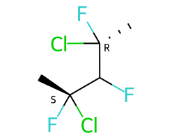

+---------------+---------------+
| |parastereo2| + |parastereo1| |
+---------------+---------------+

Both algorithms recognize that the central carbon is a potential stereocenter in
the molecule on the left, but the old algorithm is unable to recognize it as a
potential stereocenter in the molecule on the right.


Assignment of absolute stereochemistry
--------------------------------------

As of the 2020.09 release the RDKit has two different ways of assigning absolute
stereochemistry labels (CIP labels):

   1. The legacy approach uses an adaptation of an approximate algorithm for
      assigning CIP codes published by Paul Labute, [#labutecip]_. The algorithm
      is reliable for determining whether or not a particular specified
      stereoatom/stereobond actually is a stereoatom/stereobond, but the CIP
      codes which it assigns are only truly correct for simple examples. As of
      the 2020.09 release this is the default algorithm, but this will be
      changed in a future RDKit release. 
   2. The new approach uses an implementation of a much more accurate algorithm, 
      [#newcip]_. The new algorithm is more computationally expensive than the
      old one and does not provide CIP rankings of atoms (the concept of a
      global ranking of atoms isn't well defined within the context of the true
      CIP algorithm). If you're interested in having a chirality-sensitive
      ranking of all atoms, you can use the canonical atom ranking code instead.


Stereogenic atoms/bonds
-----------------------

The definitions of potential stereogenic atoms or bonds is inspired by the InChI definitions.

Stereogenic bonds
^^^^^^^^^^^^^^^^^

A double bond is potentially stereogenic if both atoms have at least two heavy
atom neighbors and it's not present in a ring with less than eight atoms.

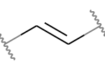
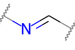

For example, both of these double bonds are candidates for stereochemistry:

+---------+---------+
| |psdb1| + |psdb2| |
+---------+---------+

But this one is not:

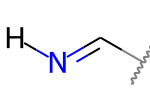


Tetrahedral Stereogenic atoms
^^^^^^^^^^^^^^^^^^^^^^^^^^^^^

The following atom types are potential tetrahedral stereogenic atoms:

  - atoms with degree 4
  - atoms with degree 3 and one implicit H
  - P or As with degree 3 or 4
  - N with degree 3 which is in a ring of size 3 or which is shared between at
    least 3 rings (this last condition is an extension to the InChI rules) 
  - S or Se with degree 3 and a total valence of 4 or a total valence of 3 and a
    net charge of +1.


Brief description of the ``findPotentialStereo()`` algorithm
------------------------------------------------------------

   1. Identify all potential stereogenic atoms and bonds in the molecule. If
      there aren't any we don't need to do anything else.
   2. Foreach potential stereogenic atom: save the original chiral tag and then
      set the chiral tag to CW. Assign an atom symbol that makes this atom
      unique from all others (this will be used below in the canonicalization
      algorithm)
   3. Foreach potential stereogenic bond: assign a bond symbol that makes this
      bond unique from all others (this will be used below in the
      canonicalization algorithm)
   4. Determine the canonical atom ranking taking chirality into account, but
      not breaking ties. This uses the same canonicalization algorithm that's
      used to generate SMILES. [#nadinecanon]_
   5. Remove the chiral tag from any potential stereogenic atom which has two
      identically ranked neighbors and set its symbol to the default for that
      atom
   6. Set the symbol of any double bond which has two identically ranked atoms
      attached to either end [#eitherend]_ to the default for that bond
   7. If steps 5 and 6 modfied any atoms or bonds, loop back to step 4. 
   8. Add any potential stereogenic atom which does not have to identically 
      ranked neighbors to the results 
   9. Add any potential stereogenic atom which does not have two identically
      ranked atoms attached to either end [#eitherend]_ to the results
   10. Return the results

Sources of information about stereochemistry
--------------------------------------------

From SMILES
^^^^^^^^^^^

Atomic stereochemistry can be specified using ``@``, ``@@``, ``@SP``, etc.
Potential stereocenters with no information provided are
``ChiralType::CHI_UNSPECIFIED``.

Double-bond stereochemistry is specfied using ``/`` and ``\`` to indicate the
directionality of the neighboring single bonds. Double bonds with no stereo
information provided are ``BondStereo::STEREONONE``. 


From Mol
^^^^^^^^

Atomic stereochemistry can be specified using wedged bonds if 2D coordinates are
present. If 3D coordinates are present, they are used to set the stereochemistry
for stereogenic atoms. Wiggly bonds (``CFG=2`` in V3000 mol blocks) set the
chiral tag of stereogenic start atom to ``ChiralType::CHI_UNSPECIFIED``.

Double-bond stereochemistry is automatically set using the atomic coordinates;
this is true for both 2D and 3D coordinates. If a stereogenic double bound is
crossed (``CFG=2`` in V3000 mol blocks) or has an adjacent wiggly single bond
(``CFG=2`` in V3000 mol blocks), then it will be ``BondStereo::STEREOANY``.


From CXSMILES
^^^^^^^^^^^^^

An initial stereochemistry assignment is done following the SMILES rules (see above).

A ``w:`` (wiggly bond) specification will set the stereochemistry of the start
atom to ``ChiralType::CHI_UNSPECIFIED`` and double bonds to
``BondStereo::STEREOANY``. Stereochemistry of ring bonds can be set using ``t``,
``c``, or ``ctu``.

If 2D coordinates are present in the CXSMILES, atomic stereo can be set using
```wU``` or ```wD``` to create wedged bonds.

If 3D coordinates are present in the CXSMILES, they are used to set the
stereochemistry for stereogenic atoms and bonds. This supersedes other
specifications in the CXSMILES except for ``ctu`` and ``w``.


.. _Non-tetrahedral-stereo:

Support for non-tetrahedral atomic stereochemistry
==================================================

Starting with the 2022.09 release, the RDKit has partial, but evolving, support
for non-tetrahedral stereochemistry. The status of this work is being tracked in
this github issue: https://github.com/rdkit/rdkit/issues/4851

This code is being released in a preliminary state in order to get feedback as
soon as we can and to start to gather experience working with these systems.


Status as of 2022.09.1 release
------------------------------

"Complete"
^^^^^^^^^^
(Note that since is new territory, the term "complete" should be taken with a
grain of salt.)

- The basic representation
- Parsing SMILES and SMARTS
- Generation of 2D coordinates
- Assignment of non-tetrahedral stereo from 3D structures

Partial
^^^^^^^
- Writing SMILES. The SMILES generated should be correct, but they are not
  canonical.
- Generation of 3D coordinates. The basics here work but the "chirality" of TBP
  and OH structures is not correct.
- Writing mol files. Need wedged bonds for these to actually be done

Totally missing
^^^^^^^^^^^^^^^
- Wedging bonds
- Writing SMARTS
- Substructure search integration
- CIP assignment
- Canonicalization
- Stereochemistry cleanup: recognizing incorrect stereochemistry specifications
- Assignment of non-tetrahedral stereo from 2D structures


SMILES notation
---------------

This discussion of the SMILES notation is drawn heavily from the OpenSMILES
documentation: http://opensmiles.org/opensmiles.html Many thanks to the team
which put that document together and to John Mayfield for his excellent CDK
Depict tool, which I used double check my work on this.


The representation has a tag for what the stereo is, e.g. ``@SP``, and a permutation number.

Square planar
^^^^^^^^^^^^^


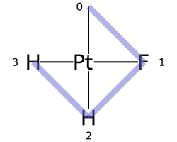
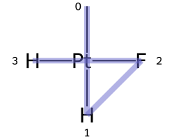
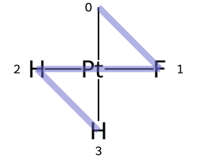

+-----------+-----------+-----------+
|   @SP1    |   @SP2    |   @SP3    |
+===========+===========+===========+
| |nts_sp1| | |nts_sp2| | |nts_sp3| |
+-----------+-----------+-----------+
|     U     |     4     |     Z     |
+-----------+-----------+-----------+


|nts_sp4|


Here are the ligand numberings for the 3 possible permutations of the sample molecule:

======= === === === === ========
 Label   A   B   C   D   SMILES
======= === === === === ========
@SP1     0   1   2   3  ``C[Pt@SP1](F)(Cl)[H]``
@SP2     0   2   1   3  ``C[Pt@SP2](Cl)(F)[H]``
@SP3     0   1   3   2  ``C[Pt@SP3](F)([H])Cl``
======= === === === === ========


Trigonal bipyramidal
^^^^^^^^^^^^^^^^^^^^


Here's a specific example (from the OpenSMILES docs):


|nts_tb2|

Here are the ligand labels and the ligand numbering for ``@TB1``:


|nts_tb1|

And then the ligand numberings for the 20 possible permutations of the sample molecule:

======= === === === === === ========
 Label   A   B   C   D   E   SMILES
======= === === === === === ========
@TB1     0   4   1   2   3   ``S[As@TB1](F)(Cl)(Br)N``
@TB2     0   4   1   3   2   ``S[As@TB2](F)(Br)(Cl)N``

@TB3     0   3   1   2   4   ``S[As@TB3](F)(Cl)(N)Br``
@TB4     0   3   1   4   2   ``S[As@TB4](F)(Br)(N)Cl``

@TB5     0   2   1   3   4   ``S[As@TB5](F)(N)(Cl)Br``
@TB6     0   2   1   4   3   ``S[As@TB6](F)(N)(Br)Cl``

@TB7     0   1   2   3   4   ``S[As@TB7](N)(F)(Cl)Br``
@TB8     0   1   2   4   3   ``S[As@TB8](N)(F)(Br)Cl``

@TB9     1   4   0   2   3   ``F[As@TB9](S)(Cl)(Br)N``
@TB11    1   4   0   3   2   ``F[As@TB11](S)(Br)(Cl)N``

@TB10    1   3   0   2   4   ``F[As@TB10](S)(Cl)(N)Br``
@TB12    1   3   0   4   2   ``F[As@TB12](S)(Br)(N)Cl``

@TB13    1   2   0   3   4   ``F[As@TB13](S)(N)(Cl)Br``
@TB14    1   2   0   4   3   ``F[As@TB14](S)(N)(Br)Cl``

@TB15    2   4   0   1   3   ``F[As@TB15](Cl)(S)(Br)N``
@TB20    2   4   0   3   1   ``F[As@TB20](Br)(S)(Cl)N``

@TB16    2   3   0   1   4   ``F[As@TB16](Cl)(S)(N)Br``
@TB19    2   3   0   4   1   ``F[As@TB19](Br)(S)(N)Cl``

@TB17    3   4   0   1   2   ``F[As@TB17](Cl)(Br)(S)N``
@TB18    3   4   0   2   1   ``F[As@TB18](Br)(Cl)(S)N``

======= === === === === === ========


Octahedral
^^^^^^^^^^

Here's a specific example (an invented molecule):


|nts_oh2|

Here are the ligand labels and the ligand numbering for ``@OH1``:


|nts_oh1|


And then the square planar shape and ligand numberings for the 30 possible permutations of the sample molecule:

======= ==== === === === === === === ========
 Label   SP   A   B   C   D   E   F   SMILES
======= ==== === === === === === === ========
@OH1     U    0   5   1   2   3   4   ``O[Co@OH1](Cl)(C)(N)(F)P``
@OH2     U    0   5   1   4   3   2   ``O[Co@OH2](Cl)(F)(N)(C)P``

@OH3     U    0   4   1   2   3   5   ``O[Co@OH3](Cl)(C)(N)(P)F``
@OH16    U    0   4   1   5   3   2   ``O[Co@OH16](Cl)(F)(N)(P)C``

@OH6     U    0   3   1   2   4   5   ``O[Co@OH6](Cl)(C)(P)(N)F``
@OH18    U    0   3   1   5   4   2   ``O[Co@OH18](Cl)(F)(P)(N)C``

@OH19    U    0   2   1   3   4   5   ``O[Co@OH19](Cl)(P)(C)(N)F``
@OH24    U    0   2   1   5   4   3   ``O[Co@OH24](Cl)(P)(F)(N)C``

@OH25    U    0   1   2   3   4   5   ``O[Co@OH25](P)(Cl)(C)(N)F``
@OH30    U    0   1   2   5   4   3   ``O[Co@OH30](P)(Cl)(F)(N)C``

@OH4     Z    0   5   1   2   4   3   ``O[Co@OH4](Cl)(C)(F)(N)P``
@OH14    Z    0   5   1   3   4   2   ``O[Co@OH14](Cl)(F)(C)(N)P``

@OH5     Z    0   4   1   2   5   3   ``O[Co@OH5](Cl)(C)(F)(P)N``
@OH15    Z    0   4   1   3   5   2   ``O[Co@OH15](Cl)(F)(C)(P)N``

@OH7     Z    0   3   1   2   5   4   ``O[Co@OH7](Cl)(C)(P)(F)N``
@OH17    Z    0   3   1   4   5   2   ``O[Co@OH17](Cl)(F)(P)(C)N``

@OH20    Z    0   2   1   3   5   4   ``O[Co@OH20](Cl)(P)(C)(F)N``
@OH23    Z    0   2   1   4   5   3   ``O[Co@OH23](Cl)(P)(F)(C)N``

@OH26    Z    0   1   2   3   5   4   ``O[Co@OH26](P)(Cl)(C)(F)N``
@OH29    Z    0   1   2   4   5   3   ``O[Co@OH29](P)(Cl)(F)(C)N``

@OH10    4    0   5   1   4   2   3   ``O[Co@OH10](Cl)(N)(F)(C)P``
@OH8     4    0   5   1   3   2   4   ``O[Co@OH8](Cl)(N)(C)(F)P``

@OH11    4    0   4   1   5   2   3   ``O[Co@OH11](Cl)(N)(F)(P)C``
@OH9     4    0   4   1   3   2   5   ``O[Co@OH9](Cl)(N)(C)(P)F``

@OH13    4    0   3   1   4   2   4   ``O[Co@OH13](Cl)(N)(P)(F)C``
@OH12    4    0   3   1   4   2   5   ``O[Co@OH12](Cl)(N)(P)(C)F``

@OH22    4    0   2   1   5   3   4   ``O[Co@OH22](Cl)(P)(N)(F)C``
@OH21    4    0   2   1   4   3   5   ``O[Co@OH21](Cl)(P)(N)(C)F``

@OH28    4    0   1   2   5   3   4   ``O[Co@OH28](P)(Cl)(N)(F)C``
@OH27    4    0   1   2   4   3   5   ``O[Co@OH27](P)(Cl)(N)(C)F``
======= ==== === === === === === === ========


Duplicate ligands
^^^^^^^^^^^^^^^^^

One of the major differences between non-tetrahedral stereochemistry and the
tetrahedral variant is that it's possible to have non-tetrahedral stereo with
central atoms which have duplicate ligands.

The classic example of this is cis-platin - ``Cl[Pt@SP1](Cl)(<-[NH3])<-[NH3]`` - vs trans-platin  - ``Cl[Pt@SP2](Cl)(<-[NH3])<-[NH3]`` - 


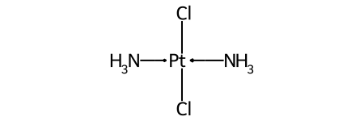


=================================== ====================================
 |nts_ex1|                           |nts_ex2| 
=================================== ====================================
``Cl[Pt@SP1](Cl)(<-[NH3])<-[NH3]``   ``Cl[Pt@SP2](Cl)(<-[NH3])<-[NH3]``
=================================== ====================================


Treatment of implicit Hs
^^^^^^^^^^^^^^^^^^^^^^^^

Implicit Hs are treated the same as in tetrahedral stereo: as if they are the
first neighbors after the central atom. So the two smiles ``C[Pt@SP1H](Cl)F``
and ``C[Pt@SP1]([H])(Cl)F`` corresponds to the same structure.

This also works with multiple implicit Hs: ``C[Pt@SP1H2]Cl`` and ``C[Pt@SP1]([H])([H])Cl`` are equivalent.


Missing ligands
^^^^^^^^^^^^^^^

Coordination environments with missing ligands are treated as if the missing ligands were at the end of the ligand ordering.
For example, this invented complex can be presented with the SMILES ``O[Mn@OH1](Cl)(C)(N)F``.

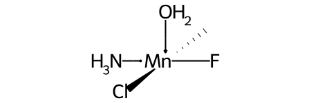

|nts_missing1|

Compare this to the SMILES for the related complex shown above in the discussion of ``@OH`` stereo.


Chemical Reaction Handling
**************************

Reaction SMARTS
===============

Not SMIRKS [#smirks]_ , not reaction SMILES [#smiles]_, derived from SMARTS [#smarts]_.


The general grammar for a reaction SMARTS is :

.. productionlist::
  reaction:  reactants ">>" products
  reactants: molecules
  products:  molecules
  molecules: molecule
           : molecules "." molecule
  molecule:  a valid SMARTS string without "." characters
          :  "(" a valid SMARTS string without "." characters ")"


Some features
-------------

Mapped dummy atoms in the product template are replaced by the corresponding atom in the reactant:

.. doctest::

  >>> from rdkit.Chem import AllChem
  >>> rxn = AllChem.ReactionFromSmarts('[C:1]=[O,N:2]>>[C:1][*:2]')
  >>> [Chem.MolToSmiles(x,1) for x in rxn.RunReactants((Chem.MolFromSmiles('CC=O'),))[0]]
  ['CCO']
  >>> [Chem.MolToSmiles(x,1) for x in rxn.RunReactants((Chem.MolFromSmiles('CC=N'),))[0]]
  ['CCN']

but unmapped dummy atoms are left as dummies:

.. doctest::

  >>> rxn = AllChem.ReactionFromSmarts('[C:1]=[O,N:2]>>*[C:1][*:2]')
  >>> [Chem.MolToSmiles(x,1) for x in rxn.RunReactants((Chem.MolFromSmiles('CC=O'),))[0]]
  ['*C(C)O']

“Any” bonds in the products are replaced by the corresponding bond in the reactant:

.. doctest::

  >>> rxn = AllChem.ReactionFromSmarts('[C:1]~[O,N:2]>>*[C:1]~[*:2]')
  >>> [Chem.MolToSmiles(x,1) for x in rxn.RunReactants((Chem.MolFromSmiles('C=O'),))[0]]
  ['*C=O']
  >>> [Chem.MolToSmiles(x,1) for x in rxn.RunReactants((Chem.MolFromSmiles('CO'),))[0]]
  ['*CO']
  >>> [Chem.MolToSmiles(x,1) for x in rxn.RunReactants((Chem.MolFromSmiles('C#N'),))[0]]
  ['*C#N']

Intramolecular reactions can be expressed flexibly by including
reactants in parentheses. This is demonstrated in this ring-closing
metathesis example [#intramolRxn]_:

.. doctest::

  >>> rxn = AllChem.ReactionFromSmarts("([C:1]=[C;H2].[C:2]=[C;H2])>>[*:1]=[*:2]")
  >>> m1 = Chem.MolFromSmiles('C=CCOCC=C')
  >>> ps = rxn.RunReactants((m1,))
  >>> Chem.MolToSmiles(ps[0][0])
  'C1=CCOC1'


Chirality
---------

This section describes how chirality information in the reaction
defition is handled. A consistent example, esterification of secondary
alcohols, is used throughout [#chiralRxn]_.

If no chiral information is present in the reaction definition, the
stereochemistry of the reactants is preserved, as is membership in
enhanced stereo groups:

.. doctest::

  >>> alcohol1 = Chem.MolFromSmiles('CC(CCN)O')
  >>> alcohol2 = Chem.MolFromSmiles('C[C@H](CCN)O')
  >>> alcohol3 = Chem.MolFromSmiles('C[C@@H](CCN)O')
  >>> acid = Chem.MolFromSmiles('CC(=O)O')
  >>> rxn = AllChem.ReactionFromSmarts('[CH1:1][OH:2].[OH][C:3]=[O:4]>>[C:1][O:2][C:3]=[O:4]')
  >>> ps=rxn.RunReactants((alcohol1,acid))
  >>> Chem.MolToSmiles(ps[0][0],True)
  'CC(=O)OC(C)CCN'
  >>> ps=rxn.RunReactants((alcohol2,acid))
  >>> Chem.MolToSmiles(ps[0][0],True)
  'CC(=O)O[C@H](C)CCN'
  >>> ps=rxn.RunReactants((alcohol3,acid))
  >>> Chem.MolToSmiles(ps[0][0],True)
  'CC(=O)O[C@@H](C)CCN'

You get the same result (retention of stereochemistry) if a mapped atom has the same chirality
in both reactants and products:

.. doctest::

  >>> rxn = AllChem.ReactionFromSmarts('[C@H1:1][OH:2].[OH][C:3]=[O:4]>>[C@:1][O:2][C:3]=[O:4]')
  >>> ps=rxn.RunReactants((alcohol1,acid))
  >>> Chem.MolToSmiles(ps[0][0],True)
  'CC(=O)OC(C)CCN'
  >>> ps=rxn.RunReactants((alcohol2,acid))
  >>> Chem.MolToSmiles(ps[0][0],True)
  'CC(=O)O[C@H](C)CCN'
  >>> ps=rxn.RunReactants((alcohol3,acid))
  >>> Chem.MolToSmiles(ps[0][0],True)
  'CC(=O)O[C@@H](C)CCN'

A mapped atom with different chirality in reactants and products leads
to inversion of stereochemistry:

.. doctest::

  >>> rxn = AllChem.ReactionFromSmarts('[C@H1:1][OH:2].[OH][C:3]=[O:4]>>[C@@:1][O:2][C:3]=[O:4]')
  >>> ps=rxn.RunReactants((alcohol1,acid))
  >>> Chem.MolToSmiles(ps[0][0],True)
  'CC(=O)OC(C)CCN'
  >>> ps=rxn.RunReactants((alcohol2,acid))
  >>> Chem.MolToSmiles(ps[0][0],True)
  'CC(=O)O[C@@H](C)CCN'
  >>> ps=rxn.RunReactants((alcohol3,acid))
  >>> Chem.MolToSmiles(ps[0][0],True)
  'CC(=O)O[C@H](C)CCN'

If a mapped atom has chirality specified in the reactants, but not
in the products, the reaction destroys chirality at that center:

.. doctest::

  >>> rxn = AllChem.ReactionFromSmarts('[C@H1:1][OH:2].[OH][C:3]=[O:4]>>[C:1][O:2][C:3]=[O:4]')
  >>> ps=rxn.RunReactants((alcohol1,acid))
  >>> Chem.MolToSmiles(ps[0][0],True)
  'CC(=O)OC(C)CCN'
  >>> ps=rxn.RunReactants((alcohol2,acid))
  >>> Chem.MolToSmiles(ps[0][0],True)
  'CC(=O)OC(C)CCN'
  >>> ps=rxn.RunReactants((alcohol3,acid))
  >>> Chem.MolToSmiles(ps[0][0],True)
  'CC(=O)OC(C)CCN'

And, finally, if chirality is specified in the products, but not the
reactants, the reaction creates a stereocenter with the specified
chirality:

.. doctest::

  >>> rxn = AllChem.ReactionFromSmarts('[CH1:1][OH:2].[OH][C:3]=[O:4]>>[C@:1][O:2][C:3]=[O:4]')
  >>> ps=rxn.RunReactants((alcohol1,acid))
  >>> Chem.MolToSmiles(ps[0][0],True)
  'CC(=O)O[C@H](C)CCN'
  >>> ps=rxn.RunReactants((alcohol2,acid))
  >>> Chem.MolToSmiles(ps[0][0],True)
  'CC(=O)O[C@H](C)CCN'
  >>> ps=rxn.RunReactants((alcohol3,acid))
  >>> Chem.MolToSmiles(ps[0][0],True)
  'CC(=O)O[C@H](C)CCN'

This doesn't make sense without including a bit more
context around the stereocenter in the reaction definition:

.. doctest::

  >>> rxn = AllChem.ReactionFromSmarts('[CH3:5][CH1:1]([C:6])[OH:2].[OH][C:3]=[O:4]>>[C:5][C@:1]([C:6])[O:2][C:3]=[O:4]')
  >>> ps=rxn.RunReactants((alcohol1,acid))
  >>> Chem.MolToSmiles(ps[0][0],True)
  'CC(=O)O[C@H](C)CCN'
  >>> ps=rxn.RunReactants((alcohol2,acid))
  >>> Chem.MolToSmiles(ps[0][0],True)
  'CC(=O)O[C@H](C)CCN'
  >>> ps=rxn.RunReactants((alcohol3,acid))
  >>> Chem.MolToSmiles(ps[0][0],True)
  'CC(=O)O[C@H](C)CCN'

Note that the chirality specification is not being used as part of the
query: a molecule with no chirality specified can match a reactant
with specified chirality.

In general, the reaction machinery tries to preserve as much
stereochemistry information as possible. This works when a single new
bond is formed to a chiral center:

.. doctest::

  >>> rxn = AllChem.ReactionFromSmarts('[C:1][C:2]-O>>[C:1][C:2]-S')
  >>> alcohol2 = Chem.MolFromSmiles('C[C@@H](O)CCN')
  >>> ps=rxn.RunReactants((alcohol2,))
  >>> Chem.MolToSmiles(ps[0][0],True)
  'C[C@@H](S)CCN'

But it fails if two or more bonds are formed:

.. doctest::

  >>> rxn = AllChem.ReactionFromSmarts('[C:1][C:2](-O)-F>>[C:1][C:2](-S)-Cl')
  >>> alcohol = Chem.MolFromSmiles('C[C@@H](O)F')
  >>> ps=rxn.RunReactants((alcohol,))
  >>> Chem.MolToSmiles(ps[0][0],True)
  'CC(S)Cl'

In this case, there's just not sufficient information present to allow
the information to be preserved. You can help by providing mapping
information:

**Some caveats** We made this code as robust as we can, but this is a
non-trivial problem and it's certainly possible to get surprising results.

Things get tricky if atom ordering around a chiral center changes in the reaction SMARTS. 
Here are some of the situations that are currently handled correctly.

Reordering of the neighbors, but the number and atom mappings of neighbors
remains constant. In this case there is no inversion of chirality even though
the chiral tag on the chiral atom changes between the reactants and products:

.. doctest::

  >>> rxn = AllChem.ReactionFromSmarts('[C:1][C@:2]([F:3])[Br:4]>>[C:1][C@@:2]([S:4])[F:3]')
  >>> mol = Chem.MolFromSmiles('C[C@@H](F)Br')
  >>> ps=rxn.RunReactants((mol,))
  >>> Chem.MolToSmiles(ps[0][0],True)
  'C[C@@H](F)S'

Adding a neighbor to a chiral atom.

.. doctest::

  >>> rxn = AllChem.ReactionFromSmarts('[C:1][C@H:2]([F:3])[Br:4]>>[C:1][C@@:2](O)([F:3])[Br:4]')
  >>> mol = Chem.MolFromSmiles('C[C@@H](F)Br')
  >>> ps=rxn.RunReactants((mol,))
  >>> Chem.MolToSmiles(ps[0][0],True)
  'C[C@](O)(F)Br'

Removing a neighbor from a chiral atom.

.. doctest::

  >>> rxn = AllChem.ReactionFromSmarts('[C:1][C@:2](O)([F:3])[Br:4]>>[C:1][C@@H:2]([F:3])[Br:4]')
  >>> mol = Chem.MolFromSmiles('C[C@@](O)(F)Br')
  >>> ps=rxn.RunReactants((mol,))
  >>> Chem.MolToSmiles(ps[0][0],True)
  'C[C@H](F)Br'


Rules and warnings
------------------

1. Include atom map information at the end of an atom query.
   So do [C,N,O:1] or [C;R:1].

2. Don't forget that unspecified bonds in SMARTS are either single or aromatic.
   Bond orders in product templates are assigned when the product template itself is constructed and it's not always possible to tell if the bond should be single or aromatic:

.. doctest::

  >>> rxn = AllChem.ReactionFromSmarts('[#6:1][#7,#8:2]>>[#6:1][#6:2]')
  >>> [Chem.MolToSmiles(x,1) for x in rxn.RunReactants((Chem.MolFromSmiles('C1NCCCC1'),))[0]]
  ['C1CCCCC1']
  >>> [Chem.MolToSmiles(x,1) for x in rxn.RunReactants((Chem.MolFromSmiles('c1ncccc1'),))[0]]
  ['c1ccccc-1']

  So if you want to copy the bond order from the reactant, use an “Any” bond:

.. doctest::

  >>> rxn = AllChem.ReactionFromSmarts('[#6:1][#7,#8:2]>>[#6:1]~[#6:2]')
  >>> [Chem.MolToSmiles(x,1) for x in rxn.RunReactants((Chem.MolFromSmiles('c1ncccc1'),))[0]]
  ['c1ccccc1']


The Feature Definition File Format
**********************************

An FDef file contains all the information needed to define a set of chemical features.
It contains definitions of feature types that are defined from queries built up using Daylight's SMARTS language. [#smarts]_ The FDef file can optionally also include definitions of atom types that are used to make feature definitions more readable.


Chemical Features
=================

Chemical features are defined by a Feature Type and a Feature Family.
The Feature Family is a general classification of the feature (such as "Hydrogen-bond Donor" or "Aromatic") while the Feature Type provides additional, higher-resolution, information about features.
Pharmacophore matching is done using Feature Family's. Each feature type contains the following pieces of information:

- A SMARTS pattern that describes atoms (one or more) matching the feature type.
- Weights used to determine the feature's position based on the positions of its defining atoms.


Syntax of the FDef file
=======================


AtomType definitions
--------------------

An AtomType definition allows you to assign a shorthand name to be used in place of a SMARTS string defining an atom query.
This allows FDef files to be made much more readable.
For example, defining a non-polar carbon atom like this::

  AtomType Carbon_NonPolar [C&!$(C=[O,N,P,S])&!$(C#N)]

creates a new name that can be used anywhere else in the FDef file that it would be useful to use this SMARTS.
To reference an AtomType, just include its name in curly brackets.
For example, this excerpt from an FDef file defines another atom type - Hphobe - which references the Carbon_NonPolar definition::

  AtomType Carbon_NonPolar [C&!$(C=[O,N,P,S])&!$(C#N)]
  AtomType Hphobe [{Carbon_NonPolar},c,s,S&H0&v2,F,Cl,Br,I]

Note that ``{Carbon_NonPolar}`` is used in the new AtomType definition without any additional decoration (no square brackes or recursive SMARTS markers are required).


Repeating an AtomType results in the two definitions being combined using the SMARTS "," (or) operator.
Here's an example::

  AtomType d1 [N&!H0]
  AtomType d1 [O&!H0]

This is equivalent to::

  AtomType d1 [N&!H0,O&!H0]

Which is equivalent to the more efficient::

  AtomType d1 [N,O;!H0]

**Note** that these examples tend to use SMARTS's high-precedence and operator "&" and not the low-precedence and ";".
This can be important when AtomTypes are combined or when they are repeated.
The SMARTS "," operator is higher precedence than ";", so definitions that use ";" can lead to unexpected results.


It is also possible to define negative AtomType queries::

  AtomType d1 [N,O,S]
  AtomType !d1 [H0]

The negative query gets combined with the first to produce a definition identical to this::

  AtomType d1 [!H0;N,O,S]

Note that the negative AtomType is added to the beginning of the query.


Feature definitions
-------------------

A feature definition is more complex than an AtomType definition and stretches across multiple lines::

  DefineFeature HDonor1 [N,O;!H0]
  Family HBondDonor
  Weights 1.0
  EndFeature

The first line of the feature definition includes the feature type and the SMARTS string defining the feature.
The next two lines (order not important) define the feature's family and its atom weights (a comma-delimited list that is the same length as the number of atoms defining the feature).
The atom weights are used to calculate the feature's locations based on a weighted average of the positions of the atom defining the feature.
More detail on this is provided below.
The final line of a feature definition must be EndFeature.
It is perfectly legal to mix AtomType definitions with feature definitions in the FDef file.
The one rule is that AtomTypes must be defined before they are referenced.


Additional syntax notes:
------------------------

- Any line that begins with a # symbol is considered a comment and will be ignored.
- A backslash character, \, at the end of a line is a continuation character, it indicates that the data from that line is continued on the next line of the file.  Blank space at the beginning of these additional lines is ignored. For example, this AtomType definition::

    AtomType tButylAtom [$([C;!R](-[CH3])(-[CH3])(-[CH3])),\
    $([CH3](-[C;!R](-[CH3])(-[CH3])))]

  is exactly equivalent to this one::

    AtomType tButylAtom [$([C;!R](-[CH3])(-[CH3])(-[CH3])),$([CH3](-[C;!R](-[CH3])(-[CH3])))]

  (though the first form is much easier to read!)


Atom weights and feature locations
----------------------------------


Frequently Asked Question(s)
============================

- What happens if a Feature Type is repeated in the file? Here's an example::

    DefineFeature HDonor1 [O&!H0]
    Family HBondDonor
    Weights 1.0
    EndFeature

    DefineFeature HDonor1 [N&!H0]
    Family HBondDonor
    Weights 1.0
    EndFeature

  In this case both definitions of the HDonor1 feature type will be active.
  This is functionally identical to::

    DefineFeature HDonor1 [O,N;!H0]
    Family HBondDonor
    Weights 1.0
    EndFeature

  **However** the formulation of this feature definition with a duplicated feature type is considerably less efficient and more confusing than the simpler combined definition.


Representation of Pharmacophore Fingerprints
********************************************

In the RDKit scheme the bit ids in pharmacophore fingerprints are not hashed: each bit corresponds to a particular combination of features and distances.
A given bit id can be converted back to the corresponding feature types and distances to allow interpretation.
An illustration for 2D pharmacophores is shown in :ref:`ph4_figure`.

.. _ph4_figure :

.. figure:: images/picture_10.jpg
  :scale: 50 %

  Figure 1:   Bit numbering in pharmacophore fingerprints

Atom-Atom Matching in Substructure Queries
******************************************

When doing substructure matches for queries derived from SMARTS the
rules for which atoms in the molecule should match which atoms in the
query are well defined.[#smarts]_  The same is not necessarily the
case when the query molecule is derived from a mol block or SMILES.

The general rule used in the RDKit is that if you
don't specify a property in the query, then it's not used as part of
the matching criteria and that Hs are ignored.
This leads to the following behavior:

+----------+---------+-------+
| Molecule | Query   | Match |
+==========+=========+=======+
| CCO      | CCO     | Yes   |
+----------+---------+-------+
| CC[O-]   | CCO     | Yes   |
+----------+---------+-------+
| CCO      | CC[O-]  | No    |
+----------+---------+-------+
| CC[O-]   | CC[O-]  | Yes   |
+----------+---------+-------+
| CC[O-]   | CC[OH]  | Yes   |
+----------+---------+-------+
| CCOC     | CC[OH]  | Yes   |
+----------+---------+-------+
| CCOC     | CCO     | Yes   |
+----------+---------+-------+
| CCC      | CCC     | Yes   |
+----------+---------+-------+
| CC[14C]  | CCC     | Yes   |
+----------+---------+-------+
| CCC      | CC[14C] | No    |
+----------+---------+-------+
| CC[14C]  | CC[14C] | Yes   |
+----------+---------+-------+
| OCO      | C       | Yes   |
+----------+---------+-------+
| OCO      | [CH]    | No    |
+----------+---------+-------+
| OCO      | [CH2]   | No    |
+----------+---------+-------+
| OCO      | [CH3]   | No    |
+----------+---------+-------+
| OCO      | O[CH3]  | Yes   |
+----------+---------+-------+
| O[CH2]O  | C       | Yes   |
+----------+---------+-------+
| O[CH2]O  | [CH2]   | No    |
+----------+---------+-------+

Demonstrated here:

.. doctest::

  >>> Chem.MolFromSmiles('CCO').HasSubstructMatch(Chem.MolFromSmiles('CCO'))
  True
  >>> Chem.MolFromSmiles('CC[O-]').HasSubstructMatch(Chem.MolFromSmiles('CCO'))
  True
  >>> Chem.MolFromSmiles('CCO').HasSubstructMatch(Chem.MolFromSmiles('CC[O-]'))
  False
  >>> Chem.MolFromSmiles('CC[O-]').HasSubstructMatch(Chem.MolFromSmiles('CC[O-]'))
  True
  >>> Chem.MolFromSmiles('CC[O-]').HasSubstructMatch(Chem.MolFromSmiles('CC[OH]'))
  True
  >>> Chem.MolFromSmiles('CCOC').HasSubstructMatch(Chem.MolFromSmiles('CC[OH]'))
  True
  >>> Chem.MolFromSmiles('CCOC').HasSubstructMatch(Chem.MolFromSmiles('CCO'))
  True
  >>> Chem.MolFromSmiles('CCC').HasSubstructMatch(Chem.MolFromSmiles('CCC'))
  True
  >>> Chem.MolFromSmiles('CC[14C]').HasSubstructMatch(Chem.MolFromSmiles('CCC'))
  True
  >>> Chem.MolFromSmiles('CCC').HasSubstructMatch(Chem.MolFromSmiles('CC[14C]'))
  False
  >>> Chem.MolFromSmiles('CC[14C]').HasSubstructMatch(Chem.MolFromSmiles('CC[14C]'))
  True
  >>> Chem.MolFromSmiles('OCO').HasSubstructMatch(Chem.MolFromSmiles('C'))
  True
  >>> Chem.MolFromSmiles('OCO').HasSubstructMatch(Chem.MolFromSmiles('[CH]'))
  False
  >>> Chem.MolFromSmiles('OCO').HasSubstructMatch(Chem.MolFromSmiles('[CH2]'))
  False
  >>> Chem.MolFromSmiles('OCO').HasSubstructMatch(Chem.MolFromSmiles('[CH3]'))
  False
  >>> Chem.MolFromSmiles('OCO').HasSubstructMatch(Chem.MolFromSmiles('O[CH3]'))
  True
  >>> Chem.MolFromSmiles('O[CH2]O').HasSubstructMatch(Chem.MolFromSmiles('C'))
  True
  >>> Chem.MolFromSmiles('O[CH2]O').HasSubstructMatch(Chem.MolFromSmiles('[CH2]'))
  False

Generic ("Markush") queries in substructure matching
****************************************************

*Note* This section describes functionality added in the `2022.03.1` release of the RDKit.

The RDKit supports a set of generic queries used as part of the Beilstein and
Reaxys systems. Here's an example:

.. _ary_group_figure :

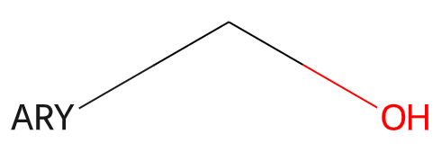


Information about generic queries can be read in from CXSMILES or V3000 Mol
blocks (as `SUP` SGroups) and then calling the function
`Chem.SetGenericQueriesFromProperties()` with the molecule to be modified as an
argument. These features are not used by default when doing substructure
queries, but can be enabled by setting the option
`SubstructMatchParameters.useGenericMatchers` to `True`


Here's an example of using the features:

.. doctest::

  >>> q = Chem.MolFromSmarts('OC* |$;;ARY$|')
  >>> Chem.SetGenericQueriesFromProperties(q)
  >>> Chem.MolFromSmiles('C1CCCCC1CO').HasSubstructMatch(q)
  True
  >>> Chem.MolFromSmiles('c1ccccc1CO').HasSubstructMatch(q)
  True
  >>> ps = Chem.SubstructMatchParameters()
  >>> ps.useGenericMatchers = True
  >>> Chem.MolFromSmiles('C1CCCCC1CO').HasSubstructMatch(q,ps)
  False
  >>> Chem.MolFromSmiles('c1ccccc1CO').HasSubstructMatch(q,ps)
  True


Here are the supported groups and a brief description of what they mean:

 =========================  =========
  Alkyl (ALK)               alkyl side chains (not an H atom)
  AlkylH (ALH)              alkyl side chains including an H atom
  Alkenyl (AEL)             alkenyl side chains      
  AlkenylH (AEH)            alkenyl side chains or an H atom 
  Alkynyl (AYL)             alkynyl side chains               
  AlkynylH (AYH)            alkynyl side chains or an H atom
  Alkoxy (AOX)              alkoxy side chains           
  AlkoxyH (AOH)             alkoxy side chains or an H atom
  Carbocyclic (CBC)         carbocyclic side chains
  CarbocyclicH (CBH)        carbocyclic side chains or an H atom
  Carbocycloalkyl (CAL)     cycloalkyl side chains
  CarbocycloalkylH (CAH)    cycloalkyl side chains or an H atom
  Carbocycloalkenyl (CEL)   cycloalkenyl side chains
  CarbocycloalkenylH (CEH)  cycloalkenyl side chains or an H atom
  Carboaryl (ARY)           all-carbon aryl side chains
  CarboarylH (ARH)          all-carbon aryl side chains or an H atom
  Cyclic (CYC)              cyclic side chains
  CyclicH (CYH)             cyclic side chains or an H atom
  Acyclic(ACY)              acyclic side chains (not an H atom)
  AcyclicH (ACH)            acyclic side chains or an H atom
  Carboacyclic (ABC)        all-carbon acyclic side chains
  CarboacyclicH (ABH)       all-carbon acyclic side chains or an H atom
  Heteroacyclic (AHC)       acyclic side chains with at least one heteroatom
  HeteroacyclicH (AHH)      acyclic side chains with at least one heteroatom or an H atom
  Heterocyclic (CHC)        cyclic side chains with at least one heteroatom
  HeterocyclicH (CHH)       cyclic side chains with at least one heteroatom or an H atom
  Heteroaryl (HAR)          aryl side chains with at least one heteroatom
  HeteroarylH (HAH)         aryl side chains with at least one heteroatom or an H atom
  NoCarbonRing (CXX)        ring containing no carbon atoms
  NoCarbonRingH (CXH)       ring containing no carbon atoms or an H atom
  Group (G)                 any group (not H atom)
  GroupH (GH)               any group (including H atom)
  Group* (G*)               any group with a ring closure
  GroupH* (GH*)             any group with a ring closure or an H atom
 =========================  =========
 
For more detailed descriptions, look at the documentation for the C++ file GenericGroups.h


Molecular Sanitization
**********************

The molecule parsing functions all, by default, perform a "sanitization"
operation on the molecules read. The idea is to generate useful computed
properties (like hybridization, ring membership, etc.) for the rest of the code
and to ensure that the molecules are "reasonable": that they can be represented
with octet-complete Lewis dot structures.

Here are the steps involved, in order.

  1. ``clearComputedProps``: removes any computed properties that already exist
      on the molecule and its atoms and bonds. This step is always performed.

  2. ``cleanUp``: standardizes a small number of non-standard valence states.
     The clean up operations are:

      - Neutral 5 valent Ns with double bonds to Os are converted
        to the zwitterionic form.
        Example: ``N(=O)=O -> [N+](=O)O-]``

      - Neutral 5 valent Ns with triple bonds to another N are converted
        to the zwitterionic form.
        Example: ``C-N=N#N -> C-N=[N+]=[N-]``

      - Neutral 5 valent phosphorus with one double bond to an O and another to
        either a C or a P are converted to the zwitterionic form.
        Example: ``C=P(=O)O -> C=[P+]([O-])O``

      - Neutral Cl, Br, or I with exclusively O neighbors, and a valence of 3,
        5, or 7, are converted to the zwitterionic form. This covers things
        like chlorous acid, chloric acid, and perchloric acid.
        Example: ``O=Cl(=O)O -> [O-][Cl+2][O-]O``

     This step should not generate exceptions.
  3. ``cleanUpOrganometallics``: standardizes a small number of non-standard
     situations encountered in organometallics. The cleanup operations are:

       - replaces single bonds from hypervalent atoms to metals with dative bonds.

     This step should not generate exceptions.

  4. ``updatePropertyCache``: calculates the explicit and implicit valences on
     all atoms. This generates exceptions for atoms in higher-than-allowed
     valence states. This step is always performed, but if it is "skipped"
     the test for non-standard valences will not be carried out.

  5. ``symmetrizeSSSR``: calls the symmetrized smallest set of smallest rings
     algorithm (discussed in the Getting Started document).

  6. ``Kekulize``: converts aromatic rings to their Kekule form. Will raise an
     exception if a ring cannot be kekulized or if aromatic bonds are found
     outside of rings.

  7. ``assignRadicals``: determines the number of radical electrons (if any) on
     each atom.

  8. ``setAromaticity``: identifies the aromatic rings and ring systems
     (see above), sets the aromatic flag on atoms and bonds, sets bond orders
     to aromatic.

  9. ``setConjugation``: identifies which bonds are conjugated

  10. ``setHybridization``: calculates the hybridization state of each atom

  11. ``cleanupChirality``: removes chiral tags from atoms that are not sp3
      hybridized.

  12. ``adjustHs``: adds explicit Hs where necessary to preserve the chemistry.
      This is typically needed for heteroatoms in aromatic rings. The classic
      example is the nitrogen atom in pyrrole.

  13. ``updatePropertyCache``: re-calculates the explicit and implicit valences on
     all atoms. This generates exceptions for atoms in higher-than-allowed
     valence states. This step is required to catch some edge cases where input 
     atoms with non-physical valences are accepted if they are flagged as aromatic.


The individual steps can be toggled on or off when calling
``MolOps::sanitizeMol`` or ``Chem.SanitizeMol``.

JSON Support
************

The RDKit supports writing to/reading from two closely related JSON formats: 
commonchem (https://github.com/CommonChem/CommonChem) and rdkitjson. commonchem is a well-documented format designed to be used for efficient interchange between molecular toolkits. rdkitjson is an extension to commonchem which includes additional features allowing RDKit molecules to be serialized to JSON. The extensions in rdkitjson - enhanced stereo and substance groups - are generally useful, so it's easy to imagine them being integrated into commonchem at some point in the future.

Lists of molecules can be converted to JSON with ``MolInterchange::MolsToJSONData()`` (C++) or ``Chem.MolsToJSONData()`` (Python). Those calls take an optional parameters object which can be used to specify whether commonchem or rdkitjson is generated. The default is to generate rdkitjson.

JSON data can be converted back to RDKit molecules using ``MolInterchange::JSONDataToMols()`` (C++) or ``Chem.JSONDataToMols()`` (Python). The parser will automatically determine whether or not its working with commonchem or rdkitjson.

rdkitjson format
================

Enhanced stereo 
---------------

Here's the rdkitjson representation of the stereo groups from the molecule ``C[C@@H]1C([C@H](O)F)O[C@H](C)C([C@@H](O)F)[C@@H]1C |a:7,o1:3,10,&1:1,&2:13|``::

   'stereoGroups': [{'type': 'abs', 'atoms': [7]},
    {'type': 'or', 'atoms': [3, 10]},
    {'type': 'and', 'atoms': [1]},
    {'type': 'and', 'atoms': [13]}],

Substance groups 
----------------

Here's the rdkitjson representation of a ``SUP`` substance group::

   'substanceGroups': [{'properties': {'TYPE': 'SUP',
      'index': 1,
      'LABEL': 'Boc',
      'DATAFIELDS': '[]'},
     'atoms': [7, 8, 9, 10, 11, 12, 13],
     'bonds': [8],
     'brackets': [[[6.24, -2.9, 0.0], [6.24, -2.9, 0.0], [0.0, 0.0, 0.0]]],
     'cstates': [{'bond': 8, 'vector': [0.0, 0.82, 0.0]}],
     'attachPoints': [{'aIdx': 12, 'lvIdx': 5, 'id': '1'}]}],


and one for an ``SRU`` group::
 
   'substanceGroups': [{'properties': {'TYPE': 'SRU',
      'index': 1,
      'CONNECT': 'HT',
      'LABEL': 'n',
      'DATAFIELDS': '[]'},
     'atoms': [2, 1, 4],
     'bonds': [2, 0],
     'brackets': [[[-3.9538, 4.3256, 0.0],
                   [-3.0298, 2.7252, 0.0],
                   [0.0, 0.0, 0.0]],
                  [[-5.4618, 2.8611, 0.0], 
                   [-6.3858, 4.4615, 0.0], 
                   [0.0, 0.0, 0.0]]]}],
 

Implementation Details
**********************

"Magic" Property Values
=======================

The following property values are regularly used in the RDKit codebase and may be useful to client code.

ROMol  (Mol in Python)
------------------------

+------------------------+---------------------------------------------------+
| Property Name          | Use                                               |
+========================+===================================================+
| MolFileComments        |   Read from/written to the comment line of CTABs. |
+------------------------+---------------------------------------------------+
| MolFileInfo            |   Read from/written to the info line of CTABs.    |
+------------------------+---------------------------------------------------+
| _MolFileChiralFlag     |   Read from/written to the chiral flag of CTABs.  |
+------------------------+---------------------------------------------------+
| _Name                  |   Read from/written to the name line of CTABs.    |
+------------------------+---------------------------------------------------+
| _smilesAtomOutputOrder |   The order in which atoms were written to SMILES |
+------------------------+---------------------------------------------------+
| _smilesBondOutputOrder |   The order in which bonds were written to SMILES |
+------------------------+---------------------------------------------------+

Atom
----

+------------------------+-------------------------------------------------------------------------------------------------+
| Property Name          | Use                                                                                             |
+========================+=================================================================================================+
| _CIPCode               | the CIP code (R or S) of the atom                                                               |
+------------------------+-------------------------------------------------------------------------------------------------+
| _CIPRank               | the integer CIP rank of the atom                                                                |
+------------------------+-------------------------------------------------------------------------------------------------+
| _ChiralityPossible     | set if an atom is a possible chiral center                                                      |
+------------------------+-------------------------------------------------------------------------------------------------+
| _MolFileRLabel         | integer R group label for an atom, read from/written to CTABs.                                  |
+------------------------+-------------------------------------------------------------------------------------------------+
| _ReactionDegreeChanged | set on an atom in a product template of a reaction if its degree changes in the reaction        |
+------------------------+-------------------------------------------------------------------------------------------------+
| _protected             | atoms with this property set will not be considered as matching reactant queries in reactions   |
+------------------------+-------------------------------------------------------------------------------------------------+
| dummyLabel             | (on dummy atoms) read from/written to CTABs as the atom symbol                                  |
+------------------------+-------------------------------------------------------------------------------------------------+
| molAtomMapNumber       | the atom map number for an atom, read from/written to SMILES and CTABs                          |
+------------------------+-------------------------------------------------------------------------------------------------+
| molfileAlias           | the mol file alias for an atom (follows A tags), read from/written to CTABs                     |
+------------------------+-------------------------------------------------------------------------------------------------+
| molFileValue           | the mol file value for an atom (follows V tags), read from/written to CTABs                     |
+------------------------+-------------------------------------------------------------------------------------------------+
| molFileInversionFlag   | used to flag whether stereochemistry at an atom changes in a reaction,                          |
|                        | read from/written to CTABs, determined automatically from SMILES                                |
+------------------------+-------------------------------------------------------------------------------------------------+
| molRxnComponent        | which component of a reaction an atom belongs to, read from/written to CTABs                    |
+------------------------+-------------------------------------------------------------------------------------------------+
| molRxnRole             | which role an atom plays in a reaction (1=Reactant, 2=Product, 3=Agent),                        |
|                        | read from/written to CTABs                                                                      |
+------------------------+-------------------------------------------------------------------------------------------------+
| smilesSymbol           | determines the symbol that will be written to a SMILES for the atom                             |
+------------------------+-------------------------------------------------------------------------------------------------+

Thread safety and the RDKit
===========================

While writing the RDKit, we did attempt to ensure that the code would
work in a multi-threaded environment by avoiding use of global
variables, etc. However, making code thread safe is not a completely
trivial thing, so there are no doubt some gaps. This section describes
which pieces of the code base have explicitly been tested for thread safety.

**Note:** With the exception of the small number of methods/functions
  that take a ``numThreads`` argument, this section does not apply to
  using the RDKit from Python threads. Boost.Python ensures that only
  one thread is calling into the C++ code at any point. To get
  concurrent execution in Python, use the multiprocessing module or
  one of the other standard python approaches for this .

What has been tested
--------------------

  - Reading molecules from SMILES/SMARTS/Mol blocks
  - Writing molecules to SMILES/SMARTS/Mol blocks (see below)
  - Generating 2D coordinates
  - Generating 3D conformations with the distance geometry code
  - Optimizing molecules with UFF or MMFF
  - Generating fingerprints
  - The descriptor calculators in $RDBASE/Code/GraphMol/Descriptors
  - Substructure searching (Note: if a query molecule contains
    recursive queries, it may not be safe to use it concurrently on
    multiple threads, see below)
  - The Subgraph code
  - The ChemTransforms code
  - The chemical reactions code
  - The Open3DAlign code
  - The MolDraw2D drawing code
  - The InChI code, with InChI IUPAC v1.06

Known Problems
--------------

  - The MolSuppliers (e.g. SDMolSupplier, SmilesMolSupplier?) change
    their internal state when a molecule is read. It is not safe to
    use one supplier on more than one thread.
  - Substructure searching using query molecules that include
    recursive queries. The recursive queries modify their internal
    state when a search is run, so it's not safe to use the same query
    concurrently on multiple threads. If the code is built using the
    ``RDK_BUILD_THREADSAFE_SSS`` argument (the default for the binaries
    we provide), a mutex is used to ensure that only one thread is
    using a given recursive query at a time.
  - Calling MolToSmiles() on the same molecule from multiple threads can lead to
    data races with the calculated properties on the molecule.

Implementation of the TPSA Descriptor
=====================================

The topological polar surface area (TPSA) descriptor implemented in the RDKit
is described in a publication by Peter Ertl et al.
(https://pubs.acs.org/doi/abs/10.1021/jm000942e)
The RDKit's implementation differs from what is described in that publication.
This section describes the difference and why it's there.

The RDKit's TPSA implementation only includes, by default, contributions from N
and O atoms. Table 1 of the TPSA publication. however, includes parameters for
polar S and P in addition to N and O. What's going on?

The original TPSA implementation that is in the Daylight Contrib dir
(http://www.daylight.com/download/contrib/tpsa.html) does not include
contributions from polar S or P and, it turns out, the reference values that
are included in the TPSA paper also don't include S or P contributions. For
example, the TPSA provided in Table 3 for foscarnet (SMILES `OC(=O)P(=O)(O)O`),
94.8, corresponds the sum of the O contributions - `3x20.23 + 2*17.07 = 94.8`.
Adding the P contribution - `9.81`- would give a PSA of 104.6. This is also
true for the other P and S containing compounds in Table 3.

In the RDKit implementation, we chose to reproduce the behavior of the `tpsa.c`
Contrib program and what is provided in Table 3 of the paper, so polar S and P
are ignored. Based on a couple of user requests, for the `2018.09` release of
the RDKit we added the option to include S and P contributions:

.. doctest::

  >>> from rdkit.Chem import Descriptors
  >>> Descriptors.TPSA(Chem.MolFromSmiles('OC(=O)P(=O)(O)O')) # foscarnet
  94.83
  >>> Descriptors.TPSA(Chem.MolFromSmiles('OC(=O)P(=O)(O)O'), includeSandP=True)
  104.64...
  >>> Descriptors.TPSA(Chem.MolFromSmiles('Cc1ccccc1N1C(=O)c2cc(S(N)(=O)=O)c(Cl)cc2NC1C')) # metolazone
  92.5
  >>> Descriptors.TPSA(Chem.MolFromSmiles('Cc1ccccc1N1C(=O)c2cc(S(N)(=O)=O)c(Cl)cc2NC1C'), includeSandP=True)
  100.88


Atom Properties and SDF files
*****************************

*Note* This section describes functionality added in the `2019.03.1` release of the RDKit.

By default the :py:class:`rdkit.Chem.rdmolfiles.SDMolSupplier` and :py:class:`rdkit.Chem.rdmolfiles.ForwardSDMolSupplier` classes
(``RDKit::SDMolSupplier`` and ``RDKit::ForwardMolSupplier`` in C++) can now recognize some molecular properties as property lists
and them into atomic properties. Properties with names that start with ``atom.prop``, ``atom.iprop``, ``atom.dprop``, or ``atom.bprop``
are converted to atomic properties of type string, int (64 bit), double, or bool respectively.

Here's a sample block from an SDF that demonstrates all of the features, they are explained below::

  property_example
      RDKit  2D

    3  3  0  0  0  0  0  0  0  0999 V2000
      0.8660    0.0000    0.0000 C   0  0  0  0  0  0  0  0  0  0  0  0
    -0.4330    0.7500    0.0000 N   0  0  0  0  0  0  0  0  0  0  0  0
    -0.4330   -0.7500    0.0000 C   0  0  0  0  0  0  0  0  0  0  0  0
    1  2  1  0
    2  3  1  0
    3  1  1  0
  M  END
  >  <atom.dprop.PartialCharge>  (1)
  0.008 -0.314 0.008

  >  <atom.iprop.NumHeavyNeighbors>  (1)
  2 2 2

  >  <atom.prop.AtomLabel>  (1)
  C1 N2 C3

  >  <atom.bprop.IsCarbon>  (1)
  1 0 1

  >  <atom.prop.PartiallyMissing>  (1)
  one n/a three

  >  <atom.iprop.PartiallyMissingInt>  (1)
  [?] 2 2 ?

  $$$$

Every atom property list should contain a number of space-delimited elements equal to the number of atoms.
Missing values are, by default, indicated with the string ``n/a``. The missing value marker can be changed by beginning
the property list with a value in square brackets. So, for example, the property ``PartiallyMissing`` is set to "one"
for atom 0, "three" for atom 2, and is not set for atom 1. Similarly the property ``PartiallyMissingInt`` is set to 2 for atom 0, 2 for atom 1,
and is not set for atom 2.

This behavior is enabled by default and can be turned on/off with the
:py:class:`rdkit.Chem.rdmolfiles.SetProcessPropertyLists` method.

If you have atom properties that you would like to have written to SDF files, you can use the functions
:py:func:`rdkit.Chem.rdmolfiles.CreateAtomStringPropertyList`, :py:func:`rdkit.Chem.rdmolfiles.CreateAtomIntPropertyList`,
:py:func:`rdkit.Chem.rdmolfiles.CreateAtomDoublePropertyList`, or :py:func:`rdkit.Chem.rdmolfiles.CreateAtomBoolPropertyList` :

.. doctest::

  >>> m = Chem.MolFromSmiles('CO')
  >>> m.GetAtomWithIdx(0).SetDoubleProp('foo',3.14)
  >>> Chem.CreateAtomDoublePropertyList(m,'foo')
  >>> m.GetProp('atom.dprop.foo')
  '3.1400000000000001 n/a'
  >>> from io import StringIO
  >>> sio = StringIO()
  >>> w = Chem.SDWriter(sio)
  >>> w.write(m)
  >>> w=None
  >>> print(sio.getvalue())   # doctest: +NORMALIZE_WHITESPACE
  <BLANKLINE>
       RDKit          2D
  <BLANKLINE>
    2  1  0  0  0  0  0  0  0  0999 V2000
      0.0000    0.0000    0.0000 C   0  0  0  0  0  0  0  0  0  0  0  0
      1.2990    0.7500    0.0000 O   0  0  0  0  0  0  0  0  0  0  0  0
    1  2  1  0
  M  END
  >  <atom.dprop.foo>  (1)
  3.1400000000000001 n/a
  <BLANKLINE>
  $$$$
  <BLANKLINE>

Support for Enhanced Stereochemistry
************************************

Overview
========

Enhanced stereochemistry is used to indicate that a molecule represents more than one possible diastereomer.
``AND`` indicates that a molecule is a mixture of molecules. ``OR`` indicates unknown single substances,
and ``ABS`` indicates a single substance. This follows, the convention used in V3k mol files: groups of
atoms with specified stereochemistry with an ``ABS``, ``AND``, or ``OR`` marker indicating what is known.

Here are some illustrations of what the various combinations mean:

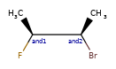
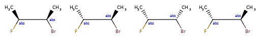
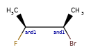
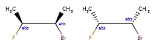
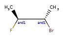
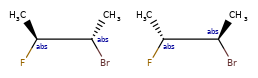
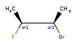

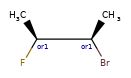

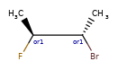

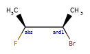
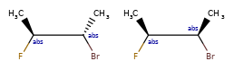
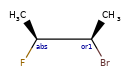


====================  ==========   ==============
  What's drawn         Mixture?     What it means
====================  ==========   ==============
|and1_and2_base|      mixture      |and1_and2_expand|
|and1_cis_base|       mixture      |and1_cis_expand|
|and1_trans_base|     mixture      |and1_trans_expand|
|or1_or2_base|        single       |or1_or2_expand|
|or1_cis_base|        single       |or1_cis_expand|
|or1_trans_base|      single       |or1_trans_expand|
|abs_and_base|        mixture      |abs_and_expand|
|abs_or_base|         single       |abs_or_expand|
====================  ==========   ==============


Representation
==============

Stored as a vector of :py:class:`rdkit.Chem.rdchem.StereoGroup` objects on a molecule. Each ``StereoGroup`` keeps track of its type
and the set of atoms that make it up.


Use cases
=========

The initial target is to not lose data on an ``V3k mol -> RDKit -> V3k mol`` round trip. Manipulation and depiction are future goals.

It is possible to enumerate the elements of a ``StereoGroup`` using the function
:py:func:`rdkit.Chem.EnumerateStereoisomers.EumerateStereoisomers`. Note that
this removes the ``StereoGroup`` information from the products since they now
correspond to specific molecules:

.. doctest ::

  >>> m = Chem.MolFromSmiles('C[C@H](F)C[C@H](O)Cl |&1:1|')
  >>> m.GetStereoGroups()[0].GetGroupType()
  rdkit.Chem.rdchem.StereoGroupType.STEREO_AND
  >>> [x.GetIdx() for x in m.GetStereoGroups()[0].GetAtoms()]
  [1]
  >>> from rdkit.Chem.EnumerateStereoisomers import EnumerateStereoisomers
  >>> [Chem.MolToCXSmiles(x) for x in EnumerateStereoisomers(m)]
  ['C[C@@H](F)C[C@H](O)Cl', 'C[C@H](F)C[C@H](O)Cl']

Reactions also preserve ``StereoGroup``s. Product atoms are included in the ``StereoGroup`` as long as the reaction doesn't create or destroy chirality at the atom.

.. doctest ::

  >>> def clearAllAtomProps(mol):
  ...  """So that atom mapping isn't shown"""
  ...  for atom in mol.GetAtoms():
  ...   for key in atom.GetPropsAsDict():
  ...    atom.ClearProp(key)
  ...
  >>> rxn = AllChem.ReactionFromSmarts('[C:1]F >> [C:1]Br')
  >>> ps=rxn.RunReactants([m])
  >>> clearAllAtomProps(ps[0][0])
  >>> Chem.MolToCXSmiles(ps[0][0])
  'C[C@H](Br)C[C@H](O)Cl |&1:1|'

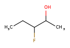
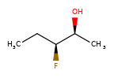
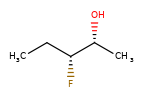
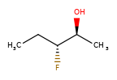
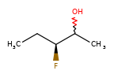
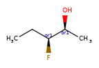
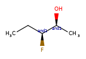


Enhanced Stereochemistry and substructure search
================================================

Enhanced Stereochemistry may optionally be honored in substructure searches. The following table captures whether or not a substructure query
(in the rows) matches a particular molecule (in the columns).

+-----------------+-----------------+-----------------+-----------------+-----------------+-----------------+-----------------+-----------------+
|                 | |EnhancedSSS_A| | |EnhancedSSS_B| | |EnhancedSSS_C| | |EnhancedSSS_D| | |EnhancedSSS_E| | |EnhancedSSS_F| | |EnhancedSSS_G| |
|                 |                 |                 |                 |                 |                 |       OR        |      AND        |
+=================+=================+=================+=================+=================+=================+=================+=================+
| |EnhancedSSS_A| |       Y         |       Y         |       Y         |       Y         |       Y         |       Y         |       Y         |
+-----------------+-----------------+-----------------+-----------------+-----------------+-----------------+-----------------+-----------------+
| |EnhancedSSS_B| |       N         |       Y         |       N         |       N         |       N         |       Y         |       Y         |
+-----------------+-----------------+-----------------+-----------------+-----------------+-----------------+-----------------+-----------------+
| |EnhancedSSS_C| |       N         |       N         |       Y         |       N         |       N         |       Y         |       Y         |
+-----------------+-----------------+-----------------+-----------------+-----------------+-----------------+-----------------+-----------------+
| |EnhancedSSS_D| |       N         |       N         |       N         |       Y         |       N         |       N         |       N         |
+-----------------+-----------------+-----------------+-----------------+-----------------+-----------------+-----------------+-----------------+
| |EnhancedSSS_E| |       N         |       Y         |       N         |       N         |       Y         |       Y         |       Y         |
+-----------------+-----------------+-----------------+-----------------+-----------------+-----------------+-----------------+-----------------+
| |EnhancedSSS_F| |       N         |       N         |       N         |       N         |       N         |       Y         |       Y         |
|       OR        |                 |                 |                 |                 |                 |                 |                 |
+-----------------+-----------------+-----------------+-----------------+-----------------+-----------------+-----------------+-----------------+
| |EnhancedSSS_G| |       N         |       N         |       N         |       N         |       N         |       N         |       Y         |
|      AND        |                 |                 |                 |                 |                 |                 |                 |
+-----------------+-----------------+-----------------+-----------------+-----------------+-----------------+-----------------+-----------------+

Substructure search using molecules with enhanced stereochemistry follows these rules (where substructure < superstructure):

* achiral < everything, because an achiral query means ignore chirality in the match
* chiral < AND, because AND includes both the chiral molecule and another one
* chiral < OR, because OR includes either the chiral molecule or another one
* OR < AND, because AND includes both molecules that OR could actually mean.
* one group of two atoms < two groups of one atom, because the latter is 4 different diastereomers, and the former only two of the four.

Some concrete examples of this:

.. doctest ::

  >>> ps = Chem.SubstructMatchParameters()
  >>> ps.useChirality = True
  >>> ps.useEnhancedStereo = True
  >>> m_ABS = Chem.MolFromSmiles('CC[C@H](F)[C@H](C)O')
  >>> m_AND = Chem.MolFromSmiles('CC[C@H](F)[C@H](C)O |&1:2,4|')
  >>> m_OR = Chem.MolFromSmiles('CC[C@H](F)[C@H](C)O |o1:2,4|')
  >>> m_AND.HasSubstructMatch(m_ABS,ps)
  True
  >>> m_OR.HasSubstructMatch(m_ABS,ps)
  True
  >>> m_AND.HasSubstructMatch(m_OR,ps)
  True
  >>> m_OR.HasSubstructMatch(m_AND,ps)
  False

Atropisomeric Bonds
*******************

Some single bonds have restricted rotation because of steric interactions
between the groups on adjacent atoms. If the groups on the adjacent atoms are
different from each other, chirality can be induced. An atropisomer bond is such
a restricted rotation bond. 

The requirements for a bond to be eligible for atropisomerism in the RDKit are:

- The bond must be a single bond between SP2 hybridized atoms.
- The neighboring bonds must be single, double or aromatic. 
- If there are two groups on either end, those groups must be different as per CIP rules. 
- Currently RDKit considers ring bonds as potential atropisomer bonds only if the
  ring in which the bond appears is 8 atoms or larger (thus allowing macrocycles).
- The molecule must have coordinates for atropisomer bonds to be interpreted.

The definition of potential atropisomer bonds is based on the wedging of
adjacent bonds. 

Defining Atropisomers
=====================

At least one of the neighbor bonds of one of the atoms of the potential
atropisomer bond must be a single or aromatic bond, and must have a bond
direction that is either "wedged" or "hashed". If any of the neighbor bonds is
marked as "sqwiggly", the bond is considered to have "Any" stereochemistry.
Example structure:

.. testsetup::

  'N1(C2C(C)=CC=CC=2I)C(C)=CC=C1Br |wU:1.1,(16.58,-10.58,;16.58,-9.58,;17.45,-9.08,;18.31,-9.57,;17.44,-8.08,;16.58,-7.58,;15.71,-8.08,;15.71,-9.08,;14.84,-9.58,;17.38,-11.17,;18.34,-10.87,;17.08,-12.12,;16.07,-12.12,;15.77,-11.17,;14.81,-10.87,)|'
  

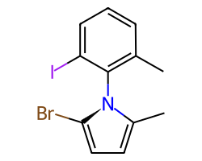

If more than one of the neighbor bonds are wedged or hashed, they must be consistent. 

For example, if two neighbor bonds on the same end atom are wedged/hashed, one
must be a wedge and the other must be a hash. If neighbor bonds on different
ends of the atropisomer bond are wedged, and the two bonds are opposite sides of
the potential atropisomer bond (the dihedral angle is greater than 90 degrees or
less than -90 degrees), the two must both be wedges or both must be hashed. If
the two wedged/hashed neighbor bonds are on the same side of the potential
atropisomer bond (the dihedral angle is less than 90 degrees and greater than
-90 degrees), one must be a wedge and the other a hash.

Examples – valid atropisomers with multiple wedges:

.. testsetup::

  'N1(C2=C(I)C=CC=C2C)C(Br)=CC=C1C |wU:1.7,0.9,(15.40,-10.23,;15.40,-9.23,;14.54,-8.73,;13.67,-9.23,;14.54,-7.73,;15.40,-7.23,;16.26,-7.73,;16.27,-8.73,;17.13,-9.22,;14.60,-10.82,;13.64,-10.52,;14.90,-11.77,;15.90,-11.77,;16.20,-10.82,;17.16,-10.52,)|',
  'N1(C(C)=CC=C1Br)C1C(C)=CC=CC=1I |wU:0.5,wD:0.0,(16.58,-10.58,;17.38,-11.17,;18.34,-10.87,;17.08,-12.12,;16.07,-12.12,;15.77,-11.17,;14.81,-10.87,;16.58,-9.58,;17.45,-9.08,;18.31,-9.57,;17.44,-8.08,;16.58,-7.58,;15.71,-8.08,;15.71,-9.08,;14.84,-9.58,)|'
  
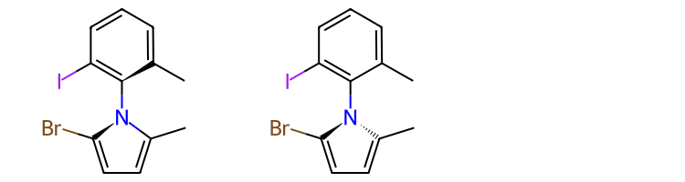


Examples – invalid atropisomers with multiple wedges:

.. testsetup::

  'N1(C(C)=CC=C1Br)C1C(C)=CC=CC=1I |wU:0.5,wD:7.8,(12.97,-10.71,;13.78,-11.30,;14.74,-11.00,;13.48,-12.25,;12.47,-12.25,;12.17,-11.30,;11.21,-11.00,;12.97,-9.70,;13.85,-9.20,;14.71,-9.69,;13.84,-8.20,;12.97,-7.70,;12.11,-8.20,;12.11,-9.20,;11.24,-9.70,)|',
  'N1(C2=C(I)C=CC=C2C)C(Br)=CC=C1C |wU:0.9,0.14,(16.20,-9.43,;16.20,-8.43,;15.34,-7.93,;14.47,-8.43,;15.34,-6.93,;16.20,-6.43,;17.06,-6.93,;17.07,-7.93,;17.93,-8.42,;15.40,-10.02,;14.44,-9.72,;15.70,-10.97,;16.70,-10.97,;17.00,-10.02,;17.96,-9.72,)|'
  
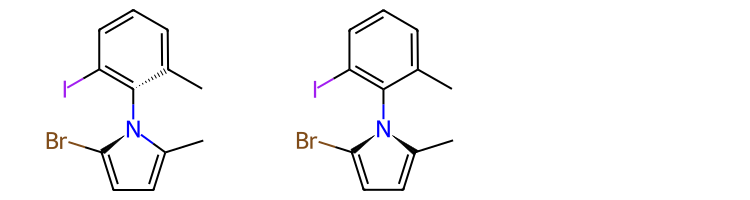


Note: the RDKit software makes no attempt to determine if the bond is actually
rotationally constrained. If the bond meets the requirements above, it is
marked as an atropisomer.

Internal Representation of Atropisomers
=======================================

To help with the rest of the explanation, we include the bond indices in the molecule drawing:

.. testsetup::

  'CC1=CC=CC(I)=C1N1C(C)=CC=C1Br |wU:7.7,(18.31,-9.57,;17.45,-9.08,;17.44,-8.08,;16.58,-7.58,;15.71,-8.08,;15.71,-9.08,;14.84,-9.58,;16.58,-9.58,;16.58,-10.58,;17.38,-11.17,;18.34,-10.87,;17.08,-12.12,;16.07,-12.12,;15.77,-11.17,;14.81,-10.87,)|'
  
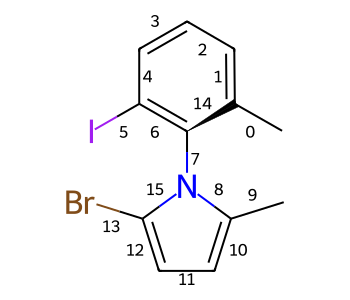

Here's part of the Debug output for that molecule::

  Atoms:
    ...
    1 6 C chg: 0  deg: 3 exp: 4 imp: 0 hyb: SP2 arom?: 1
    ...
    5 6 C chg: 0  deg: 3 exp: 4 imp: 0 hyb: SP2 arom?: 1
    ...
    7 6 C chg: 0  deg: 3 exp: 4 imp: 0 hyb: SP2 arom?: 1
    8 7 N chg: 0  deg: 3 exp: 3 imp: 0 hyb: SP2 arom?: 1
    9 6 C chg: 0  deg: 3 exp: 4 imp: 0 hyb: SP2 arom?: 1
    ...
    13 6 C chg: 0  deg: 3 exp: 4 imp: 0 hyb: SP2 arom?: 1
    ...
  Bonds:
    ...
    6 5->7 order: a conj?: 1 aromatic?: 1
    7 7->8 order: 1 stereo: CCW bonds: (14 6 8 15) conj?: 1
    8 8->9 order: a conj?: 1 aromatic?: 1
    ...
    14 7->1 order: a dir: wedge conj?: 1 aromatic?: 1
    15 13->8 order: a conj?: 1 aromatic?: 1

This tells us that bond 7 is atropisomeric and that when looking down the bond
(from atom C7 to atom N8), the rotation direction between bonds 14 and 8 (these
are the bonds to the lowest numbered atoms on each of the atropisomeric bond) is
counterclockwise (CCW).


Formats supporting atropisomers
===============================

Atropisomers are supported for molecule parsing and writing in Mol, MRV, and CXSmiles formats. 
For reactions, atropisomers are supported for in rxn, MRV and CXSmiles formats.
Atropisomers can be parsed from a CDXML file.

Enhanced Stereochemistry
========================

Atropisomers can be part of Enhanced Stereochemistry Groups (Or, And, or
Absolute). This is indicated by marking one or both of the atropisomer bond's
atoms as being in the enhanced Stereo Group

Example:

.. testsetup::

  'C=C(N1C(=O)C=CNC1=O)[C@]([C@H](C)F)([C@H](C)Cl)[C@@H](C)Br |(-1.5948,0.91515,;-0.7334,0.39295,;-0.7868,-0.77245,;0.0764,-1.27085,;0.9432,-0.76745,;0.0748,-2.26505,;-0.7868,-2.76205,;-1.6494,-2.26165,;-1.6512,-1.26665,;-2.5194,-0.77025,;0.283,0.98175,;1.4986,1.05295,;2.1262,0.24415,;1.941,1.95055,;0.2298,1.98075,;1.059,2.52775,;-0.6704,2.43135,;0.631,0.16635,;0.0594,-0.45685,;1.4698,-0.05045,),wD:2.8,14.15,wU:2.1,2.2,10.10,11.12,17.18,o1:2,10,11,&1:14,17|'
  
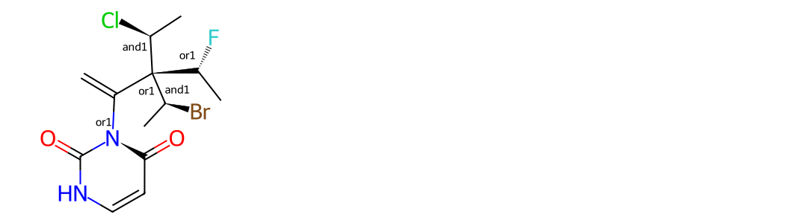


3D Coordinates for Input of Atropisomers
========================================

If 3D coordinates are available (and 2D coordinates are not), the atropisomer
bond is marked only if one of the neighbor bonds is wedged/hashed. The
wedge/hash information is ignored except for signaling the presence of the
atropisomer. The actual configuration is determined by the 3D coordinates.

Here's an example. The drawing at the left shows a 3D structure with a wedged
bond on one end of the atropisomer bond. The drawing at the right shows a 2D
drawing of the same structure. In both cases, the atropisomer bond is
highlighted in red. Notice that the bond wedging in the 3D structure is
inconsistent with the 3D coordinates; it's just used to indicate that there is
an atropisomer bond, the actual stereochemistry of the bond is determined by the
3D coordinates.

.. testsetup::

  'FC1=C(C2=C(C([H])([H])[H])C(N3C(=O)C4=C(N(C([H])([H])[H])C3=O)C(F)=C([H])C([H])=C4[H])=C([H])C([H])=C2[H])C2=C(N([H])C3=C2C([H])([H])C([H])([H])C(C(O[H])(C([H])([H])[H])C([H])([H])[H])([H])C3([H])[H])C(C(=O)N([H])[H])=C1[H] |(-1.4248,-1.9619,-2.2208;-1.8741,-1.6494,-1.6034;-1.6332,-0.9186,-1.2186;-0.9031,-0.4893,-1.4844;-0.138,-0.6553,-1.1342;-0.0582,-1.2887,-0.4699;-0.2862,-1.8851,-0.6843;0.5723,-1.396,-0.2643;-0.4068,-1.1014,0.0747;0.5573,-0.2316,-1.4028;1.3588,-0.3932,-1.0482;1.5905,0.0773,-0.3585;1.2002,0.6554,-0.0665;2.3933,-0.1194,0.0095;2.9068,-0.6967,-0.3594;2.6425,-1.1179,-1.0794;3.1982,-1.7169,-1.457;3.3106,-2.2227,-1.0278;3.7704,-1.4129,-1.6385;2.9318,-1.9829,-2.0144;1.8575,-1.0047,-1.4246;1.6168,-1.4364,-2.0026;3.6768,-0.8489,0.0041;4.2097,-1.3952,-0.3066;3.9217,-0.4363,0.7167;4.5184,-0.5645,0.9877;3.4017,0.1354,1.0788;3.5896,0.457,1.6328;2.6386,0.2956,0.7262;2.2428,0.7475,1.0192;0.4878,0.3584,-2.0214;1.0254,0.6927,-2.2354;-0.2773,0.5242,-2.3716;-0.3315,0.9837,-2.8531;-0.9727,0.1003,-2.1031;-1.5642,0.2383,-2.3831;-2.1142,-0.6018,-0.5711;-2.8218,-1.0304,-0.3345;-3.1799,-0.5981,0.3004;-3.7005,-0.7644,0.5964;-2.7239,0.0857,0.4696;-2.0583,0.1027,-0.0552;-1.4396,0.7778,-0.0395;-0.8137,0.538,-0.0869;-1.5466,1.1855,-0.5657;-1.4992,1.2797,0.7621;-1.2099,0.9291,1.2614;-1.1302,1.8345,0.67;-2.4007,1.4836,0.9934;-2.4335,2.0277,1.7578;-2.112,1.5747,2.4382;-2.128,1.9287,2.9199;-1.9128,2.8014,1.6418;-2.0588,3.1185,1.0662;-1.2527,2.6718,1.666;-2.0211,3.2354,2.1466;-3.3209,2.2556,1.9643;-3.6328,2.5429,1.4415;-3.3403,2.6896,2.48;-3.6795,1.7235,2.1686;-2.6689,1.821,0.4719;-2.9136,0.6925,1.1267;-2.7776,0.4065,1.7216;-3.5722,0.834,1.1115;-3.069,-1.7619,-0.7143;-3.8054,-2.1982,-0.4602;-4.2532,-1.9338,0.1012;-4.0043,-2.9212,-0.8738;-3.6777,-3.1773,-1.3373;-4.5184,-3.2354,-0.7104;-2.581,-2.0639,-1.3539;-2.7202,-2.6244,-1.6865),wD:10.20|',
  
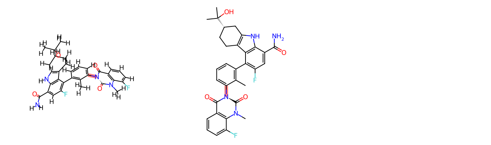


Interpreting atropisomers without coordinates
=============================================

Just as it is possible to interpret atomic and double bond stereochemistry from
SMILES without providing atomic coordinates, the RDKit adopts (starting with the
2024.03.2 release) a convention for interpreting bond wedge information in
CXSMILES that do not have coordinates provided.

In order to understand how this representation works, a quick digression is necessary to explain the difference in the way bonds are numbered in CXSMILES and the RDKit.
In the RDKit ring closure bonds are added last; they are the highest numbered bonds in the molecule. In CXSMILES, the ring closure bonds are added immediately upon closing the ring.
Here's an illustration of this for the SMILES ``CC1=CC=CC(I)=C1N1C(C)=CC=C1Br``; the RDKit bond numbering (what we saw above) is shown first and the CXSMILES numbering is shown second.

.. testsetup::

  'CC1=CC=CC(I)=C1N1C(C)=CC=C1Br |wU:7.7|'
  
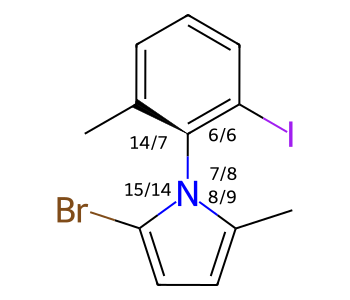

To describe this atropisomer in CXSMILES without using coordinates, we adopt the convention that the atropisomeric bond's stereochemistry is ``CCW`` when the bond to the lowest-numbered neighbor of the start atom 
(in this case the neighbor connected via bond 7) is wedged and write the CXSMILES for this molecule as ``CC1=CC=CC(I)=C1N1C(C)=CC=C1Br |wU:7.7||``. The stereo values for all possible combinations are shown here:


+-------+----+-------+-------+--------+------------+
|       |    | bond  |       |        |            |
| from  | to | index | type  | stereo |            |
+=======+====+=======+=======+========+============+
| 7     | 1  | 7     | wedge | CCW    | ``wU7.7``  |
+-------+----+-------+-------+--------+------------+
| 7     | 5  | 6     | wedge | CW     | ``wU7.6``  |
+-------+----+-------+-------+--------+------------+
| 8     | 9  | 9     | wedge | CW     | ``wU8.9``  |
+-------+----+-------+-------+--------+------------+
| 8     | 13 | 14    | wedge | CCW    | ``wU8.14`` |
+-------+----+-------+-------+--------+------------+
| 7     | 1  | 7     | dash  | CW     | ``wD7.7``  |
+-------+----+-------+-------+--------+------------+
| 7     | 5  | 6     | dash  | CCW    | ``wD7.6``  |
+-------+----+-------+-------+--------+------------+
| 8     | 9  | 9     | dash  | CCW    | ``wD8.9``  |
+-------+----+-------+-------+--------+------------+
| 8     | 13 | 14    | dash  | CW     | ``wD8.14`` |
+-------+----+-------+-------+--------+------------+


It's also possible to wedge multiple neighbor bonds around an atropisomeric bond, but the wedging must be consistent based on the table above; 
so the CXSMILES ``CC1=CC=CC(I)=C1N1C(C)=CC=C1Br |wD:7.7,wU:8.9|`` is valid, but ``CC1=CC=CC(I)=C1N1C(C)=CC=C1Br |wD:7.7,wU:8.14|`` is not.


Validation of Atropisomers
==========================

Invalid atropisomers (for example, those with two equivalent groups on one end)
will be removed when reading molecules in with sanitization enabled or by
calling ``cleanupAtropisomers(mol)``.

Searching and Canonicalization
==============================

Atropisomers are supported in the canonicalization algorithm of RDKit. They are ignored in 
substructure searching and similarity searching at this time.


Query Features in Molecule Drawings
***********************************

Compactly and clearly including information about query features in molecule
drawings is a challenging problem. This is definitely a work in progress, but
this section describes what is currently supported.

Query Bonds
===========

Here is an example image showing how different bond and query-bond types are rendered.

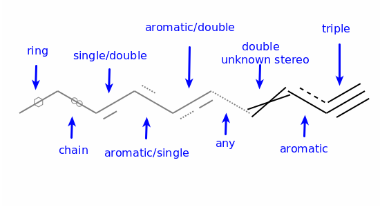

There's clearly some room for improvement here, for example, it's not trivial to
distinguish "Any" bonds from query bonds where no special handling has been
implemented ("other" query types):

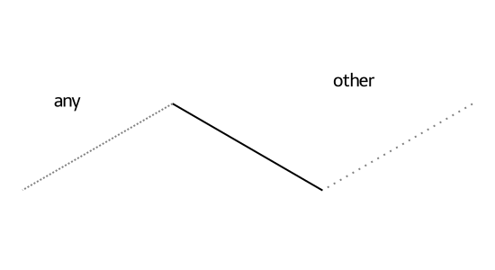

Query Atoms
===========

At the moment the only real support for atomic query features is rendering of
atom lists (and "NOT" atom lists); other atomic queries are rendered with a simple `?`:

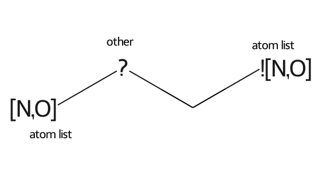


Conformer Generation
********************

Introduction
============

The RDKit can generate conformers for molecules using two different
methods.  The original method used distance geometry. [#blaney]_
The default algorithm followed is:

1. The molecule's distance bounds matrix is calculated based on the connection table and a set of rules.

2. The bounds matrix is smoothed using a triangle-bounds smoothing algorithm.

3. A random distance matrix that satisfies the bounds matrix is generated.

4. This distance matrix is embedded in 3D dimensions (producing coordinates for each atom).

5. The resulting coordinates are cleaned up somewhat using the "distance geometry force field", based on distance constraints from the bounds matrix.

The RDKit also has an implementation of the ETKDG method of Riniker and Landrum
[#riniker2]_ which modifies step 5 above to also use torsion angle preferences
from the Cambridge Structural Database (CSD) to correct the conformers after
distance geometry has been used to generate them. The ETDKDG approach can be
extended to include additional torsion terms for small rings and/or macrocycles [#wangETKDG3]_.

When using the ETKDG approaches the quality of the conformers generated is
generally good enough to allow them to be used "as is" (i.e. without a
subsequent minimization step with another force field) for many applications.


Parameters Controlling Conformer Generation
===========================================

A large number of parameters which allow control over the conformer generation
process are available in the ``EmbedParameters`` class. A subset of particularly
useful parameters are described here:

- ``randomSeed``: (default -1) allows you to set a random seed to allow reproducible results

- ``numThreads``: (default 1) sets the number of compute threads to be used when 
  generating multiple conformers. If set to 0 this will use the maximum number
  of threads allowed on your system.

- ``useRandomCoords``: (default False) if set to True then random-coordinate embedding will be
  done: instead of steps 3. and 4. above, the atoms will be randomly placed in a
  box and then their positions will be minimized with the "distance geometry force
  field" in step 5. This approach was described in reference [#spellmeyerDG]_

- ``enforceChirality``: (default True) ensures that the chirality of specified
  stereocenters in the molecule is preserved in the conformers.

- ``embedFragsSeparately``: (default True) for molecules made up of multiple
  disconnected fragments, this cause conformers of the fragments to be generated
  independently of each other.

- ``coordMap``: (default empty) can be used to provide 3D coordinates which will
  be used to constrain the positions of some of the atoms in the molecule.

- ``boundsMat``: (default empty) can be used to provide the distance bounds matrix
  for the molecule.

- ``useExpTorsionAnglePrefs``: (default False) use the ET part of ETKDG [#riniker2]_

- ``useBasicKnowledge``: (default False) use the K part of ETKDG [#riniker2]_

- ``ETVersion``: (default 1) specify the version of the standard torsion
  definitions to use. NOTE for both ETKDGv2 and ETKDGv3 this should be 2 since ETKDGv3 uses the
  ETKDGv2 definitions for standard torsions (apologies for the confusing numbering)

- ``useSmallRingTorsions``: (default False) use the sr part of srETDKGv3 [#wangETKDG3]_

- ``useMacrocycleTorsions``: (default False) use the macrocycle torsions from ETKDGv3 [#wangETKDG3]_

- ``useMacrocycle14config``: (default False) use the 1-4 distance bounds from ETKDGv3 [#wangETKDG3]_

- ``forceTransAmides``: (default True) constrain amide bonds to be trans

- ``pruneRMsThresh``: (default -1.0) if >0.0 this turns on RMSD pruning of the conformers

- ``onlyHeavyAtomsForRMS``: (default: False) toggles ignoring H atoms when doing RMSD pruning

- ``useSymmetryForPruning``: (default True) uses symmetry to calculate the minimum
  RMSD between two conformers when doing RMSD pruning. Note that enabling this
  causes the RMSD computation to act as if `onlyHeavyAtomsForRMS` is set to true
  (even if the parameter itself is set to False).


Note that there are pre-configured parameter objects for the available ETKDG
versions: ``ETKDG``, ``ETKDGv2``, ``ETKDGv3``, and ``srETKDGv3``


Additional Information About the Fingerprints
*********************************************

This section, which is not currently comprehensive, is intended to provide some
documentation about the types of fingerprints available in the RDKit. We don't
reproduce information that can be found in the literature, but try and capture
the unpublished bits (of which there are quite a few).

RDKit Fingerprints
==================

This is an RDKit-specific fingerprint that is inspired by (though it differs
significantly from) public descriptions of the Daylight fingerprint
[#daylightFP]_. The fingerprinting algorithm identifies all subgraphs in the
molecule within a particular range of sizes, hashes each subgraph to generate a
raw bit ID, mods that raw bit ID to fit in the assigned fingerprint size, and
then sets the corresponding bit. Options are available to generate count-based
forms of the fingerprint or "non-folded" forms (using a sparse representation).

The default scheme for hashing subgraphs is to hash the individual bonds based on:
  - the types of the two atoms. Atom types include the atomic number (mod 128), and whether or not the atom is aromatic.
  - the degrees of the two atoms in the path.
  - the bond type (or ``AROMATIC`` if the bond is marked as aromatic)

Fingerprint-specific options
----------------------------

  - ``minPath`` and ``maxPath`` control the size (in bonds) of the subgraphs/paths considered
  - ``nBitsPerHash``: If this is greater than one, each subgraph will set more than one bit.
    The additional bits will be generated by seeding a random number generator with the original
    raw bit ID and generating the appropriate number of random numbers.
  - ``useHs``: toggles whether or not Hs are included in the subgraphs/paths (assuming that there
    are Hs in the molecule graph.
  - ``tgtDensity``: if this is greater than zero, the fingerprint will be repeatedly folded in half
    until the density of set bits is greater than or equal to this value or the fingerprint only
    contains `minSize` bits. Note that this means that the resulting fingerprint will not necessarily
    be the size you requested.
  - ``branchedPaths``: if this is true (the default value), the algorithm will use subgraphs (i.e features
    can be branched. If false, only linear paths will be considered.
  - ``useBondOrder``: if true (the default) bond types will be considered when hashing subgraphs, otherwise
    this component of the hash will be ignored.

Pattern Fingerprints
====================

These fingerprints were designed to be used in substructure screening. These
are, as far as I know, unique to the RDKit. The algorithm identifies features in
the molecule by doing substructure searches using a small number (12 in the
``2019.03`` release of the RDKit) of very generic SMARTS patterns - like
``[*]~[*]~[*](~[*])~[*]`` or ``[R]~1[R]~[R]~[R]~1``, and then hashing each
occurrence of a pattern based on the atom and bond types involved. The fact that
particular pattern matched the molecule at all is also stored by hashing the
pattern ID and size. If a particular feature contains either a query atom or a
query bond (e.g. something generated from SMARTS), the only information that is
hashed is the fact that the generic pattern matched.

For the ``2019.03`` release, the atom types use just the atomic number of the
atom and the bond types use the bond type, or ``AROMATIC`` for aromatic bonds).

**NOTE**: Because it plays an important role in substructure screenout, the
internals of this fingerprint (the generic patterns used and/or the details of
the hashing algorithm) may change from one release to the next.

Atom-Pair and Topological Torsion Fingerprints
==============================================

These two related fingerprints are implemented based on the original papers:
[#atomPairFP]_ [#ttFP]_. Atoms are typed based on atomic number, number of pi
electrons, and the degree of the atom. Optionally information about atomic
chirality can also be integrated into the atom types. Both fingerprint types can
be generated in explicit or sparse form and as bit or count vectors. These
fingerprint types are different from the others in the RDKit in that bits in the
sparse form of the fingerprint can be directly explained (i.e. the "hashing
function" used is fully reversible).

These fingerprints were originally "intended" to be used in count-vectors and
they seem to work better that way. The default behavior of the explicit
bit-vector forms of both fingerprints is to use a "count simulation" procedure
where multiple bits are set for a given feature if it occurs more than once. The
default behavior is to use 4 fingerprint bits for each feature (so a 2048 bit
fingerprint actually stores information about the same number of features as a
512 bit fingerprint that isn't using count simulation). The bins correspond to
counts of 1, 2, 4, and 8. As an example of how this works: if a feature occurs 5
times in a molecule, the bits corresponding to counts 1, 2, and 4 will be set.

Morgan and Feature Morgan Fingerprints
======================================

These are implemented based on the original paper [#morganFP]_. The algorithm
follows the description in the paper as closely as possible with the exception
of the chemical feature definitions used for the "Feature Morgan" fingerprint -
the RDKit implementation uses the feature types Donor, Acceptor, Aromatic,
Halogen, Basic, and Acidic with definitions adapted from those in the paper
[#gobbiFeats]_. It is possible to provide your own atom types. The fingerprints
are available as either explicit or sparse count vectors or explicit bit
vectors.

Layered Fingerprints
====================

These are another "RDKit original" and were developed with the intention of
using them as a substructure fingerprint. Since the pattern fingerprint is far
simpler and has proven to be quite effective as a substructure fingerprint, the
layered fingerprint hasn't received much attention. It may still be interesting
for something, so we continue to include it.

The idea of the fingerprint is generate features using the same subgraph (or
path) enumeration algorithm used in the RDKit fingerprint. After a subgraph has
been generated, it is used to set multiple bits based on different atom and bond
type definitions.


Feature Flags: global variables affecting RDKit behavior
********************************************************

The RDKit uses a number of "feature flags": global variables which affect its
behavior. These have generally been added to maintain backwards compatibility
when introducing new algorithms which yield different results.

Here's are the current feature flags:

  - ``preferCoordGen``: when this is ``true`` Schrodinger's open-source Coordgen
    library will be used to generate 2D coordinates of molecules. The default
    value is ``false``. This can be set from C++ using the variable
    ``RDKit::RDDepict::preferCoordGen`` or from Python using the function
    ``rdDepictor.SetPreferCoordGen()``. Added in the 2018.03 release.

  - ``allowNontetrahedralChirality``: when this is ``true`` non-tetrahedral
    chirality will be perceived from 3D coordinates. The default value is
    ``true`` unless the environment variable
    ``RDK_ENABLE_NONTETRAHEDRAL_STEREO`` is set to ``"0"``. Can set/checked from
    C++ using the functions
    ``RDKit::Chirality::setAllowNontetrahedralChirality()`` /
    ``RDKit::Chirality::getAllowNontetrahedralChirality()`` or from Python using
    the functions ``Chem.SetAllowNontetrahedralChirality()`` /
    ``Chem.GetAllowNontetrahedralChirality()``. Added in the 2022.09 release.

  - ``useLegacyStereoPerception``: when this is ``true`` the legacy
    implementation for perceiving stereochemistry will be used. 
    The default value is ``true`` unless the environment variable
    ``RDK_USE_LEGACY_STEREO_PERCEPTION`` is set to ``"0"``. Can set/checked from
    C++ using the functions
    ``RDKit::Chirality::setUseLegacyStereoPerception()`` /
    ``RDKit::Chirality::getUseLegacyStereoPerception()`` or from Python using
    the functions ``Chem.SetUseLegacyStereoPerception()`` /
    ``Chem.GetUseLegacyStereoPerception()``. Added in the 2022.09 release.


.. rubric:: Footnotes

.. [#smirks] http://www.daylight.com/dayhtml/doc/theory/theory.smirks.html
.. [#smiles] http://www.daylight.com/dayhtml/doc/theory/theory.smiles.html
.. [#smarts] http://www.daylight.com/dayhtml/doc/theory/theory.smarts.html
.. [#cxsmiles] https://docs.chemaxon.com/display/docs/chemaxon-extended-smiles-and-smarts-cxsmiles-and-cxsmarts.md
.. [#intramolRxn] Thanks to James Davidson for this example.
.. [#chiralRxn] Thanks to JP Ebejer and Paul Finn for this example.
.. [#daylightFP] http://www.daylight.com/dayhtml/doc/theory/theory.finger.html
.. [#atompairFP] http://pubs.acs.org/doi/abs/10.1021/ci00046a002
.. [#ttFP] http://pubs.acs.org/doi/abs/10.1021/ci00054a008
.. [#morganFP] http://pubs.acs.org/doi/abs/10.1021/ci100050t
.. [#gobbiFeats] https://doi.org/10.1002/(SICI)1097-0290(199824)61:1%3C47::AID-BIT9%3E3.0.CO;2-Z
.. [#labutecip] Labute, P. "An Efficient Algorithm for the Determination of Topological RS Chirality" Journal of the Chemical Computing Group (1996)
.. [#newcip]  Hanson, R. M., Musacchio, S., Mayfield, J. W., Vainio, M. J., Yerin, A., Redkin, D. "Algorithmic Analysis of Cahn--Ingold--Prelog Rules of Stereochemistry: Proposals for Revised Rules and a Guide for Machine Implementation." J. Chem. Inf. Model. 2018, 58, 1755-1765.
.. [#nadinecanon] Schneider, N., Sayle, R. A. & Landrum, G. A. Get Your Atoms in Order-An Open-Source Implementation of a Novel and Robust Molecular Canonicalization Algorithm. J. Chem. Inf. Model. 2015, 55, 2111-2120.
.. [#eitherend] It's ok to have two identically ranked atoms on the two ends of the bond, but having two identically ranked atoms on the same end indicates that it's not a potential stereobond.
.. [#blaney] Blaney, J. M.; Dixon, J. S. "Distance Geometry in Molecular Modeling".  *Reviews in Computational Chemistry*; VCH: New York, 1994.
.. [#riniker2] Riniker, S.; Landrum, G. A. "Better Informed Distance Geometry: Using What We Know To Improve Conformation Generation"  *J. Chem. Inf. Comp. Sci.* **55**:2562-74 (2015) https://doi.org/10.1021/acs.jcim.5b00654
.. [#wangETKDG3] Wang, S.; Witek, J.; Landrum, G. A.; Riniker, S. "Improving Conformer Generation for Small Rings and Macrocycles Based on Distance Geometry and Experimental Torsional-Angle Preferences." *J. Chem. Inf. Model.* **60**, 2044–58 (2020). https://doi.org/10.1021/acs.jcim.0c00025
.. [#spellmeyerDG] Spellmeyer, D. C.; Wong, A. K.; Bower, M. J.; Blaney, J. M. "Conformational analysis using distance geometry methods." *J. Mol. Graph. Modell.* **15**, 18–36 (1997). https://doi.org/10.1016/s1093-3263(97)00014-4


License
*******


This document is copyright (C) 2007-2021 by Greg Landrum

This work is licensed under the Creative Commons Attribution-ShareAlike 4.0 License.
To view a copy of this license, visit http://creativecommons.org/licenses/by-sa/4.0/ or send a letter to Creative Commons, 543 Howard Street, 5th Floor, San Francisco, California, 94105, USA.


The intent of this license is similar to that of the RDKit itself.
In simple words: “Do whatever you want with it, but please give us some credit.”
