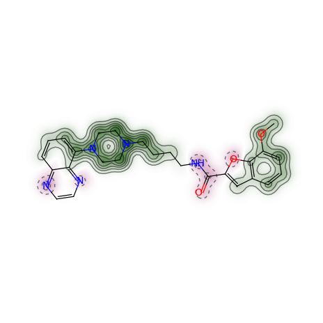

PythonでRDKitを始めよう
%%%%%%%%%%%%%%%%%%%%%%%%%%%%%%%%%%%%%%%%
[`Getting Started with RDKit in Python <https://www.rdkit.org/docs/GettingStartedInPython.html#getting-started-with-the-rdkit-in-python>`__]

このページについて
***************************************************
[`What is this? <https://www.rdkit.org/docs/GettingStartedInPython.html#what-is-this>`__]

このページはどうすればPythonからRDKitの機能を使うことができるか、その大まかな見取り図を提供することを目的としています。網羅的なものではありませんし、マニュアルでもありません。

間違いに気づいた場合や、こうした方が良いといった提案があればソースドキュメント(.rstファイル)をご自身で修正するか、もしくはメーリングリスト（\ rdkit-devel@lists.sourceforge.net\ ）に送ってください。特に、ここに書かれていないことで、どうすれば良いか解決するのに時間がかかったことがあれば、ぜひ書き加えてください。このページへの貢献はRDKitコミュニティにもあなた自身の将来にとっても、とてもためになるでしょう。

分子の読み込みと書き込み
***************************************************
[`Reading and Writing Molecules <https://www.rdkit.org/docs/GettingStartedInPython.html#reading-and-writing-molecules>`__]

.. _back-to-ref_1:

1分子の読み込み
==========================================================
[`Reading single molecules <https://www.rdkit.org/docs/GettingStartedInPython.html#reading-single-molecules>`__]

基本的な分子を取り扱う機能の多くは\ `rdkit.Chem <https://www.rdkit.org/docs/source/rdkit.Chem.html#module-rdkit.Chem>`__\ モジュールに含まれています。

.. code:: python

   >>> from __future__ import print_function
   >>> from rdkit import Chem

一つ一つの分子は様々な方法で構築することができます。例えば：

.. code:: python

   >>> m = Chem.MolFromSmiles('Cc1ccccc1')
   >>> m = Chem.MolFromMolFile('data/input.mol')
   >>> stringWithMolData=open('datainput.mol','r').read()
   >>> m = Chem.MolFromMolBlock(stringWithMolData)

うまくいけばこれらの関数はすべて\ `rdkit.Chem.rdchem.Mol <https://www.rdkit.org/docs/source/rdkit.Chem.rdchem.html#rdkit.Chem.rdchem.Mol>`__\ オブジェクトを返します。

.. code:: python

   >>> m
   <rdkit.Chem.rdchem.Mol object at 0x...>

失敗した場合は None を返します：

.. code:: python

   >>> m = Chem.MolFromMolFile('data/invalid.mol')
   >>> m is None
   True

エラーメッセージの感覚を掴むためにわざとおかしなことをしてみましょう：

.. code:: python

   >>> m1 = Chem.MolFromSmiles('CO(C)C')

以下のようなメッセージが表示されます:\ ``[12:18:01] Explicit valence for atom # 1 O greater than permitted``\ また、

.. code:: python

   >>> m2 = Chem.MolFromSmiles('c1cc1')

このようなメッセージが出ます：\ ``[12:20:41] Can't kekulize mol``\ 。どちらの場合も\ ``None``\ 値が返されます:

.. code:: python

   >>> m1 is None
   True
   >>> m2 is None
   True

訳注) 上記セクションの構造式が気になったら\ :ref:`こちら <jp-notes_1>`\ へ

まとまった数の分子を読み込む
==========================================================
[`Reading sets of molecules <https://www.rdkit.org/docs/GettingStartedInPython.html#reading-sets-of-molecules>`__]

分子の集合はSupplierを使うことで読み込めます。 (例えば
`rdkit.Chem.rdmolfiles.SDMolSupplier <https://www.rdkit.org/docs/source/rdkit.Chem.rdmolfiles.html#rdkit.Chem.rdmolfiles.SDMolSupplier>`__\ や\ `rdkit.Chem.rdmolfiles.SmilesMolSupplier <https://www.rdkit.org/docs/source/rdkit.Chem.rdmolfiles.html#rdkit.Chem.rdmolfiles.SmilesMolSupplier>`__\ などです。)

.. code:: python

   >>> suppl = Chem.SDMolSupplier('data/5ht3ligs.sdf')
   >>> for mol in suppl:
   ...   print(mol.GetNumAtoms())
   ...
   20
   24
   24
   26

Supplierから簡単に分子のリストを作ることが可能です。

.. code:: python

   >>> mols = [x for x in suppl]
   >>> len(mols)
   4

あるいは単純にSupplier自体をランダムアクセスオブジェクトとして扱うことも可能です:

.. code:: python

   >>> suppl[0].GetNumAtoms()
   20

グッドプラクティスとしては、個々の分子が正しく読み込まれているかどうか、処理を行うまえにテストすることをお勧めします：

.. code:: python

   >>> suppl = Chem.SDMolSupplier('data/5ht3ligs.sdf')
   >>> for mol in suppl:
   ...   if mol is None: continue
   ...   print(mol.GetNumAtoms())
   ...
   20
   24
   24
   26

Supplierの代わりとなるものとして、ファイルのようなオブジェクトから読みこむ際に、\ `rdkit.Chem.rdmolfiles.ForwardSDMolSupplier <https://www.rdkit.org/docs/source/rdkit.Chem.rdmolfiles.html#rdkit.Chem.rdmolfiles.ForwardSDMolSupplier>`__\ が使えます。

.. code:: python

   >>> inf = open('data/5ht3ligs.sdf','rb')
   >>> fsuppl = Chem.ForwardSDMolSupplier(inf)
   >>> for mol in fsuppl:
   ...   if mol is None: continue
   ...   print(mol.GetNumAtoms())
   ...
   20
   24
   24
   26

つまり、圧縮ファイルから読み込む際にも使えます。

.. code:: python

   >>> import gzip
   >>> inf = gzip.open('data/actives_5ht3.sdf.gz')
   >>> gzsuppl = Chem.ForwardSDMolSupplier(inf)
   >>> ms = [x for x in gzsuppl if x is not None]
   >>> len(ms)
   180

ForwardSDMolSuppliersはランダムアクセスオブジェクトとしては使えないことに気をつけてください。

.. code:: python

   >>> fsuppl[0]
   Traceback (most recent call last):
     ...
   TypeError: 'ForwardSDMolSupplier' object does not support indexing

分子の書き込み
==========================================================
[`Writing molecules <https://www.rdkit.org/docs/GettingStartedInPython.html#writing-molecules>`__]

分子が一つの場合、\ `rdkit.Chem <https://www.rdkit.org/docs/source/rdkit.Chem.html#module-rdkit.Chem>`__\ モジュールにある複数の関数でテキスト形式に変換することができます。

例えば、SMILESに変換したい場合次のようにします：

.. code:: python

   >>> m = Chem.MolFromMolFile('data/chiral.mol')
   >>> Chem.MolToSmiles(m)
   'C[C@H](O)c1ccccc1'
   >>> Chem.MolToSmiles(m,isomericSmiles=False)
   'CC(O)c1ccccc1'

生成されるSMILESはcanonical SMILESであることに注視してください。つまりインプットとしてどのように分子を読み込んだとしても、同じ分子に対しては同じSMILESがアウトプットされます。

.. code:: python

   >>> Chem.MolToSmiles(Chem.MolFromSmiles('C1=CC=CN=C1'))
   'c1ccncc1'
   >>> Chem.MolToSmiles(Chem.MolFromSmiles('c1cccnc1'))
   'c1ccncc1'
   >>> Chem.MolToSmiles(Chem.MolFromSmiles('n1ccccc1'))
   'c1ccncc1'

もしケクレ形式のSMILESを作りたいなら、最初に分子をケクレ化したのち“kekuleSmiles”オプションを使ってください。

.. code:: python

   >>> Chem.Kekulize(m)
   >>> Chem.MolToSmiles(m,kekuleSmiles=True)
   'C[C@H](O)C1=CC=CC=C1'

この記事を記載している時点（2008年8月）で、kekuleSmilesをリクエストすると生成されるSMILESはカノニカルではありません。SMILESの生成段階ではなく、ケクレ化の段階自体に限界があります。

MDL Mol block も利用可能です：

.. code:: python

   >>> m2 = Chem.MolFromSmiles('C1CCC1')
   >>> print(Chem.MolToMolBlock(m2))

        RDKit          2D

     4  4  0  0  0  0  0  0  0  0999 V2000
       1.0607    0.0000    0.0000 C   0  0  0  0  0  0  0  0  0  0  0  0
      -0.0000   -1.0607    0.0000 C   0  0  0  0  0  0  0  0  0  0  0  0
      -1.0607    0.0000    0.0000 C   0  0  0  0  0  0  0  0  0  0  0  0
       0.0000    1.0607    0.0000 C   0  0  0  0  0  0  0  0  0  0  0  0
     1  2  1  0
     2  3  1  0
     3  4  1  0
     4  1  1  0
   M  END

mol
blockに名前を含めるためには、分子の\ ``"_Name"``\ プロパティをセットしてください：

.. code:: python

   >>> m2.SetProp("_Name","cyclobutane")
   >>> print(Chem.MolToMolBlock(m2))
   cyclobutane
        RDKit          2D

     4  4  0  0  0  0  0  0  0  0999 V2000
       1.0607    0.0000    0.0000 C   0  0  0  0  0  0  0  0  0  0  0  0
      -0.0000   -1.0607    0.0000 C   0  0  0  0  0  0  0  0  0  0  0  0
      -1.0607    0.0000    0.0000 C   0  0  0  0  0  0  0  0  0  0  0  0
       0.0000    1.0607    0.0000 C   0  0  0  0  0  0  0  0  0  0  0  0
     1  2  1  0
     2  3  1  0
     3  4  1  0
     4  1  1  0
   M  END

ほとんどのソフトウェアで原子や結合の立体化学を正しく認識させるためには、mol blockが原子座標を含むことが必須です。
また分子を描画する、といった様々な理由で原子座標は便利です。デフォルトでは座標を持たない分子のmol blockを生成させると、自動的に座標が生成されます。
ですが、これらは分子には格納されません。\ `rdkit.Chem.AllChem <https://www.rdkit.org/docs/source/rdkit.Chem.AllChem.html#module-rdkit.Chem.AllChem>`__\ モジュールの機能を使うと、座標を生成させ、分子に格納することができます。
（より詳細な情報は\ `Chem vs AllChem <https://www.rdkit.org/docs/GettingStartedInPython.html#chem-vs-allchem>`__\ セクションを参照してください。）

格納できる座標としてはまず2Dの座標（すなわち描画）があります:

.. code:: python

   >>> from rdkit.Chem import AllChem
   >>> AllChem.Compute2DCoords(m2)
   0
   >>> print(Chem.MolToMolBlock(m2))
   cyclobutane
        RDKit          2D

     4  4  0  0  0  0  0  0  0  0999 V2000
       1.0607   -0.0000    0.0000 C   0  0  0  0  0  0  0  0  0  0  0  0
      -0.0000   -1.0607    0.0000 C   0  0  0  0  0  0  0  0  0  0  0  0
      -1.0607    0.0000    0.0000 C   0  0  0  0  0  0  0  0  0  0  0  0
       0.0000    1.0607    0.0000 C   0  0  0  0  0  0  0  0  0  0  0  0
     1  2  1  0
     2  3  1  0
     3  4  1  0
     4  1  1  0
   M  END

あるいは分子に埋め込む（embedする）ことで3D座標を付け加えることもできます（この例ではETKDG法を使用しています。ETKDG法についてはより詳細に下で説明します。）

.. code:: python

   >>> AllChem.EmbedMolecule(m2)
   0
   >>> print(Chem.MolToMolBlock(m2))
   cyclobutane
        RDKit          3D

     4  4  0  0  0  0  0  0  0  0999 V2000
      -0.8321    0.5405   -0.1981 C   0  0  0  0  0  0  0  0  0  0  0  0
      -0.3467   -0.8825   -0.2651 C   0  0  0  0  0  0  0  0  0  0  0  0
       0.7190   -0.5613    0.7314 C   0  0  0  0  0  0  0  0  0  0  0  0
       0.4599    0.9032    0.5020 C   0  0  0  0  0  0  0  0  0  0  0  0
     1  2  1  0
     2  3  1  0
     3  4  1  0
     4  1  1  0
   M  END

良い３Dコンフォメーションを得るには、ほとんどの場合、まず初めに水素原子を分子に付加すること上手くいきます。

.. code:: python

   >>> m3 = Chem.AddHs(m2)
   >>> AllChem.EmbedMolecule(m3)
   0

この付加した水素原子を取り除くこともできます。

.. code:: python

   >>> m3 = Chem.RemoveHs(m3)
   >>> print(Chem.MolToMolBlock(m3))
   cyclobutane
        RDKit          3D

     4  4  0  0  0  0  0  0  0  0999 V2000
       0.3497    0.9755   -0.2202 C   0  0  0  0  0  0  0  0  0  0  0  0
       0.9814   -0.3380    0.2534 C   0  0  0  0  0  0  0  0  0  0  0  0
      -0.3384   -1.0009   -0.1474 C   0  0  0  0  0  0  0  0  0  0  0  0
      -0.9992    0.3532    0.1458 C   0  0  0  0  0  0  0  0  0  0  0  0
     1  2  1  0
     2  3  1  0
     3  4  1  0
     4  1  1  0
   M  END

分子をファイルに書き込みたい時にはPythonファイルオブジェクトを使ってください：

.. code:: python

   >>> print(Chem.MolToMolBlock(m2),file=open('data/foo.mol','w+'))
   >>>

分子の集合を書き出す方法
==========================================================
[`Writing sets of molecules <https://www.rdkit.org/docs/GettingStartedInPython.html#writing-sets-of-molecules>`__]

分子が複数ある場合は\ `rdkit.Chem.rdmolfiles.SDWriter <https://www.rdkit.org/docs/source/rdkit.Chem.rdmolfiles.html#rdkit.Chem.rdmolfiles.SDWriter>`__\ オブジェクトを使うことでファイルに書き出すことができます。

.. code:: python

   >>> w = Chem.SDWriter('data/foo.sdf')
   >>> for m in mols: w.write(m)
   ...
   >>>

SDWriterはfile-likeなオブジェクトを使っても初期化することができます:

.. code:: python

   >>> from rdkit.six import StringIO
   >>> sio = StringIO()
   >>> w = Chem.SDWriter(sio)
   >>> for m in mols: w.write(m)
   ...
   >>> w.flush()
   >>> print(sio.getvalue())
   mol-295
        RDKit          3D

    20 22  0  0  1  0  0  0  0  0999 V2000
       2.3200    0.0800   -0.1000 C   0  0  0  0  0  0  0  0  0  0  0  0
       1.8400   -1.2200    0.1200 C   0  0  0  0  0  0  0  0  0  0  0  0
   ...
     1  3  1  0
     1  4  1  0
     2  5  1  0
   M  END
   $$$$

他に利用可能な書き込み用のモジュールとして、\ `rdkit.Chem.rdmolfiles.SmilesWriter <https://www.rdkit.org/docs/source/rdkit.Chem.rdmolfiles.html#rdkit.Chem.rdmolfiles.SmilesWriter>`__\ と\ `rdkit.Chem.rdmolfiles.TDTWriter <https://www.rdkit.org/docs/source/rdkit.Chem.rdmolfiles.html#rdkit.Chem.rdmolfiles.TDTWriter>`__\ があります。

分子の取り扱い方
***************************************************
[`Working with Molecules <https://www.rdkit.org/docs/GettingStartedInPython.html#working-with-molecules>`__]

.. _back-to-ref_2:

原子、結合をループする
==========================================================
[`Looping over Atoms and Bonds <https://www.rdkit.org/docs/GettingStartedInPython.html#looping-over-atoms-and-bonds>`__]

分子さえ準備できれば、原子と結合をループするのは簡単です:

.. code:: python

   >>> m = Chem.MolFromSmiles('C1OC1')
   >>> for atom in m.GetAtoms():
   ...   print(atom.GetAtomicNum())
   ...
   6
   8
   6
   >>> print(m.GetBonds()[0].GetBondType())
   SINGLE

一つ一つの結合や原子をリクエストすることも可能です:

.. code:: python

   >>> m.GetAtomWithIdx(0).GetSymbol()
   'C'
   >>> m.GetAtomWithIdx(0).GetExplicitValence()
   2
   >>> m.GetBondWithIdx(0).GetBeginAtomIdx()
   0
   >>> m.GetBondWithIdx(0).GetEndAtomIdx()
   1
   >>> m.GetBondBetweenAtoms(0,1).GetBondType()
   rdkit.Chem.rdchem.BondType.SINGLE

各原子にはそれぞれの隣接する原子についての情報も含まれます:

.. code:: python

   >>> atom = m.GetAtomWithIdx(0)
   >>> [x.GetAtomicNum() for x in atom.GetNeighbors()]
   [8, 6]
   >>> len(atom.GetNeighbors()[-1].GetBonds())
   2

訳注) 上記セクションの構造式が気になったら\ :ref:`こちら <jp-notes_2>`\ へ

.. _back-to-ref_3:

環の情報
==========================================================
[`Ring Information <https://www.rdkit.org/docs/GettingStartedInPython.html#ring-information>`__]

原子と結合はどちらも分子の環構造についての情報をもっています：

.. code:: python

   >>> m = Chem.MolFromSmiles('OC1C2C1CC2')
   >>> m.GetAtomWithIdx(0).IsInRing()
   False
   >>> m.GetAtomWithIdx(1).IsInRing()
   True
   >>> m.GetAtomWithIdx(2).IsInRingSize(3)
   True
   >>> m.GetAtomWithIdx(2).IsInRingSize(4)
   True
   >>> m.GetAtomWithIdx(2).IsInRingSize(5)
   False
   >>> m.GetBondWithIdx(1).IsInRingSize(3)
   True
   >>> m.GetBondWithIdx(1).IsInRing()
   True

ただし、最小の環構造についての情報だけであることに注意してください：

.. code:: python

   >>> m.GetAtomWithIdx(1).IsInRingSize(5)
   False

“最小の環構造についての最小のセット”（SSSR: Smallest Set of Smallest
Rings）についてのより詳細な情報も利用可能です：

.. code:: python

   >>> ssr = Chem.GetSymmSSSR(m)
   >>> len(ssr)
   2
   >>> list(ssr[0])
   [1, 2, 3]
   >>> list(ssr[1])
   [4, 5, 2, 3]

名前が示すように、これは対称化（symmetrized）されたSSSRです。もし“本当の”SSSRの数について知りたければ、GetSSSR
関数を使ってください。

.. code:: python

   >>> Chem.GetSSSR(m)
   2

対称化されたSSSRと対称化されていないSSSRの違いについては\ `The SSSR Problem <https://www.rdkit.org/docs/GettingStartedInPython.html#the-sssr-problem>`__\ セクションでより詳細に議論されています。

分子の環構造について、より効率的なクエリー（Mol.GetAtomWithIdxを繰り返し呼び出すことを避ける方法）を使用するには、\ `rdkit.Chem.rdchem.RingInfo <https://www.rdkit.org/docs/source/rdkit.Chem.rdchem.html#rdkit.Chem.rdchem.RingInfo>`__\ クラスを使ってください

.. code:: python

   >>> m = Chem.MolFromSmiles('OC1C2C1CC2')
   >>> ri = m.GetRingInfo()
   >>> ri.NumAtomRings(0)
   0
   >>> ri.NumAtomRings(1)
   1
   >>> ri.NumAtomRings(2)
   2
   >>> ri.IsAtomInRingOfSize(1,3)
   True
   >>> ri.IsBondInRingOfSize(1,3)
   True

訳注) 上記セクションの構造式が気になったら\ :ref:`こちら <jp-notes_3>`\ へ

.. _back-to-ref_4:

分子の修正
==========================================================
[`Modifying molecules <https://www.rdkit.org/docs/GettingStartedInPython.html#modifying-molecules>`__]

通常、RDKitに格納された分子は水素原子が喑に扱われています（例えば、分子グラフ構造の中に水素原子は明示的にはあらわれません）。
３次元の幾何構造を生成したり、最適化するといった、水素原子を明示的に扱うことが役立つ場合には、\ `rdkit.Chem.rdmolops.AddHs() <https://www.rdkit.org/docs/source/rdkit.Chem.rdmolops.html#rdkit.Chem.rdmolops.AddHs>`__\ 関数を使うことができます。

.. code:: python

   >>> m=Chem.MolFromSmiles('CCO')
   >>> m.GetNumAtoms()
   3
   >>> m2 = Chem.AddHs(m)
   >>> m2.GetNumAtoms()
   9

水素原子は\ `rdkit.Chem.rdmolops.RemoveHs() <https://www.rdkit.org/docs/source/rdkit.Chem.rdmolops.html#rdkit.Chem.rdmolops.RemoveHs>`__\ 関数を使うことで取り除くことができます。

.. code:: python

   >>> m3 = Chem.RemoveHs(m2)
   >>> m3.GetNumAtoms()
   3

RDKitの分子は通常、芳香環の結合は芳香族の結合タイプの情報とともに格納されています。これは\ `rdkit.Chem.rdmolops.Kekulize() <https://www.rdkit.org/docs/source/rdkit.Chem.rdmolops.html#rdkit.Chem.rdmolops.Kekulize>`__\ 関数を使うことで変更することが可能です。

.. code:: python

   >>> m = Chem.MolFromSmiles('c1ccccc1')
   >>> m.GetBondWithIdx(0).GetBondType()
   rdkit.Chem.rdchem.BondType.AROMATIC
   >>> Chem.Kekulize(m)
   >>> m.GetBondWithIdx(0).GetBondType()
   rdkit.Chem.rdchem.BondType.DOUBLE
   >>> m.GetBondWithIdx(1).GetBondType()
   rdkit.Chem.rdchem.BondType.SINGLE

デフォルトでは元の分子フラグが消去されていないため、結合はまだ芳香族として認識されています（clearAromaticFlagsのデフォルトはFalseです）。

.. code:: python

   >>> m.GetBondWithIdx(1).GetIsAromatic()
   True

フラグを消去するか否かは、明示的に設定（フラグをつける（True）、つけない(False)）できます。

.. code:: python

   >>> m = Chem.MolFromSmiles('c1ccccc1')
   >>> m.GetBondWithIdx(0).GetIsAromatic()
   True
   >>> m1 = Chem.MolFromSmiles('c1ccccc1')
   >>> Chem.Kekulize(m1, clearAromaticFlags=True)
   >>> m1.GetBondWithIdx(0).GetIsAromatic()
   False

\ `rdkit.Chem.rdmolops.SanitizeMol() <https://www.rdkit.org/docs/source/rdkit.Chem.rdmolops.html#rdkit.Chem.rdmolops.SanitizeMol>`__\ 関数を使えば、結合のタイプを芳香族に戻すことも可能です。

.. code:: python

   >>> Chem.SanitizeMol(m)
   rdkit.Chem.rdmolops.SanitizeFlags.SANITIZE_NONE
   >>> m.GetBondWithIdx(0).GetBondType()
   rdkit.Chem.rdchem.BondType.AROMATIC

``SanitizeMol()`` の戻り値は問題なく実行できたことを示しています。

訳注) 上記セクションの構造式が気になったら\ :ref:`こちら <jp-notes_4>`\ へ

2Dの分子の取り扱い：描画の生成
==========================================================
[`Working with 2D molecules: Generating Depictions <https://www.rdkit.org/docs/GettingStartedInPython.html#working-with-2d-molecules-generating-depictions>`__]

RDkitには分子の描画（2次元座標のセット）を生成するためのライブラリーがあります。AllChemモジュールに含まれるこのライブラリーは\ `rdkit.Chem.rdDepictor.Compute2DCoords() <https://www.rdkit.org/docs/source/rdkit.Chem.rdDepictor.html#rdkit.Chem.rdDepictor.Compute2DCoords>`__\ 関数によりアクセスできます。

.. code:: python

   >>> m = Chem.MolFromSmiles('c1nccc2n1ccc2')
   >>> AllChem.Compute2DCoords(m)
   0

2次元のコンフォメーションは標準化された向き（カノニカルな方向づけ）で構築されます。また、描画が最も明確になるように、分子内の重なりを最小化するように作られます。

共通骨格を有する複数の分子のセットがあり、その骨格に対して揃えて並べたい場合は、以下のようにしてください。

.. code:: python

   >>> template = Chem.MolFromSmiles('c1nccc2n1ccc2')
   >>> AllChem.Compute2DCoords(template)
   0
   >>> AllChem.GenerateDepictionMatching2DStructure(m,template)

上記のプロセスをいくつかの分子に適用すると以下のような図が得られます。

+---------------+---------------+---------------+
| |picture_1|   | |picture_0|   | |picture_3|   |
+---------------+---------------+---------------+

Compute2DCoordsのもう一つのオプションをつかうと、3Dコンフォメーションを近似した２次元描画を生成することができます。\ `rdkit.Chem.AllChem.GenerateDepictionMatching3DStructure() <https://www.rdkit.org/docs/source/rdkit.Chem.rdDepictor.html?highlight=generatedepictionmatching3dstructure#rdkit.Chem.rdDepictor.GenerateDepictionMatching3DStructure>`__\ 関数を使用すればできます。

PDB 1XP0構造の中のリガンドを使って生成した場合の結果は以下のようになります。

+---------------+---------------+
| |picture_2|   | |picture_4|   |
+---------------+---------------+

コア関数の\ `rdkit.Chem.rdDepictor.Compute2DCoordsMimicDistmat <https://www.rdkit.org/docs/source/rdkit.Chem.rdDepictor.html#rdkit.Chem.rdDepictor.Compute2DCoordsMimicDistmat>`__\
を使えばもっと高精細な調整が可能ですが、このページの範囲を超えているためここでは触れません。使用例はAllChem.py の GenerateDepictionMatching3DStructureの実装を参照してください。

.. _back-to-ref_5:

3D分子の取り扱い
==========================================================
[`Working with 3D Molecules <https://www.rdkit.org/docs/GettingStartedInPython.html#working-with-3d-molecules>`__]

RDKitで分子のコンフォメーションを生成するには２つの方法があります。元々はDistance Geometry法を使っていました 。[#blaney]_

アルゴリズム流れは次のようになります:

1. 対象の分子の原子結合表と、一連のルールに基づいて距離拘束条件の行列（distance bounds matrix）を計算
2. 拘束条件行列は三角拘束スムージングアルゴリズム（triangle-bounds smoothing algorithm）を使ってスムージング
3. 拘束条件行列を満たす距離行列をランダムに生成
4. 生成された距離行列を3次元に埋め込み（各原子の座標を生成）
5. 生成した座標を、粗い力場（crude force field）と拘束条件行列を用いてクリーンアップ

この手順で生成されるコンフォメーションはかなり粗いものである傾向があることに気をつけてください。力場を用いたクリーンアップが必要となりますが、RDKitに実装されているUniversal
Force Field (UFF)を使うことができます。 [#rappe]_

最近になって、RinikerとLandrumの方法が実装されました [#riniker2]_。
この方法では、Distance Geometry法を用いて生成したコンフォマーを、Cambridge Structural Database(CSD)から導いた、
優先される二面角の傾向を使って修正します。この方法を使うことで、構造をクリーンアップするための最小化ステップが必要なくなります。

RDKit 2018.09 リリース版から、ETKDGがコンフォメーション生成法のデフォルトとなりました。

上述の冗長な方法と比べて、分子の埋め込みの全工程がより簡単になっているので、ETKDGの有用性がわかります。

.. code:: python

   >>> m2=Chem.AddHs(m)
   >>> AllChem.EmbedMolecule(m2)
   0

RDKitではMMFF94力場の実装も使用可能です [#mmff1]_, [#mmff2]_, [#mmff3]_, [#mmff4]_, [#mmffs]_ 。
MMFFの原子タイプを設定するコードは独自の芳香族モデルを使用するため、MMFFに関係する方法を呼び出した後で、分子の芳香族性フラグが修正されることに注意してください。

MMFF94を使ってRDKitで生成したコンフォマーを最小化する例です:

.. code:: python

   >>> m = Chem.MolFromSmiles('C1CCC1OC')
   >>> m2=Chem.AddHs(m)
   >>> AllChem.EmbedMolecule(m2)
   0
   >>> AllChem.MMFFOptimizeMolecule(m2)
   0

上記の例で\ ``Chem.AddHs()``\ を呼び出していることに注意してください。デフォルトではRDKitの分子はグラフの中に水素原子を明示的に保持していませんが、
本物らしい幾何構造を得るには重要です。したがって、一般的には水素原子を付加する必要があります。必要とあらば\ ``Chem.RemoveHs()``\ を呼び出すことで、いつでも後から削除できます。

RDKitでは複数のコンフォマーを異なる埋め込み方法を使って生成することもできます。いずれの場合も、異なるランダムな出発点からdistance geometry計算を複数回実行するだけです。
\ ``numConfs``\  オプションを使うことで、生成するコンフォマーの数をセットすることができます。オプションの設定以外は上述の方法と同じです。
複数生成されたコンフォマーは互いにアラインメントを取ることができ、RMS値を計算できます。

.. code:: python

   >>> m = Chem.MolFromSmiles('C1CCC1OC')
   >>> m2=Chem.AddHs(m)
   >>> # run ETKDG 10 times
   >>> cids = AllChem.EmbedMultipleConfs(m2, numConfs=10)
   >>> print(len(cids))
   10
   >>> rmslist = []
   >>> AllChem.AlignMolConformers(m2, RMSlist=rmslist)
   >>> print(len(rmslist))
   9

rmslistは最初のコンフォマーとその他すべてのコンフォマーのそれぞれとのRMS値を含むリストです。特定の２つのコンフォマー（例えば1と9）のRMSを計算することも可能です。
コンフォマーのアラインメントがすでに取られている場合、prealignedフラグにより明示することができます（デフォルトではこの関数はコンフォマーのアラインメントを取ります）。

.. code:: python

   >>> rms = AllChem.GetConformerRMS(m2, 1, 9, prealigned=True)

（ETKDGを使った場合、大抵不要ですが）コンフォマーにMMFF94を実行したい場合、簡易関数を利用することができます。

.. code:: python

   >>> res = AllChem.MMFFOptimizeMoleculeConfs(m2)

それぞれのコンフォマーについて二つのタプル（\ *not_converged*\ ,\ *energy*\ ）を含むリストが返されます。
\ *not_converged*\ が0なら、そのコンフォマーの最小化は収束しています。

デフォルトでは\ ``AllChem.EmbedMultipleConfs``\ と\ ``AllChem.MMFFOptimizeMoleculeConfs()``\ は単一スレッドで実行しますが、
\ ``numThreads``\ 引数をつかって驚異的並列処理（embarassingly parallel task）を実行するためにマルチスレッドを同時に使うこともできます。

.. code:: python

   >>> cids = AllChem.EmbedMultipleConfs(m2, numThreads=0)
   >>> res = AllChem.MMFFOptimizeMoleculeConfs(m2, numThreads=0)

\ ``numThreads``\ を0に設定することで、あなたのコンピュータで許可されている最大数のスレッドをつかうことができます

*免責/警告*:
コンフォメーションの生成は難しく、かつ微妙なタスクです。
RDKitで提供されている元々の2Dから3D変換は「リアル」なコンフォメーションを分析する手段の代替とすることを意図したものではありません。
単に必要な時に素早く3D構造を提供するためのものです。ですが、我々は新しいETKDG法 [#riniker2]_ はほとんどの目的の場合に適うと信じています。

訳注) 上記セクションの構造式が気になったら\ :ref:`こちら <jp-notes_5>`\ へ

分子の保存
==========================================================
[`Preserving Molecules <https://www.rdkit.org/docs/GettingStartedInPython.html#preserving-molecules>`__]

Pythonの”pickle化"機能をつかうことで、分子をテキストへ変換することも、テキストから分子に変換することもできます。

.. code:: python

   >>> m = Chem.MolFromSmiles('c1ccncc1')
   >>> import pickle
   >>> pkl = pickle.dumps(m)
   >>> m2=pickle.loads(pkl)
   >>> Chem.MolToSmiles(m2)
   'c1ccncc1'

RDKitのpickel形式はかなりコンパクトで、MolファイルやSMILES文字列から分子を構築するよりもpickelからの構築の方がとても速いです。ですので、繰り返し扱う分子はpickelとして保存しておくのが良いでしょう。

pickelに含まれている生のバイナリデータは分子から直接取得することもできます。

.. code:: python

   >>> binStr = m.ToBinary()

Chem.Molコンストラクタを使ってバイナリデータから分子を再構築することも可能です。

.. code:: python

   >>> m2 = Chem.Mol(binStr)
   >>> Chem.MolToSmiles(m2)
   'c1ccncc1'
   >>> len(binStr)
   123

これはpickleよりも小さいことに注目してください。

.. code:: python

   >>> len(binStr) < len(pkl)
   True

より大きなサイズの分子のセットを扱う際に、pickel化機能を使うことに伴う付帯的なコストは、通常はそれほど大きくはなりません（pickelに伴う余分なデータは分子のサイズとは独立のものですが、一方でバイナリ列は分子のサイズが大きくなるにつれて長くなります）。

*Tip*:
SDファイルやSMILESのテーブルを再解析する代わりに、ディスク上にpickel形式で分子を保存することのパフォーマンスの違いは一概には言えません。
テストとして私のノートPCで実行した場合、SDファイルから699個のドラッグライクな分子のセットを読み込むのに10.8秒、pickelファイルからは0.7秒かかりました。
また、pickelファイルはファイルサイズも小さく、SDファイルの1/3でしたが、いつもこの様に劇的な差があるわけではありません（今回は特に余分が多いSDファイルでした）。

分子を描く
==========================================================
[`Drawing Molecules <https://www.rdkit.org/docs/GettingStartedInPython.html#drawing-molecules>`__]

RDKitには分子から画像を生成するための機能がいくつか組み込まれており、\ `rdkit.Chem.Draw <https://www.rdkit.org/docs/source/rdkit.Chem.Draw.html#module-rdkit.Chem.Draw>`__\ パッケージの中にあります。:

.. code:: python

   >>> suppl = Chem.SDMolSupplier('data/cdk2.sdf')
   >>> ms = [x for x in suppl if x is not None]
   >>> for m in ms: tmp=AllChem.Compute2DCoords(m)
   >>> from rdkit.Chem import Draw
   >>> Draw.MolToFile(ms[0],'images/cdk2_mol1.o.png')
   >>> Draw.MolToFile(ms[1],'images/cdk2_mol2.o.png')

このような画像を生成します。

+-------------------------------------+-------------------------------------+
| .. image:: ../Book/images/cdk2_mol1.png  | .. image:: ../Book/images/cdk2_mol2.png  |
+-------------------------------------+-------------------------------------+

分子のセットからグリッドレイアウトの画像を作ることもできます:

.. code:: python

   >>> img=Draw.MolsToGridImage(ms[:8],molsPerRow=4,subImgSize=(200,200),legends=[x.GetProp("_Name") for x in ms[:8]])

これはPILイメージを返し、ファイルに保存することができます:

.. code:: python

   >>> img.save('images/cdk2_molgrid.o.png')

結果はこのようになります:

.. image:: ../Book/images/cdk2_molgrid.png

もちろん共通骨格でアラインメントを取ればより見やすくなります。このように簡単にできます：

.. code:: python

   >>> p = Chem.MolFromSmiles('[nH]1cnc2cncnc21')
   >>> subms = [x for x in ms if x.HasSubstructMatch(p)]
   >>> len(subms)
   14
   >>> AllChem.Compute2DCoords(p)
   0
   >>> for m in subms: AllChem.GenerateDepictionMatching2DStructure(m,p)
   >>> img=Draw.MolsToGridImage(subms,molsPerRow=4,subImgSize=(200,200),legends=[x.GetProp("_Name") for x in subms])
   >>> img.save('images/cdk2_molgrid.aligned.o.png')

この様な結果が返ってきます。:

.. image:: ../Book/images/cdk2_molgrid_aligned.png

.. _back-to-ref_6:

部分構造探索
***************************************************
[`Substructure Searching <https://www.rdkit.org/docs/GettingStartedInPython.html#substructure-searching>`__]

SMARTSから構築された分子のクエリを使えば、部分構造の一致検索ができます：

.. code:: python

   >>> m = Chem.MolFromSmiles('c1ccccc1O')
   >>> patt = Chem.MolFromSmarts('ccO')
   >>> m.HasSubstructMatch(patt)
   True
   >>> m.GetSubstructMatch(patt)
   (0, 5, 6)

これらは\ ``patt``\ に保存された原子で並べられた、分子\ ``m``\ のアトムインデックスです。一致した組み合わせをすべて得るには次のようにします：

.. code:: python

   >>> m.GetSubstructMatches(patt)
   ((0, 5, 6), (4, 5, 6))

これを使って、分子のリストに簡単にフィルタをかけることができます：

.. code:: python

   >>> suppl = Chem.SDMolSupplier('data/actives_5ht3.sdf')
   >>> patt = Chem.MolFromSmarts('c[NH1]')
   >>> matches = []
   >>> for mol in suppl:
   ...   if mol.HasSubstructMatch(patt):
   ...     matches.append(mol)
   ...
   >>> len(matches)
   22

同じことをPythonのリスト内包表記をつかってより簡潔に書けます：

.. code:: python

   >>> matches = [x for x in suppl if x.HasSubstructMatch(patt)]
   >>> len(matches)
   22

SMARTSの代わりにSMILESから構築した分子を使用して部分構造の一致検索をすることもできます:

.. code:: python

   >>> m = Chem.MolFromSmiles('C1=CC=CC=C1OC')
   >>> m.HasSubstructMatch(Chem.MolFromSmarts('CO'))
   True
   >>> m.HasSubstructMatch(Chem.MolFromSmiles('CO'))
   True

ですが、二つの表記法の意味するもの（セマンティクス）が完全に等価であるわけではないことは忘れない様にしてください：

.. code:: python

   >>> m.HasSubstructMatch(Chem.MolFromSmiles('COC'))
   True
   >>> m.HasSubstructMatch(Chem.MolFromSmarts('COC'))
   False
   >>> m.HasSubstructMatch(Chem.MolFromSmarts('COc')) #<- need an aromatic C
   True

訳注) 上記セクションの構造式が気になったら\ :ref:`こちら <jp-notes_6>`\ へ

.. _back-to-ref_7:

部分構造一致検索における立体化学
==========================================================
[`Stereochemistry in substructure matches <https://www.rdkit.org/docs/GettingStartedInPython.html#stereochemistry-in-substructure-matches>`__]

デフォルトでは部分構造検索で立体化学に関する情報は使われません：

.. code:: python

   >>> m = Chem.MolFromSmiles('CC[C@H](F)Cl')
   >>> m.HasSubstructMatch(Chem.MolFromSmiles('C[C@H](F)Cl'))
   True
   >>> m.HasSubstructMatch(Chem.MolFromSmiles('C[C@@H](F)Cl'))
   True
   >>> m.HasSubstructMatch(Chem.MolFromSmiles('CC(F)Cl'))
   True

\ ``useChirality``\ 引数によって変更可能です：

.. code:: python

   >>> m.HasSubstructMatch(Chem.MolFromSmiles('C[C@H](F)Cl'),useChirality=True)
   True
   >>> m.HasSubstructMatch(Chem.MolFromSmiles('C[C@@H](F)Cl'),useChirality=True)
   False
   >>> m.HasSubstructMatch(Chem.MolFromSmiles('CC(F)Cl'),useChirality=True)
   True

\ ``useChirality``\ が設定されると非キラルクエリがキラルクエリに\ **マッチする**\ ことに注意してください。キラルクエリは非キラルクエリには一致しません：

.. code:: python

   >>> m.HasSubstructMatch(Chem.MolFromSmiles('CC(F)Cl'))
   True
   >>> m2 = Chem.MolFromSmiles('CCC(F)Cl')
   >>> m2.HasSubstructMatch(Chem.MolFromSmiles('C[C@H](F)Cl'),useChirality=True)
   False

訳注) 上記セクションの構造式が気になったら\ :ref:`こちら <jp-notes_7>`\ へ

.. _back-to-ref_8:

SMARTSのアトムマップインデックス
==========================================================
[`Atom Map Indices in SMARTS <https://www.rdkit.org/docs/GettingStartedInPython.html#atom-map-indices-in-smarts>`__]

SMARTSパターンの原子にインデックスをつけることができます。reaction
SMARTS（\ `Chemical Reactions <https://www.rdkit.org/docs/GettingStartedInPython.html#chemical-reactions>`__\ 参照）で最もよく使われますが、
より一般的なものです。例えば、Guba *et al.* (\ ``DOI: acs.jcim.5b00522``\ )によるSMARTSパターンを使った二面角の解析では
インデックスが注目している二面角を成す４つの原子を定義するのに使われています。
芳香族とC=N構造とのなす二面角の場合は\ ``[cH0:1][c:2]([cH0])!@[CX3!r:3]=[NX2!r:4]``\ という様になります。
なぜrecursive SMARTSを使わなかったのだろうか、その方がもっと簡単になるのに、という疑問が頭をよぎるかもしれませんが、彼らがそうしているので仕方ありません。
\ ``GetSubstructureMatches``\ で得られるアトムリストはSMARTSの順番になっていることが保証されていますが、この場合５つの原子を得るので、
正しい順番で注目している４つの原子を選び出す必要があります。SMARTSの解析が行われると、関係する原子にアトムマップナンバーのプロパティが割り当てられますが、
この情報は簡単に引き出すことができます。

.. code:: python

   >>> qmol = Chem.MolFromSmarts( '[cH0:1][c:2]([cH0])!@[CX3!r:3]=[NX2!r:4]' )
   >>> ind_map = {}
   >>> for atom in qmol.GetAtoms() :
   ...     map_num = atom.GetAtomMapNum()
   ...     if map_num:
   ...         ind_map[map_num-1] = atom.GetIdx()
   >>> ind_map
   {0: 0, 1: 1, 2: 3, 3: 4}
   >>> map_list = [ind_map[x] for x in sorted(ind_map)]
   >>> map_list
   [0, 1, 3, 4]

次に、分子のクエリを使うと条件にマッチした４つの原子のインデックスを以下の様に得ることができます:

.. code:: python

   >>> mol = Chem.MolFromSmiles('Cc1cccc(C)c1C(C)=NC')
   >>> for match in mol.GetSubstructMatches( qmol ) :
   ...     mas = [match[x] for x in map_list]
   ...     print(mas)
   [1, 7, 8, 10]

訳注) 上記セクションの構造式が気になったら\ :ref:`こちら <jp-notes_8>`\ へ

化学変換
**************************************************
[`Chemical Transformations <https://www.rdkit.org/docs/GettingStartedInPython.html#chemical-transformations>`__]

RDKitには分子に修正を加える多数の関数があります。これらの変換用の関数は、分子に単純な修正を加えるのに簡単な方法を提供することを目的として作られていることに注意してください。
より複雑な変換を行うには\ `Chemical Reactions <https://www.rdkit.org/docs/GettingStartedInPython.html#chemical-reactions>`__\ 機能を使用してください。

.. _back-to-ref_9:

部分構造ベースの変換
==========================================================
[`Substructure-based transformations <https://www.rdkit.org/docs/GettingStartedInPython.html#substructure-based-transformations>`__]

RDKitの部分構造一致検索機能には分子の変換を素早く行うための様々な関数があります。利用可能な変換の例を挙げていくと、部分構造の削除：

.. code:: python

   >>> m = Chem.MolFromSmiles('CC(=O)O')
   >>> patt = Chem.MolFromSmarts('C(=O)[OH]')
   >>> rm = AllChem.DeleteSubstructs(m,patt)
   >>> Chem.MolToSmiles(rm)
   'C'

部分構造の置換：

.. code:: python

   >>> repl = Chem.MolFromSmiles('OC')
   >>> patt = Chem.MolFromSmarts('[$(NC(=O))]')
   >>> m = Chem.MolFromSmiles('CC(=O)N')
   >>> rms = AllChem.ReplaceSubstructs(m,patt,repl)
   >>> rms
   (<rdkit.Chem.rdchem.Mol object at 0x...>,)
   >>> Chem.MolToSmiles(rms[0])
   'COC(C)=O'

また、側鎖を取り除くといった簡単なSARテーブルの変換や：

.. code:: python

   >>> m1 = Chem.MolFromSmiles('BrCCc1cncnc1C(=O)O')
   >>> core = Chem.MolFromSmiles('c1cncnc1')
   >>> tmp = Chem.ReplaceSidechains(m1,core)
   >>> Chem.MolToSmiles(tmp)
   '[1*]c1cncnc1[2*]'

骨格の削除も可能です：

.. code:: python

   >>> tmp = Chem.ReplaceCore(m1,core)
   >>> Chem.MolToSmiles(tmp)
   '[1*]CCBr.[2*]C(=O)O'

デフォルトでは側鎖は見つかった順番にラベルがつけられます。側鎖が結合した、骨格の原子の番号に従ってラベルをつけることも可能です。

.. code:: python

   >>> m1 = Chem.MolFromSmiles('c1c(CCO)ncnc1C(=O)O')
   >>> tmp=Chem.ReplaceCore(m1,core,labelByIndex=True)
   >>> Chem.MolToSmiles(tmp)
   '[1*]CCO.[5*]C(=O)O'

\ `rdkit.Chem.rdmolops.ReplaceCore() <https://www.rdkit.org/docs/source/rdkit.Chem.rdmolops.html#rdkit.Chem.rdmolops.ReplaceCore>`__\ は一つの分子の側鎖を返します。
これは\ `rdkit.Chem.rdmolops.GetMolFrags() <https://www.rdkit.org/docs/source/rdkit.Chem.rdmolops.html#rdkit.Chem.rdmolops.GetMolFrags>`__\ を使って別々の分子に分割することができます。

.. code:: python

   >>> rs = Chem.GetMolFrags(tmp,asMols=True)
   >>> len(rs)
   2
   >>> Chem.MolToSmiles(rs[0])
   '[1*]CCO'
   >>> Chem.MolToSmiles(rs[1])
   '[5*]C(=O)O'

訳注) 上記セクションの構造式が気になったら\ :ref:`こちら <jp-notes_9>`\ へ

.. _back-to-ref_10:

Murcko型分解
==========================================================
[`Murcko Decomposition <https://www.rdkit.org/docs/GettingStartedInPython.html#murcko-decomposition>`__]

RDKitでは標準的なMrucko型分解 [#bemis1]_ により分子を骨格に分割できます：

.. code:: python

   >>> from rdkit.Chem.Scaffolds import MurckoScaffold
   >>> cdk2mols = Chem.SDMolSupplier('data/cdk2.sdf')
   >>> m1 = cdk2mols[0]
   >>> core = MurckoScaffold.GetScaffoldForMol(m1)
   >>> Chem.MolToSmiles(core)
   'c1ncc2nc[nH]c2n1'

また、一般的な骨格にも分解できます:

.. code:: python

   >>> fw = MurckoScaffold.MakeScaffoldGeneric(core)
   >>> Chem.MolToSmiles(fw)
   'C1CCC2CCCC2C1'

訳注) 上記セクションの構造式が気になったら\ :ref:`こちら <jp-notes_10>`\ へ

.. _back-to-ref_11:

最大共通部分構造
==========================================================
[`Maximum Common Substructure <https://www.rdkit.org/docs/GettingStartedInPython.html#maximum-common-substructure>`__]

FindMCS関数は２つ以上の分子から最大共通部分構造（MCS）を見つけ出します:

.. code:: python

   >>> from rdkit.Chem import rdFMCS
   >>> mol1 = Chem.MolFromSmiles("O=C(NCc1cc(OC)c(O)cc1)CCCC/C=C/C(C)C")
   >>> mol2 = Chem.MolFromSmiles("CC(C)CCCCCC(=O)NCC1=CC(=C(C=C1)O)OC")
   >>> mol3 = Chem.MolFromSmiles("c1(C=O)cc(OC)c(O)cc1")
   >>> mols = [mol1,mol2,mol3]
   >>> res=rdFMCS.FindMCS(mols)
   >>> res
   <rdkit.Chem.rdFMCS.MCSResult object at 0x...>
   >>> res.numAtoms
   10
   >>> res.numBonds
   10
   >>> res.smartsString
   '[#6]1(-[#6]):[#6]:[#6](-[#8]-[#6]):[#6](:[#6]:[#6]:1)-[#8]'
   >>> res.canceled
   False

FindMCS変数は、MCS中の原子と結合の番号の情報をもつMCSReultインスタンスと、見つかったMCSに一致するSMARTS文字列、
そしてアルゴリズムがタイムアウトした場合に教えてくれるフラグを返します。MCSが見つからなかった場合は、原子と結合の番号は0、SMARTSは\ ``''``\ となります。

デフォルトでは、２つの原子は同じ元素の時に、２つの結合は同じ結合のタイプの時に一致となります。
異なる比較関数をつかうには\ ``atomCompare``\ や\ ``bondCompare``\ を明示してください。例えば以下の様に：

.. code:: python

   >>> mols = (Chem.MolFromSmiles('NCC'),Chem.MolFromSmiles('OC=C'))
   >>> rdFMCS.FindMCS(mols).smartsString
   ''
   >>> rdFMCS.FindMCS(mols, atomCompare=rdFMCS.AtomCompare.CompareAny).smartsString
   '[#7,#8]-[#6]'
   >>> rdFMCS.FindMCS(mols, bondCompare=rdFMCS.BondCompare.CompareAny).smartsString
   '[#6]-,=[#6]'

atomCompare引数のオプションは次のようになっています。CompareAnyはいずれの原子も他のいかなる原子にもマッチする、
CompareElementsは元素のタイプによって比較する、CompareIsotopesは同位体ラベルに基づいてマッチする、です。
同位体ラベルはユーザー定義されたアトムタイプの実装にも使うことができます。
CompareAnyのbondCompareはいずれの結合も他のいかなる結合にもマッチし、CompareOrderExactは同じ結合タイプを有する時のみ等価であるとします。
そしてCompareOrderは単結合と芳香族結合が互いにマッチすることは許容しますが、それ以外については正確な結合次数の一致を要求します。

.. code:: python

   >>> mols = (Chem.MolFromSmiles('c1ccccc1'),Chem.MolFromSmiles('C1CCCC=C1'))
   >>> rdFMCS.FindMCS(mols,bondCompare=rdFMCS.BondCompare.CompareAny).smartsString
   '[#6]1:,-[#6]:,-[#6]:,-[#6]:,-[#6]:,=[#6]:,-1'
   >>> rdFMCS.FindMCS(mols,bondCompare=rdFMCS.BondCompare.CompareOrderExact).smartsString
   ''
   >>> rdFMCS.FindMCS(mols,bondCompare=rdFMCS.BondCompare.CompareOrder).smartsString
   '[#6](:,-[#6]:,-[#6]:,-[#6]):,-[#6]:,-[#6]'

部分構造は原子と結合の両方を保持します。デフォルトではアルゴリズムは見つかる結合の数を最大化しようとします。
この設定は\ ``maximizeBonds``\ 引数をFalseに設定することで変更できます。
２つの小さな環構造は一つの大きな環構造よりも結合の数が少なくなるかもしれませんが、結合の数を最大化しようとする設定では環構造の数を最大化しようとする傾向があります。　　

価数３の窒素原子を価数５の窒素原子とマッチさせたくない場合があるかもしれません。デフォルトでは\ ``machValence``\ 値がFlaseとなっており、
価数の情報を無視します。Trueとすると、atomCompareの設定が、２つの原子が同じ価数を有することも要求する様に変更されます。

.. code:: python

   >>> mols = (Chem.MolFromSmiles('NC1OC1'),Chem.MolFromSmiles('C1OC1[N+](=O)[O-]'))
   >>> rdFMCS.FindMCS(mols).numAtoms
   4
   >>> rdFMCS.FindMCS(mols, matchValences=True).numBonds
   3

炭素原子からなる直鎖構造が環構造とマッチするのが奇妙に見えるかもしれませんが、\ ``ringMatchesRingOnly``\ がデフォルトではFalseとなっているからです。
Trueに変更すると、環構造の結合は、環構造とだけマッチする様になります。

.. code:: python

   >>> mols = [Chem.MolFromSmiles("C1CCC1CCC"), Chem.MolFromSmiles("C1CCCCCC1")]
   >>> rdFMCS.FindMCS(mols).smartsString
   '[#6](-[#6]-[#6])-[#6]-[#6]-[#6]-[#6]'
   >>> rdFMCS.FindMCS(mols, ringMatchesRingOnly=True).smartsString
   '[#6](-[#6]-[#6])-[#6]'

さらに制限を加えることもでき、（この場合の様に）環構造のうち部分構造の場合は許容されないように設定することもできます。
つまり、ある原子がMCSの一部で、分子全体の環構造の中にあるなら、その原子はMCSの環構造に含まれます。
\ ``completeRingsOnly``\ をTrueとすることで、この必要条件のオン・オフを切り替えることができます。\ ``ringMatchesRingOnly``\ もTrueとして下さい。

.. code:: python

   >>> mols = [Chem.MolFromSmiles("CCC1CC2C1CN2"), Chem.MolFromSmiles("C1CC2C1CC2")]
   >>> rdFMCS.FindMCS(mols).smartsString
   '[#6]1-[#6]-[#6](-[#6]-1-[#6])-[#6]'
   >>> rdFMCS.FindMCS(mols, ringMatchesRingOnly=True).smartsString
   '[#6](-[#6]-[#6]-[#6]-[#6])-[#6]'
   >>> rdFMCS.FindMCS(mols, completeRingsOnly=True).smartsString
   '[#6]1-[#6]-[#6]-[#6]-1'

MCSアルゴリズムは最大共通部分構造を網羅的に探索します。
大抵の場合あっという間に終わりますが、数分あるいはもっと時間がかかる場合があります。
\ ``timeout``\ パラメータを使えば、設定した秒数（実時間でCPU時間ではありません）で検索を打ち切り、
時間内で見つかった最も良い一致構造を返します。タイムアウトの時間に達するとMCSResultの\ ``canceled``\ プロパティがFalseではなくTrueとなります。

.. code:: python

   >>> mols = [Chem.MolFromSmiles("Nc1ccccc1"*10), Chem.MolFromSmiles("Nc1ccccccccc1"*10)]
   >>> rdFMCS.FindMCS(mols, timeout=1).canceled
   True

（50秒後のMCSは511の原子を含みました。）

訳注) 上記セクションの構造式が気になったら\ :ref:`こちら <jp-notes_11>`\ へ

フィンガープリントの生成と分子の類似性
***************************************************************
[`Fingerprinting and Molecular Similarity <https://www.rdkit.org/docs/GettingStartedInPython.html#fingerprinting-and-molecular-similarity>`__]

RDKitには分子の様々なフィンガープリントを生成する機能があらかじめ用意されており、これを使って分子の類似性を計算することができます。

.. _back-to-ref_12:

トポロジカルフィンガープリント
==========================================================
[`Topological Fingerprints <https://www.rdkit.org/docs/GettingStartedInPython.html#topological-fingerprints>`__]

.. code:: python

   >>> from rdkit import DataStructs
   >>> from rdkit.Chem.Fingerprints import FingerprintMols
   >>> ms = [Chem.MolFromSmiles('CCOC'), Chem.MolFromSmiles('CCO'),
   ... Chem.MolFromSmiles('COC')]
   >>> fps = [FingerprintMols.FingerprintMol(x) for x in ms]
   >>> DataStructs.FingerprintSimilarity(fps[0],fps[1])
   0.6...
   >>> DataStructs.FingerprintSimilarity(fps[0],fps[2])
   0.4...
   >>> DataStructs.FingerprintSimilarity(fps[1],fps[2])
   0.25

このフィンガープリントのアルゴリズムはDaylightフィンガープリントの生成で使われているものと類似しています。
分子のトポロジカルパス（たとえば結合）を同定しハッシュを生成します。それを利用してユーザー指定の長さのフィンガープリントにビットを立てます。
全てのパスを同定した後で、フィンガープリントは一般的に、特定のビット密度になるまで畳み込まれます。

フィンガープリント生成器で使われているデフォルトのパラメーターセットは次の様になっています。
- 最小パス長:1結合
- 最大パス長:7結合
- フィンガープリントのサイズ:2048ビット
- ハッシュ毎のビット数:2
- 最小のフィンガープリントのサイズ:64ビット
- オンとなっているビット密度の目標値:0.3

これらのパラメーターは\ `rdkit.Chem.rdmolops.RDKFingerprint() <https://www.rdkit.org/docs/source/rdkit.Chem.rdmolops.html#rdkit.Chem.rdmolops.RDKFingerprint>`__\ を直接呼び出すことで制御できます
。分散したフィンガープリント（unfolded fingerprint）を返しますが、望みの密度に畳み込むことができます。
Pythonで書かれた\ `rdkit.Chem.Fingerprints.FingerprintMols.FingerprintMol() <https://www.rdkit.org/docs/source/rdkit.Chem.Fingerprints.FingerprintMols.html#rdkit.Chem.Fingerprints.FingerprintMols.FingerprintMol>`__\ 関数を見ればどうやってこれを行うかがわかります。

\ `rdkit.DataStructs.FingerprintSimilarity() <https://www.rdkit.org/docs/source/rdkit.DataStructs.html#rdkit.DataStructs.FingerprintSimilarity>`__\ で使われているデフォルトの類似性指標はTanimoto係数です。
他の類似性指標を使うこともできます。

.. code:: python

   >>> DataStructs.FingerprintSimilarity(fps[0],fps[1], metric=DataStructs.DiceSimilarity)
   0.75

利用可能な類似性指標は、Tanimoto、Dice、Cosine、Sokal、Russel、Kulczynski、McConnaughey、そしてTverskyです。

訳注) 上記セクションの構造式が気になったら\ :ref:`こちら <jp-notes_12>`\ へ

MACCS キー
==========================================================
[`MACCS Keys <https://www.rdkit.org/docs/GettingStartedInPython.html#maccs-keys>`__]

公開されている166種類のMACCSキーを使ったSMARTSベースの実装もあります。

.. code:: python

   >>> from rdkit.Chem import MACCSkeys
   >>> fps = [MACCSkeys.GenMACCSKeys(x) for x in ms]
   >>> DataStructs.FingerprintSimilarity(fps[0],fps[1])
   0.5
   >>> DataStructs.FingerprintSimilarity(fps[0],fps[2])
   0.538...
   >>> DataStructs.FingerprintSimilarity(fps[1],fps[2])
   0.214...

Q3 2008で、MACCS keyは厳密に評価され他のMACCSの実装と比較されました。公開されたキーを完全に定義した場合は非常にうまく機能しました。

.. _back-to-ref_13:

アトムペアとトポロジカルトーション
==========================================================
[`Atom Pairs and Topological Torsions <https://www.rdkit.org/docs/GettingStartedInPython.html#atom-pairs-and-topological-torsions>`__]

アトムペア記述子 [#carhart]_ はいくつかの異なる方法で利用可能です。
標準的な形式ではフィンガープリントを0か1で表すのではなく、それぞれのビットの数をカウントしてフィンガープリントに含めます：

.. code:: python

   >>> from rdkit.Chem.AtomPairs import Pairs
   >>> ms = [Chem.MolFromSmiles('C1CCC1OCC'),Chem.MolFromSmiles('CC(C)OCC'),Chem.MolFromSmiles('CCOCC')]
   >>> pairFps = [Pairs.GetAtomPairFingerprint(x) for x in ms]

アトムペアフィンガープリントに含められるビット空間は非常に巨大なので、スパースな形式で保存されます。
各フィンガープリントのビットのリストとそのカウント数を辞書型のデータとして得ることができます。

.. code:: python

   >>> d = pairFps[-1].GetNonzeroElements()
   >>> d[541732]
   1
   >>> d[1606690]
   2

ビットの説明も手に入ります：

.. code:: python

   >>> Pairs.ExplainPairScore(558115)
   (('C', 1, 0), 3, ('C', 2, 0))

上記の意味は「隣接原子が１つあり、π電子が0個の炭素（C）で、隣接原子が2つあり、π電子が0個の炭素(C)から、結合３つ分離れている」です。

アトムペアフィンガープリント間の類似性評価に通常用いられる指標はDice類似度評価です。

.. code:: python

   >>> from rdkit import DataStructs
   >>> DataStructs.DiceSimilarity(pairFps[0],pairFps[1])
   0.333...
   >>> DataStructs.DiceSimilarity(pairFps[0],pairFps[2])
   0.258...
   >>> DataStructs.DiceSimilarity(pairFps[1],pairFps[2])
   0.56

（カウント数の情報を無視した）標準的なビットベクトルのフィンガープリントとしてコード化されたアトムペアを得ることもできます。

.. code:: python

   airFps = [Pairs.GetAtomPairFingerprintAsBitVect(x) for x in ms]

これらは標準的なビットベクトルなので、\ `rdkit.DataStructs <https://www.rdkit.org/docs/source/rdkit.DataStructs.html#module-rdkit.DataStructs>`__\ モジュールを
使って類似性評価を行うこともできます。

.. code:: python

   >>> from rdkit import DataStructs
   >>> DataStructs.DiceSimilarity(pairFps[0],pairFps[1])
   0.48
   >>> DataStructs.DiceSimilarity(pairFps[0],pairFps[2])
   0.380...
   >>> DataStructs.DiceSimilarity(pairFps[1],pairFps[2])
   0.625

トポロジカルトーション記述子 [#nilakantan]_ も基本的には同じ方法で計算されます。

.. code:: python

   >>> from rdkit.Chem.AtomPairs import Torsions
   >>> tts = [
   .GetTopologicalTorsionFingerprintAsIntVect(x) for x in ms]
   >>> DataStructs.DiceSimilarity(tts[0],tts[1])
   0.166...

このページを書いている段階では、トポロジカルトーションフィンガープリントには多すぎてBitVector機能を使ってコード化できないほどたくさんビットがあるので、
GetTopologicalTorsionFingerprintAsBitVect関数といった関数は存在しません。

訳注) 上記セクションの構造式が気になったら\ :ref:`こちら <jp-notes_13>`\ へ

.. _back-to-ref_14:

Morganフィンガープリント(Circularフィンガープリント)
==========================================================
[`Morgan FIngerprints(Circular Fingerprints) <https://www.rdkit.org/docs/GettingStartedInPython.html#morgan-fingerprints-circular-fingerprints>`__]

circularフィンガープリント [#rogers]_ としてより知られているかもしれませんが、
Morganフィンガープリントと呼ばれる一連のフィンガープリントは、ユーザー定義のアトム不変量のセットに対してMorganアルゴリズムを適用することで生成されます。
Morganフィンガープリントを生成するときには、フィンガープリントの半径を定義しなければなりません：

.. code:: python

   >>> from rdkit.Chem import AllChem
   >>> m1 = Chem.MolFromSmiles('Cc1ccccc1')
   >>> fp1 = AllChem.GetMorganFingerprint(m1,2)
   >>> fp1
   <rdkit.DataStructs.cDataStructs.UIntSparseIntVect object at 0x...>
   >>> m2 = Chem.MolFromSmiles('Cc1ncccc1')
   >>> fp2 = AllChem.GetMorganFingerprint(m2,2)
   >>> DataStructs.DiceSimilarity(fp1,fp2)
   0.55...

アトムペアやトポロジカルトーションのようにMorganフィンガープリントは、デフォルトではビットのカウント数を使いますが、ビットベクトルとして計算することもできます:

.. code:: python

   >>> fp1 = AllChem.GetMorganFingerprintAsBitVect(m1,2,nBits=1024)
   >>> fp1
   <rdkit.DataStructs.cDataStructs.ExplicitBitVect object at 0x...>
   >>> fp2 = AllChem.GetMorganFingerprintAsBitVect(m2,2,nBits=1024)
   >>> DataStructs.DiceSimilarity(fp1,fp2)
   0.51...

デフォルトのアトム不変量は、よく知られたECFPフィンガープリントファミリーで使われているものと類似した、結合関係の情報を使います。
FCFPフィンガープリントで使われているものに類似した、特徴ベースの不変量を使うこともできます。
特徴量の定義は\ `Feature Definitions Used in the Morgan Fingerprints <https://www.rdkit.org/docs/GettingStartedInPython.html#feature-definitions-used-in-the-morgan-fingerprints>`__\ セクションに記載されています。
時折、とても異なる類似性スコアを出すことがあります。

.. code:: python

   >>> m1 = Chem.MolFromSmiles('c1ccccn1')
   >>> m2 = Chem.MolFromSmiles('c1ccco1')
   >>> fp1 = AllChem.GetMorganFingerprint(m1,2)
   >>> fp2 = AllChem.GetMorganFingerprint(m2,2)
   >>> ffp1 = AllChem.GetMorganFingerprint(m1,2,useFeatures=True)
   >>> ffp2 = AllChem.GetMorganFingerprint(m2,2,useFeatures=True)
   >>> DataStructs.DiceSimilarity(fp1,fp2)
   0.36...
   >>> DataStructs.DiceSimilarity(ffp1,ffp2)
   0.90...

RDKitで生成したECFP/FCFPフィンガープリントとMorganフィンガープリントを比較する際には、Morganフィンガープリントのパラメーターが半径であるのに対して、
ECFP4の4は考慮している原子の環境の直径に一致していることを思い出してください。したがって、上記の例では半径=2とすることで、ECFP4とFCFP4とおおよそ等価となります。

\ `rdkit.Chem.rdMolDescriptors.GetMorganFingerprint() <https://www.rdkit.org/docs/source/rdkit.Chem.rdMolDescriptors.html#rdkit.Chem.rdMolDescriptors.GetMorganFingerprint>`__\ のオプションの不変量の引数を使うことで、
ユーザー自身でアトム不変量を設定することもできます。不変量に定数を使った簡単な例が以下になります。得られたフィンカープリントで分子のトポロジーを比較しています。

.. code:: python

   >>> m1 = Chem.MolFromSmiles('Cc1ccccc1')
   >>> m2 = Chem.MolFromSmiles('Cc1ncncn1')
   >>> fp1 = AllChem.GetMorganFingerprint(m1,2,invariants=[1]*m1.GetNumAtoms())
   >>> fp2 = AllChem.GetMorganFingerprint(m2,2,invariants=[1]*m2.GetNumAtoms())
   >>> fp1==fp2
   True

デフォルトでは結合次数が考慮されていることに注意してください：

.. code:: python

   >>> m3 = Chem.MolFromSmiles('CC1CCCCC1')
   >>> fp3 = AllChem.GetMorganFingerprint(m3,2,invariants=[1]*m3.GetNumAtoms())
   >>> fp1==fp3
   False

この設定を外すこともできます：

.. code:: python

   >>> fp1 = AllChem.GetMorganFingerprint(m1,2,invariants=[1]*m1.GetNumAtoms(),
   ... useBondTypes=False)
   >>> fp3 = AllChem.GetMorganFingerprint(m3,2,invariants=[1]*m3.GetNumAtoms(),
   ... useBondTypes=False)
   >>> fp1==fp3
   True

訳注) 上記セクションの構造式が気になったら\ :ref:`こちら <jp-notes_14>`\ へ

.. _back-to-ref_15:

モーガンフィンガープリントのビットの解釈
---------------------------------------------------------
[`Explaining bits from Morgan Fingerprints <https://www.rdkit.org/docs/GettingStartedInPython.html#explaining-bits-from-morgan-fingerprints>`__]

bitinfo引数を介して、Morganフィンガープリントの特定のビットに寄与する原子についての情報を手に入れることができます。
この辞書型のデータには、フィンガープリントのビットセットごとに一つのエントリーが取り込まれており、
キー（key）はビットID、値（value）は（アトムインデックス、半径）のタプルのリストとなっています。

.. code:: python

   >>> m = Chem.MolFromSmiles('c1cccnc1C')
   >>> info={}
   >>> fp = AllChem.GetMorganFingerprint(m,2,bitInfo=info)
   >>> len(fp.GetNonzeroElements())
   16
   >>> len(info)
   16
   >>> info[98513984]
   ((1, 1), (2, 1))
   >>> info[4048591891]
   ((5, 2),)

上記を解釈すると、ビット98513984はatom 1とatom 2に一度ずつ、それぞれ半径１で計２回セットされています。
また、ビット4048591891はatom 5に半径２でセットされています。

ビット4048591891にフォーカスを当ててみましょう。分子全体から、atom 5の半径２の中にある全ての原子からなる部分(擬似分子: submolecule)を抜き出すことができます:

.. code:: python

   >>> env = Chem.FindAtomEnvironmentOfRadiusN(m,2,5)
   >>> amap={}
   >>> submol=Chem.PathToSubmol(m,env,atomMap=amap)
   >>> submol.GetNumAtoms()
   6
   >>> amap
   {0: 3, 1: 5, 3: 4, 4: 0, 5: 1, 6: 2}

この擬似分子のSMILESを生成することでビットを“解釈”しましょう：

.. code:: python

   >>> Chem.MolToSmiles(submol)
   'ccc(C)nc'

中心の原子にSMILESの基点（根：root）を置くともっと役に立ちます：

.. code:: python

   >>> Chem.MolToSmiles(submol,rootedAtAtom=amap[5],canonical=False)
   'c(nc)(C)cc'

上記の代わりとなる別の方法として、\ `rdkit.Chem.MolFragmentToSmiles() <http://rdkit.org/docs/source/rdkit.Chem.rdmolfiles.html?highlight=rdkit%20chem%20molfragmenttosmiles#rdkit.Chem.rdmolfiles.MolFragmentToSmiles>`__\ 関数をつかうと、
同じことを（特に多数の分子を扱う際に、より高速に）行うことができます。

.. code:: python

   >>> atoms=set()
   >>> for bidx in env:
   ...     atoms.add(m.GetBondWithIdx(bidx).GetBeginAtomIdx())
   ...     atoms.add(m.GetBondWithIdx(bidx).GetEndAtomIdx())
   ...
   >>> Chem.MolFragmentToSmiles(m,atomsToUse=list(atoms),bondsToUse=env,rootedAtAtom=5)
   'c(C)(cc)nc'

訳注) 上記セクションの構造式が気になったら\ :ref:`こちら <jp-notes_15>`\ へ

.. _back-to-ref_16:

フィンガープリントのビットのイメージの生成
==========================================================
[`Generating images of fingerprint bits <https://www.rdkit.org/docs/GettingStartedInPython.html#generating-images-of-fingerprint-bits>`__]

MorganフィンガープリントとRDKitフィンガープリントに対しては、\ `rdkit.Chem.Draw.DrawMorganBit() <https://www.rdkit.org/docs/source/rdkit.Chem.Draw.html#rdkit.Chem.Draw.DrawMorganBit>`__\ 関数と
\ `rdkit.Chem.Draw.DrawRDKitBit() <https://www.rdkit.org/docs/source/rdkit.Chem.Draw.html#rdkit.Chem.Draw.DrawRDKitBit>`__\ 関数を使うことで
ビットを定義する原子の環境のイメージを生成することができます。

.. code:: python

   >>> from rdkit.Chem import Draw
   >>> mol = Chem.MolFromSmiles('c1ccccc1CC1CC1')
   >>> bi = {}
   >>> fp = AllChem.GetMorganFingerprintAsBitVect(mol, radius=2, bitInfo=bi)
   >>> bi[872]
   ((6, 2),)
   >>> mfp2_svg = Draw.DrawMorganBit(mol, 872, bi)
   >>> rdkbi = {}
   >>> rdkfp = Chem.RDKFingerprint(mol, maxPath=5, bitInfo=rdkbi)
   >>> rdkbi[1553]
   [[0, 1, 9, 5, 4], [2, 3, 4, 9, 5]]
   >>> rdk_svg = Draw.DrawRDKitBit(mol, 1553, rdkbi)

このようなイメージができます：

+--------------------------------------+--------------------------------------+
| .. image:: ../Book/images/mfp2_bit872.svg | .. image:: ../Book/images/rdk_bit1553.svg |
+--------------------------------------+--------------------------------------+
|         Morgan bit                   |            RDKit bit                 |
+--------------------------------------+--------------------------------------+

Morganビットのデフォルトのハイライトの色は以下を示します：

  - blue: 環境の中心となるアトム
  - yellow: 芳香族のアトム
  - gray: 脂肪族環構造のアトム

RDKitビットのデフォルトのハイライトの色は以下を示します：

  - yellow: 芳香族のアトム

（上記のRDKitフィンガープリントのビット1553の例のように）分子の複数の原子に同じビットがセットされている場合には、
描画機能は一番最初の例を表示することに気をつけてください。どの例を表示するか明示することで変更することができます:

.. code:: python

   >>> rdk_svg = Draw.DrawRDKitBit(mol, 1553, rdkbi, whichExample=1)

このようなイメージができます：

+----------------------------------------+
| .. image:: ../Book/images/rdk_bit1553_2.svg |
+----------------------------------------+
|            RDKit bit                   |
+----------------------------------------+

.. _back-to-ref_17:

フィンガープリントを使って多種多様な分子を選択する
==========================================================
[`Picking Diverse Molecules Using Fingerprints <https://www.rdkit.org/docs/GettingStartedInPython.html#picking-diverse-molecules-using-fingerprints>`__]

多数の分子を含む集合から、多種多様な分子を選択してより小さな部分集合をつくることはよく行われます。RDkitではこの作業のため、\ `rdkit.SimDivFilters <https://www.rdkit.org/docs/source/rdkit.SimDivFilters.html#module-rdkit.SimDivFilters>`__\ モジュールに多数の方法を用意しています。
最も効率的な方法はMaxMinアルゴリズムを使うことです。 [#ashton]_
試しにやってみましょう。

まずは分子を１セット読み込んでMorganフィンガープリントを生成します:

.. code:: python

   >>> from rdkit import Chem
   >>> from rdkit.Chem.rdMolDescriptors import GetMorganFingerprint
   >>> from rdkit import DataStructs
   >>> from rdkit.SimDivFilters.rdSimDivPickers import MaxMinPicker
   >>> ms = [x for x in Chem.SDMolSupplier('data/actives_5ht3.sdf')]
   >>> while ms.count(None): ms.remove(None)
   >>> fps = [GetMorganFingerprint(x,3) for x in ms]
   >>> nfps = len(fps)

MaxMinアルゴリズムにはオブジェクト間の距離を計算する関数が必要です。ここではDiceSimilarityを使いましょう。

.. code:: python

   >>> def distij(i,j,fps=fps):
   ...   return 1-DataStructs.DiceSimilarity(fps[i],fps[j])

それではピッカーを生成し、10個の多様な分子のセットを取りだしましょう:

.. code:: python

   >>> picker = MaxMinPicker()
   >>> pickIndices = picker.LazyPick(distij,nfps,10,seed=23)
   >>> list(pickIndices)
   [93, 109, 154, 6, 95, 135, 151, 61, 137, 139]

ピッカーはフィンガープリントのインデックスを返すだけ、ということに注意してください。分子そのものを取得するには次のようにします:

.. code:: python

   >>> picks = [ms[x] for x in pickIndices]

訳注) 上記セクションの構造式が気になったら\ :ref:`こちら <jp-notes_17>`\ へ

.. _back-to-ref_18:

フィンガープリントを使って類似度マップを生成する
==========================================================
[`Generating Similarity Maps Using Fingerprints <https://www.rdkit.org/docs/GettingStartedInPython.html#generating-similarity-maps-using-fingerprints>`__]

類似度マップはある分子と参照とする分子の間の類似度に対して、各原子の寄与を可視化する方法です。参考文献17 [#riniker]_ に方法が記載されています。
\ `rdkit.Chem.Draw.SimilarityMaps <https://www.rdkit.org/docs/source/rdkit.Chem.Draw.SimilarityMaps.html#module-rdkit.Chem.Draw.SimilarityMaps>`__\ モジュールを使用してください:

まずは分子を2つ作るところから始めます：

.. code:: python

   >>> from rdkit import Chem
   >>> mol = Chem.MolFromSmiles('COc1cccc2cc(C(=O)NCCCCN3CCN(c4cccc5nccnc54)CC3)oc21')
   >>> refmol = Chem.MolFromSmiles('CCCN(CCCCN1CCN(c2ccccc2OC)CC1)Cc1ccc2ccccc2c1')

SimilarityMapsモジュールはatom pairs、topological torsions、Morganフィンガープリントの3種類のフィンガープリントをサポートしています：

.. code:: python

   >>> from rdkit.Chem import Draw
   >>> from rdkit.Chem.Draw import SimilarityMaps
   >>> fp = SimilarityMaps.GetAPFingerprint(mol, fpType='normal')
   >>> fp = SimilarityMaps.GetTTFingerprint(mol, fpType='normal')
   >>> fp = SimilarityMaps.GetMorganFingerprint(mol, fpType='bv')

atom pairsとtopological torsionsにはデフォルトのノーマル(normal)とハッシュ(hashed)、
そしてビットベクトル(bit vector, bv)の３つのタイプがあります。
Morganフィンガープリントにはデフォルトのビットベクトル(bit vector, bv)と、
カウントベクトル(count vector, count)の２つのタイプがあります。

２つのフィンガープリント間の類似度マップを生成する関数には、フィンガープリントの生成に用いた関数を特定する必要があり、
またオプションとして類似度の指標を指定できます。
デフォルトの指標はDice類似度です。Morganフィンガープリント関数をすべてデフォルト引数で使用した場合、類似度マップは次のように生成できます：

.. code:: python

   >>> fig, maxweight = SimilarityMaps.GetSimilarityMapForFingerprint(refmol, mol, SimilarityMaps.GetMorganFingerprint)

このような図が生成されます:

Morganフィンガープリントのタイプをデフォルトのビットベクトルからカウント(count)タイプに変更し、半径を2から1へ、
類似度指標をDiceからTanimoto類似度へと変更した場合、以下のようになります：

.. code:: python

   >>> from rdkit import DataStructs
   >>> fig, maxweight = SimilarityMaps.GetSimilarityMapForFingerprint(refmol, mol, lambda m,idx: SimilarityMaps.GetMorganFingerprint(m, atomId=idx, radius=1, fpType='count'), metric=DataStructs.TanimotoSimilarity)

このような図が生成されます:

.. image:: ../Book/images/similarity_map_fp2.png

簡易関数のGetSimilarityMapForFingerprintには原子の重みの正規化が含まれており、重みの絶対値の最大が1となるよう正規化されます。
したがって、この関数はマップを作成するときにみつかった、最大の重みを出力します。

.. code:: python

   >>> print(maxweight)
   0.05747...

正規化の処理を行って欲しくない時は、次のようにしてマップを作ることができます:

.. code:: python

   >>> weights = SimilarityMaps.GetAtomicWeightsForFingerprint(refmol, mol, SimilarityMaps.GetMorganFingerprint)
   >>> print(["%.2f " % w for w in weights])
   ['0.05 ', ...
   >>> fig = SimilarityMaps.GetSimilarityMapFromWeights(mol, weights)

.. 訳注) reST+Atomの仕様上、上記のprint出力の結果を閉じるためここに ] を記載する。

このような図が生成されます:

.. image:: ../Book/images/similarity_map_fp3.png

訳注) 上記セクションの構造式が気になったら\ :ref:`こちら <jp-notes_18>`\ へ

.. _back-to-ref_19:

記述子計算
**************************************************
[`Descriptor Calculation <https://www.rdkit.org/docs/GettingStartedInPython.html#descriptor-calculation>`__]

RDKitには様々な記述子が実装されています。記述子の完全なリストは
\ `List of Available Descriptors <https://www.rdkit.org/docs/GettingStartedInPython.html#list-of-available-descriptors>`__\
を参照してください。

記述子のほとんどはPythonから集中型の\ `rdkit.Chem.Descriptors <https://www.rdkit.org/docs/source/rdkit.Chem.Descriptors.html#module-rdkit.Chem.Descriptors>`__\
モジュールを介して直接使うことができます:

.. code:: python

   >>> from rdkit.Chem import Descriptors
   >>> m = Chem.MolFromSmiles('c1ccccc1C(=O)O')
   >>> Descriptors.TPSA(m)
   37.3
   >>> Descriptors.MolLogP(m)
   1.3848

部分電荷の扱い方は少し異なります:

.. code:: python

   >>> m = Chem.MolFromSmiles('c1ccccc1C(=O)O')
   >>> AllChem.ComputeGasteigerCharges(m)
   >>> float(m.GetAtomWithIdx(0).GetProp('_GasteigerCharge'))
   -0.047...

訳注) 上記セクションの構造式が気になったら\ :ref:`こちら <jp-notes_19>`\ へ

記述子の可視化
==========================================================
[`Visualization of Descriptors <https://www.rdkit.org/docs/GettingStartedInPython.html#visualization-of-descriptors>`__]

類似度マップは原子ごとの寄与に分割された記述子の可視化に使うことができます。

Gasteiger部分電荷は（異なるカラースキームを使って）次のように可視化できます:

.. code:: python

   >>> from rdkit.Chem.Draw import SimilarityMaps
   >>> mol = Chem.MolFromSmiles('COc1cccc2cc(C(=O)NCCCCN3CCN(c4cccc5nccnc54)CC3)oc21')
   >>> AllChem.ComputeGasteigerCharges(mol)
   >>> contribs = [float(mol.GetAtomWithIdx(i).GetProp('_GasteigerCharge')) for i in range(mol.GetNumAtoms())]
   >>> fig = SimilarityMaps.GetSimilarityMapFromWeights(mol, contribs, colorMap='jet', contourLines=10)

このような図が生成されます:

.. image:: ../Book/images/similarity_map_charges.png

logPへのCrippen寄与を可視化するには次のようにします:

.. code:: python

   >>> from rdkit.Chem import rdMolDescriptors
   >>> contribs = rdMolDescriptors._CalcCrippenContribs(mol)
   >>> fig = SimilarityMaps.GetSimilarityMapFromWeights(mol,[x for x,y in contribs], colorMap='jet', contourLines=10)

このような図が生成されます:

.. image:: ../Book/images/similarity_map_crippen.png

.. _back-to-ref_20:

化学反応
*******************************
[`Chemical Reactions <https://www.rdkit.org/docs/GettingStartedInPython.html#chemical-reactions>`__]

RDKitは分子の集合に対して化学反応を適用することもサポートしています。
化学反応を構築する一つの方法は、Daylight社のReaction SMILES [#rxnsmarts]_ に似たSMARTSベースの記法を使うことです。:

.. code:: python

   >>> rxn = AllChem.ReactionFromSmarts('[C:1](=[O:2])-[OD1].[N!H0:3]>>[C:1](=[O:2])[N:3]')
   >>> rxn
   <rdkit.Chem.rdChemReactions.ChemicalReaction object at 0x...>
   >>> rxn.GetNumProductTemplates()
   1
   >>> ps = rxn.RunReactants((Chem.MolFromSmiles('CC(=O)O'),Chem.MolFromSmiles('NC')))
   >>> len(ps) # ありうる生成物の各セットに対し一つのエントリーとなる　
   1
   >>> len(ps[0]) # 各エントリーは各生成物の一つの分子を含む
   1
   >>> Chem.MolToSmiles(ps[0][0])
   'CNC(C)=O'
   >>> ps = rxn.RunReactants((Chem.MolFromSmiles('C(COC(=O)O)C(=O)O'),Chem.MolFromSmiles('NC')))
   >>> len(ps)
   2
   >>> Chem.MolToSmiles(ps[0][0])
   'CNC(=O)OCCC(=O)O'
   >>> Chem.MolToSmiles(ps[1][0])
   'CNC(=O)CCOC(=O)O

MDL rxnファイルから反応を構築することもできます:

.. code:: python

   >>> rxn = AllChem.ReactionFromRxnFile('data/AmideBond.rxn')
   >>> rxn.GetNumReactantTemplates()
   2
   >>> rxn.GetNumProductTemplates()
   1
   >>> ps = rxn.RunReactants((Chem.MolFromSmiles('CC(=O)O'), Chem.MolFromSmiles('NC')))
   >>> len(ps)
   1
   >>> Chem.MolToSmiles(ps[0][0])
   'CNC(C)=O'

もちろんアミド結合の形成よりももっと複雑な反応を行うこともできます:

.. code:: python

   >>> rxn = AllChem.ReactionFromSmarts('[C:1]=[C:2].[C:3]=[*:4][*:5]=[C:6]>>[C:1]1[C:2][C:3][*:4]=[*:5][C:6]1')
   >>> ps = rxn.RunReactants((Chem.MolFromSmiles('OC=C'), Chem.MolFromSmiles('C=CC(N)=C')))
   >>> Chem.MolToSmiles(ps[0][0])
   'NC1=CCCC(O)C1'

この場合、テンプレートへの反応物質のマッピングが1通りではないので、得られるものが複数の生成物を含むセットであることに注意してください:

.. code:: python

   >>> len(ps)
   4

カノニカルSMILESとpythonの辞書型を使うことで、それぞれのユニークな生成物を得ることができます。

.. code:: python

   >>> uniqps = {}
   >>> for p in ps:
   ...   smi = Chem.MolToSmiles(p[0])
   ...   uniqps[smi] = p[0]
   ...
   >>> sorted(uniqps.keys())
   ['NC1=CCC(O)CC1', 'NC1=CCCC(O)C1']

化学反応を処理するコードから生成される分子はサニタイズされていないことに注意して下さい。あえて不自然な反応例をつかって示します:

.. code:: python

   >>> rxn = AllChem.ReactionFromSmarts('[C:1]=[C:2][C:3]=[C:4].[C:5]=[C:6]>>[C:1]1=[C:2][C:3]=[C:4][C:5]=[C:6]1')
   >>> ps = rxn.RunReactants((Chem.MolFromSmiles('C=CC=C'), Chem.MolFromSmiles('C=C')))
   >>> Chem.MolToSmiles(ps[0][0])
   'C1=CC=CC=C1'
   >>> p0 = ps[0][0]
   >>> Chem.SanitizeMol(p0)
   rdkit.Chem.rdmolops.SanitizeFlags.SANITIZE_NONE
   >>> Chem.MolToSmiles(p0)
   'c1ccccc1'

訳注) 上記セクションの構造式が気になったら\ :ref:`こちら <jp-notes_20>`\ へ

.. _back-to-ref_21:

より高度な反応機能
==========================================================
[`Advanced Reaction Functionality <https://www.rdkit.org/docs/GettingStartedInPython.html#advanced-reaction-functionality>`__]

原子の保護
----------------------------------------------------------
[`Protecting Atoms <https://www.rdkit.org/docs/GettingStartedInPython.html#protecting-atoms>`__]

ありえない生成物を生み出してしまわないように十分に正確に反応を表現することは、時折難しく、特にrxnファイルを扱っているときにこのような問題が生じます。
RDKitでは原子を“保護する”方法を提供しており、その原子が反応に参加しないようにすることができます。

上のセクションで用いたアミド結合形成の反応を再度用いてデモンストレーションしてみましょう。
アミンのクエリが十分に明確ではなく、少なくとも一つの水素原子の結合した窒素原子はどれでもマッチしてしまいます。
したがって、この反応をすでにアミド結合を有する分子に適用した場合、アミドのNも反応点として扱われてしまいます:

.. code:: python

   >>> rxn = AllChem.ReactionFromRxnFile('data/AmideBond.rxn')
   >>> acid = Chem.MolFromSmiles('CC(=O)O')
   >>> base = Chem.MolFromSmiles('CC(=O)NCCN')
   >>> ps = rxn.RunReactants((acid,base))
   >>> len(ps)
   2
   >>> Chem.MolToSmiles(ps[0][0])
   'CC(=O)N(CCN)C(C)=O'
   >>> Chem.MolToSmiles(ps[1][0])
   'CC(=O)NCCNC(C)=O'

最初の生成物がアミドのNで反応が起きたものに相当します。

全てのアミドのNを保護することで、このような事態が生じるのを防ぐことができます。
ここでは、アミドとチオアミドにマッチする部分構造クエリをつかって保護を行い、マッチする原子に\ ``_protected``\ プロパティをセットしましょう:

.. code:: python

   >>> amidep = Chem.MolFromSmarts('[N;$(NC=[O,S])]')
   >>> for match in base.GetSubstructMatches(amidep):
   ...     base.GetAtomWithIdx(match[0]).SetProp('_protected','1')

これで、たった一つだけ生成物を生じるようになります:

.. code:: python

   >>> ps = rxn.RunReactants((acid,base))
   >>> len(ps)
   1
   >>> Chem.MolToSmiles(ps[0][0])
   'CC(=O)NCCNC(C)=O'

訳注) 上記セクションの構造式が気になったら\ :ref:`こちら <jp-notes_21>`\ へ

.. _back-to-ref_22:

Recapの実装
==========================================================
[`Recap Implementation <https://www.rdkit.org/docs/GettingStartedInPython.html#recap-implementation>`__]

化学反応機能と関連して、Recapアルゴリズムの実装を取り上げます。 [#lewell]_
Recapは、実験室でよく使われる反応を模倣した化学変換のセットを使って、分子を一連の合理的なフラグメントに分解します。

RDKitの\ `rdkit.Chem.Recap <https://www.rdkit.org/docs/source/rdkit.Chem.Recap.html#module-rdkit.Chem.Recap>`__\ の実装は、適用される変換の階層構造の流れを保存します。

.. code:: python

   >>> from rdkit import Chem
   >>> from rdkit.Chem import Recap
   >>> m = Chem.MolFromSmiles('c1ccccc1OCCOC(=O)CC')
   >>> hierarch = Recap.RecapDecompose(m)
   >>> type(hierarch)
   <class 'rdkit.Chem.Recap.RecapHierarchyNode'>

階層構造の基点（根：root）は元々の分子です：

.. code:: python

   >>> hierarch.smiles
   'CCC(=O)OCCOc1ccccc1'

それぞれのノードはSMILESをキーとする辞書型を使って、子ノードの情報を保持します。

.. code:: python

   >>> ks=hierarch.children.keys()
   >>> sorted(ks)
   ['*C(=O)CC', '*CCOC(=O)CC', '*CCOc1ccccc1', '*OCCOc1ccccc1', '*c1ccccc1']

階層構造の末端のノード（葉ノード）は簡単にアクセスすることができ、これもSMILESをキーとする辞書型となっています。

.. code:: python

   >>> ks=hierarch.GetLeaves().keys()
   >>> ks=sorted(ks)
   >>> ks
   ['*C(=O)CC', '*CCO*', '*CCOc1ccccc1', '*c1ccccc1']

分子がフラグメント化された場所では、ダミーアトムをつかって印がつけられていることに注意して下さい。

ノード自体には関連づけられた分子が入っています:

.. code:: python

   >>> leaf = hierarch.GetLeaves()[ks[0]]
   >>> Chem.MolToSmiles(leaf.mol)
   '*C(=O)CC'

訳注) 上記セクションの構造式が気になったら\ :ref:`こちら <jp-notes_22>`\ へ

.. _back-to-ref_23:

BRICSの実装
==========================================================
[`BRICS Implementation <https://www.rdkit.org/docs/GettingStartedInPython.html#brics-implementation>`__]

RDKitはBRICSアルゴリズムの実装も提供しています。[#degen]_ BRICSは合成的に利用可能な結合に沿って分子をフラグメント化するもう一つの方法です:

.. code:: python

   >>> from rdkit.Chem import BRICS
   >>> cdk2mols = Chem.SDMolSupplier('data/cdk2.sdf')
   >>> m1 = cdk2mols[0]
   >>> sorted(BRICS.BRICSDecompose(m1))
   ['[14*]c1nc(N)nc2[nH]cnc12', '[3*]O[3*]', '[4*]CC(=O)C(C)C']
   >>> m2 = cdk2mols[20]
   >>> sorted(BRICS.BRICSDecompose(m2))
   ['[1*]C(=O)NN(C)C', '[14*]c1[nH]nc2c1C(=O)c1c([16*])cccc1-2', '[16*]c1ccc([16*])cc1', '[3*]OC', '[5*]N[5*]']

RDKitのBRICSの実装では、分子から作られたそれぞれのユニークなフラグメントを返します。また、ダミーアトムに、どのタイプの反応が適用されたかを示すタグがつけられたうえで返されます。

分子の集合に対して全てのフラグメントのリストを生成することがとても簡単にできます:

.. code:: python

   >>> allfrags=set()
   >>> for m in cdk2mols:
   ...    pieces = BRICS.BRICSDecompose(m)
   ...    allfrags.update(pieces)
   >>> len(allfrags)
   90
   >>> sorted(allfrags)[:5]
   ['NS(=O)(=O)c1ccc(N/N=C2\\C(=O)Nc3ccc(Br)cc32)cc1', '[1*]C(=O)C(C)C', '[1*]C(=O)NN(C)C', '[1*]C(=O)NN1CC[NH+](C)CC1', '[1*]C(C)=O']

BRICSモジュールは、フラグメントの集合にBRICSのルールを適用して新しい分子を生成するオプションも提供しています:

.. code:: python

   >>> import random
   >>> random.seed(127)
   >>> fragms = [Chem.MolFromSmiles(x) for x in sorted(allfrags)]
   >>> ms = BRICS.BRICSBuild(fragms)

結果はジェネレーターオブジェクトです:

.. code:: python

   >>> ms
   <generator object BRICSBuild at 0x...>

リクエストに応じて分子を返します:

.. code:: python

   >>> prods = [next(ms) for x in range(10)]
   >>> prods[0]
   <rdkit.Chem.rdchem.Mol object at 0x...>

返された分子はサニタイズされていないので、処理を続ける前に少なくとも原子価を更新した方が良いでしょう：

.. code:: python

   >>> for prod in prods:
   ...     prod.UpdatePropertyCache(strict=False)
   ...
   >>> Chem.MolToSmiles(prods[0],True)
   'COCCO'
   >>> Chem.MolToSmiles(prods[1],True)
   'O=C1Nc2ccc3ncsc3c2/C1=C/NCCO'
   >>> Chem.MolToSmiles(prods[2],True)
   'O=C1Nc2ccccc2/C1=C/NCCO'

訳注) 上記セクションの構造式が気になったら\ :ref:`こちら <jp-notes_23>`\ へ

.. _back-to-ref_24:

他のフラグメント化手法
==========================================================
[`Other fragmentation approaches <https://www.rdkit.org/docs/GettingStartedInPython.html#other-fragmentation-approaches>`__]

上述の方法に加えて、RDKitはユーザーが指定した結合に沿って分子をフラグメント化する非常に柔軟なジェネリック関数を提供しています。

ここでは、簡単なデモンストレーションとして、環構造の中に含まれる原子と含まれない原子との間の結合を全て切断するという場合を試してみましょう。
まずはペアとなる原子の組み合わせをすべて見つけることから始めます。

.. code:: python

   >>> m = Chem.MolFromSmiles('CC1CC(O)C1CCC1CC1')
   >>> bis = m.GetSubstructMatches(Chem.MolFromSmarts('[!R][R]'))
   >>> bis
   ((0, 1), (4, 3), (6, 5), (7, 8))

次に、原子のペアに一致する結合のインデックスを取得します:

.. code:: python

   >>> bs = [m.GetBondBetweenAtoms(x,y).GetIdx() for x,y in bis]
   >>> bs
   [0, 3, 5, 7]

そして、これらの結合のインデックスをフラグメント化関数のインプットとして使います:

.. code:: python

   >>> nm = Chem.FragmentOnBonds(m,bs)

アウトプットは、結合が切断された場所を示すダミーアトムを有する分子です:

.. code:: python

   >>> Chem.MolToSmiles(nm,True)
   '*C1CC([4*])C1[6*].[1*]C.[3*]O.[5*]CC[8*].[7*]C1CC1'

デフォルトでは、接着点は取り除かれた原子のインデックスとともに、（同位体(isotope)を使って）ラベルされています。
独自の原子のラベルのセットを、符号なし整数のペアという形で設定することもできます。
それぞれのペアの最初の値は、結合の出発点となる原子を置き換えるダミーのためのラベルとして使われ、ペアの２番目の値は、結合の終点となる原子を置き換えるダミーのためのラベルとして使われます。
以下の例を見てみましょう。上述の解析を再度行い、接着点に関して、環構造に含まれない原子の場所は10とラベルをつけ、環構造の中の原子には1とラベルをつけています:

.. code:: python

   >>> bis = m.GetSubstructMatches(Chem.MolFromSmarts('[!R][R]'))
   >>> bs = []
   >>> labels=[]
   >>> for bi in bis:
   ...    b = m.GetBondBetweenAtoms(bi[0],bi[1])
   ...    if b.GetBeginAtomIdx()==bi[0]:
   ...        labels.append((10,1))
   ...    else:
   ...        labels.append((1,10))
   ...    bs.append(b.GetIdx())
   >>> nm = Chem.FragmentOnBonds(m,bs,dummyLabels=labels)
   >>> Chem.MolToSmiles(nm,True)
   '[1*]C.[1*]CC[1*].[1*]O.[10*]C1CC([10*])C1[10*].[10*]C1CC1'

訳注) 上記セクションの構造式が気になったら\ :ref:`こちら <jp-notes_24>`\ へ

化学的特徴とファーマコフォア
***************************************************
[`Chemical Features and Pharmacophores <https://www.rdkit.org/docs/GettingStartedInPython.html#chemical-features-and-pharmacophores>`__]

.. _back-to-ref_25:

化学的特徴
==========================================================
[`Chemical Features <https://www.rdkit.org/docs/GettingStartedInPython.html#chemical-features>`__]

RDKitにおいて化学的特徴（フィーチャー）は、SMARTSに基づくフィーチャー定義言語を使って定義されています（言語の詳細はthe RDKit bookに記載されています）。
分子の化学的特徴を見つけ出すためには、まず初めにフィーチャーファクトリー（feature factory）を作らなければなりません:

.. code:: python

   >>> from rdkit import Chem
   >>> from rdkit.Chem import ChemicalFeatures
   >>> from rdkit import RDConfig
   >>> import os
   >>> fdefName = os.path.join(RDConfig.RDDataDir,'BaseFeatures.fdef')
   >>> factory = ChemicalFeatures.BuildFeatureFactory(fdefName)

次に、作成したファクトリーをつかってフィーチャーを検索します:

.. code:: python

   >>> m = Chem.MolFromSmiles('OCc1ccccc1CN')
   >>> feats = factory.GetFeaturesForMol(m)
   >>> len(feats)
   8

個々のフィーチャーには、それが属するファミリー（たとえばドナーやアクセプターなど）やタイプ（より詳細な説明）、フィーチャーと結びつけられた原子（原子団）についての情報が紐付けられています：

.. code:: python

   >>> feats[0].GetFamily()
   'Donor'
   >>> feats[0].GetType()
   'SingleAtomDonor'
   >>> feats[0].GetAtomIds()
   (0,)
   >>> feats[4].GetFamily()
   'Aromatic'
   >>> feats[4].GetAtomIds()
   (2, 3, 4, 5, 6, 7)

もし分子に座標の情報が含まれているなら、座標の中でフィーチャーが占める合理的な位置についての情報も紐付けられます:

.. code:: python

   >>> from rdkit.Chem import AllChem
   >>> AllChem.Compute2DCoords(m)
   0
   >>> feats[0].GetPos()
   <rdkit.Geometry.rdGeometry.Point3D object at 0x...>
   >>> list(feats[0].GetPos())
   [2.07..., -2.335..., 0.0]

訳注) 上記セクションの構造式が気になったら\ :ref:`こちら <jp-notes_25>`\ へ

.. _back-to-ref_26:

2Dファーマコフォアフィンガープリント
==========================================================
[`2D Pharmacophore Fingerprints <https://www.rdkit.org/docs/GettingStartedInPython.html#d-pharmacophore-fingerprints>`__]

複数の化学的特徴と、フィーチャー間の2Dの(幾何学的、トポロジカル)距離とを合わせることで2Dファーマコフォアを作成することができます。
距離がビン分割されると、それぞれのファーマコフォアに一意の整数値のIDを割り当てることができ、フィンガープリントにその情報を格納することができます。
エンコーディングの詳細は\ `The RDKit book <https://www.rdkit.org/docs/RDKit_Book.html>`__\ を参照してください。

ファーマコフォアフィンガープリントを生成するには、通常のRDKitのフィーチャータイプ化機能で作成した化学的特徴が必要です:

.. code:: python

   >>> from rdkit import Chem
   >>> from rdkit.Chem import ChemicalFeatures
   >>> fdefName = 'data/MinimalFeatures.fdef'
   >>> featFactory = ChemicalFeatures.BuildFeatureFactory(fdefName)

フィンガープリント自体は、ファーマコフォアを生成する際に必要だったすべてのパラメーターを保持しているシグネチャー（フィンガープリント）ファクトリーを使って計算されます。

.. code:: python

   >>> from rdkit.Chem.Pharm2D.SigFactory import SigFactory
   >>> sigFactory = SigFactory(featFactory,minPointCount=2,maxPointCount=3)
   >>> sigFactory.SetBins([(0,2),(2,5),(5,8)])
   >>> sigFactory.Init()
   >>> sigFactory.GetSigSize()
   885

これでフィンガープリントを生成するシグネチャーファクトリーの準備が整いました。\ `rdkit.Chem.Pharm2D.Generate <https://www.rdkit.org/docs/source/rdkit.Chem.Pharm2D.Generate.html#module-rdkit.Chem.Pharm2D.Generate>`__\ モジュールを使って行います。

.. code:: python

   >>> from rdkit.Chem.Pharm2D import Generate
   >>> mol = Chem.MolFromSmiles('OCC(=O)CCCN')
   >>> fp = Generate.Gen2DFingerprint(mol,sigFactory)
   >>> fp
   <rdkit.DataStructs.cDataStructs.SparseBitVect object at 0x...>
   >>> len(fp)
   885
   >>> fp.GetNumOnBits()
   57

含まれるフィーチャーやビン分割されたフィーチャー間の距離行列といった情報も含めて、ビット自体の詳細についてはシグネチャーファクトリーから得ることができます。

.. code:: python

   >>> list(fp.GetOnBits())[:5]
   [1, 2, 6, 7, 8]
   >>> sigFactory.GetBitDescription(1)
   'Acceptor Acceptor |0 1|1 0|'
   >>> sigFactory.GetBitDescription(2)
   'Acceptor Acceptor |0 2|2 0|'
   >>> sigFactory.GetBitDescription(8)
   'Acceptor Donor |0 2|2 0|'
   >>> list(fp.GetOnBits())[-5:]
   [704, 706, 707, 708, 714]
   >>> sigFactory.GetBitDescription(707)
   'Donor Donor PosIonizable |0 1 2|1 0 1|2 1 0|'
   >>> sigFactory.GetBitDescription(714)
   'Donor Donor PosIonizable |0 2 2|2 0 0|2 0 0|'

作業を簡便にするため（毎回FDefファイルを編集する必要をなくすため）に、SigFactoryの特定のフィーチャータイプを無効化することもできます。

.. code:: python

   >>> sigFactory.skipFeats=['PosIonizable']
   >>> sigFactory.Init()
   >>> sigFactory.GetSigSize()
   510
   >>> fp2 = Generate.Gen2DFingerprint(mol,sigFactory)
   >>> fp2.GetNumOnBits()
   36

RDKitで使用可能な、2Dファーマコフォアフィンガープリントのためのフィーチャー定義のセットにはもう一つあり、GobbiとPoppingerによって提案されたものです 。[#gobbi]_
\ `rdkit.Chem.Pharm2D.Gobbi_Pharm2D <https://www.rdkit.org/docs/source/rdkit.Chem.Pharm2D.Gobbi_Pharm2D.html#module-rdkit.Chem.Pharm2D.Gobbi_Pharm2D>`__\ モジュールにこれらのフィンガープリントタイプのために予め設定されたシグネチャーファクトリーがあります。使い方の例をお示しします:

.. code:: python

   >>> from rdkit import Chem
   >>> from rdkit.Chem.Pharm2D import Gobbi_Pharm2D,Generate
   >>> m = Chem.MolFromSmiles('OCC=CC(=O)O')
   >>> fp = Generate.Gen2DFingerprint(m,Gobbi_Pharm2D.factory)
   >>> fp
   <rdkit.DataStructs.cDataStructs.SparseBitVect object at 0x...>
   >>> fp.GetNumOnBits()
   8
   >>> list(fp.GetOnBits())
   [23, 30, 150, 154, 157, 185, 28878, 30184]
   >>> Gobbi_Pharm2D.factory.GetBitDescription(157)
   'HA HD |0 3|3 0|'
   >>> Gobbi_Pharm2D.factory.GetBitDescription(30184)
   'HA HD HD |0 3 0|3 0 3|0 3 0|'

訳注) 上記セクションの構造式が気になったら\ :ref:`こちら <jp-notes_26>`\ へ

.. _back-to-ref_27:

分子フラグメント
***************************************************
[`Molecular Fragments <https://www.rdkit.org/docs/GettingStartedInPython.html#molecular-fragments>`__]

RDKitには分子のフラグメント化を行うツールと、生成したフラグメントを扱うためのツールが揃っています。
フラグメントは互いに結合した原子団から成るものと定義されていて、原子団が付随する官能基を持つ場合もあります。説明するよりもやってみせたほうがわかりやすいでしょう：

.. code:: python

   >>> fName=os.path.join(RDConfig.RDDataDir,'FunctionalGroups.txt')
   >>> from rdkit.Chem import FragmentCatalog
   >>> fparams = FragmentCatalog.FragCatParams(1,6,fName)
   >>> fparams.GetNumFuncGroups()
   39
   >>> fcat=FragmentCatalog.FragCatalog(fparams)
   >>> fcgen=FragmentCatalog.FragCatGenerator()
   >>> m = Chem.MolFromSmiles('OCC=CC(=O)O')
   >>> fcgen.AddFragsFromMol(m,fcat)
   3
   >>> fcat.GetEntryDescription(0)
   'C<-O>C'
   >>> fcat.GetEntryDescription(1)
   'C=C<-C(=O)O>'
   >>> fcat.GetEntryDescription(2)
   'C<-C(=O)O>=CC<-O>'

フラグメントは\ `rdkit.Chem.rdfragcatalog.FragCatalog <https://www.rdkit.org/docs/source/rdkit.Chem.rdfragcatalog.html#rdkit.Chem.rdfragcatalog.FragCatalog>`__\ にエントリーとして格納されています。
エントリーの記述が山括弧で囲まれた部分（例えば’<‘と’>’の間）を含むことに注意してください。
この部分はフラグメントに結合する官能基を表します。
例えば、上記の例の場合、カタログエントリー０はアルコールが一方の炭素に結合したエチル基のフラグメントに相当し、エントリー１はカルボン酸が一方の炭素に結合したエチレンに相当します。
官能基についての詳細な情報は、官能基のIDをフラグメントに問い合わせ、
そのIDを\ `rdkit.Chem.rdfragcatalog.FragCatParams <https://www.rdkit.org/docs/source/rdkit.Chem.rdfragcatalog.html#rdkit.Chem.rdfragcatalog.FragCatParams>`__\ オブジェクトの中から探し出すことで得られます。

.. code:: python

   >>> list(fcat.GetEntryFuncGroupIds(2))
   [34, 1]
   >>> fparams.GetFuncGroup(1)
   <rdkit.Chem.rdchem.Mol object at 0x...>
   >>> Chem.MolToSmarts(fparams.GetFuncGroup(1))
   '*-C(=O)[O&D1]'
   >>> Chem.MolToSmarts(fparams.GetFuncGroup(34))
   '*-[O&D1]'
   >>> fparams.GetFuncGroup(1).GetProp('_Name')
   '-C(=O)O'
   >>> fparams.GetFuncGroup(34).GetProp('_Name')
   '-O'

カタログは階層構造になっており、小さなフラグメントが合わさってより大きなフラグメントを構成します。
\ `rdkit.Chem.rdfragcatalog.FragCatalog.GetEntryDownIds() <https://www.rdkit.org/docs/source/rdkit.Chem.rdfragcatalog.html#rdkit.Chem.rdfragcatalog.FragCatalog.GetEntryDownIds>`__\ メソッドを使って、小さなフラグメントから、そのフラグメントが寄与するより大きなフラグメントを見つけることができます。

.. code:: python

   >>> fcat=FragmentCatalog.FragCatalog(fparams)
   >>> m = Chem.MolFromSmiles('OCC(NC1CC1)CCC')
   >>> fcgen.AddFragsFromMol(m,fcat)
   15
   >>> fcat.GetEntryDescription(0)
   'C<-O>C'
   >>> fcat.GetEntryDescription(1)
   'CN<-cPropyl>'
   >>> list(fcat.GetEntryDownIds(0))
   [3, 4]
   >>> fcat.GetEntryDescription(3)
   'C<-O>CC'
   >>> fcat.GetEntryDescription(4)
   'C<-O>CN<-cPropyl>'

多数の分子からつくったフラグメントをカタログに加えることもできます。

.. code:: python

   >>> suppl = Chem.SmilesMolSupplier('data/bzr.smi')
   >>> ms = [x for x in suppl]
   >>> fcat=FragmentCatalog.FragCatalog(fparams)
   >>> for m in ms: nAdded=fcgen.AddFragsFromMol(m,fcat)
   >>> fcat.GetNumEntries()
   1169
   >>> fcat.GetEntryDescription(0)
   'Cc'
   >>> fcat.GetEntryDescription(100)
   'cc-nc(C)n

カタログ内のフラグメントは一意に定められたユニークなもので、分子をもう一度追加しても新しいエントリーは増えません:

.. code:: python

   >>> fcgen.AddFragsFromMol(ms[0],fcat)
   0
   >>> fcat.GetNumEntries()
   1169

一旦\ `rdkit.Chem.rdfragcatalog.FragCatalog <https://www.rdkit.org/docs/source/rdkit.Chem.rdfragcatalog.html#rdkit.Chem.rdfragcatalog.FragCatalog>`__\ を生成すれば、それを用いて分子のフィンガープリント化を行うこともできます。

.. code:: python

   >>> fpgen = FragmentCatalog.FragFPGenerator()
   >>> fp = fpgen.GetFPForMol(ms[8],fcat)
   >>> fp
   <rdkit.DataStructs.cDataStructs.ExplicitBitVect object at 0x...>
   >>> fp.GetNumOnBits()
   189

これで、フィンガープリントに関連づけられた残りの機能をフラグメントフィンガープリントに適用することができるようになりました。
例えば、二つの分子について、それぞれのフィンガープリントの積集合をとることで、共通して存在するフラグメントを簡単に見つけることができます:

.. code:: python

   >>> fp2 = fpgen.GetFPForMol(ms[7],fcat)
   >>> andfp = fp&fp2
   >>> obl = list(andfp.GetOnBits())
   >>> fcat.GetEntryDescription(obl[-1])
   'ccc(cc)NC<=O>'
   >>> fcat.GetEntryDescription(obl[-5])
   'c<-X>ccc(N)cc'

また、ある分子を別の分子と区別するフラグメントを見つけることもできます:

.. code:: python

   >>> combinedFp=fp&(fp^fp2) # fp&(!fp2)をつかうよりももっと効率的な可能性があります。
   >>> obl = list(combinedFp.GetOnBits())
   >>> fcat.GetEntryDescription(obl[-1])
   'cccc(N)cc'

\ `rdkit.ML.InfoTheory.rdInfoTheory.InfoBitRanker <https://www.rdkit.org/docs/source/rdkit.ML.InfoTheory.rdInfoTheory.html#rdkit.ML.InfoTheory.rdInfoTheory.InfoBitRanker>`__\ クラスのビットランキング機能を使って活性化合物を不活性化合物と区別するフラグメントを見つけ出すこともできます。

.. code:: python

   >>> suppl = Chem.SDMolSupplier('data/bzr.sdf')
   >>> sdms = [x for x in suppl]
   >>> fps = [fpgen.GetFPForMol(x,fcat) for x in sdms]
   >>> from rdkit.ML.InfoTheory import InfoBitRanker
   >>> ranker = InfoBitRanker(len(fps[0]),2)
   >>> acts = [float(x.GetProp('ACTIVITY')) for x in sdms]
   >>> for i,fp in enumerate(fps):
   ...   act = int(acts[i]>7)
   ...   ranker.AccumulateVotes(fp,act)
   ...
   >>> top5 = ranker.GetTopN(5)
   >>> for id,gain,n0,n1 in top5:
   ...   print(int(id),'%.3f'%gain,int(n0),int(n1))
   ...
   702 0.081 20 17
   328 0.073 23 25
   341 0.073 30 43
   173 0.073 30 43
   1034 0.069 5 53

上記の例で、各列はbitId、infoGain、nInactive、nActiveを表します。上記モデルケースではこの手法がさほどうまくいっていないことに注意してください。

訳注) 上記セクションの構造式が気になったら\ :ref:`こちら <jp-notes_27>`\ へ

化学以外の機能
***************************************************
[`Non-Chemical Functionality <https://www.rdkit.org/docs/GettingStartedInPython.html#non-chemical-functionality>`__]

ビットベクトル
==========================================================
[`Bit vetors <https://www.rdkit.org/docs/GettingStartedInPython.html#bit-vectors>`__]

ビットベクトルは多数のバイナリ値（例えばフィンガープリントを表すバイナリ値）を効率的に格納するための入れ物です。
RDKitには２つのタイプのフィンガープリントがあり、値を内部に格納する方法に違いがあります。２つのタイプは簡単に互いに変換することができますが、それぞれ最適な使用目的は異なっています:

-  SparseBitVectsはベクトルに含まれるビットセットのリストだけを保存します。ファーマコフォアフィンガープリントのように非常に大きく、低密度のベクトルを保存するのにとても適しています。立っているビットのリストを取得するといった操作は非常に速いです。一方でベクトルの符号を反転するといった操作はとても、とても遅いです。
-  ExplicitBitVectsは立っているビットも立っていないビットも両方の情報を記録します。一般にSparseBitVectsよりも速いですが、保存するのに必要なメモリーが大きくなります。

Discrete value vectors
==========================================================
[`Discrete value vectors <https://www.rdkit.org/docs/GettingStartedInPython.html#discrete-value-vectors>`__]

3D grids
==========================================================
[`3D grids <https://www.rdkit.org/docs/GettingStartedInPython.html#d-grids>`__]

Points
===========
[`Points <https://www.rdkit.org/docs/GettingStartedInPython.html#points>`__]

ヘルプの使い方
*************************************************
[`Getting Help <https://www.rdkit.org/docs/GettingStartedInPython.html#getting-help>`__]

RDKitのdocistringにはたくさんのドキュメントが含まれており、利用することができます。Pythonのヘルプコマンドを使って参照することができます。

.. code:: python

   >>> m = Chem.MolFromSmiles('Cc1ccccc1')
   >>> m.GetNumAtoms()
   7
   >>> help(m.GetNumAtoms)
   Help on method GetNumAtoms:

   GetNumAtoms(...) method of rdkit.Chem.rdchem.Mol instance
       GetNumAtoms( (Mol)arg1 [, (int)onlyHeavy=-1 [, (bool)onlyExplicit=True]]) -> int :
           Returns the number of atoms in the molecule.

             ARGUMENTS:
               - onlyExplicit: (optional) include only explicit atoms (atoms in the molecular graph)
                               defaults to 1.
             NOTE: the onlyHeavy argument is deprecated

           C++ signature :
               int GetNumAtoms(RDKit::ROMol [,int=-1 [,bool=True]])

   >>> m.GetNumAtoms(onlyExplicit=False)
   15

コマンドの補完やツールチップを使うことができる環境で作業する場合、利用可能なメソッドをとても簡単に確認することができます。
Jupyter notebookをつかった使用例のスクリーンショットはこのようになります:

.. image:: ../Book/images/picture_6.png

発展的なトピック/警告
***************************************************
[`Advanced Topics/Warnings <https://www.rdkit.org/docs/GettingStartedInPython.html#advanced-topics-warnings>`__]

.. _back-to-ref_28:

分子の編集
==========================================================
[`Editing Molecules <https://www.rdkit.org/docs/GettingStartedInPython.html#editing-molecules>`__]

RDKitで提供されているいくつかの機能では、“その場で”分子を編集することができます。

.. code:: python

   >>> m = Chem.MolFromSmiles('c1ccccc1')
   >>> m.GetAtomWithIdx(0).SetAtomicNum(7)
   >>> Chem.SanitizeMol(m)
   rdkit.Chem.rdmolops.SanitizeFlags.SANITIZE_NONE
   >>> Chem.MolToSmiles(m)
   'c1ccncc1'

サニタイゼーションを行うのを忘れないようにしてください。忘れると、（深く考えない限り）一見うまくいったかのような結果を返しますが、

.. code:: python

   >>> m = Chem.MolFromSmiles('c1ccccc1')
   >>> m.GetAtomWithIdx(0).SetAtomicNum(8)
   >>> Chem.MolToSmiles(m)
   'c1ccocc1'

この結果はもちろん完全にナンセンスで、サニタイゼーションをしようとすれば分かります:

.. code:: python

   >>> Chem.SanitizeMol(m)
   Traceback (most recent call last):
     File "/usr/lib/python2.6/doctest.py", line 1253, in __run
       compileflags, 1) in test.globs
     File "<doctest default[0]>", line 1, in <module>
       Chem.SanitizeMol(m)
   ValueError: Sanitization error: Can't kekulize mol

より複雑な変換は\ `rdkit.Chem.rdchem.RWMol <https://www.rdkit.org/docs/source/rdkit.Chem.rdchem.html#rdkit.Chem.rdchem.RWMol>`__\ クラスを使うことで実行できます:

.. code:: python

   >>> m = Chem.MolFromSmiles('CC(=O)C=CC=C')
   >>> mw = Chem.RWMol(m)
   >>> mw.ReplaceAtom(4,Chem.Atom(7))
   >>> mw.AddAtom(Chem.Atom(6))
   7
   >>> mw.AddAtom(Chem.Atom(6))
   8
   >>> mw.AddBond(6,7,Chem.BondType.SINGLE)
   7
   >>> mw.AddBond(7,8,Chem.BondType.DOUBLE)
   8
   >>> mw.AddBond(8,3,Chem.BondType.SINGLE)
   9
   >>> mw.RemoveAtom(0)
   >>> mw.GetNumAtoms()
   8

RWMolはROMolと同じように使うことができます:

.. code:: python

   >>> Chem.MolToSmiles(mw)
   'O=CC1=NC=CC=C1'
   >>> Chem.SanitizeMol(mw)
   rdkit.Chem.rdmolops.SanitizeFlags.SANITIZE_NONE
   >>> Chem.MolToSmiles(mw)
   'O=Cc1ccccn1'

標準的な分子を扱うよりも、RWMolを使った方がナンセンスな結果を出しやすいです。化学的に妥当な結果が必要ならば、必ず結果にサニタイゼーションを行うようにしてください。

訳注) 上記セクションの構造式が気になったら\ :ref:`こちら <jp-notes_28>`\ へ

雑多なテクニックとヒント
***************************************************
[`Miscellaneous Tips and Hints <https://www.rdkit.org/docs/GettingStartedInPython.html#miscellaneous-tips-and-hints>`__]

ChemかAllChemか
==========================================================
[`Chem vs AllChem <https://www.rdkit.org/docs/GettingStartedInPython.html#chem-vs-allchem>`__]

“基本的な”化学に関する機能の大部分(例:
分子の読み込み・書き出し、部分構造検索、分子を綺麗に整える、など)は\ `rdkit.Chem <https://www.rdkit.org/docs/source/rdkit.Chem.html#module-rdkit.Chem>`__\ モジュールに入っています。
より発展的で、使用頻度が低い機能は\ `rdkit.Chem.AllChem <https://www.rdkit.org/docs/source/rdkit.Chem.AllChem.html#module-rdkit.Chem.AllChem>`__\ に入っています。
両者の違いは、操作を開始するまでのスピードを速くするか、それともインポートの回数を少なくするかにあります。
2、3の分子を読み込んだり、書き出したりすることに興味があるだけなら、2Dの分子を3Dにするライブラリーや力場の実装を読み込むのは無駄です。
もしChem/AllChemの選択が煩わしいなら、pythonの“import… as …”構文を使ってストレスをなくすことができます：

.. code:: python

   >>> from rdkit.Chem import AllChem as Chem
   >>> m = Chem.MolFromSmiles('CCC')

SSSR問題
==========================================================
[`The SSSR Problem <https://www.rdkit.org/docs/GettingStartedInPython.html#the-sssr-problem>`__]

他の人たちが、私が意図していたよりも大きなエネルギーと雄弁さでわめき出したように、
分子の「最小の環構造の最小のセット(smallest set of smallest rings:SSSR)」の定義は一つではありません。
対称性の高い分子では“本当の”SSSRで得られる結果は魅力的ではありません。
例えばキュバンのSSSRは環構造を5つとしますが、“明らかに”6つあります。
この問題は、対称的な結果を返す、「最小の環構造の（*最小* ではなく）*小さい* セット」のアルゴリズムを実装することで修正することができます。これがRDKitで用いている手法です。

分子に含まれるSSSR環構造の数を数えることができると役に立つこともあるので、
\ `rdkit.Chem.rdmolops.GetSSSR() <https://www.rdkit.org/docs/source/rdkit.Chem.rdmolops.html#rdkit.Chem.rdmolops.GetSSSR>`__\ 関数が提供されていますが、
これはSSSRの数を返すだけで、潜在的に一意ではない環構造のセットを返すわけではありません。

利用可能な記述子のリスト
***************************************************
[`List of Available Descriptors <https://www.rdkit.org/docs/GettingStartedInPython.html#list-of-available-descriptors>`__]

+-------------------------------------------------------+----------------------------------------------------------------------+--------+
| 記述子/記述子のファミリー                             | 注釈                                                                 | 言語   |
+=======================================================+======================================================================+========+
| Gasteiger/Marsili Partial Charges                     | *Tetrahedron* **36**:3219\-28 (1980)                                 | C++    |
+-------------------------------------------------------+----------------------------------------------------------------------+--------+
| BalabanJ                                              | *Chem. Phys. Lett.* **89**:399\-404 (1982)                           | Python |
+-------------------------------------------------------+----------------------------------------------------------------------+--------+
| BertzCT                                               | *J. Am. Chem. Soc.* **103**:3599\-601 (1981)                         | Python |
+-------------------------------------------------------+----------------------------------------------------------------------+--------+
| Ipc                                                   | *J. Chem. Phys.* **67**:4517\-33 (1977)                              | Python |
+-------------------------------------------------------+----------------------------------------------------------------------+--------+
| HallKierAlpha                                         | *Rev. Comput. Chem.* **2**:367\-422 (1991)                           | C++    |
+-------------------------------------------------------+----------------------------------------------------------------------+--------+
| Kappa1 - Kappa3                                       | *Rev. Comput. Chem.* **2**:367\-422 (1991)                           | C++    |
+-------------------------------------------------------+----------------------------------------------------------------------+--------+
| Chi0, Chi1                                            | *Rev. Comput. Chem.* **2**:367\-422 (1991)                           | Python |
+-------------------------------------------------------+----------------------------------------------------------------------+--------+
| Chi0n - Chi4n                                         | *Rev. Comput. Chem.* **2**:367\-422 (1991)                           | C++    |
+-------------------------------------------------------+----------------------------------------------------------------------+--------+
| Chi0v - Chi4v                                         | *Rev. Comput. Chem.* **2**:367\-422 (1991)                           | C++    |
+-------------------------------------------------------+----------------------------------------------------------------------+--------+
| MolLogP                                               | Wildman and Crippen *JCICS* **39**:868\-73 (1999)                    | C++    |
+-------------------------------------------------------+----------------------------------------------------------------------+--------+
| MolMR                                                 | Wildman and Crippen *JCICS* **39**:868\-73 (1999)                    | C++    |
+-------------------------------------------------------+----------------------------------------------------------------------+--------+
| MolWt                                                 |                                                                      | C++    |
+-------------------------------------------------------+----------------------------------------------------------------------+--------+
| ExactMolWt                                            |                                                                      | C++    |
+-------------------------------------------------------+----------------------------------------------------------------------+--------+
| HeavyAtomCount                                        |                                                                      | C++    |
+-------------------------------------------------------+----------------------------------------------------------------------+--------+
| HeavyAtomMolWt                                        |                                                                      | C++    |
+-------------------------------------------------------+----------------------------------------------------------------------+--------+
| NHOHCount                                             |                                                                      | C++    |
+-------------------------------------------------------+----------------------------------------------------------------------+--------+
| NOCount                                               |                                                                      | C++    |
+-------------------------------------------------------+----------------------------------------------------------------------+--------+
| NumHAcceptors                                         |                                                                      | C++    |
+-------------------------------------------------------+----------------------------------------------------------------------+--------+
| NumHDonors                                            |                                                                      | C++    |
+-------------------------------------------------------+----------------------------------------------------------------------+--------+
| NumHeteroatoms                                        |                                                                      | C++    |
+-------------------------------------------------------+----------------------------------------------------------------------+--------+
| NumRotatableBonds                                     |                                                                      | C++    |
+-------------------------------------------------------+----------------------------------------------------------------------+--------+
| NumValenceElectrons                                   |                                                                      | C++    |
+-------------------------------------------------------+----------------------------------------------------------------------+--------+
| NumAmideBonds                                         |                                                                      | C++    |
+-------------------------------------------------------+----------------------------------------------------------------------+--------+
| Num{Aromatic,Saturated,Aliphatic}Rings                |                                                                      | C++    |
+-------------------------------------------------------+----------------------------------------------------------------------+--------+
| Num{Aromatic,Saturated,Aliphatic}{Hetero,Carbo}cycles |                                                                      | C++    |
+-------------------------------------------------------+----------------------------------------------------------------------+--------+
| RingCount                                             |                                                                      | C++    |
+-------------------------------------------------------+----------------------------------------------------------------------+--------+
| FractionCSP3                                          |                                                                      | C++    |
+-------------------------------------------------------+----------------------------------------------------------------------+--------+
| NumSpiroAtoms                                         | | スピロ原子の数                                                     | C++    |
|                                                       | | (正確に一つの原子を共有する環構造の間で共有されている原子)         |        |
+-------------------------------------------------------+----------------------------------------------------------------------+--------+
| NumBridgeheadAtoms                                    | | 橋頭位原子の数                                                     | C++    |
|                                                       | | （少なくとも二つの結合を共有する環構造の間で共有されている原子）   |        |
+-------------------------------------------------------+----------------------------------------------------------------------+--------+
| TPSA                                                  | | *J Med. Chem.* **43**:3714\-7, (2000)                              | C++    |
|                                                       | |                                                                    |        |
|                                                       | |                                                                    |        |
|                                                       | | 原文献との違いはthe RDKi bookのセクションを参照                    |        |
+-------------------------------------------------------+----------------------------------------------------------------------+--------+
| LabuteASA                                             | *J. Mol. Graph. Mod.* **18**:464\-77 (2000)                          | C++    |
+-------------------------------------------------------+----------------------------------------------------------------------+--------+
| PEOE_VSA1 - PEOE_VSA14                                | | 部分電荷と表面積の寄与を使ったMOEタイプの記述子                    | C++    |
|                                                       | | http://www.chemcomp.com/journal/vsadesc.htm                        |        |
+-------------------------------------------------------+----------------------------------------------------------------------+--------+
| SMR_VSA1 - SMR_VSA10                                  | | MRの寄与と表面積の寄与を使ったMOEタイプの記述子                    | C++    |
|                                                       | | http://www.chemcomp.com/journal/vsadesc.htm                        |        |
+-------------------------------------------------------+----------------------------------------------------------------------+--------+
| SlogP_VSA1 - SlogP_VSA12                              | | LogPの寄与と表面積の寄与を使ったMOEタイプの記述子                  | C++    |
|                                                       | | http://www.chemcomp.com/journal/vsadesc.htm                        |        |
+-------------------------------------------------------+----------------------------------------------------------------------+--------+
| EState_VSA1 - EState_VSA11                            | | EStateインデックスと表面積の寄与を使ったMOEタイプの記述子          | Python |
|                                                       | | (RDで開発され、CCGペーパーには記述されていない)                    |        |
+-------------------------------------------------------+----------------------------------------------------------------------+--------+
| VSA_EState1 - VSA_EState10                            | | EStateインデックスと表面積の寄与を使ったMOEタイプの記述子          | Python |
|                                                       | | (RDで開発され、CCGペーパーには記述されていない)                    |        |
+-------------------------------------------------------+----------------------------------------------------------------------+--------+
| MQNs                                                  | Nguyen et al. *ChemMedChem* **4**:1803\-5 (2009)                     | C++    |
+-------------------------------------------------------+----------------------------------------------------------------------+--------+
| Topliss fragments                                     | | $(RDBASE)/Data/FragmentDescriptors.csv の                          | Python |
|                                                       | | SMARTS定義のセットを使った実装                                     |        |
+-------------------------------------------------------+----------------------------------------------------------------------+--------+
| Autocorr2D                                            | | 2017.09リリースで新しく導入                                        | C++    |
|                                                       | | Todeschini and Consoni                                             |        |
|                                                       | | “Descriptors from Molecular Geometry” Handbook of Chemoinformatics |        |
|                                                       | | https://doi.org/10.1002/9783527618279.ch37                         |        |
+-------------------------------------------------------+----------------------------------------------------------------------+--------+

利用可能な3D記述子のリスト
*********************************************************
[`List of Available 3D Descriptors <https://www.rdkit.org/docs/GettingStartedInPython.html#list-of-available-3d-descriptors>`__]

これらは全て分子が３次元のコンフォマーをもつことを必要とします。

+---------------------------+-------------------------------------------------------------------------------------------------------+------+
| 記述子/記述子のファミリー | 注釈                                                                                                  | 言語 |
+===========================+=======================================================================================================+======+
| | Plane of best fit       | | Nicholas C. Firth, Nathan Brown, and Julian Blagg,                                                  | C++  |
| | (PBF)                   | | *JCIM* **52**:2516\-25                                                                              |      |
+---------------------------+-------------------------------------------------------------------------------------------------------+------+
| PMI1, PMI2, PMI3          | 主慣性モーメント                                                                                      | C++  |
+---------------------------+-------------------------------------------------------------------------------------------------------+------+
| NPR1, NPR2                | | 標準化された主モーメントの比                                                                        | C++  |
|                           | | Sauer and Schwarz *JCIM* **43**:987\-1003 (2003)                                                    |      |
+---------------------------+-------------------------------------------------------------------------------------------------------+------+
| Radius of gyration        | | G. A. Arteca “Molecular Shape Descriptors”                                                          | C++  |
|                           | | Reviews in Computational Chemistry vol 9                                                            |      |
|                           | | https://doi.org/10.1002/9780470125861.ch5                                                           |      |
+---------------------------+-------------------------------------------------------------------------------------------------------+------+
| Inertial shape factor     | | Todeschini and Consoni                                                                              | C++  |
|                           | | “Descriptors from Molecular Geometry” Handbook of Chemoinformatics                                  |      |
|                           | | https://doi.org/10.1002/9783527618279.ch37                                                          |      |
+---------------------------+-------------------------------------------------------------------------------------------------------+------+
| Eccentricity              | | G. A. Arteca “Molecular Shape Descriptors”                                                          | C++  |
|                           | | Reviews in Computational Chemistry vol 9                                                            |      |
|                           | | https://doi.org/10.1002/9780470125861.ch5                                                           |      |
+---------------------------+-------------------------------------------------------------------------------------------------------+------+
| Asphericity               | | A. Baumgaertner, “Shapes of flexible vesicles”                                                      | C++  |
|                           | | *J. Chem. Phys.* **98**:7496 (1993)                                                                 |      |
|                           | | https://doi.org/10.1063/1.464689                                                                    |      |
+---------------------------+-------------------------------------------------------------------------------------------------------+------+
| Spherocity Index          | | Todeschini and Consoni                                                                              | C++  |
|                           | | “Descriptors from Molecular Geometry”                                                               |      |
|                           | | Handbook of Chemoinformatics                                                                        |      |
|                           | | https://doi.org/10.1002/9783527618279.ch37                                                          |      |
+---------------------------+-------------------------------------------------------------------------------------------------------+------+
| Autocorr3D                | | 2017.09リリースで新しく導入。                                                                       | C++  |
|                           | | Todeschini and Consoni                                                                              |      |
|                           | | “Descriptors from Molecular Geometry” Handbook of Chemoinformatics                                  |      |
|                           | | https://doi.org/10.1002/9783527618279.ch37                                                          |      |
+---------------------------+-------------------------------------------------------------------------------------------------------+------+
| RDF                       | | 2017.09リリースで新しく導入。                                                                       | C++  |
|                           | | Todeschini and Consoni                                                                              |      |
|                           | | “Descriptors from Molecular Geometry” Handbook of Chemoinformatics                                  |      |
|                           | | https://doi.org/10.1002/9783527618279.ch37                                                          |      |
+---------------------------+-------------------------------------------------------------------------------------------------------+------+
| MORSE                     | | 2017.09リリースで新しく導入。                                                                       | C++  |
|                           | | Todeschini and Consoni                                                                              |      |
|                           | | “Descriptors from Molecular Geometry” Handbook of Chemoinformatics                                  |      |
|                           | | https://doi.org/10.1002/9783527618279.ch37                                                          |      |
+---------------------------+-------------------------------------------------------------------------------------------------------+------+
| WHIM                      | | 2017.09リリースで新しく導入。                                                                       | C++  |
|                           | | Todeschini and Consoni                                                                              |      |
|                           | | “Descriptors from Molecular Geometry” Handbook of Chemoinformatics                                  |      |
|                           | | https://doi.org/10.1002/9783527618279.ch37                                                          |      |
|                           | |                                                                                                     |      |
|                           | | **注意** DRAGONを使って求めたこれらの記述子の値を正確に再現するには十分な情報が手にはいりません。　 |      |
|                           | | 我々はこれが近い実装と信じています。                                                                |      |
+---------------------------+-------------------------------------------------------------------------------------------------------+------+
| GETAWAY                   | | 2017.09リリースで新しく導入。                                                                       | C++  |
|                           | | Todeschini and Consoni                                                                              |      |
|                           | | “Descriptors from Molecular Geometry” Handbook of Chemoinformatics                                  |      |
|                           | | https://doi.org/10.1002/9783527618279.ch37                                                          |      |
|                           | |                                                                                                     |      |
|                           | | **注意** DRAGONを使って求めたこれらの記述子の値を正確に再現するには十分な情報が手にはいりません。   |      |
|                           | | 我々はこれが近い実装と信じています。                                                                |      |
+---------------------------+-------------------------------------------------------------------------------------------------------+------+

利用可能なフィンガープリントのリスト
***************************************************
[`List of Available Fingerprints <https://www.rdkit.org/docs/GettingStartedInPython.html#list-of-available-fingerprints>`__]

+----------------------------+---------------------------------------------------------------------------------------+------+
| フィンガープリントのタイプ | 注釈                                                                                  | 言語 |
+============================+=======================================================================================+======+
| RDKit                      | 分子サブグラフのハッシュ化に基づくDaylight類似のフィンガープリント                    | C++  |
+----------------------------+---------------------------------------------------------------------------------------+------+
| Atom Pairs                 | *JCICS* **25**:64\-73 (1985)                                                          | C++  |
+----------------------------+---------------------------------------------------------------------------------------+------+
| Topological Torsions       | *JCICS* **27**:82\-5 (1987)                                                           | C++  |
+----------------------------+---------------------------------------------------------------------------------------+------+
| MACCS keys                 | 166の公開キーを使いSMARTSで実装                                                       | C++  |
+----------------------------+---------------------------------------------------------------------------------------+------+
| Morgan/Circular            | | ECFP/FCFPフィンガープリントに類似した、                                             | C++  |
|                            | | Morganアルゴリズムに基づくフィンガープリント                                        |      |
|                            | | *JCIM* **50**:742\-54 (2010).                                                       |      |
+----------------------------+---------------------------------------------------------------------------------------+------+
| 2D Pharmacophore           | ファーマコフォアポイント間のトポロジカルな距離を使用                                  | C++  |
+----------------------------+---------------------------------------------------------------------------------------+------+
| Pattern                    | 部分構造探索に最適化されたトポロジカルなフィンガープリント                            | C++  |
+----------------------------+---------------------------------------------------------------------------------------+------+
| Extended Reduced Graphs    | | *JCIM* **46**:208\-20(2006)で提案されたStieflらによるErGフィンガープリントから派生  | C++  |
|                            | |                                                                                     |      |
|                            | | **注意**: これらの関数は通常のフィンガープリントタイプではなくfloat型のアレイを返す |      |
+----------------------------+---------------------------------------------------------------------------------------+------+

Morganフィンガープリントで使われているフィーチャーの定義
***********************************************************************
[`Feature Definitions Used in the Morgan Fingerprints <https://www.rdkit.org/docs/GettingStartedInPython.html#feature-definitions-used-in-the-morgan-fingerprints>`__]

これらはGobbi, A. & Poppinger, D. “Genetic optimization of combinatorial
libraries.” Biotechnology and Bioengineering 61, 47-54
(1998)に記載されている定義を用いて作られています。

+--------------+------------------------------------------------------------------------------------------------+
| フィーチャー | SMARTS                                                                                         |
+==============+================================================================================================+
| Donor        | ``[$([N;!H0;v3,v4&+1]),$([O,S;H1;+0]),n&H1&+0]``                                               |
+--------------+------------------------------------------------------------------------------------------------+
| Acceptor     | | ``[$([O,S;H1;v2;!$(*-*=[O,N,P,S])]),$([O,S;H0;v2]),$([O,S;-]),$([N;v3;!$(N-*=[O,N,P,S])]),`` |
|              | | ``n&H0&+0,$([o,s;+0;!$([o,s]:n);!$([o,s]:c:n)])]``                                           |
+--------------+------------------------------------------------------------------------------------------------+
| Aromatic     | ``[a]``                                                                                        |
+--------------+------------------------------------------------------------------------------------------------+
| Halogen      | ``[F,Cl,Br,I]``                                                                                |
+--------------+------------------------------------------------------------------------------------------------+
| Basic        | | ``[#7;+,$([N;H2&+0][$([C,a]);!$([C,a](=O))]),$([N;H1&+0]([$([C,a]);!$([C,a](=O))])``         |
|              | | ``[$([C,a]);!$([C,a](=O))]),$([N;H0&+0]([C;!$(C(=O))])([C;!$(C(=O))])[C;!$(C(=O))])]``       |
+--------------+------------------------------------------------------------------------------------------------+
| Acidic       | ``[$([C,S](=[O,S,P])-[O;H1,-1])]``                                                             |
+--------------+------------------------------------------------------------------------------------------------+

脚注
***************************************************

.. rubric:: Footnotes

.. [#blaney] Blaney, J. M.; Dixon, J. S. "Distance Geometry in Molecular Modeling".  *Reviews in Computational Chemistry*; VCH: New York, 1994.
.. [#rappe] Rappé, A. K.; Casewit, C. J.; Colwell, K. S.; Goddard III, W. A.; Skiff, W. M. "UFF, a full periodic table force field for molecular mechanics and molecular dynamics simulations". *J. Am. Chem. Soc.* **114**:10024-35 (1992) .
.. [#carhart] Carhart, R.E.; Smith, D.H.; Venkataraghavan R. “Atom Pairs as Molecular Features in Structure-Activity Studies: Definition and Applications” *J. Chem. Inf. Comp. Sci.* **25**:64-73 (1985).
.. [#nilakantan] Nilakantan, R.; Bauman N.; Dixon J.S.; Venkataraghavan R. “Topological Torsion: A New Molecular Descriptor for SAR Applications. Comparison with Other Desciptors.” *J. Chem.Inf. Comp. Sci.* **27**:82-5 (1987).
.. [#rogers] Rogers, D.; Hahn, M. “Extended-Connectivity Fingerprints.” *J. Chem. Inf. and Model.* **50**:742-54 (2010).
.. [#ashton] Ashton, M. et al. “Identification of Diverse Database Subsets using Property-Based and Fragment-Based Molecular Descriptions.” *Quantitative Structure-Activity Relationships* **21**:598-604 (2002).
.. [#bemis1] Bemis, G. W.; Murcko, M. A. "The Properties of Known Drugs. 1. Molecular Frameworks." *J. Med. Chem.*  **39**:2887-93 (1996).
.. [#lewell] Lewell, X.Q.; Judd, D.B.; Watson, S.P.; Hann, M.M. “RECAP-Retrosynthetic Combinatorial Analysis Procedure: A Powerful New Technique for Identifying Privileged Molecular Fragments with Useful Applications in Combinatorial Chemistry” *J. Chem. Inf. Comp. Sci.* **38**:511-22 (1998).
.. [#degen] Degen, J.; Wegscheid-Gerlach, C.; Zaliani, A; Rarey, M. "On the Art of Compiling and Using ‘Drug-Like’ Chemical Fragment Spaces." *ChemMedChem* **3**:1503–7 (2008).
.. [#gobbi] Gobbi, A. & Poppinger, D. "Genetic optimization of combinatorial libraries." *Biotechnology and Bioengineering* **61**:47-54 (1998).
.. [#rxnsmarts] A more detailed description of reaction smarts, as defined by the rdkit, is in the :doc:`The_RDKit_Book_jp`.
.. [#mmff1] Halgren, T. A. "Merck molecular force field. I. Basis, form, scope, parameterization, and performance of MMFF94." *J. Comp. Chem.* **17**:490–19 (1996).
.. [#mmff2] Halgren, T. A. "Merck molecular force field. II. MMFF94 van der Waals and electrostatic parameters for intermolecular interactions." *J. Comp. Chem.* **17**:520–52 (1996).
.. [#mmff3] Halgren, T. A. "Merck molecular force field. III. Molecular geometries and vibrational frequencies for MMFF94." *J. Comp. Chem.* **17**:553–86 (1996).
.. [#mmff4] Halgren, T. A. & Nachbar, R. B. "Merck molecular force field. IV. conformational energies and geometries for MMFF94." *J. Comp. Chem.* **17**:587-615 (1996).
.. [#mmffs] Halgren, T. A. "MMFF VI. MMFF94s option for energy minimization studies." *J. Comp. Chem.* **20**:720–9 (1999).
.. [#riniker] Riniker, S.; Landrum, G. A. "Similarity Maps - A Visualization Strategy for Molecular Fingerprints and Machine-Learning Methods" *J. Cheminf.* **5**:43 (2013).
.. [#riniker2] Riniker, S.; Landrum, G. A. "Better Informed Distance Geometry: Using What We Know To Improve Conformation Generation" *J. Chem. Inf. Comp. Sci.* **55**:2562-74 (2015)

ライセンス
************************************************
[`License <https://www.rdkit.org/docs/Overview.html#license>`__]

.. image:: ../Book/images/picture_5.png

この文書の著作権は copyright (C) 2013-2018 by Greg Landrumに所属しています。

この文書はCreative Commons Attribution-ShareAlike 4.0 Licenseのもとでライセンスされています。
このライセンスを見るためには http://creativecommons.org/licenses/by-sa/4.0/ にアクセスするか、
Creative Commons, 543 Howard Street, 5th Floor, San Francisco, California, 94105, USA.　に手紙を送ってください。

このライセンスの意図はRDKitそのものの意図と似ています。
簡単に言えば“これを使ってなんでもやりたいことをやっていいですが、私たちの功績についても言及してください”

.. |picture_0| image:: ../images/picture_0.png
  :scale: 75 %

.. |picture_1| image:: ../images/picture_1.png
  :scale: 75 %

.. |picture_3| image:: ../images/picture_3.png
  :scale: 75 %

.. |picture_2| image:: ../images/picture_2.png
  :scale: 50 %

.. |picture_4| image:: ../images/picture_4.png
  :scale: 75 %
