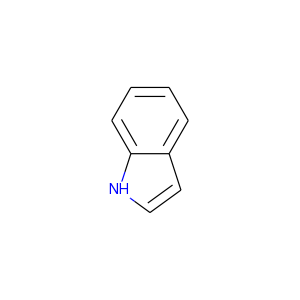
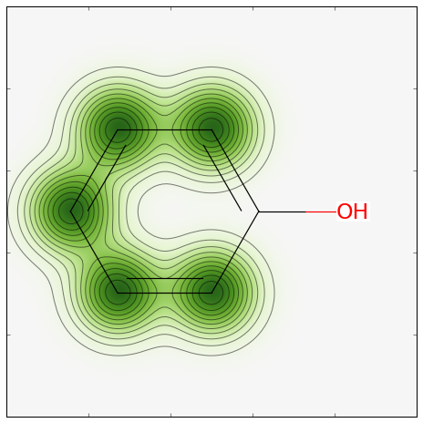

RDKitクックブック
##################################
[`RDKit Cookbook <https://www.rdkit.org/docs/Cookbook.html#rdkit-cookbook>`__]

このページについて
**************************************
[`What is this? <https://www.rdkit.org/docs/Cookbook.html#what-is-this>`__]

このページはPythonからRDKitの機能を使って特定のタスクをどうやって実行すれば良いか例を示します。このコンテンツはRDKitコミュニティの協力で作られています。

間違いを見つけたり、より良い方法を提案する場合は、ソースドキュメント（.rstファイル）をご自身で修正していただくか、メーリングリスト:\ rdkit-discuss@lists.sourceforge.net\ に送ってください。（メーリングリストを利用する場合はまず加入する必要があります。）

雑多な話題
**************************************
[`Miscellaneous Topics <https://www.rdkit.org/docs/Cookbook.html#miscellaneous-topics>`__]

異なる芳香族性モデルを使う方法
========================================
[`Using a different aromaticity model <https://www.rdkit.org/docs/Cookbook.html#using-a-different-aromaticity-model>`__]

デフォルトでは、RDKitは分子を読み込むときにRDKit自体の芳香族性モデル（RDKit Theory Bookで説明されています）を適用します。
ですが、このモデルを上書きし、自分の芳香族性モデルを使うのはとても簡単です。

最も簡単な方法は、保持してほしい芳香族性のセットと合わせてSMILESで分子を提供することです。例えばインドールの場合を考えましょう:

デフォルトではRDKitはどちらの環構造も芳香族であると認識します:

.. code:: python

   >>> from rdkit import Chem
   >>> m = Chem.MolFromSmiles('N1C=Cc2ccccc12')
   >>> m.GetSubstructMatches(Chem.MolFromSmarts('c'))
   ((1,), (2,), (3,), (4,), (5,), (6,), (7,), (8,))

５員環を脂肪族として扱いたいなら、これは入力のSMILESがどのように書かれているかという問題ですが、ケクレ化（kekulization）と芳香族性を認識する過程をスキップする、
部分的なサニタイゼーションを行う必要があるだけです:

.. code:: python

   >>> m2 = Chem.MolFromSmiles('N1C=Cc2ccccc12',sanitize=False)
   >>> Chem.SanitizeMol(m2,sanitizeOps=Chem.SanitizeFlags.SANITIZE_ALL^Chem.SanitizeFlags.SANITIZE_KEKULIZE^Chem.SanitizeFlags.SANITIZE_SETAROMATICITY)
     rdkit.Chem.rdmolops.SanitizeFlags.SANITIZE_NONE
   >>> m2.GetSubstructMatches(Chem.MolFromSmarts('c'))
   ((3,), (4,), (5,), (6,), (7,), (8,))

もちろん自分の芳香族性認識関数を書くことも可能ですが、このドキュメントで扱う範囲を超えています。

分子の操作
**************************************
[`Manipulating Molecules <https://www.rdkit.org/docs/Cookbook.html#manipulating-molecules>`__]

ヘテロ環のクリーンアップ
========================================
[`Cleaning up heterocycles <https://www.rdkit.org/docs/Cookbook.html#cleaning-up-heterocycles>`__]

メーリングリストの議論；

-  http://www.mail-archive.com/rdkit-discuss@lists.sourceforge.net/msg01185.html
-  http://www.mail-archive.com/rdkit-discuss@lists.sourceforge.net/msg01162.html
-  http://www.mail-archive.com/rdkit-discuss@lists.sourceforge.net/msg01900.html
-  http://www.mail-archive.com/rdkit-discuss@lists.sourceforge.net/msg01901.html

コード: 使用例: 結果:

並列化したコンフォメーション生成
========================================
[`Parallel conformation generation <https://www.rdkit.org/docs/Cookbook.html#parallel-conformation-generation>`__]

メーリングリストでのディスカッション: http://www.mail-archive.com/rdkit-discuss@lists.sourceforge.net/msg02648.html

コード:

.. code:: python

   """ オリジナルはAndrew Dalke氏によるものです """
   import sys
   from rdkit import Chem
   from rdkit.Chem import AllChem

   # これは右のリンクからダウンロードできます http://pypi.python.org/pypi/futures
   from concurrent import futures

   # これは右のリンクからダウンロードできます http://pypi.python.org/pypi/progressbar
   import progressbar

   ## 私のマシンではwoker１つで39秒、４つで10秒かかりました。
   ## 29.055u 0.102s 0:28.68 101.6%   0+0k 0+3io 0pf+0w
   #max_workers=1

   ## スレッド４つでは11秒かかりました。
   ## 34.933u 0.188s 0:10.89 322.4%   0+0k 125+1io 0pf+0w
   max_workers=4

   # （ユーザータイム(u)は子プロセスに使われた時間も含みます
   #  実時間はそれぞれ28.68秒と10.89でした。）

   # この関数はサブプロセスで呼び出されます。
   # パラメータ（分子とコンフォマーの数）はPythonを介して渡されます。
   def generateconformations(m, n):
       m = Chem.AddHs(m)
       ids=AllChem.EmbedMultipleConfs(m, numConfs=n, params=AllChem.ETKDG())
       # EmbedMultipleConfsはBoost-wrappedタイプを返しますが、これはピッケル化できません。
       # Pythonのリストに変換することはできます。
       return m, list(ids)

   smi_input_file, sdf_output_file = sys.argv[1:3]

   n = int(sys.argv[3])

   writer = Chem.SDWriter(sdf_output_file)

   suppl = Chem.SmilesMolSupplier(smi_input_file, titleLine=False)

   with futures.ProcessPoolExecutor(max_workers=max_workers) as executor:
       # 非同期性のジョブのセットを投げます。
       jobs = []
       for mol in suppl:
           if mol:
               job = executor.submit(generateconformations, mol, n)
               jobs.append(job)

       widgets = ["Generating conformations; ", progressbar.Percentage(), " ",
                  progressbar.ETA(), " ", progressbar.Bar()]
       pbar = progressbar.ProgressBar(widgets=widgets, maxval=len(jobs))
       for job in pbar(futures.as_completed(jobs)):
           mol,ids=job.result()
           for id in ids:
               writer.write(mol, confId=id)
   writer.close()

電荷を帯びた分子の中和
========================================
[`Neutralizing Charged Molecules <https://www.rdkit.org/docs/Cookbook.html#neutralizing-charged-molecules>`__]

メーリングリストでのディスカッション: http://www.mail-archive.com/rdkit-discuss@lists.sourceforge.net/msg02669.html

コード:

.. code:: python

   """ Hans de Winter氏によるものです """
   from rdkit import Chem
   from rdkit.Chem import AllChem

   def _InitialiseNeutralisationReactions():
       patts= (
           # Imidazoles
           ('[n+;H]','n'),
           # Amines
           ('[N+;!H0]','N'),
           # Carboxylic acids and alcohols
           ('[$([O-]);!$([O-][#7])]','O'),
           # Thiols
           ('[S-;X1]','S'),
           # Sulfonamides
           ('[$([N-;X2]S(=O)=O)]','N'),
           # Enamines
           ('[$([N-;X2][C,N]=C)]','N'),
           # Tetrazoles
           ('[n-]','[nH]'),
           # Sulfoxides
           ('[$([S-]=O)]','S'),
           # Amides
           ('[$([N-]C=O)]','N'),
           )
       return [(Chem.MolFromSmarts(x),Chem.MolFromSmiles(y,False)) for x,y in patts]

   _reactions=None
   def NeutraliseCharges(smiles, reactions=None):
       global _reactions
       if reactions is None:
           if _reactions is None:
               _reactions=_InitialiseNeutralisationReactions()
           reactions=_reactions
       mol = Chem.MolFromSmiles(smiles)
       replaced = False
       for i,(reactant, product) in enumerate(reactions):
           while mol.HasSubstructMatch(reactant):
               replaced = True
               rms = AllChem.ReplaceSubstructs(mol, reactant, product)
               mol = rms[0]
       if replaced:
           return (Chem.MolToSmiles(mol,True), True)
       else:
           return (smiles, False)

使用例:

.. code:: python

   smis=("c1cccc[nH+]1",
         "C[N+](C)(C)C","c1ccccc1[NH3+]",
         "CC(=O)[O-]","c1ccccc1[O-]",
         "CCS",
         "C[N-]S(=O)(=O)C",
         "C[N-]C=C","C[N-]N=C",
         "c1ccc[n-]1",
         "CC[N-]C(=O)CC")
   for smi in smis:
       (molSmiles, neutralised) = NeutraliseCharges(smi)
       print(smi + "->" + molSmiles)

結果:

.. code:: python

   c1cccc[nH+]1 -> c1ccncc1
   C[N+](C)(C)C -> C[N+](C)(C)C
   c1ccccc1[NH3+] -> Nc1ccccc1
   CC(=O)[O-] -> CC(=O)O
   c1ccccc1[O-] -> Oc1ccccc1
   CCS -> CCS
   C[N-]S(=O)(=O)C -> CNS(C)(=O)=O
   C[N-]C=C -> C=CNC
   C[N-]N=C -> C=NNC
   c1ccc[n-]1 -> c1cc[nH]c1
   CC[N-]C(=O)CC -> CCNC(=O)CC

RDKitの3D機能
**************************************
[`3D functionality in the RDKit <https://www.rdkit.org/docs/Cookbook.html#d-functionality-in-the-rdkit>`__]

RDKitには3Dを取り扱う広範囲な機能があります。たとえば:

-  Shape alignment
-  RMS Calculation
-  Shape Tanimoto Distance
-  Shape Protrude Distance
-  3D pharmacophore fingerprint
-  Torsion fingerprint (deviation)

現在、RDKitでは利用可能なアラインメントのメソッドが２つあります。例として、PDBの同じ分子から２つの結晶構造を使います。

コード:

.. code:: python

   from rdkit import Chem, RDConfig
   from rdkit.Chem import AllChem, rdMolAlign
   # 参照となる分子(reference molecule)
   ref = Chem.MolFromSmiles('NC(=[NH2+])c1ccc(C[C@@H](NC(=O)CNS(=O)(=O)c2ccc3ccccc3c2)C(=O)N2CCCCC2)cc1')
   # PDBのコンフォメーション
   mol1 = Chem.MolFromPDBFile(RDConfig.RDBaseDir+'/rdkit/Chem/test_data/1DWD_ligand.pdb')
   mol1 = AllChem.AssignBondOrdersFromTemplate(ref, mol1)
   mol2 = Chem.MolFromPDBFile(RDConfig.RDBaseDir+'/rdkit/Chem/test_data/1PPC_ligand.pdb')
   mol2 = AllChem.AssignBondOrdersFromTemplate(ref, mol2)
   # アラインメントを取ります
   rms = rdMolAlign.AlignMol(mol1, mol2)
   print(rms)
   # OPEN3DAlignを使ってアラインメントを取ります
   pyO3A = rdMolAlign.GetO3A(mol1, mol2)
   score = pyO3A.Align()
   print(score)

結果：

.. code:: python

   1.55001955728
   0.376459885045

分子に一つ以上のコンフォマーが含まれている場合、最初のコンフォマーに関してアラインメントを取ります。
リストがオプションのRMSlistに渡された場合、アラインメントによるRMS値が格納されます。
一つの分子の二つのコンフォマーのRMS値は別々に計算することもでき、（prealignedフラグを使うことで）アライメント有り、無しのどちらでも計算可能です。

使用例:

.. code:: python

   from rdkit import Chem
   from rdkit.Chem import AllChem
   mol = Chem.MolFromSmiles('NC(=[NH2+])c1ccc(C[C@@H](NC(=O)CNS(=O)(=O)c2ccc3ccccc3c2)C(=O)N2CCCCC2)cc1')
   cids = AllChem.EmbedMultipleConfs(mol, numConfs=50, maxAttempts=1000, pruneRmsThresh=0.1)
   print(len(cids))
   # コンフォマーのアラインメントを取ります
   rmslist = []
   AllChem.AlignMolConformers(mol, RMSlist=rmslist)
   print(len(rmslist))
   # コンフォマー1から9のRMSを別々に計算します
   rms = AllChem.GetConformerRMS(mol, 1, 9, prealigned=True)

結果:

.. code:: python

   50
   49

形状比較のため、RDKitはあらかじめアラインメントされた分子あるいはコンフォマーに対して、
形状に基づく距離（Shape-based distances）を２つ用意しています。
形状はみ出し距離（Shape protrude distance）は体積のミスマッチに焦点をあてていて、
形状タニモト距離（Shape Tanimoto distance）は重ね合わせた体積全体を考慮に入れます。

使用例:

.. code:: python

   from rdkit import Chem, RDConfig
   from rdkit.Chem import AllChem, rdMolAlign, rdShapeHelpers
   ref = Chem.MolFromSmiles('NC(=[NH2+])c1ccc(C[C@@H](NC(=O)CNS(=O)(=O)c2ccc3ccccc3c2)C(=O)N2CCCCC2)cc1')
   mol1 = Chem.MolFromPDBFile(RDConfig.RDBaseDir+'/rdkit/Chem/test_data/1DWD_ligand.pdb')
   mol1 = AllChem.AssignBondOrdersFromTemplate(ref, mol1)
   mol2 = Chem.MolFromPDBFile(RDConfig.RDBaseDir+'/rdkit/Chem/test_data/1PPC_ligand.pdb')
   mol2 = AllChem.AssignBondOrdersFromTemplate(ref, mol2)
   rms = rdMolAlign.AlignMol(mol1, mol2)
   tani = rdShapeHelpers.ShapeTanimotoDist(mol1, mol2)
   prtr = rdShapeHelpers.ShapeProtrudeDist(mol1, mol2)
   print(rms, tani, prtr)

結果:

.. code:: python

   1.55001955728 0.18069102331 0.0962800875274

3Dファーマコフォアフィンガープリントは、3D距離行列を2Dファーマコフォア機能に与えることで、RDKitを使って計算することができます。

使用例:

.. code:: python

   from rdkit import Chem, DataStructs, RDConfig
   from rdkit.Chem import AllChem
   from rdkit.Chem.Pharm2D import Gobbi_Pharm2D, Generate
   ref = Chem.MolFromSmiles('NC(=[NH2+])c1ccc(C[C@@H](NC(=O)CNS(=O)(=O)c2ccc3ccccc3c2)C(=O)N2CCCCC2)cc1')
   mol1 = Chem.MolFromPDBFile(RDConfig.RDBaseDir+'/rdkit/Chem/test_data/1DWD_ligand.pdb')
   mol1 = AllChem.AssignBondOrdersFromTemplate(ref, mol1)
   mol2 = Chem.MolFromPDBFile(RDConfig.RDBaseDir+'/rdkit/Chem/test_data/1PPC_ligand.pdb')
   mol2 = AllChem.AssignBondOrdersFromTemplate(ref, mol2)
   # ファーマコフォアフィンガープリント
   factory = Gobbi_Pharm2D.factory
   fp1 = Generate.Gen2DFingerprint(mol1, factory, dMat=Chem.Get3DDistanceMatrix(mol1))
   fp2 = Generate.Gen2DFingerprint(mol2, factory, dMat=Chem.Get3DDistanceMatrix(mol2))
   # Tanimoto類似度
   tani = DataStructs.TanimotoSimilarity(fp1, fp2)
   print(tani)

結果:

.. code:: python

   0.451665312754

RDKitはSchulz-Gaschら（J. Chem. Inf. Model, 52, 1499, 2012）により開発された手法、
トーションフィンガープリントデビエーション（torsion fingerprint deviation:TFD)も実装しています。
一つの分子のコンフォマーのペアについて、回転可能な結合と環系の二面角をトーションフィンガープリント（torsion fingerprint: TF）に記録し、
そしてTF間の偏差を計算、規格化、そして合計を取ります。各二面角について。a-b-c-dの4つの原子のセットが選ばれます。

RDKitの実装では、次に示すようにトーションフィンガープリントをカスタマイズすることが可能です。

-  元々の手法では、二面角は分子の中心に対する距離に基づいて重みづけられていました。デフォルトでは、この重みづけが実行されますが、useWeights=Falseフラグを使うことで、実行しないようにできます。
-  対称的な原子aとd（あるいは、aかd）が存在しているとき、全てのとりうる二面角が計算されます。２つの原子が対称的かどうか決定するため、与えられた半径（デフォルトは半径=2）のMorganアルゴリズムに基づくハッシュ・コードが使われます。
-  元々の方法では規格化に使われる最大の偏差は、全ての二面角に対して180.0度です（デフォルト）。maxDev=’spec’とすることで、最大偏差に依存する二面角のタイプが規格化に使われます。
-  元々の方法では、三重結合とアレンに隣接する単結合は無視されます（デフォルト）。ignoreColinearBonds=’False’とすることで、“連結された(combined)”二面角が使われます。

以上に加えて、Schulz-Gaschらによる方法と異なる点が2、3あります:

-  水素原子は決して考慮されません。
-  元々の方法では、原子bとc（あるいはbかc）に複数の非対称な隣接原子がある場合、原子aとd（あるいはaかd）はランダムに選ばれていました。RDKitの実装では最小のMorgan不変量をもつ原子を選びます。この方法では分子の原子の順番に選択する原子が依存しません。
-  原子aとd（あるいはaかd）が対称的な場合、元々の手法では最も小さい二面角のみを保存しますが、RDKitの実装では全ての取りうる二面角をTFに保存します。続いて、全ての取りうる偏差が決定され、そして最も小さいものがTFDの計算に使われます。この手順により最も小さい偏差がTFDに入ることを保証します。

使用例:

.. code:: python

   from rdkit import Chem, RDConfig
   from rdkit.Chem import AllChem, TorsionFingerprints
   ref = Chem.MolFromSmiles('NC(=[NH2+])c1ccc(C[C@@H](NC(=O)CNS(=O)(=O)c2ccc3ccccc3c2)C(=O)N2CCCCC2)cc1')
   mol1 = Chem.MolFromPDBFile(RDConfig.RDBaseDir+'/rdkit/Chem/test_data/1DWD_ligand.pdb')
   mol1 = AllChem.AssignBondOrdersFromTemplate(ref, mol1)
   mol2 = Chem.MolFromPDBFile(RDConfig.RDBaseDir+'/rdkit/Chem/test_data/1PPC_ligand.pdb')
   mol2 = AllChem.AssignBondOrdersFromTemplate(ref, mol2)
   tfd1 = TorsionFingerprints.GetTFDBetweenMolecules(mol1, mol2)
   tfd2 = TorsionFingerprints.GetTFDBetweenMolecules(mol1, mol2, useWeights=False)
   tfd3 = TorsionFingerprints.GetTFDBetweenMolecules(mol1, mol2, maxDev='spec')
   print(tfd1, tfd2, tfd3)

結果:

.. code:: python

   0.0691236990428 0.111475253992 0.0716255058804

同じ分子のコンフォマー間のTFDを計算する場合、性能上の理由で\ ``GetTFDBetweenConformers()``\ 関数を使うべきです。

使用例:

.. code:: python

   from rdkit import Chem, RDConfig
   from rdkit.Chem import AllChem, TorsionFingerprints
   ref = Chem.MolFromSmiles('NC(=[NH2+])c1ccc(C[C@@H](NC(=O)CNS(=O)(=O)c2ccc3ccccc3c2)C(=O)N2CCCCC2)cc1')
   mol1 = Chem.MolFromPDBFile(RDConfig.RDBaseDir+'/rdkit/Chem/test_data/1DWD_ligand.pdb')
   mol1 = AllChem.AssignBondOrdersFromTemplate(ref, mol1)
   mol2 = Chem.MolFromPDBFile(RDConfig.RDBaseDir+'/rdkit/Chem/test_data/1PPC_ligand.pdb')
   mol1.AddConformer(mol2.GetConformer(), assignId=True)
   tfd = TorsionFingerprints.GetTFDBetweenConformers(mol1, confIds1=[0], confIds2=[1])
   print(tfd)

結果:

.. code:: python

   [0.0691...]

コンフォマーRMSとTFDの値のため、RDKitでは、Butinaクラスタリングといったクラスタリングアルゴリズムに与えることができる対称行列を直接計算する簡易関数を用意しています。
フラグの並べ替えにより、クラスターが作られるたびに毎回、クラスタリングされていない分子について近接するものの数が更新されることを保証します。

使用例:

.. code:: python

   from rdkit import Chem
   from rdkit.Chem import AllChem, TorsionFingerprints
   from rdkit.ML.Cluster import Butina
   mol = Chem.MolFromSmiles('NC(=[NH2+])c1ccc(C[C@@H](NC(=O)CNS(=O)(=O)c2ccc3ccccc3c2)C(=O)N2CCCCC2)cc1')
   cids = AllChem.EmbedMultipleConfs(mol, numConfs=50, maxAttempts=1000, pruneRmsThresh=0.1)
   # RMS行列（RMS matrix）
   rmsmat = AllChem.GetConformerRMSMatrix(mol, prealigned=False)
   # TFD行列（TFD matrix）
   tfdmat = TorsionFingerprints.GetTFDMatrix(mol)
   # クラスタリング
   num = mol.GetNumConformers()
   rms_clusters = Butina.ClusterData(rmsmat, num, 2.0, isDistData=True, reordering=True)
   tfd_clusters = Butina.ClusterData(tfdmat, num, 0.3, isDistData=True, reordering=True)

RDKitと一緒にscikit-learnを使う方法
**************************************
[`Using scikit-learn with RDKit <https://www.rdkit.org/docs/Cookbook.html#using-scikit-learn-with-rdkit>`__]

scikit-learnはPythoのための機械学習のライブラリで、様々な教師あり、教師無しの手法を含みます。siki-learnに関するドキュメンテーションはこちらにあります: http://scikit-learn.org/stable/user_guide.html

RDKitのフィンガープリントはscikit-learnの機械学習モデルを訓練するのに使うことができます。これはランダムフォレストの例です。

コード:

.. code:: python

   from rdkit import Chem, DataStructs
   from rdkit.Chem import AllChem
   from sklearn.ensemble import RandomForestClassifier
   import numpy

   # ４つの分子を生成
   m1 = Chem.MolFromSmiles('c1ccccc1')
   m2 = Chem.MolFromSmiles('c1ccccc1CC')
   m3 = Chem.MolFromSmiles('c1ccncc1')
   m4 = Chem.MolFromSmiles('c1ccncc1CC')
   mols = [m1, m2, m3, m4]

   # フィンガープリントを生成: 半径２のMorganフィンガープリント
   fps = [AllChem.GetMorganFingerprintAsBitVect(m, 2) for m in mols]

   # RDKitの明示的なベクトルをNumpyのアレイに変換
   np_fps = []
   for fp in fps:
     arr = numpy.zeros((1,))
     DataStructs.ConvertToNumpyArray(fp, arr)
     np_fps.append(arr)

   # 100個のツリーをもつランダムフォレスト分類器を手に入れます
   rf = RandomForestClassifier(n_estimators=100, random_state=1123)

   # 最初の２つの分子を活性あり（active, class 1）、
   # 残りの２つを活性無し（inactive, class 0）として、
   # ランダムフォレストを訓練します
   ys_fit = [1, 1, 0, 0]
   rf.fit(np_fps, ys_fit)

   # 新しい分子を予測するためにランダムフォレストを使います
   m5 = Chem.MolFromSmiles('c1ccccc1O')
   fp = numpy.zeros((1,))
   DataStructs.ConvertToNumpyArray(AllChem.GetMorganFingerprintAsBitVect(m5, 2), fp)

   print(rf.predict((fp,)))
   print(rf.predict_proba((fp,)))

scikit-learn バージョン0.13での出力結果は:

.. code:: python

   [1]
   [[ 0.14 0.86]]

このモデルに対して類似度マップを作成しましょう。 コードは:

.. code:: python

   from rdkit.Chem.Draw import SimilarityMaps

   # ヘルパー関数
   def getProba(fp, predictionFunction):
     return predictionFunction((fp,))[0][1]

   m5 = Chem.MolFromSmiles('c1ccccc1O')
   fig, maxweight = SimilarityMaps.GetSimilarityMapForModel(m5, SimilarityMaps.GetMorganFingerprint, lambda x: getProba(x, rf.predict_proba))

これで、次の結果が返ってきます:

カスタムMCSアトムタイプを使う方法
**************************************
[`Using custom MCS atom types <https://www.rdkit.org/docs/Cookbook.html#using-custom-mcs-atom-types>`__]

メーリングリストの議論: http://www.mail-archive.com/rdkit-discuss@lists.sourceforge.net/msg03676.html

IPython notebook: http://nbviewer.ipython.org/gist/greglandrum/8351725
https://gist.github.com/greglandrum/8351725

MCSについては可読性のあるSMILESを手に入れることができますが、このセクションの目標はMCSコードでカスタムアトムタイプを使えるようになることです。
マッチングに同位体の情報を使うために、MCSコードのオプションを使います。そして、我々の同位体の情報を含む偽の同位体の値をセットします。

コード:

.. code:: python

   from rdkit import Chem
   from rdkit.Chem import rdFMCS

   # テストに用いる分子:
   smis=["COc1ccc(C(Nc2nc3c(ncn3COCC=O)c(=O)[nH]2)(c2ccccc2)c2ccccc2)cc1",
         "COc1ccc(C(Nc2nc3c(ncn3COC(CO)(CO)CO)c(=O)[nH]2)(c2ccccc2)c2ccccc2)cc1"]
   ms = [Chem.MolFromSmiles(x) for x in smis]

   def label(a):
     " a simple hash combining atom number and hybridization "
     return 100*int(a.GetHybridization())+a.GetAtomicNum()

   # あとで分子を変えるので、コピーしておきます:
   nms = [Chem.Mol(x) for x in ms]
   for nm in nms:
     for at in nm.GetAtoms():
         at.SetIsotope(label(at))

   mcs=rdFMCS.FindMCS(nms,atomCompare=rdFMCS.AtomCompare.CompareIsotopes)
   print(mcs.smartsString)

これで次の出力が得られます:

.. code:: python

   [406*]-[308*]-[306*]1:[306*]:[306*]:[306*](:[306*]:[306*]:1)-[406*](-[307*]-[306*]1:[307*]:[306*]2:[306*](:[306*](:[307*]:1)=[308*]):[307*]:[306*]:[307*]:2-[406*]-[408*]-[406*])(-[306*]1:[306*]:[306*]:[306*]:[306*]:[306*]:1)-[306*]1:[306*]:[306*]:[306*]:[306*]:[306*]:1

これが我々が求めたものではありますが、必ずしも可読性の高いものではありません。２ステップのプロセスで、より読みやすい形式とすることができます:

1. MCSの部分構造マッチングをコピーした分子に対して行う
2. コピーとマッチした原子だけを使って、元々の分子のSMILESを生成する

我々はコピーと元々の分子のアトムインデックスが同じであると知っているので、これで上手くいきます。

.. code:: python

   def getMCSSmiles(mol,labelledMol,mcs):
       mcsp = Chem.MolFromSmarts(mcs.smartsString)
       match = labelledMol.GetSubstructMatch(mcsp)
       return Chem.MolFragmentToSmiles(mol,atomsToUse=match,
                                       isomericSmiles=True,
                                       canonical=False)

   print(getMCSSmiles(ms[0],nms[0],mcs))

   COc1ccc(C(Nc2nc3c(ncn3COC)c(=O)[nH]2)(c2ccccc2)c2ccccc2)cc1

これが我々が探し求めていたものです。

分子のクラスタリング
**************************************
[`Clustering molecules <https://www.rdkit.org/docs/Cookbook.html#clustering-molecules>`__]

大きな分子のセット（1000から2000以上）には、Butinaクラスタリングアルゴリズムを使うのが最も効率が良いです。

これが、フィンガープリントのセットに対してクラスタリングを行うためのコードです:

.. code:: python

   def ClusterFps(fps,cutoff=0.2):
       from rdkit import DataStructs
       from rdkit.ML.Cluster import Butina

       # まず距離行列を生成します:
       dists = []
       nfps = len(fps)
       for i in range(1,nfps):
           sims = DataStructs.BulkTanimotoSimilarity(fps[i],fps[:i])
           dists.extend([1-x for x in sims])

       # データをクラスタリングします:
       cs = Butina.ClusterData(dists,nfps,cutoff,isDistData=True)
       return cs

戻り値はクラスターのタプルで、各クラスターはidのタプルとなっています。

使用例:

.. code:: python

   from rdkit import Chem
   from rdkit.Chem import AllChem
   import gzip
   ms = [x for x in Chem.ForwardSDMolSupplier(gzip.open('zdd.sdf.gz')) if x is not None]
   fps = [AllChem.GetMorganFingerprintAsBitVect(x,2,1024) for x in ms]
   clusters=ClusterFps(fps,cutoff=0.4)

変数のクラスターが結果を含んでいます:

.. code:: python

   >>> print(clusters[200])
   (6164, 1400, 1403, 1537, 1543, 6575, 6759)

このクラスタには7点含まれており、クラスターの重心は6164です。

N個の分子の間でRMSDを計算
**************************************
[`RMSD Calculation between N molecules <https://www.rdkit.org/docs/Cookbook.html#rmsd-calculation-between-n-molecules>`__]

イントロダクション
========================================
[`Introduction <https://www.rdkit.org/docs/Cookbook.html#introduction>`__]

時々、２つ（あるいはそれ以上の）分子間のRMSD距離を計算する必要が生じます。これは２つのコンフォマーのがどれだけ近いかを計算するのに使われます。ほとんどのRMSD計算は類似の化合物、あるいは、少なくとも共通の部分をもつ異なる化合物についてのみ、意味をなします。

詳細
========================================
[`Details <https://www.rdkit.org/docs/Cookbook.html#details>`__]

（Python 2.7で書かれた）次のプログラムはSDFファイルを入力とし、ファイルに含まれる分子間の全てのRMSD距離を生成します。これらの距離は（ユーザーが定義した）出力ファイルに書き込まれます。

５つのコンフォマーを持つSDFにたいしては、10個のRMSDスコアが得られます。典型的な、n個から反復無しにk個を選び出す問題です。すなわち、5!/2!(5-2)!。

コード：

.. code:: python

   #!/usr/bin/python
   '''
   ファイルの中の全ての構造間のRMSDの差を計算

   @author: JP <jp@javaclass.co.uk>
   '''
   import os
   import getopt
   import sys

   # rdkitをインポート
   from rdkit import Chem
   from rdkit.Chem import AllChem

   '''
   文字列のコンテンツをファイルに書き込む
   '''
   def write_contents(filename, contents):
     # 基本的なチェックをいくつか行います。厳密に言えばassertを使うことができます。
     assert filename is not None, "filename cannot be None"
     assert contents is not None, "contents cannot be None"
     f = open(filename, "w")
     f.write(contents)
     f.close() # ファイルをクローズします

   '''
   リストをファイルに書き込みます
   '''
   def write_list_to_file(filename, list, line_sep = os.linesep):
     # 基本的なチェックをいくつか行います。厳密に言えばassertを使うことができます。
     assert list is not None and len(list) > 0, "list cannot be None or empty"
     write_contents(filename, line_sep.join(list))

   '''
   RMSDのスプレッドを計算
   '''
   def calculate_spread(molecules_file):

     assert os.path.isfile(molecules_file), "File %s does not exist!" % molecules

     # イテレータの取得
     mols = Chem.SDMolSupplier(molecules_file)

     spread_values = []
     # いくつの分子がファイルの中に含まれているか？
     mol_count = len(mols)
     # それぞれの分子を他の全ての分子と比較します。
     # 典型的なn個からk個を選択する話です（nから2個選択）
     # 組み合わせの数は(n!) / k!(n-k)! で与えら得れます（私の数学能力が錆ついていなければ）
     for i in range(mol_count - 1):
         for j in range(i+1, mol_count):
             # 何かの処理が行われていることを表示するようにしましょう・・・mol_countの値が大きい場合、ある程度の時間がかかるので
             print("Aligning molecule #%d with molecule #%d (%d molecules in all)" % (i, j, mol_count))
             # RMSDを計算し、アレイに格納します
             # AlignMolと異なって、これは対称性の処理も行います
             spread_values.append(str(AllChem.GetBestRMS(mols[i], mols[j])))
     # アレイを返します
     return spread_values

   def main():
     try:
         # オプションは次の通りです:
         # f - 実際の構造のファイル
         opts, args = getopt.getopt(sys.argv[1:], "vf:o:")
     except getopt.GetoptError, err:
         # ヘルプの情報をprint関数で出力し、終了します:
         print(str(err)) # これは "option -a not recognized" といったようなものを出力します
         sys.exit(401)

     # デフォルト
     molecules_file  = None
     output_file = None

     for opt, arg in opts:
         if opt == "-v":
             print("RMSD Spread 1.1")
             sys.exit()
         elif opt == "-f":
             molecules_file = arg
         elif opt == "-o":
             output_file = arg
         else:
             assert False, "Unhandled option: " + opt

     # 次をassertしてください - 最も綺麗な方法ではありませんが、上手くいきます
     assert molecules_file is not None, "file containing molecules must be specified, add -f to command line arguments"
     assert output_file is not None, "output file must be specified, add -o to command line arguments"
     # RMSDスプレッドの値を得ます
     spread_values = calculate_spread(molecules_file)
     # ファイルに書き込みます
     write_list_to_file(output_file, spread_values)

   if __name__ == "__main__":
     main()

このプログラムは次のような方法でコマンドラインから実行されるかもしれません（Pythonのインタプリタが\ ``/usr/bin/python``\ にある場合です。
その他の場合は最初の行（滑稽な名前がつけられたシバン）を編集してください:

.. code:: python

   calculate_spread.py -f my_conformers.sdf -o my_conformers.rmsd_spread.txt

要約:
\ ``AllChem.GetBestRMS(mol1, mol2)``\ の行はRMSDを不動小数点型として返し、このプログラムの要点となっています。
\ ``GetBestRMS()``\ は\ ``AlignMol()``\ と異なり対称性を考慮に入れた処理を行います。

ライセンス
**************************************
[`License <https://www.rdkit.org/docs/Cookbook.html#license>`__]

この文書の著作権は copyright (C) 2013-2018 by Greg Landrumに所属しています。

この文書はCreative Commons Attribution-ShareAlike 4.0 Licenseのもとでライセンスされています。
このライセンスを見るためには http://creativecommons.org/licenses/by-sa/4.0/ にアクセスするか、
Creative Commons, 543 Howard Street, 5th Floor, San Francisco, California, 94105, USA.　に手紙を送ってください。

このライセンスの意図はRDKitそのものの意図と似ています。
簡単に言えば“これを使ってなんでもやりたいことをやっていいですが、私たちの功績についても言及してください”
