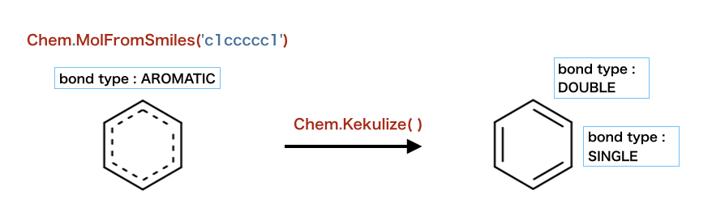
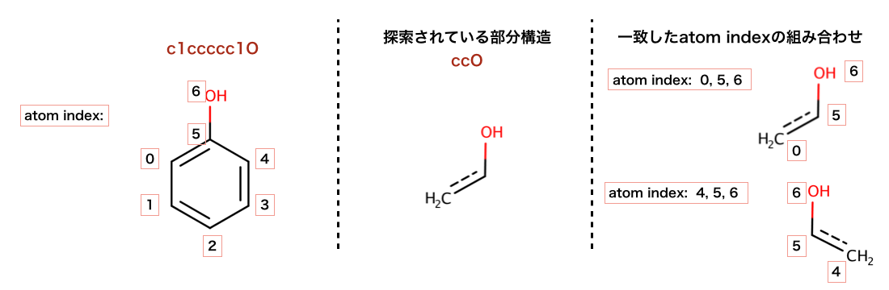
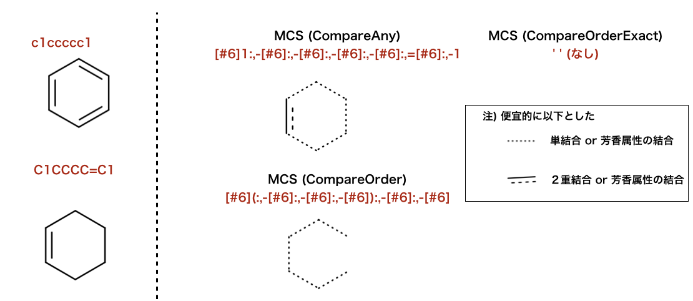
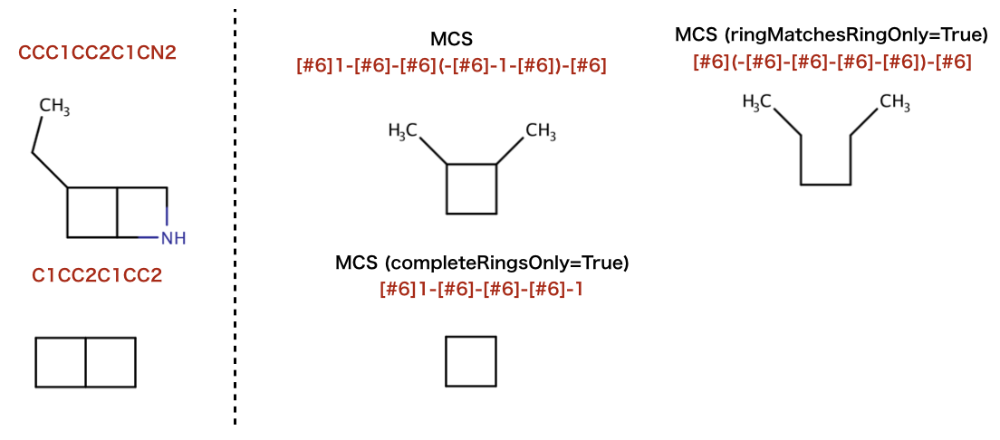
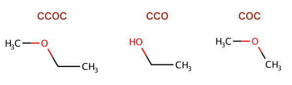
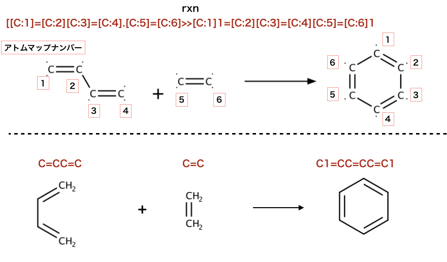

「PythonでRDKitを始めよう」日本語版補遺
^^^^^^^^^^^^^^^^^^^^^^^^^^^^^^^^^^^^^^^^^^^^^^^^^^^^^^^^^^^^^^^^^^^^^^^^^^^^^^^^^^^^^

RDKit online documentation には様々なコード事例が記載されていますが、
線形表記が多用されていて、SMILESやSMARTSに馴染みがない場合何を行おうとしているかわかりにくい部分があると思います。
このページでは理解の助けとなることを期待し２次元の構造式での表記を掲載します。
以下のページの図表の多くは\ `ChemAxon社 <https://chemaxon.com>`__\  の
\ `MarvinSketch <https://chemaxon.com/products/marvin>`__\  version 18.24.0 を使用して作成しました。
また、
SMILES、SMARTSの解釈にあたってそれぞれDaylight社の\ `SMILES <http://www.daylight.com/dayhtml_tutorials/languages/smiles/index.html>`__\  、
\ `SMARTS <http://www.daylight.com/dayhtml_tutorials/languages/smarts/index.html>`__\
のページを参考にしました。

.. _jp-notes_1:

注釈: 分子の読み込みと書き込み > 1分子の読み込み
***************************************************************************************************************************************

\* \ :ref:`本文<back-to-ref_1>` に戻る

.. code:: python

   >>> m = Chem.MolFromSmiles('Cc1ccccc1')

こちらで読み込まれているSMILES「Cc1ccccc1」はトルエンです。

.. image:: supple_images/jp_supple_1.png

エラーメッセージを出すために使われれている構造は：

.. code:: python

   >>> m1 = Chem.MolFromSmiles('CO(C)C')

および

.. code:: python

   >>> m2 = Chem.MolFromSmiles('c1cc1')

以下のコードではSMILESをisomeric SMILESとするかしないかの違いが検証されています。

.. code:: python

   >>> m = Chem.MolFromMolFile('data/chiral.mol')
   >>> Chem.MolToSmiles(m)
   'C[C@H](O)c1ccccc1'
   >>> Chem.MolToSmiles(m,isomericSmiles=False)
   'CC(O)c1ccccc1'

.. image:: supple_images/jp_supple_4.png

\ ``isomericSmiles=False``\ とすることでキラルについての情報が失われています。

以下のコードでは複数のSMILESが同一のピリジンを表すことを示し、
再度SMILESに変換し直すとcanonical SMILESとなっています。

.. code:: python

   >>> Chem.MolToSmiles(Chem.MolFromSmiles('C1=CC=CN=C1'))
   'c1ccncc1'
   >>> Chem.MolToSmiles(Chem.MolFromSmiles('c1cccnc1'))
   'c1ccncc1'
   >>> Chem.MolToSmiles(Chem.MolFromSmiles('n1ccccc1'))
   'c1ccncc1'

以下のコードではケクレ形式のSMILESを生成しています。

.. code:: python

   >>> Chem.Kekulize(m)
   >>> Chem.MolToSmiles(m,kekuleSmiles=True)
   'C[C@H](O)C1=CC=CC=C1'

.. image:: supple_images/jp_supple_6.png

.. _jp-notes_2:

注釈: 分子の取り扱い方 > 原子、結合をループする
***************************************************************************************************************************************

\* \ :ref:`本文<back-to-ref_2>` に戻る

以下のコードではオキシランを生成し、原子番号をprintしています。

.. code:: python

   >>> m = Chem.MolFromSmiles('C1OC1')
   >>> for atom in m.GetAtoms():
   ...   print(atom.GetAtomicNum())
   ...
   6
   8
   6
   >>> print(m.GetBonds()[0].GetBondType())
   SINGLE

このセクションの以降のコードは下の図を参照してください。

.. _jp-notes_3:

注釈: 分子の取り扱い方 > 環の情報
***************************************************************************************************************************************

\* \ :ref:`本文<back-to-ref_3>` に戻る

以下のコードでは、原子と結合のもつ分子の環構造についての情報が検証されています：

.. code:: python

   >>> m = Chem.MolFromSmiles('OC1C2C1CC2')
   >>> m.GetAtomWithIdx(0).IsInRing()
   False
   >>> m.GetAtomWithIdx(1).IsInRing()
   True
   >>> m.GetAtomWithIdx(2).IsInRingSize(3)
   True
   >>> m.GetAtomWithIdx(2).IsInRingSize(4)
   True
   >>> m.GetAtomWithIdx(2).IsInRingSize(5)
   False
   >>> m.GetBondWithIdx(1).IsInRingSize(3)
   True
   >>> m.GetBondWithIdx(1).IsInRing()
   True

.. image:: supple_images/jp_supple_8.png

以下のコードでは、先の構造のどれがSSSRに含まれるか検証されています。

.. code:: python

   >>> ssr = Chem.GetSymmSSSR(m)
   >>> len(ssr)
   2
   >>> list(ssr[0])
   [1, 2, 3]
   >>> list(ssr[1])
   [4, 5, 2, 3]

.. _jp-notes_4:

注釈: 分子の取り扱い方 > 分子の修正
***************************************************************************************************************************************

\* \ :ref:`本文<back-to-ref_4>` に戻る

以下のコードでは、結合のケクレ化が検証されています。

.. code:: python

   >>> m = Chem.MolFromSmiles('c1ccccc1')
   >>> m.GetBondWithIdx(0).GetBondType()
   rdkit.Chem.rdchem.BondType.AROMATIC
   >>> Chem.Kekulize(m)
   >>> m.GetBondWithIdx(0).GetBondType()
   rdkit.Chem.rdchem.BondType.DOUBLE
   >>> m.GetBondWithIdx(1).GetBondType()
   rdkit.Chem.rdchem.BondType.SINGLE

.. _jp-notes_5:

注釈: 分子の取り扱い方 > ３D分子の取り扱い
***************************************************************************************************************************************

\* \ :ref:`本文<back-to-ref_5>` に戻る

以下のコードでは、コンフォマーの生成についてデフォルト（ETKDG）とMMFF94とが比較されています。

デフォルト（ETKDG):

.. code:: python

   >>> m2=Chem.AddHs(m)
   >>> AllChem.EmbedMolecule(m2)
   0

MMFF94:

.. code:: python

   >>> m = Chem.MolFromSmiles('C1CCC1OC')
   >>> m2=Chem.AddHs(m)
   >>> AllChem.EmbedMolecule(m2)
   0
   >>> AllChem.MMFFOptimizeMolecule(m2)
   0

.. image:: supple_images/jp_supple_11.png

.. _jp-notes_6:

注釈: 部分構造探索
***************************************************************************************************************************************

\* \ :ref:`本文<back-to-ref_6>` に戻る

以下のコードで行われている、部分構造探索の構造を示します。

.. code:: python

   >>> m = Chem.MolFromSmiles('c1ccccc1O')
   >>> patt = Chem.MolFromSmarts('ccO')
   >>> m.HasSubstructMatch(patt)
   True
   >>> m.GetSubstructMatch(patt)
   (0, 5, 6)

一致した組み合わせを全て取得

.. code:: python

   >>> m.GetSubstructMatches(patt)
   ((0, 5, 6), (4, 5, 6))

以下のコードで行われている、部分構造探索の構造を示します。

.. code:: python

   >>> m = Chem.MolFromSmiles('C1=CC=CC=C1OC')
   >>> m.HasSubstructMatch(Chem.MolFromSmarts('CO'))
   True
   >>> m.HasSubstructMatch(Chem.MolFromSmiles('CO'))
   True

.. image:: supple_images/jp_supple_13.png

.. _jp-notes_7:

注釈: 部分構造探索 > 部分構造一致検索における立体化学
***************************************************************************************************************************************

\* \ :ref:`本文<back-to-ref_7>` に戻る

以下のコードで行われている、部分構造探索の構造を示します。
デフォルトでは部分構造検索で立体化学に関する情報は使われません：

.. code:: python

   >>> m = Chem.MolFromSmiles('CC[C@H](F)Cl')
   >>> m.HasSubstructMatch(Chem.MolFromSmiles('C[C@H](F)Cl'))
   True
   >>> m.HasSubstructMatch(Chem.MolFromSmiles('C[C@@H](F)Cl'))
   True
   >>> m.HasSubstructMatch(Chem.MolFromSmiles('CC(F)Cl'))
   True

.. image:: supple_images/jp_supple_14.png

.. _jp-notes_8:

注釈: 部分構造探索 > SMARTSのアトムマップインデックス
***************************************************************************************************************************************

\* \ :ref:`本文<back-to-ref_8>` に戻る

以下のコードでは、SMARTSパターンを用いた部分構造検索が行われています。
SMRATSの解釈ならびに検索結果を図示します。

.. code:: python

   >>> qmol = Chem.MolFromSmarts( '[cH0:1][c:2]([cH0])!@[CX3!r:3]=[NX2!r:4]' )
   >>> ind_map = {}
   >>> for atom in qmol.GetAtoms() :
   ...     map_num = atom.GetAtomMapNum()
   ...     if map_num:
   ...         ind_map[map_num-1] = atom.GetIdx()
   >>> ind_map
   {0: 0, 1: 1, 2: 3, 3: 4}
   >>> map_list = [ind_map[x] for x in sorted(ind_map)]
   >>> map_list
   [0, 1, 3, 4]

.. code:: python

   >>> mol = Chem.MolFromSmiles('Cc1cccc(C)c1C(C)=NC')
   >>> for match in mol.GetSubstructMatches( qmol ) :
   ...     mas = [match[x] for x in map_list]
   ...     print(mas)
   [1, 7, 8, 10]

.. _jp-notes_9:

注釈: 化学変換 > 部分構造ベースの変換
***************************************************************************************************************************************

\* \ :ref:`本文<back-to-ref_9>` に戻る

以下のコードでは、部分構造の削除が行われています：

.. code:: python

   >>> m = Chem.MolFromSmiles('CC(=O)O')
   >>> patt = Chem.MolFromSmarts('C(=O)[OH]')
   >>> rm = AllChem.DeleteSubstructs(m,patt)
   >>> Chem.MolToSmiles(rm)
   'C'

以下のコードでは、部分構造の置換が行われています：

.. code:: python

   >>> repl = Chem.MolFromSmiles('OC')
   >>> patt = Chem.MolFromSmarts('[$(NC(=O))]')
   >>> m = Chem.MolFromSmiles('CC(=O)N')
   >>> rms = AllChem.ReplaceSubstructs(m,patt,repl)
   >>> rms
   (<rdkit.Chem.rdchem.Mol object at 0x...>,)
   >>> Chem.MolToSmiles(rms[0])
   'COC(C)=O'

以下のコードでは、側鎖を取り除く処理が行われています：

.. code:: python

   >>> m1 = Chem.MolFromSmiles('BrCCc1cncnc1C(=O)O')
   >>> core = Chem.MolFromSmiles('c1cncnc1')
   >>> tmp = Chem.ReplaceSidechains(m1,core)
   >>> Chem.MolToSmiles(tmp)
   '[1*]c1cncnc1[2*]'

.. image:: supple_images/jp_supple_19.png

以下のコードでは、骨格の削除処理が行われています：

.. code:: python

   >>> tmp = Chem.ReplaceCore(m1,core)
   >>> Chem.MolToSmiles(tmp)
   '[1*]CCBr.[2*]C(=O)O'

.. image:: supple_images/jp_supple_20.png

以下のコードでは、ラベル付けが行われています：

.. code:: python

   >>> m1 = Chem.MolFromSmiles('c1c(CCO)ncnc1C(=O)O')
   >>> tmp=Chem.ReplaceCore(m1,core,labelByIndex=True)
   >>> Chem.MolToSmiles(tmp)
   '[1*]CCO.[5*]C(=O)O'

.. image:: supple_images/jp_supple_21.png

以下のコードでは、 分子の分割が行われています：

.. code:: python

   >>> rs = Chem.GetMolFrags(tmp,asMols=True)
   >>> len(rs)
   2
   >>> Chem.MolToSmiles(rs[0])
   '[1*]CCO'
   >>> Chem.MolToSmiles(rs[1])
   '[5*]C(=O)O'

.. _jp-notes_10:

注釈: 化学変換 > Murcko型分解
***************************************************************************************************************************************

\* \ :ref:`本文<back-to-ref_10>` に戻る

以下のコードでは、BemisとMurckoにより定義されたMurcko骨格(Murcko scaffold)に基づき、
分子のフラグメントへの分割と、骨格の取り出しを行なっています。

.. code:: python

   >>> from rdkit.Chem.Scaffolds import MurckoScaffold
   >>> cdk2mols = Chem.SDMolSupplier('data/cdk2.sdf')
   >>> m1 = cdk2mols[0]
   >>> core = MurckoScaffold.GetScaffoldForMol(m1)
   >>> Chem.MolToSmiles(core)
   'c1ncc2nc[nH]c2n1'

より一般化した骨格として抽出:

.. code:: python

   >>> fw = MurckoScaffold.MakeScaffoldGeneric(core)
   >>> Chem.MolToSmiles(fw)
   'C1CCC2CCCC2C1'

.. _jp-notes_11:

注釈: 化学変換 > 最大共通部分構造
***************************************************************************************************************************************

\* \ :ref:`本文<back-to-ref_11>` に戻る

以下のコードでは、最大共通部分構造（MCS）を見つけ出しています。

.. code:: python

   >>> from rdkit.Chem import rdFMCS
   >>> mol1 = Chem.MolFromSmiles("O=C(NCc1cc(OC)c(O)cc1)CCCC/C=C/C(C)C")
   >>> mol2 = Chem.MolFromSmiles("CC(C)CCCCCC(=O)NCC1=CC(=C(C=C1)O)OC")
   >>> mol3 = Chem.MolFromSmiles("c1(C=O)cc(OC)c(O)cc1")
   >>> mols = [mol1,mol2,mol3]
   >>> res=rdFMCS.FindMCS(mols)
   >>> res
   <rdkit.Chem.rdFMCS.MCSResult object at 0x...>
   >>> res.numAtoms
   10
   >>> res.numBonds
   10
   >>> res.smartsString
   '[#6]1(-[#6]):[#6]:[#6](-[#8]-[#6]):[#6](:[#6]:[#6]:1)-[#8]'
   >>> res.canceled
   False

.. image:: supple_images/jp_supple_24.png

.. code:: python

   >>> mols = (Chem.MolFromSmiles('NCC'),Chem.MolFromSmiles('OC=C'))
   >>> rdFMCS.FindMCS(mols).smartsString
   ''
   >>> rdFMCS.FindMCS(mols, atomCompare=rdFMCS.AtomCompare.CompareAny).smartsString
   '[#7,#8]-[#6]'
   >>> rdFMCS.FindMCS(mols, bondCompare=rdFMCS.BondCompare.CompareAny).smartsString
   '[#6]-,=[#6]'

.. code:: python

   >>> mols = (Chem.MolFromSmiles('c1ccccc1'),Chem.MolFromSmiles('C1CCCC=C1'))
   >>> rdFMCS.FindMCS(mols,bondCompare=rdFMCS.BondCompare.CompareAny).smartsString
   '[#6]1:,-[#6]:,-[#6]:,-[#6]:,-[#6]:,=[#6]:,-1'
   >>> rdFMCS.FindMCS(mols,bondCompare=rdFMCS.BondCompare.CompareOrderExact).smartsString
   ''
   >>> rdFMCS.FindMCS(mols,bondCompare=rdFMCS.BondCompare.CompareOrder).smartsString
   '[#6](:,-[#6]:,-[#6]:,-[#6]):,-[#6]:,-[#6]'

.. code:: python

   >>> mols = (Chem.MolFromSmiles('NC1OC1'),Chem.MolFromSmiles('C1OC1[N+](=O)[O-]'))
   >>> rdFMCS.FindMCS(mols).numAtoms
   4
   >>> rdFMCS.FindMCS(mols, matchValences=True).numBonds
   3

.. image:: supple_images/jp_supple_27.png

.. code:: python

   >>> mols = [Chem.MolFromSmiles("C1CCC1CCC"), Chem.MolFromSmiles("C1CCCCCC1")]
   >>> rdFMCS.FindMCS(mols).smartsString
   '[#6](-[#6]-[#6])-[#6]-[#6]-[#6]-[#6]'
   >>> rdFMCS.FindMCS(mols, ringMatchesRingOnly=True).smartsString
   '[#6](-[#6]-[#6])-[#6]'

.. image:: supple_images/jp_supple_28.png

.. code:: python

   >>> mols = [Chem.MolFromSmiles("CCC1CC2C1CN2"), Chem.MolFromSmiles("C1CC2C1CC2")]
   >>> rdFMCS.FindMCS(mols).smartsString
   '[#6]1-[#6]-[#6](-[#6]-1-[#6])-[#6]'
   >>> rdFMCS.FindMCS(mols, ringMatchesRingOnly=True).smartsString
   '[#6](-[#6]-[#6]-[#6]-[#6])-[#6]'
   >>> rdFMCS.FindMCS(mols, completeRingsOnly=True).smartsString
   '[#6]1-[#6]-[#6]-[#6]-1'

.. _jp-notes_12:

注釈: フィンガープリントの生成と分子の類似性 > トポロジカルフィンガープリント
***************************************************************************************************************************************

\* \ :ref:`本文<back-to-ref_12>` に戻る

以下のコードで使われているSMILESを構造式に起こします。

.. code:: python

   >>> from rdkit import DataStructs
   >>> from rdkit.Chem.Fingerprints import FingerprintMols
   >>> ms = [Chem.MolFromSmiles('CCOC'), Chem.MolFromSmiles('CCO'),
   ... Chem.MolFromSmiles('COC')]
   >>> fps = [FingerprintMols.FingerprintMol(x) for x in ms]
   >>> DataStructs.FingerprintSimilarity(fps[0],fps[1])
   0.6...
   >>> DataStructs.FingerprintSimilarity(fps[0],fps[2])
   0.4...
   >>> DataStructs.FingerprintSimilarity(fps[1],fps[2])
   0.25

.. _jp-notes_13:

注釈: フィンガープリントの生成と分子の類似性 > アトムペアとトポロジカルトーション
***************************************************************************************************************************************

\* \ :ref:`本文<back-to-ref_13>` に戻る

以下のコードで使われているSMILESを構造式に起こします。

.. code:: python

   >>> from rdkit.Chem.AtomPairs import Pairs
   >>> ms = [Chem.MolFromSmiles('C1CCC1OCC'),Chem.MolFromSmiles('CC(C)OCC'),Chem.MolFromSmiles('CCOCC')]
   >>> pairFps = [Pairs.GetAtomPairFingerprint(x) for x in ms]

.. image:: supple_images/jp_supple_31.png

.. _jp-notes_14:

注釈: フィンガープリントの生成と分子の類似性 > Morganフィンガープリント(Circularフィンガープリント)
***************************************************************************************************************************************

\* \ :ref:`本文<back-to-ref_14>` に戻る

以下のコードで使われているSMILESを構造式に起こします。

.. code:: python

   >>> from rdkit.Chem import AllChem
   >>> m1 = Chem.MolFromSmiles('Cc1ccccc1')
   >>> fp1 = AllChem.GetMorganFingerprint(m1,2)
   >>> fp1
   <rdkit.DataStructs.cDataStructs.UIntSparseIntVect object at 0x...>
   >>> m2 = Chem.MolFromSmiles('Cc1ncccc1')
   >>> fp2 = AllChem.GetMorganFingerprint(m2,2)
   >>> DataStructs.DiceSimilarity(fp1,fp2)
   0.55...

.. image:: supple_images/jp_supple_32.png

.. code:: python

   >>> m1 = Chem.MolFromSmiles('c1ccccn1')
   >>> m2 = Chem.MolFromSmiles('c1ccco1')
   >>> fp1 = AllChem.GetMorganFingerprint(m1,2)
   >>> fp2 = AllChem.GetMorganFingerprint(m2,2)
   >>> ffp1 = AllChem.GetMorganFingerprint(m1,2,useFeatures=True)
   >>> ffp2 = AllChem.GetMorganFingerprint(m2,2,useFeatures=True)
   >>> DataStructs.DiceSimilarity(fp1,fp2)
   0.36...
   >>> DataStructs.DiceSimilarity(ffp1,ffp2)
   0.90...

.. image:: supple_images/jp_supple_33.png

.. code:: python

   >>> m1 = Chem.MolFromSmiles('Cc1ccccc1')
   >>> m2 = Chem.MolFromSmiles('Cc1ncncn1')
   >>> fp1 = AllChem.GetMorganFingerprint(m1,2,invariants=[1]*m1.GetNumAtoms())
   >>> fp2 = AllChem.GetMorganFingerprint(m2,2,invariants=[1]*m2.GetNumAtoms())
   >>> fp1==fp2
   True

.. code:: python

   >>> m3 = Chem.MolFromSmiles('CC1CCCCC1')
   >>> fp3 = AllChem.GetMorganFingerprint(m3,2,invariants=[1]*m3.GetNumAtoms())
   >>> fp1==fp3
   False

.. image:: supple_images/jp_supple_35.png

.. _jp-notes_15:

注釈: フィンガープリントの生成と分子の類似性 > モーガンフィンガープリントの解釈
***************************************************************************************************************************************

\* \ :ref:`本文<back-to-ref_15>` に戻る

以下のコードで使われているSMILESを構造式に起こします。

.. code:: python

   >>> m = Chem.MolFromSmiles('c1cccnc1C')
   >>> info={}
   >>> fp = AllChem.GetMorganFingerprint(m,2,bitInfo=info)
   >>> len(fp.GetNonzeroElements())
   16
   >>> len(info)
   16
   >>> info[98513984]
   ((1, 1), (2, 1))
   >>> info[4048591891]
   ((5, 2),)

このセクションで出てくる以降のSMILESは全て同じ部分構造を意味します。

.. _jp-notes_16:

注釈: フィンガープリントの生成と分子の類似性 > フィンガープリントのビットのイメージの生成
***************************************************************************************************************************************

\* \ :ref:`本文<back-to-ref_16>` に戻る

以下のコードで使われているSMILESを構造式に起こします。

.. code:: python

   >>> from rdkit.Chem import Draw
   >>> mol = Chem.MolFromSmiles('c1ccccc1CC1CC1')
   >>> bi = {}
   >>> fp = AllChem.GetMorganFingerprintAsBitVect(mol, radius=2, bitInfo=bi)
   >>> bi[872]
   ((6, 2),)
   >>> mfp2_svg = Draw.DrawMorganBit(mol, 872, bi)
   >>> rdkbi = {}
   >>> rdkfp = Chem.RDKFingerprint(mol, maxPath=5, bitInfo=rdkbi)
   >>> rdkbi[1553]
   [[0, 1, 9, 5, 4], [2, 3, 4, 9, 5]]
   >>> rdk_svg = Draw.DrawRDKitBit(mol, 1553, rdkbi)

.. _jp-notes_17:

注釈: フィンガープリントの生成と分子の類似性 > フィンガープリントを使って多種多様な分子を選択する
***************************************************************************************************************************************

\* \ :ref:`本文<back-to-ref_17>` に戻る

このセクションで取り出された10個の分子のセットを図示します。

.. image:: supple_images/jp_supple_39.png

.. _jp-notes_18:

注釈: フィンガープリントの生成と分子の類似性 > フィンガープリントを使って類似度マップを生成する
***************************************************************************************************************************************

\* \ :ref:`本文<back-to-ref_18>` に戻る

以下のコードで使われているSMILESを構造式に起こします。

.. code:: python

   >>> from rdkit import Chem
   >>> mol = Chem.MolFromSmiles('COc1cccc2cc(C(=O)NCCCCN3CCN(c4cccc5nccnc54)CC3)oc21')
   >>> refmol = Chem.MolFromSmiles('CCCN(CCCCN1CCN(c2ccccc2OC)CC1)Cc1ccc2ccccc2c1')

.. _jp-notes_19:

注釈: 記述子計算
***************************************************************************************************************************************

\* \ :ref:`本文<back-to-ref_19>` に戻る

以下のコードで使われているSMILESを構造式に起こします。

.. code:: python

   >>> from rdkit.Chem import Descriptors
   >>> m = Chem.MolFromSmiles('c1ccccc1C(=O)O')
   >>> Descriptors.TPSA(m)
   37.3
   >>> Descriptors.MolLogP(m)
   1.3848

.. image:: supple_images/jp_supple_41.png

.. _jp-notes_20:

注釈: 化学反応
***************************************************************************************************************************************

\* \ :ref:`本文<back-to-ref_20>` に戻る

以下のコードで行われている反応を構造式に起こします。

.. code:: python

   >>> rxn = AllChem.ReactionFromSmarts('[C:1](=[O:2])-[OD1].[N!H0:3]>>[C:1](=[O:2])[N:3]')
   >>> rxn
   <rdkit.Chem.rdChemReactions.ChemicalReaction object at 0x...>
   >>> rxn.GetNumProductTemplates()
   1
   >>> ps = rxn.RunReactants((Chem.MolFromSmiles('CC(=O)O'),Chem.MolFromSmiles('NC')))
   >>> len(ps) # ありうる生成物の各セットに対し一つのエントリーとなる　
   1
   >>> len(ps[0]) # 各エントリーは各生成物の一つの分子を含む
   1
   >>> Chem.MolToSmiles(ps[0][0])
   'CNC(C)=O'
   >>> ps = rxn.RunReactants((Chem.MolFromSmiles('C(COC(=O)O)C(=O)O'),Chem.MolFromSmiles('NC')))
   >>> len(ps)
   2
   >>> Chem.MolToSmiles(ps[0][0])
   'CNC(=O)OCCC(=O)O'
   >>> Chem.MolToSmiles(ps[1][0])
   'CNC(=O)CCOC(=O)O

.. image:: supple_images/jp_supple_42.png

.. code:: python

   >>> rxn = AllChem.ReactionFromSmarts('[C:1]=[C:2].[C:3]=[*:4][*:5]=[C:6]>>[C:1]1[C:2][C:3][*:4]=[*:5][C:6]1')
   >>> ps = rxn.RunReactants((Chem.MolFromSmiles('OC=C'), Chem.MolFromSmiles('C=CC(N)=C')))
   >>> Chem.MolToSmiles(ps[0][0])
   'NC1=CCCC(O)C1'

.. code:: python

   >>> rxn = AllChem.ReactionFromSmarts('[C:1]=[C:2][C:3]=[C:4].[C:5]=[C:6]>>[C:1]1=[C:2][C:3]=[C:4][C:5]=[C:6]1')
   >>> ps = rxn.RunReactants((Chem.MolFromSmiles('C=CC=C'), Chem.MolFromSmiles('C=C')))
   >>> Chem.MolToSmiles(ps[0][0])
   'C1=CC=CC=C1'
   >>> p0 = ps[0][0]
   >>> Chem.SanitizeMol(p0)
   rdkit.Chem.rdmolops.SanitizeFlags.SANITIZE_NONE
   >>> Chem.MolToSmiles(p0)
   'c1ccccc1'

.. _jp-notes_21:

注釈: 化学反応 > より高度な反応機能
***************************************************************************************************************************************

\* \ :ref:`本文<back-to-ref_21>` に戻る

以下のコードで行われている反応を構造式に起こします。

.. code:: python

   >>> rxn = AllChem.ReactionFromRxnFile('data/AmideBond.rxn')
   >>> acid = Chem.MolFromSmiles('CC(=O)O')
   >>> base = Chem.MolFromSmiles('CC(=O)NCCN')
   >>> ps = rxn.RunReactants((acid,base))
   >>> len(ps)
   2
   >>> Chem.MolToSmiles(ps[0][0])
   'CC(=O)N(CCN)C(C)=O'
   >>> Chem.MolToSmiles(ps[1][0])
   'CC(=O)NCCNC(C)=O'

.. image:: supple_images/jp_supple_45.png

.. code:: python

   >>> amidep = Chem.MolFromSmarts('[N;$(NC=[O,S])]')
   >>> for match in base.GetSubstructMatches(amidep):
   ...     base.GetAtomWithIdx(match[0]).SetProp('_protected','1')

.. image:: supple_images/jp_supple_46.png

.. _jp-notes_22:

注釈: 化学反応 > Recapの実装
***************************************************************************************************************************************

\* \ :ref:`本文<back-to-ref_22>` に戻る

以下のコードで行われているSMILESを構造式に起こします。

.. code:: python

   >>> from rdkit import Chem
   >>> from rdkit.Chem import Recap
   >>> m = Chem.MolFromSmiles('c1ccccc1OCCOC(=O)CC')
   >>> hierarch = Recap.RecapDecompose(m)
   >>> type(hierarch)
   <class 'rdkit.Chem.Recap.RecapHierarchyNode'>

階層構造の基点（根：root）は元々の分子です：

.. code:: python

   >>> hierarch.smiles
   'CCC(=O)OCCOc1ccccc1'

子ノードの情報

.. code:: python

   >>> ks=hierarch.children.keys()
   >>> sorted(ks)
   ['*C(=O)CC', '*CCOC(=O)CC', '*CCOc1ccccc1', '*OCCOc1ccccc1', '*c1ccccc1']

葉ノードの情報

.. code:: python

   >>> ks=hierarch.GetLeaves().keys()
   >>> ks=sorted(ks)
   >>> ks
   ['*C(=O)CC', '*CCO*', '*CCOc1ccccc1', '*c1ccccc1']

.. _jp-notes_23:

注釈: 化学反応 >  BRICSの実装
***************************************************************************************************************************************

\* \ :ref:`本文<back-to-ref_23>` に戻る

以下のコードで行われているSMILESを構造式に起こします。

.. code:: python

   >>> from rdkit.Chem import BRICS
   >>> cdk2mols = Chem.SDMolSupplier('data/cdk2.sdf')
   >>> m1 = cdk2mols[0]
   >>> sorted(BRICS.BRICSDecompose(m1))
   ['[14*]c1nc(N)nc2[nH]cnc12', '[3*]O[3*]', '[4*]CC(=O)C(C)C']
   >>> m2 = cdk2mols[20]
   >>> sorted(BRICS.BRICSDecompose(m2))
   ['[1*]C(=O)NN(C)C', '[14*]c1[nH]nc2c1C(=O)c1c([16*])cccc1-2', '[16*]c1ccc([16*])cc1', '[3*]OC', '[5*]N[5*]']

.. image:: supple_images/jp_supple_49.png

.. code:: python

   >>> allfrags=set()
   >>> for m in cdk2mols:
   ...    pieces = BRICS.BRICSDecompose(m)
   ...    allfrags.update(pieces)
   >>> len(allfrags)
   90
   >>> sorted(allfrags)[:5]
   ['NS(=O)(=O)c1ccc(N/N=C2\\C(=O)Nc3ccc(Br)cc32)cc1', '[1*]C(=O)C(C)C', '[1*]C(=O)NN(C)C', '[1*]C(=O)NN1CC[NH+](C)CC1', '[1*]C(C)=O']

.. image:: supple_images/jp_supple_50.png

.. code:: python

   >>> for prod in prods:
   ...     prod.UpdatePropertyCache(strict=False)
   ...
   >>> Chem.MolToSmiles(prods[0],True)
   'COCCO'
   >>> Chem.MolToSmiles(prods[1],True)
   'O=C1Nc2ccc3ncsc3c2/C1=C/NCCO'
   >>> Chem.MolToSmiles(prods[2],True)
   'O=C1Nc2ccccc2/C1=C/NCCO'

.. image:: supple_images/jp_supple_51.png

.. _jp-notes_24:

注釈: 化学反応 > 他のフラグメント化手法
***************************************************************************************************************************************

\* \ :ref:`本文<back-to-ref_24>` に戻る

該当セクション:「PythonでRDKitを始めよう」- 「化学反応」- 「:ref:`back-to-ref_24`」

以下のコードで行われているSMILESを構造式に起こします。

.. code:: python

   >>> m = Chem.MolFromSmiles('CC1CC(O)C1CCC1CC1')
   >>> bis = m.GetSubstructMatches(Chem.MolFromSmarts('[!R][R]'))
   >>> bis
   ((0, 1), (4, 3), (6, 5), (7, 8))

.. code:: python

   >>> Chem.MolToSmiles(nm,True)
   '*C1CC([4*])C1[6*].[1*]C.[3*]O.[5*]CC[8*].[7*]C1CC1'

.. image:: supple_images/jp_supple_53.png

.. code:: python

   >>> bis = m.GetSubstructMatches(Chem.MolFromSmarts('[!R][R]'))
   >>> bs = []
   >>> labels=[]
   >>> for bi in bis:
   ...    b = m.GetBondBetweenAtoms(bi[0],bi[1])
   ...    if b.GetBeginAtomIdx()==bi[0]:
   ...        labels.append((10,1))
   ...    else:
   ...        labels.append((1,10))
   ...    bs.append(b.GetIdx())
   >>> nm = Chem.FragmentOnBonds(m,bs,dummyLabels=labels)
   >>> Chem.MolToSmiles(nm,True)
   '[1*]C.[1*]CC[1*].[1*]O.[10*]C1CC([10*])C1[10*].[10*]C1CC1'

.. image:: supple_images/jp_supple_54.png

.. _jp-notes_25:

注釈: 化学的特徴とファーマコフォア > 化学的特徴
***************************************************************************************************************************************

\* \ :ref:`本文<back-to-ref_25>` に戻る

以下のコードで行われているSMILESを構造式に起こします。

.. code:: python

   >>> m = Chem.MolFromSmiles('OCc1ccccc1CN')
   >>> feats = factory.GetFeaturesForMol(m)
   >>> len(feats)
   8

.. image:: supple_images/jp_supple_55.png

.. _jp-notes_26:

注釈: 化学的特徴とファーマコフォア > ２Dファーマコフォアフィンガープリント
***************************************************************************************************************************************

\* \ :ref:`本文<back-to-ref_26>` に戻る

以下のコードで行われているSMILESを構造式に起こします。

.. code:: python

   >>> from rdkit.Chem.Pharm2D import Generate
   >>> mol = Chem.MolFromSmiles('OCC(=O)CCCN')
   >>> fp = Generate.Gen2DFingerprint(mol,sigFactory)
   >>> fp
   <rdkit.DataStructs.cDataStructs.SparseBitVect object at 0x...>
   >>> len(fp)
   885
   >>> fp.GetNumOnBits()
   57

以下のコードで行われているSMILESを構造式に起こします。

.. code:: python

   >>> from rdkit import Chem
   >>> from rdkit.Chem.Pharm2D import Gobbi_Pharm2D,Generate
   >>> m = Chem.MolFromSmiles('OCC=CC(=O)O')
   >>> fp = Generate.Gen2DFingerprint(m,Gobbi_Pharm2D.factory)
   >>> fp
   <rdkit.DataStructs.cDataStructs.SparseBitVect object at 0x...>
   >>> fp.GetNumOnBits()
   8
   >>> list(fp.GetOnBits())
   [23, 30, 150, 154, 157, 185, 28878, 30184]
   >>> Gobbi_Pharm2D.factory.GetBitDescription(157)
   'HA HD |0 3|3 0|'
   >>> Gobbi_Pharm2D.factory.GetBitDescription(30184)
   'HA HD HD |0 3 0|3 0 3|0 3 0|'

.. image:: supple_images/jp_supple_57.png

.. _jp-notes_27:

注釈: 分子フラグメント
***************************************************************************************************************************************

\* \ :ref:`本文<back-to-ref_27>` に戻る

以下のコードで行われているSMILESを構造式に起こします。

.. code:: python

   >>> fName=os.path.join(RDConfig.RDDataDir,'FunctionalGroups.txt')
   >>> from rdkit.Chem import FragmentCatalog
   >>> fparams = FragmentCatalog.FragCatParams(1,6,fName)
   >>> fparams.GetNumFuncGroups()
   39
   >>> fcat=FragmentCatalog.FragCatalog(fparams)
   >>> fcgen=FragmentCatalog.FragCatGenerator()
   >>> m = Chem.MolFromSmiles('OCC=CC(=O)O')
   >>> fcgen.AddFragsFromMol(m,fcat)
   3
   >>> fcat.GetEntryDescription(0)
   'C<-O>C'
   >>> fcat.GetEntryDescription(1)
   'C=C<-C(=O)O>'
   >>> fcat.GetEntryDescription(2)
   'C<-C(=O)O>=CC<-O>'

.. image:: supple_images/jp_supple_58.png

.. code:: python

   >>> list(fcat.GetEntryFuncGroupIds(2))
   [34, 1]
   >>> fparams.GetFuncGroup(1)
   <rdkit.Chem.rdchem.Mol object at 0x...>
   >>> Chem.MolToSmarts(fparams.GetFuncGroup(1))
   '*-C(=O)[O&D1]'
   >>> Chem.MolToSmarts(fparams.GetFuncGroup(34))
   '*-[O&D1]'
   >>> fparams.GetFuncGroup(1).GetProp('_Name')
   '-C(=O)O'
   >>> fparams.GetFuncGroup(34).GetProp('_Name')
   '-O'

.. image:: supple_images/jp_supple_59.png

.. code:: python

   >>> fcat=FragmentCatalog.FragCatalog(fparams)
   >>> m = Chem.MolFromSmiles('OCC(NC1CC1)CCC')
   >>> fcgen.AddFragsFromMol(m,fcat)
   15
   >>> fcat.GetEntryDescription(0)
   'C<-O>C'
   >>> fcat.GetEntryDescription(1)
   'CN<-cPropyl>'
   >>> list(fcat.GetEntryDownIds(0))
   [3, 4]
   >>> fcat.GetEntryDescription(3)
   'C<-O>CC'
   >>> fcat.GetEntryDescription(4)
   'C<-O>CN<-cPropyl>'

.. image:: supple_images/jp_supple_60.png

.. code:: python

   >>> fp2 = fpgen.GetFPForMol(ms[7],fcat)
   >>> andfp = fp&fp2
   >>> obl = list(andfp.GetOnBits())
   >>> fcat.GetEntryDescription(obl[-1])
   'ccc(cc)NC<=O>'
   >>> fcat.GetEntryDescription(obl[-5])
   'c<-X>ccc(N)cc'

.. image:: supple_images/jp_supple_61.png

.. _jp-notes_28:

注釈: 発展的なトピック/警告 > 分子の編集
***************************************************************************************************************************************

\* \ :ref:`本文<back-to-ref_28>` に戻る

以下のコードで行われているSMILESを構造式に起こします。

.. code:: python

   >>> m = Chem.MolFromSmiles('c1ccccc1')
   >>> m.GetAtomWithIdx(0).SetAtomicNum(7)
   >>> Chem.SanitizeMol(m)
   rdkit.Chem.rdmolops.SanitizeFlags.SANITIZE_NONE
   >>> Chem.MolToSmiles(m)
   'c1ccncc1'

.. code:: python

   >>> m = Chem.MolFromSmiles('c1ccccc1')
   >>> m.GetAtomWithIdx(0).SetAtomicNum(8)
   >>> Chem.MolToSmiles(m)
   'c1ccocc1'

