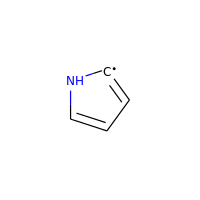

The RDKit Book
%%%%%%%%%%%%%%%%%%%%%%%%
[`The RDKit Book <https://www.rdkit.org/docs/RDKit_Book.html#the-rdkit-book>`__]

その他ケモインフォマティクスの話題
*****************************************************
[`Misc Chemoinformatics Topics <https://www.rdkit.org/docs/RDKit_Book.html#misc-cheminformatics-topics>`__]

芳香族性
=====================================
[`Aromaticity <https://www.rdkit.org/docs/RDKit_Book.html#aromaticity>`__]

芳香族性は単純であると同時にどうしようもなく複雑な不愉快な話題の一つです。
実験化学者も理論化学者もその定義についてお互いに同意に達することができないので、どれかひとつを恣意的に選びとり、そしてそれを貫き通す必要があります。
RDKitがとっている方法は次のようなものです。

知られている芳香族系に合うようなパターンを使用する代わりに、RDKitの芳香族を認識するコードは一連のルールを使います。そのルールは比較的直接的なものです。

芳香族性とは環構造に含まれる原子と結合の特性です。芳香族結合は芳香族原子の間でなければなりませんが、芳香族原子間の結合が芳香族結合である必要はありません。

例えば、ここで二つの6員環の連結に使われている結合はRDKitでは芳香族であるとは見なされません。

.. image:: ../Book/images/picture_9.png

.. code:: python

   >>> from rdkit import Chem
   >>> m = Chem.MolFromSmiles('C1=CC2=C(C=C1)C1=CC=CC=C21')
   >>> m.GetAtomWithIdx(3).GetIsAromatic()
   True
   >>> m.GetAtomWithIdx(6).GetIsAromatic()
   True
   >>> m.GetBondBetweenAtoms(3,6).GetIsAromatic()
   False

RDKitは多数の異なる芳香族モデルをサポートしており、芳香族性を割り当てる関数を提供することでユーザーが独自の定義をできるようにしています。

RDKit芳香族性モデル
---------------------------------------------
[`The RDKit Aromaticity Model <https://www.rdkit.org/docs/RDKit_Book.html#the-rdkit-aromaticity-model>`__]

一つの環、あるいは縮合多環系は、4N+2ルールに従う場合、芳香族であるとみなされます。数え上げられる電子への寄与は、アトムタイプと周囲の環境によって定義されます。いくつか例をあげます：

+--------------+------------+
| フラグメント | π電子の数  |
+==============+============+
| c(a)a        | 1          |
+--------------+------------+
| n(a)a        | 1          |
+--------------+------------+
| An(a)a       | 2          |
+--------------+------------+
| o(a)a        | 2          |
+--------------+------------+
| s(a)a        | 2          |
+--------------+------------+
| se(a)a       | 2          |
+--------------+------------+
| te(a)a       | 2          |
+--------------+------------+
| O=c(a)a      | 0          |
+--------------+------------+
| N=c(a)a      | 0          |
+--------------+------------+
| \*(a)a       | 0, 1, or 2 |
+--------------+------------+

**表記法** a: any aromatic atom; A: any atom, include H; \*:a dummy atom

電気陰性原子に結合する環外の結合は、環上の原子から価電子を“盗み”、ダミー原子は環を芳香族とするのに必要な数だけ無制限に寄与することに注意してください。

芳香族性に縮合多環系を使う場合、個々の環は非芳香族性なのに、環全体としては芳香族といった状況となることがあります。例を挙げるとアズレンです：

.. image:: ../Book/images/picture_8.png

縮合多環系と環外二重結合の影響を示す極端な例をあげます：

.. image:: ../Book/images/picture_7.png

.. code:: python

   >>> m=Chem.MolFromSmiles('O=C1C=CC(=O)C2=C1OC=CO2')
   >>> m.GetAtomWithIdx(6).GetIsAromatic()
   True
   >>> m.GetAtomWithIdx(7).GetIsAromatic()
   True
   >>> m.GetBondBetweenAtoms(6,7).GetIsAromatic()
   False

特別な場合をあげると、ラジカルのヘテロ原子は芳香族性の候補と見なされません。

.. image:: ../Book/images/picture_10.png

.. code:: python

  >>> m = Chem.MolFromSmiles('C1=C[N]C=C1')
  >>> m.GetAtomWithIdx(0).GetIsAromatic()
  False
  >>> m.GetAtomWithIdx(2).GetIsAromatic()
  False
  >>> m.GetAtomWithIdx(2).GetNumRadicalElectrons()
  1

ラジカルをもつ電荷を帯びた炭素も芳香族とは見なされません:

.. image:: ../Book/images/picture_12.png

.. code:: python

   >>> m = Chem.MolFromSmiles('C1=CC=CC=C[C+]1')
   >>> m.GetAtomWithIdx(0).GetIsAromatic()
   False
   >>> m.GetAtomWithIdx(6).GetIsAromatic()
   False
   >>> m.GetAtomWithIdx(6).GetFormalCharge()
   1
   >>> m.GetAtomWithIdx(6).GetNumRadicalElectrons()
   1

ですが、ラジカルをもつ電気的に中性な炭素は、芳香族と見なされます:

.. code:: python

   >>> m = Chem.MolFromSmiles('C1=[C]NC=C1')
   >>> m.GetAtomWithIdx(0).GetIsAromatic()
   True
   >>> m.GetAtomWithIdx(1).GetIsAromatic()
   True
   >>> m.GetAtomWithIdx(1).GetNumRadicalElectrons()
   1

単純芳香族性モデル
---------------------------------------------
[`The Simple Aromaticity Model <https://www.rdkit.org/docs/RDKit_Book.html#the-simple-aromaticity-model>`__]

このモデルとても単純です。５員環と６員環の単純な環構造だけが芳香族性の候補として考慮されます。上述のリストと同じ、電子の寄与のカウント方法が使われます。

MDL芳香属性モデル
---------------------------------------------
[`The MDL Aromaticity Model <https://www.rdkit.org/docs/RDKit_Book.html#the-mdl-aromaticity-model>`__]

このモデルはあまり詳細な説明が手に入りません（少なくとも公的にはドキュメント化されていません）。
そこで我々はoechemのドキュメント（ https://docs.eyesopen.com/toolkits/python/oechemtk/aromaticity.html )で提供されているものを再現しようとしました。

- 縮合環（すなわち、アズレン）は芳香族になりうる
- 5員環は芳香族では無い（縮合環系の一部にはなりうる）
- CとNだけが芳香族になりうる
- 電子のドナーは一つだけ許容される
- 環外に飛び出す二重結合を持つ原子は芳香族では無い

**注:** 計算の都合上の理由で、構成原子の総数が多くても24原子の縮合環系にだけ、芳香属性の判断が適用されます。

SMILESのサポートと拡張
=====================================
`[SMILES Support and Extensions] <https://www.rdkit.org/docs/RDKit_Book.html#smiles-support-and-extensions>`__]

RDKitはDaylight SMILES [[#smiles]_ の全ての標準的な特徴と、有用な拡張をカバーしています。

これが、拡張のリスト（のおそらく一部分）です:

- 芳香属性: ``te`` (芳香属性 Te)は許容されます
- 配位結合: ``<-``\ と\ ``->``\ が原子間の配位結合を作ります。方向が重要です。
- 原子の番号による原子の特定: SMARTSの要素\ ``[#6]``\ もSMILESでサポートされています。

SMARTSのサポートと拡張
=====================================
[`SMARTS Support and Extensions <https://www.rdkit.org/docs/RDKit_Book.html#smarts-support-and-extensions>`__]

RDKitはDaylight SMARTS [#smarts]_ の標準的な特徴のほとんどと、いくつかの有用な拡張をカバーしています。

これが、RDKitでサポートされて*いない*SMARTSの特徴のリスト（網羅できていると良いのですが）です:

- 非-四面体のキラルクラス
- ``@?`` オペレーター
- 明示的な原子量（同位体クエリーはサポートされています）
- 異なる構成要素への適合を要請する構成要素レベルのグループ化、すなわち``(C).(C)``

これが、拡張のリスト（のおそらく一部分）です:

- **混成クエリ** :

  - ``^0`` はS混成原子にマッチ
  - ``^1`` はSP混成原子にマッチ
  - ``^2`` はSP2混成原子にマッチ
  - ``^3`` はSP3混成原子にマッチ
  - ``^4`` はSP3D混成原子にマッチ
  - ``^5`` はSP3D2混成原子にマッチ

.. code:: python

   >> Chem.MolFromSmiles('CC=CF').GetSubstructMatches(Chem.MolFromSmarts('[^2]'))
   ((1,), (2,))

-  配位結合: ``<-`` と``->`` は相当する配位結合に対応し、方向が重要です

.. code:: python

   >>> Chem.MolFromSmiles('C1=CC=CC=N1->[Fe]').GetSubstructMatches(Chem.MolFromSmarts('[#7]->*'))
   ((5, 6),)
   >>> Chem.MolFromSmiles('C1=CC=CC=N1->[Fe]').GetSubstructMatches(Chem.MolFromSmarts('*<-[#7]'))
   ((6, 5),)

-  ヘテロ原子隣接クエリ:

   -  アトムクエリ``z`` は指定した数のヘテロ原子（すなわちCやHでは無い）を隣接してもつ原子にマッチします。例えば、z2は``CC(=O)O`` の２番目のCにマッチします。
   -  アトムクエリ``z`` は指定した数の脂肪族ヘテロ原子（すなわちCやHでは無い）を隣接してもつ原子にマッチします。

.. code:: python

   >>> Chem.MolFromSmiles('O=C(O)c1nc(O)ccn1').GetSubstructMatches(Chem.MolFromSmarts('[z2]'))
   ((1,), (3,), (5,))
   >>> Chem.MolFromSmiles('O=C(O)c1nc(O)ccn1').GetSubstructMatches(Chem.MolFromSmarts('[Z2]'))
   ((1,),)
   >>> Chem.MolFromSmiles('O=C(O)c1nc(O)ccn1').GetSubstructMatches(Chem.MolFromSmarts('[Z1]'))
   ((5,),)

-  レンジクエリ: 数値を要求する多くのタイプのクエリのため、値の範囲を提供することができます:

   -  ``D{2-4}`` は2から4の間（両端の値を含む）の明示的な結合をもつ原子にマッチします。
   -  ``D{-3}`` は3とそれより少ない数の明示的な結合を持つ原子にマッチします。
   -  ``D{2-}`` は少なくとも2つの明示的な結合を持つ原子にマッチします。

.. code:: python

   >>> Chem.MolFromSmiles('CC(=O)OC').GetSubstructMatches(Chem.MolFromSmarts('[z{1-}]'))
   ((1,), (4,))
   >>> Chem.MolFromSmiles('CC(=O)OC').GetSubstructMatches(Chem.MolFromSmarts('[D{2-3}]'))
   ((1,), (3,))
   >>> Chem.MolFromSmiles('CC(=O)OC.C').GetSubstructMatches(Chem.MolFromSmarts('[D{-2}]'))
   ((0,), (2,), (3,), (4,), (5,))

環の同定とSSSR
=====================================
[`Ring Finding and SSSR <https://www.rdkit.org/docs/RDKit_Book.html#ring-finding-and-sssr>`__]

他の人たちが、私が意図していたよりも大きなエネルギーと雄弁さでわめき出したように、
分子の「最小の環構造の最小のセット(smallest set of smallest rings:SSSR)」の定義は一つではありません。
対称性の高い分子では“本当の”SSSRで得られる結果は魅力的ではありません。例えばキュバンのSSSRは環構造を5つとしますが、“明らかに”6つあります。
この問題は、対称的な結果を返す、「最小の環構造の（*最小* ではなく）*小さい* セット」のアルゴリズムを実装することで修正することができます。これがRDKitで用いている手法です。

分子に含まれるSSSR環構造の数を数えることができると役に立つこともあるので、
\ `rdkit.Chem.rdmolops.GetSSSR() <https://www.rdkit.org/docs/source/rdkit.Chem.rdmolops.html#rdkit.Chem.rdmolops.GetSSSR>`__\ 関数が提供されていますが、
これはSSSRの数を返すだけで、潜在的に一意ではない環構造のセットを返すわけではありません。

化学反応の取り扱い
*****************************************************
[`Chemical Reaction Handling <https://www.rdkit.org/docs/RDKit_Book.html#chemical-reaction-handling>`__]

Reaction SMARTS
=====================================
[`Reaction SMARTS <https://www.rdkit.org/docs/RDKit_Book.html#reaction-smarts>`__]

SMIRKS [#smirks]_ でもなく、SMILES [#smiles]_ でもなく、SMARTS [#smarts]_ から派生したものです。

reaction SMARTSの一般的な文法は以下の様なものです：

.. code::

   reaction  ::=   reactants ">>" products
   reactants ::=  molecules
   products  ::=   molecules
   molecules ::=  molecule
                  molecules "." molecule
   molecule  ::=   a valid SMARTS string without "." characters
                   "(" a valid SMARTS string without "." characters ")"

いくつかの特徴
---------------------------------------------
[`Some features <https://www.rdkit.org/docs/RDKit_Book.html#some-features>`__]

生成物のテンプレート上にマッピングされたダミー原子は、反応物質の対応する原子によって置き換えられます:

.. code:: python

   >>> from rdkit.Chem import AllChem
   >>> rxn = AllChem.ReactionFromSmarts('[C:1]=[O,N:2]>>[C:1][*:2]')
   >>> [Chem.MolToSmiles(x,1) for x in rxn.RunReactants((Chem.MolFromSmiles('CC=O'),))[0]]
   ['CCO']
   >>> [Chem.MolToSmiles(x,1) for x in rxn.RunReactants((Chem.MolFromSmiles('CC=N'),))[0]]
   ['CCN']

ですが、マッピングされなかったダミー原子はダミーのままです：

.. code:: python

   >>> rxn = AllChem.ReactionFromSmarts('[C:1]=[O,N:2]>>*[C:1][*:2]')
   >>> [Chem.MolToSmiles(x,1) for x in rxn.RunReactants((Chem.MolFromSmiles('CC=O'),))[0]]
   ['*C(C)O']

生成物の“Any”結合は、反応物質の対応する結合によって置き換えられます：

.. code:: python

   >>> rxn = AllChem.ReactionFromSmarts('[C:1]~[O,N:2]>>*[C:1]~[*:2]')
   >>> [Chem.MolToSmiles(x,1) for x in rxn.RunReactants((Chem.MolFromSmiles('C=O'),))[0]]
   ['*C=O']
   >>> [Chem.MolToSmiles(x,1) for x in rxn.RunReactants((Chem.MolFromSmiles('CO'),))[0]]
   ['*CO']
   >>> [Chem.MolToSmiles(x,1) for x in rxn.RunReactants((Chem.MolFromSmiles('C#N'),))[0]]
   ['*C#N']

分子内の反応は、反応物質を丸括弧に囲むことで、柔軟に表現することができます。閉環メタセシス [#intramolRxn]_ 例に、実際にやってみます。

.. code:: python

   >>> rxn = AllChem.ReactionFromSmarts("([C:1]=[C;H2].[C:2]=[C;H2])>>[*:1]=[*:2]")
   >>> m1 = Chem.MolFromSmiles('C=CCOCC=C')
   >>> ps = rxn.RunReactants((m1,))
   >>> Chem.MolToSmiles(ps[0][0])
   'C1=CCOC1'

キラリティー
---------------------------------------------
[`Chirality <https://www.rdkit.org/docs/RDKit_Book.html#chirality>`__]

このセクションは、反応の定義においてキラリティーの情報がどうやって扱われるかについて説明します。セクションを通して、2級アルコールのエステル化を例として扱います。 [#chiralRxn]_

もし反応の定義にキラリティーの情報がないなら、反応物質の立体化学は保持されます:

.. code:: python

   >>> alcohol1 = Chem.MolFromSmiles('CC(CCN)O')
   >>> alcohol2 = Chem.MolFromSmiles('C[C@H](CCN)O')
   >>> alcohol3 = Chem.MolFromSmiles('C[C@@H](CCN)O')
   >>> acid = Chem.MolFromSmiles('CC(=O)O')
   >>> rxn = AllChem.ReactionFromSmarts('[CH1:1][OH:2].[OH][C:3]=[O:4]>>[C:1][O:2][C:3]=[O:4]')
   >>> ps=rxn.RunReactants((alcohol1,acid))
   >>> Chem.MolToSmiles(ps[0][0],True)
   'CC(=O)OC(C)CCN'
   >>> ps=rxn.RunReactants((alcohol2,acid))
   >>> Chem.MolToSmiles(ps[0][0],True)
   'CC(=O)O[C@H](C)CCN'
   >>> ps=rxn.RunReactants((alcohol3,acid))
   >>> Chem.MolToSmiles(ps[0][0],True)
   'CC(=O)O[C@@H](C)CCN'

マッピングされた原子が反応物質と生成物両方で同じキラリティーを持つ場合、同じ結果（立体化学の保持）が得られます。

.. code:: python

   >>> rxn = AllChem.ReactionFromSmarts('[C@H1:1][OH:2].[OH][C:3]=[O:4]>>[C@:1][O:2][C:3]=[O:4]')
   >>> ps=rxn.RunReactants((alcohol1,acid))
   >>> Chem.MolToSmiles(ps[0][0],True)
   'CC(=O)OC(C)CCN'
   >>> ps=rxn.RunReactants((alcohol2,acid))
   >>> Chem.MolToSmiles(ps[0][0],True)
   'CC(=O)O[C@H](C)CCN'
   >>> ps=rxn.RunReactants((alcohol3,acid))
   >>> Chem.MolToSmiles(ps[0][0],True)
   'CC(=O)O[C@@H](C)CCN'

反応物質と生成物で異なるキラリティーを持つマッピングされた原子は、立体が反転します。

.. code:: python

   >>> rxn = AllChem.ReactionFromSmarts('[C@H1:1][OH:2].[OH][C:3]=[O:4]>>[C@@:1][O:2][C:3]=[O:4]')
   >>> ps=rxn.RunReactants((alcohol1,acid))
   >>> Chem.MolToSmiles(ps[0][0],True)
   'CC(=O)OC(C)CCN'
   >>> ps=rxn.RunReactants((alcohol2,acid))
   >>> Chem.MolToSmiles(ps[0][0],True)
   'CC(=O)O[C@@H](C)CCN'
   >>> ps=rxn.RunReactants((alcohol3,acid))
   >>> Chem.MolToSmiles(ps[0][0],True)
   'CC(=O)O[C@H](C)CCN'

反応物質のマッピングされた原子のキラリティーが指定されていて、生成物では指定されていない場合、反応によって不斉中心のキラリティーの情報は失われます:

.. code:: python

   >>> rxn = AllChem.ReactionFromSmarts('[C@H1:1][OH:2].[OH][C:3]=[O:4]>>[C:1][O:2][C:3]=[O:4]')
   >>> ps=rxn.RunReactants((alcohol1,acid))
   >>> Chem.MolToSmiles(ps[0][0],True)
   'CC(=O)OC(C)CCN'
   >>> ps=rxn.RunReactants((alcohol2,acid))
   >>> Chem.MolToSmiles(ps[0][0],True)
   'CC(=O)OC(C)CCN'
   >>> ps=rxn.RunReactants((alcohol3,acid))
   >>> Chem.MolToSmiles(ps[0][0],True)
   'CC(=O)OC(C)CCN'

そして、最後に、キラリティーが生成物で指定されていて、反応物質では指定されていない場合、反応によって指定したキラリティーが作られます。

.. code:: python

   >>> rxn = AllChem.ReactionFromSmarts('[CH1:1][OH:2].[OH][C:3]=[O:4]>>[C@:1][O:2][C:3]=[O:4]')
   >>> ps=rxn.RunReactants((alcohol1,acid))
   >>> Chem.MolToSmiles(ps[0][0],True)
   'CC(=O)O[C@H](C)CCN'
   >>> ps=rxn.RunReactants((alcohol2,acid))
   >>> Chem.MolToSmiles(ps[0][0],True)
   'CC(=O)O[C@H](C)CCN'
   >>> ps=rxn.RunReactants((alcohol3,acid))
   >>> Chem.MolToSmiles(ps[0][0],True)
   'CC(=O)O[C@H](C)CCN'

反応の定義で立体の中心の周りの環境について、もう少し情報を含めないと、これはあまり意味をなさないことに注意してください:

.. code:: python

   >>> rxn = AllChem.ReactionFromSmarts('[CH3:5][CH1:1]([C:6])[OH:2].[OH][C:3]=[O:4]>>[C:5][C@:1]([C:6])[O:2][C:3]=[O:4]')
   >>> ps=rxn.RunReactants((alcohol1,acid))
   >>> Chem.MolToSmiles(ps[0][0],True)
   'CC(=O)O[C@H](C)CCN'
   >>> ps=rxn.RunReactants((alcohol2,acid))
   >>> Chem.MolToSmiles(ps[0][0],True)
   'CC(=O)O[C@H](C)CCN'
   >>> ps=rxn.RunReactants((alcohol3,acid))
   >>> Chem.MolToSmiles(ps[0][0],True)
   'CC(=O)O[C@H](C)CCN'

キラリティーの指定がクエリの一部としては使われないことに気をつけてください。キラリティーの指定されていない分子は、キラリティーが指定されている反応物質とマッチします。

一般的に、反応機能ではできる限り立体化学に関する情報を保とうとします。これは不斉中心で新しい結合が一つ形成される場合はうまくいきます。

.. code:: python

   >>> rxn = AllChem.ReactionFromSmarts('[C:1][C:2]-O>>[C:1][C:2]-S')
   >>> alcohol2 = Chem.MolFromSmiles('C[C@@H](O)CCN')
   >>> ps=rxn.RunReactants((alcohol2,))
   >>> Chem.MolToSmiles(ps[0][0],True)
   'C[C@@H](S)CCN'

ですが、2つあるいはそれ以上の結合が形成される場合はうまくいきません。

.. code:: python

   >>> rxn = AllChem.ReactionFromSmarts('[C:1][C:2](-O)-F>>[C:1][C:2](-S)-Cl')
   >>> alcohol = Chem.MolFromSmiles('C[C@@H](O)F')
   >>> ps=rxn.RunReactants((alcohol,))
   >>> Chem.MolToSmiles(ps[0][0],True)
   'CC(S)Cl'

この場合、情報が保存されるために十分な情報がないだけです。マッピングに関する情報を加えるだけで解決することができます。

ルールと警告
---------------------------------------------
[`Rules and caveats <https://www.rdkit.org/docs/RDKit_Book.html#rules-and-caveats>`__]

1. アトムクエリの最後にアトムマップの情報を含めてください。つまり[C,N,O:1]や[C;R:1]の様にしてください。
2. SMARTSで指定されていない結合は、単結合かあるいは芳香族性の結合であることを忘れない様にしてください。生成物のテンプレートの結合次数は、生成物のテンプレート自体が生成された時に割り当てられるので、その結合が単結合であるべきか、芳香族性であるべきかをいつでも指示できるわけではありません:

.. code:: python

   >>> rxn = AllChem.ReactionFromSmarts('[#6:1][#7,#8:2]>>[#6:1][#6:2]')
   >>> [Chem.MolToSmiles(x,1) for x in rxn.RunReactants((Chem.MolFromSmiles('C1NCCCC1'),))[0]]
   ['C1CCCCC1']
   >>> [Chem.MolToSmiles(x,1) for x in rxn.RunReactants((Chem.MolFromSmiles('c1ncccc1'),))[0]]
   ['c1ccccc-1']

なので、反応物質から結合次数をコピーしたい場合は、“Any”結合を使ってください。

.. code:: python

   >>> rxn = AllChem.ReactionFromSmarts('[#6:1][#7,#8:2]>>[#6:1]~[#6:2]')
   >>> [Chem.MolToSmiles(x,1) for x in rxn.RunReactants((Chem.MolFromSmiles('c1ncccc1'),))[0]]
   ['c1ccccc1']

特徴定義ファイル形式（FDefファイル）
*****************************************************
[`The Feature Definition File Format <https://www.rdkit.org/docs/RDKit_Book.html#the-feature-definition-file-format>`__]

FDefファイルは化学的特徴（フィーチャー）のセットを定義するのに必要な情報を全て含みます。DaylightのSMARTS言語を使って構築されたクエリーから定義された特徴のタイプの定義を含みます。 [#smarts]_
FDefファイルはオプションで、特徴の定義をもっと読みやすくするために使われるアトムタイプの定義を含むこともできます。

化学的特徴
=====================================
[`Chemical Features <https://www.rdkit.org/docs/RDKit_Book.html#chemical-features>`__]

化学的特徴はフィーチャータイプ（Feature Type）とフィーチャーファミリー（Feature Family）で定義されています。
フィーチャーファミリーは（“水素結合ドナー”や“芳香族”といった）一般的な特徴の分類で、フィーチャータイプは特徴に関する追加の、より詳細な情報を提供します。
ファーマコフォアマッチングはフィーチャーファミリーを使って行われます。各フィーチャータイプには次の情報を含みます:

-  （一つ、またはそれ以上の）フィーチャータイプにマッチする原子を表現するSMARTSパターン
-  フィーチャーを定義する原子の位置に基づき特徴の位置を決定するのに使われる重み

FDefファイルの文法
=====================================
[`Syntax of the FDef file <https://www.rdkit.org/docs/RDKit_Book.html#syntax-of-the-fdef-file>`__]

AtomTypeの定義
---------------------------------------------
[`AtomType definitions <https://www.rdkit.org/docs/RDKit_Book.html#atomtype-definitions>`__]

アトムクエリを定義するSMARTS文字列の代わりに、アトムタイプ[AtomType]の定義を使って簡略表記法を割り当てることができます。これによりFDefファイルをもっとずっと読みやすくすることができます。
例えば、非極性炭素原子を次の様に定義することで、FDefファイルの他のどこでも使うことができる新しい名前を作成することができ、このSMARTSを使うのに役立ちます。::

   AtomType Carbon_NonPolar [C&!$(C=[O,N,P,S])&!$(C#N)]

アトムタイプを参照するには、中括弧にその名前を含めるだけです。例えば、FDefファイルからのこの抜粋は、Carbon_NonPolarの定義を参照する他のアトムタイプ（Hphobe）を定義します。::

   AtomType Carbon_NonPolar [C&!$(C=[O,N,P,S])&!$(C#N)]
   AtomType Hphobe [{Carbon_NonPolar},c,s,S&H0&v2,F,Cl,Br,I]

``{Carbon_Nonpolar}`` が、追加の修飾無しに、新しいアトムタイプを定義するのに使われていることに注目してください（角括弧やrecursive SMARTSのマーカーは必要とされていません）。

アトムタイプを繰り返すことで、SMARTSの“,”(or)オペレーターを使って二つの定義を結合したものが得られます。これが例です::

   AtomType d1 [N&!H0]
   AtomType d1 [O&!H0]

これは次と等価です::

   AtomType d1 [N&!H0,O&!H0]

次のもっと効率的な定義と等価です::

   AtomType d1 [N,O;!H0]

これらの例ではSMARTSの優先度が高いアンドオペレーター“&”を使う傾向があり、優先度が低い”;”ではないことに注意してください。
アトムタイプが連結される場合や繰り返される場合に重要となります。SMARTSの“,”オペレーターは“;”よりも優先度が高く、従って“;”を使う定義は予期せぬ結果に繋がる可能性があります。

否定するネガティブアトムタイプクエリを定義することもできます。::

   AtomType d1 [N,O,S]
   AtomType !d1 [H0]

ネガティブクエリは最初のものと組み合わされ、次の様なものと同一の定義を生成します::

   AtomType d1 [!H0;N,O,S]

ネガティブアトムタイプがクエリの最初に付け足されることに注意してください。

フィーチャーの定義
---------------------------------------------
[`Feature definitions <https://www.rdkit.org/docs/RDKit_Book.html#feature-definitions>`__]

フィーチャーの定義はアトムタイプの定義よりも複雑で、複数の行に渡ります::

   DefineFeature HDonor1 [N,O;!H0]
   Family HBondDonor
   Weights 1.0
   EndFeature

フィーチャーの定義の最初の行はフィーチャータイプとフィーチャーを定義するSMARTS文字列を含みます。
次の２行（順番は重要ではありません）はフィーチャーのファミリーと原子の重み（フィーチャーを定義する原子の数と同じ長さの、カンマで区切られたリスト）を定義します。
原子の重みは、フィーチャーを定義する原子の位置の平均の重みに基づき、フィーチャーの場所を計算するのに使われます。
これに関してさらに詳細は下を参照してください。フィーチャーの定義の最後の行はEndFeatureである必要があります。
FDefファイルでアトムタイプの定義とフィーチャーの定義とを混ぜ合わせることは完全にルールに則った方法です。
たった一つのルールはアトムタイプは参照される前に定義されなければならないということです。

その他の文法上の注意点:
---------------------------------------------
[`Additional syntax notes <https://www.rdkit.org/docs/RDKit_Book.html#additional-syntax-notes>`__]

-  \# シンボルで始まるどの行もコメントとして認識され、無視されます。
-  行の終わりのバックスラッシュ記号は継続記号です。そのラインのデータが次の行に続いていることを示します。
   これらの追加行の最初の余白は無視されます。例えば、このアトムタイプの定義は::

     AtomType tButylAtom [$([C;!R](-[CH3])(-[CH3])(-[CH3])),\
     $([CH3](-[C;!R](-[CH3])(-[CH3])))]

   これと完全に等価です::

     AtomType tButylAtom [$([C;!R](-[CH3])(-[CH3])(-[CH3])),$([CH3](-[C;!R](-[CH3])(-[CH3])))]

（最初の形式の方がとても読みやすいですが！）

原子の重みとフィーチャーの場所
---------------------------------------------
[`Atom weights and feature locations <https://www.rdkit.org/docs/RDKit_Book.html#atom-weights-and-feature-locations>`__]

FAQ
=====================================
[`Frequently Asked Question(s) <https://www.rdkit.org/docs/RDKit_Book.html#frequently-asked-question-s>`__]

- フィーチャータイプがファイルの中で繰り返された場合どんなことが起こるのか？
  これが例です::

    DefineFeature HDonor1 [O&!H0]
    Family HBondDonor
    Weights 1.0
    EndFeature

    DefineFeature HDonor1 [N&!H0]
    Family HBondDonor
    Weights 1.0
    EndFeature

  この場合HDonor1のフィーチャータイプの定義はどちらもアクティブです。機能的には次と同一です::

    DefineFeature HDonor1 [O,N;!H0]
    Family HBondDonor
    Weights 1.0
    EndFeature

  **ですが**、この複製されたフィーチャーの定義は、より単純な物を組み合わせた定義よりもかなり効率が悪く、より混乱を招きやすくなります。

ファーマコフォアフィンガープリントの表現
*****************************************************
[`Representation of Pharmacophore Fingerprints <https://www.rdkit.org/docs/RDKit_Book.html#representation-of-pharmacophore-fingerprints>`__]

RDKitの体系ではファーマコフォアフィンガープリントのビットIDはハッシュ化されていません：それぞれのビットはフィーチャーと距離の特定の組み合わせに相当します。
与えられたビットIDは、解釈するために、対応するフィーチャーのタイプと距離に再度変換し直すことができます。
2Dファーマコフォアのイラストによる説明を :ref:`ph4_figure` に示しています。

.. _ph4_figure :

.. figure:: ../images/picture_10.jpg
   :scale: 50 %
   :alt: Alternate Text

   Figure 1:   Bit numbering in pharmacophore fingerprints

部分構造クエリにおける原子同士のマッチング
*****************************************************
[`Atom-Atom Matching in Substructure Queries <https://www.rdkit.org/docs/RDKit_Book.html#atom-atom-matching-in-substructure-queries>`__]

SMARTSから導かれたクエリと部分構造のマッチングを行うときに、分子のどの原子がクエリのどの原子にマッチするべきかのルールが十分に定義されます。 [#smarts]_
クエリの分子がmol blockあるいはSMILESから導かれたときには、必ずしも同様にルールが十分に定義されるとは限りません。

RDKitで使われている一般的なルールでは、もしクエリの特性を明示しなければマッチングの判断基準の一部として使われず、そして水素原子は無視されます。従って次の様な動きをします。

+----------+---------+-------+
| Molecule | Query   | Match |
+==========+=========+=======+
| CCO      | CCO     | Yes   |
+----------+---------+-------+
| CC[O-]   | CCO     | Yes   |
+----------+---------+-------+
| CCO      | CC[O-]  | No    |
+----------+---------+-------+
| CC[O-]   | CC[O-]  | Yes   |
+----------+---------+-------+
| CC[O-]   | CC[OH]  | Yes   |
+----------+---------+-------+
| CCOC     | CC[OH]  | Yes   |
+----------+---------+-------+
| CCOC     | CCO     | Yes   |
+----------+---------+-------+
| CCC      | CCC     | Yes   |
+----------+---------+-------+
| CC[14C]  | CCC     | Yes   |
+----------+---------+-------+
| CCC      | CC[14C] | No    |
+----------+---------+-------+
| CC[14C]  | CC[14C] | Yes   |
+----------+---------+-------+
| OCO      | C       | Yes   |
+----------+---------+-------+
| OCO      | [CH]    | No    |
+----------+---------+-------+
| OCO      | [CH2]   | No    |
+----------+---------+-------+
| OCO      | [CH3]   | No    |
+----------+---------+-------+
| OCO      | O[CH3]  | Yes   |
+----------+---------+-------+
| O[CH2]O  | C       | Yes   |
+----------+---------+-------+
| O[CH2]O  | [CH2]   | No    |
+----------+---------+-------+

実際にやってみましょう:

.. code:: python

   >>> Chem.MolFromSmiles('CCO').HasSubstructMatch(Chem.MolFromSmiles('CCO'))
   True
   >>> Chem.MolFromSmiles('CC[O-]').HasSubstructMatch(Chem.MolFromSmiles('CCO'))
   True
   >>> Chem.MolFromSmiles('CCO').HasSubstructMatch(Chem.MolFromSmiles('CC[O-]'))
   False
   >>> Chem.MolFromSmiles('CC[O-]').HasSubstructMatch(Chem.MolFromSmiles('CC[O-]'))
   True
   >>> Chem.MolFromSmiles('CC[O-]').HasSubstructMatch(Chem.MolFromSmiles('CC[OH]'))
   True
   >>> Chem.MolFromSmiles('CCOC').HasSubstructMatch(Chem.MolFromSmiles('CC[OH]'))
   True
   >>> Chem.MolFromSmiles('CCOC').HasSubstructMatch(Chem.MolFromSmiles('CCO'))
   True
   >>> Chem.MolFromSmiles('CCC').HasSubstructMatch(Chem.MolFromSmiles('CCC'))
   True
   >>> Chem.MolFromSmiles('CC[14C]').HasSubstructMatch(Chem.MolFromSmiles('CCC'))
   True
   >>> Chem.MolFromSmiles('CCC').HasSubstructMatch(Chem.MolFromSmiles('CC[14C]'))
   False
   >>> Chem.MolFromSmiles('CC[14C]').HasSubstructMatch(Chem.MolFromSmiles('CC[14C]'))
   True
   >>> Chem.MolFromSmiles('OCO').HasSubstructMatch(Chem.MolFromSmiles('C'))
   True
   >>> Chem.MolFromSmiles('OCO').HasSubstructMatch(Chem.MolFromSmiles('[CH]'))
   False
   >>> Chem.MolFromSmiles('OCO').HasSubstructMatch(Chem.MolFromSmiles('[CH2]'))
   False
   >>> Chem.MolFromSmiles('OCO').HasSubstructMatch(Chem.MolFromSmiles('[CH3]'))
   False
   >>> Chem.MolFromSmiles('OCO').HasSubstructMatch(Chem.MolFromSmiles('O[CH3]'))
   True
   >>> Chem.MolFromSmiles('O[CH2]O').HasSubstructMatch(Chem.MolFromSmiles('C'))
   True
   >>> Chem.MolFromSmiles('O[CH2]O').HasSubstructMatch(Chem.MolFromSmiles('[CH2]'))
   False

分子のサニタイゼーション
*****************************************************
[`Molecular Sanitization <https://www.rdkit.org/docs/RDKit_Book.html#molecular-sanitization>`__]

デフォルトでは、分子を解析する関数は全て、読み込まれた分子に対して“サニタイゼーション”の処理を行います。
サニタイゼーションの考え方というのは、残りのコードのために有用な特性（混成の状態や、環構造に含まれるか否か、など）を算出することと、分子が“合理的である”ことを保証することです。
合理的とはつまり、分子をオクテット則を完全に満たす様なルイス構造式であらわすことができるということです。

処理の過程を順番に示します。

1. ``clearComputedProps``:
   分子とその原子、結合に既に存在する計算による特性を全て除去します。この処理はいつも行われます。

2. ``cleanup``:
   少数の非標準的な原子価の状態を標準化します。クリーンアップの処理は:

   -  Oと二重結合している中性の５価のNは両性イオンの形式に変換されます。
      例: ``N(=O)=O -> [N+](=O)[O-]``
   -  他のNと三重結合している中性の５価のNは両性イオンの形式に変換されます。
      例: ``C-N=N#N -> C-N=[N+]=[N-]``
   -  Oとの二重結合が一つと、もう一つ二重結合をCあるいはPとしている中性の５価のリン原子は両性イオンの形式に変換されます。
      例: ``C=P(=O)O -> C=[P+]([O-])O``
   -  Oとだけ隣接している中性のCl、BrあるいはIで、３価、５価あるいは７価のものは両性イオンの形式に変換されます。亜塩素酸や塩素酸、過塩素酸の様なものを含みます。
      例: ``O=Cl(=O)O -> [O-][Cl+2][O-]O``

この処理では例外は生じないはずです。

3.  ``updatePropertyCache``:
    全ての原子の明示的原子価と暗に表される原子価を計算します。これは許容されるよりも高い価数の状態となっている原子には例外を生成します。この処理はいつも行われますが、もしこの過程を“スキップ”すると非標準的な原子価についてのテストは実行されません。

4.  ``symmetrizeSSSR``:
    対称化された“最小の環構造についての最小のセット”（SSSR: Smallest Set
    of Smallest
    Rings）のアルゴリズムを呼び出します（SSSRについてはGetting Started
    ドキュメントで議論しました）。

5.  ``Kekulize``:
    芳香環をケクレ形式に変換します。環構造をケクレ化できなかった場合や芳香族性の結合が環の外部に見つかった場合に例外を返します。

6.  ``assignRadicals``:（存在する場合）各原子のラジカル電子の数を決定します。

7.  ``setAromaticity``: 芳香環と環の系（ring
    system、上述）を同定し、原子と結合に芳香族フラグをセットし、結合次数を芳香族にセットします。

8.  ``setConjugation``:どの結合が共役しているか同定します。

9.  ``setHybridization``: 各原子の混成の状態を計算します。

10. ``cleanupChirality``:
    sp3混成ではない原子から不斉のタグを取り除きます。

11. ``adjustHs``:
    化学を保存するのに必要な場所に明に示された水素原子を付け加えます。これは典型的には芳香環のヘテロ原子に必要とされます。古典的な例はピロールの窒素原子です。

個々の処理は``MolOps::sanitizeMol`` か``Chem.SanitizeMol`` を呼び出すことで、実行するか否かを切り替えることができます。

実装の詳細
*****************************************************
[`Implementation Details <https://www.rdkit.org/docs/RDKit_Book.html#implementation-details>`__]

“マジック”プロパティの値
=====================================
[`“Magic” Property Values <https://www.rdkit.org/docs/RDKit_Book.html#magic-property-values>`__]

次のプロパティの値はRDKitのコードベースで正式に使われているものですが、クライアントコードでも役にたつかもしれません。

ROMol(Mol in Python)
---------------------------------------------
[`ROMol(Mol in Python) <https://www.rdkit.org/docs/RDKit_Book.html#romol-mol-in-python>`__]

+-------------------------+--------------------------------------------+
| プロパティの名称        | 使用用途                                   |
+=========================+============================================+
| MolFileComments         | CTABのコメント行からの読み込みと書き込み   |
+-------------------------+--------------------------------------------+
| MolFileInfo             | CTABのinfo行からの読み込みと書き込み       |
+-------------------------+--------------------------------------------+
| \_MolFileChiralFlag     | CTABのキラルフラグからの読み込みと書き込み |
+-------------------------+--------------------------------------------+
| \_Name                  | CTABのname行からの読み込みと書き込み       |
+-------------------------+--------------------------------------------+
| \_smilesAtomOutputOrder | SMILESに書かれている原子の順番             |
+-------------------------+--------------------------------------------+

Atom
---------------------------------------------
[`Atom <https://www.rdkit.org/docs/RDKit_Book.html#atom>`__]

+-------------------------+----------------------------------------------------------------------------------------------+
| プロパティの名称        | 使用用途                                                                                     |
+=========================+==============================================================================================+
| \_CIPCode               | 原子のCIPコード（RかSか）                                                                    |
+-------------------------+----------------------------------------------------------------------------------------------+
| \_CIPRank               | 原子の整数値のCIPランク                                                                      |
+-------------------------+----------------------------------------------------------------------------------------------+
| \_ChiralityPossible     | 原子が不斉中心になる可能性がある場合にセットされる                                           |
+-------------------------+----------------------------------------------------------------------------------------------+
| \_MolFileRLabel         | 原子に貼られる整数値のRグループラベルで、CTABからの読み込みと書き込みが行われる              |
+-------------------------+----------------------------------------------------------------------------------------------+
| \_ReactionDegreeChanged | 反応において級（degree）が変化したときに、生成物のテンプレートの原子にセットされる           |
+-------------------------+----------------------------------------------------------------------------------------------+
| \_protected             | このプロパティがセットされた原子は反応において、マッチングする反応物質の原子の対象から外れる |
+-------------------------+----------------------------------------------------------------------------------------------+
| dummyLabel              | （ダミー原子のラベルで）アトムシンボルとしてCTABからの読み込みと書き込みが行われる           |
+-------------------------+----------------------------------------------------------------------------------------------+
| molAtomMapNumber        | 原子のアトムマップナンバーで、SMILESとCTABからの読み込みと書き込みに使われる                 |
+-------------------------+----------------------------------------------------------------------------------------------+
| molfileAlias            | （Aタグに続く）原子のmolファイルのエイリアスで、CTABからの読み込みと書き込みが行われる       |
+-------------------------+----------------------------------------------------------------------------------------------+
| molFileValue            | （Vタグに続く）原子のmolファイルの値で、CTABからの読み込みと書き込みが行われる               |
+-------------------------+----------------------------------------------------------------------------------------------+
| molFileInversionFlag    | | 反応で原子の立体化学が変化したか否かを示すのに使われるフラグで、                           |
|                         | | CTABからの読み込みと書き込みが行われ、SMILESから自動的に決定される                         |
+-------------------------+----------------------------------------------------------------------------------------------+
| molRxnComponent         | 反応のどの構成要素に原子が属するかを示し、CTABからの読み込みと書き込みが行われる             |
+-------------------------+----------------------------------------------------------------------------------------------+
| molRxnRole              | | 反応において原子がどのような役割を担うか（1=反応物質、2=生成物、3=試薬）で、               |
|                         | | CTABからの読み込みと書き込みが行われる                                                     |
+-------------------------+----------------------------------------------------------------------------------------------+
| smilesSymbol            | SMILESに書き込まれる原子のシンボルを決定する                                                 |
+-------------------------+----------------------------------------------------------------------------------------------+

スレッドの安全性とRDKit
=====================================
[`Thread safety and the RDKit <https://www.rdkit.org/docs/RDKit_Book.html#thread-safety-and-the-rdkit>`__]

RDKitを書いている間、コードがマルチスレッド環境でも作動することを保証するために、グローバル変数の使用を避けることや、その他のことを試みました。
ですが、コードスレッドを安全にすることは全くもって些細なことではなく、いくつかギャップがあることは疑いようがありません。
このセクションでは、どのコードベースが、スレッドの安全性のために実際にテスト済みのものかついて説明します。

**注**:``numThreads`` 引数をとる少数のメソッドと関数を例外として、このセクションはRDKitをPythonのスレッドから使う際にはあてはまりません。
  Boost.Pythonはどの時点においてもスレッド一つだけがC++コードを呼び出すことを保証します。
  Pythonで並列処理を行うにはmultiprocessingモジュールを使うか、他の標準的なPythonの方法を使ってください。

テスト済みのもの
---------------------------------------------
[`What has been tested <https://www.rdkit.org/docs/RDKit_Book.html#what-has-been-tested>`__]

-  SMILES/SMARTS/Mol blockからの分子の読み込み
-  SMILES/SMARTS/Mol blockへの分子の書き込み
-  2D座標の生成
-  ディスタンスジオメトリー法のコードを使った3Dコンフォメーションの生成
-  UFFあるいはMMFFを使った分子の最適化
-  フィンガープリントの生成
-  $RDBASE/Code/GraphMol/Descriptors内にある記述子の計算機
-  部分構造探索（注:クエリの分子が再起的なクエリを含む場合、マルチスレッドで並行して使うのは安全ではないかもしれません。下記を参照してください）
-  Subgraphコード
-  ChemTransformsコード
-  chemical reactionsコード
-  Open3DAlignコード
-  MolDraw2D 描画コード

把握済みの問題
---------------------------------------------
[`Known problems <https://www.rdkit.org/docs/RDKit_Book.html#known-problems>`__]

-  InChiの生成と（おそらく）解析。これはIUPACInChiコードの限界である様に見えます。
   コードをマルチスレッド環境で使える様にするため、確実に一度にスレッド一つだけがIUPACコードを使うことを保証するようミューテックスが使われます。
   これはRDKitが``RDK_TEST_MULTITHREADED`` オプションを有効にしてビルドされている場合のみ利用可能です。

-  MolSuppliers(例えばSDMolSupplierやSmilesMolSupplier？)は分子が読み込まれたときに内部の状態を変えます。２つ以上のスレッドで一つのsupplierを使うのは安全ではありません。

-  再起的なクエリを含むクエリ分子を使った部分構造検索。再起的クエリは検索が実行されているとき内部の状態を修正します。
   したがって同じクエリをマルチスレッドで並行して使うのは安全ではありません。
   コードが``RDK_BUILD_THREADSAFE_SSS`` 引数を使って作られている場合（我々が提供しているバイナリのデフォルトです）、
   一度にスレッド一つだけが与えられた再起的クエリを使っていることを確実に保証するためミューテックスが使われます。

TPSA記述子の実装
=====================================
[`Implementation of the TPSA Descriptor <https://www.rdkit.org/docs/RDKit_Book.html#implementation-of-the-tpsa-descriptor>`__]

RDKitに実装されているトポロジカル極性表面積（TPSA）記述子は、Peter Ertlらによる文献（https://pubs.acs.org/doi/abs/10.1021/jm000942e)
に説明されています。RDKitの実装はこの文献に記載されているものと異なります。このセクションでは違いと、なぜ異なるのかについて説明します。

RDKitのTPSAの実装ではデフォルトではNとO原子からの寄与のみ含んでいます。
ですが、TPSAの文献のTable 1はNとOに加えて極性のSとPについてのパラメータを含んでいます。何が起こっているのでしょうか？

Daylight Contrib dir (http://www.daylight.com/download/contrib/tpsa.html) の元々のTPSAの実装では極性のSあるいはPからの寄与を含んでおらず、
TPSAの文献に含まれている参照値もSやPの寄与を含んでいないということがわかりました。例えば、Table 3に提示されているホスカルネット（SMILES``OC(=O)P(=O)(O)O`` ）
のTPSAは94.8ですが、Oの寄与の合計-``3x20.23 + 2x17.07 = 94.8`` -に一致します。
Pの寄与-``9.81`` -を加えるとPSAの値は104.6となります。これはTable 3のPとSを含む他の化合物にも当てはまります。

RDKitの実装では、``tpsa.c`` Contribプログラムの挙動と文献のTable 3で提示されているものを再現することを選択しました。
したがって極性のSとPは無視されます。RDKitユーザーの何名かからリクエストがあったので、RDKitの``2018.09`` リリースからSとPの寄与を含めるオプションを加えました。

.. code:: python

   >>> from rdkit.Chem import Descriptors
   >>> Descriptors.TPSA(Chem.MolFromSmiles('OC(=O)P(=O)(O)O')) # foscarnet
   94.83
   >>> Descriptors.TPSA(Chem.MolFromSmiles('OC(=O)P(=O)(O)O'), includeSandP=True)
   104.64...
   >>> Descriptors.TPSA(Chem.MolFromSmiles('Cc1ccccc1N1C(=O)c2cc(S(N)(=O)=O)c(Cl)cc2NC1C')) # metolazone
   92.5
   >>> Descriptors.TPSA(Chem.MolFromSmiles('Cc1ccccc1N1C(=O)c2cc(S(N)(=O)=O)c(Cl)cc2NC1C'), includeSandP=True)
   100.88

脚注
*****************************************************
.. rubric:: Footnotes

.. [#smirks] http://www.daylight.com/dayhtml/doc/theory/theory.smirks.html
.. [#smiles] http://www.daylight.com/dayhtml/doc/theory/theory.smiles.html
.. [#smarts] http://www.daylight.com/dayhtml/doc/theory/theory.smarts.html
.. [#intramolRxn] Thanks to James Davidson for this example.
.. [#chiralRxn] Thanks to JP Ebejer and Paul Finn for this example.

ライセンス
*****************************************************
[`License <https://www.rdkit.org/docs/RDKit_Book.html#license>`__]

この文書の著作権は copyright (C) 2013-2018 by Greg Landrum に所属しています。

この文書はCreative Commons Attribution-ShareAlike 4.0 Licenseのもとでライセンスされています。
このライセンスを見るためには http://creativecommons.org/licenses/by-sa/4.0/ にアクセスするか、
Creative Commons, 543 Howard Street, 5th Floor, San Francisco, California, 94105, USA.　に手紙を送ってください。

このライセンスの意図はRDKitそのものの意図と似ています。
簡単に言えば“これを使ってなんでもやりたいことをやっていいですが、私たちの功績についても言及してください”
