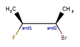
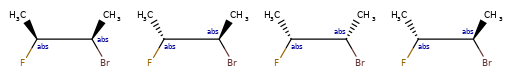
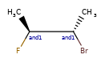
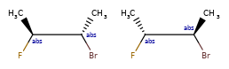
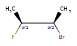
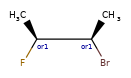
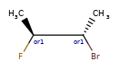

# Enhanced Stereochemistry in the RDKit
Greg Landrum (greg.landrum@t5informatics.com)

September 2018

*This is still a DRAFT*

## Overview

We are going to follow, at least for the initial implementation, the enhanced stereo representation used in V3k mol files: groups of atoms with specified stereochemistry with an `ABS`, `AND`, or `OR` marker indicating what is known. The general idea is that `AND` indicates mixtures and `OR` indicates unknown single substances.

Here are some illustrations of what the various combinations mean:

|   What's drawn  | Mixture? | What it means |
|-----------------|-----------------------------|:--------------|
| | mixture |  |
| | mixture |  |
| | mixture | |
| | single |  |
| | single |  |
| | single | |
| | mixture | |
| | single | |

## Use cases

The initial target is to not lose data on an V3k mol -> RDKit -> V3k mol round trip. Manipulation,
depiction, and searching is a secondary goal.

## Representation

Stored as a vector of `StereoGroup` objects.

A `StereoGroup` contains an enum with the type as well as pointers to the atoms involved. We will need to adjust this when atoms are removed or replaced. `StereoGroup`s are not exposed to Python, as the implementation is still tentative.

## Enumeration

The existing stereoisomer enumeration code needs to be updated to handle enhanced stereo groups correctly. This is the key piece for canonicalization and substructure searching.

We probably need to add an option to allow enumeration only of stereo groups (to ignore unspecified centers).

## Searching

This will be handled by searching in MolBundle objects produced by the enumeration code.

## Depiction

Something needs to be added to the depiction code to allow the groups to be seen.
